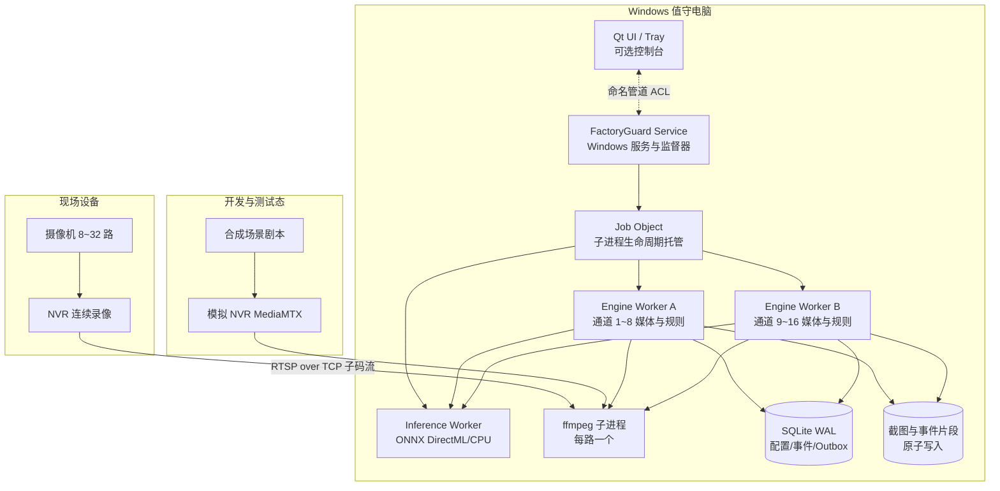

# 新项目立项设计报告：厂区智防平台（FactoryGuard）

> 文档版本：v1.2
> 成文日期：2026-10-07
> 文档状态：立项稿（Windows 可靠性与行业资料增强版）
> 目标读者：项目发起人、产品、开发、测试、实施、售后、售前
> 核心决策：核心检测能力以 Windows 后台服务运行，Qt 界面只做可选控制台；进程级隔离、看门狗、崩溃恢复、可观测性、故障演练和一键诊断为 v1.0 发布红线。

---

## 1. 项目背景

### 1.1 建设动因

中小型生产企业普遍已经建设“摄像机 + NVR”体系，但该体系主要解决连续录像和事后追溯，无法在入侵发生的第一时间主动发现、提醒和推动处置。FactoryGuard 的建设目标，是在不改变现有 NVR 录像主体地位的前提下，补齐实时区域入侵检测、告警通知和处警闭环能力。

行业内视频设备通常区分主码流与子码流：主码流用于高清连续录像，子码流用于低带宽预览；ONVIF Profile S 面向基于 IP 的视频系统，RTSP 是常见实时流传输方式。基于这些行业通行实践，本项目首版采用“NVR 连续录像 + Windows 值守电脑运行 AI 分析 + RTSP over TCP 接入子码流”的路线。

### 1.2 目标客户与核心问题

目标市场为中小型生产企业，包括加工厂、仓储、物流节点、小型园区和配套办公场所，典型规模为 8～32 路摄像机、1～2 台 NVR、1 台 Windows 值守电脑。

| 问题 | 现场表现 | 业务后果 |
| --- | --- | --- |
| 只录像、不主动告警 | NVR 保存视频，但无人实时值守 | 入侵、盗窃发生时不能立即制止 |
| 夜间/周末空窗 | 围墙、仓库、财务室、配电房无人巡查 | 风险最高的时段反而缺少有效看护 |
| 传统移动侦测可信度低 | 光影、树影、飞虫、动物、反光均可能触发 | 用户频繁收到误报后逐渐停用 |
| 商业平台过重 | 成本高、架构复杂、需要专门维护 | 小型工厂难以承担建设和运维成本 |
| 现场环境复杂 | 网络、NVR 固件、码流、驱动、权限、安全软件差异大 | 如果缺少故障隔离和诊断能力，系统容易变成“看似运行、实际失效” |

### 1.3 建设机会

FactoryGuard 以“区域入侵检测”作为首个尖刀场景，产品应同时满足以下要求：

- 与现有 NVR 协同而非替代 NVR，FactoryGuard 只保存事件片段，NVR 负责 7×24 连续录像；
- 默认使用子码流和抽帧推理，以较低网络与算力成本覆盖 8～32 路通道；
- 将模拟厂区、模拟 NVR、场景剧本和故障注入内置为研发与交付基础设施；
- 核心能力以后台 Windows 服务运行，关闭控制台界面不影响布防；
- 对断流、崩溃、GPU 失败、磁盘不足、时钟漂移、通知失败等状态做到可发现、可隔离、可恢复、可审计。

---

## 2. 产品定位

### 2.1 一句话定位

> 厂区智防平台是一套与硬盘录像机协同工作的轻量 AI 视频安防软件：用 NVR 负责连续录像，用本软件负责实时区域入侵检测、告警与处警闭环。

### 2.2 产品目标

1. 让无值守时段的围墙、仓库、车间、财务室等区域“有人闯入即报警”；
2. 误报可接受：通过区域规则、目标过滤、多帧确认、时间表、告警冷却控制误报；
3. 不碰 NVR 的录像主业：连续录像归 NVR，本软件只存事件片段；
4. 零硬件依赖完成开发、演示、测试：内置虚拟厂区与模拟 NVR；
5. 单台普通 Windows 值守电脑即可运行，10 分钟完成安装配置；
6. **服务化运行**：核心检测、通知、事件写入由 Windows 后台服务完成，关闭界面不影响布防；
7. **故障不静默**：断流、推理失败、磁盘不足、时钟漂移、进程崩溃必须可见、可追踪、可自动恢复；
8. **状态可恢复**：配置、事件、通知任务采用事务与 Outbox 模式，崩溃后不产生孤儿进程和重复/丢失告警。

### 2.3 非目标（第一版明确不做）

- 不做百万路视频平台、不做云计算底座；
- 不做通用视频管理平台的全部功能（不追求 50+ 场景）；
- 不替代 NVR 做 7×24 连续录像；
- 不自研摄像机固件、不做硬件销售；
- GB/T 28181 仅作为后续“对外对接/平台级联”的预留能力，不进首版。

---

## 3. 用户与场景

### 3.1 用户画像

| 角色 | 关注点 | 使用方式 |
| --- | --- | --- |
| 企业老板 / 厂长 | 财产安全、夜里有没有人进来、报警能不能到手机 | 手机收消息、看事件与统计 |
| 门卫 / 值班员 | 告警弹窗、现场核实、一键处理 | 值守电脑大屏、多宫格、事件确认 |
| 行政 / IT 兼职管理员 | 安装配置简单、别天天出故障 | 初始化向导、通道配置、布防时间表 |
| 实施 / 售后（乙方） | 快速部署、远程排障、可演示 | 模拟环境演示、安装包、日志诊断 |

### 3.2 典型业务流程

**夜间围墙入侵主流程：**

```text
22:00 系统按时间表自动布防
02:13 有人接近东侧围墙
02:13:20 人员越过绊线，连续 3 帧确认
02:13:21 值守电脑弹窗 + 声光警号 + 企业微信群消息（含截图）
02:14 值班员点开事件，看到实时画面与轨迹，远程喊话/现场巡查
02:20 值班员确认事件为“真实入侵”，填写处置结果并关闭
NVR 中该通道 02:13 前后完整录像可作为取证依据
```

---

## 4. 功能需求（MoSCoW）

### 4.1 Must（首版必须有）

| 编号 | 功能 | 说明 |
| --- | --- | --- |
| F1 | NVR/通道管理 | 按 NVR 品牌模板批量生成通道，支持主/子码流设置 |
| F2 | 实时多宫格预览 | 1/4/9/16 宫格，默认子码流，支持轮巡、全屏、抓拍 |
| F3 | 区域入侵规则 | 多边形电子围栏、绊线；目标类型（person/car/truck）；灵敏度 |
| F4 | 布防时间表 | 按通道/区域设置布防时段，一键布撤防，支持节假日 |
| F5 | AI 检测引擎 | 本地 ONNX 推理，支持 GPU/CPU，引擎可替换（含模拟引擎） |
| F6 | 多帧确认与告警冷却 | 连续 N 帧命中才告警，同规则冷却期不重复刷屏 |
| F7 | 事件中心 | 事件列表、状态流（待处理/确认/误报/关闭）、截图、轨迹 |
| F8 | 事件片段录像 | 告警时保存“前 10 秒 + 后 20 秒”MP4，事件内回放 |
| F9 | NVR 联动定位 | 事件记录通道号与精确时间，跳转/指引到 NVR 完整录像 |
| F10 | 消息通知 | 企业微信/钉钉群机器人 Webhook（零成本首选） |
| F11 | 用户与权限 | 登录、角色（管理员/值班员）、基础通道授权 |
| F12 | 操作审计与日志 | 登录、预览、布撤防、事件处置、导出等审计 |
| F13 | 模拟环境 | 虚拟厂区 + 模拟 NVR + 模拟检测器 + 场景剧本（见第 9 章） |
| F14 | Windows 服务、安装包与初始化向导 | NSIS 安装包；核心能力以后台 Windows 服务运行；首次启动向导；日常使用不要求管理员权限 |
| F15 | 看门狗与故障自愈 | 进程心跳、Job Object、崩溃重启、断流重连、GPU/CPU 降级 |
| F16 | 健康监测与一键诊断 | CPU、内存、磁盘、网络、进程、设备指标；事件日志、应用日志和崩溃转储打包导出 |

### 4.2 Should（第二版）

- ONVIF 云台控制；
- 邮件/短信/声光警号（网络继电器）联动；
- 徘徊、滞留、聚集、逆行检测；
- 事件统计报表（按区域/时段/类型）；
- 多 NVR、多品牌混合接入；
- 配置备份/恢复、自动诊断；
- Webhook/OpenAPI 对接门禁、广播、工单。

### 4.3 Could（后续）

- Web IOC 大屏 / 移动端 App / 小程序；
- GB/T 28181 国标接入网关与上下级平台级联；
- GA/T 1400 视图库、人车布控、轨迹检索；
- 边缘 AI 盒子、多厂区集团版、多租户。

---

## 5. 总体架构

### 5.1 架构图



### 5.2 架构原则

1. **服务优先**：检测、规则、事件、通知运行在 Windows 服务中；UI 只是观察和操作入口，关闭 UI 不影响业务。
2. **适配层隔离变化**：NVR-RTSP、文件、模拟器、未来 GB/T 28181 网关均实现统一视频源契约；ONNX、Mock、远程推理均实现统一推理契约。
3. **子码流 + 抽帧**：默认使用子码流，AI 按每路 1～5 fps 抽帧，分辨率、帧率和码率必须在验收中实测。
4. **失败隔离**：单路 FFmpeg、单个引擎、推理进程、通知渠道、UI 的故障不得拖垮其他通道，更不得影响 NVR 连续录像。
5. **无静默失败**：任何降级都要有健康状态、日志、界面提示和恢复动作；不能把“没有告警”伪装成“系统正常”。
6. **崩溃可恢复**：所有关键状态写入 SQLite 事务，通知进入 Outbox；文件采用临时文件、fsync、原子替换。
7. **最小权限**：服务使用独立服务账户和受限 ACL；日常登录用户不是管理员也能完成值班操作。
8. **可演示性内置**：模拟环境是产品一等公民，用于演示、开发、自动化验收和故障演练。

### 5.3 部署形态

| 形态 | 规模 | 拓扑 |
| --- | --- | --- |
| 标准单机（首版） | 8～32 路 | NVR 双网口或独立 VLAN，1 台 Windows 10/11 x64 值守电脑运行服务和可选 UI |
| 边缘一体机（可选） | 8～16 路 | 软件预装到工控机/迷你主机，安装包、配置、驱动和长稳报告随设备交付 |
| 试点离线兜底 | NVR 异常或无 NVR | 软件使用分片连续录像，但该模式必须明确标识，不改变“NVR 主录像”的产品定位 |
| 服务化（远期） | 多厂区/百路以上 | 独立服务器、多客户端、国标级联，超出 v1.0 范围 |

---

## 6. 模块详细设计

### 6.1 设备接入与 NVR 管理

- **品牌模板**：内置海康、大华、宇视及通用 RTSP 模板，输入 NVR IP、端口、账号、通道数后批量生成主/子码流地址；模板不得硬编码唯一 URL，允许现场覆盖。
- **通道模型**：NVR 与通道为一对多关系；通道包含名称、区域、主/子码流、启用状态、AI 开关、能力信息和最近错误。
- **连接策略**：默认 RTSP over TCP，设置连接、读取和 socket 超时；失败后指数退避并加入随机抖动，避免 NVR 重启后 32 路同时冲击。
- **状态机**：未启用、连接中、在线、降级、离线、鉴权失败、配置错误；所有状态转换记录原因码。
- **能力探测**：校验子码流是否开启、编码是否为 H.264/H.265、分辨率和时间戳是否正常；探测失败时阻止用户误以为该通道已布防。
- **NVR 重启恢复**：监督器按通道组逐步恢复，并记录恢复成功率、平均恢复时间和失败通道。

### 6.2 媒体管线

- 每路视频启动一个随包分发的 FFmpeg 子进程；禁止 shell 拼接命令，参数以数组传递，避免注入和引号问题。
- 推荐输出 rawvideo/BGR24 或经发布门禁确认的轻量编码格式；分辨率、像素格式、色彩范围必须显式指定，不依赖现场环境默认值。
- 每路管线维护有界环形帧缓冲，默认保存至少 10 秒预录帧；缓冲深度按字节预算而不是固定帧数计算。
- 帧对象包含 streamId、单调递增序号、采集时刻、媒体时间戳、宽高、步长和图像字节；UI、规则、录像不得共用可变对象。
- 队列满时允许丢弃旧预览帧，但必须输出 dropped_frames 指标；事件截图、规则判定和 Outbox 写入不能被无界队列拖垮。
- FFmpeg 异常退出后自动重启；连续失败达到阈值后熔断该通道并提示人工检查，不产生僵尸进程。
- 预览通过 Qt 视频投递链路在 UI 进程完成；UI 卡死或重启不影响后台预录和检测。

### 6.3 AI 检测引擎

- 首版使用本地 ONNX Runtime，优先 DirectML，CPU 为兜底；推理在独立 Inference Worker 中运行，与媒体进程隔离。
- 启动时执行模型加载、标签校验、输入尺寸 Warmup 和一次合成帧推理；模型未通过健康检查前不得进入布防就绪状态。
- 推理接口提交带超时的帧任务，返回 label、confidence、bbox、model_version、inference_ts 和耗时；超时按降级处理。
- 支持按通道配置目标类型、置信度、NMS、采样帧率和布防时间表；默认优先 person，车辆类目标按规则启用。
- GPU 连续失败时自动重启推理会话并进入 CPU 降帧模式；降级会影响帧率时必须明确提示，不能静默漏检。
- Mock 引擎必须走与真实引擎相同的接口、队列和结果模型，保证模拟测试覆盖真实业务链路。

### 6.4 规则引擎

- 支持多边形电子围栏、单向/双向绊线、进入/离开/穿越方向、目标类型、灵敏度、确认帧数和冷却时间。
- 使用单调时钟计算冷却和停留，使用事件发生时刻进行取证；系统时间跳变不应导致规则状态永久错乱。
- 多帧确认必须记录命中帧序号和轨迹点；未达到阈值不产生事件，但可在诊断日志中保留调试信息。
- 时间表支持星期、节假日、临时布撤防和通道级覆盖；规则引擎只在 armed 状态下产生正式事件。
- 事件去重键由通道、规则、目标关联 ID/轨迹、时间窗口组成，防止重试或重复帧造成重复告警。

### 6.5 事件中心与处警闭环

- 事件字段包含事件 ID、类型、级别、通道、区域、发生时间、规则版本、目标、置信度、截图、片段、轨迹、状态、处置人和说明。
- 状态流为待处理、已确认、误报、已关闭；每次流转写入审计，不允许物理删除正式事件。
- 事件创建、截图写入、片段任务和通知任务在同一个业务事务/Outbox 边界内协调；无法完成的片段必须标记 degraded，而不是假装完整。
- 事件列表必须展示通道健康和片段完整性，支持按时间、区域、状态、目标类型和处置人筛选。

### 6.6 录像策略（与 NVR 协同）

- NVR 是 7×24 连续录像的权威系统；FactoryGuard 默认只保存告警前 10 秒、告警后 20 秒的事件片段。
- 事件记录通道号、NVR 时间、本机时间、时钟偏差和 NVR 定位地址，确保即使软件片段损坏也能回溯 NVR。
- 片段使用滚动 fMP4/分片写入，事件结束后再封装 MP4；崩溃后可恢复已 fsync 的分片，并标记缺失区间。
- NVR 与值守电脑必须启用 NTP；时钟偏差超过阈值时产生告警，事件中同时保存两侧时间。

### 6.7 通知与联动

- 首版支持企业微信、钉钉群机器人 Webhook；通知任务由 Outbox 异步发送并按渠道限流。
- 通知状态为待发送、已发送、失败待重试、永久失败、已升级；失败原因、响应码和重试次数可审计。
- 事件产生后立即发送基础消息；截图或片段上传失败不应阻塞基础告警。
- 未确认超时可升级通知给备用联系人；二期再扩展邮件、短信、网络继电器、串口和声光设备。
- 外发 Webhook 使用 HTTPS、HMAC 签名、时间戳和 nonce，防止重放和伪造。

### 6.8 用户、权限、审计与运维

- 角色至少包含管理员和值班员；权限可按通道、区域和动作控制。
- 审计覆盖登录、预览、导出、布撤防、规则修改、事件处置、通知配置、服务重启和升级。
- 运维指标包含进程存活、CPU、内存、GPU、磁盘、网络、通道在线率、帧延迟、丢帧率、推理耗时、通知成功率。
- 一键诊断导出系统版本、驱动版本、配置摘要、最近日志、事件日志、健康样本和 minidump；导出前执行密钥、密码、Webhook 地址脱敏。

---

## 7. Windows 平台可靠性工程

### 7.1 “绝对可靠”的工程定义

本项目不把“绝对可靠”理解为永不出错，而是定义为以下不可绕过的交付红线：

1. **故障可以发生，但不能静默**：用户必须能看到当前通道、推理、存储、通知是否处于降级状态。
2. **故障必须被隔离**：单路流、单个进程、单个通知渠道失败不能拖垮其他通道。
3. **故障必须可恢复**：子进程崩溃自动重启，服务随 Windows 启动，不依赖人工登录。
4. **取证不能只依赖本软件**：NVR 始终连续录像；FactoryGuard 片段失败时仍保留 NVR 精确定位信息。
5. **状态不能含糊**：崩溃恢复后，配置、布防状态、事件、通知任务和片段完整性必须明确。

| 可靠性指标 | v1.0 目标 | 验证证据 |
| --- | --- | --- |
| Windows 启动后无用户登录 | 60 秒内服务 Running，120 秒内布防通道开始连接 | 重启测试、服务日志、健康样本 |
| Engine/Inference 崩溃恢复 | RTO ≤ 60 秒；恢复后自动继续布防 | kill 进程注入测试 |
| 单路 FFmpeg 崩溃 | 网络正常时 15 秒内开始重连 | 100 次反复 kill 测试 |
| 进程孤儿 | 0 个；服务退出/重启后子进程由 Job Object 关闭 | 进程树快照对比 |
| 告警链路延迟 | P95 ≤ 10 秒，P99 ≤ 15 秒 | 剧本时间线自动比对 |
| 通知不丢失 | Outbox 持久化后，服务崩溃不丢任务；失败自动重试 | 崩溃前/恢复后数据库比对 |
| 月度可用性 | 排除硬件、OS、现场网络和计划升级后 ≥ 99.9% | 试点健康报表 |
| 试点长稳 | 168 小时自动化无 Sev1/Sev2；30 天现场试点无未恢复故障 | 长稳报告和问题闭环 |
| NVR 影响 | FactoryGuard 任何故障不停止、锁定或改写 NVR 连续录像 | 故障演练后 NVR 录像校验 |

### 7.2 Windows 支持矩阵与硬件基线

**商业交付只支持 x64**，不在首版支持 ARM64、32 位 Windows、Windows 7/8 或非 NTFS 系统盘。

| 环境 | 支持级别 | 说明 |
| --- | --- | --- |
| Windows 10 Pro/Enterprise/IoT Enterprise 22H2 x64 | 正式支持 | 需安装当前安全更新；Home 版只做兼容性自测，不承诺 7×24 策略管控 |
| Windows 11 Pro/Enterprise/IoT Enterprise 22H2 及更新版本 | 正式支持 | 覆盖 100%/125%/150% DPI |
| Windows Server 2022 | 实验支持 | 不作为首版值守桌面推荐环境 |
| 精简 Ghost 系统、关闭服务系统、第三方管家强优化系统 | 不支持直接交付 | 必须先恢复 SCM、网络、时间和 Defender 基础能力 |

| 硬件等级 | 建议配置 | 适用能力 |
| --- | --- | --- |
| 最小配置 | Intel i5-8 代/Ryzen 5 3000 级别、16GB RAM、128GB 可用 SSD、千兆网卡 | 8～16 路、子码流、CPU/DirectML 低帧率；必须实测 |
| 推荐配置 | i5/i7 近期平台、16～32GB RAM、RTX 3050 4GB 或同级、256GB SSD | 16 路实时分析与多宫格预览 |
| 32 路配置 | i7/Ryzen 7、32GB RAM、RTX 3060 8GB 或同级、512GB SSD | 32 路、更低延迟和更高采样帧率 |
| 不建议 | 机械硬盘作为事件库、8GB RAM、双核 CPU、核显且要求 32 路 AI | 漏检、卡顿、磁盘 IO 和长稳风险不可接受 |

### 7.3 进程拓扑与职责边界

| 进程 | 职责 | 故障边界 |
| --- | --- | --- |
| FactoryGuard Service | SCM 注册、配置加载、进程监督、健康汇总、服务停止/升级 | 不含 UI 和复杂业务；自身由 Windows 服务恢复策略兜底 |
| Engine Worker | 按 NVR 或每 8 路通道运行 FFmpeg、规则、截图和片段任务 | 单个 Worker 重启只影响其通道组 |
| Inference Worker | ONNX 模型会话、DirectML/CPU 推理、结果返回 | 崩溃后媒体预览继续，自动重建推理会话 |
| ffmpeg.exe | 单路 RTSP 连接、解复用、解码和帧输出 | 崩溃只影响单路视频 |
| FactoryGuard UI/Tray | 多宫格、配置、处警、状态提示 | 崩溃不影响服务，重新打开后状态同步 |
| Diagnostic Tool | 离线收集日志和诊断包 | 不连接业务流，不保存明文密钥 |

监督器建议使用 Rust 或 C#/.NET 实现为极小原生程序，只处理生命周期和健康状态；M0 可对 pywin32 方案做 Spike，但只有通过同样的服务、Job Object、重启和安装测试，才能作为备选。

### 7.4 服务、Job Object 与看门狗

- 服务注册为 Automatic（Delayed Start 可按现场启动风暴评估），服务恢复策略设置为第一次、第二次、后续失败均重启，并在 Windows 事件日志记录。
- 服务账户优先使用虚拟服务账户 NT Service\FactoryGuard 或专用低权限服务账户，仅授予 ProgramData 数据目录、网络访问和必要 GPU 权限。
- 所有子进程加入 Job Object；设置 KILL_ON_JOB_CLOSE、进程数、CPU、内存和活动进程限制，防止监督器异常退出后留下孤儿。
- Worker 每秒发送心跳、通道统计和队列水位；连续超时后监督器先请求优雅退出，超时再强制终止。
- 重启采用指数退避和熔断：短时间内连续崩溃时降低重启频率，同时持续输出本地故障状态，避免无限刷进程。
- 监督器自身不加载模型、不解析视频、不运行第三方 Web 请求，保持短小、可审计、可独立测试。

### 7.5 故障模式与恢复矩阵

| 故障 | 检测方式 | 自动处理 | 用户影响 |
| --- | --- | --- | --- |
| UI 崩溃 | 进程退出/命名管道断开 | 不重启后台；用户可重新打开 UI | 检测和通知继续 |
| FFmpeg 崩溃 | 管道 EOF/退出码/读超时 | 清理进程、退避重连、恢复预缓冲 | 单路短暂中断 |
| NVR 重启 | 多路连接失败、拒绝连接 | 分组重连、随机退避、状态展示 | 多通道短时离线 |
| Engine 崩溃 | 心跳丢失 | Job Object 清理并重启，重建通道组 | 该组分析最多 60 秒降级 |
| Inference 崩溃 | 推理心跳/队列超时 | 重启模型，必要时 CPU 降帧 | 短时分析延迟 |
| GPU 驱动异常 | 推理错误、显存分配失败 | 重启会话、熔断 GPU、切换 CPU | 帧率下降但状态可见 |
| 网络断开 | socket/RTSP 超时 | 保持状态、重连、输出离线原因 | 实时画面暂停 |
| 磁盘接近满 | 容量水位周期检查 | 触发保留策略、停止非关键写入 | 事件和基础通知优先 |
| SQLite 异常 | 事务错误/完整性检查 | 保留错误日志、只读安全模式、恢复备份 | 阻止继续产生不一致状态 |
| 时钟漂移 | 本机/NVR/媒体时间戳对比 | 产生告警、记录偏差、修正调度基准 | 事件取证时间被明确标记 |
| 睡眠/休眠恢复 | 单调时钟和心跳跳变 | 检测 resume、重连流、重建队列 | 恢复期间短暂重连 |
| 杀毒软件锁文件 | 文件写入/重命名失败 | 临时文件重试、Defender 规则检查 | 片段可能延迟，不阻塞基础告警 |

### 7.6 启动、关机、升级与回滚

- 系统开机后无需用户登录即可启动服务；服务恢复最近一次布防状态，但必须等待通道和模型健康检查通过才显示 Ready。
- Windows 关机时，服务按顺序停止接收新事件、刷新 Outbox、关闭数据库、结束 FFmpeg；超时未退出的子进程由 Job Object 清理。
- 安装目录固定为 Program Files\FactoryGuard；运行数据固定为 ProgramData\FactoryGuard；UI 缓存写入用户 LocalAppData，安装后不向 Program Files 写数据。
- 升级先停止服务，备份数据库和配置，替换二进制，执行数据库迁移，再启动健康检查；迁移失败自动回滚二进制和数据库备份。
- NSIS 安装包必须支持静默安装、修复、卸载和保留数据；正式版本必须数字签名，避免 Defender SmartScreen 和现场安全软件误杀。
- 日常运行和初始化向导不需要管理员权限；只有安装、服务注册、防火墙规则和诊断驱动检查时提权。

### 7.7 资源治理

- 每个 Engine/Inference Worker 设置内存上限和重启阈值；内存持续增长时在非高峰时刻主动回收。
- 所有队列使用字节预算，不用无限 list；预览帧、推理帧、截图上传、通知发送分别限流。
- CPU 紧张时按优先级保留规则检测和基础通知，降低预览帧率、UI 刷新和非关键片段任务。
- GPU 显存不足时减少批大小或通道并发；连续失败后切换 CPU 低帧率模式。
- 进程指标必须包含重启次数、退出码、最后错误、队列最大等待、丢弃帧数和恢复耗时。

### 7.8 本地状态与数据一致性

- SQLite 启用 WAL 和外键约束；配置、事件、审计、Outbox 通过事务提交，禁止把关键状态仅写入 JSON 文件。
- 截图和片段先写入临时文件，完成 fsync 后原子替换；数据库只在文件 Ready 后引用。
- Outbox 保证通知任务在事务内落库；发送进程按 idempotency key 重试，避免重复通知。
- 每天执行一次 SQLite 完整性检查和备份；备份保留版本，恢复前校验 schema_version 和校验和。
- 若数据库损坏，系统进入安全只读模式并引导恢复，不允许覆盖原有损坏文件。

### 7.9 GPU、驱动与 DirectML

- 发布前建立 GPU/驱动兼容性清单，至少覆盖无独显、NVIDIA、常见核显和试点机器。
- 安装器检测 GPU、驱动版本、显存和 ONNX Runtime/DirectML 加载情况，输出可归档报告。
- 推理服务启动必须完成 Warmup；运行中周期性执行轻量健康推理。
- GPU 在 10 分钟内连续失败 3 次即熔断并切换 CPU；经过冷却窗口或驱动/服务重启后才允许再次尝试。
- CPU 模式无法满足全部通道帧率时，系统必须显示“降级运行”和受影响通道，不能静默关闭 AI。

### 7.10 网络与时间

- 摄像机/NVR 建议独立 VLAN，不对公网映射 RTSP、HTTP、ONVIF 端口；值守电脑到 NVR 走固定路由。
- 首版默认 RTSP over TCP，避免 UDP 丢包导致花屏；如需 UDP，必须在通道诊断中显示丢包和乱序。
- Windows 防火墙仅开放服务运行所需入站规则；本地命名管道不使用网络端口。
- NTP 作为验收项：Windows、NVR、试点网关保持同步；偏差超过 2 秒警告，超过 10 秒生成严重事件。
- 管线内部使用单调时钟计算超时，墙钟仅用于取证和展示；手动改时间后规则状态要重新校准。

### 7.11 Windows 系统环境与安全软件

- 电源策略设置为高性能，禁用睡眠、休眠和硬盘休眠；显示器可关闭，但主机不能进入低功耗。
- Windows Update 设置 Active Hours 或现场维护窗口；更新重启后服务必须自动恢复。
- Defender 实时扫描保留开启，对签名后的 Program Files 二进制和 ProgramData 数据目录使用最小必要排除规则；不建议关闭全部安全防护。
- 安装前卸载冲突的“开机加速/驱动管家/远程桌面劫持”类软件；远程维护优先使用系统远程工具或可信方案。
- 现场交付必须检查中文路径、空格路径、非管理员账户、域策略、DPI、多显示器和屏幕保护策略。

### 7.12 可观测性与诊断证据

- 应用日志采用结构化 JSON Lines，按天滚动并限制总大小；关键链路使用同一个 trace_id 串联帧、规则、事件、片段和通知。
- Windows Event Log 记录服务启动、停止、崩溃、恢复、升级失败和资源熔断。
- 为 FactoryGuard 进程配置 WER LocalDumps，默认收集 minidump；包含隐私的完整转储只在客户授权下启用。
- 健康面板展示 Ready/Degraded/Offline/Stopped 四级状态，并显示原因、开始时间、恢复动作和受影响通道。
- 一键诊断包应可在无网络情况下生成，包含 README、系统信息、配置摘要、日志、事件日志摘录、进程/服务状态和数据库完整性结果。

### 7.13 Windows 可靠性测试矩阵

| 类别 | 必测项目 |
| --- | --- |
| 干净系统 | Windows 10 22H2、Windows 11 22H2/23H2/24H2 干净虚拟机 |
| 权限 | 管理员安装、非管理员日常使用、域用户、通道/数据目录 ACL |
| 进程 | kill UI、Engine、Inference、FFmpeg；异常退出码；100 次循环 |
| 启动 | 开机自启、无人登录、服务恢复、手动停止/启动、启动顺序 |
| 系统状态 | 睡眠/恢复、Windows Update 重启、时间调整、DST、NTP 漂移 |
| 图形 | GPU 驱动升级/回滚、DirectML 初始化失败、显存不足、DPI 缩放 |
| 存储 | 磁盘写满、权限拒绝、杀毒锁定、坏盘预警、保留策略 |
| 安装 | 全新安装、覆盖安装、降级阻止、修复、卸载、数据保留 |
| 安全 | Defender、360/火绒等常见安全软件、签名校验、密钥脱敏 |
| 长稳 | 168 小时自动化、30 天试点、故障后自动恢复报告 |

### 7.14 发布红线

存在以下任一问题，不允许从 Release Candidate 升级为 v1.0.0：

- 服务未启动或必须登录 UI 后才开始检测；
- kill 子进程后存在孤儿、重复进程或无法自动恢复；
- GPU/CPU 降级无提示；磁盘满后数据库损坏；通知任务丢失；
- 干净 Windows 虚拟机安装失败，或日常运行持续要求管理员权限；
- 168 小时自动长稳期间出现 Sev1/Sev2 未关闭问题；
- 无法定位 NVR 连续录像，或事件时间来源不明确；
- 安装包、FFmpeg、模型、第三方组件许可证未确认。

### 7.15 关键默认参数

以下默认值是首版建议基线，允许在设备向导中按现场调整，但调整后的最终值必须写入配置、审计和验收报告。

| 参数 | 默认值 | 设计理由 |
| --- | --- | --- |
| RTSP 传输方式 | TCP | 降低弱网 UDP 丢包、乱序造成花屏和漏检的概率 |
| 连接超时 | 5 秒 | 避免单台设备阻塞整批通道启动 |
| 读帧超时 | 8 秒 | 及时发现冻结、假在线和上游异常 |
| 初始重连间隔 | 1 秒 | 短暂网络抖动时快速恢复 |
| 最大重连间隔 | 60 秒 | 长时间故障时避免连接风暴 |
| 重连退避 | 指数退避 + ±20% 抖动 | NVR 重启后 32 路不会同时冲击设备 |
| 单路熔断阈值 | 10 分钟内连续失败 10 次 | 避免无限重启，转入明确离线待处理状态 |
| Worker 心跳 | 每 2 秒一次 | 兼顾检测速度与低开销 |
| 心跳丢失处理 | 连续 3 次丢失后优雅停止，10 秒未退出则强制结束 | RTO 控制在 60 秒内 |
| 预录缓冲 | 至少 10 秒 | 支撑告警前片段取证 |
| 事件后录时长 | 20 秒 | 记录目标离开、处置触发和现场变化 |
| 多帧确认 | 连续 3 帧命中 | 平衡响应速度与瞬时误报 |
| 告警冷却 | 同通道同规则 60 秒 | 防止持续闯入时重复刷屏 |
| NTP 偏差阈值 | 2 秒警告，10 秒严重事件 | 保证事件时间与 NVR 取证可对齐 |
| 磁盘水位 | 80% 提示，90% 预警清理，95% 保护核心数据 | 优先保证数据库、基础事件和通知 |
| 日志保留 | 默认 30 天或最多 500MB，以先到者为准 | 防止日志占满事件盘 |
| 数据库备份 | 每日一次，保留最近 14 份 | 支撑误删、损坏和升级失败恢复 |
| 通知重试 | 1、5、15、60 分钟，之后升级或人工介入 | 兼顾即时性、渠道限流和故障可见性 |

### 7.16 运行状态语义

| 状态 | 含义 | 用户可见动作 |
| --- | --- | --- |
| Ready | 服务、通道、模型、存储和通知均满足当前策略 | 正常布防 |
| Degraded | 系统仍可工作，但部分通道、GPU、片段或通知能力下降 | 显示受影响对象、原因、恢复建议和开始时间 |
| Offline | 关键通道或服务组件不可用，无法保证检测结果 | 明确标识离线，不把“无事件”解释为安全 |
| Stopped | 用户或策略主动停止服务/布防 | 显示停止原因、操作者和恢复入口 |

---

## 8. 数据模型（核心实体）

| 实体 | 关键字段 |
| --- | --- |
| NvrDevice | id、name、brand、ip、port、username、secret_ref、template、firmware、capability(JSON)、status、last_error |
| Channel | id、nvr_id、channel_no、name、region_id、main_url、sub_url、ai_enabled、codec、width、height、fps、status |
| Region | id、name、parent_id、sort_order（组织/区域树） |
| DetectionModel | id、name、path、version、checksum、labels、device_policy、thresholds、warmup_status |
| Rule | id、channel_id/region_id、type、geometry(JSON)、target_labels、schedule、sensitivity、confirm_frames、cooldown、enabled、version |
| AiTask | id、channel_id、model_id、sample_fps、substream、schedule、priority、status、last_result_at |
| Event | id、dedup_key、rule_id、channel_id、level、occurred_at、nvr_time、clock_delta、payload(JSON)、snapshot_uri、clip_uri、clip_status、status |
| Track | event_id、seq、bbox、point、frame_no、ts（轨迹点） |
| NotificationOutbox | id、event_id、channel、payload_hash、status、attempts、next_retry_at、sent_at、last_error |
| ProcessInstance | id、role、pid、started_at、stopped_at、exit_code、restart_count、last_heartbeat_at、status |
| HealthSample | ts、process_role、cpu、memory、gpu_memory、queue_wait、dropped_frames、channel_count、state |
| AuditLog | actor、action、resource、result、ip、user_agent、ts、detail(JSON) |
| SchemaMigration | version、applied_at、checksum、status |
| AppSetting | key、value、updated_by、updated_at |

设计约定：

- 内部使用 UUID；NVR 通道号、国标编码等外部标识作为属性保留。
- 密码、Webhook Secret、NVR 凭据通过 DPAPI 或等价 Windows 凭据保护机制保存，数据库只保存 secret_ref。
- 所有时间字段同时记录时区；规则内部超时使用单调时钟，事件取证使用墙钟和 NVR 时间。
- clip_uri 只有在 clip_status 为 complete 后才能写入；recoverable_missing 状态必须在 UI 中提示。
- NotificationOutbox、Event、AuditLog 的写入必须有事务边界，避免崩溃后出现“事件已产生但通知任务不存在”。

---

## 9. 无真机开发：虚拟厂区与模拟 NVR

### 9.1 模拟环境目标

模拟环境不是演示脚本，而是开发、测试、交付培训和回归验收的基础设施，必须满足：

- 16 路可稳定播放的 RTSP 流，通道命名、编码、分辨率、帧率与生产模型一致；
- Mock 检测器返回带 frame_no 和时间戳的检测结果，事件、通知、录像走真实业务代码；
- 场景剧本可重复、可快进、可自动断言；
- 能主动制造断流、冻结、鉴权失败、进程崩溃和恢复场景。

### 9.2 模拟架构

```text
Scenario Runner
  → Synthetic Frame Generator
  → MediaMTX / RTSP publish
  → FFmpeg source adapter
  → Rule Engine / Event / Clip / Notification
  → Expected Timeline Assertor
```

### 9.3 模拟 NVR 规格

| 项目 | 规格 |
| --- | --- |
| 通道数 | 16 |
| 子码流 | 640×360 或 704×576，5～15fps，H.264 优先，保留 H.265 测试 |
| 主码流 | 1920×1080，25fps，用于能力探测和少量高分辨率验证 |
| 时间戳 | 合成画面叠加场景时间；同时输出 PTS，用于校验时钟和帧序号 |
| 启动方式 | 一键启动/停止，支持端口占用检测和退出码检查 |

### 9.4 画面与检测器

- 合成画面由厂区背景、围墙、道路、半透明区域、人形/车辆/动物图形和时间戳组成，支持白天、夜间、雨雪和树影干扰。
- Mock 检测器按剧本返回 label、confidence、bbox、track_id、frame_no、ts；接口字段与 ONNX 结果一致。
- 真实公开片段只用于模型验证，不替代虚拟厂区的可重复剧本。

| 模式 | 视频源 | 检测器 | 用途 |
| --- | --- | --- | --- |
| 演示模式 | 模拟 NVR | Mock | 客户演示、售前培训 |
| 开发测试模式 | 模拟 NVR/文件 | Mock/ONNX | 日常开发和 CI |
| 故障演练模式 | 模拟 NVR + 故障注入 | Mock | 服务、断流、进程和存储恢复 |
| 生产模式 | 真实 NVR RTSP | ONNX | 现场运行 |

### 9.5 虚拟厂区点位（16 路）

CH01 大门入口、CH02 大门出口、CH03/04 东围墙、CH05/06 西围墙、CH07 仓库外、CH08 仓库内、CH09 装卸区、CH10 车间入口、CH11 车间内、CH12 停车场、CH13 办公楼大厅、CH14 财务室走廊、CH15 配电房、CH16 后门。

### 9.6 场景剧本库

1. 无入侵基线；2. 夜间围墙翻越；3. 仓库非工时闯入；4. 多通道接力移动；5. 动物经过；6. 车辆违停（按规则开关）；7. 雨雪/树影干扰；8. 人员合法进入但不进入围栏；9. 告警确认和误报闭环；10. 通知失败重试和升级。

### 9.7 异常模拟

首版必须实现离线、断流重连、画面冻结、鉴权失败、NVR 重启、码率突变、PTS 跳变、延迟增大；二期扩展丢包、乱序和弱网。

每个异常包含 fault_start、fault_duration、affected_channels、expected_state、expected_events、recovery_condition。Assertor 根据预期时间线比对实际事件、状态、通知和健康样本，生成机器可读验收报告。

---

## 10. 技术选型

| 层 | 选型 | 理由 |
| --- | --- | --- |
| Windows 服务/监督器 | Rust 或 C#/.NET 最小原生实现；pywin32 仅作 M0 备选 | 原生 SCM、Job Object、崩溃恢复更可靠，监督器应保持极小 |
| 核心业务语言 | Python 3.11+ | AI 生态成熟，开发效率高；打包版本锁定在通过 Windows 发布门禁的 3.11 小版本 |
| 桌面框架 | PySide6 + Qt 6 QML | 成熟桌面框架；UI 独立进程，支持多宫格、托盘和高 DPI |
| 本地 IPC | Windows 命名管道 + JSON Lines，ACL 控制 | 不开放额外 TCP 端口，适合服务与用户会话通信 |
| 视频 | 随包 FFmpeg 二进制 | 稳定、无 Python FFmpeg 绑定，每路独立进程 |
| 推理 | ONNX Runtime（DirectML/CPU），预留 OpenVINO/TensorRT | 本地部署、免厂商锁定、GPU/CPU 可切换 |
| 检测模型 | 通用 YOLO 系 ONNX 或许可证明确的替代模型 | 首版识别 person/car/truck，可替换和精调 |
| 模拟 NVR | MediaMTX | 轻量、多协议、适合内置模拟环境；许可证需随版本复核 |
| 持久化 | SQLite + WAL + 本地文件 | 零运维，事务和崩溃恢复能力满足单机交付 |
| 密钥保护 | Windows DPAPI | 凭据与 Webhook Secret 不明文落盘 |
| 日志与诊断 | 结构化 JSON Lines、Windows Event Log、WER LocalDumps | 形成现场问题证据链 |
| 打包 | PyInstaller（onedir）+ NSIS | 适合桌面应用打包；安装、升级、回滚和签名按第 7 章强制执行 |
| 质量 | pytest + 架构自检 + Playwright/QML 测试（按可行性）+ 故障注入 | 将 Windows 可靠性纳入自动化，而非只靠人工点点点 |

技术红线：领域层不依赖 Qt；禁止把 UI 进程作为业务宿主；禁止 OpenCV 直接 RTSP 采集；禁止 FFmpeg Python 绑定；外部命令必须以参数数组启动。

---

## 11. 接口设计概要

### 11.1 内部接口（适配层契约）

- VideoSource：open、read_frame、status、shutdown、restart；错误必须包含 code、retryable、upstream_status。
- InferenceEngine：connect、submit、take_results、health_check、reset、close；submit 必须有超时和取消机制。
- RuleEvaluator：evaluate(frame, detections, arm_context) → hits / debug_trace。
- Notifier：send(event)、health、retry_failed；实现幂等发送和渠道限流。
- ClipRecorder：start_roll_buffer、open_event_window、append_frame、finalize、recover。

### 11.2 UI 与服务的本地 IPC

| 消息 | 方向 | 内容 |
| --- | --- | --- |
| HealthSnapshot | 服务 → UI | 服务版本、总体状态、通道、Worker、GPU、磁盘、通知健康 |
| ArmCommand | UI → 服务 | 通道/区域、布撤防、时间表、操作者和原因 |
| EventAction | UI → 服务 | 确认、误报、关闭、处置说明和附件 |
| ConfigChange | UI → 服务 | 配置变更草案、校验结果、版本号和回滚信息 |
| DiagnosticRequest | UI/诊断工具 → 服务 | 时间范围、是否包含转储、脱敏策略 |

所有 IPC 消息包含 request_id、schema_version、timestamp；命名管道 ACL 仅允许管理员和授权用户组访问。

### 11.3 OpenAPI（二期开放，REST 草案）

| 方法 | 路径 | 说明 |
| --- | --- | --- |
| GET | /api/v1/devices | NVR 与通道列表/状态 |
| POST | /api/v1/rules | 创建规则 |
| GET | /api/v1/events | 事件查询 |
| POST | /api/v1/events/{id}/handle | 处警 |
| POST | /api/v1/arm、/disarm | 布撤防 |
| GET | /api/v1/channels/{id}/stream | 获取短期签名播放地址 |

事件外发 Webhook 使用 HTTPS，Header 包含 timestamp、nonce、signature，接收方应校验 HMAC。

---

## 12. UI 页面规划（桌面端）

| 页面 | 内容 |
| --- | --- |
| 初始化向导 | 环境检查 → NVR 模板 → 账号与通道 → 子码流探测 → 绘制规则 → 通知配置 → 预检报告 |
| 实时监控 | 1/4/9/16 宫格、通道树、轮巡、全屏、抓拍、布撤防、通道状态 |
| 规则配置 | 在通道画面上绘制多边形/绊线、目标、时间表、确认帧、冷却、灵敏度 |
| 事件中心 | 列表、详情、截图、轨迹、片段回放、NVR 定位、状态流转和误报反馈 |
| 设备管理 | NVR/通道、主/子码流、能力、连接错误、重连状态和批量诊断 |
| 健康与诊断 | 服务、Worker、GPU、磁盘、网络、通知渠道状态；导出诊断包 |
| 系统设置 | 用户权限、模型、存储、通知、审计、模拟模式、升级与回滚 |
| Tray | 后台运行指示、当前布防/降级状态、最近告警和快速打开 UI |

UI 必须在所有页面顶部清楚展示 Ready、Degraded、Offline、Stopped；降级时显示具体原因和恢复建议，不允许只弹一次错误后消失。

---

## 13. 新项目工程结构（建议）

```text
factoryguard/
├── supervisor/                    # Rust/C# Windows 服务与监督器
│   ├── src/
│   └── tests/
├── src/factoryguard/
│   ├── domain/                    # 实体、规则几何、时间表、状态流
│   ├── application/               # 用例、事务、Outbox、命令查询
│   ├── infrastructure/
│   │   ├── media/                 # FFmpeg 进程、帧缓冲、片段恢复
│   │   ├── inference/             # ONNX、DirectML、CPU 降级
│   │   ├── persistence/           # SQLite、迁移、仓储
│   │   ├── secrets/               # DPAPI
│   │   └── notifications/
│   ├── runtime/                   # Engine Worker 入口
│   └── presentation/              # PySide6/QML、Tray、IPC 客户端
├── simulator/
│   ├── mediamtx/
│   ├── scenarios/
│   └── expected_reports/
├── packaging/windows/
│   ├── nsis/
│   ├── manifests/
│   ├── signing/
│   └── scripts/
├── diagnostics/
├── docs/
└── tests/
    ├── unit/
    ├── integration/
    ├── scenarios/
    ├── windows_fault_injection/
    └── soak/
```

架构红线由静态检查强制执行：领域层不依赖 Qt；单文件行数和函数复杂度受控；外部进程统一从 infrastructure 封装；测试不得通过跳过 Windows 进程边界来模拟服务。

---

## 14. 安全与合规

### 14.1 网络安全

- 摄像机、NVR、值守电脑使用独立 VLAN 或独立物理网络；NVR 和值守电脑不对公网映射 554、80、8000、37777 等端口。
- 修改 NVR 默认口令，按摄像机区域设置最小权限账号；FactoryGuard 保存的凭据通过 DPAPI 加密。
- 本地 IPC 使用命名管道 ACL；诊断接口不监听公网；未来 HTTP API 默认绑定 localhost 或内网受控地址。
- 防火墙规则由安装器按组件创建，卸载时清理；禁止为了省事直接关闭防火墙。

### 14.2 数据与隐私

- 视频、截图、片段涉及个人信息和企业财产信息，访问、导出、复制和删除必须审计。
- 配置保留期限、事件保留期限、片段保留周期和存储空间策略；到期自动清理并记录。
- 诊断包导出前脱敏 NVR 密码、Webhook Secret、Cookie、Authorization、手机号和群机器人地址。
- 按《网络安全法》《个人信息保护法》及等保基本要求形成交付前安全检查单。

### 14.3 软件供应链

- 安装包和关键 EXE/DLL 必须数字签名；FFmpeg、ONNX Runtime、MediaMTX、模型文件记录来源、版本和校验和。
- 依赖包使用锁文件和漏洞扫描；不从未知镜像下载二进制。
- 模型许可证、商用权限和第三方媒体素材授权必须在发布前确认。
- 升级包签名校验失败时拒绝安装，防止降级攻击和替换攻击。

---

## 15. 性能与容量估算

### 15.1 网络与码率

- 16 路子码流，单路 0.5～1 Mbps，总带宽约 8～16 Mbps；32 路约 16～32 Mbps。
- 突发码率、NVR 重启、关键帧同步都会造成短时峰值，网络验收需按平均码率 2 倍预留。
- 每路记录连接失败、重连耗时、PTS 间隔、帧间隔抖动、字节速率和丢帧。

### 15.2 推理与端到端延迟

| 环节 | 预算 |
| --- | --- |
| 帧采集与传递 | ≤ 500 ms（P95） |
| 排队与推理 | ≤ 3,000 ms（P95，按推荐硬件和采样率） |
| 规则与事件持久化 | ≤ 500 ms |
| 截图/片段任务入队 | ≤ 200 ms |
| 通知渠道到达 | ≤ 5,000 ms（P95，取决于第三方） |
| 端到端弹窗/消息 | ≤ 10,000 ms（P95） |

### 15.3 存储容量

- 事件片段按 30 秒、0.5～1 Mbps 估算，单条约 2～4MB；夜间多事件场景需按每天上限保留空间。
- SQLite、日志和诊断包单独预留，不与片段混用全部空间。
- NVR 容量公式：容量GB ≈ 码率Mbps ÷ 8 × 86400 ÷ 1000 × 路数 × 天数。16 路 2Mbps 存 30 天约 10.4TB。

### 15.4 容量降级策略

- CPU、GPU、磁盘或网络不满足推荐配置时，系统先降低通道采样帧率和预览刷新。
- 降级顺序：UI 动画/统计 → 预览刷新 → 非关键片段码率 → 通道采样帧率；规则事件和基础通知最后保留。
- 任何容量降级必须形成健康事件，并在恢复后自动回到策略值。

---

## 16. 测试策略

### 16.1 测试分层

1. **单元测试**：几何多边形、绊线方向、时间表、节假日、多帧确认、冷却、状态流、去重键、容量计算。
2. **领域集成测试**：检测结果 → 规则 → 事件 → Outbox → 通知状态，使用内存/临时 SQLite。
3. **媒体集成测试**：模拟 NVR → FFmpeg → 帧序号/时间戳 → 环形缓冲 → 截图/片段。
4. **剧本验收测试**：预期时间线与实际事件、状态、通知、健康样本自动对比。
5. **Windows 故障注入**：kill 进程、断网、磁盘满、权限拒绝、睡眠恢复、GPU 失败、杀毒锁文件。
6. **安装升级测试**：干净虚拟机、覆盖安装、修复、卸载、数据保留、迁移回滚、签名校验。
7. **长稳测试**：168 小时自动化作为 RC 门槛，30 天现场试点作为 v1.0 商业交付门槛。

### 16.2 必做故障注入

| 操作 | 通过标准 |
| --- | --- |
| 循环 100 次 kill ffmpeg.exe | 无孤儿、无无限重连、最终恢复在线 |
| kill Engine Worker | 监督器 60 秒内重启；事件和布防状态恢复 |
| kill Inference Worker | 自动重载模型；GPU/CPU 状态准确 |
| 关闭/重开 UI | 后台不中断，重新打开后状态一致 |
| 禁用网卡/恢复 | 通道离线/恢复状态正确，NVR 定位信息保留 |
| 磁盘写到阈值 | 触发保留策略，数据库不损坏 |
| 杀掉进程后立刻断电/关机 | 重启后无孤儿，Outbox 任务继续 |
| 修改系统时间/NVR 偏差 | 生成偏差事件，规则冷却不永久失效 |

### 16.3 测试环境

- CI 必须运行 Windows Runner；非 Windows Runner 只能执行纯领域单元测试，不能代替 Windows 验收。
- 每晚运行 16 路模拟环境回归，每周运行一次 24 小时 soak，发布候选运行 168 小时。
- 真机 NVR 兼容性矩阵至少记录品牌、固件、编码、子码流、鉴权、并发限制和恢复时间。

---

## 17. 里程碑与路线图

| 阶段 | 周期 | 目标 | 关键交付 |
| --- | --- | --- | --- |
| M0 立项与可靠性 Spike | 第 1 周 | 需求冻结、监督器技术选型、Windows 实验室准备 | 报告评审、服务 Spike、硬件基线、CI 任务 |
| M1 模拟环境 | 第 2～3 周 | 16 路模拟 NVR、合成画面、Mock 引擎、剧本 | 可重复场景、期望时间线、自动验收报告 |
| M2 核心闭环 | 第 4～6 周 | 服务宿主、媒体、规则、事件、片段、Outbox | 模拟环境全链路跑通，故障注入开始执行 |
| M3 通知、权限与运维 | 第 7～8 周 | 企微/钉钉、登录权限、审计、健康诊断 | 可演示 Beta、命名管道、诊断包 |
| M4 RC 硬化 | 第 9～10 周 | 安装升级、GPU/CPU、Windows 矩阵、168h soak | 签名 RC、长稳报告、问题清单闭环 |
| M5 试点与 v1.0 | 第 11～14 周 | 1～2 家现场试点和 30 天观察 | v1.0.0、交付手册、NVR 兼容性报告 |
| M6 增强 | 第 15 周起 | 徘徊/滞留、云台、更多通知、GB28181 预研 | v1.1+ |

团队建议：桌面/后端 1～2 人、监督器/Windows 工程 0.5～1 人、AI 0.5～1 人、测试/实施 0.5～1 人。若坚持 10 周内正式交付，则第 10 周只能定义为 RC，不能跳过 30 天试点直接承诺商业 v1.0。

---

## 18. 风险与应对

| 风险 | 影响 | 应对 |
| --- | --- | --- |
| 夜间误报（飞虫、树影、反光、动物） | 产品可信度下降 | person 过滤、区域几何、多帧确认、角度整改、试点样本调优 |
| NVR RTSP 并发或子码流限制 | 无法全量分析 | 选型前置、品牌模板、能力探测、必要时直连摄像机子网 |
| 真机方言差异 | 交付延期 | 兼容性矩阵、实施前 POC、GB28181 后置 |
| Windows 服务/用户会话隔离复杂 | 开机不可靠、UI 连接失败 | M0 Spike、命名管道 ACL、无人登录重启测试 |
| GPU 驱动不稳定 | 推理崩溃或漏检 | Warmup、熔断、CPU 降级、驱动版本清单 |
| 无独显性能不足 | 延迟或漏检 | 降帧、容量测试、明确最低硬件要求 |
| Defender/安全软件误杀 | 安装失败或文件锁 | 数字签名、提交信誉、原子写入、现场检查单 |
| 磁盘满/权限错误 | 片段和数据库损坏 | 水位阈值、保留策略、固定 ACL、事务与备份 |
| 时钟不同步 | 无法定位 NVR 取证 | NTP 验收、偏差事件、事件保存双时间 |
| Python 打包体积和依赖冲突 | 安装包不稳定 | onedir、锁定版本、干净 VM 安装回归 |
| 范围蔓延 | 交付失控 | 严守非目标，Release 冻结后增强进入 v1.1+ |
| 开源许可证/模型商用授权不清 | 商业化风险 | 组件清单、版本校验和、法律/商务确认 |

---

## 19. 验收标准（v1.0.0）

1. Windows 开机后无需用户登录，服务 60 秒内 Running，布防通道 120 秒内开始连接。
2. 在 Windows 10 22H2 和 Windows 11 22H2/23H2/24H2 干净虚拟机完成安装、配置、重启和卸载。
3. 管理员安装后，非管理员值班账户可以完成授权范围内的预览、布撤防和事件处置。
4. 16 路模拟 NVR 全部可管理；推荐硬件下 16 路预览和 AI 任务稳定运行。
5. 夜间围墙翻越剧本事件生成率 100%，动物经过和无入侵剧本在规定断言下 0 误报。
6. 多帧确认、冷却、节假日时间表、临时布撤防均按配置生效。
7. 事件包含通道、规则、目标、置信度、发生时间、NVR 时间、时钟偏差、截图、轨迹和处置状态。
8. 完整事件片段可回放；若存在缺失分片，clip_status 和 UI 必须明确标识，并保留 NVR 精确定位。
9. P95 告警弹窗/消息延迟 ≤ 10 秒；第三方渠道异常时 Outbox 自动重试。
10. 关闭或反复杀死 UI，不影响后台检测；UI 重开后状态一致。
11. 循环 kill FFmpeg 100 次后无孤儿进程，最终通道自动恢复。
12. kill Engine 和 Inference Worker 后 60 秒内恢复；重启次数、退出码和恢复耗时可查询。
13. NVR 重启后按退避策略批量恢复，不产生连接风暴。
14. GPU 故障时自动重启并可切换 CPU 降帧；降级状态、受影响通道和恢复建议清晰可见。
15. 磁盘到达预设水位后执行保留策略；数据库完整性检查通过。
16. 安装、覆盖升级、修复、卸载和迁移回滚均通过；安装包和二进制完成签名。
17. 诊断包可离线生成，且不包含明文密码、Webhook Secret 或完整 Cookie。
18. 168 小时自动长稳无 Sev1/Sev2；30 天试点无未恢复故障、无未授权访问。
19. FactoryGuard 故障演练后，NVR 连续录像、回放和导出不受影响。
20. 所有第三方组件许可证、模型授权和随包二进制来源有可审计记录。

---

## 20. 交付物、运维手册与责任边界

### 20.1 交付文档包

| 文档 | 内容 | 责任方 |
| --- | --- | --- |
| 项目立项报告 | 背景、范围、架构、可靠性目标和验收标准 | 产品/架构 |
| 安装部署手册 | Windows 版本、硬件、网络、NVR、权限、安装步骤和回滚步骤 | 实施 |
| 配置基线表 | NVR、通道、码流、规则、时间表、通知、存储和日志参数 | 实施/客户管理员 |
| 网络拓扑图 | 摄像机网段、NVR、值守电脑、路由、防火墙和 VLAN | 客户网络管理员/实施 |
| NVR 兼容性记录 | 品牌、型号、固件、编码、子码流、并发限制和异常说明 | 实施/测试 |
| 操作手册 | 值班员日常布撤防、预览、处警、误报标记和导出 | 实施/售后 |
| 应急处置手册 | 离线、误报激增、磁盘满、GPU 失败、通知失败、服务无法启动 | 售后 |
| 验收报告 | 安装、剧本、故障注入、长稳、安全检查、遗留问题和签字项 | 项目经理/客户 |

### 20.2 日常运行 Runbook

| 场景 | 一线动作 | 升级条件 |
| --- | --- | --- |
| 单通道离线 | 查看最近错误码、网络连通性、NVR 通道状态，等待自动重连 | 超过 3 次重连周期仍离线 |
| 多路同时离线 | 检查 NVR 电源、网络、交换机、防火墙和 NVR 服务状态 | 涉及关键区域或超过 10 分钟 |
| 告警延迟升高 | 检查推理队列、GPU、CPU、帧时间戳和通知渠道 | P95 连续 30 分钟超过 10 秒 |
| 误报增多 | 核查画面变化、目标类型、规则几何、确认帧数和冷却 | 同一规则 1 小时内误报超过 3 次 |
| 通知失败 | 查看 Outbox、Webhook 地址、签名、网络和第三方响应码 | 重试耗尽或关键事件未送达 |
| 磁盘空间不足 | 检查保留策略、异常日志、片段数量和诊断包 | 达到 90% 水位或清理失败 |
| 服务无法启动 | 检查 SCM、账户权限、ProgramData ACL、端口和事件日志 | 自动恢复策略失败 |

### 20.3 事件严重级别

| 级别 | 定义 | 响应要求 |
| --- | --- | --- |
| Sev1 | 核心检测完全不可用，或关键区域存在漏告警风险 | 立即响应，优先恢复服务并通知客户负责人 |
| Sev2 | 多通道、通知、片段或 GPU 能力降级，但系统仍部分可用 | 当日给出原因、绕行方案和恢复计划 |
| Sev3 | 单通道非关键故障、少量误报、可自动恢复问题 | 纳入日常巡检和版本修复 |
| Sev4 | 咨询、样式、非关键文档或低影响优化 | 按Backlog处理 |

### 20.4 责任矩阵（RACI）

| 工作 | 客户负责人 | 客户管理员 | 实施/售后 | FactoryGuard 团队 |
| --- | --- | --- | --- | --- |
| 现场网络与电源 | A | R | C | I |
| NVR 账号、通道和时间同步 | A | R | R | C |
| 软件安装和升级 | I | C | R/A | C |
| 规则和布防策略确认 | A | R | C | C |
| 告警值班和处警 | A | R | I | I |
| 故障诊断与补丁 | I | C | R/A | R |
| 验收签字 | A | C | R | I |

### 20.5 备份与恢复演练

- 每次正式验收前至少完成一次数据库恢复演练，验证 schema_version、事件数量、配置和 Outbox 状态。
- 每次大版本升级前生成升级前快照，至少包含配置、SQLite、许可证信息和当前版本号。
- 恢复演练必须记录 RTO、RPO、缺失内容和人工处理步骤；只“备份成功”不视为备份可靠。
- 试点期间每月进行一次诊断包离线导出和一次断流/重启演练。

---

## 21. 立项检查清单（Kickoff Checklist）

- [ ] 本报告 v1.2 评审通过并冻结 v1.0 需求范围
- [x] 建立 master/develop 分支策略：master 只保留 README、LICENSE，开发在 develop 完成
- [x] 采用 MIT License，并在 master/develop 均保留 LICENSE
- [ ] 完成 Windows 服务监督器 Rust/C# 与 pywin32 方案的技术决策
- [ ] 搭建 Windows Runner：单元测试、架构自检、模拟剧本和故障注入
- [ ] 准备 Windows 10/11 干净虚拟机和 16 路演示值守电脑基线
- [ ] 确认 FFmpeg、MediaMTX、ONNX Runtime、模型和安装依赖许可证
- [ ] 建立企业微信/钉钉机器人联调环境和失败重试测试
- [ ] 明确试点客户、真机 NVR、固件版本和网络拓扑获取计划
- [ ] 确定代码签名证书、安装包版本规则和升级回滚方案
- [ ] 将 168 小时 RC 长稳和 30 天试点纳入发布计划
- [ ] M0 任务拆解到人，确定每周可演示结果和可靠性指标

---

## 22. 行业资料与标准依据

以下资料用于支撑本报告中的协议、进程、可靠性、数据一致性和设备接入设计。实施时应以资料的最新版本为准，并在交付文档中记录实际采用版本。

### 22.1 平台与可靠性资料

| 资料 | 用途 |
| --- | --- |
| Microsoft Learn：Service Programs | Windows 服务程序、SCM 生命周期和服务职责边界 |
| Microsoft Learn：ChangeServiceConfig2W / SERVICE_FAILURE_ACTIONSW | 服务失败恢复动作配置 |
| Microsoft Learn：Job Objects / SetInformationJobObject | 子进程托管、资源限制和孤儿进程治理 |
| Microsoft Learn：Collecting User-Mode Dumps | 崩溃转储采集和故障取证 |
| Microsoft Learn：CryptProtectData | DPAPI 本地敏感数据保护 |
| ONNX Runtime：DirectML Execution Provider | DirectML 推理提供程序和 Windows GPU 加速 |
| SQLite：Write-Ahead Logging | SQLite WAL、事务与读写并发设计 |
| SQLite：How To Corrupt An SQLite Database File | 数据库损坏原因和文件写入风险规避 |

### 22.2 视频与设备协议资料

| 资料 | 用途 |
| --- | --- |
| RFC 7826 Real-Time Streaming Protocol Version 2.0 | RTSP 协议和实时流控制参考 |
| FFmpeg Protocols Documentation：RTSP | FFmpeg RTSP 接入参数、传输方式和排障参考 |
| ONVIF Profile S/T/M Specifications | 视频流、高级视频流、元数据等设备能力边界参考 |
| GB/T 28181 相关公共安全视频监控联网标准 | 二期平台级联和协议扩展预研 |
| GA/T 1400 相关公共安全视频图像信息系统标准 | 二期视图库、事件对象和平台对接预研 |

### 22.3 主要链接

- https://learn.microsoft.com/en-us/windows/win32/services/service-programs
- https://learn.microsoft.com/en-us/windows/win32/api/winsvc/nf-winsvc-changeserviceconfig2w
- https://learn.microsoft.com/en-us/windows/win32/api/winsvc/ns-winsvc-service_failure_actionsw
- https://learn.microsoft.com/en-us/windows/win32/procthread/job-objects
- https://learn.microsoft.com/en-us/windows/win32/api/jobapi2/nf-jobapi2-setinformationjobobject
- https://learn.microsoft.com/en-us/windows/win32/wer/collecting-user-mode-dumps
- https://learn.microsoft.com/en-us/windows/win32/api/dpapi/nf-dpapi-cryptprotectdata
- https://onnxruntime.ai/docs/execution-providers/DirectML-ExecutionProvider.html
- https://www.sqlite.org/wal.html
- https://www.sqlite.org/howtocorrupt.html
- https://www.rfc-editor.org/rfc/rfc7826
- https://ffmpeg.org/ffmpeg-protocols.html#rtsp
- https://www.onvif.org/profiles/specifications/

---## 附录：术语

- **NVR**：网络硬盘录像机，负责摄像机视频接入与连续录像；
- **RTSP**：实时流传输协议，本项目首版取流协议；
- **ONVIF**：开放网络视频接口标准，用于设备管理与云台；
- **GB/T 28181**：公安视频联网国家标准，用于平台级联（二期后）；
- **GA/T 1400**：公安视频图像信息应用标准（视图库）；
- **主码流/子码流**：高清存储流 / 低码率预览分析流；
- **SCM**：Windows Service Control Manager，服务注册、启动、恢复和停止管理组件；
- **Job Object**：Windows 进程生命周期和资源限制对象，用于防止孤儿进程；
- **DPAPI**：Windows 数据保护 API，用于本地凭据加密；
- **DirectML**：Windows 上的底层 GPU 推理加速 API；
- **WER**：Windows Error Reporting，用于崩溃转储和错误报告；
- **Outbox**：将业务事件和待发送通知放在同一事务中持久化的可靠性模式；
- **RTO/RPO**：恢复时间目标 / 恢复点目标；
- **Mock 检测器**：按剧本返回检测结果的模拟引擎；
- **处警闭环**：事件从产生到确认、误报或关闭的完整流程。

