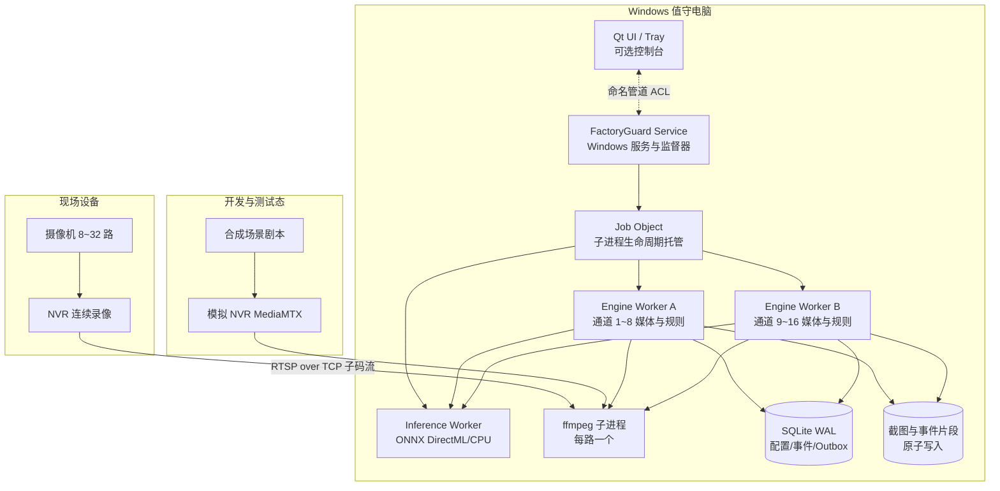
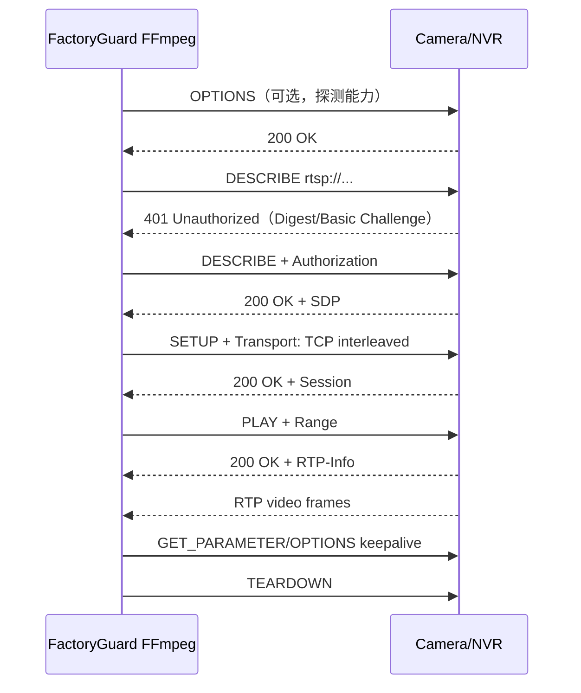

# 新项目立项设计报告：厂区智防平台（FactoryGuard）

> 文档版本：v3.0
> 成文日期：2026-10-07
> 文档状态：立项稿（供应链证明、配置事务、日志证据与 Windows 可靠性增强版）
> 目标读者：项目发起人、产品、开发、测试、实施、售后、售前
> 核心决策：核心检测能力以 Windows 后台服务运行，Qt 界面只做可选控制台；进程级隔离、看门狗、崩溃恢复、可观测性、故障演练、证据包和一键诊断为 v1.0 发布红线。
> v2.0 增补：现场勘察、SQLite 生产级 Schema、Windows 服务命令级证据包、月度/季度维护与寿命治理；任何可靠性承诺都必须有可复验证据。
> v2.1 增补：时间同步和电子证据链、配置漂移与文件完整性、72 小时/30 天长稳压力协议、冷备主机和备件切换机制。
> v2.2 增补：Windows 服务状态机、通知模板与值班升级、备份加密和密钥托管、需求—测试—证据追踪矩阵及发布授权包。
> v2.3 增补：勒索软件防护和攻击面减少、崩溃转储符号化、补丁生命周期、安全事件响应、根因分析和客户公告。
> v2.4 增补：WDAC/AppLocker 应用白名单、可移动介质、SMB/RDP/WinRM 加固、防御式编译/Fuzzing/CI、Qt UI 状态一致性与降级模式。
> v2.5 增补：硬件 SMART/温度/UPS 监测、崩溃后启动恢复、告警风暴和 Load Shedding、命名管道消息目录与会话版本契约。
> v2.6 增补：数据盘身份、GPT/NTFS、簇大小、分区对齐、盘符持久化、容量边界，以及服务依赖最小化、启动顺序、就绪确认和冷启动竞态治理。
> v2.7 增补：网卡/VLAN/MTU/交换机端口治理、网络质量连续指标、RTSP/ONVIF 会话状态机、认证锁定、重连退避、Keepalive 和媒体新鲜度检测。
> v2.8 增补：CPU/内存/提交量/句柄/线程/磁盘 I/O/GPU 连续监测、资源预算、Job Object 硬限制、泄漏判定、资源降级和故障注入。
> v2.9 增补：结构化 JSONL、序列号、日志背压、审计写入、日志滚动、脱敏、诊断包 manifest、证据哈希和导出失败演练。
> v3.0 增补：可重复构建、Authenticode 签名、SBOM/Provenance、软件供应链证明，以及配置事务、灰度发布、自动回滚和配置并发锁。

---

## 1. 项目背景

### 1.1 建设动因

中小型生产企业普遍已经建设“摄像机 + NVR”体系，但该体系主要解决连续录像和事后追溯，无法在入侵发生的第一时间主动发现、提醒和推动处置。FactoryGuard 的建设目标，是在不改变现有 NVR 录像主体地位的前提下，补齐实时区域入侵检测、告警通知和处警闭环能力。

行业内视频设备通常区分主码流与子码流：主码流用于高清连续录像，子码流用于低带宽预览；ONVIF Profile S 面向基于 IP 的视频系统，RTSP 是常见实时流传输方式。基于这些行业通行实践，本项目首版采用“NVR 连续录像 + Windows 值守电脑运行 AI 分析 + RTSP over TCP 接入子码流”的路线。

### 1.2 目标客户与核心问题

目标市场为中小型生产企业，包括加工厂、仓储、物流节点、小型园区和配套办公场所，典型规模为 8～32 路摄像机、1～2 台 NVR、1 台 Windows 值守电脑。

| 问题 | 现场表现 | 业务后果 |
| --- | --- | --- |
| 只录像、不主动告警 | NVR 保存视频，但无人实时值守 | 入侵、盗窃发生时不能立即制止 |
| 夜间/周末空窗 | 围墙、仓库、财务室、配电房无人巡查 | 风险最高的时段反而缺少有效看护 |
| 传统移动侦测可信度低 | 光影、树影、飞虫、动物、反光均可能触发 | 用户频繁收到误报后逐渐停用 |
| 商业平台过重 | 成本高、架构复杂、需要专门维护 | 小型工厂难以承担建设和运维成本 |
| 现场环境复杂 | 网络、NVR 固件、码流、驱动、权限、安全软件差异大 | 如果缺少故障隔离和诊断能力，系统容易变成“看似运行、实际失效” |

### 1.3 建设机会

FactoryGuard 以“区域入侵检测”作为首个尖刀场景，产品应同时满足以下要求：

- 与现有 NVR 协同而非替代 NVR，FactoryGuard 只保存事件片段，NVR 负责 7×24 连续录像；
- 默认使用子码流和抽帧推理，以较低网络与算力成本覆盖 8～32 路通道；
- 将模拟厂区、模拟 NVR、场景剧本和故障注入内置为研发与交付基础设施；
- 核心能力以后台 Windows 服务运行，关闭控制台界面不影响布防；
- 对断流、崩溃、GPU 失败、磁盘不足、时钟漂移、通知失败等状态做到可发现、可隔离、可恢复、可审计。

---

## 2. 产品定位

### 2.1 一句话定位

> 厂区智防平台是一套与硬盘录像机协同工作的轻量 AI 视频安防软件：用 NVR 负责连续录像，用本软件负责实时区域入侵检测、告警与处警闭环。

### 2.2 产品目标

1. 让无值守时段的围墙、仓库、车间、财务室等区域“有人闯入即报警”；
2. 误报可接受：通过区域规则、目标过滤、多帧确认、时间表、告警冷却控制误报；
3. 不碰 NVR 的录像主业：连续录像归 NVR，本软件只存事件片段；
4. 零硬件依赖完成开发、演示、测试：内置虚拟厂区与模拟 NVR；
5. 单台普通 Windows 值守电脑即可运行，10 分钟完成安装配置；
6. **服务化运行**：核心检测、通知、事件写入由 Windows 后台服务完成，关闭界面不影响布防；
7. **故障不静默**：断流、推理失败、磁盘不足、时钟漂移、进程崩溃必须可见、可追踪、可自动恢复；
8. **状态可恢复**：配置、事件、通知任务采用事务与 Outbox 模式，崩溃后不产生孤儿进程和重复/丢失告警。

### 2.3 非目标（第一版明确不做）

- 不做百万路视频平台、不做云计算底座；
- 不做通用视频管理平台的全部功能（不追求 50+ 场景）；
- 不替代 NVR 做 7×24 连续录像；
- 不自研摄像机固件、不做硬件销售；
- GB/T 28181 仅作为后续“对外对接/平台级联”的预留能力，不进首版。

---

## 3. 用户与场景

### 3.1 用户画像

| 角色 | 关注点 | 使用方式 |
| --- | --- | --- |
| 企业老板 / 厂长 | 财产安全、夜里有没有人进来、报警能不能到手机 | 手机收消息、看事件与统计 |
| 门卫 / 值班员 | 告警弹窗、现场核实、一键处理 | 值守电脑大屏、多宫格、事件确认 |
| 行政 / IT 兼职管理员 | 安装配置简单、别天天出故障 | 初始化向导、通道配置、布防时间表 |
| 实施 / 售后（乙方） | 快速部署、远程排障、可演示 | 模拟环境演示、安装包、日志诊断 |

### 3.2 典型业务流程

**夜间围墙入侵主流程：**

```text
22:00 系统按时间表自动布防
02:13 有人接近东侧围墙
02:13:20 人员越过绊线，连续 3 帧确认
02:13:21 值守电脑弹窗 + 声光警号 + 企业微信群消息（含截图）
02:14 值班员点开事件，看到实时画面与轨迹，远程喊话/现场巡查
02:20 值班员确认事件为“真实入侵”，填写处置结果并关闭
NVR 中该通道 02:13 前后完整录像可作为取证依据
```

---

## 4. 功能需求（MoSCoW）

### 4.1 Must（首版必须有）

| 编号 | 功能 | 说明 |
| --- | --- | --- |
| F1 | NVR/通道管理 | 按 NVR 品牌模板批量生成通道，支持主/子码流设置 |
| F2 | 实时多宫格预览 | 1/4/9/16 宫格，默认子码流，支持轮巡、全屏、抓拍 |
| F3 | 区域入侵规则 | 多边形电子围栏、绊线；目标类型（person/car/truck）；灵敏度 |
| F4 | 布防时间表 | 按通道/区域设置布防时段，一键布撤防，支持节假日 |
| F5 | AI 检测引擎 | 本地 ONNX 推理，支持 GPU/CPU，引擎可替换（含模拟引擎） |
| F6 | 多帧确认与告警冷却 | 连续 N 帧命中才告警，同规则冷却期不重复刷屏 |
| F7 | 事件中心 | 事件列表、状态流（待处理/确认/误报/关闭）、截图、轨迹 |
| F8 | 事件片段录像 | 告警时保存“前 10 秒 + 后 20 秒”MP4，事件内回放 |
| F9 | NVR 联动定位 | 事件记录通道号与精确时间，跳转/指引到 NVR 完整录像 |
| F10 | 消息通知 | 企业微信/钉钉群机器人 Webhook（零成本首选） |
| F11 | 用户与权限 | 登录、角色（管理员/值班员）、基础通道授权 |
| F12 | 操作审计与日志 | 登录、预览、布撤防、事件处置、导出等审计 |
| F13 | 模拟环境 | 虚拟厂区 + 模拟 NVR + 模拟检测器 + 场景剧本（见第 9 章） |
| F14 | Windows 服务、安装包与初始化向导 | NSIS 安装包；核心能力以后台 Windows 服务运行；首次启动向导；日常使用不要求管理员权限 |
| F15 | 看门狗与故障自愈 | 进程心跳、Job Object、崩溃重启、断流重连、GPU/CPU 降级 |
| F16 | 健康监测与一键诊断 | CPU、内存、磁盘、网络、进程、设备指标；事件日志、应用日志和崩溃转储打包导出 |

### 4.2 Should（第二版）

- ONVIF 云台控制；
- 邮件/短信/声光警号（网络继电器）联动；
- 徘徊、滞留、聚集、逆行检测；
- 事件统计报表（按区域/时段/类型）；
- 多 NVR、多品牌混合接入；
- 配置备份/恢复、自动诊断；
- Webhook/OpenAPI 对接门禁、广播、工单。

### 4.3 Could（后续）

- Web IOC 大屏 / 移动端 App / 小程序；
- GB/T 28181 国标接入网关与上下级平台级联；
- GA/T 1400 视图库、人车布控、轨迹检索；
- 边缘 AI 盒子、多厂区集团版、多租户。

---

## 5. 总体架构

### 5.1 架构图



### 5.2 架构原则

1. **服务优先**：检测、规则、事件、通知运行在 Windows 服务中；UI 只是观察和操作入口，关闭 UI 不影响业务。
2. **适配层隔离变化**：NVR-RTSP、文件、模拟器、未来 GB/T 28181 网关均实现统一视频源契约；ONNX、Mock、远程推理均实现统一推理契约。
3. **子码流 + 抽帧**：默认使用子码流，AI 按每路 1～5 fps 抽帧，分辨率、帧率和码率必须在验收中实测。
4. **失败隔离**：单路 FFmpeg、单个引擎、推理进程、通知渠道、UI 的故障不得拖垮其他通道，更不得影响 NVR 连续录像。
5. **无静默失败**：任何降级都要有健康状态、日志、界面提示和恢复动作；不能把“没有告警”伪装成“系统正常”。
6. **崩溃可恢复**：所有关键状态写入 SQLite 事务，通知进入 Outbox；文件采用临时文件、fsync、原子替换。
7. **最小权限**：服务使用独立服务账户和受限 ACL；日常登录用户不是管理员也能完成值班操作。
8. **可演示性内置**：模拟环境是产品一等公民，用于演示、开发、自动化验收和故障演练。

### 5.3 部署形态

| 形态 | 规模 | 拓扑 |
| --- | --- | --- |
| 标准单机（首版） | 8～32 路 | NVR 双网口或独立 VLAN，1 台 Windows 10/11 x64 值守电脑运行服务和可选 UI |
| 边缘一体机（可选） | 8～16 路 | 软件预装到工控机/迷你主机，安装包、配置、驱动和长稳报告随设备交付 |
| 试点离线兜底 | NVR 异常或无 NVR | 软件使用分片连续录像，但该模式必须明确标识，不改变“NVR 主录像”的产品定位 |
| 服务化（远期） | 多厂区/百路以上 | 独立服务器、多客户端、国标级联，超出 v1.0 范围 |

---

## 6. 模块详细设计

### 6.1 设备接入与 NVR 管理

- **品牌模板**：内置海康、大华、宇视及通用 RTSP 模板，输入 NVR IP、端口、账号、通道数后批量生成主/子码流地址；模板不得硬编码唯一 URL，允许现场覆盖。
- **通道模型**：NVR 与通道为一对多关系；通道包含名称、区域、主/子码流、启用状态、AI 开关、能力信息和最近错误。
- **连接策略**：默认 RTSP over TCP，设置连接、读取和 socket 超时；失败后指数退避并加入随机抖动，避免 NVR 重启后 32 路同时冲击。
- **状态机**：未启用、连接中、在线、降级、离线、鉴权失败、配置错误；所有状态转换记录原因码。
- **能力探测**：校验子码流是否开启、编码是否为 H.264/H.265、分辨率和时间戳是否正常；探测失败时阻止用户误以为该通道已布防。
- **NVR 重启恢复**：监督器按通道组逐步恢复，并记录恢复成功率、平均恢复时间和失败通道。

### 6.2 媒体管线

- 每路视频启动一个随包分发的 FFmpeg 子进程；禁止 shell 拼接命令，参数以数组传递，避免注入和引号问题。
- 推荐输出 rawvideo/BGR24 或经发布门禁确认的轻量编码格式；分辨率、像素格式、色彩范围必须显式指定，不依赖现场环境默认值。
- 每路管线维护有界环形帧缓冲，默认保存至少 10 秒预录帧；缓冲深度按字节预算而不是固定帧数计算。
- 帧对象包含 streamId、单调递增序号、采集时刻、媒体时间戳、宽高、步长和图像字节；UI、规则、录像不得共用可变对象。
- 队列满时允许丢弃旧预览帧，但必须输出 dropped_frames 指标；事件截图、规则判定和 Outbox 写入不能被无界队列拖垮。
- FFmpeg 异常退出后自动重启；连续失败达到阈值后熔断该通道并提示人工检查，不产生僵尸进程。
- 预览通过 Qt 视频投递链路在 UI 进程完成；UI 卡死或重启不影响后台预录和检测。

### 6.3 AI 检测引擎

- 首版使用本地 ONNX Runtime，优先 DirectML，CPU 为兜底；推理在独立 Inference Worker 中运行，与媒体进程隔离。
- 启动时执行模型加载、标签校验、输入尺寸 Warmup 和一次合成帧推理；模型未通过健康检查前不得进入布防就绪状态。
- 推理接口提交带超时的帧任务，返回 label、confidence、bbox、model_version、inference_ts 和耗时；超时按降级处理。
- 支持按通道配置目标类型、置信度、NMS、采样帧率和布防时间表；默认优先 person，车辆类目标按规则启用。
- GPU 连续失败时自动重启推理会话并进入 CPU 降帧模式；降级会影响帧率时必须明确提示，不能静默漏检。
- Mock 引擎必须走与真实引擎相同的接口、队列和结果模型，保证模拟测试覆盖真实业务链路。

### 6.4 规则引擎

- 支持多边形电子围栏、单向/双向绊线、进入/离开/穿越方向、目标类型、灵敏度、确认帧数和冷却时间。
- 使用单调时钟计算冷却和停留，使用事件发生时刻进行取证；系统时间跳变不应导致规则状态永久错乱。
- 多帧确认必须记录命中帧序号和轨迹点；未达到阈值不产生事件，但可在诊断日志中保留调试信息。
- 时间表支持星期、节假日、临时布撤防和通道级覆盖；规则引擎只在 armed 状态下产生正式事件。
- 事件去重键由通道、规则、目标关联 ID/轨迹、时间窗口组成，防止重试或重复帧造成重复告警。

### 6.5 事件中心与处警闭环

- 事件字段包含事件 ID、类型、级别、通道、区域、发生时间、规则版本、目标、置信度、截图、片段、轨迹、状态、处置人和说明。
- 状态流为待处理、已确认、误报、已关闭；每次流转写入审计，不允许物理删除正式事件。
- 事件创建、截图写入、片段任务和通知任务在同一个业务事务/Outbox 边界内协调；无法完成的片段必须标记 degraded，而不是假装完整。
- 事件列表必须展示通道健康和片段完整性，支持按时间、区域、状态、目标类型和处置人筛选。

### 6.6 录像策略（与 NVR 协同）

- NVR 是 7×24 连续录像的权威系统；FactoryGuard 默认只保存告警前 10 秒、告警后 20 秒的事件片段。
- 事件记录通道号、NVR 时间、本机时间、时钟偏差和 NVR 定位地址，确保即使软件片段损坏也能回溯 NVR。
- 片段使用滚动 fMP4/分片写入，事件结束后再封装 MP4；崩溃后可恢复已 fsync 的分片，并标记缺失区间。
- NVR 与值守电脑必须启用 NTP；时钟偏差超过阈值时产生告警，事件中同时保存两侧时间。

### 6.7 通知与联动

- 首版支持企业微信、钉钉群机器人 Webhook；通知任务由 Outbox 异步发送并按渠道限流。
- 通知状态为待发送、已发送、失败待重试、永久失败、已升级；失败原因、响应码和重试次数可审计。
- 事件产生后立即发送基础消息；截图或片段上传失败不应阻塞基础告警。
- 未确认超时可升级通知给备用联系人；二期再扩展邮件、短信、网络继电器、串口和声光设备。
- 外发 Webhook 使用 HTTPS、HMAC 签名、时间戳和 nonce，防止重放和伪造。

### 6.8 用户、权限、审计与运维

- 角色至少包含管理员和值班员；权限可按通道、区域和动作控制。
- 审计覆盖登录、预览、导出、布撤防、规则修改、事件处置、通知配置、服务重启和升级。
- 运维指标包含进程存活、CPU、内存、GPU、磁盘、网络、通道在线率、帧延迟、丢帧率、推理耗时、通知成功率。
- 一键诊断导出系统版本、驱动版本、配置摘要、最近日志、事件日志、健康样本和 minidump；导出前执行密钥、密码、Webhook 地址脱敏。

---

## 7. Windows 平台可靠性工程

### 7.1 “绝对可靠”的工程定义

本项目不把“绝对可靠”理解为永不出错，而是定义为以下不可绕过的交付红线：

1. **故障可以发生，但不能静默**：用户必须能看到当前通道、推理、存储、通知是否处于降级状态。
2. **故障必须被隔离**：单路流、单个进程、单个通知渠道失败不能拖垮其他通道。
3. **故障必须可恢复**：子进程崩溃自动重启，服务随 Windows 启动，不依赖人工登录。
4. **取证不能只依赖本软件**：NVR 始终连续录像；FactoryGuard 片段失败时仍保留 NVR 精确定位信息。
5. **状态不能含糊**：崩溃恢复后，配置、布防状态、事件、通知任务和片段完整性必须明确。

| 可靠性指标 | v1.0 目标 | 验证证据 |
| --- | --- | --- |
| Windows 启动后无用户登录 | 60 秒内服务 Running，120 秒内布防通道开始连接 | 重启测试、服务日志、健康样本 |
| Engine/Inference 崩溃恢复 | RTO ≤ 60 秒；恢复后自动继续布防 | kill 进程注入测试 |
| 单路 FFmpeg 崩溃 | 网络正常时 15 秒内开始重连 | 100 次反复 kill 测试 |
| 进程孤儿 | 0 个；服务退出/重启后子进程由 Job Object 关闭 | 进程树快照对比 |
| 告警链路延迟 | P95 ≤ 10 秒，P99 ≤ 15 秒 | 剧本时间线自动比对 |
| 通知不丢失 | Outbox 持久化后，服务崩溃不丢任务；失败自动重试 | 崩溃前/恢复后数据库比对 |
| 月度可用性 | 排除硬件、OS、现场网络和计划升级后 ≥ 99.9% | 试点健康报表 |
| 试点长稳 | 168 小时自动化无 Sev1/Sev2；30 天现场试点无未恢复故障 | 长稳报告和问题闭环 |
| NVR 影响 | FactoryGuard 任何故障不停止、锁定或改写 NVR 连续录像 | 故障演练后 NVR 录像校验 |

### 7.2 Windows 支持矩阵与硬件基线

**商业交付只支持 x64**，不在首版支持 ARM64、32 位 Windows、Windows 7/8 或非 NTFS 系统盘。

| 环境 | 支持级别 | 说明 |
| --- | --- | --- |
| Windows 10 Pro/Enterprise/IoT Enterprise 22H2 x64 | 正式支持 | 需安装当前安全更新；Home 版只做兼容性自测，不承诺 7×24 策略管控 |
| Windows 11 Pro/Enterprise/IoT Enterprise 22H2 及更新版本 | 正式支持 | 覆盖 100%/125%/150% DPI |
| Windows Server 2022 | 实验支持 | 不作为首版值守桌面推荐环境 |
| 精简 Ghost 系统、关闭服务系统、第三方管家强优化系统 | 不支持直接交付 | 必须先恢复 SCM、网络、时间和 Defender 基础能力 |

| 硬件等级 | 建议配置 | 适用能力 |
| --- | --- | --- |
| 最小配置 | Intel i5-8 代/Ryzen 5 3000 级别、16GB RAM、128GB 可用 SSD、千兆网卡 | 8～16 路、子码流、CPU/DirectML 低帧率；必须实测 |
| 推荐配置 | i5/i7 近期平台、16～32GB RAM、RTX 3050 4GB 或同级、256GB SSD | 16 路实时分析与多宫格预览 |
| 32 路配置 | i7/Ryzen 7、32GB RAM、RTX 3060 8GB 或同级、512GB SSD | 32 路、更低延迟和更高采样帧率 |
| 不建议 | 机械硬盘作为事件库、8GB RAM、双核 CPU、核显且要求 32 路 AI | 漏检、卡顿、磁盘 IO 和长稳风险不可接受 |

### 7.3 进程拓扑与职责边界

| 进程 | 职责 | 故障边界 |
| --- | --- | --- |
| FactoryGuard Service | SCM 注册、配置加载、进程监督、健康汇总、服务停止/升级 | 不含 UI 和复杂业务；自身由 Windows 服务恢复策略兜底 |
| Engine Worker | 按 NVR 或每 8 路通道运行 FFmpeg、规则、截图和片段任务 | 单个 Worker 重启只影响其通道组 |
| Inference Worker | ONNX 模型会话、DirectML/CPU 推理、结果返回 | 崩溃后媒体预览继续，自动重建推理会话 |
| ffmpeg.exe | 单路 RTSP 连接、解复用、解码和帧输出 | 崩溃只影响单路视频 |
| FactoryGuard UI/Tray | 多宫格、配置、处警、状态提示 | 崩溃不影响服务，重新打开后状态同步 |
| Diagnostic Tool | 离线收集日志和诊断包 | 不连接业务流，不保存明文密钥 |

监督器建议使用 Rust 或 C#/.NET 实现为极小原生程序，只处理生命周期和健康状态；M0 可对 pywin32 方案做 Spike，但只有通过同样的服务、Job Object、重启和安装测试，才能作为备选。

### 7.4 服务、Job Object 与看门狗

- 服务注册为 Automatic（Delayed Start 可按现场启动风暴评估），服务恢复策略设置为第一次、第二次、后续失败均重启，并在 Windows 事件日志记录。
- 服务账户优先使用虚拟服务账户 NT Service\FactoryGuard 或专用低权限服务账户，仅授予独立数据盘目录、网络访问和必要 GPU 权限。
- 所有子进程加入 Job Object；设置 KILL_ON_JOB_CLOSE、进程数、CPU、内存和活动进程限制，防止监督器异常退出后留下孤儿。
- Worker 每秒发送心跳、通道统计和队列水位；连续超时后监督器先请求优雅退出，超时再强制终止。
- 重启采用指数退避和熔断：短时间内连续崩溃时降低重启频率，同时持续输出本地故障状态，避免无限刷进程。
- 监督器自身不加载模型、不解析视频、不运行第三方 Web 请求，保持短小、可审计、可独立测试。

### 7.5 故障模式与恢复矩阵

| 故障 | 检测方式 | 自动处理 | 用户影响 |
| --- | --- | --- | --- |
| UI 崩溃 | 进程退出/命名管道断开 | 不重启后台；用户可重新打开 UI | 检测和通知继续 |
| FFmpeg 崩溃 | 管道 EOF/退出码/读超时 | 清理进程、退避重连、恢复预缓冲 | 单路短暂中断 |
| NVR 重启 | 多路连接失败、拒绝连接 | 分组重连、随机退避、状态展示 | 多通道短时离线 |
| Engine 崩溃 | 心跳丢失 | Job Object 清理并重启，重建通道组 | 该组分析最多 60 秒降级 |
| Inference 崩溃 | 推理心跳/队列超时 | 重启模型，必要时 CPU 降帧 | 短时分析延迟 |
| GPU 驱动异常 | 推理错误、显存分配失败 | 重启会话、熔断 GPU、切换 CPU | 帧率下降但状态可见 |
| 网络断开 | socket/RTSP 超时 | 保持状态、重连、输出离线原因 | 实时画面暂停 |
| 磁盘接近满 | 容量水位周期检查 | 触发保留策略、停止非关键写入 | 事件和基础通知优先 |
| SQLite 异常 | 事务错误/完整性检查 | 保留错误日志、只读安全模式、恢复备份 | 阻止继续产生不一致状态 |
| 时钟漂移 | 本机/NVR/媒体时间戳对比 | 产生告警、记录偏差、修正调度基准 | 事件取证时间被明确标记 |
| 睡眠/休眠恢复 | 单调时钟和心跳跳变 | 检测 resume、重连流、重建队列 | 恢复期间短暂重连 |
| 杀毒软件锁文件 | 文件写入/重命名失败 | 临时文件重试、Defender 规则检查 | 片段可能延迟，不阻塞基础告警 |

### 7.6 启动、关机、升级与回滚

- 系统开机后无需用户登录即可启动服务；服务恢复最近一次布防状态，但必须等待通道和模型健康检查通过才显示 Ready。
- Windows 关机时，服务按顺序停止接收新事件、刷新 Outbox、关闭数据库、结束 FFmpeg；超时未退出的子进程由 Job Object 清理。
- 安装目录固定为 Program Files\FactoryGuard；活跃运行数据固定为 V:\FactoryGuard；UI 缓存写入用户 LocalAppData，安装后不向 Program Files 写数据。
- 升级先停止服务，备份数据库和配置，替换二进制，执行数据库迁移，再启动健康检查；迁移失败自动回滚二进制和数据库备份。
- NSIS 安装包必须支持静默安装、修复、卸载和保留数据；正式版本必须数字签名，避免 Defender SmartScreen 和现场安全软件误杀。
- 日常运行和初始化向导不需要管理员权限；只有安装、服务注册、防火墙规则和诊断驱动检查时提权。

### 7.7 资源治理

- 每个 Engine/Inference Worker 设置内存上限和重启阈值；内存持续增长时在非高峰时刻主动回收。
- 所有队列使用字节预算，不用无限 list；预览帧、推理帧、截图上传、通知发送分别限流。
- CPU 紧张时按优先级保留规则检测和基础通知，降低预览帧率、UI 刷新和非关键片段任务。
- GPU 显存不足时减少批大小或通道并发；连续失败后切换 CPU 低帧率模式。
- 进程指标必须包含重启次数、退出码、最后错误、队列最大等待、丢弃帧数和恢复耗时。

### 7.8 本地状态与数据一致性

- SQLite 启用 WAL 和外键约束；配置、事件、审计、Outbox 通过事务提交，禁止把关键状态仅写入 JSON 文件。
- 截图和片段先写入临时文件，完成 fsync 后原子替换；数据库只在文件 Ready 后引用。
- Outbox 保证通知任务在事务内落库；发送进程按 idempotency key 重试，避免重复通知。
- 每天执行一次 SQLite 完整性检查和备份；备份保留版本，恢复前校验 schema_version 和校验和。
- 若数据库损坏，系统进入安全只读模式并引导恢复，不允许覆盖原有损坏文件。

### 7.9 GPU、驱动与 DirectML

- 发布前建立 GPU/驱动兼容性清单，至少覆盖无独显、NVIDIA、常见核显和试点机器。
- 安装器检测 GPU、驱动版本、显存和 ONNX Runtime/DirectML 加载情况，输出可归档报告。
- 推理服务启动必须完成 Warmup；运行中周期性执行轻量健康推理。
- GPU 在 10 分钟内连续失败 3 次即熔断并切换 CPU；经过冷却窗口或驱动/服务重启后才允许再次尝试。
- CPU 模式无法满足全部通道帧率时，系统必须显示“降级运行”和受影响通道，不能静默关闭 AI。

### 7.10 网络与时间

- 摄像机/NVR 建议独立 VLAN，不对公网映射 RTSP、HTTP、ONVIF 端口；值守电脑到 NVR 走固定路由。
- 首版默认 RTSP over TCP，避免 UDP 丢包导致花屏；如需 UDP，必须在通道诊断中显示丢包和乱序。
- Windows 防火墙仅开放服务运行所需入站规则；本地命名管道不使用网络端口。
- NTP 作为验收项：Windows、NVR、试点网关保持同步；偏差超过 2 秒警告，超过 10 秒生成严重事件。
- 管线内部使用单调时钟计算超时，墙钟仅用于取证和展示；手动改时间后规则状态要重新校准。

### 7.11 Windows 系统环境与安全软件

- 电源策略设置为高性能，禁用睡眠、休眠和硬盘休眠；显示器可关闭，但主机不能进入低功耗。
- Windows Update 设置 Active Hours 或现场维护窗口；更新重启后服务必须自动恢复。
- Defender 实时扫描保留开启，对签名后的 Program Files 二进制和 独立数据盘数据目录使用最小必要排除规则；不建议关闭全部安全防护。
- 安装前卸载冲突的“开机加速/驱动管家/远程桌面劫持”类软件；远程维护优先使用系统远程工具或可信方案。
- 现场交付必须检查中文路径、空格路径、非管理员账户、域策略、DPI、多显示器和屏幕保护策略。

### 7.12 可观测性与诊断证据

- 应用日志采用结构化 JSON Lines，按天滚动并限制总大小；关键链路使用同一个 trace_id 串联帧、规则、事件、片段和通知。
- Windows Event Log 记录服务启动、停止、崩溃、恢复、升级失败和资源熔断。
- 为 FactoryGuard 进程配置 WER LocalDumps，默认收集 minidump；包含隐私的完整转储只在客户授权下启用。
- 健康面板展示 Ready/Degraded/Offline/Stopped 四级状态，并显示原因、开始时间、恢复动作和受影响通道。
- 一键诊断包应可在无网络情况下生成，包含 README、系统信息、配置摘要、日志、事件日志摘录、进程/服务状态和数据库完整性结果。

### 7.13 Windows 可靠性测试矩阵

| 类别 | 必测项目 |
| --- | --- |
| 干净系统 | Windows 10 22H2、Windows 11 22H2/23H2/24H2 干净虚拟机 |
| 权限 | 管理员安装、非管理员日常使用、域用户、通道/数据目录 ACL |
| 进程 | kill UI、Engine、Inference、FFmpeg；异常退出码；100 次循环 |
| 启动 | 开机自启、无人登录、服务恢复、手动停止/启动、启动顺序 |
| 系统状态 | 睡眠/恢复、Windows Update 重启、时间调整、DST、NTP 漂移 |
| 图形 | GPU 驱动升级/回滚、DirectML 初始化失败、显存不足、DPI 缩放 |
| 存储 | 磁盘写满、权限拒绝、杀毒锁定、坏盘预警、保留策略 |
| 安装 | 全新安装、覆盖安装、降级阻止、修复、卸载、数据保留 |
| 安全 | Defender、360/火绒等常见安全软件、签名校验、密钥脱敏 |
| 长稳 | 168 小时自动化、30 天试点、故障后自动恢复报告 |

### 7.14 发布红线

存在以下任一问题，不允许从 Release Candidate 升级为 v1.0.0：

- 服务未启动或必须登录 UI 后才开始检测；
- kill 子进程后存在孤儿、重复进程或无法自动恢复；
- GPU/CPU 降级无提示；磁盘满后数据库损坏；通知任务丢失；
- 干净 Windows 虚拟机安装失败，或日常运行持续要求管理员权限；
- 168 小时自动长稳期间出现 Sev1/Sev2 未关闭问题；
- 无法定位 NVR 连续录像，或事件时间来源不明确；
- 安装包、FFmpeg、模型、第三方组件许可证未确认。

### 7.15 关键默认参数

以下默认值是首版建议基线，允许在设备向导中按现场调整，但调整后的最终值必须写入配置、审计和验收报告。

| 参数 | 默认值 | 设计理由 |
| --- | --- | --- |
| RTSP 传输方式 | TCP | 降低弱网 UDP 丢包、乱序造成花屏和漏检的概率 |
| 连接超时 | 5 秒 | 避免单台设备阻塞整批通道启动 |
| 读帧超时 | 8 秒 | 及时发现冻结、假在线和上游异常 |
| 初始重连间隔 | 1 秒 | 短暂网络抖动时快速恢复 |
| 最大重连间隔 | 60 秒 | 长时间故障时避免连接风暴 |
| 重连退避 | 指数退避 + ±20% 抖动 | NVR 重启后 32 路不会同时冲击设备 |
| 单路熔断阈值 | 10 分钟内连续失败 10 次 | 避免无限重启，转入明确离线待处理状态 |
| Worker 心跳 | 每 2 秒一次 | 兼顾检测速度与低开销 |
| 心跳丢失处理 | 连续 3 次丢失后优雅停止，10 秒未退出则强制结束 | RTO 控制在 60 秒内 |
| 预录缓冲 | 至少 10 秒 | 支撑告警前片段取证 |
| 事件后录时长 | 20 秒 | 记录目标离开、处置触发和现场变化 |
| 多帧确认 | 连续 3 帧命中 | 平衡响应速度与瞬时误报 |
| 告警冷却 | 同通道同规则 60 秒 | 防止持续闯入时重复刷屏 |
| NTP 偏差阈值 | 2 秒警告，10 秒严重事件 | 保证事件时间与 NVR 取证可对齐 |
| 磁盘水位 | 80% 提示，90% 预警清理，95% 保护核心数据 | 优先保证数据库、基础事件和通知 |
| 日志保留 | 默认 30 天或最多 500MB，以先到者为准 | 防止日志占满事件盘 |
| 数据库备份 | 每日一次，保留最近 14 份 | 支撑误删、损坏和升级失败恢复 |
| 通知重试 | 1、5、15、60 分钟，之后升级或人工介入 | 兼顾即时性、渠道限流和故障可见性 |

### 7.16 运行状态语义

| 状态 | 含义 | 用户可见动作 |
| --- | --- | --- |
| Ready | 服务、通道、模型、存储和通知均满足当前策略 | 正常布防 |
| Degraded | 系统仍可工作，但部分通道、GPU、片段或通知能力下降 | 显示受影响对象、原因、恢复建议和开始时间 |
| Offline | 关键通道或服务组件不可用，无法保证检测结果 | 明确标识离线，不把“无事件”解释为安全 |
| Stopped | 用户或策略主动停止服务/布防 | 显示停止原因、操作者和恢复入口 |

---

## 8. 数据模型（核心实体）

| 实体 | 关键字段 |
| --- | --- |
| NvrDevice | id、name、brand、ip、port、username、secret_ref、template、firmware、capability(JSON)、status、last_error |
| Channel | id、nvr_id、channel_no、name、region_id、main_url、sub_url、ai_enabled、codec、width、height、fps、status |
| Region | id、name、parent_id、sort_order（组织/区域树） |
| DetectionModel | id、name、path、version、checksum、labels、device_policy、thresholds、warmup_status |
| Rule | id、channel_id/region_id、type、geometry(JSON)、target_labels、schedule、sensitivity、confirm_frames、cooldown、enabled、version |
| AiTask | id、channel_id、model_id、sample_fps、substream、schedule、priority、status、last_result_at |
| Event | id、dedup_key、rule_id、channel_id、level、occurred_at、nvr_time、clock_delta、payload(JSON)、snapshot_uri、clip_uri、clip_status、status |
| Track | event_id、seq、bbox、point、frame_no、ts（轨迹点） |
| NotificationOutbox | id、event_id、channel、payload_hash、status、attempts、next_retry_at、sent_at、last_error |
| ProcessInstance | id、role、pid、started_at、stopped_at、exit_code、restart_count、last_heartbeat_at、status |
| HealthSample | ts、process_role、cpu、memory、gpu_memory、queue_wait、dropped_frames、channel_count、state |
| AuditLog | actor、action、resource、result、ip、user_agent、ts、detail(JSON) |
| SchemaMigration | version、applied_at、checksum、status |
| AppSetting | key、value、updated_by、updated_at |

设计约定：

- 内部使用 UUID；NVR 通道号、国标编码等外部标识作为属性保留。
- 密码、Webhook Secret、NVR 凭据通过 DPAPI 或等价 Windows 凭据保护机制保存，数据库只保存 secret_ref。
- 所有时间字段同时记录时区；规则内部超时使用单调时钟，事件取证使用墙钟和 NVR 时间。
- clip_uri 只有在 clip_status 为 complete 后才能写入；recoverable_missing 状态必须在 UI 中提示。
- NotificationOutbox、Event、AuditLog 的写入必须有事务边界，避免崩溃后出现“事件已产生但通知任务不存在”。

---

## 9. 无真机开发：虚拟厂区与模拟 NVR

### 9.1 模拟环境目标

模拟环境不是演示脚本，而是开发、测试、交付培训和回归验收的基础设施，必须满足：

- 16 路可稳定播放的 RTSP 流，通道命名、编码、分辨率、帧率与生产模型一致；
- Mock 检测器返回带 frame_no 和时间戳的检测结果，事件、通知、录像走真实业务代码；
- 场景剧本可重复、可快进、可自动断言；
- 能主动制造断流、冻结、鉴权失败、进程崩溃和恢复场景。

### 9.2 模拟架构

```text
Scenario Runner
  → Synthetic Frame Generator
  → MediaMTX / RTSP publish
  → FFmpeg source adapter
  → Rule Engine / Event / Clip / Notification
  → Expected Timeline Assertor
```

### 9.3 模拟 NVR 规格

| 项目 | 规格 |
| --- | --- |
| 通道数 | 16 |
| 子码流 | 640×360 或 704×576，5～15fps，H.264 优先，保留 H.265 测试 |
| 主码流 | 1920×1080，25fps，用于能力探测和少量高分辨率验证 |
| 时间戳 | 合成画面叠加场景时间；同时输出 PTS，用于校验时钟和帧序号 |
| 启动方式 | 一键启动/停止，支持端口占用检测和退出码检查 |

### 9.4 画面与检测器

- 合成画面由厂区背景、围墙、道路、半透明区域、人形/车辆/动物图形和时间戳组成，支持白天、夜间、雨雪和树影干扰。
- Mock 检测器按剧本返回 label、confidence、bbox、track_id、frame_no、ts；接口字段与 ONNX 结果一致。
- 真实公开片段只用于模型验证，不替代虚拟厂区的可重复剧本。

| 模式 | 视频源 | 检测器 | 用途 |
| --- | --- | --- | --- |
| 演示模式 | 模拟 NVR | Mock | 客户演示、售前培训 |
| 开发测试模式 | 模拟 NVR/文件 | Mock/ONNX | 日常开发和 CI |
| 故障演练模式 | 模拟 NVR + 故障注入 | Mock | 服务、断流、进程和存储恢复 |
| 生产模式 | 真实 NVR RTSP | ONNX | 现场运行 |

### 9.5 虚拟厂区点位（16 路）

CH01 大门入口、CH02 大门出口、CH03/04 东围墙、CH05/06 西围墙、CH07 仓库外、CH08 仓库内、CH09 装卸区、CH10 车间入口、CH11 车间内、CH12 停车场、CH13 办公楼大厅、CH14 财务室走廊、CH15 配电房、CH16 后门。

### 9.6 场景剧本库

1. 无入侵基线；2. 夜间围墙翻越；3. 仓库非工时闯入；4. 多通道接力移动；5. 动物经过；6. 车辆违停（按规则开关）；7. 雨雪/树影干扰；8. 人员合法进入但不进入围栏；9. 告警确认和误报闭环；10. 通知失败重试和升级。

### 9.7 异常模拟

首版必须实现离线、断流重连、画面冻结、鉴权失败、NVR 重启、码率突变、PTS 跳变、延迟增大；二期扩展丢包、乱序和弱网。

每个异常包含 fault_start、fault_duration、affected_channels、expected_state、expected_events、recovery_condition。Assertor 根据预期时间线比对实际事件、状态、通知和健康样本，生成机器可读验收报告。

---

## 10. 技术选型

| 层 | 选型 | 理由 |
| --- | --- | --- |
| Windows 服务/监督器 | Rust 或 C#/.NET 最小原生实现；pywin32 仅作 M0 备选 | 原生 SCM、Job Object、崩溃恢复更可靠，监督器应保持极小 |
| 核心业务语言 | Python 3.11+ | AI 生态成熟，开发效率高；打包版本锁定在通过 Windows 发布门禁的 3.11 小版本 |
| 桌面框架 | PySide6 + Qt 6 QML | 成熟桌面框架；UI 独立进程，支持多宫格、托盘和高 DPI |
| 本地 IPC | Windows 命名管道 + JSON Lines，ACL 控制 | 不开放额外 TCP 端口，适合服务与用户会话通信 |
| 视频 | 随包 FFmpeg 二进制 | 稳定、无 Python FFmpeg 绑定，每路独立进程 |
| 推理 | ONNX Runtime（DirectML/CPU），预留 OpenVINO/TensorRT | 本地部署、免厂商锁定、GPU/CPU 可切换 |
| 检测模型 | 通用 YOLO 系 ONNX 或许可证明确的替代模型 | 首版识别 person/car/truck，可替换和精调 |
| 模拟 NVR | MediaMTX | 轻量、多协议、适合内置模拟环境；许可证需随版本复核 |
| 持久化 | SQLite + WAL + 本地文件 | 零运维，事务和崩溃恢复能力满足单机交付 |
| 密钥保护 | Windows DPAPI | 凭据与 Webhook Secret 不明文落盘 |
| 日志与诊断 | 结构化 JSON Lines、Windows Event Log、WER LocalDumps | 形成现场问题证据链 |
| 打包 | PyInstaller（onedir）+ NSIS | 适合桌面应用打包；安装、升级、回滚和签名按第 7 章强制执行 |
| 质量 | pytest + 架构自检 + Playwright/QML 测试（按可行性）+ 故障注入 | 将 Windows 可靠性纳入自动化，而非只靠人工点点点 |

技术红线：领域层不依赖 Qt；禁止把 UI 进程作为业务宿主；禁止 OpenCV 直接 RTSP 采集；禁止 FFmpeg Python 绑定；外部命令必须以参数数组启动。

---

## 11. 接口设计概要

### 11.1 内部接口（适配层契约）

- VideoSource：open、read_frame、status、shutdown、restart；错误必须包含 code、retryable、upstream_status。
- InferenceEngine：connect、submit、take_results、health_check、reset、close；submit 必须有超时和取消机制。
- RuleEvaluator：evaluate(frame, detections, arm_context) → hits / debug_trace。
- Notifier：send(event)、health、retry_failed；实现幂等发送和渠道限流。
- ClipRecorder：start_roll_buffer、open_event_window、append_frame、finalize、recover。

### 11.2 UI 与服务的本地 IPC

| 消息 | 方向 | 内容 |
| --- | --- | --- |
| HealthSnapshot | 服务 → UI | 服务版本、总体状态、通道、Worker、GPU、磁盘、通知健康 |
| ArmCommand | UI → 服务 | 通道/区域、布撤防、时间表、操作者和原因 |
| EventAction | UI → 服务 | 确认、误报、关闭、处置说明和附件 |
| ConfigChange | UI → 服务 | 配置变更草案、校验结果、版本号和回滚信息 |
| DiagnosticRequest | UI/诊断工具 → 服务 | 时间范围、是否包含转储、脱敏策略 |

所有 IPC 消息包含 request_id、schema_version、timestamp；命名管道 ACL 仅允许管理员和授权用户组访问。

### 11.3 OpenAPI（二期开放，REST 草案）

| 方法 | 路径 | 说明 |
| --- | --- | --- |
| GET | /api/v1/devices | NVR 与通道列表/状态 |
| POST | /api/v1/rules | 创建规则 |
| GET | /api/v1/events | 事件查询 |
| POST | /api/v1/events/{id}/handle | 处警 |
| POST | /api/v1/arm、/disarm | 布撤防 |
| GET | /api/v1/channels/{id}/stream | 获取短期签名播放地址 |

事件外发 Webhook 使用 HTTPS，Header 包含 timestamp、nonce、signature，接收方应校验 HMAC。

---

## 12. UI 页面规划（桌面端）

| 页面 | 内容 |
| --- | --- |
| 初始化向导 | 环境检查 → NVR 模板 → 账号与通道 → 子码流探测 → 绘制规则 → 通知配置 → 预检报告 |
| 实时监控 | 1/4/9/16 宫格、通道树、轮巡、全屏、抓拍、布撤防、通道状态 |
| 规则配置 | 在通道画面上绘制多边形/绊线、目标、时间表、确认帧、冷却、灵敏度 |
| 事件中心 | 列表、详情、截图、轨迹、片段回放、NVR 定位、状态流转和误报反馈 |
| 设备管理 | NVR/通道、主/子码流、能力、连接错误、重连状态和批量诊断 |
| 健康与诊断 | 服务、Worker、GPU、磁盘、网络、通知渠道状态；导出诊断包 |
| 系统设置 | 用户权限、模型、存储、通知、审计、模拟模式、升级与回滚 |
| Tray | 后台运行指示、当前布防/降级状态、最近告警和快速打开 UI |

UI 必须在所有页面顶部清楚展示 Ready、Degraded、Offline、Stopped；降级时显示具体原因和恢复建议，不允许只弹一次错误后消失。

---

## 13. 新项目工程结构（建议）

```text
factoryguard/
├── supervisor/                    # Rust/C# Windows 服务与监督器
│   ├── src/
│   └── tests/
├── src/factoryguard/
│   ├── domain/                    # 实体、规则几何、时间表、状态流
│   ├── application/               # 用例、事务、Outbox、命令查询
│   ├── infrastructure/
│   │   ├── media/                 # FFmpeg 进程、帧缓冲、片段恢复
│   │   ├── inference/             # ONNX、DirectML、CPU 降级
│   │   ├── persistence/           # SQLite、迁移、仓储
│   │   ├── secrets/               # DPAPI
│   │   └── notifications/
│   ├── runtime/                   # Engine Worker 入口
│   └── presentation/              # PySide6/QML、Tray、IPC 客户端
├── simulator/
│   ├── mediamtx/
│   ├── scenarios/
│   └── expected_reports/
├── packaging/windows/
│   ├── nsis/
│   ├── manifests/
│   ├── signing/
│   └── scripts/
├── diagnostics/
├── docs/
└── tests/
    ├── unit/
    ├── integration/
    ├── scenarios/
    ├── windows_fault_injection/
    └── soak/
```

架构红线由静态检查强制执行：领域层不依赖 Qt；单文件行数和函数复杂度受控；外部进程统一从 infrastructure 封装；测试不得通过跳过 Windows 进程边界来模拟服务。

---

## 14. 安全与合规

### 14.1 网络安全

- 摄像机、NVR、值守电脑使用独立 VLAN 或独立物理网络；NVR 和值守电脑不对公网映射 554、80、8000、37777 等端口。
- 修改 NVR 默认口令，按摄像机区域设置最小权限账号；FactoryGuard 保存的凭据通过 DPAPI 加密。
- 本地 IPC 使用命名管道 ACL；诊断接口不监听公网；未来 HTTP API 默认绑定 localhost 或内网受控地址。
- 防火墙规则由安装器按组件创建，卸载时清理；禁止为了省事直接关闭防火墙。

### 14.2 数据与隐私

- 视频、截图、片段涉及个人信息和企业财产信息，访问、导出、复制和删除必须审计。
- 配置保留期限、事件保留期限、片段保留周期和存储空间策略；到期自动清理并记录。
- 诊断包导出前脱敏 NVR 密码、Webhook Secret、Cookie、Authorization、手机号和群机器人地址。
- 按《网络安全法》《个人信息保护法》及等保基本要求形成交付前安全检查单。

### 14.3 软件供应链

- 安装包和关键 EXE/DLL 必须数字签名；FFmpeg、ONNX Runtime、MediaMTX、模型文件记录来源、版本和校验和。
- 依赖包使用锁文件和漏洞扫描；不从未知镜像下载二进制。
- 模型许可证、商用权限和第三方媒体素材授权必须在发布前确认。
- 升级包签名校验失败时拒绝安装，防止降级攻击和替换攻击。

---

## 15. 性能与容量估算

### 15.1 网络与码率

- 16 路子码流，单路 0.5～1 Mbps，总带宽约 8～16 Mbps；32 路约 16～32 Mbps。
- 突发码率、NVR 重启、关键帧同步都会造成短时峰值，网络验收需按平均码率 2 倍预留。
- 每路记录连接失败、重连耗时、PTS 间隔、帧间隔抖动、字节速率和丢帧。

### 15.2 推理与端到端延迟

| 环节 | 预算 |
| --- | --- |
| 帧采集与传递 | ≤ 500 ms（P95） |
| 排队与推理 | ≤ 3,000 ms（P95，按推荐硬件和采样率） |
| 规则与事件持久化 | ≤ 500 ms |
| 截图/片段任务入队 | ≤ 200 ms |
| 通知渠道到达 | ≤ 5,000 ms（P95，取决于第三方） |
| 端到端弹窗/消息 | ≤ 10,000 ms（P95） |

### 15.3 存储容量

- 事件片段按 30 秒、0.5～1 Mbps 估算，单条约 2～4MB；夜间多事件场景需按每天上限保留空间。
- SQLite、日志和诊断包单独预留，不与片段混用全部空间。
- NVR 容量公式：容量GB ≈ 码率Mbps ÷ 8 × 86400 ÷ 1000 × 路数 × 天数。16 路 2Mbps 存 30 天约 10.4TB。

### 15.4 容量降级策略

- CPU、GPU、磁盘或网络不满足推荐配置时，系统先降低通道采样帧率和预览刷新。
- 降级顺序：UI 动画/统计 → 预览刷新 → 非关键片段码率 → 通道采样帧率；规则事件和基础通知最后保留。
- 任何容量降级必须形成健康事件，并在恢复后自动回到策略值。

---

## 16. 测试策略

### 16.1 测试分层

1. **单元测试**：几何多边形、绊线方向、时间表、节假日、多帧确认、冷却、状态流、去重键、容量计算。
2. **领域集成测试**：检测结果 → 规则 → 事件 → Outbox → 通知状态，使用内存/临时 SQLite。
3. **媒体集成测试**：模拟 NVR → FFmpeg → 帧序号/时间戳 → 环形缓冲 → 截图/片段。
4. **剧本验收测试**：预期时间线与实际事件、状态、通知、健康样本自动对比。
5. **Windows 故障注入**：kill 进程、断网、磁盘满、权限拒绝、睡眠恢复、GPU 失败、杀毒锁文件。
6. **安装升级测试**：干净虚拟机、覆盖安装、修复、卸载、数据保留、迁移回滚、签名校验。
7. **长稳测试**：168 小时自动化作为 RC 门槛，30 天现场试点作为 v1.0 商业交付门槛。

### 16.2 必做故障注入

| 操作 | 通过标准 |
| --- | --- |
| 循环 100 次 kill ffmpeg.exe | 无孤儿、无无限重连、最终恢复在线 |
| kill Engine Worker | 监督器 60 秒内重启；事件和布防状态恢复 |
| kill Inference Worker | 自动重载模型；GPU/CPU 状态准确 |
| 关闭/重开 UI | 后台不中断，重新打开后状态一致 |
| 禁用网卡/恢复 | 通道离线/恢复状态正确，NVR 定位信息保留 |
| 磁盘写到阈值 | 触发保留策略，数据库不损坏 |
| 杀掉进程后立刻断电/关机 | 重启后无孤儿，Outbox 任务继续 |
| 修改系统时间/NVR 偏差 | 生成偏差事件，规则冷却不永久失效 |

### 16.3 测试环境

- CI 必须运行 Windows Runner；非 Windows Runner 只能执行纯领域单元测试，不能代替 Windows 验收。
- 每晚运行 16 路模拟环境回归，每周运行一次 24 小时 soak，发布候选运行 168 小时。
- 真机 NVR 兼容性矩阵至少记录品牌、固件、编码、子码流、鉴权、并发限制和恢复时间。

---

## 17. 里程碑与路线图

| 阶段 | 周期 | 目标 | 关键交付 |
| --- | --- | --- | --- |
| M0 立项与可靠性 Spike | 第 1 周 | 需求冻结、监督器技术选型、Windows 实验室准备 | 报告评审、服务 Spike、硬件基线、CI 任务 |
| M1 模拟环境 | 第 2～3 周 | 16 路模拟 NVR、合成画面、Mock 引擎、剧本 | 可重复场景、期望时间线、自动验收报告 |
| M2 核心闭环 | 第 4～6 周 | 服务宿主、媒体、规则、事件、片段、Outbox | 模拟环境全链路跑通，故障注入开始执行 |
| M3 通知、权限与运维 | 第 7～8 周 | 企微/钉钉、登录权限、审计、健康诊断 | 可演示 Beta、命名管道、诊断包 |
| M4 RC 硬化 | 第 9～10 周 | 安装升级、GPU/CPU、Windows 矩阵、168h soak | 签名 RC、长稳报告、问题清单闭环 |
| M5 试点与 v1.0 | 第 11～14 周 | 1～2 家现场试点和 30 天观察 | v1.0.0、交付手册、NVR 兼容性报告 |
| M6 增强 | 第 15 周起 | 徘徊/滞留、云台、更多通知、GB28181 预研 | v1.1+ |

团队建议：桌面/后端 1～2 人、监督器/Windows 工程 0.5～1 人、AI 0.5～1 人、测试/实施 0.5～1 人。若坚持 10 周内正式交付，则第 10 周只能定义为 RC，不能跳过 30 天试点直接承诺商业 v1.0。

---

## 18. 风险与应对

| 风险 | 影响 | 应对 |
| --- | --- | --- |
| 夜间误报（飞虫、树影、反光、动物） | 产品可信度下降 | person 过滤、区域几何、多帧确认、角度整改、试点样本调优 |
| NVR RTSP 并发或子码流限制 | 无法全量分析 | 选型前置、品牌模板、能力探测、必要时直连摄像机子网 |
| 真机方言差异 | 交付延期 | 兼容性矩阵、实施前 POC、GB28181 后置 |
| Windows 服务/用户会话隔离复杂 | 开机不可靠、UI 连接失败 | M0 Spike、命名管道 ACL、无人登录重启测试 |
| GPU 驱动不稳定 | 推理崩溃或漏检 | Warmup、熔断、CPU 降级、驱动版本清单 |
| 无独显性能不足 | 延迟或漏检 | 降帧、容量测试、明确最低硬件要求 |
| Defender/安全软件误杀 | 安装失败或文件锁 | 数字签名、提交信誉、原子写入、现场检查单 |
| 磁盘满/权限错误 | 片段和数据库损坏 | 水位阈值、保留策略、固定 ACL、事务与备份 |
| 时钟不同步 | 无法定位 NVR 取证 | NTP 验收、偏差事件、事件保存双时间 |
| Python 打包体积和依赖冲突 | 安装包不稳定 | onedir、锁定版本、干净 VM 安装回归 |
| 范围蔓延 | 交付失控 | 严守非目标，Release 冻结后增强进入 v1.1+ |
| 开源许可证/模型商用授权不清 | 商业化风险 | 组件清单、版本校验和、法律/商务确认 |

---

## 19. 验收标准（v1.0.0）

1. Windows 开机后无需用户登录，服务 60 秒内 Running，布防通道 120 秒内开始连接。
2. 在 Windows 10 22H2 和 Windows 11 22H2/23H2/24H2 干净虚拟机完成安装、配置、重启和卸载。
3. 管理员安装后，非管理员值班账户可以完成授权范围内的预览、布撤防和事件处置。
4. 16 路模拟 NVR 全部可管理；推荐硬件下 16 路预览和 AI 任务稳定运行。
5. 夜间围墙翻越剧本事件生成率 100%，动物经过和无入侵剧本在规定断言下 0 误报。
6. 多帧确认、冷却、节假日时间表、临时布撤防均按配置生效。
7. 事件包含通道、规则、目标、置信度、发生时间、NVR 时间、时钟偏差、截图、轨迹和处置状态。
8. 完整事件片段可回放；若存在缺失分片，clip_status 和 UI 必须明确标识，并保留 NVR 精确定位。
9. P95 告警弹窗/消息延迟 ≤ 10 秒；第三方渠道异常时 Outbox 自动重试。
10. 关闭或反复杀死 UI，不影响后台检测；UI 重开后状态一致。
11. 循环 kill FFmpeg 100 次后无孤儿进程，最终通道自动恢复。
12. kill Engine 和 Inference Worker 后 60 秒内恢复；重启次数、退出码和恢复耗时可查询。
13. NVR 重启后按退避策略批量恢复，不产生连接风暴。
14. GPU 故障时自动重启并可切换 CPU 降帧；降级状态、受影响通道和恢复建议清晰可见。
15. 磁盘到达预设水位后执行保留策略；数据库完整性检查通过。
16. 安装、覆盖升级、修复、卸载和迁移回滚均通过；安装包和二进制完成签名。
17. 诊断包可离线生成，且不包含明文密码、Webhook Secret 或完整 Cookie。
18. 168 小时自动长稳无 Sev1/Sev2；30 天试点无未恢复故障、无未授权访问。
19. FactoryGuard 故障演练后，NVR 连续录像、回放和导出不受影响。
20. 所有第三方组件许可证、模型授权和随包二进制来源有可审计记录。

---

## 20. AI 检测质量与误报治理

### 20.1 质量目标分层

AI 能力不能只在演示视频中“能看到人”，必须同时评估模型层、规则层和事件层质量。

| 层级 | 关注问题 | 指标 |
| --- | --- | --- |
| 模型层 | 是否识别出画面中的人/车 | Precision、Recall、F1、mAP、按目标尺寸/遮挡分层结果 |
| 跟踪关联层 | 同一目标是否被稳定关联 | ID Switch、轨迹断裂、重复目标、目标丢失时长 |
| 规则层 | 目标是否真的进入围栏或越过绊线 | 规则命中准确率、区域误判、方向误判 |
| 事件层 | 客户是否收到正确告警 | 真警生成率、误报率、漏报率、重复告警、端到端延迟 |
| 处置层 | 值班员是否能快速判断 | 截图有效性、轨迹完整度、片段可用率、NVR 定位准确率 |

首版不能承诺任意复杂现场的零漏报和零误报；应在固定试点范围、固定通道、固定规则和固定环境下给出可复核指标，并把超出边界的天气、遮挡、角度和硬件限制写入验收。

### 20.2 数据集与样本结构

```yaml
dataset_manifest:
  version: 1
  site_profile: small_factory
  splits:
    train: 0.7
    validation: 0.15
    test: 0.15
  strata:
    time: [day, night, dawn, dusk]
    weather: [clear, rain, snow, fog, glare]
    target: [person, car, truck, animal, false_hard_negative]
    occlusion: [none, partial, heavy]
    target_height_px: [0_32, 32_96, 96_240, over_240]
  hard_negatives:
    - moving_shadows
    - tree_branches
    - insects_close_to_lens
    - cats_and_dogs
    - reflections
    - vehicle_lights
  annotations:
    format: coco_like_detection
    include_track_id: true
    include_occlusion: true
    include_rule_region: true
```

样本要求：

- 测试集必须独立，不允许用训练集截图作为验收依据；
- 夜间关键区域样本量不足时，应明确置信区间不足，不能把少量样本结论扩大成全场景承诺；
- 必须保留硬负例，因为安全场景中树影、飞虫、车灯和动物是误报主要来源；
- 每个关键通道至少覆盖正常通过、合法靠近、越界、离开、干扰目标五类剧本；
- 对低分辨率小目标单独统计，避免平均指标掩盖围墙远距离人员漏检。

### 20.3 检测质量指标

| 指标 | 定义 | 用途 |
| --- | --- | --- |
| Precision | TP/(TP+FP) | 衡量误报 |
| Recall | TP/(TP+FN) | 衡量漏检 |
| F1 | Precision 与 Recall 的调和平均 | 单值比较和回归门禁 |
| mAP@IoU | 多类别、多 IoU 阈值平均精度 | 模型整体能力评估 |
| Event Precision | 正确事件/全部产生事件 | 客户实际告警可信度 |
| Event Recall | 被捕获真实事件/全部真实事件 | 安全能力核心指标 |
| False Alarms / Night | 单夜间关键区域误报次数 | 试点可运营性 |
| Duplicate Event Rate | 同一真实事件重复告警比例 | 冷却和去重效果 |
| Median Track Length | 目标轨迹连续程度 | 判断规则和处警截图质量 |

### 20.4 建议发布门禁

门禁值应按试点基线校准，v1.0 建议先采用“事件层硬门禁 + 模型层证据”的方式：

| 门禁 | 建议要求 | 失败处理 |
| --- | --- | --- |
| 关键入侵剧本 | 规定剧本事件生成率 100% | 阻断发布 |
| 动物/树影/飞虫硬负例剧本 | 在规则规定下不得形成正式入侵事件 | 调整阈值/几何/确认帧 |
| 事件重复 | 冷却期内同一目标同一规则不得重复刷屏 | 修复去重和跟踪 |
| 截图有效性 | 截图中应包含目标或明确标记目标位置 | 修复截图时机 |
| NVR 定位 | 通道、NVR 时间和本机时间可对齐 | 修复 NTP 和定位信息 |
| 低置信降级 | 模型低置信或输入异常时状态可见 | 不得静默忽略 |

对于现场真实数据，不能通过简单下调置信度追求 Recall；必须同步评估 Precision 和值班负荷。任何阈值调整都要保留旧值、新值、调整原因、样本集、评估结果和审批记录。

### 20.5 误报分类与闭环

| 类型 | 典型原因 | 处置 |
| --- | --- | --- |
| 光照类 | 车灯、反光、云层、路灯切换 | 调整区域、目标过滤、确认帧、摄像机角度 |
| 环境类 | 树影、雨雪、飞虫、动物 | 硬负例训练/规则过滤/镜头清洁 |
| 几何类 | 规则覆盖道路或合法通道 | 重绘多边形和绊线 |
| 跟踪类 | ID 切换、目标分裂 | 调整跟踪参数和去重窗口 |
| 配置类 | 布防时间错误、节假日未配置 | 修正时间表并审计 |
| 设备类 | 画面冻结、码流抖动、遮挡 | 检查摄像机、镜头、网络和 NVR |

误报不能只在事件中标记结束；必须周期性汇总 Top N 通道、规则、时间段和原因，形成参数或画面整改。连续多个周期无收敛的误报点应从正式布防范围中移除或降为观察点。

---

## 21. Windows 本地安全策略基线

### 21.1 基线原则

安全加固优先采用 Microsoft Windows 安全基线和客户域策略，不使用来源不明的“一键优化”脚本。v1.0 的目标是减少攻击面、满足最小权限、保证审计可追踪，同时避免过度加固导致服务、GPU、管道或值守应用不可用。

加固前应导出当前策略，安装器或实施脚本只修改 FactoryGuard 所需项；若机器加入域，域策略优先级高于本地策略。

### 21.2 用户和组策略

| 对象 | 基线 |
| --- | --- |
| 日常账户 | 每人一个账户，禁止共享值班账户 |
| 管理员账户 | 仅用于安装、升级、故障恢复 |
| Operators 组 | 仅包含授权值班人员 |
| 远程维护账户 | 单独账户、强密码、限时启用或纳入客户审批流程 |
| Guest/Guest-like accounts | 禁用 |
| 休眠/离开 | UI 自动锁定，会话超时后需要重新认证 |

```powershell
$ErrorActionPreference = 'Stop'

Get-LocalUser | Select-Object Name, Enabled, LastLogon, PasswordRequired, PasswordLastSet | Format-Table
Get-LocalGroupMember -Group 'Administrators' | Select-Object Name, ObjectClass, PrincipalSource | Format-Table
Get-LocalGroupMember -Group 'FactoryGuard Operators' | Select-Object Name, ObjectClass, PrincipalSource | Format-Table
```

验收要求：Administrators 中无客户无法说明的账户；Operators 中没有 Everyone、Users、Domain Users 等宽范围组；Guest 类账户禁用。

### 21.3 密码和锁定策略

建议根据 Microsoft 密码策略、账户锁定策略和客户域策略配置，不把复杂度要求写死为唯一方案。最低要求：禁止空密码、密码可过期或由客户策略管理、多次失败后锁定。

```powershell
$ErrorActionPreference = 'Stop'

$exportPath = 'V:\FactoryGuard\diagnostics\secedit-baseline.inf'
$databasePath = 'V:\FactoryGuard\diagnostics\secedit-baseline.sdb'
secedit /export /cfg $exportPath /areas SECURITYPOLICY /log null
Get-Content -LiteralPath $exportPath | Where-Object { $_ -match 'Password|Lockout' }
```

若现场有 AD 域，密码和锁定策略应由域策略统一管理；实施记录中应写明生效策略来源。FactoryGuard 应用自身还需实现失败登录限速和审计，不能仅依赖 OS 账户策略。

### 21.4 用户权限分配

| 权限 | 基线 |
| --- | --- |
| Allow log on locally | 管理员和授权值班人员 |
| Allow log on through Remote Desktop Services | 仅授权维护账户，默认不开放 |
| Shut down the system | 管理员；值班员按客户制度 |
| Deny access from network | 禁止 Guest 和匿名账户访问共享 |
| Log on as a service | 服务由 SCM 管理；不随意授予普通账户 |
| Debug programs | 仅管理员或经批准的诊断账户 |

不应将普通值班账户加入 Administrators 来解决截图、日志或管道权限；权限问题应通过命名管道授权、服务账户 ACL 和应用角色解决。

### 21.5 审计策略

| 审计类别 | 建议 |
| --- | --- |
| Logon/Logoff | Success + Failure |
| Account Management | Success + Failure |
| Policy Change | Success + Failure |
| Privilege Use | 按客户策略，至少关键提权 |
| System Events | Success + Failure |
| Object Access | 不审计全部对象；仅对必要注册表/文件/服务做定向审计 |

```powershell
$ErrorActionPreference = 'Stop'

auditpol /get /category:* /r | Select-Object -First 1
# 安装时只检查关键审计类别；具体启用方式应符合客户域策略。
```

### 21.6 BitLocker、LAPS 与 Credential Guard

| 能力 | 是否首版必需 | 建议 |
| --- | --- | --- |
| BitLocker | 非强制；移动值守电脑或办公室环境建议启用 | 启用前保存恢复密钥，避免密钥仅保存在本机 |
| Windows LAPS | 非单机本地管理员场景必需；域/Entra 管理环境建议 | 定期轮换本地管理员密码 |
| Credential Guard | 按设备兼容性启用 | 不强制与旧驱动、旧身份验证组件冲突的现场启用 |
| App Control | 可作为增强策略 | v1.0 先保证 Authenticode 签名和安装目录完整性 |

### 21.7 加固后回归

完成本地策略调整后必须执行：服务无人登录启动、UI 以普通操作员登录、命名管道连接、GPU Warmup、事件处置、诊断导出和系统重启回归。任何加固项若导致核心流程失败，应撤销该项或改用等价低影响策略，不得通过放宽应用权限或长期共享管理员账户绕行。

---

## 22. 硬件采购与现场物料清单

### 22.1 采购原则

FactoryGuard 的采购不只是买一台电脑，应同时确认电脑、显示器、网络、供电、现场访问和备件。任何硬件必须在安装前完成到货验收，不建议部署日才拆箱安装系统。

### 22.2 值守电脑采购单

| 物料 | 推荐规格 | 数量 | 验收点 |
| --- | --- | ---: | --- |
| Windows 值守主机 | i5/i7 近期平台、16～32GB RAM、SSD、千兆网卡；GPU 按通道数配置 | 1 | Windows 支持版本和 x64 |
| 显示器 | 1080p 及以上，建议 24 英寸；多屏按客户值班台 | 1～2 | DPI 和多显示正常 |
| 键鼠 | 有线优先或可靠无线 | 1 套 | 值守员可操作 |
| UPS | 容量覆盖主机、显示器、网关/交换机短时间关机 | 1 | 电池日期和自检通过 |
| 网络接入 | 固定端口、已标注 VLAN | 1 个 | IP、路由和端口安全策略确认 |
| 音频提示设备 | 需要本地声音提示时配置 | 按现场 | 不依赖 UI 常开 |
| 备件 | 网线、转接头、存储、键鼠 | 按现场 | 标签和数量清楚 |

### 22.3 网络与供电物料

| 类别 | 物料 | 要求 |
| --- | --- | --- |
| 网络 | 交换机端口、跳线、配线架端口 | 固定端口、标注端口号、记录 VLAN |
| 网络 | 可选独立网卡 | NVR 双网段场景下提前安装驱动 |
| 供电 | UPS、电源排插、延长线 | 负载留有余量，禁止和大功率设备混用 |
| 物理安全 | 网线标签、扎带、线槽 | 便于排障，不遮挡通道和消防设施 |
| 远程维护 | VPN 或客户批准的远程工具 | 账号、审批和日志由客户管理 |

### 22.4 到货验收表

| 检查项 | 通过标准 | 记录 |
| --- | --- | --- |
| 型号和序列号 | 与采购单一致 | SN、采购日期、保修期限 |
| OS 版本 | 支持 Windows 10/11 x64 | 版本号、Build、许可证状态 |
| 硬件状态 | CPU、内存、磁盘与订单一致 | 检测报告 |
| 磁盘健康 | SSD/NVMe 无 SMART 预警 | 健康截图或报告 |
| 网络 | 链路速率 1Gbps 或满足设计 | 接口名、MAC、IP |
| GPU | 驱动可安装、Warmup 通过 | 型号、驱动版本、显存 |
| 电源 | UPS 自检通过 | 电池日期、容量 |

### 22.5 现场需客户准备的资料和权限

- NVR 品牌、型号、固件、管理地址和通道清单；
- NVR 只读账户及修改子码流的授权；
- 网络拓扑、VLAN、固定 IP、网关和 DNS；
- NTP 时间源或现场对时负责人；
- 企业微信/钉钉群管理员和机器人配置权限；
- 允许重启、断网演练和系统重启的时间窗口；
- 值班员、管理员、客户负责人名单；
- 设备安装位置、钥匙、门禁和现场陪同人员。

### 22.6 不建议采购或交付的设备

- 只有 8GB 内存却要求 16～32 路 AI；
- 二手机械硬盘、健康状态未知 SSD；
- 精简版 Windows、来源不明 Ghost 系统；
- 只有 Wi-Fi 接入的值守主机；
- 无 UPS 的关键值守点；
- GPU 驱动长期无法更新、显存不足但要求全帧率检测；
- 现场无法提供管理员权限或网络策略负责人。

---

## 23. 客户逐步验收脚本

### 23.1 使用方式

每个脚本必须按“前置条件、操作、预期结果、证据、签字”执行。关键区域不得仅用抽检替代；若某项失败，应记录缺陷编号、严重级别和复测日期。

### 23.2 脚本 A：无人登录自启动

| 步骤 | 操作 | 预期结果 | 证据 |
| ---: | --- | --- | --- |
| A1 | 完成安装后重启 Windows | 不登录任何用户 | 重启时间 |
| A2 | 使用管理员登录后检查服务 | FactoryGuard 服务 Running，StartType 为 Automatic | 服务截图/命令输出 |
| A3 | 查看事件日志 | 服务启动、模型 Warmup、通道连接有记录 | Event Log |
| A4 | 检查子进程 | 无孤儿进程；通道组和 FFmpeg 数量符合配置 | 进程清单 |
| A5 | 退出管理员并打开 UI | 普通操作员可连接，后台状态不依赖管理员登录 | 验收记录 |

### 23.3 脚本 B：合法人员不触发

| 步骤 | 操作 | 预期结果 |
| ---: | --- | --- |
| B1 | 在非规则区域或合法通道安排人员经过 | 画面中可见人员 |
| B2 | 人员不进入围栏、不越过绊线 | 不产生正式入侵事件 |
| B3 | 查看诊断日志 | 可存在检测记录，但规则不命中 |
| B4 | 重复 3 次 | 事件数为 0，无重复通知 |

### 23.4 脚本 C：围栏入侵

| 步骤 | 操作 | 预期结果 |
| ---: | --- | --- |
| C1 | 在布防时间内安排人员进入多边形 | 连续帧命中达到确认阈值 |
| C2 | 观察 UI 和通知 | 弹窗/消息在延迟门禁内到达 |
| C3 | 打开事件详情 | 包含截图、轨迹、时间、通道、规则、目标和置信度 |
| C4 | 播放事件片段 | 可见进入前后画面；若分片缺失，状态明确 |
| C5 | 定位 NVR | NVR 通道和时间可对齐 |
| C6 | 标记真警并关闭 | 状态流转和审计正确 |

### 23.5 脚本 D：绊线方向

| 步骤 | 操作 | 预期结果 |
| ---: | --- | --- |
| D1 | 配置单向绊线 | 仅指定方向触发 |
| D2 | 人员从允许方向穿越 | 产生事件 |
| D3 | 冷却后从相反方向穿越 | 不产生正式事件 |
| D4 | 修改为双向后重复 | 两方向均能按规则触发 |

### 23.6 脚本 E：动物和干扰目标

| 步骤 | 操作 | 预期结果 |
| ---: | --- | --- |
| E1 | 播放/模拟猫、狗等动物经过关键区域 | 不产生 person 入侵事件 |
| E2 | 模拟树影、反光、飞虫靠近镜头 | 不产生正式事件 |
| E3 | 检查日志 | 若模型识别异常，规则层可解释过滤原因 |
| E4 | 连续运行 3 个干扰剧本 | 通知群无入侵误报刷屏 |

### 23.7 脚本 F：通知失败和升级

| 步骤 | 操作 | 预期结果 |
| ---: | --- | --- |
| F1 | 临时使用不可达或无效的通知配置 | 事件仍可创建 |
| F2 | 查看 Outbox | 通知任务状态为重试中，错误码明确 |
| F3 | 恢复通知配置 | 自动重试成功或可人工触发重试 |
| F4 | 设置未确认超时 | 备用联系人收到升级通知 |

### 23.8 脚本 G：断流和 NVR 重启

| 步骤 | 操作 | 预期结果 |
| ---: | --- | --- |
| G1 | 结束单路 FFmpeg | 单路自动重连，其他通道不受影响 |
| G2 | 在批准窗口重启 NVR | 多通道分组退避恢复，无连接风暴 |
| G3 | 禁用网卡后恢复 | Offline/Ready 状态准确 |
| G4 | 检查恢复指标 | 恢复耗时、重试次数和失败通道可查询 |

### 23.9 脚本 H：权限和导出

| 步骤 | 操作 | 预期结果 |
| ---: | --- | --- |
| H1 | 普通非授权 Windows 用户打开 UI | 无法连接或无授权数据 |
| H2 | Operator 登录 | 只能看到授权通道和允许动作 |
| H3 | 导出诊断包 | 包内无明文密码、Secret、Cookie |
| H4 | 管理员查看审计 | 登录、拒绝、导出和处置均可追溯 |

### 23.10 验收结论

| 结论 | 条件 |
| --- | --- |
| Pass | 所有关键脚本通过，无 Sev1，Sev2 已关闭或客户明确不纳入本次范围 |
| Conditional Pass | 仅存在 Sev3/Sev4，有负责人和截止日期，且不影响核心检测 |
| Fail | 任一关键场景漏告警、通知丢失、权限失控、服务无人登录失败或数据损坏 |
| Retest | 修复后按失败脚本完整重跑，不接受只提交修复说明 |

---

## 24. FFmpeg 命令基线与媒体故障矩阵

### 24.1 进程创建规则

所有 FFmpeg 调用必须使用参数数组创建进程，禁止通过 cmd.exe、字符串拼接或 shell 执行。实现层需要保留 argv 摘要，但日志中的 URL、用户名、密码必须脱敏。

| 规则 | 要求 |
| --- | --- |
| 标准输入 | 使用 -nostdin，避免后台服务等待交互输入 |
| 传输 | 默认 -rtsp_transport tcp |
| 超时 | 使用 FFmpeg RTSP timeout，单位为微秒，建议 8,000,000 |
| 媒体类型 | 分析链路默认只接收 video；需要音频时单独配置 |
| 输出 | rawvideo/BGR24 或经发布门禁确认的内部帧格式 |
| 退出处理 | 等待管道 EOF 和进程退出；超时强制结束并记录退出码 |
| 版本 | FFmpeg 版本、构建哈希、编解码能力随诊断包导出 |

### 24.2 采集命令基线

```text
ffmpeg
  -nostdin
  -hide_banner
  -loglevel info
  -rtsp_transport tcp
  -timeout 8000000
  -allowed_media_types video
  -i <SECRET_RTSP_URL>
  -map 0:v:0
  -an -sn -dn
  -f rawvideo
  -pix_fmt bgr24
  -fps_mode passthrough
  pipe:1
```

参数说明：

- 命令中的 <SECRET_RTSP_URL> 只作为文档占位，日志必须输出为 redacted；
- 如果设备只能通过 URL 传递凭据，真实 argv 由服务进程持有，实施时需限制可读取进程命令行的用户；优先方案仍是来源 IP 限制、只读账号和设备侧鉴权组合；
- 输出分辨率、步长和像素格式以启动协商结果为准，不能按固定数组长度猜测；
- 若 FFmpeg 版本不支持 -fps_mode，应在发布能力矩阵中锁定可支持的替代参数，不允许现场临时试错。

### 24.3 片段封装命令基线

事件片段可以从环形帧缓冲或滚动分片生成。采用 rawvideo 转 MP4 的参考参数如下，实际码率和分辨率按通道配置：

```text
ffmpeg
  -y
  -nostdin
  -f rawvideo
  -pix_fmt bgr24
  -s 640x360
  -framerate 8
  -i <FRAME_OR_SEGMENT_SOURCE>
  -an
  -c:v libx264
  -preset veryfast
  -crf 23
  -movflags +faststart
  <OUTPUT_TEMP_MP4>
```

更稳妥的生产方案是先滚动保存 fMP4/MPEG-TS 分片，事件结束后按分片封装；这样进程在事件中途崩溃时仍可恢复已保存部分。无论采用哪种方式，数据库必须在文件最终 Ready 后才引用正式路径。

### 24.4 stderr 识别规则

| stderr 模式 | 稳定错误码 | 判定 | 自动动作 |
| --- | --- | --- | --- |
| 401 Unauthorized / Unauthorized | FG-MEDIA-1203 | 鉴权失败 | 不重复高频尝试，提示账号/密码/锁定 |
| Connection refused | FG-MEDIA-1202 | NVR 端口未开放或服务未启动 | 指数退避重连 |
| Connection timed out / timeout | FG-MEDIA-1201/1204 | 网络超时或读帧超时 | 重连并记录 stale_seconds |
| Invalid data found | FG-MEDIA-1205 | 编码或输入数据异常 | 检查编码、重启单路管线 |
| Output file already exists | FG-STORE-180x | 临时文件冲突 | 使用唯一事务 ID，不覆盖 |
| No such file or directory | FG-STORE/INSTALL | 路径、挂载或权限异常 | 校验目录和 ACL |
| Permission denied | FG-STORE/IPC | ACL 或安全软件阻止 | 检查服务账户和文件锁定 |
| Past duration too large / non-monotonous DTS | FG-MEDIA-1206 | 时间戳异常 | 重置时间基准并记录 |
| Could not find tag / codec not found | FG-MEDIA-1205 | 当前 FFmpeg 构建能力不足 | 使用随包版本，阻止现场替换 |
| pipe ended unexpectedly | FG-PROC-1102/FG-MEDIA | 子进程崩溃或上游中断 | 读取退出码后重启 |

### 24.5 媒体健康判定

| 状态 | 判定条件 |
| --- | --- |
| Ready | 连续收到帧；帧间隔和 PTS 在基线内；退出进程不存在 |
| Degraded | 丢帧增加、帧间隔抖动、短时重连但仍可恢复 |
| Offline | 管道 EOF、进程退出、连接拒绝且重连未恢复 |
| Auth Failed | 设备明确返回 401 或账号被锁定 |
| Frozen | 进程仍运行，但超过读帧超时没有新帧 |
| Blocked | 编码、分辨率、像素格式或设备能力无法满足基线 |

### 24.6 FFmpeg 长稳测试

- 16 路每路至少完成 100 次进程 kill 和自动恢复；
- 每次重启必须确认旧进程句柄、管道和临时文件被释放；
- NVR 重启场景按 1、2、4、8 路分组恢复，避免连接风暴；
- 夜间连续运行需统计帧率、字节速率、PTS 间隔、stderr 错误数和最终片段数；
- 不允许通过忽略退出码、忽略 stderr 或延长无界等待让测试“通过”。

---

## 25. 数据目录、文件生命周期与保留策略

### 25.1 标准目录布局

```text
V:\FactoryGuard
├── db\
│   ├── factoryguard.db
│   ├── factoryguard.db-wal
│   └── factoryguard.db-shm
├── models\
├── media\
│   ├── snapshots\YYYY\MM\DD\
│   └── clips\YYYY\MM\DD\
├── spool\
│   ├── events\event-id\
│   └── install\transaction-id\
├── logs\
│   ├── service\
│   ├── engine\
│   ├── inference\
│   └── media\
├── exports\
├── diagnostics\
│   └── bags\YYYY-MM-DD\
├── reports\
│   ├── daily\
│   └── weekly\
├── backups-local\
└── quarantine\
```

安装目录只放签名二进制和只读资源；活跃业务数据必须写入独立固定数据盘。系统盘只保留有界 bootstrap 日志和少量安装基础信息；用户级缓存写入 LocalAppData，不能让不同用户共享缓存中的敏感画面。

### 25.2 文件状态机

| 状态 | 含义 | 可见性 |
| --- | --- | --- |
| writing | 正在写入截图、片段或临时分片 | 数据库不引用正式路径 |
| fsync_pending | 数据已写入但尚未完成持久化 | 仅事务内部可见 |
| ready | 校验和持久化完成 | 可被事件引用和 UI 展示 |
| degraded | 文件可读但存在缺失分片或元数据不完整 | UI 必须提示 |
| quarantined | 安装、恢复或损坏处置中被隔离 | 不自动删除 |
| retained | 处于保留期内 | 正常访问 |
| expired | 已超过保留期，等待清理 | 等待清理任务 |
| deleted | 已按策略删除 | 写入清理审计 |

### 25.3 原子写入流程

1. 在同一卷 tmp 目录创建带事务 ID 的临时文件；
2. 写入数据并计算长度、校验和；
3. 调用持久化机制确保关键数据已写入；
4. 校验图片/片段头、索引和持续时间；
5. 使用 MoveFileEx 同卷原子替换或移动到正式目录；
6. 文件 Ready 后，在数据库事务中写入引用；
7. 清理临时文件；清理失败只记录，不阻塞已完成事件。

跨卷移动无法保证同事务一致性，因此临时目录、正式片段目录和 quarantine 应优先位于同一卷。

### 25.4 截图和片段保留

| 类型 | 默认保留 | 说明 |
| --- | --- | --- |
| 正式事件截图 | 90 天 | 可按客户制度延长 |
| 完整事件片段 | 90 天 | 片段损坏仍保留状态和审计 |
| 滚动分片 | 事件关闭并完成封装后清理 | 异常分片进入 quarantine |
| 每日健康报表 | 至少 1 年 | 用于可靠性回溯 |
| 安装/升级日志 | 至少 1 年 | 关联版本和事务 |
| 诊断包 | 保留最近 20 个或按合同 | 含敏感信息时限制 ACL |
| 数据库备份 | 默认 14 份 | 验收前必须完成恢复演练 |

清理任务必须先查询数据库，不得删除 Ready 事件仍引用的唯一截图或片段。若客户启用法定/取证保全，相关对象应加 legal_hold 标记，到期也不自动删除。

### 25.5 Restart Manager 与文件占用

安装升级时，应通过 Restart Manager 识别占用 Program Files 或组件文件的应用。能重启的 UI 进程应先通知用户保存；不能自动重启的进程应在安装页面显示。

- 不应强制结束客户未确认的应用；
- 不应把文件占用错误留到安装最后才暴露；
- 安装失败时临时目录、回滚备份和事件日志必须保留；
- 重启后继续安装的场景必须校验事务 ID，防止执行另一个安装包的残留动作。

### 25.6 数据清理验收

| 检查项 | 通过标准 |
| --- | --- |
| 过期文件 | 仅删除无 legal_hold、无数据库引用的对象 |
| 清理审计 | 包含清理批次、数量、字节、结果和操作者 |
| 水位恢复 | 清理后磁盘水位下降，保护状态解除 |
| 数据库一致 | 删除文件后无 Ready 事件悬挂引用 |
| 隔离区 | quarantine 不自动清空，容量单独预警 |

---

## 26. 远程支持安全与会话管理

### 26.1 远程支持原则

远程支持必须经过客户批准，使用唯一身份、受限时间和可审计通道。不得在客户机器上保留个人长期管理员凭据，不得通过私人聊天软件直接传输未扫描的可执行文件。

首选方式为客户批准的 VPN/专网 + Windows 远程桌面；如客户使用企业统一远程支持平台，应遵循客户平台策略。

### 26.2 网络和身份要求

| 项目 | 基线 |
| --- | --- |
| 网络入口 | 不把 RDP 端口直接暴露到公网；通过 VPN、专线或客户网关进入 |
| 身份 | 每人一个维护账户，禁止共享 support/admin 账户 |
| 身份验证 | 支持网络级别身份验证；条件允许时使用 MFA |
| 权限 | 默认普通支持权限；安装/回滚等操作临时提权 |
| 时间段 | 按批准窗口启用，结束后关闭或禁用临时账户 |
| 审计 | 登录、断开、提权、文件传输、服务重启和配置变更可追溯 |
| 陪同 | Sev1 或涉及敏感区域时，客户管理员在线确认 |

### 26.3 远程会话 Run Sheet

```text
Before session
  1. 客户确认问题、影响范围和允许操作
  2. 支持人员提供姓名、账户、预计时长和操作计划
  3. 客户开放 VPN/远程入口并确认备份状态

During session
  4. 使用账户登录，记录开始时间和来源
  5. 先读取健康状态和错误码，再执行变更
  6. 每次修改前保留配置/数据库证据
  7. 不浏览与问题无关的画面、目录或通知配置

After session
  8. 完成健康检查和必要的场景复验
  9. 导出日志摘要，关闭临时通道/账户
  10. 输出处理结果、遗留问题和下一步负责人
```

### 26.4 文件传输规则

- 只传输签名安装包、配置脚本、日志或客户要求的补丁；
- 可执行文件必须校验签名、SHA256 和来源；
- 传输前后由安全软件扫描；
- 不通过临时网盘传播含现场截图、日志或数据库的诊断包；
- 客户向支持方发送诊断包前必须执行脱敏；支持方接收后按保密要求保存。

### 26.5 不允许的远程行为

- 使用他人账户或要求客户提供长期管理员密码；
- 在未备份时执行数据库迁移、恢复或强制删除；
- 关闭 Defender、防火墙、审计策略来处理兼容性问题；
- 私下保存远程桌面凭据或自动登录配置；
- 未经批准访问摄像机实时画面、历史片段和导出文件；
- 在会话结束后保留端口、账户、计划任务或后门式工具。

### 26.6 远程支持验收

| 证据 | 要求 |
| --- | --- |
| 审批记录 | 包含批准人、时间、范围和操作内容 |
| 登录记录 | 账户、来源、开始/结束时间可匹配 |
| 变更记录 | 配置、服务、数据库和文件变更可追溯 |
| 健康复验 | 服务、通道、通知和存储状态恢复 |
| 通道关闭 | VPN/RDP/临时账户按约定关闭或禁用 |

---

## 27. 培训课程、实操考核与签字台账

### 27.1 培训目标

培训完成的标准不是“听过介绍”，而是客户人员能够独立完成日常值班、基础排障、证据导出和升级上报。不同角色采用不同课程。

| 角色 | 必修内容 |
| --- | --- |
| 值班员 | 多宫格查看、布撤防、告警弹窗、事件确认、误报标记、NVR 定位、紧急联系人 |
| 客户管理员 | 账户、NVR、通道、规则、时间表、通知、存储水位、诊断包和审计 |
| 客户负责人 | 健康报表、Sev1/Sev2、试点结论、误报趋势和责任协调 |
| 现场网络管理员 | VLAN、防火墙、NTP、远程访问、交换机端口和网络排障 |

### 27.2 值班员实操清单

| 编号 | 实操任务 | 通过标准 |
| --- | --- | --- |
| O1 | 打开并连接 UI | 使用本人账户登录，能看到授权通道 |
| O2 | 执行临时布防/撤防 | 填写原因，状态和审计正确 |
| O3 | 处理一条真实/模拟入侵 | 能查看截图、轨迹、片段和 NVR 时间 |
| O4 | 标记误报 | 选择/填写原因，不删除事件 |
| O5 | 处理通知失败 | 能识别重试状态并上报错误码 |
| O6 | 导出日志或诊断包 | 按流程导出，知道包含哪些信息 |
| O7 | 执行交接班 | 未处理事件、临时撤防和异常通道全部交接 |

### 27.3 管理员实操清单

| 编号 | 实操任务 | 通过标准 |
| --- | --- | --- |
| A1 | 新增/停用操作员 | 权限组和授权范围正确 |
| A2 | 配置 NVR 与通道 | 能完成能力探测和错误识别 |
| A3 | 绘制规则 | 几何、目标、时间表、确认帧和冷却正确 |
| A4 | 配置通知 | 测试消息成功，失败能定位错误 |
| A5 | 检查存储 | 能识别水位、保留策略和清理结果 |
| A6 | 执行升级前检查 | 备份、版本、回滚 Manifest 完整 |
| A7 | 阅读健康周报 | 能说明风险、Top 误报和待办问题 |

### 27.4 考核规则

| 项目 | 建议要求 |
| --- | --- |
| 理论题 | 覆盖报警流程、权限、误报、隐私和应急联系人 |
| 实操题 | 至少 3 个场景：真警、误报、断流或通知失败 |
| 合格线 | 值班员建议 ≥85 分；管理员建议 ≥90 分 |
| 不合格 | 3 个工作日内重训重考，未通过前不得独立值班 |
| 补考记录 | 保留题目类型、分数、教官和日期 |
| 上线后辅导 | 首周每日复盘，首月至少一次现场或远程回访 |

### 27.5 培训签到与考核台账

| 日期 | 姓名 | 角色 | 培训模块 | 理论分 | 实操结果 | 结论 | 教官 | 学员签字 |
| --- | --- | --- | --- | ---: | --- | --- | --- | --- |
|  |  | 值班员/管理员 |  |  | Pass/Fail | 合格/补考 |  |  |

### 27.6 培训交付资料

- 快速操作卡：布撤防、处警、误报、紧急联系；
- 值班员手册：日常流程和异常上报；
- 管理员手册：配置、权限、存储、通知、诊断；
- 应急联系人表：客户负责人、网络管理员、NVR 管理员、售后；
- 实操记录表和培训签字页；
- 培训用模拟场景清单，不使用真实敏感事件作为唯一教学材料。

---

## 28. 摄像机视角、画面质量与现场验收

### 28.1 基本结论

AI 检测可靠性首先由摄像机画面决定。角度错误、逆光、遮挡、失焦、目标过小、红外反光等问题，不能依赖模型或规则完全弥补。FactoryGuard 上线前必须逐通道确认“画面适合检测”，而不是只确认“能出图像”。

| 检查维度 | 关键问题 | 不通过后果 |
| --- | --- | --- |
| 视场角 | 目标是否以可识别姿态经过关键区域 | 漏检或只看到局部身体 |
| 像素密度 | 人员在画面中的像素高度是否足够 | 小目标无法稳定识别 |
| 角度 | 是否俯视、侧视，能否看到轮廓和运动 | 遮挡、重叠和误判 |
| 曝光 | 是否逆光、车灯过曝、夜间欠曝 | 目标和背景无法区分 |
| 聚焦 | 画面边缘和夜间是否清晰 | 检测框不稳定 |
| 遮挡 | 树干、立柱、货物、车辆是否遮挡路径 | 轨迹中断 |
| 畸变 | 广角边缘是否严重拉伸 | 几何规则和目标尺寸失真 |
| 红外 | 红外光是否被墙面/遮挡物反射 | 夜间大面积发白 |

### 28.2 画面类型与点位目标

| 画面类型 | 适用场景 | 设计要求 |
| --- | --- | --- |
| 全景 overview | 厂区外围、停车场、装卸区 | 覆盖区域边界和目标接近路径 |
| 检测 detection | 围墙、仓库门、财务室走廊 | 目标足够大，轨迹连续，背景稳定 |
| 识别 identification | 门禁、大厅、走廊 | 需更高像素密度和正面视角；不作为首版 AI 承诺重点 |
| 取证 evidence | 事件关联通道 | 时间准确，画面可与 NVR 对齐 |

围墙检测不建议只安装“看很远但人物很小”的超广角摄像机。若客户不能改点位，应将该通道定义为观察通道或补充近距离摄像机，而不是承诺同等检测可靠性。

### 28.3 目标像素密度基线

像素高度是目标在画面中的垂直尺寸。实际效果受镜头、压缩、光照和模型影响，以下是工程规划基线：

| 人员像素高度 | 可靠性判断 | 建议 |
| --- | --- | --- |
| <32 px | 风险高，夜间更不稳定 | 不作为关键入侵检测承诺 |
| 32～64 px | 可检测，但需夜间样本验证 | 降低复杂度，增加确认帧和现场测试 |
| 64～120 px | 推荐检测区间 | 适合围墙、仓库、走廊 |
| >120 px | 画面充足 | 注意视场覆盖范围和遮挡 |

现场可用标尺人员或测试人员在关键路径站立、行走、跨越，读取截图中的目标高度。只按摄像机标称毫米数和距离计算不能替代实测。

### 28.4 安装角度规则

- 画面应覆盖目标进入、接近、穿越、离开的连续路径，而不是只覆盖边界一个点；
- 围墙摄像机建议形成侧视或适度俯视，避免目标紧贴墙下时被墙体遮挡；
- 仓库和门口通道应避免多人重叠造成完全遮挡，关键点位可设置双视角；
- 摄像机安装位置应避免被车辆、货物、树枝、招牌临时遮挡；
- 绊线应绘制在目标像素高度和轨迹稳定的位置，不放在画面边缘或强畸变区域；
- 电子围栏边界与画面边缘应保留安全距离，防止目标只出现一半。

### 28.5 曝光、聚焦和夜间检查

| 检查项 | 操作 | 通过标准 |
| --- | --- | --- |
| 白天逆光 | 在早晨/傍晚或强反光位置检查 | 目标轮廓可见，不是黑影轮廓不可辨 |
| 夜间红外 | 关灯后观察墙面、门框、金属表面 | 无大面积反光、过曝和黑白反转 |
| 车灯 | 模拟车辆大灯扫过画面 | 画面短暂变化后恢复，规则不持续误报 |
| 焦点 | 检查画面中心和关键路径边缘 | 边缘文字/轮廓清楚，无明显虚焦 |
| 宽动态 | 检查明暗反差区域 | 目标不是纯黑影或纯白块 |
| 编码压缩 | 观察夜间低码率和复杂背景 | 无严重块效应、拖影和关键帧丢失 |

### 28.6 通道画面评分卡

| 项目 | 权重 | 评分要点 |
| --- | ---: | --- |
| 覆盖完整性 | 25 | 关键路径连续可见 |
| 目标尺寸 | 20 | 像素高度达到通道用途要求 |
| 光照质量 | 20 | 无严重逆光、欠曝、反光 |
| 清晰度 | 15 | 聚焦、边缘、运动拖影 |
| 背景稳定性 | 10 | 树影、水面、反光可控 |
| 几何可配置性 | 10 | 规则区域能准确绘制 |

建议 85 分以上进入正式检测；70～84 分只能进入观察/调试点；低于 70 分需改点位、补摄像机或明确不承诺检测。

### 28.7 画面验收记录

| 通道 | 测试时间 | 测试动作 | 像素高度 | 曝光/聚焦 | 轨迹是否连续 | 分数 | 结论 | 整改人 |
| --- | --- | --- | ---: | --- | --- | ---: | --- | --- |
|  | Day/Night | 站立、行走、跨越、离开 |  | Pass/Fail | Yes/No |  | Ready/Observe/Blocked |  |

---

## 29. 模型生命周期、模型注册表与反馈闭环

### 29.1 生命周期阶段

| 阶段 | 说明 | 进入下一阶段条件 |
| --- | --- | --- |
| Candidate | 新模型或新阈值候选 | 来源、许可证、标签和输入定义完整 |
| Validated | 离线测试集和硬负例评估通过 | 指标达到门禁，偏差有解释 |
| Shadow | 与生产模型并行运行但不产生正式事件 | 现场样本表现稳定 |
| Canary | 少量通道启用 | 延迟、误报、崩溃率可接受 |
| Active | 当前正式模型 | 持续监控和反馈 |
| Deprecated | 不建议新现场使用 | 给出替代版本 |
| Retired | 停止启用，仅归档 | 保留兼容性和回滚记录 |

### 29.2 模型注册表字段

| 字段 | 说明 |
| --- | --- |
| model_id / version | 模型和版本唯一标识 |
| artifact_uri / checksum | 文件位置与 SHA256 |
| labels | person、car、truck 等标签 |
| input_size / color_order / normalization | 预处理契约 |
| output_schema / nms_policy | 后处理契约 |
| training_data_profile | 数据来源、场景和版本摘要；不得包含未授权隐私说明 |
| validation_report | Precision、Recall、F1、硬负例、小目标和夜间结果 |
| runtime_requirements | ONNX Runtime、DirectML、CPU、显存 |
| known_limitations | 雨雪、遮挡、极端角度等限制 |
| rollback_model | 上一 Active 模型 |
| approval | 技术、产品和客户现场批准记录 |

### 29.3 模型晋升门禁

- 文件签名、校验和、标签和输入尺寸一致；
- 独立测试集结果达到当前发布门禁；
- 关键夜间、小目标、动物、反光和树影场景完成评估；
- 模型 Warmup、DirectML/CPU 回退和崩溃恢复通过；
- 推理延迟和显存满足硬件等级；
- 新模型不得在未说明差异时改变既有事件语义；
- 若指标总体改善但某关键通道退化，必须限制启用范围或保持旧模型。

### 29.4 反馈复核流程

1. 值班员标记真警、误报或证据不足；
2. 售后按通道和错误码汇总；
3. 技术团队复核截图、轨迹、片段和模型版本；
4. 将已授权样本加入候选数据集或硬负例集；
5. 离线评估新模型/阈值；
6. 进入 Shadow/Canary；
7. 发布后跟踪同一问题是否收敛。

禁止直接根据单个客户截图修改全局阈值。所有阈值变化必须可回滚，并记录影响范围。

### 29.5 AI 风险治理

参考 NIST AI Risk Management Framework 的治理、映射、测量、管理思路，项目需明确：

- 模型不能保证所有环境下无误，限制必须可见；
- 训练和评估数据需有授权、用途和保留边界；
- 偏差、低置信、输入异常和模型退化要被测量；
- 当模型不可用时，系统应进入明确降级，而非静默无事件；
- 客户和值班员应理解系统是辅助实时发现，不替代现场巡查和管理制度。

---

## 30. 变更管理、缺陷管理与复盘机制

### 30.1 变更分类

| 类型 | 示例 | 审批 | 回滚要求 |
| --- | --- | --- | --- |
| Standard | 已重复执行、风险低的参数调整 | 按预批准模板 | 可快速恢复 |
| Normal | NVR、规则、模型、存储和通知配置调整 | 管理员评估，必要时客户批准 | 备份和回滚步骤完整 |
| Major | 大版本升级、数据库迁移、批量规则变更 | 变更评审和维护窗口 | Rollback Manifest 与恢复演练 |
| Emergency | Sev1/Sev2 紧急修复 | 事后补审批，客户在线确认 | 保留现场证据 |

### 30.2 变更记录字段

- change_id、title、type、reason、requestor、approver；
- affected_sites、channels、rules、models、notifications；
- risk_assessment、maintenance_window、customer_impact；
- backup_paths、rollback_plan、implementation_steps；
- start/finish、result、health_evidence、post_checks；
- incident_links、lessons_learned。

变更实施前如果没有备份、回滚或健康检查方案，不应执行；紧急情况下也应至少保留数据库、配置和诊断包。

### 30.3 缺陷分级和处理

| 等级 | 示例 | 处理目标 |
| --- | --- | --- |
| D1/Sev1 | 核心检测不可用、权限绕过、关键数据损坏 | 立即响应和持续推进 |
| D2/Sev2 | 多通道或关键能力降级、通知升级失败 | 当日给出绕行方案 |
| D3/Sev3 | 单通道故障、少量误报、可恢复异常 | 纳入近期补丁 |
| D4/Sev4 | 文案、样式、低影响优化 | 按 Backlog 排期 |

缺陷必须包含复现步骤、实际结果、预期结果、环境版本、通道、错误码、日志/trace_id 和影响范围。无法复现的问题不能直接关闭，应保留观察条件。

### 30.4 根因分析和复盘

Sev1/Sev2、重复发生的问题和升级失败必须复盘：

1. 时间线；
2. 影响范围；
3. 为什么发生；
4. 为什么没有提前发现；
5. 临时处置；
6. 长期修复；
7. 测试如何防止复发；
8. 文档、培训或监控需要更新的内容。

行动项必须有负责人和截止日期，并在后续健康报告中确认关闭。

### 30.5 已知问题与客户公告

发布说明应列出 Known Issues、受影响版本、绕行方案、修复版本和限制条件。不得把未解决的关键限制隐藏在内部系统中；客户负责人需要知道哪些通道或功能处于降级状态。

---

## 31. 业务连续性与灾难恢复

### 31.1 连续性原则

FactoryGuard 故障不应影响 NVR 连续录像；当值守电脑、网络或软件异常时，客户应能基于 NVR、人工巡查和应急联系人继续执行安全制度。

连续性方案包括：关键资源清单、业务影响分析、恢复优先级、备份、异地/离线联系人、故障切换、恢复演练和复盘。

### 31.2 关键场景

| 场景 | 影响 | 恢复策略 |
| --- | --- | --- |
| 值守电脑断电 | 实时分析停止，NVR 通常继续录像 | UPS  graceful shutdown；恢复后服务自启 |
| 网络中断 | 通道 Offline | 网络恢复后自动重连，必要时人工巡查 |
| 系统盘故障 | 软件和本地数据不可用 | 更换主机/磁盘，恢复备份，NVR 继续取证 |
| OS 更新重启 | 短时不可用 | Active Hours，重启后无人登录恢复 |
| 数据库损坏 | 事件和配置不可读 | 使用已知良好备份，保留损坏文件 |
| 模型/GPU 失败 | 检测降级或停止 | 重启、CPU 模式、模型回滚 |
| NVR 故障 | 连续录像受影响 | 进入客户 NVR 应急预案；FactoryGuard 不能伪装替代 NVR |

### 31.3 恢复优先级

1. 保障现场人员和客户安全制度；
2. 确认 NVR 连续录像和现场人工巡查；
3. 恢复服务主进程和最小通道监控；
4. 恢复事件数据库和 Outbox；
5. 恢复关键区域规则和通知；
6. 恢复普通通道、UI 便利功能和统计报表；
7. 完成数据核对和复盘。

### 31.4 RTO/RPO 建议

| 对象 | RTO 目标 | RPO 目标 | 证据 |
| --- | --- | --- | --- |
| 服务运行 | 60 分钟内恢复到最小运行状态；常规崩溃自动恢复 ≤60 秒 | 已提交事件不丢失 | 演练记录 |
| 配置 | 15 分钟内可回退到上一 active 配置 | 最近一次已审计配置 | 配置备份 |
| 数据库 | 2 小时内从已知良好备份恢复 | 以备份周期和 Outbox 补偿为准 | 恢复演练 |
| 通知任务 | Outbox 恢复后继续重试 | 已持久化任务不丢失 | 数据库比对 |
| 事件媒体 | 能恢复则恢复；不能恢复时使用 NVR 定位 | 明确缺失分片 | 片段状态 |

### 31.5 演练计划

| 演练 | 频次 | 内容 |
| --- | --- | --- |
| 服务崩溃恢复 | 每次 RC | kill 主进程、Worker、Inference、FFmpeg |
| 电源/重启 | 每次上线 | 无人登录启动、关机刷新、UPS |
| 网络中断 | 每季度/试点上线前 | 拔线、禁用网卡、NVR 重启 |
| 数据库恢复 | 每次大版本 | 恢复到临时库并启动验证 |
| 主机替换 | 每年或关键客户 | 在备用主机恢复配置和数据库 |

### 31.6 连续性签收

每次演练必须记录：演练编号、假设故障、开始/结束时间、实际 RTO/RPO、发现问题、行动项、客户确认人。未演练的备份不能作为可靠恢复承诺。

---

## 32. 客户成功、服务响应与 SLA

### 32.1 客户成功目标

客户成功关注系统是否真正被使用、是否持续可靠、客户是否能按流程处理告警。上线后应指定客户负责人、FactoryGuard 联系人和定期评审节奏。

| 阶段 | 成功活动 |
| --- | --- |
| Onboarding | 确认目标区域、账户、通道、规则、通知和值班流程 |
| Go-live | 首周每日复盘错误码、误报、离线和值班操作 |
| Stabilization | 首月每周评审健康周报和 Top 问题 |
| Ongoing | 月度健康评审、版本规划、备件和许可证检查 |

### 32.2 服务响应时间建议

具体 SLA 以商务合同为准；未签 SLA 时可使用以下内部响应目标：

| 严重级别 | 初步响应 | 更新频率 | 目标 |
| --- | --- | --- | --- |
| Sev1 | 30 分钟内 | 每 30～60 分钟 | 恢复核心能力或提供应急方案 |
| Sev2 | 2 小时内 | 每个工作日 | 恢复关键能力或完成绕行 |
| Sev3 | 1 个工作日 | 按排期 | 纳入补丁或配置修复 |
| Sev4 | 3 个工作日 | 按计划 | Backlog 管理 |

响应时间不等于修复时间。合同中必须区分：响应、临时绕行、永久修复、计划升级和第三方网络/NVR/硬件等待时间。

### 32.3 升级路径

| 升级层级 | 触发条件 |
| --- | --- |
| L1 支持 | 错误码识别、日志收集、标准 Runbook |
| L2 工程 | 配置、媒体、数据库、模型、网络深度诊断 |
| L3 研发 | 产品缺陷、崩溃、数据损坏、模型退化 |
| 客户管理层 | Sev1 超时、业务影响扩大、需现场决策 |

### 32.4 计划维护和例外

- 计划升级应提前通知并选择低风险时间；
- 紧急安全修复可缩短通知时间，但需记录原因；
- 客户现场网络、硬件、第三方系统造成的等待应在工单中单独计时；
- 未经客户批准，不远程更改配置；
- 服务时间、节假日和现场驻留安排需在合同或工作说明书中明确。

### 32.5 月度服务评审

| 评审项 | 内容 |
| --- | --- |
| 可用性 | Ready/Degraded/Offline 汇总和趋势 |
| 事件 | 真警、误报、待处理、重复告警 |
| 性能 | P95 延迟、资源峰值、丢帧 |
| 资产 | 设备、通道、模型、驱动、版本 |
| 变更 | 变更次数、失败变更、紧急修复 |
| 风险 | 已知问题、备件、硬件老化、存储增长 |
| 路线图 | 下阶段版本和优化建议 |

### 32.6 SLA 不覆盖事项

需要明确排除或单独约定：客户断电、运营商/专线故障、NVR/摄像机硬件故障、客户未按要求维护账户和网络、未授权人员修改系统、第三方安全软件策略、不可抗力，以及客户要求的非合同范围定制开发。

---

## 33. 统一错误码与故障分类

### 33.1 错误码设计目标

错误码用于跨 UI、Windows 服务、媒体进程、推理进程、安装器、诊断工具和日志检索保持同一语义。错误码必须稳定、可搜索、可统计，不能只把底层 Win32、HTTP、RTSP 或第三方异常原文直接展示给值班员。

错误码格式：FG-<DOMAIN>-<NNNN>。

| 组成 | 说明 |
| --- | --- |
| FG | FactoryGuard 固定前缀 |
| DOMAIN | 错误域，如 SVC、MEDIA、INFER、DB |
| NNNN | 四位稳定编号，不因语言或版本变化而改变 |

异常记录至少包含：stable_code、severity、retryable、component、process_role、trace_id、upstream_code、message_key、recovery_action、first_seen_at、count。日志中可以保留 Win32/HTTP 原始码，但不得替代稳定错误码。

### 33.2 错误域

| 域 | 范围 |
| --- | --- |
| SVC | Windows 服务主进程、SCM、服务状态和生命周期 |
| PROC | Engine、Inference、UI 等进程监督和心跳 |
| MEDIA | RTSP、FFmpeg、帧缓冲、解码、PTS 和通道状态 |
| INFER | ONNX、DirectML、CPU、模型加载、Warmup、推理超时 |
| RULE | 几何、规则、时间表、确认帧、冷却、状态流 |
| EVENT | 事件创建、去重、状态流转、截图和片段任务 |
| DB | SQLite 事务、迁移、锁、完整性、备份和恢复 |
| IPC | 命名管道连接、令牌、消息、Schema 和权限 |
| SEC | 登录、会话、锁定、密钥、ACL 和审计 |
| STORE | 文件系统、磁盘水位、原子替换、quarantine |
| NOTIFY | 企业微信、钉钉、Webhook、重试和升级 |
| INSTALL | NSIS 安装事务、环境预检、组件、卸载 |
| RECOVERY | 一键回滚、恢复点、Manifest、恢复启动验证 |

### 33.3 错误严重等级和可重试语义

| 等级 | 定义 | 默认动作 |
| --- | --- | --- |
| info | 状态变化或可自动恢复的瞬时事件 | 记录，不打扰 |
| warning | 系统仍可运行但存在降级或风险 | UI 显示，进入健康统计 |
| error | 某组件或通道不可用，可能影响局部能力 | 自动重试/熔断/必要时升级 |
| critical | 核心检测能力不可用或存在严重漏检风险 | 立即升级，进入 Sev1/Sev2 流程 |

retryable 只表示“技术上允许自动重试”，不表示“无限重试”。每个可重试错误必须绑定最大次数、退避策略、熔断条件和最终状态。

### 33.4 核心错误码目录

| 错误码 | 等级 | 可重试 | 含义 | 建议动作 |
| --- | --- | --- | --- | --- |
| FG-SVC-1001 | error | 是 | 服务启动超时 | 检查 SCM、路径、依赖和事件日志 |
| FG-SVC-1002 | critical | 是 | 服务主循环退出 | SCM 重启并收集 dump |
| FG-SVC-1003 | warning | 否 | 服务停止耗时接近超时 | 检查队列、子进程和数据库刷新 |
| FG-PROC-1101 | warning | 是 | Worker 心跳延迟 | 查看 CPU、队列和线程阻塞 |
| FG-PROC-1102 | error | 是 | Worker 异常退出 | 监督器重启，记录退出码 |
| FG-PROC-1103 | error | 否 | Worker 连续崩溃触发熔断 | 暂停该组自动重启并升级 |
| FG-MEDIA-1201 | warning | 是 | RTSP 断流 | 指数退避重连 |
| FG-MEDIA-1202 | error | 是 | RTSP 连接被拒绝 | 检查 NVR、端口和服务状态 |
| FG-MEDIA-1203 | error | 否 | NVR 鉴权失败 | 检查账号、密码、锁定状态和权限 |
| FG-MEDIA-1204 | warning | 是 | 读取帧超时 | 判定冻结/假在线，重启单路管线 |
| FG-MEDIA-1205 | error | 否 | 编码或像素格式不支持 | 修改子码流编码或标记 Blocked |
| FG-MEDIA-1206 | warning | 否 | PTS 倒退、重复或异常跳变 | 记录异常，重置时间基准 |
| FG-INFER-1301 | error | 是 | ONNX 会话初始化失败 | 检查模型、Runtime、GPU 驱动 |
| FG-INFER-1302 | warning | 是 | 推理队列积压 | 降低帧率或增加批处理能力 |
| FG-INFER-1303 | error | 是 | GPU 推理失败 | 重启会话，失败后切换 CPU |
| FG-INFER-1304 | critical | 否 | GPU 与 CPU 均不可用 | 停止承诺检测，立即升级 |
| FG-INFER-1305 | error | 否 | 模型校验和或标签不匹配 | 拒绝启用，重新获取签名模型 |
| FG-RULE-1401 | warning | 否 | 规则几何自交或坐标越界 | 阻止保存并提示修正 |
| FG-RULE-1402 | warning | 否 | 分辨率变化导致几何需要确认 | 重新映射并由管理员确认 |
| FG-RULE-1403 | warning | 否 | 时间表跨零点或节假日冲突 | 阻止 active 配置启用 |
| FG-EVENT-1501 | error | 是 | 事件创建事务失败 | 重试有限次数并检查数据库 |
| FG-EVENT-1502 | warning | 否 | 截图写入不完整 | 标记 degraded，保留事件和 NVR 定位 |
| FG-EVENT-1503 | warning | 否 | 事件片段缺失或损坏 | 标记 clip_status，提示 NVR 取证 |
| FG-DB-1601 | error | 是 | SQLite busy lock 超时 | 检查长事务和 Worker 锁等待 |
| FG-DB-1602 | critical | 否 | integrity_check 未通过 | 进入恢复流程，保留损坏文件 |
| FG-DB-1603 | warning | 否 | 迁移版本不连续 | 拒绝迁移，使用相邻版本 |
| FG-DB-1604 | error | 是 | WAL checkpoint 失败 | 停止写入任务，安全检查点 |
| FG-IPC-1701 | error | 否 | 管道客户端令牌不属于授权组 | 拒绝连接并审计 |
| FG-IPC-1702 | warning | 否 | 消息超过大小上限 | 关闭连接，限制客户端 |
| FG-IPC-1703 | warning | 否 | JSON 消息不合法 | 关闭当前连接，不影响其他客户端 |
| FG-STORE-1801 | warning | 是 | 磁盘达到清理水位 | 执行保留策略 |
| FG-STORE-1802 | error | 否 | 磁盘进入核心数据保护模式 | 仅允许事件/Outbox/审计关键写入 |
| FG-NOTIFY-1901 | warning | 是 | 通知渠道网络失败 | Outbox 自动重试 |
| FG-NOTIFY-1902 | error | 是 | 渠道返回认证、签名或限流错误 | 修正配置或按渠道限流 |
| FG-NOTIFY-1903 | error | 否 | 重试耗尽 | 升级备用联系人并人工介入 |
| FG-INSTALL-2101 | error | 否 | OS 版本、架构或 NTFS 不符合要求 | 阻断安装 |
| FG-INSTALL-2102 | error | 是 | 服务注册或启动失败 | 安装器回滚 |
| FG-RECOVERY-2201 | error | 否 | Rollback Manifest 无效 | 拒绝回滚切换 |
| FG-RECOVERY-2202 | critical | 否 | 回滚后健康检查失败 | 保持停止状态并生成 Sev1 诊断包 |

### 33.5 错误码映射规则

- Win32 ERROR_ACCESS_DENIED 映射到具体动作域，例如 FG-STORE、FG-IPC、FG-SVC，不单独作为最终业务错误；
- HTTP 401/403 映射到 FG-NOTIFY 或 FG-INSTALL 的认证/授权错误；
- HTTP 429 映射为渠道限流并启用退避；
- RTSP 401 映射为 FG-MEDIA-1203；连接拒绝映射为 FG-MEDIA-1202；
- 未知错误使用对应域的 unknown/9xx 编号，并强制包含 upstream_code 和原始堆栈位置。

### 33.6 用户展示规则

| 受众 | 展示内容 |
| --- | --- |
| 值班员 | 当前影响、系统动作、是否需要确认、恢复建议 |
| 管理员 | 错误码、组件、通道、开始时间、持续时长、审计入口 |
| 售后 | trace_id、进程、Win32/HTTP 原始码、版本、日志、dump 关联 |
| 客户负责人 | 业务影响、恢复状态、预计完成时间，不暴露堆栈噪声 |

---

## 34. 可观测性指标字典

### 34.1 指标设计原则

指标必须服务于容量规划、故障发现、SLA 计算、试点验收和版本回归。每个指标需明确名称、类型、单位、标签、来源、采样频率、保留时间、告警阈值和对应 Runbook。

指标类型：

| 类型 | 含义 | 示例 |
| --- | --- | --- |
| gauge | 可升可降的瞬时值 | 队列长度、磁盘剩余、显存占用 |
| counter | 单调递增累计值 | 帧数、错误数、通知成功数 |
| histogram | 分布统计 | 告警延迟、推理耗时、帧间隔 |
| state | 有限状态枚举 | Ready、Degraded、Offline、Stopped |

### 34.2 资源指标

| 指标 | 类型 | 单位 | 标签 | 阈值/用途 |
| --- | --- | --- | --- | --- |
| process_cpu_usage | gauge | percent | process_role、pid | 观察 CPU 饱和和异常进程 |
| process_memory_bytes | gauge | bytes | process_role、pid | 发现内存增长和泄漏 |
| process_restart_count | counter | count | process_role、reason | 衡量稳定性 |
| system_memory_available_bytes | gauge | bytes | host | 容量和低内存预警 |
| gpu_memory_used_bytes | gauge | bytes | vendor、device | DirectML 显存治理 |
| gpu_utilization | gauge | percent | vendor、device | 判断 GPU 瓶颈 |
| disk_free_bytes | gauge | bytes | volume、path | 80/90/95 水位 |
| network_rx_bytes | counter | bytes | interface | 码率和异常流量 |
| network_tx_bytes | counter | bytes | interface | 出站通道和异常流量 |

### 34.3 媒体管线指标

| 指标 | 类型 | 单位 | 说明 |
| --- | --- | --- | --- |
| media_connection_state | state | enum | connected、connecting、offline、auth_failed |
| media_connect_attempts | counter | count | 连接和重连次数 |
| media_frames_received | counter | frames | FFmpeg 输出帧总数 |
| media_frame_interval_ms | histogram | ms | 帧间隔分布，识别卡顿 |
| media_pts_gap_ms | histogram | ms | PTS 间隔和异常跳变 |
| media_dropped_frames | counter | frames | 队列满或预算限制导致的丢帧 |
| media_ring_buffer_seconds | gauge | seconds | 当前预录缓冲覆盖时长 |
| media_reconnect_duration_ms | histogram | ms | 断流恢复耗时 |
| media_stale_seconds | gauge | seconds | 距离最后有效帧的时间 |

### 34.4 推理与规则指标

| 指标 | 类型 | 单位 | 说明 |
| --- | --- | --- | --- |
| infer_session_state | state | enum | ready、loading、cpu_fallback、failed |
| infer_warmup_duration_ms | histogram | ms | 模型启动 Warmup 耗时 |
| infer_inference_ms | histogram | ms | 单次/批量推理耗时 |
| infer_queue_wait_ms | histogram | ms | 帧从入队到开始推理等待时间 |
| infer_queue_bytes | gauge | bytes | 当前推理队列字节数 |
| infer_input_frames | counter | frames | 提交推理的帧数 |
| infer_results_total | counter | count | 按 label、channel 统计结果 |
| infer_errors_total | counter | count | 按错误码统计失败 |
| rule_evaluation_ms | histogram | ms | 规则几何与状态判定耗时 |
| rule_hits_total | counter | count | 通道、规则、目标类型维度 |
| rule_confirmations_total | counter | count | 达到多帧确认并形成事件的次数 |
| rule_cooldown_suppressed | counter | count | 冷却期抑制次数 |

### 34.5 事件、片段和通知指标

| 指标 | 类型 | 单位 | 说明 |
| --- | --- | --- | --- |
| event_created_total | counter | count | 按级别、通道、规则统计 |
| event_state | gauge | enum | pending、confirmed、false_positive、closed |
| event_handling_duration_ms | histogram | ms | 从发生到确认/关闭耗时 |
| snapshot_write_ms | histogram | ms | 截图写入耗时 |
| clip_segment_ready_total | counter | count | 完整片段数量 |
| clip_segment_degraded_total | counter | count | 缺失分片或损坏数量 |
| notification_outbox_depth | gauge | count | 待发送任务数 |
| notification_send_ms | histogram | ms | 通知渠道响应耗时 |
| notification_success_total | counter | count | 按渠道统计 |
| notification_retry_total | counter | count | 重试次数 |
| notification_escalated_total | counter | count | 未确认升级次数 |

### 34.6 健康聚合指标

健康分数不能只看进程是否存活，至少由以下权重/门禁组成：

| 维度 | 关键门禁 |
| --- | --- |
| 服务存活 | 服务 Running、心跳未超时 |
| 布防通道 | 应布防通道全部满足在线/明确降级策略 |
| 推理链路 | 模型 Ready；GPU/CPU 状态明确 |
| 事件持久化 | 事务、截图、片段状态可写 |
| 通知链路 | Outbox 可写；渠道成功或重试中 |
| 数据完整性 | integrity_check、备份、ACL 正常 |
| 时间同步 | 时钟偏差在阈值内 |

存在关键通道假在线、推理不可用但仍显示 Ready、Outbox 无法写入、integrity_check 失败等情况时，健康聚合必须直接降级为 Offline 或 Critical。

### 34.7 本地采集示例

```powershell
$ErrorActionPreference = 'Stop'

$counters = @(
  'Processor(_Total)% Processor Time',
  'MemoryAvailable MBytes',
  'PhysicalDisk(_Total)Avg. Disk Queue Length'
)

Get-Counter -Counter $counters -SampleInterval 5 -MaxSamples 3 |
  Select-Object -ExpandProperty CounterSamples |
  Select-Object Path, CookedValue |
  Format-Table
```

应用自身仍应保存结构化指标样本，因为 Windows 性能计数器适合现场复核，不能替代产品内按通道、trace_id 和错误码聚合的健康数据。

---

## 35. 版本、发布与支持生命周期

### 35.1 版本规则

版本采用 Semantic Versioning 2.0.0：MAJOR.MINOR.PATCH。

| 版本位 | 变化条件 | 示例 |
| --- | --- | --- |
| MAJOR | 存在不兼容的配置、API、数据契约或重大产品边界变化 | 1.0.0 → 2.0.0 |
| MINOR | 向后兼容的功能增强 | 1.0.0 → 1.1.0 |
| PATCH | 向后兼容的问题修复和安全修复 | 1.0.0 → 1.0.1 |

预发布标识：1.0.0-alpha.1、1.0.0-beta.2、1.0.0-rc.1。预发布版本优先级低于同版本正式版，不得在客户承诺中表述为正式发布。

### 35.2 分支与发布关系

| 分支 | 用途 | 合入规则 |
| --- | --- | --- |
| master | 稳定入口，只保留 README 和 LICENSE | 仅在正式发布节点更新引用/标签信息时处理 |
| develop | 集成分支 | 功能开发和修复先合入 develop |
| feature/* | 单个功能或技术任务 | 从 develop 创建，完成后回到 develop |
| release/* | 发布准备 | 只接受缺陷修复、版本号和文档修正 |
| hotfix/* | 已发布版本紧急修复 | 修复后同时进入发布线和 develop |

正式版本必须打不可变 Annotated Tag，例如 v1.0.0。标签、安装包和 Manifest 中的版本必须一致。

### 35.3 发布制品

每次正式发布至少包含：

- 签名 NSIS 安装包；
- SHA256 校验文件；
- SBOM/组件清单；
- Release Notes；
- 配置 Schema 版本说明；
- 数据库迁移和回滚说明；
- Windows 支持矩阵；
- NVR 兼容记录；
- 已知限制和升级注意事项；
- MIT License。

制品仓库中的文件不可覆盖发布；发现问题应发布新 PATCH 或新 RC，而不是替换同版本安装包。

### 35.4 发布门禁

| 门禁 | 要求 |
| --- | --- |
| 代码与架构 | 架构红线、静态检查、单元测试通过 |
| Windows 矩阵 | Windows 10/11 x64 干净虚拟机通过 |
| 剧本验收 | 关键场景、异常注入、恢复演练通过 |
| 长稳 | RC 完成 168 小时自动长稳 |
| 数据 | 迁移、备份、恢复、完整性检查通过 |
| 安全 | 签名、漏洞扫描、密钥脱敏、许可证检查通过 |
| 试点 | v1.0 商业发布前完成约定试点观察和问题闭环 |

### 35.5 支持窗口

v1 系列建议采用简单支持策略：

| 版本 | 支持状态 | 策略 |
| --- | --- | --- |
| 当前正式版 | Active | 功能修复和安全修复优先进入当前 MINOR/PATCH |
| 上一 MINOR | Maintenance | 严重错误、安全问题和现场阻断问题 PATCH 修复 |
| alpha/beta/rc | Preview | 不作为正式承诺版本，RC 仅用于验收和试点 |
| 更早版本 | Unsupported | 升级到受支持版本，不承诺直接跨版本迁移 |

不承诺从任意旧 RC 或测试版直接升级到正式版；若需支持，必须在试点数据上完成迁移、回滚和长稳验证。

---

## 36. 部署日 Run Sheet 与试点准入

### 36.1 部署前时间线

| 时间点 | 动作 | Go/No-Go 证据 |
| --- | --- | --- |
| T-7 | 确认网络拓扑、NVR 型号、固件、通道数、值班安排 | 拓扑图和设备清单签字 |
| T-5 | 完成值守电脑硬件、OS、电源、磁盘、GPU、安全软件检查 | 环境预检报告 |
| T-3 | 完成安装包签名、校验和版本确认 | 安装包和 SHA256 |
| T-2 | 确认 NVR 子码流、时间同步和只读账号 | 通道能力记录 |
| T-1 | 备份客户现有配置，准备恢复点和回滚工具 | Rollback Manifest |
| D Day | 安装、启动、健康检查、场景签收 | 安装与验收报告 |
| D+1 | 首日复盘，检查误报、延迟、离线和通知 | 首日健康报表 |
| D+7 | 周度汇总和策略调整 | 试点周报 |
| D+30 | 决定正式发布、延长试点或暂停 | 试点结论 |

### 36.2 安装日步骤

| 顺序 | 步骤 | 负责人 | 完成标准 |
| ---: | --- | --- | --- |
| 1 | 现场签到和影响面确认 | 实施/客户负责人 | 明确是否允许重启 NVR/网络 |
| 2 | 值守电脑基线检查 | 实施 | OS、NTFS、内存、磁盘、电源通过 |
| 3 | NVR/网络复核 | 客户管理员/实施 | IP、端口、时间、子码流通过 |
| 4 | 安装前备份 | 实施 | 配置和数据库备份可校验 |
| 5 | 执行安装 | 实施 | 服务 Running，无入站端口 |
| 6 | 通道和规则验证 | 实施/客户管理员 | 关键通道逐条签收 |
| 7 | 通知演练 | 客户负责人 | 企业微信/钉钉收到测试和演练消息 |
| 8 | 故障注入 | 实施 | UI、FFmpeg、服务重启等恢复符合门禁 |
| 9 | 培训值班员 | 实施 | 值班员能独立完成确认、误报和关闭 |
| 10 | 归档交付证据 | 项目经理 | 安装报告、日志、报表和遗留问题归档 |

### 36.3 部署日 Go/No-Go

任一条件不满足，不进入正式部署；若客户坚持继续，必须记录风险接受人，并将状态限定为试运行：

- 无法确认 NVR 子码流或通道数量；
- 值守电脑不满足最小硬件/磁盘要求；
- 无法创建管理员、操作员和服务账户所需权限；
- 安装包或关键二进制签名无效；
- 无回滚点、无恢复工具或现场无批准人；
- 网络由第三方管理且无法获得 GPO/防火墙负责人；
- 关键区域无法在部署当日进行规则签收。

### 36.4 试点成功判定

试点不是“客户没有投诉”，必须同时满足：

| 维度 | 通过标准 |
| --- | --- |
| 可用性 | 无未恢复 Sev1；Sev2 均有绕行方案和关闭记录 |
| 核心场景 | 关键区域围墙/仓库/财务室等剧本达到验收标准 |
| 误报 | 误报来源可定位，已通过规则、角度或参数调整收敛 |
| 延迟 | P95 告警延迟满足基线；异常峰值有原因和恢复证据 |
| 通知 | Outbox 重试、升级和渠道失败可追溯 |
| 数据 | 片段、截图、NVR 定位、备份恢复演练通过 |
| 运维 | 值班员和管理员能独立操作，负责人明确 |
| 证据 | 每日健康报表、周报、故障记录和验收材料完整 |

### 36.5 试点退出、延期和暂停

| 结论 | 条件 | 后续 |
| --- | --- | --- |
| 通过并进入正式运行 | 所有硬性门禁通过，无 Sev1，Sev2 已关闭或经批准不进入正式运行范围 | 固化配置和版本，进入保修/运维 |
| 延长试点 | 指标总体向好，但误报、长稳或少量兼容问题仍需观察 | 明确延长天数、负责人和退出条件 |
| 暂停项目 | 网络、硬件、NVR、客户配合或产品能力无法支撑继续试点 | 保留现场证据，完成复盘 |
| 回退版本 | 新版本导致核心能力下降 | 使用 Recovery Console 回滚到已知良好版本 |

### 36.6 证据矩阵

| 证据 | 生成时间 | 保存位置 | 用途 |
| --- | --- | --- | --- |
| 网络拓扑图 | T-7 | 交付文档 | 判断 VLAN、路由和端口暴露 |
| 环境预检报告 | T-5 | 交付文档 | 证明硬件和 OS 满足要求 |
| 通道能力记录 | T-2 | 交付文档 | 证明子码流、编码和帧率 |
| 安装事务日志 | D Day | logs | 追踪安装步骤和失败点 |
| 健康日报 | 每日 | reports | 计算试点可用性 |
| 故障注入记录 | D Day/回归 | tests/reports | 证明恢复机制有效 |
| 备份恢复演练记录 | 验收前 | reports | 证明备份可恢复 |
| 培训签到表 | D Day | 交付文档 | 证明客户具备值班能力 |
| 遗留问题清单 | 每日/验收 | project/reports | 防止问题口头关闭 |

---

## 37. Windows 服务安装与生命周期操作手册

### 37.1 安装边界

v1.0 的安装、升级和服务注册允许提权；服务启动后的日常预览、布撤防、处警和诊断导出不得要求管理员权限。安装器应直接调用 Windows SCM API 完成服务创建、恢复策略和权限配置；下列命令用于实施人员复核、实验室演练和故障处置。

| 对象 | 建议值 |
| --- | --- |
| 服务名称 | FactoryGuard |
| 显示名称 | FactoryGuard 厂区智防服务 |
| 进程类型 | SERVICE_WIN32_OWN_PROCESS |
| 启动类型 | Automatic |
| 服务账户 | NT Service\FactoryGuard |
| 安装目录 | C:\Program Files\FactoryGuard |
| 数据目录 | V:\FactoryGuard |
| 本地操作员组 | FactoryGuard Operators |
| 本地管道 | \\\\.\\pipe\\FactoryGuard-v1 |

### 37.2 安装前置检查

```powershell
$ErrorActionPreference = 'Stop'
[Net.ServicePointManager]::SecurityProtocol = [Net.SecurityProtocolType]::Tls12
$os = Get-CimInstance Win32_OperatingSystem
$cs = Get-CimInstance Win32_ComputerSystem
$sysDrive = Get-Volume -DriveLetter $env:SystemDrive.TrimEnd(':')
[pscustomobject]@{
  Caption = $os.Caption
  Version = $os.Version
  OSArchitecture = $os.OSArchitecture
  TotalMemoryGB = [math]::Round($cs.TotalPhysicalMemory / 1GB, 1)
  SystemDriveFreeGB = [math]::Round($sysDrive.SizeRemaining / 1GB, 1)
  IsSystemDriveNTFS = $sysDrive.FileSystemType -eq 'NTFS'
} | Format-List
```

阻断条件：非 x64、非 Windows 10/11 支持版本、系统盘非 NTFS、可用空间不足、当前账户无管理员权限、安装包签名校验失败。

### 37.3 创建本地操作员组与目录 ACL

```powershell
$ErrorActionPreference = 'Stop'
$groupName = 'FactoryGuard Operators'
$dataDir = 'V:\FactoryGuard'
$group = Get-LocalGroup -Name $groupName -ErrorAction SilentlyContinue
if ($null -eq $group) {
  $group = New-LocalGroup -Name $groupName -Description 'FactoryGuard 授权值班操作员'
}
# 仅将经过客户确认的值班账户加入该组，不添加 Users 或 Everyone。
# Add-LocalGroupMember -Group $groupName -Member 'DOMAIN或计算机名值班账户'
$subDirs = @('db','snapshots','clips','tmp','logs','backups','diagnostics','models')
foreach ($dir in $subDirs) {
  New-Item -ItemType Directory -Force -Path (Join-Path $dataDir $dir) | Out-Null
}
$aclArgs = @(
  $dataDir,
  '/inheritance:r',
  '/grant:r',
  'NT AUTHORITYSYSTEM:(OI)(CI)F',
  'BUILTINAdministrators:(OI)(CI)F',
  'NT SERVICEFactoryGuard:(OI)(CI)F'
)
& icacls @aclArgs
if ($LASTEXITCODE -ne 0) { throw 'FactoryGuard 数据目录 ACL 配置失败' }
```

设计说明：UI 需要的截图、片段和状态由服务通过命名管道授权传输，因此不向普通用户直接开放数据盘中的事件文件。操作员不应因为能登录 Windows 就自动获得视频数据访问权。

### 37.4 注册 Windows 服务

```powershell
$ErrorActionPreference = 'Stop'
$serviceName = 'FactoryGuard'
$bin = '"C:Program FilesFactoryGuardactoryguard-supervisor.exe" --service'
$existing = Get-Service -Name $serviceName -ErrorAction SilentlyContinue
if ($null -ne $existing) {
  throw "服务 $serviceName 已存在，请按升级流程处理，不得重复创建"
}
$createArgs = @(
  $serviceName,
  'type=', 'own',
  'start=', 'auto',
  'binPath=', $bin,
  'obj=', 'NT ServiceFactoryGuard',
  'password=', '',
  'DisplayName=', 'FactoryGuard 厂区智防服务'
)
& sc.exe @createArgs
if ($LASTEXITCODE -ne 0) { throw '服务创建失败' }
& sc.exe description $serviceName '提供 FactoryGuard 视频接入、AI 检测、规则判定、事件存储和通知服务'
if ($LASTEXITCODE -ne 0) { throw '服务说明配置失败' }

# 服务创建后虚拟服务账户才可稳定解析，再授予数据目录权限。
$grantArgs = @($dataDir, '/grant:r', 'NT SERVICE\FactoryGuard:(OI)(CI)F')
& icacls @grantArgs
if ($LASTEXITCODE -ne 0) { throw 'FactoryGuard 服务账户数据目录授权失败' }
```

注意：PowerShell 中 "sc" 是 Set-Content 的别名，必须使用完整的 "sc.exe"。生产安装器应以 CreateService/ChangeServiceConfig2 API 作为权威实现，命令仅用于复核。

### 37.5 配置 SCM 失败恢复策略

```powershell
$ErrorActionPreference = 'Stop'
$serviceName = 'FactoryGuard'
$failureArgs = @(
  $serviceName,
  'reset=', '86400',
  'actions=', 'restart/10000/restart/10000/restart/10000'
)
& sc.exe @failureArgs
if ($LASTEXITCODE -ne 0) { throw '服务恢复策略配置失败' }
$configArgs = @($serviceName, 'start=', 'auto')
& sc.exe @configArgs
if ($LASTEXITCODE -ne 0) { throw '服务启动类型配置失败' }
Get-CimInstance Win32_Service -Filter "Name='FactoryGuard'" |
  Select-Object Name, State, StartMode, StartName, PathName |
  Format-List
```

恢复策略要求：服务进程异常退出后 10 秒重启；24 小时无故障后重置失败计数；监督器再通过 Job Object 管理所有 Engine、Inference 和 FFmpeg 子进程。SCM 只负责服务主进程，不能替代应用层看门狗。

### 37.6 首次启动与验收

```powershell
$ErrorActionPreference = 'Stop'
& sc.exe start FactoryGuard
if ($LASTEXITCODE -ne 0) { throw '服务启动失败' }
& sc.exe queryex FactoryGuard
if ($LASTEXITCODE -ne 0) { throw '服务状态查询失败' }
Get-WinEvent -FilterHashtable @{ LogName = 'System'; StartTime = (Get-Date).AddMinutes(-10) } |
  Where-Object { $_.ProviderName -in @('Service Control Manager','FactoryGuard') } |
  Select-Object TimeCreated, ProviderName, Id, LevelDisplayName, Message |
  Format-List
```

首次启动必须满足：服务 Running；无用户登录时重启仍能自动运行；模型 Warmup 完成；通道按配置连接；健康状态为 Ready 或明确 Degraded；Windows 事件日志中无重复启动/停止风暴。

### 37.7 停止、重启、升级流程

| 阶段 | 动作 | 安全要求 |
| --- | --- | --- |
| 升级前 | 导出当前配置摘要，完成数据库 Online Backup | 备份通过 integrity_check |
| 停止服务 | sc.exe stop；等待 STOPPED | Job Object 清理所有子进程 |
| 文件替换 | 仅替换 Program Files 下签名文件 | 不修改活跃数据盘配置，除非迁移要求 |
| 数据迁移 | 执行前向迁移 | 单事务、版本记录、失败自动回滚 |
| 启动验证 | 服务启动、Warmup、通道连接、通知检查 | 健康状态和版本号正确 |
| 交付确认 | 保存升级记录和测试证据 | 客户/实施双方确认 |

### 37.8 回滚流程

1. 停止新版本服务并确认无残留子进程；
2. 将 Program Files 二进制恢复到升级前版本；
3. 恢复升级前数据库备份到临时路径并执行完整性检查；
4. 校验 schema_version、config_version、事件数、Outbox 待办和 ACL；
5. 通过原子替换切换数据库，再启动旧版本服务；
6. 在审计中记录回滚原因、RTO、RPO、缺失事件和后续修复版本。

### 37.9 常见服务异常判定

| 现象 | 可能原因 | 首要证据 |
| --- | --- | --- |
| 服务立即停止 | 命令行错误、配置损坏、权限不足 | System 事件日志、服务退出码 |
| 服务 Running 但通道全 Offline | 网络/NVR/凭据问题 | 健康样本、通道错误码 |
| 服务周期性重启 | 主进程崩溃或依赖加载失败 | WER dump、重启计数、应用日志 |
| 重启后不启动 | 启动类型、组策略或账户权限变化 | Win32_Service、SCM 日志 |
| 停止时间过长 | 子进程未退出、队列阻塞、数据库未刷新 | Job Object 进程树、队列水位 |

---

## 38. 命名管道与本地通信安全

### 38.1 通信边界

服务运行在 Session 0，UI 运行在已登录用户会话，二者通过本地命名管道通信。管道只服务本机，不监听额外 TCP/UDP 端口，不使用远程桌面映射，也不允许匿名访问。

| 项目 | 值 |
| --- | --- |
| 管道名 | \\\\.\\pipe\\FactoryGuard-v1 |
| 服务端 | FactoryGuard Service |
| 客户端 | FactoryGuard UI / 本地诊断工具 |
| 数据格式 | JSON Lines；request_id 关联请求和响应 |
| 单消息上限 | 1 MiB；截图和片段按分块或流式传输 |
| 远程客户端 | 使用 PIPE_REJECT_REMOTE_CLIENTS 拒绝 |

### 38.2 管道 ACL/SDDL

```powershell
$ErrorActionPreference = 'Stop'
$groupName = 'FactoryGuard Operators'
$groupSid = (Get-LocalGroup -Name $groupName).SID.Value
# 仅 SYSTEM、Administrators 和 FactoryGuard Operators 可访问；不向 Users、Everyone、Anonymous Logon 授权。
$pipeSddl = "D:P(A;;GA;;;SY)(A;;GA;;;BA)(A;;GRGW;;;$groupSid)"
$pipeSddl
```

SDDL 语义：

| ACE | 权限 | 含义 |
| --- | --- | --- |
| SY | GA | SYSTEM 完全控制 |
| BA | GA | 本机 Administrators 完全控制 |
| FactoryGuard Operators | GR/GW | 授权操作员读取状态、写入命令 |
| Users/Everyone/Anonymous | 无 ACE | 默认拒绝 |

服务端应使用 ConvertStringSecurityDescriptorToSecurityDescriptor 校验 SDDL；配置失败时不得创建开放 ACL 的管道。

### 38.3 服务端创建要求

CreateNamedPipe 的关键配置：

- PIPE_ACCESS_DUPLEX；
- PIPE_TYPE_BYTE + PIPE_READMODE_BYTE 或统一的消息模式；
- PIPE_WAIT；
- 不使用 PIPE_UNLIMITED_INSTANCES 放任实例增长，建议设置明确最大实例数；
- PIPE_REJECT_REMOTE_CLIENTS；
- 默认超时、缓冲区大小和单消息大小均设置上限；
- 管道安全描述符使用第 38.2 节 SDDL。

服务端必须在接受客户端后调用 GetNamedPipeClientProcessId/GetNamedPipeClientSessionId，打开客户端进程令牌并复核：账户是否启用、是否属于授权组、会话是否为本地交互会话、是否被锁定或禁用。ACL 是第一道门，应用层令牌检查是第二道门。

### 38.4 消息帧与幂等规则

```json
{
  "schema_version": 1,
  "request_id": "b81621e6-7eb9-4579-bc08-c96e75c2b001",
  "type": "ArmCommand",
  "issued_at": "2026-10-07T21:59:30+08:00",
  "payload": {
    "scope": "channel",
    "channel_id": "ch-east-wall-01",
    "armed": true,
    "reason": "夜间布防"
  }
}
```

规则：

- 每个命令必须有 request_id；重试时复用同一 request_id，服务端按幂等键处理；
- UI 发送配置修改、布撤防、事件处置时必须携带操作者和原因；
- 服务端对 JSON Schema、资源版本、权限、ID 引用和状态流进行校验；
- 无效消息、超长消息、无法解析消息应关闭当前连接并审计，不能导致服务线程崩溃；
- HealthSnapshot 可主动推送，其他请求按 request_id 匹配响应。

### 38.5 连接生命周期

1. 服务启动后创建管道实例；
2. UI 发起连接，非 Ready 阶段允许连接但只能读取启动/降级状态；
3. 服务校验客户端令牌和本地会话；
4. 建立连接后 UI 请求 HealthSnapshot；
5. 服务持续推送健康变化；连接断开后 UI 可按短退避重连；
6. 用户注销、锁屏、UI 退出时关闭连接，后台检测不中断。

### 38.6 必测安全矩阵

| 测试 | 通过标准 |
| --- | --- |
| Operator 组成员连接 | 可读取授权通道并执行授权动作 |
| 非 Operator 普通用户连接 | 连接被拒绝或命令被拒绝，并写入审计 |
| 远程 SMB 管道访问 | 被 PIPE_REJECT_REMOTE_CLIENTS/防火墙策略拒绝 |
| 匿名或空身份 | 拒绝 |
| 超大消息 | 连接关闭，服务内存不持续增长 |
| 半条 JSON/非法 JSON | 当前连接关闭，其他客户端不受影响 |
| 禁用操作员组成员 | 既有连接被关闭或后续命令被拒绝 |
| UI 重连风暴 | 客户端退避，服务线程和句柄数恢复 |

---

## 39. SQLite 迁移、备份与恢复手册

### 39.1 数据库连接基线

每个连接必须显式设置以下 PRAGMA，不依赖系统默认值：

```sql
PRAGMA journal_mode=WAL;
PRAGMA foreign_keys=ON;
PRAGMA busy_timeout=5000;
PRAGMA synchronous=FULL;
PRAGMA temp_store=MEMORY;
```

v1.0 对事件、Outbox、审计等关键数据采用 synchronous=FULL，优先保证提交后的持久性；性能优化不得绕过事务边界。SchemaMigration 记录版本、校验和、执行时间、结果和回滚信息。

### 39.2 迁移原则

| 原则 | 要求 |
| --- | --- |
| 前向迁移 | 每次只升级到相邻版本，不跳版本 |
| 先备份 | 迁移前自动创建 Online Backup |
| 版本明确 | user_version 或独立 SchemaMigration 表记录版本 |
| 事务提交 | 单版本迁移失败即回滚，不允许半升级状态 |
| 应用兼容 | 新版本启动前验证最低 schema_version；旧版本拒绝打开过新数据库 |
| 证据完整 | 迁移日志包含旧版本、新版本、耗时、校验和、操作者 |

迁移清单应避免不可逆删除；确需删除字段或数据时，先保留过渡表或备份，并在发布说明中明确 RPO。

### 39.3 迁移命令契约

```powershell
$ErrorActionPreference = 'Stop'
$serviceExe = 'C:Program FilesFactoryGuardactoryguard-supervisor.exe'
$dbPath = 'V:\FactoryGuard\db\factoryguard.db'
& $serviceExe db migrate --database $dbPath --target 3
if ($LASTEXITCODE -ne 0) { throw '数据库迁移失败，应按输出提示执行回滚' }
```

### 39.4 在线备份

生产环境只允许使用 SQLite Online Backup API 或产品封装命令；不要在 WAL 存在时直接复制主数据库文件作为唯一备份。

```powershell
$ErrorActionPreference = 'Stop'
$serviceExe = 'C:Program FilesFactoryGuardactoryguard-supervisor.exe'
$dbPath = 'V:\FactoryGuard\db\factoryguard.db'
$backupPath = 'V:\FactoryGuard\backups-local\factoryguard-before-upgrade.db'
& $serviceExe db backup --database $dbPath --target $backupPath --verify
if ($LASTEXITCODE -ne 0) { throw '数据库备份或校验失败' }
```

备份验证至少包含：文件可读、journal mode 正确、integrity_check 返回 ok、foreign_key_check 无结果、应用版本和 schema 版本匹配、备份 ACL 与数据目录一致。

### 39.5 恢复流程

```powershell
$ErrorActionPreference = 'Stop'
$serviceName = 'FactoryGuard'
$serviceExe = 'C:Program FilesFactoryGuardactoryguard-supervisor.exe'
$restoreSource = 'V:\FactoryGuard\backups-local\factoryguard-known-good.db'
$restoreTarget = 'V:\FactoryGuard\db\factoryguard.restored.db'
& sc.exe stop $serviceName
if ($LASTEXITCODE -ne 0) { throw '服务停止失败' }
& $serviceExe db restore --from $restoreSource --to $restoreTarget --verify
if ($LASTEXITCODE -ne 0) { throw '数据库恢复或校验失败' }
# 校验通过后，仅允许在同一卷进行原子替换；原数据库移动到 quarantine，不直接覆盖删除。
& sc.exe start $serviceName
if ($LASTEXITCODE -ne 0) { throw '恢复后服务启动失败' }
```

恢复完成后必须核对：服务版本、schema_version、最近事件、Outbox 待发通知、审计连续号、片段引用状态、文件 ACL 和系统时间。恢复造成的 RPO 必须写入验收/故障报告。

### 39.6 损坏诊断矩阵

| 现象 | 判定 | 处理 |
| --- | --- | --- |
| integrity_check 返回 ok | 未发现结构损坏 | 可继续排查应用错误 |
| quick_check 报错 | 可能存在页或索引损坏 | 立即备份现状并准备恢复 |
| database disk image is malformed | 数据库结构损坏 | 进入恢复流程，保留损坏文件 |
| WAL 文件异常增长 | 检查点失败、长事务或备份未结束 | 停止写入任务，安全 checkpoint，不能删除 WAL |
| database is locked 持续出现 | 长事务或 busy_timeout 配置问题 | 查看锁等待和事务耗时，必要时重启 Worker |
| 恢复后片段引用缺失 | 数据库与文件目录不一致 | 标记 clip_status，按保留目录修复或提示 NVR 取证 |

### 39.7 停止服务后的只读检查

```sql
PRAGMA user_version;
PRAGMA integrity_check;
PRAGMA foreign_key_check;
PRAGMA wal_checkpoint(TRUNCATE);
```

这些操作仅限排障窗口。生产运行中需要检查时，应使用产品封装的只读诊断命令，避免人工执行语句改变业务状态。

### 39.8 备份恢复演练要求

- 每次验收前执行一次恢复到临时库的演练；
- 每季度或每个大版本升级前执行一次完整恢复启动演练；
- 记录备份耗时、恢复耗时、RPO、完整性结果、失败项和处理人；
- 备份文件不得比正式数据目录拥有更宽 ACL；
- “每日备份成功”不能替代“从备份成功启动服务”的验证。

---

## 40. Windows Defender 与防火墙加固

### 40.1 Defender 基线

生产交付不关闭 Microsoft Defender，不通过“关闭实时防护”换取性能。默认策略如下：

| 项目 | 默认策略 |
| --- | --- |
| 实时保护 | 开启 |
| 云提供保护 | 按客户策略；建议开启 |
| 篡改防护 | 不主动修改，交由客户安全策略管理 |
| 安装目录 | 签名文件允许正常扫描 |
| 独立数据盘 | 不做整目录排除 |
| 可疑文件 | 按 Defender 策略隔离，安装器和恢复工具不得删除安全事件证据 |

只有在长稳或试点中证明扫描造成明确 CPU/IO 瓶颈时，才允许使用精确路径排除；排除项必须在配置基线、验收报告和客户安全负责人确认中留痕。

```powershell
$ErrorActionPreference = 'Stop'

Get-MpComputerStatus | Select-Object AMServiceEnabled, AntivirusEnabled, RealTimeProtectionEnabled, AntispywareSignatureLastUpdated, AntivirusSignatureLastUpdated | Format-List

Get-MpPreference | Select-Object ExclusionPath, ExclusionProcess, ExclusionExtension, DisableRealtimeMonitoring | Format-List
```

### 40.2 可选性能排除项

以下不是默认值，仅在客户书面确认后启用。禁止排除整个 C 盘、Users、ProgramData、Windows、Temp 或通用下载目录。

```powershell
$ErrorActionPreference = 'Stop'

$approvedExclusions = @(
  'C:Program FilesFactoryGuard',
  'V:\FactoryGuard\db'
)

foreach ($path in $approvedExclusions) {
  if (-not (Test-Path -LiteralPath $path)) {
    throw "排除路径不存在：$path"
  }
}

Add-MpPreference -ExclusionPath $approvedExclusions
Get-MpPreference | Select-Object -ExpandProperty ExclusionPath
```

安全控制：

- 安装目录中的所有 EXE/DLL 必须 Authenticode 签名；
- 每次升级重新校验签名和 SHA256；
- 不建议按进程名排除 ffmpeg.exe，因为同名恶意程序也可能受益；
- 第三方安全软件应按同样原则处理，不要求客户全面关闭。

### 40.3 防火墙总策略

FactoryGuard 不需要任何入站端口。服务与 UI 使用本机命名管道，因此 Windows 防火墙应保持“入站默认阻止、出站按规则允许”。

```powershell
$ErrorActionPreference = 'Stop'

Set-NetFirewallProfile -Profile Domain,Public,Private -Enabled True -DefaultInboundAction Block -DefaultOutboundAction Allow -NotifyOnListen True -AllowUnicastResponseToMulticast True

Get-NetFirewallProfile -Profile Domain,Public,Private | Select-Object Name, Enabled, DefaultInboundAction, DefaultOutboundAction | Format-Table
```

若现场由域策略或 GPO 管理防火墙，安装器不得强行覆盖；应读取策略结果并在验收报告中标注“由 GPO 管理”。

### 40.4 出站白名单规则（出站受限时）

默认出站允许时无需创建这些规则；若客户启用出站白名单，至少需要：RTSP/TCP 到 NVR、HTTPS 到企业微信/钉钉和可选更新服务、NTP/UDP 到时间源。

```powershell
$ErrorActionPreference = 'Stop'

$nvrAddresses = @('10.10.20.10')
$ntpServers = @('time.windows.com','ntp.aliyun.com')
$notificationAddresses = @('qyapi.weixin.qq.com','oapi.dingtalk.com')

$ffmpeg = 'C:Program FilesFactoryGuardfmpeg.exe'
$supervisor = 'C:Program FilesFactoryGuardactoryguard-supervisor.exe'

$rtspRule = @{
  DisplayName = 'FactoryGuard FFmpeg RTSP to approved NVR'
  Group = 'FactoryGuard'
  Direction = 'Outbound'
  Program = $ffmpeg
  Protocol = 'TCP'
  RemotePort = 554
  RemoteAddress = $nvrAddresses
  Action = 'Allow'
}
New-NetFirewallRule @rtspRule | Out-Null

$httpsRule = @{
  DisplayName = 'FactoryGuard HTTPS notifications and updates'
  Group = 'FactoryGuard'
  Direction = 'Outbound'
  Program = $supervisor
  Protocol = 'TCP'
  RemotePort = 443
  RemoteAddress = $notificationAddresses
  Action = 'Allow'
}
New-NetFirewallRule @httpsRule | Out-Null

$ntpRule = @{
  DisplayName = 'FactoryGuard NTP time synchronization'
  Group = 'FactoryGuard'
  Direction = 'Outbound'
  Program = $supervisor
  Protocol = 'UDP'
  RemotePort = 123
  RemoteAddress = $ntpServers
  Action = 'Allow'
}
New-NetFirewallRule @ntpRule | Out-Null
```

### 40.5 防火墙验收

| 检查项 | 通过标准 |
| --- | --- |
| 入站端口 | FactoryGuard 未新增任何入站 Allow 规则 |
| 远程管道 | 远程客户端无法访问命名管道 |
| NVR 连通 | RTSP over TCP 可连接，断网后状态准确 |
| 通知连通 | HTTPS 请求可到达客户批准的通知地址 |
| 卸载清理 | FactoryGuard 防火墙规则随卸载移除或保留规则在卸载页面明确说明 |
| GPO 冲突 | 若规则由 GPO 管理，实施记录中包含策略名称和负责人 |

---

## 41. Windows 事件日志与事件 ID 规范

### 41.1 日志设计

系统同时使用 Windows 内置日志和 FactoryGuard 自定义日志：

| 日志 | 来源 | 用途 |
| --- | --- | --- |
| System | Service Control Manager | 服务启动、停止、异常退出、SCM 恢复 |
| Application | Windows Error Reporting / 安装器 | 应用崩溃、安装错误、系统级兼容性信息 |
| FactoryGuard（自定义） | Service / Engine / Installer | 业务生命周期、故障恢复、升级回滚和健康状态 |

### 41.2 创建自定义事件日志

```powershell
$ErrorActionPreference = 'Stop'
$logName = 'FactoryGuard'
$sources = @(
  'FactoryGuard Service',
  'FactoryGuard Engine',
  'FactoryGuard Installer'
)

foreach ($source in $sources) {
  if ([System.Diagnostics.EventLog]::SourceExists($source)) {
    $existingLog = [System.Diagnostics.EventLog]::LogNameFromSourceName($source, '.')
    if ($existingLog -ne $logName) {
      throw "事件源 $source 已注册到日志 $existingLog"
    }
  }
}

New-EventLog -LogName $logName -Source $sources
Limit-EventLog -LogName $logName -MaximumSize 100MB -RetentionDays 30 -OverflowAction OverwriteAsNeeded

Write-EventLog -LogName $logName -Source 'FactoryGuard Service' -EntryType Information -EventId 1000 -Message 'FactoryGuard event log initialized.'

Show-EventLog -LogName $logName
```

### 41.3 事件 ID 矩阵

| Event ID | 等级 | 类别 | 含义 |
| ---: | --- | --- | --- |
| 1000 | Information | 日志 | 自定义日志初始化 |
| 1100 | Information | 服务 | 服务启动完成 |
| 1101 | Information | 服务 | 服务开始停止 |
| 1102 | Warning | 服务 | 停止耗时接近超时 |
| 1103 | Error | 服务 | 服务主循环异常 |
| 1200 | Information | 进程 | Worker 启动 |
| 1201 | Warning | 进程 | 心跳延迟 |
| 1202 | Error | 进程 | Worker 异常退出 |
| 1203 | Information | 进程 | Worker 恢复完成 |
| 1300 | Information | 媒体 | 通道连接成功 |
| 1301 | Warning | 媒体 | 断流重连 |
| 1302 | Error | 媒体 | 鉴权失败 |
| 1303 | Error | 媒体 | 码流能力不符合基线 |
| 1400 | Information | 推理 | 模型加载和 Warmup 完成 |
| 1401 | Warning | 推理 | 推理队列积压 |
| 1402 | Error | 推理 | GPU 推理失败 |
| 1403 | Warning | 推理 | 已切换 CPU 降级模式 |
| 1500 | Warning | 规则 | 规则几何需要重新映射 |
| 1501 | Warning | 规则 | 时间偏差影响布防判断 |
| 1600 | Information | 通知 | Outbox 消息发送成功 |
| 1601 | Warning | 通知 | 通知失败，等待重试 |
| 1602 | Error | 通知 | 重试耗尽或升级失败 |
| 1700 | Warning | 存储 | 磁盘达到清理水位 |
| 1701 | Error | 存储 | 核心数据保护模式启动 |
| 1800 | Information | 升级 | 升级开始 |
| 1801 | Information | 升级 | 迁移完成 |
| 1802 | Error | 升级 | 升级失败，进入回滚 |
| 1803 | Information | 升级 | 回滚完成 |

### 41.4 事件消息字段

事件消息应同时满足人类可读和机器检索：

- 短文本：一句话说明结果；
- trace_id：串联帧、规则、事件、片段、通知；
- channel_id / process_role / component；
- state_before / state_after；
- error_code / retryable；
- duration_ms / restart_count；
- affected_resources；
- operator（人为操作时）。

禁止写入：NVR 密码、Webhook Secret、Cookie、Authorization、完整 URL 中的凭据、完整内存转储路径中的隐私文件名。敏感值统一脱敏。

### 41.5 事件日志查询模板

```powershell
$start = (Get-Date).AddHours(-24)

Get-WinEvent -FilterHashtable @{ LogName = 'FactoryGuard'; StartTime = $start } |
  Where-Object { $_.LevelDisplayName -in @('Error','Warning') } |
  Select-Object TimeCreated, Id, ProviderName, LevelDisplayName, Message |
  Sort-Object TimeCreated |
  Format-List

Get-WinEvent -FilterHashtable @{ LogName = 'System'; ProviderName = 'Service Control Manager'; StartTime = $start } |
  Select-Object TimeCreated, Id, LevelDisplayName, Message |
  Format-List
```

### 41.6 验收要求

- 服务安装后自定义日志存在，三个事件源注册到正确日志；
- 一次安装、启动、故障注入、恢复、升级演练均能通过 Event ID 追溯；
- 错误日志中无明文密钥；
- WER dump 与 FactoryGuard 事件日志可通过时间和进程 PID 关联；
- 诊断包可导出最近 30 天 Warning/Error，但不导出全部无关系统事件。

---

## 42. NSIS 安装、升级与卸载流程

### 42.1 安装器基本要求

| 项目 | 要求 |
| --- | --- |
| 提权级别 | RequestExecutionLevel admin |
| 安装模式 | onedir，不使用单文件散落到系统目录 |
| 架构 | 仅支持 x64 |
| 签名 | 安装包、EXE、DLL、关键脚本载荷 Authenticode 签名 |
| 静默安装 | 支持 /S；参数和结果写入安装日志 |
| 数据保留 | 卸载默认保留数据盘数据，除非用户明确选择删除 |
| 版本控制 | 阻止未经参数确认的降级安装 |
| 回滚 | 任一步失败恢复到安装/升级前状态 |

### 42.2 交互式安装页面

| 顺序 | 页面 | 内容和门禁 |
| ---: | --- | --- |
| 1 | 欢迎页 | 显示版本、客户须知和安装日志位置 |
| 2 | 许可证页 | MIT License，可保存 LICENSE |
| 3 | 环境检查页 | Windows 版本、x64、NTFS、内存、磁盘、GPU、电源策略 |
| 4 | 组件选择页 | 核心服务、UI、FFmpeg、ONNX Runtime、模拟环境、文档 |
| 5 | 安装路径页 | 默认 Program Files；禁止安装到可移动盘或 Temp |
| 6 | 数据策略页 | 数据目录、保留天数、是否创建桌面/开始菜单快捷方式 |
| 7 | 升级确认页 | 仅升级时显示，列出版本、备份路径和迁移版本 |
| 8 | 安装进度页 | 展示文件复制、服务注册、ACL、事件源、防火墙、健康检查 |
| 9 | 结果页 | Ready/Degraded 状态、失败项、打开配置向导或导出日志 |
| 10 | Finish | 可选启动 UI；后台服务不因是否启动 UI 而改变 |

### 42.3 安装事务步骤

```text
Phase 0 Preflight
  0.1 校验安装包签名和发布哈希
  0.2 校验 OS/CPU/内存/磁盘/NTFS/电源策略
  0.3 检查同名服务、管道、目录和占用进程
  0.4 生成安装事务 ID 和安装日志

Phase 1 Prepare
  1.1 关闭已授权 UI；停止现有服务（升级）
  1.2 等待 Job Object 清理子进程
  1.3 创建数据库和配置备份（升级）
  1.4 将备份写入 backups 并执行完整性检查

Phase 2 Install
  2.1 写入临时安装目录
  2.2 校验所有文件哈希和签名
  2.3 原子切换 Program Files 版本目录
  2.4 注册或更新服务、恢复策略、事件日志源
  2.5 应用目录 ACL、管道 SDDL、WER LocalDumps
  2.6 配置防火墙（默认无入站规则）

Phase 3 Start and Verify
  3.1 启动服务，等待 Running
  3.2 模型 Warmup，通道按策略连接
  3.3 验证 HealthSnapshot、事件日志和 Outbox
  3.4 写入卸载信息和安装报告
```

### 42.4 静默安装参数契约

| 参数 | 示例 | 说明 |
| --- | --- | --- |
| /S | Setup.exe /S | 静默安装 |
| /InstallDir | /InstallDir="C:Program FilesFactoryGuard" | 安装目录；最终仍受路径安全检查 |
| /DataDir | /DataDir="V:\FactoryGuard" | 数据目录 |
| /Mode | /Mode=install/upgrade/repair | 指定模式；默认自动检测 |
| /Components | /Components="core,ui,ffmpeg,onnx" | 选择组件 |
| /NoStartUI | /NoStartUI=1 | 安装后不启动 UI，服务仍启动 |
| /AcceptDowngrade | /AcceptDowngrade=1 | 仅维护场景使用，必须记录审计 |
| /LogDir | /LogDir="V:\FactoryGuard\logs" | 安装日志目录 |

静默安装的返回码必须机器可读：0 成功；3010 成功但建议重启（应尽量避免）；4xxx 为预检查失败；5xxx 为服务/迁移失败；6xxx 为回滚失败。

### 42.5 NSIS 脚本结构建议

```text
ManifestDPIAware true
RequestExecutionLevel admin

Page custom PreflightPage
Page license
Page components
Page directory
Page custom DataPolicyPage
Page instfiles
UninstPage confirm
UninstPage instfiles

Section "Core Service" SecCore
  SectionIn RO
  Call StopExistingService
  Call BackupForUpgrade
  Call InstallSignedFiles
  Call ConfigureService
  Call ConfigureAcl
  Call ConfigureEventLog
  Call ConfigureFirewallPolicy
  Call StartServiceAndVerify
SectionEnd

Function .onInstFailed
  Call ExecuteRollback
FunctionEnd
```

NSIS 只作为安装事务编排器，不应在脚本中嵌入明文密码；服务和 ACL 操作优先调用产品自带的小型配置工具或 Windows API，并对配置工具输出签名和错误码。

### 42.6 修复与卸载

| 模式 | 行为 |
| --- | --- |
| Repair | 重新校验签名和 ACL；替换损坏二进制；不删除数据；执行健康检查 |
| Upgrade | 自动备份、迁移、验证、失败回滚 |
| Uninstall | 停止服务和 Job Object；删除 Program Files；默认保留数据、日志和许可证记录 |
| Remove Data | 二次确认后删除数据盘数据；生成删除审计；不得删除已被客户保全的取证包 |
| Remove Rules | 卸载本地事件源和防火墙规则；GPO 管理项不删除 |

### 42.7 安装器发布门禁

- 干净 Windows 10/11 虚拟机安装、修复、升级、卸载全部通过；
- 无入站端口；服务无人登录自启；
- 安装日志没有“继续/忽略”后仍遗留的错误；
- 安装包和载荷签名有效；
- 失败注入（磁盘满、权限拒绝、服务启动失败、迁移失败）能触发回滚；
- 所有返回码、日志路径和下一步诊断入口可在实施手册中找到。

---

## 43. 一键回滚工具规格

### 43.1 工具定位

FactoryGuard Recovery Console 是独立签名工具，用于升级失败、服务无法启动、数据库迁移失败或健康检查未通过时的离线恢复。它不承担日常配置功能，也不自动删除客户数据。

| 项目 | 要求 |
| --- | --- |
| 程序 | factoryguard-recovery.exe |
| 提权 | 管理员或等效权限 |
| 运行条件 | 服务停止；所有 Job Object 子进程已清理 |
| 数据来源 | 升级前生成的 rollback manifest 和备份文件 |
| 操作模式 | list、verify、rollback、snapshot、report |
| 默认动作 | 不删除原文件；损坏/旧版本移动到 quarantine |
| 输出 | 恢复报告、错误码、RTO/RPO、校验结果 |

### 43.2 Rollback Manifest

```yaml
manifest_version: 1
transaction_id: upgrade-20261007-213000
created_at: 2026-10-07T21:30:00+08:00
product:
  previous_version: 1.0.0
  target_version: 1.1.0
database:
  path: V:\FactoryGuard\db\factoryguard.db
  backup: V:\FactoryGuard\backups-local\factoryguard-20261007.db
  schema_version_before: 2
  schema_version_target: 3
  integrity_before: ok
files:
  install_dir: C:\Program Files\FactoryGuard
  hash_algorithm: sha256
service:
  name: FactoryGuard
  start_type: automatic
  account: NT Service\FactoryGuard
security:
  operator_group: FactoryGuard Operators
  pipe_sddl_version: 1
  firewall_profile: default-deny-inbound
```

### 43.3 回滚步骤和门禁

| 阶段 | 动作 | 门禁 |
| --- | --- | --- |
| 1. Freeze | 停止服务，确认无 FFmpeg/Engine/Inference 残留 | 进程树为空；管道无活动连接 |
| 2. Discover | 列出可恢复版本和备份 | Manifest 签名/校验有效 |
| 3. Verify | 校验旧二进制哈希、数据库备份完整性 | integrity_check/foreign_key_check 通过 |
| 4. Stage | 恢复旧文件和数据库到临时目录 | 所有文件 Ready，ACL 正确 |
| 5. Switch | 原子切换版本目录和数据库 | 原对象进入 quarantine |
| 6. Start | 启动旧版本服务，执行 Warmup | 服务 Running，健康状态符合预期 |
| 7. Report | 生成恢复报告 | 包含 RTO/RPO、缺失项和负责人 |

任一门禁失败，工具停在安全状态并输出下一步；不能为了“回滚完成”而跳过校验。

### 43.4 CLI 契约

```powershell
$ErrorActionPreference = 'Stop'
$recovery = 'C:Program FilesFactoryGuardactoryguard-recovery.exe'

& $recovery list
if ($LASTEXITCODE -ne 0) { throw '无法列出恢复点' }

$manifest = 'V:\FactoryGuard\backups-local\rollback-manifest.yaml'
& $recovery verify --manifest $manifest
if ($LASTEXITCODE -ne 0) { throw '恢复点校验失败' }

& $recovery rollback --manifest $manifest --quarantine --require-verify
if ($LASTEXITCODE -ne 0) { throw '回滚失败，请保留诊断包并升级处理' }
```

### 43.5 回滚健康检查

回滚完成后必须验证：

- 服务版本与 Manifest 中 previous_version 一致；
- StartType 为 Automatic；SCM recovery actions 存在；
- Job Object 无孤儿进程；
- 模型文件、标签和输入版本兼容；
- 最近事件、Outbox、审计、片段引用状态可读；
- 管道 SDDL 仅授权 SYSTEM、Administrators、Operators；
- 防火墙没有新增入站规则；
- 时钟偏差在阈值内；
- 恢复后 P95 告警延迟重新达到验收基线。

### 43.6 回滚报告 Schema

| 字段 | 说明 |
| --- | --- |
| transaction_id | 原升级事务 ID |
| started_at / finished_at | 回滚起止时间 |
| result | success / partial / failed_safe / failed_unsafe（后两者需立即升级） |
| rto_seconds | 从决定回滚到服务恢复 Running 的时间 |
| rpo_seconds | 数据回退造成的业务时间损失 |
| verified_checks | 已通过检查清单 |
| failed_checks | 未通过检查和阻断点 |
| quarantined_paths | 被隔离的原文件/数据库 |
| missing_events_or_notifications | 缺失或需人工补处理对象 |
| operator / approver | 执行人和批准人 |

### 43.7 失败安全原则

- 不覆盖未备份数据库；
- 不在备份校验失败时切换；
- 不删除 quarantine；
- 不在远程会话中断时继续无人监管的强制操作；
- 不通过放宽 ACL、关闭防火墙或关闭 Defender 让回滚“看起来成功”；
- 无法自动恢复时，工具保留现场并生成 Sev1/Sev2 诊断包。

---

## 44. 配置 Schema 与校验规则

### 44.1 配置管理原则

生产环境的权威配置保存在 SQLite 中，导出文件仅用于备份、评审和实施交接。任何配置变更必须经过“草案生成 → Schema 校验 → 业务预检 → 事务提交 → 审计记录”五个步骤，禁止直接手工修改运行中数据库。

| 原则 | 要求 |
| --- | --- |
| 显式版本 | 每份配置包含 config_version 和 application_version |
| 最小可用 | 未通过网络、码流、模型、存储预检的配置不能标记为 active |
| 密钥分离 | JSON/YAML 导出文件中只保留 secret_ref，不导出明文密码 |
| 可回滚 | 每次启用新配置前保存上一 active 版本，回滚也需要审计 |
| 环境一致 | 通道、规则、通知中的 ID 必须能互相引用，不允许悬空 ID |
| 可观测 | 配置变更后立即执行健康检查，并在 UI 展示预检结果 |

### 44.2 顶层配置对象

| 字段 | 类型 | 必填 | 校验规则 | 说明 |
| --- | --- | --- | --- | --- |
| config_version | integer | 是 | 当前为 1；只允许递增 | 配置 Schema 版本 |
| application_version | string | 是 | SemVer，如 1.0.0 | 生成配置的软件版本 |
| exported_at | string(date-time) | 是 | ISO 8601，带时区 | 导出时间 |
| site | object | 是 | 站点名称不能为空 | 厂区基础信息 |
| service | object | 是 | 服务账户、启动类型合法 | Windows 服务策略 |
| ntp | object | 是 | 至少一个时间源或明确为手动对时 | 时间同步策略 |
| storage | object | 是 | 路径存在、NTFS、配额合法 | 数据库、事件片段和日志目录 |
| logging | object | 是 | 日志级别和保留大小合法 | 结构化日志与诊断 |
| security | object | 是 | 密码策略、会话策略合法 | 本地安全策略 |
| nvrs | array<NvrDevice> | 是 | 0～4 台；ID 唯一 | NVR 设备 |
| channels | array<Channel> | 是 | 1～32 路；ID/通道号唯一 | 视频通道 |
| models | array<DetectionModel> | 是 | 至少一个 mock 或 ONNX 模型 | 检测模型 |
| rules | array<Rule> | 是 | 几何、时间表、目标类型合法 | 区域入侵规则 |
| schedules | array<Schedule> | 是 | 时间段不得重叠冲突 | 布防时间表 |
| notifications | array<NotificationChannel> | 否 | Webhook URL、密钥引用合法 | 企微/钉钉等渠道 |
| health_policy | object | 是 | 心跳、阈值、降级策略合法 | 健康监测策略 |

### 44.3 Site / Service / NTP 对象

```yaml
site:
  id: 8f2c1d6e-2a84-4a31-9d5a-3d4a1a2b3c01
  name: 华东一号厂区
  address: 客户现场地址
  timezone: Asia/Shanghai
  contact_name: 客户安全管理员
  contact_phone_ref: secret://contacts/site-admin

service:
  name: FactoryGuard
  display_name: FactoryGuard 厂区智防服务
  start_type: automatic
  account: "NT Service\\FactoryGuard"
  enable_desktop_interaction: false
  recovery:
    first_failure: restart
    second_failure: restart
    subsequent_failure: restart
    reset_period_seconds: 86400
    restart_delay_seconds: 10

ntp:
  mode: domain_or_manual
  servers:
    - time.windows.com
    - ntp.aliyun.com
  warning_offset_ms: 2000
  critical_offset_ms: 10000
  resync_interval_hours: 1
```

校验重点：

- 服务不能启用交互式桌面；核心业务不能运行在用户登录会话；
- start_type 仅允许 manual、automatic、disabled，生产 active 配置必须是 automatic；
- critical_offset_ms 必须大于 warning_offset_ms，且均为正数；
- 站点时区必须是 IANA 时区标识，中国现场默认 Asia/Shanghai。

### 44.4 Storage / Logging / Security 对象

```yaml
storage:
  install_dir: C:\Program Files\FactoryGuard
  data_dir: V:\FactoryGuard
  user_cache_dir: ${LOCALAPPDATA}\FactoryGuard
  database_path: V:\FactoryGuard\db\factoryguard.db
  snapshot_dir: V:\FactoryGuard\media\snapshots
  clip_dir: V:\FactoryGuard\media\clips
  temp_dir: V:\FactoryGuard\spool
  require_ntfs: true
  min_free_gb: 20
  watermarks:
    notice_percent: 80
    cleanup_percent: 90
    protect_core_percent: 95
  retention:
    events_days: 180
    snapshots_days: 90
    clips_days: 90
    diagnostic_bags_count: 20

logging:
  level: info
  format: jsonl
  dir: V:\FactoryGuard\logs
  max_file_mb: 50
  max_total_mb: 500
  retain_days: 30
  enable_windows_event_log: true
  enable_wer_local_dumps: true

security:
  lockout_threshold: 5
  lockout_minutes: 15
  session_idle_minutes: 10
  require_local_admin_for_setup: true
  allow_diagnostic_export_without_admin: false
  password_min_length: 10
```

文件系统预检必须验证：路径所在卷为 NTFS、服务账户具备读写权限、路径不是可移动磁盘、剩余空间不低于 min_free_gb、临时目录与片段目录在同一卷或具备足够复制空间。

### 44.5 NVR 与通道配置

```yaml
nvrs:
  - id: nvr-001
    name: 主控 NVR
    brand: hikvision
    host: 10.10.20.10
    rtsp_port: 554
    username: factoryguard_ro
    secret_ref: secret://nvr/nvr-001
    channel_count: 16
    firmware_version: "V4.74"
    connect_timeout_ms: 5000
    read_timeout_ms: 8000
    transport: tcp

channels:
  - id: ch-east-wall-01
    nvr_id: nvr-001
    channel_no: 3
    name: 东围墙北段
    region_id: region-east-wall
    stream_profile: sub
    path_template: /Streaming/Channels/{channel:02d}02
    enabled: true
    ai_enabled: true
    expected:
      codec: h264
      width: 640
      height: 360
      fps_min: 5
      fps_max: 15
```

通道校验规则：

- nvr_id 必须存在；同一 NVR 下 channel_no 不得重复；
- path_template 必须只包含允许变量：channel、width、height、stream；
- 禁止在路径或日志中拼接密码；凭据由凭据存储统一处理；
- expected.fps_min 不得大于 expected.fps_max；首版分析通道建议宽度 352～1280；
- 通道能力探测结果与 expected 不一致时，可保存为 blocked 或 degraded，但不能显示 Ready。

### 44.6 模型配置

```yaml
models:
  - id: model-people-v1
    name: Person Detection ONNX
    runtime: onnxruntime
    execution_policy:
      preferred: directml
      fallback: cpu
    path: V:\FactoryGuard\models\person_detect_v1.onnx
    checksum_sha256: 由发布系统生成
    labels:
      - person
    input_size: [640, 640]
    confidence_threshold: 0.45
    nms_iou_threshold: 0.5
    warmup_required: true
    max_batch_size: 4
```

模型文件发布前必须记录来源、版本、许可证、校验和、输入尺寸、标签、预处理参数和后处理参数。模型 Warmup 失败、标签缺失、校验和不一致时不得进入生产 Ready。

### 44.7 规则几何 Schema

```yaml
rules:
  - id: rule-east-wall-intrusion
    name: 东围墙夜间入侵
    channel_id: ch-east-wall-01
    type: polygon
    enabled: true
    target_labels: [person]
    schedule_id: schedule-night-weekend
    sensitivity: medium
    confirm_frames: 3
    cooldown_seconds: 60
    geometry:
      coordinate_space:
        width: 640
        height: 360
      points:
        - [82, 40]
        - [300, 36]
        - [318, 286]
        - [66, 302]
      direction: enter
```

| 规则类型 | 必填几何字段 | 校验规则 |
| --- | --- | --- |
| polygon | points，至少 3 点 | 多边形不得自交；点必须落在画面坐标内 |
| tripwire | start、end、allowed_directions | 线段长度大于 0；方向仅允许 left_to_right、right_to_left、both |
| schedule-only | 无几何 | 仅用于临时布撤防，不产生检测事件 |

几何坐标使用归一化或像素坐标均可，但必须显式声明 coordinate_space。通道实际分辨率变化时，规则需要重新映射并经过人工确认，不能静默按比例拉伸。

### 44.8 布防时间表

```yaml
schedules:
  - id: schedule-night-weekend
    name: 夜间与周末
    time_zone: Asia/Shanghai
    entries:
      - days: [mon, tue, wed, thu, fri]
        start: "22:00"
        end: "06:00"
      - days: [sat, sun]
        start: "00:00"
        end: "23:59"
    holidays:
      - 2026-10-01
      - 2026-10-02
    exceptions:
      - date: 2026-10-07
        mode: disarm
        reason: 临时加班
```

时间表达式必须处理跨零点、节假日、夏令时数据异常和重复星期。中国现场不实行夏令时，但若系统导入异常日历，仍以本地时区和明确日期优先。

### 44.9 通知渠道配置

```yaml
notifications:
  - id: notify-wecom-security
    type: wecom_webhook
    name: 企业微信安全群
    enabled: true
    base_url_ref: secret://notify/wecom-security-url
    signing_secret_ref: secret://notify/wecom-security-secret
    timeout_ms: 5000
    retry_policy:
      intervals_seconds: [60, 300, 900, 3600]
    escalation:
      after_unacknowledged_minutes: 10
      target_id: notify-backup-manager
```

通知预检应发送测试消息，但测试消息必须标识“测试”且不进入正式事件统计。URL 和签名密钥必须作为敏感数据处理。

### 44.10 配置启用前预检清单

| 预检项 | 通过标准 | 失败处理 |
| --- | --- | --- |
| Schema 校验 | 无类型、必填、枚举、范围错误 | 阻止保存 active |
| ID 引用完整性 | NVR、通道、规则、时间表、通知引用均存在 | 列出悬空 ID |
| 网络连通 | 每个 NVR IP 可达，RTSP 端口可连接 | 标记 blocked |
| 凭据检查 | 认证成功且权限满足只读取流 | 标记 auth_failed |
| 码流探测 | 编码、分辨率、帧率、PTS 符合预期 | 标记 degraded/blocked |
| 模型检查 | 文件校验和、Warmup、GPU/CPU 均通过 | 禁止布防或进入 mock 模式 |
| 存储检查 | NTFS、ACL、容量、保留策略有效 | 阻止启用 |
| 通知检查 | 测试消息返回成功 | 允许布防但通知状态为 degraded |
| 服务检查 | SCM、恢复策略、Job Object 可用 | 阻止发布 |

---

## 45. NVR 品牌兼容矩阵

### 45.1 兼容策略

品牌模板只能提高配置效率，不能替代现场探测。任何模板在未通过“端口连接、认证、子码流、编码、分辨率、帧率、PTS、断流恢复”八项检查前，兼容状态只能标记为 unknown，不得标记为 certified。

| 状态 | 定义 |
| --- | --- |
| Certified | 至少一个明确型号和固件版本通过完整发布矩阵，并形成测试记录 |
| Compatible | 现场流可接入，但未完成全部长稳或故障注入项目 |
| Degraded | 可接入但需要降帧、改编码、关闭部分能力 |
| Blocked | 认证、取流或并发能力不满足首版要求 |
| Unknown | 仅有模板，未完成现场或实验室测试 |

### 45.2 RTSP 地址模板

| 品牌 | 主码流模板 | 子码流模板 | 备注 |
| --- | --- | --- | --- |
| Hikvision/海康体系 | /Streaming/Channels/{channel:02d}01 | /Streaming/Channels/{channel:02d}02 | 海康支持资料给出 101 为主码流、102 为子码流；大小写和端口以现场设备为准 |
| Dahua/大华体系 | /cam/realmonitor?channel={channel}&subtype=0 | /cam/realmonitor?channel={channel}&subtype=1 | 部分设备 subtype=2 表示第三码流；需按固件确认 |
| Uniview/宇视体系 | /media/video1 | /media/video2 | 部分设备存在 video3；NVR 与直连摄像机路径可能不同 |
| ONVIF 通用设备 | 由 GetStreamUri 返回 | 由 GetStreamUri 指定子码流配置返回 | 不应猜测固定路径，适合作为二期增强 |
| 自定义 RTSP | 用户填写 | 用户填写 | 必须完成路径变量和安全字符校验 |

URL 在内部保存为“主机 + 端口 + 路径模板 + secret_ref”，不把用户名和密码拼接到日志、诊断包或错误消息中。

### 45.3 品牌兼容记录表

| 字段 | 示例 | 记录要求 |
| --- | --- | --- |
| vendor | Hikvision | 品牌名称 |
| product_type | NVR / IPC | 明确设备类型 |
| model | DS-79xxN-R4 | 完整型号 |
| firmware | V4.74.x | 固件完整版本 |
| channels_supported | 16 | 实测可接入通道数 |
| max_analyzed_channels | 16 | 满足 AI 延迟要求的通道数 |
| substream_codec | H.264 | H.264/H.265/AAC 等实测结果 |
| substream_resolution | 640×360 | 子码流分辨率 |
| substream_fps | 5～15 | 实测帧率 |
| rtsp_transport | TCP | 首版默认 TCP |
| auth_mechanism | digest/basic | 记录设备实际协商方式 |
| restart_recovery_seconds | 35 | NVR 重启后批量恢复完成时间 |
| limitations | 子码流需手动开启 | 所有限制必须说明 |
| test_evidence | report-2026-xx | 关联测试记录、截图或自动化报告 |

### 45.4 品牌准入测试

| 测试项 | 通过标准 |
| --- | --- |
| 端口与认证 | 错误密码能明确返回认证失败；正确密码 5 秒内建立连接 |
| 主/子码流 | 主、子码流均可探测；分析默认使用子码流 |
| 编码兼容 | H.264 必须支持；H.265 按实际软件解码能力确认 |
| PTS 连续性 | 5 分钟内无异常倒退、重复、大幅跳变；若设备本身跳变，系统能识别 |
| 并发连接 | 在设备允许范围内同时取流不锁定账号 |
| NVR 重启 | 重启后按退避策略恢复，不形成连接风暴 |
| 单路中断 | 单路 kill 后自动重连，不影响其他通道 |
| 长稳 | 至少 24 小时无未恢复错误；认证等级需覆盖 168 小时 |
| 时间同步 | NVR 时间与 Windows 偏差可读取或可人工记录，超过阈值有处置流程 |

### 45.5 常见现场限制与规避

| 限制 | 风险 | 规避方案 |
| --- | --- | --- |
| 子码流未启用 | AI 只能取高清主码流，网络和算力压力升高 | 实施前启用子码流；无法启用时重新评估硬件和路数 |
| NVR 匿名/访客账号权限过宽 | 安全风险 | 使用最小权限只读账号，关闭不必要公网访问 |
| 多客户端取流许可有限 | FactoryGuard 接入后影响其他客户端 | 记录并发限制，必要时分批分析或直连摄像机子网 |
| 固件版本过旧 | URL、认证、编码兼容性不确定 | 升级经客户确认的稳定固件；升级前后均做检查 |
| H.265 子码流兼容差异 | 解码或渲染异常 | 优先配置 H.264 子码流；H.265 需单独测试 |
| 设备时间错误 | 事件无法对齐 NVR 取证 | 校正 NTP，事件记录双时间和偏差 |
| OEM 品牌路径相似但行为不同 | 误套用模板导致失败 | 以设备实际品牌、型号、固件和探测结果为准 |

---

## 46. 现场部署验收表

### 46.1 项目基础信息

| 项目 | 记录值 | 验收要求 |
| --- | --- | --- |
| 客户名称 |  | 必填 |
| 厂区名称 |  | 必填 |
| 部署地址 |  | 必填 |
| 客户负责人 |  | 必填 |
| 实施人员 |  | 必填 |
| 部署日期 |  | 与系统日期一致 |
| 软件版本 |  | 与安装包版本一致 |
| License 类型 | MIT | 确认 LICENSE 已随软件提供 |
| 计划接入通道数 |  | 1～32 |
| 实际接入通道数 |  | 与配置和设备一致 |

### 46.2 值守电脑硬件检查

| 检查项 | 记录值 | 通过标准 |
| --- | --- | --- |
| CPU 型号 |  | 不低于最小配置 |
| 内存 |  | 最小 16GB，32 路建议 32GB |
| 系统盘类型 |  | SSD/NVMe，不使用机械盘承载数据库 |
| 可用磁盘 |  | ≥20GB，建议按事件保留量重新测算 |
| 网卡 |  | 千兆及以上，链路速率正确 |
| GPU |  | 无独显时需完成 CPU 降帧测试 |
| 显存 |  | GPU 模式满足模型加载 |
| 电源与散热 |  | 无高温、无异常断电记录 |

### 46.3 Windows 系统检查

| 检查项 | 记录值/结果 | 通过标准 |
| --- | --- | --- |
| 操作系统版本 |  | Windows 10/11 x64 支持版本 |
| 系统架构 |  | 64 位 |
| 文件系统 |  | 数据盘 NTFS |
| Windows Update |  | 安装当前必要更新 |
| 电源策略 |  | 高性能，禁用睡眠和硬盘休眠 |
| 显示器关闭策略 |  | 可关闭显示，主机不能睡眠 |
| 时区 |  | Asia/Shanghai 或客户明确时区 |
| NTP 状态 |  | 偏差小于 2 秒；超过则记录处置 |
| 用户账户 |  | 安装管理员、日常值班用户分离 |
| 服务账户 ACL |  | 服务账户仅获得必要目录权限 |
| 安全软件 |  | 数字签名后可运行，文件锁定有记录 |

### 46.4 网络与 NVR 检查

| 检查项 | 结果 | 通过标准 |
| --- | --- | --- |
| 网络拓扑图 |  | 已归档，标明 VLAN/网段 |
| NVR IP |  | 固定 IP 或保留地址 |
| RTSP 端口 |  | 默认 554 或自定义端口 |
| NVR 网关/路由 |  | 值守电脑可稳定访问 |
| 丢包/延迟 |  | 5 分钟采样无持续高丢包 |
| NVR 固件 |  | 记录完整版本 |
| NVR 时间 |  | 与 Windows 偏差小于阈值 |
| 只读账号 |  | 权限最小化，密码已安全保存 |
| 子码流 |  | 所有分析通道具备可用子码流 |
| 公网端口 |  | 不映射 RTSP/管理端口到公网 |

### 46.5 通道与规则验收

| 通道编号 | 通道名称 | 区域 | 子码流 | 规则类型 | 目标 | 时间表 | 确认帧 | 结果 |
| --- | --- | --- | --- | --- | --- | --- | --- | --- |
| 1 |  |  | 通过/失败 |  | person |  | 3 | Pass/Fail |
| 2 |  |  | 通过/失败 |  |  |  | 3 | Pass/Fail |

规则验收必须至少完成：无入侵基线、人员进入、人员未进入仅靠近、目标进入后离开、冷却期重复触发、临时布撤防。关键区域应逐条验收，不允许用“全部正常”代替。

### 46.6 通知与处警验收

| 检查项 | 通过标准 | 结果 |
| --- | --- | --- |
| 企业微信/钉钉测试消息 | 5 秒内返回成功或明确渠道状态 | Pass/Fail |
| 正式事件通知 | 包含通道、时间、规则、截图或截图失败说明 | Pass/Fail |
| 通知失败重试 | Outbox 状态按策略更新 | Pass/Fail |
| 未确认升级 | 超时后通知备用联系人或明确未配置 | Pass/Fail |
| 事件确认 | 值班员可确认真警并记录说明 | Pass/Fail |
| 误报标记 | 可标记误报并保留审计 | Pass/Fail |
| 事件关闭 | 关闭后仍可查询，不被物理删除 | Pass/Fail |

### 46.7 故障注入签收项

| 故障注入 | 操作方式 | 通过标准 | 结果 |
| --- | --- | --- | --- |
| UI 关闭/崩溃 | 关闭 UI 或结束 UI 进程 | 后台继续检测，重开后状态一致 | Pass/Fail |
| FFmpeg 崩溃 | 结束单路 ffmpeg 进程 | 自动重连，无孤儿 | Pass/Fail |
| Engine 崩溃 | 结束 Engine Worker | 60 秒内恢复 | Pass/Fail |
| Inference 崩溃 | 结束推理进程 | 模型重载，降级可见 | Pass/Fail |
| 网络断开 | 禁用网卡或拔线 | 离线状态准确，恢复后自动重连 | Pass/Fail |
| NVR 重启 | 经客户允许重启 NVR | 分组退避恢复，无连接风暴 | Pass/Fail |
| 磁盘水位 | 模拟或使用预留卷测试 | 清理策略生效，数据库不损坏 | Pass/Fail |
| 系统重启 | 重启 Windows，不登录用户 | 服务自动启动并恢复布防 | Pass/Fail |

### 46.8 培训与遗留问题

| 项目 | 记录 |
| --- | --- |
| 已培训值班员 | 姓名、日期、培训内容 |
| 已培训管理员 | 账号、规则、通知、诊断操作 |
| 交付资料 | 安装手册、操作手册、应急手册、拓扑图、验收报告 |
| 遗留问题编号 |  |
| 严重级别 | Sev2/Sev3/Sev4；不得遗留 Sev1 |
| 计划修复日期 |  |
| 客户签字 |  |
| 实施签字 |  |

---

## 47. 每日健康报表格式

### 47.1 报表用途

试点期间每日生成健康报表，用于判断系统是否真正持续可用。报表不能只给“正常/异常”结论，必须包含可复核的原始指标、降级时段、事件数量、通知状态和处置人。

### 47.2 JSON 报表 Schema

| 字段 | 类型 | 说明 |
| --- | --- | --- |
| report_id | string(uuid) | 报表 ID |
| site_id / site_name | string | 厂区标识与名称 |
| report_date | string(date) | 报表日期，使用现场时区 |
| generated_at | string(date-time) | 生成时间 |
| software_version | string | 软件版本 |
| config_version | integer | 当前配置版本 |
| overall_state | string | Ready/Degraded/Offline/Stopped |
| availability | object | 当天可用秒数、不可用秒数、可用率 |
| channels | object | 总数、Ready、Degraded、Offline、Disabled |
| processes | array | 各进程重启次数、心跳、退出码 |
| resources | object | CPU、内存、GPU、磁盘、网络峰值和均值 |
| events | object | 真警、误报、待处理、关闭事件数量 |
| latency | object | 告警延迟 P50/P95/P99 |
| notifications | object | 成功、失败、重试、升级数量 |
| degraded_periods | array | 降级开始/结束、原因、影响范围、恢复动作 |
| ntp | object | 最大偏差、平均偏差、时间同步状态 |
| storage | object | 片段数量、存储增长、剩余空间、清理结果 |
| action_items | array | 待处理问题、负责人、截止时间 |
| report_hash | string | 报表内容哈希，用于归档校验 |

### 47.3 每日报表示例

```json
{
  "report_id": "31d8a946-9c98-4d10-a78f-39ad01e3f701",
  "site_name": "华东一号厂区",
  "report_date": "2026-10-07",
  "generated_at": "2026-10-08T00:05:00+08:00",
  "software_version": "1.0.0-rc.1",
  "config_version": 3,
  "overall_state": "Degraded",
  "availability": {
    "planned_service_seconds": 86400,
    "unavailable_seconds": 420,
    "degraded_seconds": 1800,
    "availability_rate": 0.99514
  },
  "channels": {
    "total": 16,
    "ready": 15,
    "degraded": 0,
    "offline": 1,
    "disabled": 0
  },
  "events": {
    "confirmed": 0,
    "false_positive": 1,
    "pending": 0,
    "closed": 1
  },
  "latency_ms": {
    "p50": 3200,
    "p95": 7600,
    "p99": 11200
  },
  "notifications": {
    "success": 1,
    "failed": 0,
    "retrying": 0,
    "escalated": 0
  },
  "ntp": {
    "max_offset_ms": 820,
    "state": "ready"
  },
  "storage": {
    "free_gb": 173.4,
    "clips_added": 1,
    "bytes_added_mb": 3.2,
    "cleanup_executed": false
  },
  "degraded_periods": [
    {
      "started_at": "2026-10-07T02:10:00+08:00",
      "ended_at": "2026-10-07T02:17:00+08:00",
      "reason": "NVR restart",
      "affected_channels": [1, 2, 3],
      "recovery_action": "staggered reconnect"
    }
  ],
  "action_items": [
    {
      "severity": "Sev3",
      "description": "CH16 夜间 02:40 离线超过 7 分钟，需检查网线和交换机端口",
      "owner": "现场管理员",
      "due_date": "2026-10-08"
    }
  ]
}
```

### 47.4 巡检结论规则

- 任一关键通道 Offline 且没有恢复记录，overall_state 不得为 Ready；
- P95 延迟超过 10 秒，必须给出队列、GPU、CPU、网络或通知渠道原因；
- 存在待处理 Sev1/Sev2，报表必须置顶显示，不允许被普通统计淹没；
- 通知失败但 Outbox 仍重试时，应显示 Degraded；重试耗尽应显示 Offline 或严重告警；
- 可用率不能只按服务进程存活计算，应按布防策略、通道在线、检测链路和通知链路综合计算；
- 报表归档后不得修改；如更正，应生成带 correction_of 字段的新版本。

### 47.5 试点周报汇总

周报应汇总每日报表并回答：

1. 是否出现未恢复故障；
2. 是否有漏报告警或证据不足；
3. 误报主要集中在哪些通道、规则和时间段；
4. 资源峰值是否接近硬件上限；
5. 通知延迟是否持续升高；
6. 是否需要调整摄像机角度、规则几何、确认帧数、采样率或通知策略；
7. 是否满足进入正式发布或继续延长试点的条件。

---

## 48. 交付物、运维手册与责任边界

### 48.1 交付文档包

| 文档 | 内容 | 责任方 |
| --- | --- | --- |
| 项目立项报告 | 背景、范围、架构、可靠性目标和验收标准 | 产品/架构 |
| 安装部署手册 | Windows 版本、硬件、网络、NVR、权限、安装步骤和回滚步骤 | 实施 |
| 配置基线表 | NVR、通道、码流、规则、时间表、通知、存储和日志参数 | 实施/客户管理员 |
| 网络拓扑图 | 摄像机网段、NVR、值守电脑、路由、防火墙和 VLAN | 客户网络管理员/实施 |
| NVR 兼容性记录 | 品牌、型号、固件、编码、子码流、并发限制和异常说明 | 实施/测试 |
| 操作手册 | 值班员日常布撤防、预览、处警、误报标记和导出 | 实施/售后 |
| 应急处置手册 | 离线、误报激增、磁盘满、GPU 失败、通知失败、服务无法启动 | 售后 |
| 验收报告 | 安装、剧本、故障注入、长稳、安全检查、遗留问题和签字项 | 项目经理/客户 |

### 48.2 日常运行 Runbook

| 场景 | 一线动作 | 升级条件 |
| --- | --- | --- |
| 单通道离线 | 查看最近错误码、网络连通性、NVR 通道状态，等待自动重连 | 超过 3 次重连周期仍离线 |
| 多路同时离线 | 检查 NVR 电源、网络、交换机、防火墙和 NVR 服务状态 | 涉及关键区域或超过 10 分钟 |
| 告警延迟升高 | 检查推理队列、GPU、CPU、帧时间戳和通知渠道 | P95 连续 30 分钟超过 10 秒 |
| 误报增多 | 核查画面变化、目标类型、规则几何、确认帧数和冷却 | 同一规则 1 小时内误报超过 3 次 |
| 通知失败 | 查看 Outbox、Webhook 地址、签名、网络和第三方响应码 | 重试耗尽或关键事件未送达 |
| 磁盘空间不足 | 检查保留策略、异常日志、片段数量和诊断包 | 达到 90% 水位或清理失败 |
| 服务无法启动 | 检查 SCM、账户权限、数据盘 ACL、端口和事件日志 | 自动恢复策略失败 |

### 48.3 事件严重级别

| 级别 | 定义 | 响应要求 |
| --- | --- | --- |
| Sev1 | 核心检测完全不可用，或关键区域存在漏告警风险 | 立即响应，优先恢复服务并通知客户负责人 |
| Sev2 | 多通道、通知、片段或 GPU 能力降级，但系统仍部分可用 | 当日给出原因、绕行方案和恢复计划 |
| Sev3 | 单通道非关键故障、少量误报、可自动恢复问题 | 纳入日常巡检和版本修复 |
| Sev4 | 咨询、样式、非关键文档或低影响优化 | 按Backlog处理 |

### 48.4 责任矩阵（RACI）

| 工作 | 客户负责人 | 客户管理员 | 实施/售后 | FactoryGuard 团队 |
| --- | --- | --- | --- | --- |
| 现场网络与电源 | A | R | C | I |
| NVR 账号、通道和时间同步 | A | R | R | C |
| 软件安装和升级 | I | C | R/A | C |
| 规则和布防策略确认 | A | R | C | C |
| 告警值班和处警 | A | R | I | I |
| 故障诊断与补丁 | I | C | R/A | R |
| 验收签字 | A | C | R | I |

### 48.5 备份与恢复演练

- 每次正式验收前至少完成一次数据库恢复演练，验证 schema_version、事件数量、配置和 Outbox 状态。
- 每次大版本升级前生成升级前快照，至少包含配置、SQLite、许可证信息和当前版本号。
- 恢复演练必须记录 RTO、RPO、缺失内容和人工处理步骤；只“备份成功”不视为备份可靠。
- 试点期间每月进行一次诊断包离线导出和一次断流/重启演练。

---

## 49. 立项检查清单（Kickoff Checklist）

- [ ] 本报告 v1.9 评审通过并冻结 v1.0 需求范围
- [x] 建立 master/develop 分支策略：master 只保留 README、LICENSE，开发在 develop 完成
- [x] 采用 MIT License，并在 master/develop 均保留 LICENSE
- [x] 完成配置 Schema、密钥分离和启用前预检规则设计
- [x] 完成 NVR 品牌兼容状态、RTSP 模板和准入测试矩阵设计
- [x] 完成现场部署验收表、故障注入签收项和培训交接项设计
- [x] 完成试点期间每日健康报表、周报汇总和降级判定规则设计
- [x] 完成 Windows 服务安装、SCM 恢复、目录 ACL 和升级回滚操作设计
- [x] 完成命名管道 SDDL、令牌复核、本地连接和拒绝远程访问设计
- [x] 完成 SQLite 在线备份、迁移、损坏诊断和恢复演练流程设计
- [x] 完成 Defender 精确排除、防火墙无入站和出站白名单设计
- [x] 完成 Windows 事件日志、事件 ID、日志查询和脱敏规则设计
- [x] 完成 NSIS 安装、升级、修复、静默安装和卸载流程设计
- [x] 完成一键回滚工具、恢复门禁、隔离目录和恢复报告设计
- [x] 完成统一错误码、故障等级、重试和错误码映射设计
- [x] 完成可观测性指标字典、健康聚合和性能计数器复核设计
- [x] 完成 SemVer、发布制品、发布门禁和版本支持生命周期设计
- [x] 完成部署日 Run Sheet、试点准入、延期退出和证据矩阵设计
- [x] 完成 AI 检测质量指标、数据集分层、误报治理和阈值回归设计
- [x] 完成 Windows 本地安全策略、用户权限、审计策略和加固后回归设计
- [x] 完成硬件采购、到货验收、客户物料和不建议设备清单设计
- [x] 完成客户逐步验收脚本、通过条件和复测规则设计
- [x] 完成 FFmpeg 命令基线、stderr 错误识别和媒体故障矩阵设计
- [x] 完成数据目录、文件状态、保留清理、隔离和原子替换设计
- [x] 完成远程支持准入、VPN/RDP、会话审计和文件传输安全设计
- [x] 完成培训课程、实操考核、签字台账和上线后辅导设计
- [x] 完成摄像机视角、像素密度、曝光聚焦和夜间画面质量验收设计
- [x] 完成模型生命周期、模型注册表、反馈复核和模型回滚设计
- [x] 完成变更、缺陷、紧急修复、问题复盘和已知限制管理设计
- [x] 完成业务连续性、灾难恢复、演练频次和恢复优先级设计
- [x] 完成客户成功、服务响应、升级路径和服务评审机制设计
- [ ] 完成 Windows 服务监督器 Rust/C# 与 pywin32 方案的技术决策
- [ ] 搭建 Windows Runner：单元测试、架构自检、模拟剧本和故障注入
- [ ] 准备 Windows 10/11 干净虚拟机和 16 路演示值守电脑基线
- [ ] 确认 FFmpeg、MediaMTX、ONNX Runtime、模型和安装依赖许可证
- [ ] 建立企业微信/钉钉机器人联调环境和失败重试测试
- [ ] 明确试点客户、真机 NVR、固件版本和网络拓扑获取计划
- [ ] 确定代码签名证书、安装包版本规则和升级回滚方案
- [ ] 将 168 小时 RC 长稳和 30 天试点纳入发布计划
- [ ] M0 任务拆解到人，确定每周可演示结果和可靠性指标

---

## 50. 现场勘察、网络测绘与施工准入

现场勘察不是“到现场看一眼摄像机”，而是把客户组织、摄像机/NVR、网络、供电、物理环境、值班流程和责任边界一次性测绘清楚。FactoryGuard 的可靠性必须从报价和施工前开始控制：凡是现场不满足接入、供电、网络或取证条件的情况，必须在安装日前形成书面偏差、报价项和 Go/No-Go 结论，不能把现场风险留到试运行阶段解释。

### 50.1 两阶段勘察机制

| 阶段 | 触发时间 | 核心目标 | 必要输出 |
| --- | --- | --- | --- |
| 售前轻勘察 | 报价或合同签署前 | 判断是否具备接入基础、是否需要摄像机/网络/UPS 改造 | 风险清单、适配假设、报价备注 |
| 实施详勘察 | 安装日前 3–10 个工作日 | 固化设备、网络、规则、通知、窗口和施工责任 | 详勘报告、施工准入结论、变更/补料清单 |

详勘必须由客户项目发起人授权，确保安防、IT、电工、车间或仓储负责人参加。只拿到一个 NVR 密码但无法确认网络和摄像机画面，不视为具备施工条件。

### 50.2 人员、资料和现场走查

实施方至少要取得以下资料：

- 厂区平面图、CAD 图、车间分布图或手绘示意图；
- 围墙、大门、仓库、危化品区、配电房、办公区、装卸口、车辆通道、员工通道的位置；
- NVR 品牌、型号、序列号、管理地址、固件版本和管理员联系人；
- 交换机、路由器、防火墙、UPS、弱电箱和机柜位置；
- 排班表、布防/撤防时间、夜班巡逻路线、允许人员活动范围；
- 通知接收人、升级联系人和值班电话；
- 现场施工窗口、动火/登高/停电审批要求和陪同人员。

现场走查时应按“从外到内、从入口到重点区域、从 NVR 到每个摄像机”的顺序拍照。照片必须包含全景、摄像机安装位置、NVR 系统信息、交换机端口、UPS 铭牌、插座/接地和电缆路径，不建议只保存局部画面。

### 50.3 摄像机与 NVR 测绘字段

| 字段 | 记录要求 | 不合格迹象 |
| --- | --- | --- |
| NVR 品牌/型号/固件 | 系统页面拍照，记录准确型号和版本 | 固件过旧、无法确认是否支持 RTSP/ONVIF |
| 通道数量 | 实际在线数与授权/许可证数量 | NVR 标称 16 路但部分通道掉线 |
| 摄像机型号 | 逐通道记录，不允许只写“品牌枪机” | 型号不明、焦距不明、夜间补光不明 |
| 分辨率/编码/帧率 | 主码流和子码流分别记录 | 子码流未启用、H.265 但首版基线未验证 |
| 码率和关键帧间隔 | 记录平均码率、I 帧间隔和音频开关 | 码率波动过大、关键帧间隔过长 |
| RTSP 路径 | 使用实际模板验证，不只凭文档猜测 | 需要特殊 URL、厂商二次鉴权或 URL 过期 |
| 认证方式 | 摘要认证/基本认证/免鉴权 | 弱密码、多人共用、无法建立专用账号 |
| 时间同步 | NVR 和摄像机时间源、时区、NTP 状态 | 与值守电脑偏差超过 1 秒 |
| 连续录像策略 | 录像计划、保存天数、盘组状态 | NVR 本身录像异常或磁盘告警 |

FactoryGuard 不得改变 NVR 作为连续录像权威的地位。若客户希望同时调整 NVR 录像计划、移动摄像机或更换硬盘，应列为独立施工项，不应混入 AI 平台安装。

### 50.4 网络链路测绘和测试

需要绘制最小网络拓扑：摄像机/NVR 所在交换机、FactoryGuard 值守电脑接入端口、网关、VLAN、防火墙、是否跨三层、是否有多条默认路由。首版推荐 NVR 与值守电脑位于同一受管厂区内网或同一安全 VLAN；若必须跨网段，必须明确路由、ACL、MTU 和防火墙责任。

```powershell
$targets = @(
  @{ Name = 'NVR'; Address = '192.168.10.20'; Port = 554 },
  @{ Name = 'Gateway'; Address = '192.168.10.1'; Port = 0 }
)

$report = foreach ($target in $targets) {
  $ping = Test-Connection -ComputerName $target.Address -Count 20 -ErrorAction SilentlyContinue
  $received = @($ping).Count
  $result = [pscustomobject]@{
    Name = $target.Name
    Address = $target.Address
    Sent = 20
    Received = $received
    LossPct = [math]::Round((20 - $received) * 5, 2)
    AverageLatencyMs = [math]::Round(($ping | Measure-Object ResponseTime -Average).Average, 2)
  }
  if ($target.Port -gt 0) {
    $port = Test-NetConnection -ComputerName $target.Address -Port $target.Port -WarningAction SilentlyContinue
    $result | Add-Member -NotePropertyName TcpPort -NotePropertyValue $target.Port
    $result | Add-Member -NotePropertyName TcpTestSucceeded -NotePropertyValue $port.TcpTestSucceeded
  }
  $result
}

$report | Format-Table -AutoSize
$report | Export-Csv -NoTypeInformation -Encoding UTF8 '.\network-probe.csv'
```

媒体链路还应执行 ffprobe 与至少 10 分钟实流拉取：

```powershell
$streamPath = '/Streaming/Channels/102'
$probeFile = '.\channel-01-ffprobe.json'
ffprobe -v error -rtsp_transport tcp -show_streams -show_format -of json $streamPath |
  Set-Content -Encoding UTF8 $probeFile
if ($LASTEXITCODE -ne 0) { throw 'ffprobe failed; RTSP path, authentication or network must be checked' }

ffmpeg -hide_banner -loglevel info -rtsp_transport tcp -i $streamPath -t 600 -an -f null -
if ($LASTEXITCODE -ne 0) { throw 'Ten-minute RTSP soak test failed' }
```

建议准入阈值如下：

- 20 个 ICMP 探测丢包率为 0，平均延迟稳定；工业网络中偶发 1 次丢包也必须复测并解释；
- 10 分钟 RTSP over TCP 拉流无重连、无花屏、无异常退出；
- 链路双工/速率确认，不允许不明半双工或大量端口错误计数；
- 分析高峰期仍保留不少于 30% 的网络余量；
- NVR、值守电脑均使用静态地址或静态 DHCP 保留；
- 不建议值守电脑同时连接未受控 Wi‑Fi、访客网或双网卡。

### 50.5 供电、机柜与物理环境

| 检查项 | 最低要求 | 证据 |
| --- | --- | --- |
| UPS | 值守电脑、NVR/交换机供电方案明确，电池续航满足安全关机或客户停电策略 | UPS 铭牌、负载率、电池测试记录 |
| 插座和接地 | 插座可靠、接地规范，不使用劣质插线板串接 | 照片、电工确认 |
| 机柜空间 | 散热、走线、维护空间充足，不堵塞通风口 | 机柜正面/背面照片 |
| 温湿度 | 避免高温、潮湿、粉尘、油污和凝露 | 现场读数和风险说明 |
| 防雷和浪涌 | 弱电设备有与现场等级匹配的浪涌保护 | 物料和电工签字 |
| 物理安全 | 值守电脑不能被无关人员随意关机、拔线或复制数据 | 机房/办公室门锁和访问控制 |

核心检测是 Windows 后台服务，不需要值班员保持登录；因此不应为了“开机后自动启动软件”而配置无密码自动登录。服务在系统启动后由 SCM 启动，UI 仅在需要查看和处置时打开。

### 50.6 规则、排班和通知确认

每个候选点位都要回答以下问题：

1. 要防范人员从哪里进入，方向是否重要；
2. 合法人员在什么时间段、沿什么路线活动；
3. 是否存在保安巡逻、清洁工、外协司机、装卸人员等例外；
4. 是否有动物、树叶、灯光、车辆、雨雪、反光、虫鸟等干扰；
5. 告警后谁先看、多久确认、误报如何标记、严重事件通知谁；
6. 短信、电话、Webhook、企业微信/钉钉等渠道失败时如何升级；
7. 节假日、临时施工、盘点、夜班调班如何调整布防日历。

规则确认必须有业务负责人签字。仅有实施工程师在图上画线、客户没有确认合法活动范围，不能作为最终规则。

### 50.7 详勘报告示例

```yaml
survey_version: 1
site:
  id: FG-SITE-0001
  name: 示例制造厂
  address: 中国江苏省某市工业园区
  sponsor: 厂务安全负责人
  timezone: Asia/Shanghai
nvr:
  brand: Hikvision
  model: DS-7916N-R4
  firmware: V4.x
  endpoint: 192.168.10.20
  rtsp_port: 554
  channels_total: 16
  channels_online: 16
  continuous_recording_days: 30
  time_source: 192.168.10.1
guard_host:
  hostname: FG-ANALYZER-01
  endpoint: 192.168.10.30
  os: Windows 11 IoT Enterprise LTSC 2024
  cpu: x64 8 cores
  memory_gb: 16
  gpu: DirectML-compatible discrete adapter
  ups_backed: true
network:
  vlan_id: 10
  gateway: 192.168.10.1
  rtsp_transport: tcp
  nvr_ping_loss_pct: 0
  rtsp_soak_minutes: 10
  rtsp_reconnects: 0
rule_workshop:
  business_hours:
    - Monday-Friday 08:00-18:00
  after_hours_zones:
    - warehouse-fence
    - loading-gate
    - main-entrance
  known_interferences:
    - night-insects-near-lamp
    - branch-motion-near-perimeter
go_no_go:
  decision: go
  score: 92
  blockers: []
  follow_ups:
    - install operator phone escalation tree
    - replace one UPS battery before pilot
  approvals:
    customer_sponsor: pending-signature
    it_owner: pending-signature
    implementation_owner: pending-signature
```

### 50.8 Go/No-Go 判定

以下任一情况属于硬性阻断：

- NVR 连续录像不正常，或客户希望用 FactoryGuard 替代 NVR 录像；
- 无法取得合法、可审计的专用访问账号；
- 子码流不可用且主码流分析未完成容量和兼容性验证；
- RTSP 10 分钟拉取不稳定且原因未定位；
- 值守电脑没有可靠供电、散热或物理安全条件；
- 客户未确认合法活动范围、布防时间和通知责任人；
- 摄像机画面不满足目标像素密度、视角或夜间检测要求，且没有改造计划；
- 客户网络管理方拒绝出具必要的路由、防火墙或 VLAN 配合确认。

建议总分 90 分及以上为 Go，80–89 分为带条件 Go，80 分以下为 No-Go。带条件 Go 必须列出阻断项、负责人、完成日期和复验方式；安装日仍未关闭阻断项时，应暂停部署而不是降低验收标准。

---

## 51. SQLite 生产级逻辑 Schema、DDL 与索引

第 8 章给出了核心实体，本章给出可直接作为开发基线的 SQLite 逻辑 Schema。设计目标不是“能建表”即可，而是在崩溃、重启、升级、备份、并发读写、长期保留和审计场景下保持含义清楚、约束可执行、索引可解释、迁移可回退。

### 51.1 连接和事务基线

```sql
PRAGMA foreign_keys = ON;
PRAGMA journal_mode = WAL;
PRAGMA synchronous = NORMAL;
PRAGMA temp_store = MEMORY;
PRAGMA busy_timeout = 5000;
PRAGMA wal_autocheckpoint = 1000;
```

参数含义和约束：

- 每个数据库连接都必须显式打开 foreign_keys，SQLite 不会因新连接自动继承该设置；
- 写事务应短而明确，事件生成、通知 Outbox、审计记录放入同一事务；
- WAL 能提高读写并发，但不等于无需备份，也不能替代 UPS 和原子写；
- synchronous=NORMAL 配合 WAL 和 UPS 是常见工程折中，若客户安全策略要求 FULL，应以客户策略为准并复测性能；
- busy_timeout 只解决短期锁等待，不能把长事务、慢备份或磁盘故障视为正常；
- 不允许多个进程各自做不受控 VACUUM、迁移或批量清理。

### 51.2 建表 DDL 基线

```sql
CREATE TABLE IF NOT EXISTS schema_migrations (
  version INTEGER PRIMARY KEY CHECK (version >= 1),
  name TEXT NOT NULL,
  applied_at TEXT NOT NULL DEFAULT (strftime('%Y-%m-%dT%fZ','now')),
  checksum_sha256 TEXT NOT NULL,
  status TEXT NOT NULL DEFAULT 'applied' CHECK (status IN ('applied','failed')),
  notes TEXT
);

CREATE TABLE IF NOT EXISTS app_meta (
  key TEXT PRIMARY KEY,
  value TEXT NOT NULL,
  description TEXT,
  updated_at TEXT NOT NULL DEFAULT (strftime('%Y-%m-%dT%fZ','now'))
);

CREATE TABLE IF NOT EXISTS app_users (
  id TEXT PRIMARY KEY,
  username TEXT NOT NULL COLLATE NOCASE,
  display_name TEXT NOT NULL,
  windows_sid TEXT,
  role TEXT NOT NULL CHECK (role IN ('administrator','operator','viewer')),
  enabled INTEGER NOT NULL DEFAULT 1 CHECK (enabled IN (0,1)),
  last_login_at TEXT,
  created_at TEXT NOT NULL DEFAULT (strftime('%Y-%m-%dT%fZ','now')),
  updated_at TEXT NOT NULL DEFAULT (strftime('%Y-%m-%dT%fZ','now'))
);

CREATE TABLE IF NOT EXISTS regions (
  id TEXT PRIMARY KEY,
  name TEXT NOT NULL,
  parent_id TEXT,
  sort_order INTEGER NOT NULL DEFAULT 0,
  is_deleted INTEGER NOT NULL DEFAULT 0 CHECK (is_deleted IN (0,1)),
  created_at TEXT NOT NULL DEFAULT (strftime('%Y-%m-%dT%fZ','now')),
  updated_at TEXT NOT NULL DEFAULT (strftime('%Y-%m-%dT%fZ','now')),
  FOREIGN KEY (parent_id) REFERENCES regions(id) ON DELETE RESTRICT
);

CREATE TABLE IF NOT EXISTS nvr_devices (
  id TEXT PRIMARY KEY,
  name TEXT NOT NULL,
  brand TEXT NOT NULL,
  model TEXT,
  firmware TEXT,
  host_or_ip TEXT NOT NULL,
  port INTEGER NOT NULL DEFAULT 554 CHECK (port BETWEEN 1 AND 65535),
  rtsp_template TEXT NOT NULL,
  username TEXT,
  secret_ref TEXT,
  transport TEXT NOT NULL DEFAULT 'tcp' CHECK (transport IN ('tcp','udp')),
  capabilities_json TEXT NOT NULL DEFAULT '{}',
  enabled INTEGER NOT NULL DEFAULT 1 CHECK (enabled IN (0,1)),
  connection_state TEXT NOT NULL DEFAULT 'unknown'
    CHECK (connection_state IN ('unknown','offline','connecting','online','degraded','error')),
  last_error TEXT,
  last_connected_at TEXT,
  created_at TEXT NOT NULL DEFAULT (strftime('%Y-%m-%dT%fZ','now')),
  updated_at TEXT NOT NULL DEFAULT (strftime('%Y-%m-%dT%fZ','now')),
  UNIQUE (host_or_ip, port)
);

CREATE TABLE IF NOT EXISTS channels (
  id TEXT PRIMARY KEY,
  nvr_id TEXT NOT NULL,
  channel_no INTEGER NOT NULL CHECK (channel_no BETWEEN 1 AND 1024),
  name TEXT NOT NULL,
  region_id TEXT,
  uri_path_main TEXT,
  uri_path_sub TEXT,
  codec TEXT,
  width INTEGER CHECK (width IS NULL OR width > 0),
  height INTEGER CHECK (height IS NULL OR height > 0),
  fps REAL CHECK (fps IS NULL OR fps > 0),
  bitrate_kbps INTEGER CHECK (bitrate_kbps IS NULL OR bitrate_kbps > 0),
  ai_enabled INTEGER NOT NULL DEFAULT 1 CHECK (ai_enabled IN (0,1)),
  connection_state TEXT NOT NULL DEFAULT 'unknown'
    CHECK (connection_state IN ('unknown','offline','connecting','online','degraded','error')),
  last_error TEXT,
  last_frame_at TEXT,
  created_at TEXT NOT NULL DEFAULT (strftime('%Y-%m-%dT%fZ','now')),
  updated_at TEXT NOT NULL DEFAULT (strftime('%Y-%m-%dT%fZ','now')),
  FOREIGN KEY (nvr_id) REFERENCES nvr_devices(id) ON DELETE RESTRICT,
  FOREIGN KEY (region_id) REFERENCES regions(id) ON DELETE SET NULL,
  UNIQUE (nvr_id, channel_no)
);

CREATE TABLE IF NOT EXISTS detection_models (
  id TEXT PRIMARY KEY,
  name TEXT NOT NULL,
  version TEXT NOT NULL,
  model_uri TEXT NOT NULL,
  checksum_sha256 TEXT NOT NULL,
  labels_json TEXT NOT NULL,
  runtime TEXT NOT NULL DEFAULT 'onnxruntime-directml',
  input_width INTEGER NOT NULL CHECK (input_width > 0),
  input_height INTEGER NOT NULL CHECK (input_height > 0),
  default_threshold REAL NOT NULL DEFAULT 0.45 CHECK (default_threshold BETWEEN 0 AND 1),
  status TEXT NOT NULL DEFAULT 'candidate'
    CHECK (status IN ('candidate','canary','active','retired','rejected')),
  metrics_json TEXT NOT NULL DEFAULT '{}',
  registered_at TEXT NOT NULL DEFAULT (strftime('%Y-%m-%dT%fZ','now')),
  activated_at TEXT,
  retired_at TEXT,
  created_at TEXT NOT NULL DEFAULT (strftime('%Y-%m-%dT%fZ','now')),
  updated_at TEXT NOT NULL DEFAULT (strftime('%Y-%m-%dT%fZ','now')),
  UNIQUE (name, version)
);

CREATE TABLE IF NOT EXISTS model_channel_bindings (
  id TEXT PRIMARY KEY,
  model_id TEXT NOT NULL,
  channel_id TEXT NOT NULL,
  threshold_override REAL CHECK (threshold_override IS NULL OR threshold_override BETWEEN 0 AND 1),
  enabled INTEGER NOT NULL DEFAULT 1 CHECK (enabled IN (0,1)),
  effective_from TEXT NOT NULL,
  effective_to TEXT,
  created_at TEXT NOT NULL DEFAULT (strftime('%Y-%m-%dT%fZ','now')),
  updated_at TEXT NOT NULL DEFAULT (strftime('%Y-%m-%dT%fZ','now')),
  FOREIGN KEY (model_id) REFERENCES detection_models(id) ON DELETE RESTRICT,
  FOREIGN KEY (channel_id) REFERENCES channels(id) ON DELETE CASCADE
);

CREATE TABLE IF NOT EXISTS rules (
  id TEXT PRIMARY KEY,
  channel_id TEXT NOT NULL,
  region_id TEXT,
  rule_type TEXT NOT NULL
    CHECK (rule_type IN ('intrusion','line_crossing','loitering','left_object','removed_object')),
  geometry_json TEXT NOT NULL,
  target_labels_json TEXT NOT NULL DEFAULT '["person"]',
  schedule_json TEXT NOT NULL DEFAULT '{"type":"always"}',
  sensitivity REAL NOT NULL DEFAULT 0.5 CHECK (sensitivity BETWEEN 0 AND 1),
  confirm_frames INTEGER NOT NULL DEFAULT 3 CHECK (confirm_frames BETWEEN 1 AND 30),
  cooldown_seconds INTEGER NOT NULL DEFAULT 30 CHECK (cooldown_seconds BETWEEN 0 AND 86400),
  min_object_height_px INTEGER NOT NULL DEFAULT 40 CHECK (min_object_height_px BETWEEN 1 AND 10000),
  enabled INTEGER NOT NULL DEFAULT 1 CHECK (enabled IN (0,1)),
  version INTEGER NOT NULL DEFAULT 1 CHECK (version >= 1),
  created_at TEXT NOT NULL DEFAULT (strftime('%Y-%m-%dT%fZ','now')),
  updated_at TEXT NOT NULL DEFAULT (strftime('%Y-%m-%dT%fZ','now')),
  FOREIGN KEY (channel_id) REFERENCES channels(id) ON DELETE RESTRICT,
  FOREIGN KEY (region_id) REFERENCES regions(id) ON DELETE SET NULL
);

CREATE TABLE IF NOT EXISTS ai_tasks (
  id TEXT PRIMARY KEY,
  channel_id TEXT NOT NULL,
  model_id TEXT NOT NULL,
  sample_fps REAL NOT NULL DEFAULT 2 CHECK (sample_fps BETWEEN 0.1 AND 10),
  priority INTEGER NOT NULL DEFAULT 100 CHECK (priority BETWEEN 1 AND 1000),
  state TEXT NOT NULL DEFAULT 'stopped'
    CHECK (state IN ('stopped','starting','running','degraded','failed')),
  consecutive_failures INTEGER NOT NULL DEFAULT 0 CHECK (consecutive_failures >= 0),
  last_result_at TEXT,
  created_at TEXT NOT NULL DEFAULT (strftime('%Y-%m-%dT%fZ','now')),
  updated_at TEXT NOT NULL DEFAULT (strftime('%Y-%m-%dT%fZ','now')),
  FOREIGN KEY (channel_id) REFERENCES channels(id) ON DELETE CASCADE,
  FOREIGN KEY (model_id) REFERENCES detection_models(id) ON DELETE RESTRICT,
  UNIQUE (channel_id)
);

CREATE TABLE IF NOT EXISTS events (
  id TEXT PRIMARY KEY,
  event_key TEXT NOT NULL,
  rule_id TEXT NOT NULL,
  channel_id TEXT NOT NULL,
  model_id TEXT,
  severity TEXT NOT NULL CHECK (severity IN ('low','medium','high','critical')),
  event_status TEXT NOT NULL DEFAULT 'new'
    CHECK (event_status IN ('new','acknowledged','confirmed','false_positive','suppressed','closed')),
  occurred_at TEXT NOT NULL,
  received_at TEXT NOT NULL DEFAULT (strftime('%Y-%m-%dT%fZ','now')),
  nvr_time TEXT,
  clock_delta_ms INTEGER,
  confidence REAL CHECK (confidence IS NULL OR confidence BETWEEN 0 AND 1),
  payload_json TEXT NOT NULL DEFAULT '{}',
  snapshot_uri TEXT,
  snapshot_status TEXT NOT NULL DEFAULT 'missing'
    CHECK (snapshot_status IN ('missing','pending','complete','failed','recoverable_missing')),
  clip_uri TEXT,
  clip_status TEXT NOT NULL DEFAULT 'missing'
    CHECK (clip_status IN ('missing','pending','complete','failed','recoverable_missing')),
  dedup_count INTEGER NOT NULL DEFAULT 1 CHECK (dedup_count >= 1),
  first_occurred_at TEXT NOT NULL,
  last_occurred_at TEXT NOT NULL,
  acknowledged_by TEXT,
  acknowledged_at TEXT,
  closed_by TEXT,
  closed_at TEXT,
  closure_reason TEXT,
  created_at TEXT NOT NULL DEFAULT (strftime('%Y-%m-%dT%fZ','now')),
  updated_at TEXT NOT NULL DEFAULT (strftime('%Y-%m-%dT%fZ','now')),
  FOREIGN KEY (rule_id) REFERENCES rules(id) ON DELETE RESTRICT,
  FOREIGN KEY (channel_id) REFERENCES channels(id) ON DELETE RESTRICT,
  FOREIGN KEY (model_id) REFERENCES detection_models(id) ON DELETE SET NULL,
  FOREIGN KEY (acknowledged_by) REFERENCES app_users(id) ON DELETE SET NULL,
  FOREIGN KEY (closed_by) REFERENCES app_users(id) ON DELETE SET NULL
);

CREATE TABLE IF NOT EXISTS event_tracks (
  id TEXT PRIMARY KEY,
  event_id TEXT NOT NULL,
  track_id TEXT NOT NULL,
  frame_no INTEGER NOT NULL CHECK (frame_no >= 0),
  label TEXT NOT NULL,
  confidence REAL CHECK (confidence IS NULL OR confidence BETWEEN 0 AND 1),
  bbox_json TEXT NOT NULL,
  point_json TEXT,
  observed_at TEXT NOT NULL,
  created_at TEXT NOT NULL DEFAULT (strftime('%Y-%m-%dT%fZ','now')),
  FOREIGN KEY (event_id) REFERENCES events(id) ON DELETE CASCADE,
  UNIQUE (event_id, frame_no, track_id)
);

CREATE TABLE IF NOT EXISTS notification_outbox (
  id TEXT PRIMARY KEY,
  event_id TEXT NOT NULL,
  channel_type TEXT NOT NULL CHECK (channel_type IN ('sms','email','webhook','desktop','phone_call')),
  recipient_ref TEXT NOT NULL,
  payload_hash TEXT NOT NULL,
  status TEXT NOT NULL DEFAULT 'queued' CHECK (status IN ('queued','sending','sent','failed','dead')),
  attempts INTEGER NOT NULL DEFAULT 0 CHECK (attempts >= 0),
  max_attempts INTEGER NOT NULL DEFAULT 8 CHECK (max_attempts BETWEEN 1 AND 20),
  next_retry_at TEXT NOT NULL,
  sent_at TEXT,
  last_error TEXT,
  created_at TEXT NOT NULL DEFAULT (strftime('%Y-%m-%dT%fZ','now')),
  updated_at TEXT NOT NULL DEFAULT (strftime('%Y-%m-%dT%fZ','now')),
  FOREIGN KEY (event_id) REFERENCES events(id) ON DELETE CASCADE,
  CHECK (attempts <= max_attempts)
);

CREATE TABLE IF NOT EXISTS process_instances (
  id TEXT PRIMARY KEY,
  process_role TEXT NOT NULL CHECK (process_role IN ('engine','inference','media','ui','watchdog')),
  instance_name TEXT NOT NULL,
  pid INTEGER CHECK (pid IS NULL OR pid > 0),
  state TEXT NOT NULL CHECK (state IN ('starting','running','stopped','crashed','killed','failed')),
  started_at TEXT NOT NULL,
  stopped_at TEXT,
  exit_code INTEGER,
  restart_count INTEGER NOT NULL DEFAULT 0 CHECK (restart_count >= 0),
  last_heartbeat_at TEXT NOT NULL,
  created_at TEXT NOT NULL DEFAULT (strftime('%Y-%m-%dT%fZ','now')),
  updated_at TEXT NOT NULL DEFAULT (strftime('%Y-%m-%dT%fZ','now'))
);

CREATE TABLE IF NOT EXISTS health_samples (
  id TEXT PRIMARY KEY,
  sampled_at TEXT NOT NULL,
  process_instance_id TEXT,
  process_role TEXT NOT NULL CHECK (process_role IN ('engine','inference','media','ui','watchdog')),
  channel_count INTEGER NOT NULL DEFAULT 0 CHECK (channel_count >= 0),
  cpu_pct REAL CHECK (cpu_pct IS NULL OR cpu_pct BETWEEN 0 AND 100),
  memory_mb REAL CHECK (memory_mb IS NULL OR memory_mb >= 0),
  gpu_memory_mb REAL CHECK (gpu_memory_mb IS NULL OR gpu_memory_mb >= 0),
  queue_wait_ms REAL CHECK (queue_wait_ms IS NULL OR queue_wait_ms >= 0),
  dropped_frames INTEGER NOT NULL DEFAULT 0 CHECK (dropped_frames >= 0),
  inference_ms REAL CHECK (inference_ms IS NULL OR inference_ms >= 0),
  state TEXT NOT NULL CHECK (state IN ('green','yellow','red','unknown')),
  detail_json TEXT NOT NULL DEFAULT '{}',
  FOREIGN KEY (process_instance_id) REFERENCES process_instances(id) ON DELETE SET NULL
);

CREATE TABLE IF NOT EXISTS audit_logs (
  id TEXT PRIMARY KEY,
  actor_user_id TEXT,
  actor_name TEXT NOT NULL,
  action TEXT NOT NULL,
  resource_type TEXT NOT NULL,
  resource_id TEXT,
  result TEXT NOT NULL CHECK (result IN ('success','failure','error','denied')),
  source_ip TEXT,
  user_agent TEXT,
  occurred_at TEXT NOT NULL DEFAULT (strftime('%Y-%m-%dT%fZ','now')),
  detail_json TEXT NOT NULL DEFAULT '{}',
  FOREIGN KEY (actor_user_id) REFERENCES app_users(id) ON DELETE SET NULL
);
```

### 51.3 更新时间触发器

不可变流水表（事件轨迹、健康样本、审计日志）不提供更新触发器，防止把流水记录当作可随意修改的状态。可变状态表使用统一触发器维护 updated_at：

```sql
CREATE TRIGGER IF NOT EXISTS trg_app_users_set_updated_at
AFTER UPDATE ON app_users FOR EACH ROW
BEGIN
  UPDATE app_users SET updated_at = strftime('%Y-%m-%dT%fZ','now') WHERE id = NEW.id;
END;

CREATE TRIGGER IF NOT EXISTS trg_regions_set_updated_at
AFTER UPDATE ON regions FOR EACH ROW
BEGIN
  UPDATE regions SET updated_at = strftime('%Y-%m-%dT%fZ','now') WHERE id = NEW.id;
END;

CREATE TRIGGER IF NOT EXISTS trg_nvr_devices_set_updated_at
AFTER UPDATE ON nvr_devices FOR EACH ROW
BEGIN
  UPDATE nvr_devices SET updated_at = strftime('%Y-%m-%dT%fZ','now') WHERE id = NEW.id;
END;

CREATE TRIGGER IF NOT EXISTS trg_channels_set_updated_at
AFTER UPDATE ON channels FOR EACH ROW
BEGIN
  UPDATE channels SET updated_at = strftime('%Y-%m-%dT%fZ','now') WHERE id = NEW.id;
END;

CREATE TRIGGER IF NOT EXISTS trg_detection_models_set_updated_at
AFTER UPDATE ON detection_models FOR EACH ROW
BEGIN
  UPDATE detection_models SET updated_at = strftime('%Y-%m-%dT%fZ','now') WHERE id = NEW.id;
END;

CREATE TRIGGER IF NOT EXISTS trg_model_bindings_set_updated_at
AFTER UPDATE ON model_channel_bindings FOR EACH ROW
BEGIN
  UPDATE model_channel_bindings SET updated_at = strftime('%Y-%m-%dT%fZ','now') WHERE id = NEW.id;
END;

CREATE TRIGGER IF NOT EXISTS trg_rules_set_updated_at
AFTER UPDATE ON rules FOR EACH ROW
BEGIN
  UPDATE rules SET updated_at = strftime('%Y-%m-%dT%fZ','now') WHERE id = NEW.id;
END;

CREATE TRIGGER IF NOT EXISTS trg_ai_tasks_set_updated_at
AFTER UPDATE ON ai_tasks FOR EACH ROW
BEGIN
  UPDATE ai_tasks SET updated_at = strftime('%Y-%m-%dT%fZ','now') WHERE id = NEW.id;
END;

CREATE TRIGGER IF NOT EXISTS trg_events_set_updated_at
AFTER UPDATE ON events FOR EACH ROW
BEGIN
  UPDATE events SET updated_at = strftime('%Y-%m-%dT%fZ','now') WHERE id = NEW.id;
END;

CREATE TRIGGER IF NOT EXISTS trg_outbox_set_updated_at
AFTER UPDATE ON notification_outbox FOR EACH ROW
BEGIN
  UPDATE notification_outbox SET updated_at = strftime('%Y-%m-%dT%fZ','now') WHERE id = NEW.id;
END;

CREATE TRIGGER IF NOT EXISTS trg_process_instances_set_updated_at
AFTER UPDATE ON process_instances FOR EACH ROW
BEGIN
  UPDATE process_instances SET updated_at = strftime('%Y-%m-%dT%fZ','now') WHERE id = NEW.id;
END;
```

### 51.4 索引与查询意图

```sql
CREATE UNIQUE INDEX IF NOT EXISTS ux_app_users_username ON app_users(username);
CREATE UNIQUE INDEX IF NOT EXISTS ux_app_users_windows_sid
  ON app_users(windows_sid) WHERE windows_sid IS NOT NULL;
CREATE INDEX IF NOT EXISTS ix_regions_parent ON regions(parent_id);
CREATE INDEX IF NOT EXISTS ix_nvr_devices_state ON nvr_devices(connection_state, enabled);
CREATE INDEX IF NOT EXISTS ix_channels_nvr ON channels(nvr_id, channel_no);
CREATE INDEX IF NOT EXISTS ix_channels_region ON channels(region_id);
CREATE INDEX IF NOT EXISTS ix_channels_active_ai ON channels(nvr_id) WHERE ai_enabled = 1;
CREATE INDEX IF NOT EXISTS ix_models_status ON detection_models(status, name, version);
CREATE UNIQUE INDEX IF NOT EXISTS ux_active_channel_model
  ON model_channel_bindings(channel_id) WHERE enabled = 1 AND effective_to IS NULL;
CREATE INDEX IF NOT EXISTS ix_rules_channel_enabled ON rules(channel_id, enabled);
CREATE INDEX IF NOT EXISTS ix_ai_tasks_state ON ai_tasks(state, priority);
CREATE UNIQUE INDEX IF NOT EXISTS ux_events_event_key ON events(event_key);
CREATE INDEX IF NOT EXISTS ix_events_time ON events(occurred_at);
CREATE INDEX IF NOT EXISTS ix_events_channel_time ON events(channel_id, occurred_at);
CREATE INDEX IF NOT EXISTS ix_events_status_time ON events(event_status, occurred_at);
CREATE INDEX IF NOT EXISTS ix_event_tracks_event ON event_tracks(event_id, frame_no);
CREATE INDEX IF NOT EXISTS ix_outbox_dispatch
  ON notification_outbox(status, next_retry_at);
CREATE INDEX IF NOT EXISTS ix_outbox_event ON notification_outbox(event_id);
CREATE INDEX IF NOT EXISTS ix_process_heartbeat
  ON process_instances(process_role, last_heartbeat_at);
CREATE INDEX IF NOT EXISTS ix_health_time_role ON health_samples(sampled_at, process_role);
CREATE INDEX IF NOT EXISTS ix_audit_time ON audit_logs(occurred_at);
CREATE INDEX IF NOT EXISTS ix_audit_resource ON audit_logs(resource_type, resource_id, occurred_at);
```

索引验收要求：

- 每个事件列表查询必须通过 EXPLAIN QUERY PLAN 确认使用时间、通道或状态索引；
- Outbox 调度只能扫描少量到期记录，不允许全表扫描所有通知；
- 健康样本和审计日志应按月或批量分区式保留；SQLite 原生不做分区时，应通过定期归档和删除控制表大小；
- 新增索引必须说明查询场景、写入成本和首次发布迁移方式；
- 每次大版本发布后执行 ANALYZE，并在样例库中保存查询计划证据。

### 51.5 容量估算和保留策略

以 16 路、每路每秒 2 帧分析、每日 12 小时布防为参考：

| 数据 | 增长估算 | 建议保留 | 治理方式 |
| --- | --- | --- | --- |
| 事件主记录 | 取决于真实入侵和误报，试运行期可能较高 | 180–365 天 | 按状态和时间批量删除 |
| 轨迹点 | 每个事件可能数十点 | 90–180 天 | 仅保留取证/复盘必要点 |
| 健康样本 | 每 10–30 秒一条，聚合后可显著降低 | 原始 14–30 天，月报长期 | 降采样后归档 |
| 审计日志 | 与人工操作频率相关 | 至少 1 年或按客户制度 | 不得由普通管理员删除 |
| Outbox | 每个事件按通知渠道产生 | 180 天 | 清理 sent/dead 并保留失败统计 |
| WAL 文件 | 峰值与长事务相关 | 不应长期膨胀 | 定期 checkpoint，排查长事务 |

### 51.6 迁移和验证规则

- schema_migrations 中的版本应与 PRAGMA user_version 一致；
- 每个迁移脚本保存 SHA-256，安装器启动前重算校验；
- 迁移必须在事务中执行；遇到不支持的旧版本，应提示升级路径而不是强制覆盖；
- 迁移前执行 SQLite 在线备份，迁移后执行 foreign_key_check、integrity_check 和关键查询冒烟；
- 回滚数据库前必须停止写入进程，并确认旧版本程序能够读取旧格式；
- 不允许把“删库重建”作为正式客户现场升级方案，除非客户书面确认放弃历史数据。

---

## 52. Windows 服务证据包与命令级验收

可靠性不能只靠设计声明。每一次试点、上线、升级和重大故障修复，都必须产生证据包，证明 Windows 服务、进程、Job Object、命名管道、事件日志、数据库、签名、防火墙、Defender 和故障注入结果符合要求。

### 52.1 证据包目录

建议目录名：FactoryGuard-Evidence-站点编号-YYYYMMDD-HHMMSS。

| 文件 | 内容 | 责任方 |
| --- | --- | --- |
| 00-manifest.json | 文件清单、哈希、采集时间、采集器版本 | 诊断工具 |
| 01-service-qc.txt | 服务启动类型、二进制路径、账户 | 实施工程师 |
| 02-service-query.txt | 当前状态、PID、标志 | 实施工程师 |
| 03-service-failure.txt | SCM 失败恢复动作 | 实施工程师 |
| 04-processes.txt | Engine/Inference/Media/UI 进程、父子关系、资源 | 诊断工具 |
| 05-job-object.txt | Job Object、子进程、限制和 kill-on-close | 产品诊断命令 |
| 06-named-pipe.txt | 管道名称、ACL/SDDL、监听状态 | 产品诊断命令 |
| 07-event-log.xml | 最近 200 条应用事件 | 诊断工具 |
| 08-database-verify.txt | integrity_check、foreign_key_check、user_version | 产品诊断命令 |
| 09-signatures.json | EXE/DLL 签名状态 | 诊断工具 |
| 10-file-hashes.json | 安装目录文件哈希 | 诊断工具 |
| 11-firewall.txt | 防火墙 Profile 和 FactoryGuard 规则 | 实施工程师 |
| 12-defender.txt | Defender 状态、引擎/签名版本、排除项 | 实施工程师 |
| 13-config-redacted.yaml | 已脱敏配置和配置校验结果 | 实施工程师 |
| 14-fault-drills.md | 故障注入步骤、预期、实际、截图 | 双方签字 |

### 52.2 自动采集脚本

```powershell
$serviceName = 'FactoryGuardEngine'
$stamp = Get-Date -Format 'yyyyMMdd-HHmmss'
$evidenceRoot = Join-Path 'V:\FactoryGuard\exports' "evidence\$stamp"
$dir = New-Item -ItemType Directory -Path $evidenceRoot -Force
$installRoot = Join-Path $env:ProgramFiles 'FactoryGuard'

$commands = @(
  @{ Name = '01-service-qc'; Script = { sc.exe qc $serviceName } },
  @{ Name = '02-service-query'; Script = { sc.exe queryex $serviceName } },
  @{ Name = '03-service-failure'; Script = { sc.exe qfailure $serviceName } },
  @{ Name = '04-service-cim'; Script = { Get-CimInstance Win32_Service -Filter "Name='$serviceName'" } },
  @{ Name = '05-processes'; Script = { Get-Process -Name 'FactoryGuard*','ffmpeg' -ErrorAction SilentlyContinue } },
  @{ Name = '06-job-object'; Script = { FactoryGuardCtl.exe diagnostics job-object } },
  @{ Name = '07-named-pipe'; Script = { FactoryGuardCtl.exe diagnostics named-pipe } },
  @{ Name = '08-database-verify'; Script = { FactoryGuardCtl.exe database verify } },
  @{ Name = '09-firewall-profile'; Script = { Get-NetFirewallProfile } },
  @{ Name = '10-firewall-rules'; Script = { Get-NetFirewallRule -DisplayName 'FactoryGuard*' -ErrorAction SilentlyContinue } },
  @{ Name = '11-defender-status'; Script = { Get-MpComputerStatus } },
  @{ Name = '12-defender-preference'; Script = { Get-MpPreference } }
)

foreach ($item in $commands) {
  $target = Join-Path $dir ($item.Name + '.txt')
  & $item.Script *> $target
}

$eventTarget = Join-Path $dir '13-event-log.xml'
wevtutil qe Application "/q:*[System[Provider[@Name='FactoryGuardEngine']]]" /c:200 /rd:true /f:xml *> $eventTarget

$bin = Join-Path $installRoot 'bin'
Get-ChildItem -Path $bin -Recurse -File -ErrorAction SilentlyContinue |
  Get-FileHash -Algorithm SHA256 |
  Select-Object Path, Hash |
  ConvertTo-Json -Depth 4 |
  Set-Content -Encoding UTF8 (Join-Path $dir '14-file-hashes.json')

Get-ChildItem -Path $bin -Recurse -File -ErrorAction SilentlyContinue |
  Get-AuthenticodeSignature |
  Select-Object Path, Status, SignerCertificate |
  ConvertTo-Json -Depth 4 |
  Set-Content -Encoding UTF8 (Join-Path $dir '15-signatures.json')

$files = Get-ChildItem -Path $dir -File | ForEach-Object {
  $hash = Get-FileHash -Path $_.FullName -Algorithm SHA256
  [pscustomobject]@{
    path = $_.Name
    bytes = $_.Length
    sha256 = $hash.Hash
  }
}

[pscustomobject]@{
  manifestVersion = '1.0'
  siteId = $env:COMPUTERNAME
  collectedAt = (Get-Date).ToString('o')
  collector = 'FactoryGuardDiagnostics/1.0.0'
  files = $files
} | ConvertTo-Json -Depth 5 | Set-Content -Encoding UTF8 (Join-Path $dir '00-manifest.json')
```

### 52.3 脱敏规则

证据包不得包含 NVR 密码、Webhook Secret、Bearer Token、手机号完整号码和客户人员隐私。自动采集应至少执行以下规则：

- RTSP/RTMP/HTTP URL 中 userinfo 的密码替换为 REDACTED；
- 配置中的 password、secret、token、apikey 字段值替换为 REDACTED；
- 手机号保留前 3 后 2，邮箱仅保留必要域名或收件人编号；
- 截图中出现密码框、人员面部或车牌时，按客户制度进行遮挡或单独加密保存；
- 原始诊断日志可以短暂保留在客户本机，但对外发送的证据包必须是脱敏版本。

```powershell
function Redact-Text {
  param(
    [Parameter(Mandatory = $true, ValueFromPipeline = $true)]
    [string]$Value
  )
  process {
    $Value -replace '(?i)(rtsp://[^/\s]*?:)[^@\s]+(@)', '$1REDACTED$2'
  }
}

Get-Content '.\FactoryGuard.yaml' |
  Redact-Text |
  Set-Content -Encoding UTF8 '.\13-config-redacted.yaml'
```

### 52.4 命令级验收基线

| 验收项 | 命令/证据 | 合格标准 |
| --- | --- | --- |
| 服务启动类型 | sc.exe qc | AUTO_START；二进制路径带引号；依赖项正确 |
| 服务运行状态 | sc.exe queryex | STATE 为 RUNNING，PID 与进程清单一致 |
| 失败恢复 | sc.exe qfailure | 首次/二次失败重启，后续按策略重启或运行诊断 |
| 服务账户 | Win32_Service | 使用最小权限虚拟账户或指定低权限账户 |
| Job Object | FactoryGuardCtl diagnostics job-object | FFmpeg/Inference 均在同一受控 Job 下，无孤儿进程 |
| 命名管道 | FactoryGuardCtl diagnostics named-pipe | 仅 SYSTEM、服务账户、管理员和授权操作员组可访问 |
| 数据库 | FactoryGuardCtl database verify | integrity_check=ok、foreign_key_check 无结果、迁移版本正确 |
| 签名 | Get-AuthenticodeSignature | 关键二进制 Status=Valid，证书链和时间戳有效 |
| 事件日志 | wevtutil qe | 24 小时内无未解释的 critical/error，启动恢复事件成对出现 |
| Defender | Get-MpComputerStatus | 防护启用，签名年龄符合策略，排除项精确且可解释 |
| 防火墙 | Get-NetFirewallProfile/Rule | 默认入站阻止，规则范围最小化，无开放 Any-Any 入站 |
| UI 独立性 | 关闭 UI 后检查服务 | Engine、Inference、Media 连续运行，事件继续入库 |

### 52.5 证据包 Manifest 示例

```json
{
  "manifestVersion": "1.0",
  "siteId": "FG-SITE-0001",
  "collector": "FactoryGuardDiagnostics/1.0.0",
  "collectedAt": "2026-10-07T10:00:00+08:00",
  "files": [
    { "path": "01-service-qc.txt", "bytes": 2048, "sha256": "示例哈希" },
    { "path": "06-job-object.txt", "bytes": 4096, "sha256": "示例哈希" },
    { "path": "08-database-verify.txt", "bytes": 1024, "sha256": "示例哈希" }
  ],
  "redactions": [
    "rtsp-userinfo",
    "webhook-secret",
    "phone-number"
  ],
  "retentionYears": 3
}
```

### 52.6 故障演练证据

上线前至少完成以下演练，并保存命令输出、截图、时间线和恢复时间：

| 演练 | 操作 | 必须证明 |
| --- | --- | --- |
| Engine 崩溃 | taskkill /PID engine /F | SCM/看门狗按策略恢复，事件不中断超过约定时长 |
| Inference 崩溃 | 结束推理子进程 | Engine 重新拉起，失败通道隔离，其他通道继续 |
| FFmpeg 崩溃 | 结束媒体进程 | 自动重连，媒体错误码和重启次数可追踪 |
| UI 关闭 | 正常关闭 Qt UI | 检测服务、Outbox、通知继续运行 |
| NVR 重启 | 计划重启 NVR | 断流可见，恢复后自动重连并生成健康事件 |
| 网络断开 | 拔线 60 秒 | 不产生无限重连风暴，恢复后状态正确 |
| 磁盘空间逼近 | 注入低空间条件 | 降级、清理和只读保护策略生效 |
| 错误凭据 | 使用错误 NVR 密码 | 不锁死账户，错误可见，通知升级 |
| 系统重启 | 重启值守电脑 | 无人登录情况下服务自动运行 |
| 时间偏差 | 临时制造偏差 | w32tm 纠正，事件记录时钟差值 |

证据包应由客户和实施方共同签字。没有故障演练证据，不能把“具备自愈能力”写入上线确认。

---

## 53. 月度/季度维护、容量寿命与故障演练

可靠系统不是安装日结束，而是在长期运行中持续证明。FactoryGuard 应建立日自动检查、周人工确认、月维护、季度演练、年度审计的节奏，所有维护都要有窗口、责任人、证据和回退方案。

### 53.1 维护分层

| 频率 | 执行者 | 主要内容 | 是否停机 |
| --- | --- | --- | --- |
| 每日 | 系统自动 | 服务、媒体、磁盘、Outbox、事件日志、健康评分 | 否 |
| 每周 | 值班员 | 查看未关闭事件、误报标记、通知测试、异常画面 | 否 |
| 每月 | 客户管理员 + 实施支持 | 数据完整性、备份恢复、容量趋势、规则和账号复核 | 通常否，必要时短窗口 |
| 每季度 | 实施/运维负责人 | BCDR 演练、安全基线、模型评估、固件/驱动复核 | 计划窗口 |
| 每年 | 项目发起人 + 安全负责人 | 架构审计、硬件寿命、合同/SLA、制度和培训复训 | 按计划 |

### 53.2 每周人工确认

- 是否存在超过 24 小时未处理的 high/critical 事件；
- 误报是否已标注原因，重复误报是否进入规则或模型治理；
- 短信、电话、Webhook 等通知渠道至少进行一次可达性确认；
- 所有通道是否在线，画面是否出现模糊、遮挡、偏移、过曝或夜间补光失效；
- NVR 连续录像和 FactoryGuard 事件时间是否能相互对应；
- 磁盘剩余空间、WAL 大小、崩溃转储数量是否异常；
- 是否有临时布防、施工、节假日安排未同步到系统。

### 53.3 月度维护清单

| 类别 | 维护动作 | 合格证据 |
| --- | --- | --- |
| 数据库 | integrity_check、foreign_key_check、在线备份、抽样恢复 | 数据库验证报告、恢复截图 |
| 事件质量 | 抽样复核真阳性、误报、漏报反馈 | 样本清单和趋势图 |
| 规则 | 检查规则线、目标高度、灵敏度、布防日历 | 规则版本和客户确认 |
| 账号 | 清理离职人员、复核管理员/操作员权限 | 用户清单和审批记录 |
| 通知 | 测试所有渠道和失败升级路径 | 通知送达记录 |
| 媒体 | 检查丢帧、重连、FFmpeg 错误、关键帧间隔 | 月度媒体健康汇总 |
| 系统 | 查看事件日志、崩溃转储、重启原因、Windows 更新状态 | 系统健康报告 |
| 物理设备 | 检查镜头、支架、补光灯、电缆、UPS 电池 | 照片/读数 |
| 容量 | 汇总磁盘、CPU、内存、GPU、网络峰值 | 容量趋势和扩容建议 |

### 53.4 季度演练与审计

季度演练应至少轮换选择不同场景，不必每次都做高风险操作，但一年内必须覆盖关键场景：

1. Engine 服务崩溃和 SCM 自动恢复；
2. Inference/Media 子进程崩溃与 Job Object 清理；
3. NVR 离线、重启和 RTSP 恢复；
4. SQLite 备份恢复到隔离目录并由只读工具验证；
5. 升级失败后一键回滚；
6. UPS 切换、安全关机或低电量告警；
7. 管理员账号锁定、错误密码和权限拒绝；
8. Webhook/短信失败、Outbox 重试和死信升级；
9. 磁盘空间阈值、健康降级和非关键文件清理；
10. 值守电脑重启后无人登录自动运行。

季度审计还应复核 Defender 排除项是否仍然必要、防火墙规则是否最小化、服务账户权限是否漂移、远程支持账号是否停用、安装包签名和补丁版本是否符合基线。

### 53.5 年度硬件和寿命治理

| 对象 | 建议观察指标 | 预警/更换建议 |
| --- | --- | --- |
| 系统 SSD | 通电时间、写入量、剩余寿命、介质错误、可用备用块 | 寿命使用达到 80% 制定更换计划，达到 90% 尽快更换 |
| NVR 硬盘 | SMART、坏道、重映射、温度、录像丢失 | 出现预警即替换，不用到完全失效 |
| UPS 电池 | 自检、负载率、带载时间、电池年龄 | 容量低于 80% 计划更换，低于 60% 不应继续依赖 |
| GPU/主机 | 驱动崩溃、温度、热保护、风扇异响、性能余量 | 评估清灰、电源、显卡或整机替换 |
| 摄像机 | 画面老化、红外灯、防水、支架、焦距、日夜切换 | 按现场风险更换，不以“还能出图”为唯一标准 |
| 网络设备 | 端口错误、PoE 功率、风扇、温度、固件 | 超寿命或无安全补丁时纳入替换 |

行业消费级硬件参数和 SMART 属性存在差异，因此寿命阈值应作为风险治理基线而不是绝对保证。关键站点应使用适合长期运行的企业级或工业级存储，并保留备件。

### 53.6 Windows 更新和驱动策略

- 安全更新不应无限期推迟，但必须先在测试或样板环境验证；
- 建议采用“测试机/样板站点/正式站点”的分阶段更新节奏；
- GPU 驱动、芯片组驱动、网卡驱动升级必须记录旧版本、新版本、回退文件和验证结果；
- 更新前后均检查服务、媒体管线、DirectML、命名管道和事件日志；
- 不建议在试点现场由 Windows Update 自动安装未验证的大型功能更新；
- 对 LTSC/IoT 版本，应按照客户设备生命周期和授权策略制定更新计划。

### 53.7 维护日历示例

```yaml
maintenance_version: 1
timezone: Asia/Shanghai
plans:
  - frequency: weekly
    owner: shift-supervisor
    window: Friday 17:00-17:30
    requires_downtime: false
    tasks:
      - review_open_events
      - verify_notifications
      - inspect_camera_quality
  - frequency: monthly
    owner: site-admin
    support: factoryguard-support
    window: first Sunday 09:00-12:00
    requires_downtime: false
    tasks:
      - sqlite_integrity_check
      - backup_restore_sample
      - review_accounts
      - summarize_false_positives
      - inspect_ups_and_storage
  - frequency: quarterly
    owner: factoryguard-support
    approver: customer-sponsor
    window: scheduled maintenance window
    requires_downtime: true
    tasks:
      - bcdr_drill
      - rollback_drill
      - firewall_audit
      - model_quality_review
      - firmware_driver_baseline_review
  - frequency: yearly
    owner: customer-sponsor
    tasks:
      - hardware_lifecycle_review
      - security_baseline_audit
      - training_recertification
      - sla_and_contract_review
```

### 53.8 维护阈值建议

| 指标 | 黄色预警 | 红色处理 |
| --- | --- | --- |
| 系统盘空闲 | <15% | <8%，进入受控清理/降级 |
| CPU 峰值 | P95 >80% | P95 >90%或持续超过 5 分钟 |
| 内存 | P95 >80% | 出现分页导致延迟或进程失败 |
| 事件片段成功率 | <99% | <98%，排查媒体/磁盘/规则 |
| 通知成功率 | <99.5% | <99%或关键渠道失败 |
| 时钟偏差 | >500 ms | >1 s，立即排查 NTP |
| 通道重连 | 单日偶发 | 单日多次或超过 5 分钟未恢复 |
| 健康评分 | yellow 连续 30 分钟 | red 或无人确认超过 SLA |

阈值触发后应自动生成维护任务；红色事件必须在日报中标注影响、根因、处置、恢复时间和预防措施。

### 53.9 维护报告要求

每次月度/季度维护结束后应输出：

- 维护范围、窗口、实际开始/结束时间；
- 参与人员和审批记录；
- 命令输出、截图、数据库验证和恢复演练证据；
- 发现的问题、严重级别、是否影响检测连续性；
- 更换的硬件、文件、配置版本和回退方案；
- 下次维护前必须关闭的行动项；
- 客户签字和实施方签字。

维护报告应与证据包 Manifest 关联。若维护中发生计划外停机或检测能力降级，应同时生成事件记录和客户公告，不能只在维护报告中轻描淡写带过。

---

## 54. 时间同步、时间戳链路与电子证据可靠性

FactoryGuard 的告警要能用于事后追溯，必须回答三个问题：画面是什么时间发生的、值守电脑什么时候收到和判定、NVR 连续录像如何与该事件对应。任何通知送达时间、UI 打开时间或人工确认时间，都不能替代事件本身的发生时间。

### 54.1 时间戳层级

| 时间戳 | 来源 | 用途 | 可靠性说明 |
| --- | --- | --- | --- |
| Camera/RTP timestamp | 摄像机或编码器随媒体携带 | 帧顺序、抖动和媒体诊断 | RTP 时间戳主要反映采样时序，不直接等同墙钟 |
| Frame PTS | 解封装/解码后的呈现时间 | 帧排序、片段定位 | 依赖容器和编码器，需要结合起始时间解释 |
| Local receive time | FactoryGuard 值守电脑收到帧时写入 | 分析链路到达时间 | 受网络抖动和本机时钟影响 |
| Monotonic frame time | Windows QPC 等单调时钟 | 超时、帧率、重连和耗时统计 | 不能用于跨重启的取证时间 |
| Inference time | 推理前后采样 | 模型耗时和排队分析 | 应使用单调时钟，避免墙钟跳变影响 |
| occurred_at | 规则确认时绑定的帧时间 | 业务事件发生时间 | 不得用通知发送时间或人工确认时间覆盖 |
| received_at | 事件入库时间 | 系统处理时延分析 | 使用值守电脑墙钟 |
| nvr_time | NVR 画面/录像对应时间 | 与 NVR 连续录像核对 | NVR 是独立录像权威，时间偏差必须可见 |
| acknowledged_at / closed_at | 操作员处置时间 | 响应 SLA 和审计 | 只表示处置时间，不回溯改变事件发生时间 |

设计要求：

- 每条事件必须保存 occurred_at、received_at 和时区；能取得 NVR 时间时保存 nvr_time；
- 耗时、超时、冷却、重连和帧率统计优先使用单调时钟；
- 墙钟发生跳变时不得批量改写历史事件，应记录偏差、生成系统事件并保留原始时间；
- 通知内容中展示的时间应以 occurred_at 为主，received_at 和确认时间作为辅助；
- 若 NVR 时间与值守电脑偏差超过阈值，事件仍应入库，但必须标记 clock_delta_ms 并产生时钟告警；
- 片段文件应记录起始帧、结束帧和对应事件，避免只靠文件名时间定位。

### 54.2 NTP 与时钟治理基线

推荐 NVR、FactoryGuard 值守电脑和核心网络设备使用同一组经过客户 IT 认可的内部或公共 NTP 源。客户已有内部 NTP 时，不应擅自改为公网时间源。

```powershell
w32tm /query /status
w32tm /query /configuration
w32tm /query /source
w32tm /tz
```

若客户 IT 明确允许使用外部时间源，可使用如下命令配置并强制一次同步；实际 peer list 应由客户 IT 审核：

```powershell
$peerList = 'ntp.aliyun.com,0x9 cn.pool.ntp.org,0x9 time.windows.com,0x9'
w32tm /config /manualpeerlist:$peerList /syncfromflags:manual /reliable:no /update
Restart-Service -Name w32time -Force
w32tm /resync /rediscover
w32tm /query /status
```

建议阈值：

| 偏差/状态 | 健康等级 | 处理 |
| --- | --- | --- |
| ≤200 ms | green | 仅记录趋势 |
| 200–500 ms | yellow | 检查 NTP、网络和源可达性 |
| 500 ms–1 s | yellow 偏高 | 当日维护并复核事件对应关系 |
| >1 s | red | 立即告警，禁止忽略时钟偏差 |
| 时间服务停止或来源 unsynchronized | red | 恢复服务并生成维护事件 |

时间纠偏后应再次执行 w32tm /query /status，并在证据中保存纠偏前后输出。不得通过人工随意修改系统时间来“对齐”NVR；若 NVR 本身错误，应由客户 IT/安防负责人按制度纠正。

### 54.3 帧时间到事件时间的绑定

规则确认通常需要连续多帧满足条件。绑定时间时应遵循：

1. 媒体进程为每帧生成单调序号，并记录本地接收墙钟；
2. 解码帧保留帧序号、PTS 和媒体流标识；
3. 推理结果必须能回指原始帧，不能只返回一个孤立 bbox；
4. 规则达到 confirm_frames 时，以触发轨迹中可解释的关键帧时间作为 occurred_at；
5. 冷却期内重复目标只更新 dedup_count 和 last_occurred_at，不覆盖 first_occurred_at；
6. 如果帧时间缺失、回退或明显异常，该帧不得参与取证型规则确认，应进入媒体异常计数。

事件时间链路应能在日志中复原为：通道 → 帧序号/PTS → 本地接收时间 → 推理结果 → 规则确认 → 事件入库 → 通知生成。

### 54.4 取证导出包结构

| 文件 | 内容 |
| --- | --- |
| manifest.json | 导出包 ID、事件 ID、站点、导出人、文件哈希和时间 |
| event.json | 事件、规则、通道、模型、时钟偏差和处置记录 |
| tracks.json | 轨迹点、帧序号、标签、置信度和 bbox |
| snapshot.jpg | 告警截图，带状态说明时另附原始图 |
| clip.mp4 | 告警前后短视频，若缺失必须说明原因 |
| nvr-reference.json | NVR 通道、录像时间段和检索线索 |
| audit-tail.json | 与导出、查看、处置相关的审计记录 |
| signatures.json | 导出文件和程序文件签名信息 |
| chain-of-custody.csv | 证据转交、打开、复制和封存记录 |

导出包中的业务文件完成写入后再计算哈希；manifest.json 不计算自身哈希，由外部证据包或审计系统记录其哈希。

### 54.5 取证导出脚本示例

```powershell
$caseId = 'CASE-20261007-001'
$eventId = '00000000-0000-0000-0000-000000000001'
$exportRoot = Join-Path 'V:\FactoryGuard' "exports\$caseId"
New-Item -ItemType Directory -Path $exportRoot -Force | Out-Null

FactoryGuardCtl.exe export event --event-id $eventId --output $exportRoot
if ($LASTEXITCODE -ne 0) { throw 'Event export failed' }

$files = Get-ChildItem -Path $exportRoot -File | Where-Object { $_.Name -ne 'manifest.json' } | ForEach-Object {
  $hash = Get-FileHash -Path $_.FullName -Algorithm SHA256
  [pscustomobject]@{
    path = $_.Name
    bytes = $_.Length
    sha256 = $hash.Hash
  }
}

$manifest = [ordered]@{
  manifestVersion = '1.0'
  caseId = $caseId
  eventId = $eventId
  siteId = $env:COMPUTERNAME
  exportedBy = "$env:USERDOMAIN\$env:USERNAME"
  exportedAt = (Get-Date).ToString('o')
  files = $files
}

$manifest | ConvertTo-Json -Depth 6 |
  Set-Content -Encoding UTF8 (Join-Path $exportRoot 'manifest.json')

[pscustomobject]@{
  EventId = $eventId
  ExportRoot = $exportRoot
  FileCount = @($files).Count
} | Format-List
```

### 54.6 导出包验证脚本

```powershell
param(
  [Parameter(Mandatory = $true)]
  [string]$ExportRoot
)

$manifestPath = Join-Path $ExportRoot 'manifest.json'
$manifest = Get-Content -Raw -Encoding UTF8 $manifestPath | ConvertFrom-Json
$failures = @()

foreach ($item in $manifest.files) {
  $candidate = Join-Path $ExportRoot $item.path
  if (-not (Test-Path $candidate)) {
    $failures += "Missing file: $($item.path)"
    continue
  }

  $actual = Get-FileHash -Path $candidate -Algorithm SHA256
  if ($actual.Hash -ne $item.sha256) {
    $failures += "Hash mismatch: $($item.path)"
  }

  $actualLength = (Get-Item $candidate).Length
  if ($actualLength -ne $item.bytes) {
    $failures += "Length mismatch: $($item.path)"
  }
}

if ($failures.Count -gt 0) {
  $failures
  throw 'Evidence package verification failed'
}

'Evidence package verification passed'
```

### 54.7 监管链记录

chain-of-custody.csv 至少包含：编号、时间、动作、执行人、组织、文件范围、目的、位置、接收人、备注。证据每次复制、外发、打开、封存或导入分析，都应新增一行，不能覆盖旧记录。

如果客户有更高等级的电子数据制度，应优先采用客户模板和加密方式。FactoryGuard 提供的是可追溯导出基线，不把普通截图包装成司法鉴定意见。

---

## 55. 配置漂移、文件完整性与运行基线

Windows 现场最常见的问题不是首次安装失败，而是运行数周后被人工修改：服务被改成手动、Defender 排除项扩大、配置被另一个工具覆盖、防火墙规则漂移、DLL 被替换、ACL 被放开。必须建立“已批准运行基线 + 定期比对 + 漂移分级 + 审批修复”的机制。

### 55.1 基线对象

| 对象 | 基线内容 | 漂移风险 |
| --- | --- | --- |
| Windows 服务 | 启动类型、二进制路径、账户、依赖、失败恢复 | 服务不自启、运行错误版本、恢复失效 |
| 可执行文件 | EXE/DLL/模型/脚本的路径、长度、SHA256、签名 | 被替换、植入、升级中断或文件损坏 |
| 配置文件 | 版本、哈希、启用通道、规则、通知、存储阈值 | 规则错误、通知中断、数据路径变化 |
| 注册表 | 服务参数、WER、Dump、事件日志注册值 | 崩溃证据和诊断行为失效 |
| ACL | 数据盘、数据库、日志、命名管道权限 | 权限过宽或服务无法写入 |
| 防火墙 | Profile、规则、端口、远程地址、授权程序 | 暴露面扩大或媒体/通知被阻断 |
| Defender | 防护状态、引擎版本、精确排除项 | 防护关闭、误杀、性能问题 |
| 计划任务 | 备份、巡检、清理、证据采集任务 | 任务被禁用或以错误账户运行 |
| 驱动和运行时 | GPU、网卡、ONNX Runtime、FFmpeg 版本 | DirectML 异常、媒体兼容退化 |

### 55.2 基线生命周期

1. 安装器完成部署并通过验收后生成候选基线；
2. 实施工程师复核服务、配置、ACL、防火墙和 Defender；
3. 客户管理员确认业务规则和通知配置；
4. 基线文件写入受保护目录，并由双方保存哈希；
5. 系统按计划每日自动比对，升级或批准变更后生成新基线；
6. 旧基线不得删除，应至少保留一个支持周期或按客户审计制度保留；
7. 漂移修复必须有审批和记录，不能由监控脚本静默回滚所有内容。

建议基线文件目录：V:\FactoryGuard\baselines。基线目录只允许 SYSTEM、管理员和服务账户写入，普通操作员只读。

### 55.3 基线采集脚本

```powershell
param(
  [string]$ServiceName = 'FactoryGuardEngine',
  [Parameter(Mandatory = $true)]
  [string]$OutputPath
)

$ErrorActionPreference = 'Stop'
$installRoot = Join-Path $env:ProgramFiles 'FactoryGuard'
$programDataRoot = Join-Path 'V:\' 'FactoryGuard'

$binaryFiles = Get-ChildItem -Path (Join-Path $installRoot 'bin') -Recurse -File -ErrorAction Stop |
  ForEach-Object {
    $hash = Get-FileHash -Path $_.FullName -Algorithm SHA256
    $signature = Get-AuthenticodeSignature -FilePath $_.FullName
    [pscustomobject]@{
      path = $_.FullName.Substring($installRoot.Length).TrimStart('\')
      bytes = $_.Length
      sha256 = $hash.Hash
      signatureStatus = $signature.Status
    }
  }

$configurationHashes = Get-ChildItem -Path $programDataRoot -Recurse -File -ErrorAction SilentlyContinue |
  Where-Object { $_.Extension -in '.yaml', '.yml', '.json' } |
  ForEach-Object {
    $hash = Get-FileHash -Path $_.FullName -Algorithm SHA256
    [pscustomobject]@{
      path = $_.FullName
      bytes = $_.Length
      sha256 = $hash.Hash
    }
  }

$baseline = [ordered]@{
  baselineVersion = '1.0'
  generatedAt = (Get-Date).ToString('o')
  host = $env:COMPUTERNAME
  serviceName = $ServiceName
  serviceQc = (& sc.exe qc $ServiceName) -join [Environment]::NewLine
  serviceFailure = (& sc.exe qfailure $ServiceName) -join [Environment]::NewLine
  defenderStatus = Get-MpComputerStatus
  defenderPreference = Get-MpPreference
  firewallProfiles = Get-NetFirewallProfile
  firewallRules = Get-NetFirewallRule -DisplayName 'FactoryGuard*' -ErrorAction SilentlyContinue
  binaryFiles = $binaryFiles
  configurationHashes = $configurationHashes
}

$baseline | ConvertTo-Json -Depth 10 | Set-Content -Encoding UTF8 $OutputPath
$baselineHash = Get-FileHash -Path $OutputPath -Algorithm SHA256
[pscustomobject]@{
  OutputPath = $OutputPath
  Bytes = (Get-Item $OutputPath).Length
  Sha256 = $baselineHash.Hash
}
```

### 55.4 漂移分级

| 等级 | 示例 | 处理要求 |
| --- | --- | --- |
| critical | 服务被禁用、关键二进制哈希不一致、防护关闭、ACL 对 Everyone 放开 | 立即告警，必要时隔离 UI/远程入口，按事件流程处理 |
| high | 失败恢复动作丢失、配置哈希变化但无变更单、数据库目录权限异常 | 当日处理，恢复前加强人工巡检 |
| medium | 新增防火墙规则、计划任务禁用、Defender 引擎版本落后 | 进入维护清单，期限内关闭 |
| low | 非关键日志格式或注释变化、可解释的时间戳变化 | 记录并在下一次维护复核 |

漂移报告不能只显示“different”，必须给出对象、期望值、当前值、发现时间、风险等级、关联变更单和建议动作。密钥和密码字段必须脱敏。

### 55.5 漂移报表示例

```json
{
  "reportVersion": "1.0",
  "siteId": "FG-SITE-0001",
  "host": "FG-ANALYZER-01",
  "baselineId": "baseline-20261007-0900",
  "detectedAt": "2026-10-08T08:00:00+08:00",
  "overallStatus": "drift",
  "items": [
    {
      "severity": "high",
      "objectType": "service",
      "objectId": "FactoryGuardEngine",
      "field": "startType",
      "expected": "AUTO_START",
      "actual": "DEMAND_START",
      "changeRequestId": null,
      "recommendedAction": "restore AUTO_START and verify SCM recovery actions"
    },
    {
      "severity": "medium",
      "objectType": "scheduled-task",
      "objectId": "FactoryGuardNightlyBackup",
      "field": "enabled",
      "expected": true,
      "actual": false,
      "changeRequestId": null,
      "recommendedAction": "enable task and run one backup immediately"
    }
  ]
}
```

### 55.6 漂移修复原则

- 对服务启动类型、失败恢复、ACL、防火墙和计划任务，可提供经审批的自动修复；
- 对二进制文件、模型文件和数据库格式不一致，不得直接覆盖，应先采集证据并判断升级、损坏或篡改；
- 对业务规则和通知对象变化，必须由业务负责人确认，不能只按技术基线回滚；
- 修复后重新采集当前基线并比对，直到 critical/high 项清零；
- 如果漂移来自客户安全软件、域策略或系统管理平台，应由客户 IT 调整源头策略，避免下次开机再次漂移。

### 55.7 基线发布门禁

以下任一情况不得封存正式基线：

- 24 小时内存在未解释的服务崩溃或媒体错误；
- 数据库 integrity_check 不为 ok；
- 关键二进制没有有效签名；
- 配置校验未通过或存在过期 URL、未知字段；
- 命名管道、数据库目录和导出目录 ACL 未确认；
- 规则仍处于临时调试状态且客户未签字；
- 故障注入恢复项没有证据。

基线不是静态文档，而是发布制品的一部分。每次安装包升级都必须能说明基线从哪个版本迁移到哪个版本。

---

## 56. 72 小时长稳、30 天试点与压力测试协议

单次单元测试通过不能证明 Windows 现场可靠。FactoryGuard 必须在接近真实负载下连续运行，并在故障注入、通知失败、NVR 重启和事件突发条件下验证资源不泄漏、状态不混乱、证据不丢失。

### 56.1 测试层级

| 测试 | 时长 | 主要目标 | 发布关系 |
| --- | --- | --- | --- |
| 冒烟测试 | 30–60 分钟 | 安装、启动、取流、规则、通知基本可用 | 开发构建门禁 |
| 72 小时长稳 | 72 小时 | 连续运行、资源趋势、计划故障、媒体恢复 | RC 发布门禁 |
| 30 天试点 | 30 天 | 真实排班、自然事件、误报治理、运维节奏 | 商业推广准入 |
| 压力测试 | 2–8 小时 | 峰值通道、突发目标、通知积压和资源上限 | 容量承诺依据 |
| 重复回归 | 每个版本 | 防止升级破坏可靠性红线 | 发布流水线门禁 |

### 56.2 72 小时标准负载

以首版 16 路为参考，可按实际项目通道数等比调整：

- 所有计划分析通道持续运行，子码流分辨率和帧率与现场一致；
- 平均分析帧率达到配置值，不能通过只分析静态图片冒充；
- 每小时生成可重复的合成安全事件，覆盖不同通道；
- 每天覆盖白班、夜班和布防日历切换；
- 每 6 小时至少一次通知链路测试；
- 每天执行一次媒体进程/推理进程故障注入并恢复；
- 测试期间保存全部事件日志、健康样本、stderr、数据库和片段产物。

### 56.3 72 小时采样脚本

```powershell
param(
  [string]$OutputCsv = '.\soak-health.csv',
  [int]$DurationHours = 72,
  [int]$IntervalSeconds = 30
)

$endAt = (Get-Date).AddHours($DurationHours)
$processNames = @('FactoryGuardEngine','FactoryGuardInference','ffmpeg')

while ((Get-Date) -lt $endAt) {
  $processes = Get-Process -Name $processNames -ErrorAction SilentlyContinue
  $sample = [pscustomobject]@{
    sampledAt = (Get-Date).ToString('o')
    engineRunning = @($processes | Where-Object { $_.ProcessName -eq 'FactoryGuardEngine' }).Count -gt 0
    inferenceRunning = @($processes | Where-Object { $_.ProcessName -eq 'FactoryGuardInference' }).Count -gt 0
    ffmpegCount = @($processes | Where-Object { $_.ProcessName -eq 'ffmpeg' }).Count
    totalCpuSeconds = ($processes | Measure-Object CPU -Sum).Sum
    totalWorkingSetMB = [math]::Round((($processes | Measure-Object WorkingSet64 -Sum).Sum / 1MB), 2)
    totalHandles = ($processes | Measure-Object HandleCount -Sum).Sum
  }

  $sample | Export-Csv -Path $OutputCsv -NoTypeInformation -Encoding UTF8 -Append
  Start-Sleep -Seconds $IntervalSeconds
}
```

### 56.4 72 小时通过标准

| 类别 | 合格标准 |
| --- | --- |
| 核心服务 | 无未解释 Engine 崩溃；系统重启后无人登录可自启 |
| 子进程 | 计划内故障均能恢复；非计划重启次数为 0 或有明确外部原因 |
| 数据完整性 | 数据库 integrity_check=ok，外键检查无异常 |
| 事件事务 | 已确认事件与 Outbox 不出现事务性丢失 |
| 片段和截图 | 成功率不低于 99%，失败均有错误码和可恢复说明 |
| 通知 | 渠道成功率不低于 99.5%，失败按退避策略重试 |
| 内存/句柄 | 无可观察的持续单调增长，恢复后回到基线附近 |
| 媒体链路 | 无未解释花屏、无限重连或进程风暴 |
| 磁盘 | WAL、日志和媒体增长在估算范围内，清理策略有效 |
| 证据 | 所有故障注入均有时间线、命令输出和恢复时长 |

若 72 小时内修复了代码或配置，应重新开始完整 72 小时测试；只从中断处继续不能证明新版本的连续可靠性。

### 56.5 30 天试点要求

30 天试点不是让客户“免费用一个月”，而是验证真实组织、排班、天气、光照、通知响应和维护流程。试点期间应满足：

- 每个启用通道至少有一次合成事件或演练事件；
- 每周覆盖一次 NVR 重启、通知失败或媒体重连场景；
- 每周与客户复核误报、漏报反馈、未关闭事件和规则调整；
- 每天生成健康报告，每周生成趋势汇总；
- 所有规则调整必须记录版本、原因和批准人；
- 值班员完成至少一次独立处警和一次证据导出；
- 试点结束前完成备份恢复、升级回滚和无人登录重启演练。

### 56.6 压力测试场景

| 场景 | 注入方式 | 关注指标 |
| --- | --- | --- |
| 通道峰值 | 1.5 倍标准通道数或码率 | CPU、GPU、内存、丢帧、端到端延迟 |
| 多目标突发 | 单画面 20–100 个目标或轨迹 | 推理耗时、规则聚合、队列积压 |
| 高频事件 | 短时间大量事件通过去重仍入库 | 数据库写入、Outbox、通知限流 |
| 通知中断 | Webhook/短信服务不可用 | 退避、重试、死信、恢复后补发 |
| 媒体抖动 | 丢包、乱序、关键帧延迟 | 花屏、重连次数、错误码 |
| 磁盘压力 | 剩余空间接近阈值 | 清理、只读保护、降级和告警 |
| 日志风暴 | 大量重复错误 | 日志限流、磁盘增长、事件可见性 |
| UI 峰值 | 多窗口刷新和历史查询 | UI 卡顿、服务资源隔离 |

压力测试的目标是找到安全降级点，而不是让系统在超负荷时仍承诺无延迟。超过容量上限时，应明确优先保障核心通道和事件持久化。

### 56.7 资源泄漏判定

应在测试开始、每 12 小时、故障恢复后和测试结束时采集：

- 工作集、提交内存、私有字节、句柄、线程数；
- GPU 内存和 DirectML session 数量；
- FFmpeg 子进程数量、管道句柄和临时文件数量；
- SQLite WAL 大小、数据库页数和文件描述/句柄；
- 故障恢复后这些指标是否回落到稳定区间。

若内存或句柄随时间显著线性增长且重启后消失，应判定为泄漏缺陷。即使 72 小时内未耗尽资源，也不得带着已知泄漏发布 RC。

### 56.8 长稳测试报告 Schema

```json
{
  "reportVersion": "1.0",
  "testType": "72h-soak",
  "build": {
    "product": "FactoryGuard",
    "version": "1.0.0-rc.1",
    "commit": "example",
    "onnxRuntime": "example",
    "ffmpeg": "example"
  },
  "environment": {
    "os": "Windows 11 IoT Enterprise LTSC",
    "channels": 16,
    "sampleFps": 2,
    "gpu": "DirectML-compatible adapter"
  },
  "window": {
    "startedAt": "2026-10-07T09:00:00+08:00",
    "endedAt": "2026-10-10T09:00:00+08:00"
  },
  "results": {
    "engineUnexpectedRestarts": 0,
    "databaseIntegrity": "ok",
    "eventTransactionLoss": 0,
    "snapshotClipSuccessPct": 99.6,
    "notificationSuccessPct": 99.8,
    "memoryLeakDetected": false,
    "handleLeakDetected": false,
    "decision": "pass"
  },
  "evidence": [
    "soak-health.csv",
    "event-log.xml",
    "database-verify.txt",
    "fault-drills.md"
  ]
}
```

### 56.9 失败处理

- critical/high 可靠性项失败：版本不得进入 RC；
- 仅低风险文档或非关键 UI 问题：可带问题发布，但必须公告；
- 对无法稳定复现的问题，应保留 dump、时间线和日志，进入下一周期跟踪，不能直接标记无法复现后关闭；
- 压力测试得到的容量上限应写入销售和交付材料，禁止对超过基线的站点作无根据承诺。

---

## 57. 备品备件、冷备主机、升级切换与驻场支持

高可靠系统必须假设硬件会坏、升级会失败、现场会遇到不可预测的网络和供电问题。FactoryGuard 应建立备件包、冷备主机、预授权安装介质和标准切换流程，同时明确哪些故障能在小时级恢复，哪些只能按备件和物流条件处理。

### 57.1 备件层级

| 层级 | 适用对象 | 内容 | 恢复目标建议 |
| --- | --- | --- | --- |
| L0 现场小料 | 所有站点 | 网线、水晶头、扎带、标签、电源线、适配器、备用插线板 | 30 分钟内处理线缆类问题 |
| L1 现场备件 | 重点站点 | SSD、内存条、网卡、PoE 模块、UPS 电池、USB 转接口 | 2–4 小时 |
| L2 冷备主机 | 高等级站点 | 同规格或已验证兼容主机、GPU、系统镜像、安装介质 | 2 小时内启用，恢复服务 |
| L3 区域备件 | 多客户区域 | GPU、主机、UPS、摄像机/交换机备件 | 下一工作日或按合同 |
| L4 厂商 RMA | 批量硬件故障 | 返厂检测和更换 | 以硬件厂商条款为准 |

RTO 是服务响应和现场准备目标，不应在没有备件和合同条款时承诺为无条件保证。

### 57.2 现场备件包清单

```yaml
spare_kit_version: 1
site_id: FG-SITE-0001
levels:
  level0:
    rto_minutes: 30
    items:
      - name: cat6-patch-cable-2m
        quantity: 4
      - name: rj45-connectors
        quantity: 20
      - name: cable-ties-and-labels
        quantity: 1
      - name: power-strip-surge-protected
        quantity: 1
  level1:
    rto_hours: 4
    items:
      - name: enterprise-ssd-1tb
        quantity: 1
      - name: ddr5-sodimm-16gb
        quantity: 1
      - name: usb-gigabit-ethernet
        quantity: 1
      - name: ups-replacement-battery
        quantity: 1
  level2:
    rto_hours: 2
    items:
      - name: validated-cold-standby-host
        quantity: 1
      - name: directml-compatible-gpu
        quantity: 1
      - name: signed-install-usb
        quantity: 1
      - name: sealed-configuration-worksheet
        quantity: 1
custody:
  locker: security-office
  key_holder: site-admin
  last_inventory_at: 2026-10-07
```

### 57.3 冷备主机准备要求

冷备主机不是随便放一台电脑，而应预先完成以下事项：

- Windows 版本、架构、内存、磁盘和 GPU 与生产主机兼容；
- 已安装相同或经批准的新版本 FactoryGuard；
- 已验证服务自启、DirectML、FFmpeg 和命名管道；
- 安装介质和二进制哈希与正式版本一致；
- 主机名、IP 和站点配置在切换时按模板设置；
- 客户管理员知道如何联系实施支持并取得授权；
- 每季度至少开机更新、复验并重新封存。

重要限制：DPAPI 保护的 NVR 密码、Webhook Secret 与机器、用户和密钥上下文相关，不能假设复制数据库和配置文件后在另一台电脑上直接可用。冷备切换流程应包含“重新输入或恢复受管凭据”的步骤；若客户需要跨主机自动恢复密钥，必须另行设计经批准的凭据管理方案，不能把明文密码写在脚本中。

### 57.4 冷备切换 Run Sheet

| 步骤 | 内容 | 门禁 |
| --- | --- | --- |
| 1. 宣告 | 确认生产主机短时间无法恢复，启动冷备事件 | 客户管理员批准 |
| 2. 保护现场 | 保留故障主机、dump、日志和最近配置，不随意重启覆盖证据 | 证据已采集或风险已说明 |
| 3. 取出冷备 | 记录取出时间、保管人和设备编号 | 资产记录完整 |
| 4. 网络接入 | 设置约定 IP/主机名，验证到 NVR 和网关连通 | RTSP 端口可达 |
| 5. 配置恢复 | 导入脱敏配置、数据库备份或重建站点/规则 | 配置校验通过 |
| 6. 凭据恢复 | 重新输入 NVR/通知渠道密钥 | 连接测试通过 |
| 7. 启动检测 | 启动服务，逐通道确认在线 | 核心通道全部在线 |
| 8. 事件验证 | 执行一次合成事件和通知测试 | 事件、截图、Outbox 正常 |
| 9. 签收 | 记录检测恢复时间和遗留风险 | 双方确认 |
| 10. 故障机处理 | 维修、RMA 或数据恢复 | 不影响冷备运行 |

### 57.5 升级切换与回滚

升级应按以下顺序执行：

1. 安装日前复核变更单、版本说明、影响范围和回退版本；
2. 备份数据库、配置、基线和当前证据包；
3. 下载或拷贝安装包后验证签名和 SHA256；
4. 在维护窗口停止接受配置修改；
5. 执行安装和迁移；
6. 启动服务并完成核心冒烟；
7. 与 NVR 连续录像并行核对通道和事件时间；
8. 小规模观察后再恢复全部规则；
9. 失败时按一键回滚工具恢复旧版本和旧配置；
10. 成功后生成新基线并关闭变更单。

NVR 始终保持连续录像，FactoryGuard 升级不应要求停止 NVR 或改变 NVR 录像计划。升级失败的默认安全动作是恢复上一版本 FactoryGuard，而不是让客户现场处于无分析说明状态。

### 57.6 驻场和增强支持

试点首周或高等级站点上线可采用分级驻场：

| 等级 | 支持方式 | 适用情况 |
| --- | --- | --- |
| 远程值守 | 工作时间远程响应、日报复核 | 标准站点、风险较低 |
| 远程增强 | 夜间关键事件升级、次日复盘 | 有夜班仓储/围墙场景 |
| 半日驻场 | 安装后 1–3 天关键时段在场 | 值班员经验不足 |
| 全日驻场 | 首周现场陪跑 | 重点项目或流程复杂 |
| 驻场运维 | 按周期现场维护和演练 | 多站点/集团客户 |

驻场人员的职责是培训、排障、记录和推动闭环，不应代替客户承担安全主体责任。所有远程登录、配置修改、规则调整和证据导出仍需按审计制度记录。

### 57.7 备件审计

每月应检查备件数量、封条、电池、安装介质版本和冷备主机能否启动；每季度执行一次冷备切换演练。发现以下问题应立即整改：

- 备件缺失或被挪作他用；
- 安装 USB 中版本过期、无签名或哈希不一致；
- 冷备主机长期未更新，无法通过配置校验；
- 无人知道保管钥匙或审批人；
- 切换时才发现 NVR 凭据无法恢复；
- 备件硬盘或主机包含其他客户数据。

备件可用性必须通过演练证明。只在资产表中登记“备用主机一台”，不能证明故障发生时能够恢复检测能力。

---

## 58. Windows 服务状态机、控制请求与停机语义

核心检测以 Windows 服务运行，因此必须精确遵守 Service Control Manager（SCM）契约：什么时候允许报告 RUNNING、停止请求多久内响应、关机时如何持久化、子进程由谁终止、启动失败如何暴露，都必须写成代码和验收项。任何“界面看起来启动了”都不能替代服务真实进入 RUNNING。

### 58.1 服务状态与 FactoryGuard 语义

| SCM 状态 | FactoryGuard 内部阶段 | 必须完成/保证的事项 | 不允许的行为 |
| --- | --- | --- | --- |
| STOPPED | 未运行 | 无核心检测进程占用数据库和管道；Job Object 已关闭或随进程销毁 | 留下 FFmpeg/Inference 孤儿进程 |
| START_PENDING | 基础初始化 | 建立日志、读取配置、检查迁移版本、创建 Job、初始化看门狗 | 长时间不发 checkpoint，或提前打开 UI 入口 |
| RUNNING | 检测链路就绪 | 核心通道已开始调度，心跳、Outbox、事件日志和媒体监控均工作 | 初始化未完成却报告 RUNNING |
| STOP_PENDING | 受控停止 | 停止接受新任务，等待/取消工作，冲刷事件，关闭子进程和数据库 | 收到停止后仍无限重连媒体 |
| PAUSE_PENDING/PAUSED | 首版不实现 | 首版可返回不支持，或保留给未来维护模式 | 半实现导致规则静默但状态不明 |
| CONTINUE_PENDING | 首版不实现 | 不暴露给操作员，避免误解为恢复检测 | 无日志地恢复部分规则 |

服务只有在“检测循环、心跳、事件持久化、Outbox 调度、健康聚合”均完成启动检查后才能报告 RUNNING。若只有部分通道在线，可在 RUNNING 下以 degraded 表示，但必须记录失败通道和错误码；不能把局部失败隐藏成 green。

### 58.2 启动顺序

推荐启动顺序如下：

1. SCM 启动服务进程，进入 ServiceMain；
2. 立即向 SCM 报告 START_PENDING，并设置合理 wait hint 和 checkpoint；
3. 初始化崩溃安全日志和 Windows 事件日志源；
4. 读取配置并执行 Schema 校验；
5. 检查数据库可打开、PRAGMA user_version 与程序期望版本一致；
6. 如果迁移由安装器负责，则服务发现版本不匹配时应失败并给出明确错误，而不是在无人确认时自动迁移；
7. 创建或打开 Job Object，设置 kill-on-close 和必要资源限制；
8. 初始化数据库事务、Outbox、规则引擎、健康聚合器和看门狗；
9. 启动媒体和推理子进程，并绑定进程 ID、角色和重启策略；
10. 建立命名管道，但在 RUNNING 前对 UI 返回 starting；
11. 等待核心通道完成首轮取流或达到可解释超时；
12. 报告 RUNNING，写入启动事件并开始正式健康评分。

启动失败必须区分配置错误、数据库版本错误、权限错误、端口/管道占用、GPU/DirectML 初始化失败和媒体不可达。错误码要进入事件日志和启动诊断，不应只在控制台短暂输出。

### 58.3 ServiceMain 和状态报告命令

```powershell
$serviceName = 'FactoryGuardEngine'

sc.exe queryex $serviceName
sc.exe qc $serviceName
sc.exe qfailure $serviceName

Get-CimInstance Win32_Service -Filter "Name='$serviceName'" |
  Select-Object Name, State, Status, StartMode, ServiceType, ProcessId, PathName, StartName |
  Format-List
```

验收时应核对：

- StartMode 为 Auto；
- PathName 指向安装目录且路径处理正确；
- ProcessId 与实际 Engine 进程一致；
- StartName 为经批准的服务账户；
- qfailure 中首次、二次失败动作符合恢复策略；
- queryex 输出的 STATE 为 RUNNING，而不是 UI 进程单独运行。

### 58.4 控制请求处理

控制处理器应明确哪些控制接受、哪些拒绝、哪些只记录并触发内部状态变化：

| 控制 | 首版处理 |
| --- | --- |
| SERVICE_CONTROL_STOP | 接受，进入 STOP_PENDING，执行受控停止 |
| SERVICE_CONTROL_SHUTDOWN | 接受，按系统关机限制快速持久化并停止 |
| SERVICE_CONTROL_PRESHUTDOWN | 可注册以获得更长准备时间，但必须说明等待时间 |
| SERVICE_CONTROL_INTERROGATE | 按平台要求刷新状态 |
| SERVICE_CONTROL_PARAMCHANGE | 触发配置重载或提示需重启，不允许部分未知字段静默生效 |
| SERVICE_CONTROL_POWEREVENT | 记录电源事件、UPS/休眠变化；首版禁止睡眠 |
| SERVICE_CONTROL_SESSIONCHANGE | 仅记录登录/注销/锁屏，用于证明 UI 与服务隔离 |
| 自定义维护/回滚控制 | 必须通过专用 CLI 和审批，不把危险动作暴露给普通调用 |

所有控制都要记录来源、时间、处理结果和耗时。普通用户不能通过 UI 或命名管道直接让服务退出；停止服务属于 Windows 权限操作，应受 SCM 和审计控制。

### 58.5 受控停止顺序

停止时应优先保证已识别事件和 Outbox 的一致性，而不是追求瞬间退出：

1. 报告 STOP_PENDING，持续发送 checkpoint；
2. 通知调度器进入 stopping，不再启动新通道；
3. 停止媒体重连，关闭新的规则确认窗口；
4. 等待短时间内已进入提交流程的事件完成；
5. 将事件、通知任务和审计记录按事务提交；
6. 命令 Inference/FFmpeg 子进程退出，必要时由 Job Object 回收；
7. 关闭命名管道，拒绝新 UI 请求；
8. 执行 WAL checkpoint 或由维护策略处理，但不在停止路径做长耗时 VACUUM；
9. 关闭数据库句柄并写入停止事件；
10. 报告 STOPPED。

停止超时后的动作必须可解释：先记录未完成对象，再按策略终止子进程；不能在没有日志的情况下直接 kill，以免事后无法判断是否丢失事件。

### 58.6 停止和重启验收脚本

```powershell
$serviceName = 'FactoryGuardEngine'
$timeoutSeconds = 30

$stopStarted = Get-Date
Stop-Service -Name $serviceName -Force -NoWait
$deadline = (Get-Date).AddSeconds($timeoutSeconds)

do {
  Start-Sleep -Milliseconds 500
  $service = Get-Service -Name $serviceName
  $children = Get-Process -Name 'FactoryGuardInference','ffmpeg' -ErrorAction SilentlyContinue
} while ($service.Status -ne 'Stopped' -and (Get-Date) -lt $deadline)

$stopElapsed = ((Get-Date) - $stopStarted).TotalSeconds
if ($service.Status -ne 'Stopped') {
  throw "Service did not stop within $timeoutSeconds seconds"
}
if ($children) {
  throw "Child processes remained after service stopped"
}

Start-Service -Name $serviceName
Wait-ServiceStatus.ps1 -ServiceName $serviceName -ExpectedStatus Running -TimeoutSeconds 60
[pscustomobject]@{
  ServiceName = $serviceName
  StopElapsedSeconds = [math]::Round($stopElapsed, 2)
  RestartedAt = (Get-Date).ToString('o')
} | Format-List
```

Wait-ServiceStatus.ps1 可由项目提供，也可以在现场脚本中显式实现轮询；不能使用 Start-Sleep 固定数秒后就假定服务已就绪。

### 58.7 系统关机和开机

系统关机时应证明：

- 服务收到关机或 pre-shutdown 通知；
- 关键事务在允许时间内落盘；
- 主机断电不会导致数据库主文件和 WAL 不可恢复；
- 重新开机后，即使没有用户登录，SCM 也会自动启动服务；
- UI 未启动时，媒体、推理、事件和通知仍继续运行。

```powershell
$beforeReboot = Get-Date
Restart-Computer -Force
# 机器重新上线后执行：
$service = Get-Service FactoryGuardEngine
$explorer = Get-Process explorer -ErrorAction SilentlyContinue
$service | Select-Object Name, Status, StartType
if ($service.Status -ne 'Running') { throw 'Service was not running after reboot' }
if ($explorer) { throw 'This check must be run before interactive logon or with no persisted user session' }
```

实际无人登录验证可通过启动后远程管理计划任务或串口/远程事件采集完成；不要通过配置无密码自动登录来伪造“开机即用”。

### 58.8 状态机不变量

- 不允许从 START_PENDING 直接进入 STOPPED 后仍保留运行中子进程；
- 不允许在 RUNNING 前向 UI 返回健康 green；
- 不允许数据库迁移失败但服务继续使用未知格式；
- 不允许 STOP_PENDING 中无限等待外部 Webhook；
- 不允许 UI 关闭导致服务进入 STOPPED；
- 不允许看门狗把正在启动但合法等待的服务误判为崩溃；
- 不允许同一角色存在多个未托管的长期子进程；
- 不允许 SCM 状态为 RUNNING 但内部心跳已经停止。

这些不变量应转换为自动化测试，而不是仅靠代码评审记忆。

### 58.9 服务状态机测试矩阵

| 用例 | 注入 | 预期 |
| --- | --- | --- |
| 正常启动 | 冷启动服务 | START_PENDING 后进入 RUNNING，启动事件完整 |
| 配置错误 | 配置缺少必要字段 | 启动失败，状态回到 STOPPED，错误码和修复建议可见 |
| 数据库版本不符 | 修改 user_version | 服务不迁移、不写业务数据，报告版本不匹配 |
| 正常停止 | Stop-Service | STOP_PENDING 后 STOPPED，无孤儿进程 |
| 停止时外部通知慢 | Webhook 延迟 | 不无限等待，事件和 Outbox 已持久化 |
| 系统重启 | Restart-Computer | 无人登录自动恢复 RUNNING |
| 参数变更 | 触发配置重载 | 仅启用可热更新字段，需重启项明确提示 |
| 心跳卡死 | 阻塞工作线程 | 看门狗发现并按恢复策略处理，SCM 最终恢复 RUNNING |
| UI 关闭 | 结束 Qt UI | 服务保持 RUNNING，媒体和推理不停止 |

每次发布至少保留 queryex、qc、qfailure、停止耗时、重启后无人登录和子进程清单五类证据。

---

## 59. 告警通知模板、值班升级和确认审计

通知系统的目标不是“每条消息都发出去”这么简单，而是让正确的人在正确时间收到可理解、可执行、可追踪的信息，并在首次通知失败时按升级路径继续推动。通知内容、接收人、排班、去重和确认动作必须经过客户业务负责人确认。

### 59.1 通知策略对象

| 对象 | 字段 |
| --- | --- |
| EscalationPolicy | policy_id、site_id、severity、zone、schedule、stages、fallback、enabled |
| OnCallSchedule | schedule_id、user_ref、role、start/end、holiday_calendar、delegate |
| MessageTemplate | template_id、language、severity、title、body、fields、privacy_level |
| NotificationAttempt | channel、recipient_ref、started_at、finished_at、result、provider_ref |
| Acknowledgement | event_id、acknowledged_by、acknowledged_at、source、signature/session_ref |

首版通知确认以本地 Qt 控制台中的已登录用户操作为准。短信回复、电话按键或外部 IM 回调若要作为确认，需要额外防重放、身份绑定和审计设计，不应在 v1 中默认启用。

### 59.2 严重级别路由

| 级别 | 典型事件 | 初始通道 | 升级建议 |
| --- | --- | --- | --- |
| critical | 非工作时间围墙入侵、危化品/配电房入侵、多人闯入 | Webhook + 电话/短信，0 秒发送 | 3 分钟未确认升级值班主管，10 分钟升级项目发起人 |
| high | 仓库/装卸口夜间入侵、重点区域绊线 | Webhook + 短信，0–10 秒 | 5 分钟未确认升级主管 |
| medium | 工作时间非授权区域进入、可疑逗留 | Webhook/桌面提醒 | 15 分钟未确认提醒值班员 |
| low | 已抑制干扰、低置信度提示或重复提示 | 日报/桌面列表 | 不电话打扰，但进入趋势分析 |

阈值和名称应可按客户组织调整，但必须保留“严重事件不能只进入无人查看的软件列表”的原则。

### 59.3 升级策略 YAML

```yaml
escalation_policy:
  id: perimeter-night-critical
  site_id: FG-SITE-0001
  timezone: Asia/Shanghai
  applies_to:
    severities: [critical]
    zones: [perimeter, warehouse, electrical-room]
    schedule: outside-business-hours
  deduplication:
    same_event_window_seconds: 300
    include_updates: true
    max_update_messages: 2
  stages:
    - name: duty-officer
      wait_for_ack_seconds: 180
      channels: [webhook, sms, phone_call]
      recipients: [duty-officer-primary]
    - name: shift-supervisor
      wait_for_ack_seconds: 420
      channels: [webhook, phone_call]
      recipients: [shift-supervisor]
    - name: site-sponsor
      wait_for_ack_seconds: 0
      channels: [phone_call, sms]
      recipients: [site-sponsor]
  failure_policy:
    max_attempts: 8
    dead_letter_after_minutes: 30
    require_health_alert: true
```

### 59.4 消息模板字段

通知消息至少包含：

- 事件级别、事件名称和布防区域；
- 厂区/站点和通道名称；
- 发生时间，明确时区；
- 触发规则和目标类型；
- 处置入口或值班台位置；
- 截图或片段链接（受权限控制）；
- 事件编号，便于在系统中检索；
- 需要值班员执行的下一步动作。

不建议在普通通知中暴露完整 RTSP 地址、NVR 密码、人员面部特写、完整手机号或可无鉴权访问的截图链接。

### 59.5 中文消息模板

```yaml
message_templates:
  critical:
    title: FactoryGuard 高危入侵告警
    body: |
      【FactoryGuard 高危入侵告警】
      站点：{{site_name}}
      区域：{{zone_name}} / {{channel_name}}
      事件：{{rule_name}}
      时间：{{occurred_at_local}}
      目标：{{target_label}}，置信度 {{confidence_pct}}%
      事件编号：{{event_id}}
      请值班员立即查看画面并按预案处置；若并非本人值守，请立即转交当班负责人。
    actions:
      - open-event
      - call-supervisor
  high:
    title: FactoryGuard 安全告警
    body: |
      【FactoryGuard 安全告警】{{rule_name}}
      通道：{{channel_name}}
      时间：{{occurred_at_local}}
      事件编号：{{event_id}}
      请在规定时间内确认；未确认将按升级策略通知主管。
  medium:
    title: FactoryGuard 待确认事件
    body: "{{occurred_at_local}} {{channel_name}} 触发 {{rule_name}}，请在控制台查看。"
```

### 59.6 模板变量白名单

为避免模板注入或过度暴露数据，模板渲染只允许读取批准变量：

| 变量 | 允许内容 |
| --- | --- |
| site_name、zone_name、channel_name | 名称字段 |
| rule_name、target_label | 规则和目标类型 |
| occurred_at_local | 本地化发生时间 |
| confidence_pct | 格式化后的置信度 |
| event_id | 系统事件编号 |
| console_url | 受控本地或授权门户地址 |
| severity_text | 经本地化的级别文本 |

不允许模板直接执行脚本、读取任意数据库字段、拼接 NVR 凭据或访问未脱敏 payload。模板解析失败应退回安全纯文本模板，而不是发送原始异常。

### 59.7 通知可达性周测脚本

```powershell
$channels = @('webhook', 'sms', 'phone_call')
$results = foreach ($channel in $channels) {
  $startedAt = Get-Date
  FactoryGuardCtl.exe notification test --channel $channel
  $exitCode = $LASTEXITCODE
  [pscustomobject]@{
    Channel = $channel
    StartedAt = $startedAt.ToString('o')
    FinishedAt = (Get-Date).ToString('o')
    ExitCode = $exitCode
    Result = if ($exitCode -eq 0) { 'pass' } else { 'fail' }
  }
}

$results | Format-Table -AutoSize
$results | Export-Csv -NoTypeInformation -Encoding UTF8 '.\notification-test.csv'
if ($results.Result -contains 'fail') {
  throw 'One or more notification channels failed'
}
```

### 59.8 去重、合并和更新

同一人员在冷却期内持续触发规则时，通知策略应避免短信/电话轰炸：

- 首次消息包含事件编号和关键信息；
- 冷却期内只更新 dedup_count、last_occurred_at；
- 可按策略发送最多 1–2 条状态更新，例如“目标仍在区域内”；
- 目标离开或事件关闭时是否通知，由客户制度决定；
- 不同规则或不同通道产生的事件不得仅因时间接近而错误合并；
- critical 事件的去重不能延迟初始通知。

### 59.9 值班表和例外

值班表必须支持：

- 日常轮班、周末、节假日和临时调班；
- 主接收人不可用时的代理人；
- 员工离职后自动或审批式停用；
- 通知号码变更需二次确认；
- 通知测试和实际升级使用同一份接收人清单；
- 客户可导出当前值班表并签字。

如果值班表为空或只有一个长期不变的接收人，系统应在部署验收中提示组织风险。技术系统可以重试通知，但不能替代客户建立值班制度。

### 59.10 确认审计字段

| 字段 | 要求 |
| --- | --- |
| event_id | 与事件主记录一致 |
| acknowledged_by | 用户 ID 和显示名称 |
| acknowledged_at | 服务端时间，不使用客户端自报时间 |
| source | qt-ui、web-api、system-job 等 |
| channel_ref | 哪条通知触达后确认，如可取得 |
| session_id | UI/IPC 会话标识 |
| result | success、denied、failure |
| detail | 备注和脱敏上下文 |

通知已发送、通知已送达、人员已查看、事件已确认是四个不同状态，不能混为一个“已处理”。每次确认和关闭都必须写审计日志。

### 59.11 通知失败矩阵

| 故障 | 现象 | 处理 |
| --- | --- | --- |
| Webhook 5xx | 提供方暂时不可用 | 指数退避重试，达到阈值转备用渠道 |
| DNS 失败 | 域名无法解析 | 保留 Outbox，告警网络/DNS，恢复后补发 |
| 短信余额不足 | 供应商拒绝 | 立即通知管理员，转电话/备用渠道 |
| 电话无人接听 | 呼叫完成但无确认 | 按等待时间升级下一接收人 |
| 接收人离职 | 号码失效或长期无响应 | 停用并要求客户更新值班表 |
| 重复回执 | 提供方回调重复 | 以 attempt_id 和事件事务幂等处理 |
| 时间戳异常 | 服务端时间错误 | 使用服务端接收时间记录，不重写事件 occurred_at |
| 客户点了误报 | 事件关闭为 false_positive | 进入误报治理，不删除事件记录 |

### 59.12 通知验收标准

- critical 初始通知失败时必须自动走备用渠道；
- 所有通知任务来源于事件同事务创建的 Outbox；
- 重试次数、最后错误和送达回执可查询；
- 未确认升级的等待时间与策略一致；
- 值班员能根据消息在系统中准确定位事件；
- 通知中不含敏感凭据和未授权外链；
- 通知失败不会阻塞检测服务主循环；
- 通知报告和审计日志可导出。

---

## 60. 备份加密、密钥托管、异地副本和隔离恢复

SQLite 在线备份只能证明生成了一个数据库副本，不能证明副本保密、可恢复或不会被勒索软件一起加密。FactoryGuard 应建立“在线备份—离线/异地副本—加密—密钥托管—隔离恢复—周期演练”的完整闭环，并明确哪些数据受 BitLocker 保护，哪些数据需要单独文件级加密。

### 60.1 备份对象和分级

| 对象 | 是否备份 | 风险 |
| --- | --- | --- |
| SQLite 数据库 | 必须 | 事件、规则、审计和系统配置丢失 |
| 配置文件 | 必须，需脱敏或加密 | 恢复后无法重建通道、规则和通知策略 |
| 模型文件 | 按版本保存或记录可信来源哈希 | 只恢复数据库但模型不匹配 |
| 安装包清单 | 必须记录版本、签名和哈希 | 无法恢复相同二进制 |
| 截图/片段 | 按保留策略备份关键事件 | 普通媒体量大，需分层 |
| 凭据明文 | 绝不写入备份 | 泄露 NVR/通知渠道密钥 |
| 崩溃转储 | 可选，可能含敏感内存 | 应加密并限制访问 |

备份目录不得与数据库主目录放在同一磁盘单点。若客户暂不提供异地存储，应在交付文件中写明单点风险和补建计划。

### 60.2 备份策略 YAML

```yaml
backup_policy:
  id: standard-single-site
  site_id: FG-SITE-0001
  timezone: Asia/Shanghai
  schedule:
    sqlite_online: daily 02:00
    config_export: daily 02:05
    weekly_full_package: Sunday 02:15
  destinations:
    - type: local-disk
      path: D:\FactoryGuardBackups
      encryption: file-level
      immutable: false
    - type: nas-share
      path: \\backup.example.local\FactoryGuard
      encryption: transit-and-resting
      immutable_snapshot_days: 30
    - type: offline-usb
      custody: sealed-bag
      rotation: weekly
  retention:
    daily: 14
    weekly: 12
    monthly: 12
    legal_hold_override: true
  restore:
    sandbox_directory: C:\FactoryGuardRestoreSandbox
    require_integrity_check: true
    require_foreign_key_check: true
    require_config_validation: true
    malware_scan_before_import: true
```

### 60.3 BitLocker 与文件级加密的边界

- BitLocker 主要保护磁盘丢失或被取出后的静态数据，不适合作为同一台机器上普通用户访问控制的唯一手段；
- 备份到 NAS、U 盘或异地介质时，应使用经过批准的文件级加密容器或客户备份系统的加密能力；
- 数据库备份即使放在已启用 BitLocker 的磁盘上，复制到其他系统后仍可能暴露内容；
- 加密密码不能与备份文件放在同一目录，也不能写在自动化脚本中；
- Windows EFS 依赖证书和用户上下文，恢复复杂；若使用必须备份证书并明确托管流程；
- 第三方压缩或加密工具必须固定版本、验证哈希并纳入供应链清单。

### 60.4 密钥托管原则

| 密钥类型 | 托管建议 |
| --- | --- |
| 备份加密口令 | 不允许单人独占；可使用密封信封 + 两名授权人或客户密码管理系统 |
| BitLocker 恢复密钥 | 保存到客户批准的密码库、AD/AAD 或受控密钥台账，普通现场人员不得持有明文 |
| NVR/通知渠道 secret | 通过 DPAPI 或客户密钥系统保护，备份中只保存 secret_ref |
| 代码签名证书 | 与运行环境隔离，私钥不存放在实施 U 盘或日常办公电脑 |
| 远程支持凭据 | 单次会话或短期授权，结束后停用/轮换 |

紧急恢复必须能回答：谁持有密钥、如何验证身份、谁批准开封、开封后是否轮换、证据如何记录。

### 60.5 备份创建和验证命令

```powershell
$stamp = Get-Date -Format 'yyyyMMdd-HHmmss'
$backupPath = Join-Path 'V:\FactoryGuard' "backups-local\$stamp"
New-Item -ItemType Directory -Path $backupPath -Force | Out-Null

FactoryGuardCtl.exe backup create --output $backupPath --encrypt --include-config
if ($LASTEXITCODE -ne 0) { throw 'Backup creation failed' }

FactoryGuardCtl.exe backup verify --path $backupPath
if ($LASTEXITCODE -ne 0) { throw 'Backup verification failed' }

$files = Get-ChildItem -Path $backupPath -File | ForEach-Object {
  $hash = Get-FileHash -Path $_.FullName -Algorithm SHA256
  [pscustomobject]@{
    path = $_.Name
    bytes = $_.Length
    sha256 = $hash.Hash
  }
}

[pscustomobject]@{
  backupVersion = '1.0'
  createdAt = (Get-Date).ToString('o')
  host = $env:COMPUTERNAME
  files = $files
} | ConvertTo-Json -Depth 6 | Set-Content -Encoding UTF8 (Join-Path $backupPath 'backup-manifest.json')
```

### 60.6 备份 Manifest 示例

```json
{
  "backupVersion": "1.0",
  "siteId": "FG-SITE-0001",
  "createdAt": "2026-10-07T02:00:00+08:00",
  "productVersion": "1.0.0",
  "databaseVersion": 16,
  "encryption": {
    "algorithm": "approved-file-container",
    "keyId": "backup-key-2026-q4",
    "kdf": "approved-kdf"
  },
  "files": [
    { "path": "factoryguard.db.bak", "bytes": 104857600, "sha256": "示例哈希" },
    { "path": "config-redacted.yaml", "bytes": 8192, "sha256": "示例哈希" }
  ],
  "legalHold": false
}
```

Manifest 不保存明文口令或可逆恢复的密钥材料；keyId 只用于找到已批准的托管记录。

### 60.7 异地副本和离线轮换

建议至少形成三类位置：

1. 本机或值守电脑附加磁盘，用于短期快速恢复；
2. 客户 NAS/备份服务器，用于站点级故障恢复；
3. 离线 USB、离线存储或不可变快照，用于降低勒索软件同时破坏所有副本的风险。

离线介质应编号、密封、签字、记录交接日期；取回和重新封存都要登记。介质中不得包含其他客户数据或无关联的个人文件。

### 60.8 隔离恢复流程

恢复演练不得直接覆盖生产数据库：

1. 将备份复制到隔离沙箱目录；
2. 检查文件哈希和备份 Manifest；
3. 使用托管流程取得解密授权；
4. 解密到沙箱，不把密码写入日志；
5. 执行只读 integrity_check、foreign_key_check 和 user_version 检查；
6. 用配置校验工具检查通道、规则和通知策略；
7. 在只读或隔离服务实例中抽样查询事件和审计；
8. 记录 RTO/RPO、发现的问题和是否可用于生产恢复；
9. 演练结束后安全删除沙箱中的敏感文件或继续加密保存。

```powershell
$backupPath = 'D:\FactoryGuardBackups\latest'
$sandbox = 'C:\FactoryGuardRestoreSandbox'
New-Item -ItemType Directory -Path $sandbox -Force | Out-Null

FactoryGuardCtl.exe backup restore --path $backupPath --sandbox $sandbox --read-only-check
if ($LASTEXITCODE -ne 0) { throw 'Sandbox restore failed' }

FactoryGuardCtl.exe database verify --path (Join-Path $sandbox 'factoryguard.db')
FactoryGuardCtl.exe config validate --path (Join-Path $sandbox 'FactoryGuard.yaml')
```

### 60.9 备份失败矩阵

| 故障 | 风险 | 处理 |
| --- | --- | --- |
| 备份时数据库繁忙 | 备份不一致或超时 | 在线备份 API + busy_timeout，长事务排查 |
| 目标磁盘满 | 备份失败、旧副本可能被截断 | 先写临时文件，完成后原子替换，保留上一版本 |
| 密钥丢失 | 备份不可恢复 | 密钥托管和开封演练，禁止单人保管 |
| 备份被勒索加密 | 所有在线副本失效 | 离线/不可变副本和隔离恢复 |
| 恢复版本不匹配 | 旧程序无法读新格式 | 保存安装包和版本兼容矩阵 |
| 配置含明文密钥 | 备份泄露 | 自动脱敏或加密，发布前扫描 |
| NAS 权限过宽 | 备份被读取或篡改 | 最小 ACL、传输保护和哈希验证 |
| 恢复演练未执行 | “可恢复”无证据 | 月度抽查、季度演练作为发布/续费门禁 |

### 60.10 备份恢复验收

- 最近一次在线备份在计划时间成功；
- 备份文件哈希、Manifest 和加密 keyId 完整；
- 至少一份副本不在主数据库同一磁盘；
- 高等级站点具备离线或不可变副本；
- 密钥托管记录能在演练中找到授权人；
- 沙箱恢复后 integrity_check=ok、外键检查无异常；
- 配置校验通过且无明文密码；
- 恢复时间、丢失窗口和操作人员被记录；
- 开封或暴露过的密钥按策略轮换。

没有恢复演练证据的备份，只能称为“已生成副本”，不能称为“可恢复备份”。

---

## 61. 需求—测试—证据追踪矩阵与发布授权包

立项报告中的每条可靠性要求都必须能追溯到实现约束、测试方法、证据文件和责任人。否则报告再厚，也可能只是承诺列表。FactoryGuard 应建立统一 Traceability ID，并在开发、测试、安装、试点和发布审批中复用。

### 61.1 追踪对象

| 对象 | 标识前缀 | 示例 |
| --- | --- | --- |
| 可靠性需求 | REL | REL-SVC-001 服务必须无人登录自启 |
| 架构约束 | ARCH | ARCH-PROC-002 UI 关闭不得影响检测 |
| 测试用例 | TC | TC-SVC-004 重启后验证 RUNNING |
| 故障注入 | FI | FI-MEDIA-002 杀死 FFmpeg |
| 证据项 | EVD | EVD-SVC-queryex |
| 配置/策略项 | CFG | CFG-PIPE-ACL |
| 已知风险/例外 | RISK | RISK-NO-OFFSITE-BACKUP |

同一个需求在立项、开发、测试、交付和月报中应使用相同编号，避免每个阶段另起名称。

### 61.2 核心追踪矩阵

| Trace ID | 要求 | 测试/证据 | 责任方 | 发布门禁 |
| --- | --- | --- | --- | --- |
| REL-SVC-001 | 系统开机后无人登录自动启动核心检测 | 重启演练、sc queryex、事件日志 | 开发/实施 | 必须 |
| REL-SVC-002 | 初始化未完成不得报告 RUNNING | 启动延迟注入、状态机测试 | 开发/测试 | 必须 |
| REL-SVC-003 | SCM 失败恢复动作有效 | sc qfailure、杀进程恢复 | 实施/测试 | 必须 |
| REL-PROC-001 | Engine/Inference/Media/UI 进程隔离 | 进程清单、Job Object 证据 | 开发 | 必须 |
| REL-PROC-002 | UI 关闭不影响检测和通知 | 关闭 UI 后合成事件 | 测试/客户 | 必须 |
| REL-JOB-001 | 子进程异常退出后无孤儿 | taskkill、进程轮询 | 开发/测试 | 必须 |
| REL-MEDIA-001 | RTSP over TCP 长稳拉流 | 10 分钟接入和 72 小时长稳 | 测试/实施 | 必须 |
| REL-MEDIA-002 | FFmpeg 崩溃后自动恢复 | FI-MEDIA-001、错误码和重启计数 | 开发/测试 | 必须 |
| REL-MEDIA-003 | 花屏/断流可被识别 | stderr 样本、健康指标 | 开发/测试 | 必须 |
| REL-AI-001 | 模型版本、哈希、指标可追踪 | 模型注册表、模型文件哈希 | 算法/测试 | 必须 |
| REL-AI-002 | 误报反馈进入复核闭环 | 误报样本、复核记录 | 产品/算法 | 试点必须 |
| REL-DB-001 | 事件与 Outbox 同事务 | 崩溃点注入、数据库检查 | 开发/测试 | 必须 |
| REL-DB-002 | 数据库完整性可验证 | integrity_check、foreign_key_check | 开发/实施 | 必须 |
| REL-DB-003 | 迁移版本和校验和可追踪 | schema_migrations、user_version | 开发 | 必须 |
| REL-BACKUP-001 | 备份必须可恢复 | 沙箱恢复演练 | 实施/客户 | 上线必须 |
| REL-BACKUP-002 | 备份密钥不单人失控 | 密钥托管开封演练 | 客户/实施 | 高等级必须 |
| REL-SEC-001 | 命名管道 ACL 最小化 | SDDL、低权限连接尝试 | 开发/安全 | 必须 |
| REL-SEC-002 | Defender/防火墙不被随意关闭 | 基线漂移报告 | 客户 IT/实施 | 必须 |
| REL-SEC-003 | 安装包和二进制签名有效 | Get-AuthenticodeSignature | 发布经理 | 必须 |
| REL-OBS-001 | 健康评分和关键指标可见 | 健康日报、事件日志 | 开发/实施 | 必须 |
| REL-OBS-002 | 崩溃产生 dump 和事件 | dump 注入、WER 配置 | 开发/测试 | 必须 |
| REL-CHG-001 | 升级失败可回滚 | 一键回滚演练 | 发布/实施 | 必须 |
| REL-CHG-002 | 配置漂移可见且分级 | 基线对比、漂移 JSON | 实施/客户 IT | 上线必须 |
| REL-OP-001 | 值班员完成培训和考核 | 培训签到、实操成绩 | 客户/实施 | 上线必须 |
| REL-OP-002 | 关键通知未确认会升级 | 通知测试、升级时间线 | 客户/测试 | 必须 |
| REL-HW-001 | UPS/供电满足安全策略 | UPS 测试、负载率记录 | 客户/电工 | 必须 |
| REL-HW-002 | 备件和冷备可用 | 冷备切换演练 | 客户/实施 | 高等级必须 |

### 61.3 证据关联要求

每个证据文件都应能回答：

- 证明哪个 Trace ID；
- 由哪个版本构建产生；
- 在什么站点、机器和时间采集；
- 命令是什么，输出是否完整；
- 谁执行、谁复核；
- 是否通过；失败项是否关联缺陷和变更单；
- 文件哈希是多少，是否已经脱敏。

证据不要求都手工整理；应优先由 FactoryGuardDiagnostics 自动生成 Manifest。人工签字页可扫描或拍照，但文件命名必须能关联到站点和日期。

### 61.4 发布授权 Dossier 目录

| 路径 | 内容 |
| --- | --- |
| release-manifest.json | 版本、提交、制品哈希、SBOM 和发布时间 |
| requirements-traceability.csv | 需求、测试、证据、责任人和门禁状态 |
| test-summary/ | 单元、集成、PowerShell/YAML/SQL 校验摘要 |
| soak/ | 72 小时长稳报告、健康 CSV、故障注入记录 |
| security/ | 签名、SBOM、管道 ACL、安全基线结果 |
| migration/ | 迁移脚本、校验和、备份和回退方案 |
| deployment/ | Run Sheet、客户准备项、Go/No-Go 记录 |
| pilot/ | 30 天试点结论、误报和客户反馈 |
| exceptions/ | 已接受风险、责任人和到期日期 |
| signoff/ | 发布经理、开发、测试、实施、客户授权记录 |

### 61.5 发布授权 JSON

```json
{
  "releaseDecision": "go",
  "product": "FactoryGuard",
  "version": "1.0.0",
  "releaseType": "stable",
  "commit": "example",
  "semverCompliant": true,
  "artifacts": [
    { "name": "FactoryGuard-Setup.exe", "sha256": "示例", "signature": "valid" },
    { "name": "FactoryGuard-Setup.exe.blockmap", "sha256": "示例", "signature": "not-applicable" }
  ],
  "gates": {
    "requirementsTraceability": "pass",
    "unitAndIntegrationTests": "pass",
    "embeddedExamples": "pass",
    "seventyTwoHourSoak": "pass",
    "securityReview": "pass",
    "migrationAndRollback": "pass",
    "pilotReview": "pass"
  },
  "acceptedExceptions": [],
  "approvals": {
    "engineering": "approved",
    "quality": "approved",
    "security": "approved",
    "implementation": "approved",
    "releaseManager": "approved"
  }
}
```

### 61.6 Dossier 自动校验脚本

```powershell
param(
  [Parameter(Mandatory = $true)]
  [string]$DossierPath
)

$ErrorActionPreference = 'Stop'
$manifestPath = Join-Path $DossierPath 'release-manifest.json'
$manifest = Get-Content -Raw -Encoding UTF8 $manifestPath | ConvertFrom-Json
$failures = @()

if ($manifest.releaseDecision -ne 'go') {
  $failures += 'Release decision is not go'
}

foreach ($gate in $manifest.gates.PSObject.Properties) {
  if ($gate.Value -ne 'pass') {
    $failures += "Gate did not pass: $($gate.Name) = $($gate.Value)"
  }
}

foreach ($artifact in $manifest.artifacts) {
  $candidate = Join-Path $DossierPath $artifact.name
  if (-not (Test-Path $candidate)) {
    $failures += "Missing artifact: $($artifact.name)"
    continue
  }

  $hash = Get-FileHash -Path $candidate -Algorithm SHA256
  if ($artifact.sha256 -ne '示例' -and $hash.Hash -ne $artifact.sha256) {
    $failures += "Artifact hash mismatch: $($artifact.name)"
  }
}

if ($failures.Count -gt 0) {
  $failures
  throw 'Release dossier verification failed'
}

'Release dossier verification passed'
```

### 61.7 例外和风险接受

任何无法在发布前关闭但仍决定上线的事项，都必须进入 exceptions：

| 字段 | 要求 |
| --- | --- |
| risk_id | 稳定编号 |
| description | 清晰描述影响范围 |
| severity | low/medium/high/critical |
| mitigation | 临时控制措施 |
| owner | 客户或内部责任人 |
| due_date | 关闭日期 |
| approver | 有权接受风险的人 |
| evidence | 审批记录和沟通证据 |

critical 可靠性门禁不得作为例外跳过，例如无人登录不能自启、数据库损坏、关键二进制无签名、升级无法回滚。接受例外的默认前提是不影响核心检测安全。

### 61.8 Stop-Work（停止上线）权限

以下角色都应能触发暂停：

- 发布经理：发现门禁证据不完整；
- 开发负责人：发现版本或迁移存在高危缺陷；
- 测试负责人：长稳或故障注入未通过；
- 安全负责人：发现凭据、签名、ACL 或供应链风险；
- 实施负责人：客户现场不具备施工准入；
- 客户项目发起人：业务规则、值班或授权未确认。

触发 Stop-Work 后应保留已采集证据，明确重新评审时间。Stop-Work 不是追责工具，而是防止不可靠版本进入生产。

### 61.9 试点到正式发布的证据链

30 天试点结束时，应至少汇总：

- 通道在线率和媒体重连次数；
- 真阳性、误报、漏报反馈及趋势；
- 通知成功率、未确认升级和值班响应时间；
- 数据库、备份和回滚演练结果；
- 配置漂移、Windows 更新、Defender/防火墙情况；
- 培训、人员变更和遗留问题；
- 客户是否同意进入正式运行；
- 若延期，阻断项、负责人和下一次评审日期。

### 61.10 追踪矩阵验收

- 所有核心可靠性需求均有唯一 Trace ID；
- 每个 Must 需求至少有一个测试和一个证据；
- 证据文件哈希进入 Manifest；
- 失败测试关联缺陷和修复版本；
- 已接受风险有责任人和截止日期；
- critical 门禁不允许例外；
- 发布 Dossier 可由独立人员复核；
- 客户签字的规则、培训、部署和试点结论可追溯。

报告中的“可靠”只有在这个闭环中才可被验证；否则只能视为目标陈述。

---

## 62. 勒索软件防护、攻击面减少与备份恢复验证

FactoryGuard 的运行主机长期连接厂区内网，一旦被勒索软件、木马或未经批准的脚本破坏，风险不只是文件被加密，还可能导致告警中断、证据丢失和值班人员误判系统仍在保护现场。必须把预防、检测、隔离、备份和恢复作为同一套机制设计。

### 62.1 防护目标和失败定义

| 目标 | 通过证据 |
| --- | --- |
| 普通非授权程序不能篡改数据库、配置和备份 | 受控文件夹访问事件、允许应用清单、攻击演练 |
| 可疑脚本、下载文件和恶意行为被阻断或审计 | ASR 策略、事件日志、测试样本结果 |
| 安全设置不能被普通用户随意关闭 | 防篡改、管理员权限、基线漂移报告 |
| 即使主机文件被加密，仍有离线或不可变副本 | 介质封存记录、快照策略、隔离恢复演练 |
| 恢复后能确认系统版本、配置和证据完整性 | 恢复报告、哈希、签名、数据库校验 |

以下说法都不能作为完成：只安装了杀毒软件；备份和生产数据在同一台机器；从未做过恢复；所有用户都是本地管理员；Defender 策略显示启用但事件日志无解释能力。

### 62.2 分层控制

| 层级 | 控制项 | 说明 |
| --- | --- | --- |
| 身份和权限 | 最小权限、专用服务账户、操作员不加入管理员组 | 降低恶意程序获得高权限后的破坏范围 |
| 应用防护 | Windows Defender、云交付保护、自动样本提交策略 | 按客户隐私要求配置，不默认上传含客户画面的大文件 |
| 勒索防护 | 受控文件夹访问 | 保护数据库、配置、证据和备份目录 |
| 攻击面减少 | ASR 规则、网络保护 | 先审计后强制，避免误伤合法安装器或运维脚本 |
| 设置保护 | 防篡改和管理权限 | 防止本地用户或脚本修改关键安全配置 |
| 网络控制 | 出站白名单、禁用无关共享、限制横向移动 | 与防火墙和 SMB 权限配合 |
| 数据恢复 | 离线介质、不可变快照、冷备主机 | 防止所有可写副本同时被加密 |
| 响应机制 | 事件分级、隔离、密钥轮换和复盘 | 技术防护失败后仍可恢复业务 |

### 62.3 保护目录和允许应用

应保护以下目录：

- V:\FactoryGuard\db；
- V:\FactoryGuard\config；
- V:\FactoryGuard\exports\evidence；
- V:\FactoryGuard\exports；
- 经客户批准的备份目录；
- 不在 C:\Program Files\FactoryGuard 下但由服务写入的自定义数据目录。

不能简单把整个数据盘、D:\ 或备份盘全部保护后忽略兼容性；必须确认安装器、诊断工具、备份任务和升级流程都能合法写入。

```powershell
$protectedFolders = @(
  'V:\FactoryGuard\db',
  'V:\FactoryGuard\config',
  'V:\FactoryGuard\exports\evidence',
  'V:\FactoryGuard\exports'
)

$allowedApplications = @(
  'C:\Program Files\FactoryGuard\bin\FactoryGuardEngine.exe',
  'C:\Program Files\FactoryGuard\bin\FactoryGuardCtl.exe',
  'C:\Program Files\FactoryGuard\bin\FactoryGuardDiagnostics.exe',
  'C:\Windows\System32\backgroundTaskHost.exe'
)

Set-MpPreference -EnableControlledFolderAccess Enabled
foreach ($folder in $protectedFolders) {
  Add-MpPreference -ControlledFolderAccessProtectedFolders $folder
}
foreach ($application in $allowedApplications) {
  Add-MpPreference -ControlledFolderAccessAllowedApplications $application
}

Get-MpPreference |
  Select-Object EnableControlledFolderAccess,
    ControlledFolderAccessProtectedFolders,
    ControlledFolderAccessAllowedApplications |
  Format-List
```

实施要求：

- 允许列表使用完整路径，不允许写入临时目录下的脚本或可执行文件；
- 路径变化必须随安装器版本同步更新并重新验证；
- 第三方备份程序应使用厂商签名路径，不把整个脚本解释器加入允许列表；
- 若启用后阻断合法任务，应先查看事件，再按变更流程添加最小允许项。

### 62.4 ASR 规则启用方法

ASR规则在不同客户环境可能影响运维脚本、安装器或压缩工具，因此必须按“审计—复核—强制—复测”推进。规则 ID、规则名称和事件 ID 以 Microsoft 当前文档为准。

```powershell
param(
  [Parameter(Mandatory = $true)]
  [string]$RulesCsv
)

$ErrorActionPreference = 'Stop'
$rules = Import-Csv -Path $RulesCsv
foreach ($rule in $rules) {
  if ($rule.Action -notin @('Audit','Block','Warn','Disabled')) {
    throw "Unsupported action for rule $($rule.RuleId): $($rule.Action)"
  }

  $actionValue = switch ($rule.Action) {
    'Audit' { 2 }
    'Block' { 1 }
    'Warn' { 6 }
    'Disabled' { 0 }
  }

  Add-MpPreference -AttackSurfaceReductionRules_Ids $rule.RuleId
  Add-MpPreference -AttackSurfaceReductionRules_Actions $actionValue
}

Get-MpPreference |
  Select-Object AttackSurfaceReductionRules_Ids,
    AttackSurfaceReductionRules_Actions |
  Format-List
```

建议首批选择与恶意脚本、凭据窃取、可疑下载和横向移动相关的规则；对可能影响签名安装器、备份程序和客户工业软件的规则，先在样板机审计至少一周。

ASR CSV 必须包含审批人、启用原因、影响评估和回退方式，不允许现场工程师凭经验一次性强制全部规则。

### 62.5 网络保护和通信边界

```powershell
Set-MpPreference -EnableNetworkProtection Enabled
Set-MpPreference -AllowSwitchToAsyncInspection $false
Get-MpPreference | Select-Object EnableNetworkProtection | Format-List
```

网络保护应与防火墙出站控制协同：

- NVR 访问只需要厂区内网 RTSP 端口和必要管理端口；
- 通知、时间同步、证书吊销检查和远程支持应使用明确的域名或地址；
- 不建议值守电脑启用访客 Wi‑Fi、个人网盘、P2P 下载或未授权远程工具；
- 若工业网络要求完全离线，FactoryGuard 必须能在无公网连接条件下完成核心检测和本地告警。

### 62.6 防篡改和管理责任

防篡改用于防止安全设置被非授权更改。若站点通过企业管理平台或 Microsoft Defender 管理，应在该平台设置；不要编写绕过防篡改的脚本。

验收要求：

- 普通操作员不能停止实时保护、修改云保护级别或删除关键排除项；
- 管理员执行安全策略变更也要有变更单；
- 防篡改状态进入每日健康报告；
- 若客户域策略与本地 Defender 配置冲突，应明确最终生效来源。

### 62.7 勒索软件恢复演练

恢复演练应至少包含：

1. 使用隔离环境模拟关键文件被非授权程序修改；
2. 确认受控文件夹访问或 ASR 事件能被日志记录；
3. 不覆盖原始证据，导出事件和进程信息；
4. 从离线或不可变副本恢复数据库、配置和安装版本；
5. 校验数据库 integrity_check、外键、配置哈希和程序签名；
6. 恢复 NVR 连接并执行一次合成事件；
7. 记录从宣告到检测恢复的时间；
8. 轮换演练中暴露或开封的密钥；
9. 生成客户可读的恢复结论。

### 62.8 恢复判定

| 等级 | 判定 |
| --- | --- |
| pass | 所有关键数据从离线/不可变副本恢复，数据库与配置校验通过，服务自动运行 |
| conditional pass | 非关键历史媒体缺失，但事件、规则、通知和当前检测恢复，客户书面接受 |
| fail | 无法找到可信副本、备份被同时加密、数据库校验失败或恢复后无法连接 NVR |

备份恢复演练必须按站点真实版本执行，不能只用开发环境的空数据库证明恢复能力。

---

## 63. 崩溃转储分级、符号化分析与缺陷自动关联

可靠系统允许故障发生，但必须保证故障可见、可定位、可恢复。若每次崩溃只看到“程序已停止工作”，没有 dump、版本、调用栈和关联日志，缺陷会反复出现。FactoryGuard 应建立转储采集、安全保存、符号分析、缺陷关联和回归验证闭环。

### 63.1 转储类型和使用场景

| 类型 | 内容 | 适用场景 | 风险/成本 |
| --- | --- | --- | --- |
| Mini dump | 线程、模块、异常上下文等基本信息 | 常规空指针、参数错误、调用栈定位 | 体积小，但可能缺少堆数据 |
| Heap dump | 包含进程堆和更多内存信息 | 复杂状态、对象内容和数据结构问题 | 体积较大，可能含敏感数据 |
| Full dump | 完整进程地址空间 | 严重难复现缺陷、供应商级深度分析 | 体积最大，隐私和存储要求最高 |
| No dump | 不生成 | 极高安全或特殊受限环境 | 故障定位能力显著降低，不推荐 |

首版建议生产默认使用 Mini 或带必要堆信息的转储；高等级站点或试点期可临时启用 Heap/Full，问题关闭后恢复默认。

### 63.2 WER 本地转储基线

需要为不同进程角色分别配置：

- FactoryGuardEngine；
- FactoryGuardInference；
- FactoryGuardMedia 或独立 FFmpeg 进程；
- FactoryGuardCtl；
- Qt UI 进程。

转储目录应位于受控数据盘诊断目录，并设置保留数量。不能无限堆积导致磁盘被占满。

```powershell
$processNames = @(
  'FactoryGuardEngine.exe',
  'FactoryGuardInference.exe',
  'FactoryGuardMedia.exe',
  'FactoryGuardUI.exe'
)

$dumpFolder = 'V:\FactoryGuard\diagnostics\dumps'
New-Item -ItemType Directory -Path $dumpFolder -Force | Out-Null

foreach ($processName in $processNames) {
  $keyPath = "HKLM:\SOFTWARE\Microsoft\Windows\Windows Error Reporting\LocalDumps\$processName"
  New-Item -Path $keyPath -Force | Out-Null
  New-ItemProperty -Path $keyPath -Name DumpFolder -PropertyType ExpandString -Value $dumpFolder -Force | Out-Null
  New-ItemProperty -Path $keyPath -Name DumpType -PropertyType DWord -Value 2 -Force | Out-Null
  New-ItemProperty -Path $keyPath -Name DumpCount -PropertyType DWord -Value 10 -Force | Out-Null
}

icacls $dumpFolder /inheritance:r
icacls $dumpFolder /grant 'SYSTEM:(OI)(CI)F' 'Administrators:(OI)(CI)F' 'NT SERVICE\FactoryGuardEngine:(OI)(CI)W'
```

DumpType 的具体含义以 Microsoft WER 文档为准；启用 Full dump 前必须确认磁盘和隐私策略。

### 63.3 转储文件命名和生命周期

每个转储应能关联到：

- 进程角色和机器名；
- 产品版本、提交号和安装包版本；
- 异常码和故障模块；
- Windows 事件日志记录；
- 当时的通道、任务和规则（如果可得）；
- 是否上传、由谁分析、关联缺陷编号。

生命周期建议：

| 阶段 | 操作 |
| --- | --- |
| 新生成 | 服务写入转储目录并生成 Windows 事件 |
| 自动初筛 | 诊断工具提取异常码、模块和基本调用栈 |
| 分析中 | 复制到加密分析目录，原文件保留 |
| 缺陷关联 | 关联缺陷、根因、影响版本和修复版本 |
| 回归验证 | 修复版本复现操作并确认不再崩溃 |
| 清理 | 超过保留期或客户授权后删除并写审计 |

普通操作员不能删除 dump；对外发送前必须检查是否包含配置、凭据、人员画面或客户路径。

### 63.4 PDB、源代码和符号服务器

每个发布制品必须保存与之匹配的 PDB 和元数据：

| 元数据 | 要求 |
| --- | --- |
| product/version | 与安装包和文件属性一致 |
| commit | 可追溯到源代码提交 |
| build profile | Release/RelWithDebInfo |
| PDB GUID/Age | 能被 WinDbg 自动匹配 |
| third-party symbols | ONNX Runtime、Qt、FFmpeg 等记录来源版本 |
| symbol retention | 至少覆盖一个支持窗口或客户合同期 |

不要把 PDB 随机发给客户或与安装包混放；应由内部符号服务器或受控制品库保存。

### 63.5 WinDbg 分析流程

```powershell
$symbolCache = 'C:\Symbols'
$internalSymbolServer = 'https://symbols.example.local/download/symbols'
$dumpFile = 'V:\FactoryGuard\diagnostics\dumps\FactoryGuardEngine.exe.1234.dmp'

New-Item -ItemType Directory -Path $symbolCache -Force | Out-Null
$env:_NT_SYMBOL_PATH = "srv*$symbolCache*$internalSymbolServer*https://msdl.microsoft.com/download/symbols"

Start-Process -FilePath windbg.exe -ArgumentList @(
  '-z', $dumpFile
) -WindowStyle Normal
```

WinDbg 中建议执行：

```text
.symfix+ C:\Symbols
.reload /f
!analyze -v
lmv
.ecxr
kP
~* kP
!handle 0 f
```

分析记录至少包含：异常码、故障地址、故障模块、调用栈、是否空指针/堆损坏/驱动问题/第三方运行时问题、复现条件和初步责任人。

### 63.6 自动诊断 JSON

```json
{
  "dumpReportVersion": "1.0",
  "dumpFile": "FactoryGuardEngine.exe.1234.dmp",
  "process": {
    "role": "engine",
    "pid": 4820,
    "productVersion": "1.0.0",
    "commit": "example"
  },
  "exception": {
    "code": "0xC0000005",
    "type": "access-violation",
    "faultingModule": "FactoryGuardEngine.exe",
    "faultingOffset": "0x0000000000012345",
    "accessType": "read",
    "targetAddress": "0x0000000000000000"
  },
  "context": {
    "activeChannels": 16,
    "recentErrorCode": "MEDIA-FRAME-TIMEOUT",
    "uptimeSeconds": 18240
  },
  "triage": {
    "probableArea": "event-state",
    "confidence": "medium",
    "defectId": null,
    "needsManualAnalysis": true
  }
}
```

自动诊断只能辅助分流，不能把“疑似模块”直接当根因。堆损坏、驱动崩溃、栈覆盖等场景需要人工确认。

### 63.7 缺陷关联规则

| 条件 | 处理 |
| --- | --- |
| 相同异常码、模块、偏移和版本 | 可建议合并到同一缺陷 |
| 异常码相同但调用栈不同 | 不自动合并 |
| 第三方模块故障 | 记录模块版本并向供应商资料核对 |
| 仅发生一次且无 dump | 保留观察，不直接关闭 |
| 修复后仍出现相同偏移 | 重新打开缺陷并检查修复有效性 |
| 崩溃来自安全软件/驱动 | 采集版本、配置和兼容性证据 |

缺陷单必须写明影响版本、发现站点、恢复方式、修复版本、回归测试和发布时间。

### 63.8 崩溃演练和验收

```powershell
$serviceName = 'FactoryGuardEngine'
$beforePid = (Get-CimInstance Win32_Service -Filter "Name='$serviceName'").ProcessId
$process = Get-Process -Id $beforePid

taskkill /PID $process.Id /F
Start-Sleep -Seconds 2

$dump = Get-ChildItem 'V:\FactoryGuard\diagnostics\dumps' -Filter '*.dmp' |
  Sort-Object LastWriteTime -Descending |
  Select-Object -First 1

if (-not $dump) { throw 'No crash dump was collected' }
FactoryGuardCtl.exe diagnostics triage-dump --path $dump.FullName
```

验收标准：

- 每次强制崩溃至少生成一个 dump 和一个 Windows 事件；
- SCM/看门狗能恢复服务；
- dump 与故障时间、进程版本一致；
- 关键二进制和 PDB 可匹配；
- 缺陷关联后有修复和回归证据；
- dump 不会长期占满磁盘；
- 外发 dump 已通过隐私审查。

---

## 64. 补丁生命周期、驱动基线和更新回归

Windows 可靠性不是“永不更新”，长期不打补丁会积累安全风险；未经测试自动更新也可能破坏 GPU 驱动、媒体组件或工业软件。FactoryGuard 应建立补丁分级、测试环、安装窗口、备份回退和更新后证据链。

### 64.1 补丁分类

| 类型 | 示例 | 风险 |
| --- | --- | --- |
| Windows 累积更新 | 月度质量更新、安全修复 | 重启、组件行为变化、兼容性问题 |
| Defender 更新 | 平台、引擎、安全智能 | 误报、性能或 ASR 行为变化 |
| .NET/VC++ 运行时 | 运行库安全更新 | 程序启动或依赖加载变化 |
| GPU 驱动 | NVIDIA/Intel/AMD 驱动 | DirectML、推理性能、超时恢复变化 |
| 网卡/芯片组 | 厂商驱动 | RTSP 吞吐、连接稳定性变化 |
| 固件/BIOS | BIOS、UEFI、电源管理 | 启动、虚拟化、硬件兼容变化 |
| 第三方组件 | FFmpeg、Qt、ONNX Runtime | 由 FactoryGuard 版本发布，不单独现场替换 |

核心原则：操作系统补丁由客户 IT 管控，FactoryGuard 产品组件由产品版本发布；现场不能手工替换单个 DLL 或 FFmpeg 可执行文件后继续声称是已验证版本。

### 64.2 补丁环和节奏

| 环 | 对象 | 观察时间 | 要求 |
| --- | --- | --- | --- |
| Canary | 内部测试机/样板站 | 3–7 天 | 覆盖安装、升级、DirectML、RTSP 和故障注入 |
| Pilot | 低风险客户或单台值守机 | 7–14 天 | 观察真实班次、通知、日志和资源趋势 |
| Production | 正式站点 | 按维护窗口分批 | 备份、回滚、客户通知和现场支持就绪 |
| Emergency | 高危漏洞或正在被利用 | 缩短验证但不取消 | 至少完成核心冒烟和恢复预案 |

不能所有站点同一天全部更新。建议保留未更新的参照站点，以便判断问题来自补丁还是产品版本。

### 64.3 更新前状态采集

```powershell
$stamp = Get-Date -Format 'yyyyMMdd-HHmmss'
$preUpdatePath = Join-Path 'V:\FactoryGuard\spool' "patch\$stamp-before"
New-Item -ItemType Directory -Path $preUpdatePath -Force | Out-Null

Get-HotFix |
  Sort-Object InstalledOn |
  Export-Csv -Path (Join-Path $preUpdatePath 'hotfix.csv') -NoTypeInformation -Encoding UTF8

Get-ComputerInfo -Property OsName,OsVersion,OsBuildNumber,WindowsVersion,BiosManufacturer,BiosVersion |
  ConvertTo-Json -Depth 4 |
  Set-Content -Encoding UTF8 (Join-Path $preUpdatePath 'computer-info.json')

pnputil /enum-drivers *> (Join-Path $preUpdatePath 'drivers.txt')
FactoryGuardCtl.exe backup create --output $preUpdatePath
FactoryGuardCtl.exe diagnostics collect --output $preUpdatePath
```

更新前必须确认：

- 最近一次数据库备份可恢复；
- 当前服务处于 RUNNING 或已知维护状态；
- 回滚安装包、旧版本号和配置基线可用；
- 磁盘空间、UPS 和维护窗口满足重启要求；
- 客户已通知值班人员；
- 高等级站点已确认远程支持可达。

### 64.4 安装 MSU 和控制重启

从 Microsoft Update Catalog 或客户批准的补丁源取得 MSU 后，应记录哈希和来源。示例命令：

```powershell
param(
  [Parameter(Mandatory = $true)]
  [string]$MsuPath
)

if (-not (Test-Path $MsuPath)) { throw "MSU not found: $MsuPath" }
$hash = Get-FileHash -Path $MsuPath -Algorithm SHA256

Start-Process -FilePath wusa.exe -ArgumentList @(
  $MsuPath,
  '/quiet',
  '/norestart'
) -Wait

Get-HotFix | Sort-Object InstalledOn -Descending | Select-Object -First 10
[pscustomobject]@{
  UpdateFile = $MsuPath
  Sha256 = $hash.Hash
} | Format-List
```

补丁是否重启应按维护窗口执行，不能让值守电脑在无人确认时随机重启。需要重启时应先确认：

- 当前无未处置 critical 事件或已由客户接受；
- NVR 连续录像仍在运行；
- 重启后服务可自动启动；
- 值班人员知道短暂分析窗口；
- 重启后有人员或远程计划检查。

### 64.5 Active Hours 和截止时间

```powershell
Set-ItemProperty -Path 'HKLM:\SOFTWARE\Microsoft\WindowsUpdate\UX\Settings' -Name ActiveHoursStart -Value 7
Set-ItemProperty -Path 'HKLM:\SOFTWARE\Microsoft\WindowsUpdate\UX\Settings' -Name ActiveHoursEnd -Value 20
Get-ItemProperty -Path 'HKLM:\SOFTWARE\Microsoft\WindowsUpdate\UX\Settings' |
  Select-Object ActiveHoursStart, ActiveHoursEnd
```

对于企业环境，应优先通过 Windows Update for Business、组策略或客户管理平台配置质量更新延期、截止时间和宽限期；不要把注册表手工修改作为长期策略。

### 64.6 驱动和固件基线

驱动更新遵循更严格流程：

1. 记录当前驱动版本、提供方、日期和设备 ID；
2. 从整机或硬件厂商获取兼容版本；
3. 在样板机验证 RTSP、DirectML、睡眠恢复、GPU 内存释放和断电重启；
4. 保留旧版驱动安装包或系统恢复点；
5. 执行 72 小时短周期至少一次关键长稳；
6. 通过后再推广到生产。

```powershell
pnputil /enum-drivers
Get-PnpDevice |
  Where-Object { $_.Class -in @('Display','Net','System') } |
  Select-Object Status, Class, FriendlyName, InstanceId
```

不建议在试点站点启用驱动自动更新。固件升级前必须确认电源稳定，避免升级中断导致主机无法启动。

### 64.7 更新后回归矩阵

| 类别 | 检查项 |
| --- | --- |
| 服务 | sc queryex 为 RUNNING，启动类型和失败恢复未漂移 |
| 进程 | Engine/Inference/Media 数量正确，无孤儿和异常重启 |
| 媒体 | 所有核心通道在线，RTSP 10 分钟拉流通过 |
| 推理 | DirectML 初始化成功，推理耗时回到基线 |
| 数据库 | integrity_check、foreign_key_check、user_version 正常 |
| 通知 | 至少一条测试通知成功，Outbox 无积压 |
| 安全 | Defender、ASR、网络保护、防篡改状态符合策略 |
| 管道 | 命名管道 ACL 未变化，UI 能连接 |
| 备份 | 更新后备份可创建，恢复演练未受影响 |
| 日志 | Windows 事件日志无未解释错误 |

### 64.8 补丁失败处理

| 失败 | 处理 |
| --- | --- |
| 补丁安装失败 | 保留错误码，检查 CBS/Windows Update 日志，不反复强制重启 |
| 更新后服务不自启 | 恢复失败动作和配置，必要时卸载补丁/回滚版本 |
| DirectML 初始化失败 | 检查 GPU 驱动，回退已验证驱动或切换 CPU 临时策略需客户批准 |
| RTSP 网络异常 | 核对网卡驱动、防火墙和 MTU，恢复旧驱动 |
| 重启后蓝屏 | 收集系统转储，进入硬件/驱动事件流程 |
| 安全软件误报 | 通过正式渠道提交样本并记录文件哈希，不长期关闭防护 |
| 现场无法回滚 | Stop-Work，升级发布/实施负责人 |

### 64.9 补丁报告

```json
{
  "patchReportVersion": "1.0",
  "siteId": "FG-SITE-0001",
  "window": "2026-10-12T01:00:00+08:00/2026-10-12T03:00:00+08:00",
  "before": {
    "osBuild": "example",
    "defenderPlatform": "example",
    "gpuDriver": "example"
  },
  "installed": [
    { "kb": "KB0000000", "name": "Security Update", "result": "installed" }
  ],
  "postChecks": {
    "service": "pass",
    "rtsp": "pass",
    "directml": "pass",
    "database": "pass",
    "notification": "pass"
  },
  "restartRequired": true,
  "restartCompleted": true,
  "decision": "pass",
  "rollbackReference": "previous-build-and-backup-id"
}
```

没有更新后回归证据的补丁，不应在健康报告中标记为“已完成维护”。

---

## 65. 安全事件响应、证据保全、根因分析和客户公告

FactoryGuard 需要同时处理两类事件：业务入侵告警和系统/安全事件。前者说明厂区可能发生入侵，后者说明平台自身被攻击、误配置、崩溃或失控。两类事件不能混在一起关闭。可靠的平台必须有标准响应流程，保证人员知道先做什么、什么不能做、证据如何保存、何时通知客户。

### 65.1 事件类型和严重级别

| 类型 | 示例 | 初始责任 |
| --- | --- | --- |
| 业务安全事件 | 围墙入侵、仓库闯入、危化品区域进入 | 客户值班人员按安防预案处置 |
| 系统可靠性事件 | 服务崩溃、媒体断流、磁盘满、数据库损坏 | 实施/运维支持恢复检测 |
| 网络安全事件 | 恶意软件、可疑连接、账号爆破、勒索软件迹象 | 客户 IT/安全负责人牵头 |
| 数据安全事件 | 证据外泄、误发截图、权限错误配置 | 客户管理与实施方共同处置 |
| 变更事故 | 升级失败、配置错误、规则未生效 | 变更负责人执行回滚 |

系统内出现的业务高危事件不能被当作普通软件缺陷处理；平台高危安全事件也不能只在运维群里口头说明。

### 65.2 分级矩阵

| 等级 | 判定 | 通知要求 |
| --- | --- | --- |
| critical | 核心检测完全中断、疑似勒索、凭据泄露、业务高危入侵未通知 | 立即通知值班负责人和支持负责人 |
| high | 多通道失效、数据库无法写入、关键通知失败、未授权访问 | 当日响应，持续跟踪到恢复 |
| medium | 单通道异常、单条通知失败、可恢复文件缺失 | 维护窗口处理并记录 |
| low | 不影响核心检测的 UI、文档或非关键日志问题 | 进入待办 |

分级用于响应，不等于最终根因严重度；事件复盘后可以调整，但要保留调整原因。

### 65.3 响应前的基本判断

在决定重启、断网或卸载前，先确认：

- 当前 SCM 状态和服务 PID；
- 核心通道在线数量；
- NVR 是否仍在连续录像；
- 最近事件和 Outbox 是否还能写入；
- 是否存在恶意软件、可疑账户、异常共享和异常网络连接；
- 最近是否执行补丁、升级、远程支持或人工配置修改；
- 是否仍有人员正在现场处置入侵。

若客户正在处理真实入侵，首要目标是配合客户处警，不应为了采集系统证据关闭检测服务。

### 65.4 证据采集命令

```powershell
$stamp = Get-Date -Format 'yyyyMMdd-HHmmss'
$incidentRoot = Join-Path 'V:\FactoryGuard' "incidents\$stamp"
New-Item -ItemType Directory -Path $incidentRoot -Force | Out-Null

Get-MpComputerStatus | ConvertTo-Json -Depth 5 |
  Set-Content -Encoding UTF8 (Join-Path $incidentRoot 'defender-status.json')
Get-MpThreatDetection | ConvertTo-Json -Depth 6 |
  Set-Content -Encoding UTF8 (Join-Path $incidentRoot 'threat-detection.json')
Get-NetTCPConnection -ErrorAction SilentlyContinue | ConvertTo-Json -Depth 4 |
  Set-Content -Encoding UTF8 (Join-Path $incidentRoot 'tcp-connections.json')
Get-SmbConnection -ErrorAction SilentlyContinue | ConvertTo-Json -Depth 4 |
  Set-Content -Encoding UTF8 (Join-Path $incidentRoot 'smb-connections.json')

wevtutil epl System (Join-Path $incidentRoot 'system.evtx') /ow:true
wevtutil epl Application (Join-Path $incidentRoot 'application.evtx') /ow:true
$defenderLog = Join-Path $incidentRoot 'defender.evtx'
wevtutil epl 'Microsoft-Windows-Windows Defender/Operational' $defenderLog /ow:true

FactoryGuardCtl.exe diagnostics collect --output $incidentRoot
FactoryGuardCtl.exe database verify --output (Join-Path $incidentRoot 'database-verify.txt')
```

采集要求：

- 不直接修改原始日志；
- 复制证据后再分析；
- 记录每条命令的执行人和时间；
- 若输出包含手机号、人员图像或密钥，证据包必须脱敏或加密；
- 证据哈希应进入 Manifest。

### 65.5 遏制措施选择

| 场景 | 推荐措施 | 不建议 |
| --- | --- | --- |
| 账号异常登录 | 禁用可疑账号、轮换密码、查看审计 | 直接删除账号导致审计丢失 |
| 主机疑似感染 | 在客户批准下网络隔离，保留日志 | 未采集证据就重装系统 |
| 通知凭据泄露 | 轮换 Webhook/短信/电话渠道密钥 | 只删除本地记录 |
| NVR 密码暴露 | 建立专用新密码并更新受保护凭据 | 继续共用旧密码 |
| 升级导致检测异常 | 一键回滚，恢复配置和数据库备份 | 在现场手工改 DLL |
| 勒索迹象 | 隔离可写共享，启用离线副本恢复 | 登录更多主机扩大横向移动 |

网络隔离不应影响 NVR 独立连续录像；操作前应说明哪些链路会断开、值班人员是否仍能查看 NVR。

### 65.6 客户公告模板

```yaml
customer_notice:
  incident_id: INC-20261007-001
  severity: high
  status: investigating
  title: FactoryGuard 检测服务异常说明
  summary: |
    值守电脑上的 FactoryGuard 核心检测服务出现异常，实施支持已按应急流程介入。
    NVR 连续录像状态已同步核查，检测恢复时间和影响范围将在确认后更新。
  known_impact:
    - partial_or_full_detection_interruption
    - notification_delay_or_failure
  actions_taken:
    - collected_diagnostics
    - verified_nvr_recording
    - started_recovery_plan
  next_update_at: 2026-10-07T11:00:00+08:00
  contact: site-support-on-call
```

公告应避免未经确认就宣称“已定位、无影响、已彻底解决”。如果存在数据泄露或高危安全风险，应按客户制度和适用法律法规升级处理。

### 65.7 根因分析流程

1. 建立精确时间线：变更、故障、告警、恢复和人工操作；
2. 保护原始证据：事件日志、dump、数据库、配置和安全软件记录；
3. 区分触发因素和根本原因；
4. 对比基线：服务、文件哈希、ACL、防火墙、Defender 和计划任务；
5. 判断是代码缺陷、配置错误、外部攻击、硬件故障、第三方组件还是流程失效；
6. 明确检测能力受影响的开始时间、恢复时间和影响通道；
7. 制定纠正措施、预防措施和验证方式；
8. 由独立负责人复核后关闭。

可使用 5 Whys、鱼骨图或故障树，但必须输出责任人、截止日期和证据链接。

### 65.8 Postmortem 报告 Schema

```json
{
  "postmortemVersion": "1.0",
  "incidentId": "INC-20261007-001",
  "severity": "high",
  "title": "Detection interruption after configuration change",
  "impact": {
    "channels": ["CH-01", "CH-02"],
    "startedAt": "2026-10-07T02:10:00+08:00",
    "detectedAt": "2026-10-07T02:12:00+08:00",
    "recoveredAt": "2026-10-07T02:20:00+08:00"
  },
  "timeline": [
    { "at": "2026-10-07T02:00:00+08:00", "event": "maintenance started" },
    { "at": "2026-10-07T02:10:00+08:00", "event": "channels stopped" }
  ],
  "rootCause": {
    "category": "change-management",
    "description": "configuration change entered production without required validation",
    "confidence": "high"
  },
  "contributingFactors": [
    "rollback test not performed",
    "baseline comparison was skipped"
  ],
  "correctiveActions": [
    {
      "id": "CA-001",
      "owner": "implementation-lead",
      "dueDate": "2026-10-14",
      "description": "make pre-change validation mandatory",
      "status": "open"
    }
  ],
  "decision": "pending-verification"
}
```

### 65.9 复盘验收

- 关键事实均有证据，不依赖个人记忆；
- 影响范围和恢复时间经过数据验证；
- 纠正措施能防止同类问题再次发生；
- 修复版本通过故障注入和回归测试；
- 客户已收到与其职责匹配的说明；
- 若暴露过凭据或密钥，已轮换；
- 复盘报告与缺陷、变更和证据包关联。

复盘不是追责大会，但也不能把流程失效描述为“偶发不可抗”。只有纠正措施被验证后，事件才允许最终关闭。

---

## 66. 应用白名单、可移动介质与 AutoRun 控制

FactoryGuard 值守电脑必须坚持一个原则：只有经过批准的程序、脚本和安装器可以运行，普通 U 盘不能成为程序入口或数据外泄通道。应用白名单不是为了让现场使用更麻烦，而是为了降低恶意程序、临时脚本和误操作破坏检测服务的概率。

### 66.1 控制目标

| 目标 | 验收证据 |
| --- | --- |
| 未签名或未批准的 EXE/DLL/脚本不能执行 | 白名单策略、拦截事件、非授权程序测试 |
| FactoryGuard 的程序路径和发布者固定 | 文件哈希、签名、发布者规则、安装目录 ACL |
| U 盘等可移动介质不会自动运行程序 | AutoRun/AutoPlay 策略、插入测试 |
| 数据复制需要授权或至少可审计 | 设备安装日志、文件访问审计、客户制度 |
| 安装器升级不会被白名单意外阻断 | 升级演练、规则更新与回退方案 |

“只允许管理员运行”不等同白名单；管理员双击恶意程序时仍可能执行。也不建议为了方便把 PowerShell、cmd、压缩软件或脚本解释器整体无条件放行。

### 66.2 WDAC 与 AppLocker 的选择

| 方案 | 适用情况 | 注意事项 |
| --- | --- | --- |
| WDAC（App Control for Business） | 企业级设备、需要更强的内核支持和可管理策略 | 策略设计、签名和托管要求更高，建议先审计 |
| AppLocker | 传统域环境、需要按用户/路径快速限制 | 依赖支持的操作系统版本和管理体系 |
| 仅杀毒拦截 | 不满足白名单目标 | 可作为补充，不能替代白名单 |
| 人工口头规定 | 不作为控制措施 | 缺少强制和证据 |

同一台主机不建议叠加多套含义冲突的白名单策略。标准站点优先采用 WDAC；若客户已有 AppLocker 体系，则沿用客户体系并把 FactoryGuard 二进制加入变更流程。

### 66.3 WDAC 策略生命周期

1. 在样板机以 Audit 模式启用策略；
2. 收集正常安装、升级、备份、诊断、远程支持所需程序；
3. 优先使用发布者签名和文件哈希规则，谨慎使用路径规则；
4. 明确是否允许管理员交互式脚本；
5. 试运行至少一个完整升级和备份周期；
6. 复核无未解释审计事件后切换 Enforce；
7. 每次产品升级前验证新签名/哈希；
8. 策略文件和部署脚本进入发布制品清单。

```powershell
CiTool.exe -lp
Get-ChildItem 'C:\Windows\System32\CodeIntegrity\CiPolicies\Active' -Filter '*.cip' |
  Select-Object Name, Length, LastWriteTime |
  Format-Table -AutoSize
```

审计阶段应重点检查：

- FactoryGuardEngine、FactoryGuardCtl、FactoryGuardDiagnostics；
- FFmpeg 或项目封装的媒体进程；
- ONNX Runtime、Qt 及其他随安装目录发布的 DLL；
- 客户批准的备份程序；
- 安装器和升级器；
- 远程支持工具是否为临时授权，结束后是否撤销。

路径规则只能用于不易被普通用户写入的目录，例如 Program Files；不能把 Temp、Downloads 或可移动盘作为永久信任路径。

### 66.4 AppLocker 基线

```powershell
$xmlPath = 'V:\FactoryGuard\policies\AppLocker-FactoryGuard.xml'
Get-AppLockerPolicy -Effective -Xml |
  Set-Content -Encoding UTF8 '.\applocker-effective.before.xml'

# 正式部署前必须由安全负责人审核 XML；这里只展示应用策略的命令契约。
if (Test-Path $xmlPath) {
  Set-AppLockerPolicy -Xml (Get-Content -Raw -Encoding UTF8 $xmlPath) -Merge $true
  Get-AppLockerPolicy -Effective -Xml |
    Set-Content -Encoding UTF8 '.\applocker-effective.after.xml'
} else {
  Write-Warning "AppLocker policy not found: $xmlPath"
}
```

建议规则：

| 程序类型 | 允许规则 | 不建议 |
| --- | --- | --- |
| FactoryGuard EXE/DLL | 已签名发布者 + 安装目录 | 允许所有 EXE |
| 安装器 | 固定版本哈希或发布者规则 | 长期信任 Downloads 目录 |
| PowerShell | 仅管理员或维护账户执行批准脚本 | 普通操作员任意执行脚本 |
| 第三方备份工具 | 厂商签名路径 | 把脚本宿主整体放行 |
| MSI | 批准的产品和运行库安装包 | 任意 MSI 均可安装 |

### 66.5 可移动存储控制

完全离线站点可能必须使用 U 盘导入证据包或安装包，因此不一定要物理禁用全部 USB，但必须做到授权、编号、杀毒、登记和不可自动执行。

```powershell
$removableKey = 'HKLM:\SOFTWARE\Policies\Microsoft\Windows\RemovableStorageDevices'
New-Item -Path $removableKey -Force | Out-Null
New-ItemProperty -Path $removableKey -Name Deny_All -PropertyType DWord -Value 0 -Force |
  Out-Null

$classKey = 'HKLM:\SYSTEM\CurrentControlSet\Services\USBSTOR'
Get-ItemProperty -Path $classKey |
  Select-Object Start, DisplayName |
  Format-List
```

参数建议：

| 站点模式 | Deny_All / USBSTOR | 使用要求 |
| --- | --- | --- |
| 完全托管、可远程维护 | 可禁止可移动存储 | 客户 IT 提供例外流程 |
| 离线站点 | 不默认全禁，但禁止 AutoRun | 专用介质、病毒扫描、交接登记 |
| 高安全站点 | 禁用并审计 | 白名单人员审批后临时开放 |
| 试点开发机 | 可开放但保持审计 | 不把该策略复制到生产 |

如果选择 Deny_All=1，应验证键盘、鼠标、签名狗等非存储 USB 设备不受影响，并提前准备离线升级替代方案。

### 66.6 AutoRun/AutoPlay 和 Shell Hardware Detection

```powershell
$explorerPolicies = 'HKLM:\SOFTWARE\Microsoft\Windows\CurrentVersion\Policies\Explorer'
New-Item -Path $explorerPolicies -Force | Out-Null
New-ItemProperty -Path $explorerPolicies -Name NoDriveTypeAutoRun -PropertyType DWord -Value 255 -Force |
  Out-Null

$service = Get-Service -Name ShellHWDetection -ErrorAction SilentlyContinue
if ($service) {
  Stop-Service -Name ShellHWDetection -Force -ErrorAction SilentlyContinue
  Set-Service -Name ShellHWDetection -StartupType Manual
}
```

插入 U 盘后必须确认：

- 不自动执行任何程序；
- 不自动打开不明脚本；
- 自动播放窗口若出现，也只提供有限操作；
- 安装介质内文件需用户通过授权路径手动选择；
- 事件日志能记录设备接入和卷号。

### 66.7 介质交接流程

专用介质应执行以下流程：

1. 介质编号，例如 FG-USB-001；
2. 只保存与站点相关的安装包、证据或日志；
3. 拷贝前在来源机校验哈希并扫描；
4. 放入密封袋，记录借出人和日期；
5. 在目标机先扫描再复制；
6. 使用完成后清理其他客户文件并重新封存；
7. 丢失、未归还或封条破损立即上报。

不允许实施工程师使用个人 U 盘直接在客户主机运行脚本。

### 66.8 兼容性和回退

- 白名单策略启用前必须先经过至少一次安装、升级、备份、诊断和冷备切换；
- 阻断合法程序时，先收集事件和路径，再通过审批添加最小规则；
- 禁止为解决一次阻断而临时关闭整个白名单；
- 策略回退文件应与安装包一起保存；
- 若客户域策略覆盖本地策略，以客户平台为最终配置来源并保留证据。

### 66.9 验收测试

| 用例 | 操作 | 预期 |
| --- | --- | --- |
| 未签名程序 | 从 Temp 执行测试 EXE | 被阻止或产生审计事件 |
| 未批准脚本 | 普通操作员运行 PowerShell 脚本 | 被限制，事件可追踪 |
| 安装器升级 | 使用签名安装包升级 | 程序正常执行，规则允许 |
| U 盘插入 | 插入含测试文件的 FAT32/NTFS U 盘 | 不自动运行，访问可审计 |
| 备份工具 | 执行客户批准备份任务 | 被允许，其他非批准程序不被信任 |
| 策略恢复 | 应用回退策略 | 恢复到变更前状态 |

白名单只有在拦截测试和升级兼容性都通过时，才算正式运行基线的一部分。

---

## 67. SMB/RDP/WinRM/NTLM 网络服务加固

FactoryGuard 的核心链路是厂区内网 RTSP，不需要值守电脑同时承担文件服务器、远程桌面服务器或管理服务器角色。网络服务加固的目标是减少横向移动、弱认证和误暴露面，同时保留必要的运维入口。

### 67.1 服务角色最小化

| 服务/协议 | 默认建议 | 原因 |
| --- | --- | --- |
| SMB Client | 保留 | 访问客户批准的备份共享时需要 |
| SMB Server | 默认不依赖 | FactoryGuard 不需把本机作为文件共享服务器 |
| SMBv1 | 禁用并移除 | 安全风险高，现代视频和备份系统不应依赖 |
| RDP | 未需要时关闭；需要时启用 NLA | 远程维护入口必须受控 |
| WinRM | 默认关闭；由客户管理时才启用 | 避免额外远程命令面 |
| NetBIOS/LLMNR | 尽量限制 | 降低名称欺骗和中继风险 |
| NTLM | 保留兼容但限制弱版本 | 厂区旧设备可能仍需兼容 |
| FTP/Telnet | 不启用 | FactoryGuard 不依赖这些服务 |

任何服务开放都应对应明确维护需求、授权来源、防火墙规则和关闭条件；不能因为“以后可能用”长期开启。

### 67.2 禁用 SMBv1 和不安全来宾访问

```powershell
Disable-WindowsOptionalFeature -Online -FeatureName SMB1Protocol -Remove -NoRestart
$workstationKey = 'HKLM:\SYSTEM\CurrentControlSet\Services\LanmanWorkstation\Parameters'
New-Item -Path $workstationKey -Force | Out-Null
New-ItemProperty -Path $workstationKey -Name AllowInsecureGuestAuth -PropertyType DWord -Value 0 -Force | Out-Null

$serverKey = 'HKLM:\SYSTEM\CurrentControlSet\Services\LanmanServer\Parameters'
New-Item -Path $serverKey -Force | Out-Null
New-ItemProperty -Path $serverKey -Name EnableSMB1Protocol -PropertyType DWord -Value 0 -Force | Out-Null
New-ItemProperty -Path $serverKey -Name EnableSMB2Protocol -PropertyType DWord -Value 1 -Force | Out-Null

Get-SmbServerConfiguration |
  Select-Object EnableSMB1Protocol, EnableSMB2Protocol, RequireSecuritySignature, EnableSecuritySignature, EnableGuestAccount, AuditSmb1Access |
  Format-List
```

如本机不需要提供文件共享，应删除或关闭 FactoryGuard 相关自定义共享：

```powershell
$shares = Get-SmbShare -ErrorAction SilentlyContinue |
  Where-Object { $_.Name -notmatch '^(ADMIN\$|C\$|IPC\$)' }
$shares | Select-Object Name, Path, Description | Format-Table -AutoSize
foreach ($share in $shares) {
  Remove-SmbShare -Name $share.Name -Force
}
```

### 67.3 备份共享访问控制

如果备份到 NAS 共享，应满足：

- 使用专用备份账户，不使用管理员或个人账号；
- 账户只对 FactoryGuard 备份目录有写入和读取权限；
- 服务端启用传输保护或在受信内网中使用；
- 共享不可被 Everyone、Guest 或匿名访问；
- 备份文件写入临时名称，完成后原子替换；
- 备份目标启用快照或不可变保留；
- 定期从该共享执行恢复演练。

不要把 NVR 的 SMB/管理接口与 FactoryGuard 备份共享混用成同一高权限账户。

### 67.4 RDP 加固

RDP不是 FactoryGuard 检测的必要组件。客户若通过 RDP 进行维护，建议：

- 启用网络级别身份验证；
- 仅允许管理员或维护组访问；
- 使用防火墙限制管理地址；
- 不把 3389 暴露到公网；
- 登录成功、失败和注销进入审计；
- 使用完毕后关闭或按客户制度保留。

```powershell
$tsKey = 'HKLM:\SYSTEM\CurrentControlSet\Control\Terminal Server'
$winStationsKey = "$tsKey\WinStations\RDP-Tcp"

# 1 表示关闭 RDP；若客户确认需要，改为 0。
New-ItemProperty -Path $tsKey -Name fDenyTSConnections -PropertyType DWord -Value 1 -Force | Out-Null
New-ItemProperty -Path $winStationsKey -Name UserAuthentication -PropertyType DWord -Value 1 -Force | Out-Null
New-ItemProperty -Path $winStationsKey -Name SecurityLayer -PropertyType DWord -Value 2 -Force | Out-Null
New-ItemProperty -Path $winStationsKey -Name MinEncryptionLevel -PropertyType DWord -Value 3 -Force | Out-Null
```

如果启用RDP，还应创建精确防火墙规则：

```powershell
$managementComputers = @('192.168.10.10','192.168.10.11')
Enable-NetFirewallRule -DisplayGroup 'Remote Desktop'
$rule = Get-NetFirewallRule -DisplayGroup 'Remote Desktop' -Enabled True | Select-Object -First 1
$rule | Set-NetFirewallRule -RemoteAddress $managementComputers
```

### 67.5 WinRM 基线

若客户不使用 WinRM 管理值守电脑，应保持禁用：

```powershell
Disable-PSRemoting -Force
Set-Service -Name WinRM -StartupType Disabled
Stop-Service -Name WinRM -Force -ErrorAction SilentlyContinue
Get-Service WinRM | Select-Object Name, Status, StartType | Format-List
```

若客户 IT 明确要求启用，则只允许批准的管理地址和安全认证方案：

```powershell
Set-Service WinRM -StartupType Automatic
$wsMan = 'WSMan:\localhost'
Set-Item "$wsMan\Service\Auth\Basic" -Value $false
Set-Item "$wsMan\Service\Auth\Kerberos" -Value $true
Set-Item "$wsMan\Client\TrustedHosts" -Value '' -Force
winrm enumerate winrm/config/listener
```

不应为了临时支持把 TrustedHosts 设置为 *，也不应长期启用 Basic 认证。

### 67.6 NTLM 和 LM 兼容控制

```powershell
$lsaKey = 'HKLM:\SYSTEM\CurrentControlSet\Control\Lsa'
New-ItemProperty -Path $lsaKey -Name LmCompatibilityLevel -PropertyType DWord -Value 5 -Force | Out-Null
New-ItemProperty -Path $lsaKey -Name RestrictAnonymous -PropertyType DWord -Value 1 -Force | Out-Null
New-ItemProperty -Path $lsaKey -Name EveryoneIncludesAnonymous -PropertyType DWord -Value 0 -Force | Out-Null
```

这些策略可能影响极旧设备或工业软件。启用前必须确认：

- NVR RTSP 认证是否仍可用；
- NAS 备份账户是否受影响；
- 域或客户安全策略是否已经设置；
- 是否存在只能使用旧认证方式的遗留系统。

若发现旧设备必须依赖弱协议，应形成书面风险、隔离网段和替换计划，而不是把弱认证作为默认长期配置。

### 67.7 名称解析和横向移动

建议在客户 IT 评估后关闭不必要的多播名称解析和旧 NetBIOS 行为；若现场应用依赖该机制，应至少限制其使用范围。验收时应确认：

- 值守电脑没有多块网卡连接不可信网络；
- 本地名称后缀和 DNS Suffix 正确；
- 未安装文件共享、P2P 或网盘客户端；
- 防火墙默认入站阻止；
- 管理员账户没有用于普通业务登录；
- Windows 凭据管理器中没有不明的永久凭据。

### 67.8 网络服务验收矩阵

| 测试 | 命令/动作 | 合格标准 |
| --- | --- | --- |
| SMBv1 | feature 查询、Get-SmbServerConfiguration | 系统不启用 SMBv1 |
| Guest SMB | 从未授权共享访问 | 拒绝来宾和匿名访问 |
| RDP | 未授权地址连接 | 未启用时拒绝；启用时仅管理地址可连接 |
| WinRM | 未授权远程命令 | 默认关闭，启用时 Basic/TrustedHosts 不安全配置为否 |
| NTLM | 使用测试账户验证 | 弱 LM 认证禁用，合法 RTSP 不受影响 |
| 防火墙 | 端口扫描或 Test-NetConnection | 只有批准端口可达 |
| 备份 | 写入 NAS 并恢复 | 使用最小权限账户，恢复成功 |
| 日志 | 查询登录和共享事件 | 成功/失败事件可审计 |

### 67.9 与核心检测的隔离要求

网络服务加固不得产生以下副作用：

- 阻断 NVR RTSP over TCP；
- 阻断 NTP、证书检查或批准的通知端点；
- 使数据库备份无法写入；
- 让 UI 与命名管道无法本地通信；
- 阻止 SCM 在开机后启动服务。

所有网络服务策略启用后，应立即执行一次 RTSP 拉流、通知、备份和服务重启测试。只有这些业务路径均通过，网络加固才允许写入正式基线。

---

## 68. 防御式编程、安全编译、Fuzzing 与 CI 可靠性门禁

Windows 平台的可靠性不能只靠安装后看门狗。若代码中存在未检查返回值、资源泄漏、越界访问、异常穿越进程边界或输入未验证，故障会在现场以随机崩溃、数据损坏和难复现问题出现。必须把可靠性前移到编码、编译、代码评审、静态分析、Fuzzing 和持续集成。

### 68.1 工程原则

| 原则 | 具体要求 |
| --- | --- |
| 显式处理失败 | Win32/HRESULT/系统调用/IO/数据库返回值必须检查或转换为错误对象 |
| 资源获取即初始化 | 文件句柄、进程、线程、管道、锁、内存和数据库语句使用 RAII |
| 输入不信任 | IPC、配置、几何 JSON、模型输出、文件路径、外部时间均要验证 |
| 故障边界清楚 | 子进程崩溃不能拖垮 Engine；异常要记录、隔离并转成错误码 |
| 状态不可猜测 | 服务状态必须由持久化状态、心跳和检查结果共同决定 |
| 可取消 | 媒体连接、推理、UI 查询和关闭流程必须支持超时/取消 |
| 可观测 | 关键分支、错误码、重试、状态变化和耗时必须可追踪 |
| 默认安全 | 默认最小权限、默认安全协议、默认不启用危险调试能力 |

### 68.2 C++ 安全编译基线

```text
/permissive-
/W4
/wd... # 仅允许记录原因的少量兼容例外
/GS
/sdl
/guard:cf
/DYNAMICBASE
/HIGHENTROPYVA
/NXCOMPAT
/CETCOMPAT
```

CMake 中应区分 Debug、Release、RelWithDebInfo，并保留匹配 PDB：

```text
target_compile_options(FactoryGuardEngine PRIVATE
  /permissive- /W4 /WX /GS /sdl /guard:cf)
target_link_options(FactoryGuardEngine PRIVATE
  /DYNAMICBASE /HIGHENTROPYVA /NXCOMPAT /CETCOMPAT /GUARD:CF)
```

是否在正式发布中使用 /WX 应按项目策略执行；至少 CI 的警告基线不允许无说明增加。第三方代码产生的警告应单独隔离，不与业务代码混在一起。

### 68.3 句柄和进程安全

- CreateFile、CreateProcess、CreateNamedPipe、CreateJobObject 后立即包装为 RAII；
- CloseHandle 不能重复调用；无效句柄要显式标记；
- CreateProcess 必须检查 hProcess、hThread 和返回值；
- 子进程必须放入 Job Object，父进程退出后由 Job 回收；
- 管道读写必须有超时、取消和部分写入处理；
- 进程退出码、等待超时和信号终止要区分；
- 不允许通过句柄继承把不必要的敏感句柄传给 FFmpeg/Inference。

### 68.4 异常边界

推荐边界：

| 边界 | 规则 |
| --- | --- |
| Engine 主循环 | 捕获可恢复异常，记录上下文，隔离任务；不得静默继续未知状态 |
| Inference 进程 | 模型/推理异常应返回结构化错误，由 Engine 决定重试或禁用通道 |
| Media 进程 | FFmpeg启动、stderr、退出码和超时统一转换为媒体错误码 |
| IPC 处理 | 消息格式错误、版本不符、超时请求拒绝并审计 |
| Qt UI | UI异常只影响 UI，不允许传播到后台服务 |

不应使用空 catch 吞掉异常；也不应在崩溃后继续使用已经不完整的对象。无法保证状态正确时，优先重启组件。

### 68.5 静态分析和代码评审

CI 至少包含：

- MSVC 编译器警告；
- C++ 静态分析工具；
- clang-tidy 或等价规则；
- 格式检查；
- 未初始化变量、越界、整数溢出、资源泄漏和空指针规则；
- 危险 API 和禁用函数扫描；
- 第三方依赖版本及漏洞清单；
- 配置 Schema 与报告示例校验。

代码评审必须覆盖：

1. 状态机变化；
2. 进程和句柄生命周期；
3. 数据库事务边界；
4. 错误码是否能被运维理解；
5. 升级和回滚兼容性；
6. 是否引入未验证的外部依赖；
7. 是否破坏 UI 与服务隔离。

### 68.6 Fuzzing 输入面

| 输入 | Fuzz 目标 |
| --- | --- |
| IPC 消息 | 超长字段、非法 UTF-8、截断帧、重复请求、错误版本 |
| 配置 YAML | 深层嵌套、错误类型、重复键、非法路径和时间 |
| 规则几何 | 负数、无穷值、重复点、自相交多边形、坐标越界 |
| 模型输出 | bbox越界、标签不存在、置信度 NaN、缺失字段 |
| 文件路径 | UNC 路径、保留设备名、符号链接、路径穿越 |
| 媒体 stderr | 大量输出、混杂编码、异常片段和非标准行 |
| JSON Manifest | 重复键、错误哈希、缺失文件和未知扩展字段 |

Fuzz发现崩溃、越界、无限循环或资源未释放时均按缺陷处理；只有复现和回归测试通过后才能关闭。

### 68.7 CI 流水线示例

```yaml
ci_pipeline:
  name: factoryguard-windows-reliability
  triggers: [pull_request, merge_to_develop]
  jobs:
    - name: configure-msvc-x64
      steps: [cmake-configure, validate-options]
    - name: build-debug
      gates:
        no_new_warnings: true
    - name: build-relwithdebinfo
      outputs:
        - binaries
        - pdb
    - name: unit-tests
      timeout_minutes: 20
    - name: integration-tests
      scenarios: [rtsp-mock, sqlite-crash, pipe-acl]
    - name: static-analysis
      blocking: true
    - name: fuzz-smoke
      duration_minutes: 10
    - name: validate-documentation
      checks: [powershell, yaml, json, sql, links, numbering]
    - name: package-not-sign-release
      outputs: [setup-exe, manifest]
```

正式签名制品只能在受保护发布阶段生成；开发构建不得伪装成正式稳定版本。

### 68.8 故障注入纳入 CI

轻量 CI 中可自动运行：

- 数据库写入中断模拟；
- 管道客户端异常断开；
- 配置校验失败；
- 重复通知幂等；
- 媒体进程返回非零；
- 模型文件哈希不匹配；
- JSON/几何异常；
- 超时取消。

完整 72 小时长稳仍在 RC 阶段执行；CI 负责快速阻断明显回归。

### 68.9 代码覆盖率的正确用法

覆盖率用于发现完全未测试的错误路径，而不是追求单一百分比。应优先覆盖：

- 服务状态机；
- Outbox 和事件事务；
- 媒体错误映射；
- 规则确认和冷却；
- 数据库迁移；
- 权限拒绝；
- 崩溃恢复；
- 配置热更新边界。

覆盖率下降若发生在可靠性模块，必须说明原因；新增错误处理但没有测试，不应视为完整改动。

### 68.10 工程发布红线

以下问题不允许进入 RC：

- 已知内存/句柄/GPU 资源泄漏；
- 关键路径存在未检查系统调用；
- 错误配置可能导致服务误报 RUNNING；
- 数据库迁移不可回退；
- 安装器未验证签名和哈希；
- 崩溃不产生事件或 dump；
- 进程无法可靠取消；
- 静态分析发现高危且无修复计划；
- 依赖来源和版本不可追溯。

可靠性工程的结论必须由 CI、测试和现场证据共同支持，而不是只依靠经验判断。

---

## 69. Qt UI 可靠性、本地缓存、只读降级与状态一致性

Qt UI 是可选控制台，不是检测服务的一部分。它必须在服务重启、管道断开、历史查询慢、数据过期、权限不足或 UI 自身崩溃时保持含义清楚，不能让操作员误以为系统仍在正常保护，也不能因为 UI 卡顿影响后台检测。

### 69.1 UI 与服务职责边界

| 能力 | 后台服务 | Qt UI |
| --- | --- | --- |
| RTSP 接入和媒体重连 | 是 | 否 |
| AI 推理和规则确认 | 是 | 否 |
| 事件持久化和 Outbox | 是 | 否 |
| 本地状态展示 | 提供数据 | 展示 |
| 规则编辑 | 校验和持久化 | 提交草稿 |
| 事件确认/关闭 | 权限验证并写审计 | 发起操作 |
| 历史查询 | 提供受控接口 | 展示分页结果 |
| 视频预览 | 可提供有限能力或不提供 | 用户按需打开 |

UI 关闭后检测必须继续；UI 未连接时服务状态不得改变；UI 崩溃后用户重新打开，应读取服务端当前状态而不是恢复本地猜测状态。

### 69.2 UI 启动流程

1. 用户启动 FactoryGuard UI；
2. UI 通过命名管道连接后台服务；
3. 提交客户端版本、支持的协议版本和会话信息；
4. 服务完成身份验证和授权；
5. UI 获取服务状态、版本、通道摘要和权限；
6. 若服务 START_PENDING，UI 显示“正在启动”，不能显示 green；
7. 若管道连接失败，UI 提供只读本地提示和诊断入口；
8. 若协议版本不匹配，提示升级，不使用未确认兼容模式。

### 69.3 QLocalSocket 和线程模型

```powershell
# UI 进程检查命令；实际实现使用 QLocalSocket，不通过额外 TCP 端口暴露服务。
Get-Process FactoryGuardUI -ErrorAction SilentlyContinue |
  Select-Object ProcessName, Id, StartTime, Responding |
  Format-Table -AutoSize
```

UI 线程要求：

- 网络/管道读取不得阻塞主线程；
- 数据库历史查询和导出必须可取消；
- 大量截图加载使用分页、缩略图和后台线程；
- QTimer 只负责刷新触发，不在回调中执行长耗时操作；
- 所有跨线程结果返回 UI 线程后更新控件；
- 断开连接时取消未完成请求。

Qt QProcess 可用于启动诊断工具，但不能让 UI 直接长期托管 Engine、Inference 或 FFmpeg；这些进程由服务和 Job Object 管理。

### 69.4 命令幂等和确认语义

每个 UI 命令必须包含 command_id、请求时间、操作资源和幂等键：

| 操作 | 服务端要求 |
| --- | --- |
| acknowledge | 校验事件状态和用户权限，重复请求返回当前状态 |
| close | 必须有关闭原因，写审计 |
| enable rule | 校验规则版本，防止覆盖他人修改 |
| save geometry | 验证坐标范围和规则类型 |
| export | 创建导出任务，返回任务状态，不允许重复并发覆盖 |
| reload config | 标识可热更新和需重启项 |
| test notification | 生成测试记录而不是伪装真实事件 |

危险操作必须二次确认：禁用通道、批量修改规则、删除/清理媒体、覆盖配置、关闭高等级事件。

### 69.5 本地缓存策略

允许缓存：

- 用户界面布局；
- 最近查询条件；
- 缩略图；
- 只读事件列表的短期副本；
- 最近一次服务状态摘要。

不允许缓存：

- NVR/通知渠道明文密钥；
- 未提交规则作为最终生效规则；
- 跨用户可读写的导出文件；
- 用本地缓存替代服务端健康状态；
- 长期可执行脚本。

缓存必须包含来源版本、时间、过期时间和哈希；过期数据显示为“可能不是最新状态”。

### 69.6 乐观更新的限制

低风险界面状态可乐观更新，例如折叠面板和列宽；业务状态不应先在本地标记成功：

- 事件确认必须等待服务端事务成功；
- 规则启用必须等待服务端持久化和校验；
- 关闭事件必须等待审计写入；
- 导出完成必须以任务状态为准；
- 通知测试必须等待服务端结果。

请求失败时恢复服务端状态并显示错误，不允许本地保留“已确认”假象。

### 69.7 只读和降级模式

| 场景 | UI 行为 |
| --- | --- |
| 服务未运行 | 显示服务状态、启动/诊断入口；不展示伪造 green |
| 管道被拒绝 | 提示权限或服务启动中，可查看最近只读状态 |
| 数据库忙 | 查询显示等待/取消，不阻塞检测服务 |
| 部分通道失败 | 总览显示 degraded，列出失败通道和错误码 |
| 时间偏差 | 显示时钟告警，提醒事件对应关系可能受影响 |
| 权限不足 | 操作按钮禁用并说明角色限制 |
| 截图缺失 | 显示 clip/snapshot 状态和恢复建议 |
| UI 版本不匹配 | 阻止关键写操作，提示升级 |

只读模式只能查看缓存或导出文件，不能向服务提交危险命令。

### 69.8 视频预览策略

首版不建议 UI 对所有通道建立额外实时预览，以免产生第二套 RTSP 连接、增加网络和 GPU 压力。默认展示事件截图、片段和 NVR 检索线索。若提供单通道预览：

- 必须由用户手动打开并自动超时关闭；
- 明确使用主/子码流和带宽成本；
- 不能影响后台分析通道；
- 预览失败不改变事件状态；
- NVR 本机客户端仍是连续录像和实时查看的权威入口之一。

### 69.9 UI 崩溃和重启

```powershell
$ui = Get-Process FactoryGuardUI -ErrorAction SilentlyContinue
if ($ui) {
  taskkill /PID $ui.Id /F
}
Start-Sleep -Seconds 2
$engine = Get-Service FactoryGuardEngine
$engine | Select-Object Name, Status
if ($engine.Status -ne 'Running') {
  throw 'Engine state changed after UI crash'
}
```

验收要求：

- UI崩溃产生 dump 和事件；
- 服务、媒体、推理和 Outbox 不受影响；
- 重启 UI 后重新获取服务端状态；
- 未提交草稿可恢复但必须提示“尚未生效”；
- UI 不自动重启服务或子进程，除非用户通过授权 CLI/服务操作执行。

### 69.10 响应性指标

| 指标 | 建议目标 |
| --- | --- |
| 普通点击响应 | 100 ms 内有界面反馈 |
| 事件列表首屏 | 2 秒内返回或显示加载状态 |
| 历史查询取消 | 500 ms 内生效或显示取消进度 |
| 状态刷新 | 默认 5–10 秒，不能对服务造成压力 |
| UI 与服务断线检测 | 10 秒内可见 |
| 缩略图加载 | 分页和后台加载，不阻塞界面 |
| 高等级事件提示 | 明显、持续，不能只在角落短暂提示 |

### 69.11 UI 验收矩阵

| 用例 | 操作 | 预期 |
| --- | --- | --- |
| 关闭 UI | 正常退出 | 检测继续，事件继续入库 |
| 强制结束 UI | taskkill | 服务保持 RUNNING，重新打开状态正确 |
| 服务停止 | 停止后台服务 | UI 显示停止，不伪造在线 |
| 权限不足 | viewer 尝试确认 | 操作被拒绝并审计 |
| 慢查询 | 大范围历史查询 | 可取消，UI 不白屏 |
| 旧缓存 | 断开后查看缓存 | 标记过期，不允许写操作 |
| 时钟异常 | 制造偏差 | UI 显示时钟告警 |
| 规则编辑冲突 | 两人先后保存 | 后保存者看到版本冲突 |

UI 的可靠性标准是：操作员始终知道系统真实状态、数据是否过期、动作是否成功、失败后下一步怎么做。

---

## 70. 硬件健康、SMART、温度与环境连续监测

FactoryGuard 的可靠性不仅取决于程序代码，还取决于系统盘、内存、GPU、网卡、电源、散热和 UPS 的长期状态。许多现场故障在真正崩溃前已有信号：磁盘重映射扇区增加、温度长期偏高、网卡错误计数增长、UPS 自检失败。系统应主动采集这些信号，并把变化纳入健康评分和维护计划。

### 70.1 监测对象

| 对象 | 关键指标 | 黄色预警 | 红色处理 |
| --- | --- | --- | --- |
| 物理磁盘 | 健康状态、磨损度、介质错误、温度、重映射 | Health 非 Healthy 或可靠性计数异常 | 立即备份并更换 |
| 逻辑卷 | 容量、文件系统错误、IO 延迟 | 空闲 <15% 或延迟持续升高 | 空闲 <8%，执行受控清理/扩容 |
| 内存 | 可用内存、分页、纠正错误（硬件支持时） | P95 使用率 >80% | 出现资源失败或严重分页 |
| GPU | 温度、驱动重启、显存、设备丢失 | 温度接近厂商阈值或驱动重启 | 设备不可用，切换降级策略 |
| 网卡 | 丢包、错误包、链路速率、重连次数 | 错误计数增长 | RTSP 受影响，立即排查 |
| 电源/UPS | 市电状态、电池负载、自检、剩余时间 | 自检异常或电池老化 | 市电异常时按策略安全关机 |
| 机箱环境 | 温度、风扇、湿度、粉尘（可取得时） | 长期接近阈值 | 物理整改或停机保护 |

硬件监测必须允许“指标不可得”。不是所有消费级电脑、磁盘或 GPU 都暴露全部传感器；系统应显示 unsupported/unknown，不能伪造 0 值并给出绿色结论。

### 70.2 物理磁盘和可靠性计数器

```powershell
Get-PhysicalDisk |
  Select-Object DeviceId, FriendlyName, MediaType, BusType, HealthStatus,
    OperationalStatus, Size, AllocatedSize |
  Format-Table -AutoSize

Get-PhysicalDisk |
  Get-StorageReliabilityCounter |
  Select-Object DeviceId, Temperature, ReadErrorsTotal, WriteErrorsTotal,
    PowerOnHours, StartStopCycleCount, LoadUnloadCycleCount, Wear |
  Format-Table -AutoSize
```

字段含义受硬件和驱动支持影响：

- Wear 不是所有磁盘都提供；
- NVMe、SATA/SAS 和 USB 转接盒暴露的字段不同；
- 0 可能表示真实零，也可能表示不支持，需要结合传感器类型判断；
- USB 转接、RAID 控制器或虚机可能隐藏 SMART；
- 关键站点不应依赖无 SMART 透传的外接转接盒承载主数据。

### 70.3 卷容量和 IO 性能

```powershell
Get-Volume |
  Where-Object DriveLetter |
  Select-Object DriveLetter, FileSystemLabel, FileSystem, HealthStatus,
    SizeRemaining, Size |
  Format-Table -AutoSize

$counters = @(
  '\PhysicalDisk(_Total)\% Disk Time',
  '\PhysicalDisk(_Total)\Avg. Disk sec/Read',
  '\PhysicalDisk(_Total)\Avg. Disk sec/Write',
  '\PhysicalDisk(_Total)\Current Disk Queue Length',
  '\Memory\Available MBytes',
  '\Memory\Pages/sec'
)

Get-Counter -Counter $counters -SampleInterval 2 -MaxSamples 15 |
  Export-Counter -Path '.\storage-performance.blg' -FileFormat BLG
```

建议阈值：

| 指标 | yellow | red |
| --- | --- | --- |
| Avg. Disk sec/Read/Write | P95 >20 ms（系统盘） | >100 ms 或导致事件写入超时 |
| Current Disk Queue | 长时间 >2 | 持续 >10 或服务等待 |
| Available MBytes | <总内存 20% | <总内存 10% 或出现分配失败 |
| Pages/sec | 持续升高 | 明显影响推理和媒体处理 |

工业现场可能使用普通办公 SSD，性能和断电保护能力不同，阈值应结合实际硬件，不应只按短期测试平均值判断。

### 70.4 GPU 和网卡状态

```powershell
Get-CimInstance Win32_VideoController |
  Select-Object Name, DriverVersion, DriverDate, AdapterRAM,
    CurrentHorizontalResolution, CurrentVerticalResolution, Status |
  Format-List

Get-NetAdapter |
  Select-Object Name, InterfaceDescription, Status, LinkSpeed,
    MediaType, MacAddress, DriverVersion, DriverDate |
  Format-Table -AutoSize

Get-NetAdapterStatistics |
  Select-Object Name, ReceivedPacketErrors, OutboundPacketErrors,
    ReceivedDiscardedPackets, OutboundDiscardedPackets, ReceivedBytes, SentBytes |
  Format-Table -AutoSize
```

验收要求：

- GPU 驱动版本与 DirectML 兼容矩阵一致；
- 网卡链路速率和双工状态明确；
- 24 小时错误包计数不应持续增长；
- 网卡休眠和节能策略不会导致 RTSP 长连接中断；
- 多网卡机器有明确路由，不让 NVR 流量走不可信网络。

### 70.5 UPS 和电源事件

UPS 信息不一定能通过标准 Windows API 获取，可通过厂商代理、SNMP、USB HID 或人工记录。系统至少要记录：

- UPS 品牌、型号、额定容量；
- 当前负载率和电池健康；
- 最近自检结果；
- 预计安全关机时间；
- 电池采购/更换日期；
- 市电异常事件和恢复时间。

```powershell
Get-WinEvent -FilterHashtable @{
  LogName = 'System'
  ProviderName = 'Microsoft-Windows-Kernel-Power'
  StartTime = (Get-Date).AddDays(-7)
} -MaxEvents 30 |
  Select-Object TimeCreated, Id, LevelDisplayName, Message |
  Format-List
```

若 UPS 软件提供命令行或日志，应将输出路径加入诊断清单；没有软件接口时，应由现场电工或管理员按月签字确认自检结果。

### 70.6 硬件健康 JSON 报告

```json
{
  "hardwareReportVersion": "1.0",
  "siteId": "FG-SITE-0001",
  "collectedAt": "2026-10-07T11:00:00+08:00",
  "overallStatus": "yellow",
  "storage": [
    {
      "deviceId": "0",
      "name": "Enterprise SSD",
      "health": "Healthy",
      "wearPct": 72,
      "temperatureC": 41,
      "readErrors": 0,
      "writeErrors": 0,
      "powerOnHours": 18200,
      "status": "monitor"
    }
  ],
  "network": [
    {
      "name": "Ethernet",
      "linkSpeed": "1 Gbps",
      "packetErrors24h": 0,
      "status": "healthy"
    }
  ],
  "gpu": {
    "name": "DirectML-compatible adapter",
    "driverVersion": "example",
    "status": "healthy"
  },
  "actions": [
    {
      "severity": "medium",
      "owner": "site-admin",
      "dueDate": "2026-10-21",
      "description": "plan SSD replacement before wear reaches 80 percent"
    }
  ]
}
```

### 70.7 硬件故障演练

| 演练 | 注入方式 | 必须证明 |
| --- | --- | --- |
| 磁盘空间不足 | 填充非关键文件至阈值 | 清理、只读保护和告警生效 |
| 磁盘 SMART 预警 | 插入带预警的测试盘或模拟报告 | 维护任务生成，备份和更换计划明确 |
| 网卡断开 | 拔线 60 秒 | 无重连风暴，恢复后通道自动重连 |
| GPU 不可用 | 停止/重置设备（测试环境） | 错误可见，按批准策略降级 |
| 市电异常 | UPS 自检或模拟市电事件 | 安全关机/续航策略有效 |
| 高 IO | 并发备份和历史查询 | 检测事件写入仍优先，UI 查询可取消 |

### 70.8 发布和维护门禁

以下情况不能作为“硬件可靠”：

- 系统盘 SMART 异常但只口头提示；
- 值守电脑散热不良且未整改；
- UPS 电池从未测试；
- 磁盘、数据库、备份位于同一单点磁盘；
- 网卡错误计数无法解释；
- 关键传感器全部不可得却显示绿色；
- 更换硬盘后未验证数据库恢复和服务自启。

硬件健康报告必须与每日健康报表、维护记录和证据包关联。硬件风险越早暴露，FactoryGuard 越能避免在真实入侵时才进入故障状态。

---

## 71. 崩溃后启动恢复、状态重建与一致性审计

Windows 主机可能因断电、蓝屏、进程崩溃、强制关机或升级中断而停止。可靠性设计不能假设每次退出都会执行完整停止流程。FactoryGuard 必须在下次启动时识别上次是否干净退出、哪些文件可能不完整、哪些子进程需要重新托管、哪些事件需要补偿，并把恢复过程记录成证据。

### 71.1 崩溃点和恢复目标

| 崩溃点 | 风险 | 恢复目标 |
| --- | --- | --- |
| 配置写入中 | 配置截断或旧配置被覆盖 | 从原子临时文件或上一版本恢复 |
| 数据库事务提交中 | 事务未完整落盘 | SQLite 事务回滚或恢复到一致状态 |
| 事件已入库但 Outbox 未创建 | 通知丢失 | 同事务避免；异常版本通过补偿扫描发现 |
| 截图写入中 | 文件损坏或无法打开 | 标记 pending/failed，保留事件和错误码 |
| 片段封装中 | 片段不可播放 | 标记 recoverable_missing/failed，不写 clip_uri |
| 子进程运行中父进程退出 | 孤儿 FFmpeg/Inference | Job Object 回收；启动时扫描残留进程 |
| 升级替换文件中 | 新旧文件混合 | 安装器事务/回滚工具恢复已验证版本 |
| 备份写入中 | 备份副本看似存在但损坏 | 临时文件不替换正式副本，校验失败保留上一版本 |

恢复时应优先保证：数据库一致 → 核心事件和通知可恢复 → 核心通道重新检测 → 再处理非关键媒体和历史缓存。

### 71.2 启动状态标记

建议在系统盘有界 bootstrap 目录中维护启动早期状态，但不能把它当作唯一真相：

| 字段 | 含义 |
| --- | --- |
| boot_id | 每次系统或服务启动生成的唯一编号 |
| previous_shutdown | clean、crash_detected、unknown |
| previous_boot_id | 上一次服务启动编号 |
| last_heartbeat_at | 上次服务心跳 |
| recovery_reason | power、service_crash、upgrade、manual 等 |
| recovery_actions | 本次执行的恢复动作 |
| recovery_result | pass、partial、fail |

启动状态文件必须原子写入：先写临时文件并 flush，再同卷替换。服务异常退出后，旧状态文件仍应可读。

### 71.3 启动恢复流程

1. SCM 启动服务并进入 START_PENDING；
2. 读取启动状态文件，识别上次是否干净停止；
3. 打开数据库，让 WAL 恢复到一致事务状态；
4. 执行 integrity_check、foreign_key_check 和 user_version 检查；
5. 扫描 pending 状态的截图、片段、备份和导出任务；
6. 检查是否存在残留的 FactoryGuard 子进程和管道；
7. 重建进程状态、通道状态和任务状态；
8. 对关键事件执行 Outbox 补偿检查；
9. 生成恢复事件，列出发现的问题和动作；
10. 核心通道完成启动检查后再报告 RUNNING。

不得为了“快速启动”跳过数据库检查，也不应在 START_PENDING 阶段删除用户数据或历史事件。

### 71.4 残留进程和文件检查

```powershell
$processNames = @(
  'FactoryGuardEngine',
  'FactoryGuardInference',
  'FactoryGuardMedia',
  'FactoryGuardUI',
  'ffmpeg'
)

Get-Process -Name $processNames -ErrorAction SilentlyContinue |
  Select-Object ProcessName, Id, StartTime, Path |
  Sort-Object ProcessName, Id |
  Format-Table -AutoSize

$dataRoot = Join-Path 'V:\' 'FactoryGuard'
Get-ChildItem -Path $dataRoot -Recurse -File -ErrorAction SilentlyContinue |
  Where-Object { $_.Extension -in '.tmp', '.part', '.wal', '.shm' } |
  Select-Object FullName, Length, LastWriteTime |
  Format-Table -AutoSize
```

处理规则：

- 数据库 WAL/SHM 由 SQLite 管理，不应手工删除；
- 媒体 .tmp/.part 文件要根据任务记录判断是否可继续或标记失败；
- 残留进程若不属于当前 SCM 服务，应先记录 PID 和路径，再按策略终止；
- 若残留进程路径无法确认，不能直接当作恶意程序，需要采集安全和事件日志；
- Job Object 正常工作时，父进程退出后不应长期残留子进程。

### 71.5 Outbox 补偿规则

理想情况下事件和 Outbox 在同一事务中提交。补偿扫描只用于异常恢复或历史数据修复，不能成为日常替代事务的设计。

| 查询场景 | 判定 | 动作 |
| --- | --- | --- |
| 事件存在但无通知任务 | 高/严重事件且应通知 | 创建补偿 Outbox 并写恢复审计 |
| Outbox 存在但事件缺失 | 数据引用不完整 | 标记异常，不发送孤立通知 |
| Outbox 长期 sending | 服务崩溃在发送中 | 重置为可重试或失败，保留 attempts |
| 通知已 sent 但事件仍 new | 人员未确认，不代表故障 | 等待升级或值班处理 |
| next_retry_at 已过 | 调度器应处理 | 恢复调度并统计延迟 |

补偿操作必须使用独立审计记录，包括触发原因、事件数量、创建时间、执行人和恢复结果。

### 71.6 截图和片段状态重建

```powershell
$mediaRoot = Join-Path 'V:\FactoryGuard' 'media'
$candidates = Get-ChildItem -Path $mediaRoot -Recurse -File -Include '*.tmp','*.part','*.mp4','*.jpg' -ErrorAction SilentlyContinue
$candidates |
  Select-Object FullName, Length, LastWriteTime |
  Sort-Object LastWriteTime -Descending |
  Select-Object -First 50 |
  Format-Table -AutoSize
```

恢复规则：

- 文件不存在：pending/missing 根据任务记录转换；
- 文件存在但无法解析：failed 或 recoverable_missing；
- 文件可解析但事件未引用：保留并等待维护确认，不能自动删除；
- 完整文件校验通过：更新状态并写入 uri；
- 关键事件媒体缺失：在 UI 和日报中明确显示，不伪装完整。

### 71.7 恢复报告 JSON

```json
{
  "recoveryReportVersion": "1.0",
  "bootId": "BOOT-20261007-0900",
  "previousBootId": "BOOT-20261006-2100",
  "previousShutdown": "crash_detected",
  "database": {
    "integrityCheck": "ok",
    "foreignKeyCheck": "ok",
    "schemaVersion": 16,
    "walRecovered": true
  },
  "artifacts": {
    "pendingSnapshots": 2,
    "recoveredSnapshots": 1,
    "failedSnapshots": 1,
    "pendingClips": 1,
    "recoverableMissingClips": 1
  },
  "compensation": {
    "eventsWithoutOutbox": 0,
    "stuckSendingOutbox": 1,
    "notificationsReset": 1
  },
  "processes": {
    "orphansBefore": 0,
    "rolesStarted": ["engine", "inference", "media"]
  },
  "result": "partial",
  "message": "core detection recovered; one non-critical snapshot requires review"
}
```

### 71.8 崩溃恢复测试矩阵

| 用例 | 注入 | 预期 |
| --- | --- | --- |
| 强制断电模拟 | 写事务期间关闭测试机 | 重启后数据库一致，无重复事件 |
| Engine 强杀 | taskkill /F | SCM 恢复，启动报告记录 crash_detected |
| 媒体写入中断 | 封装中杀死 FFmpeg | 片段状态可解释，不写入错误 clip_uri |
| 备份中断 | 备份进程强杀 | 上一正式备份保留，临时副本不替换 |
| 配置写入中断 | 写配置时结束进程 | 配置回到上一完整版本 |
| Outbox 发送中断 | 发送状态中强杀服务 | 重启后任务可重试，不重复发送已确认消息 |
| 升级中断 | 安装过程中取消/断电 | 回滚工具恢复可启动版本 |
| 子进程孤儿 | 杀死 Engine | Job Object 回收子进程，启动时无残留 |

### 71.9 恢复门禁

- 数据库校验失败不得进入 RUNNING；
- Schema 版本不匹配必须明确失败或由批准迁移处理；
- 关键通道恢复失败时只能 degraded，不能 green；
- 补偿动作必须有审计；
- 恢复后应执行一次合成事件；
- 若恢复结果为 partial，必须列出影响和责任人；
- 恢复失败时应保持故障可见，不能静默进入正常界面。

崩溃恢复能力要通过真实断电、强杀和升级中断演练证明。没有这些证据，“能自动恢复”只能是设计目标。

---

## 72. 告警风暴、负载 Shedding 与核心链路优先级

FactoryGuard 可能在短时间内遇到大量目标、摄像机画面异常、极端天气、网络抖动、恶意触发或多通道同时报警。系统不能在超负荷时平均变慢、队列无限增长或通知轰炸，而应提前定义优先级、限流、降采样、抑制和恢复机制，确保最关键通道和真实事件优先被处理。

### 72.1 告警风暴的来源

| 来源 | 表现 | 风险 |
| --- | --- | --- |
| 自然干扰 | 雨雪、虫群、树叶、水面反光、灯光闪烁 | 大量误报和通知疲劳 |
| 设备异常 | 花屏、丢帧、I 帧间隔异常、画面遮挡 | 伪目标和规则误判 |
| 突发人员/车辆 | 上下班、装卸、集中巡逻 | 目标关联混乱和队列积压 |
| 网络问题 | 抖动、重连、乱序 | 帧时间异常和重复推理 |
| 攻击/测试 | 故意触发大量规则 | 数据库、通知和 UI 被打爆 |
| 配置错误 | 规则区域过大、灵敏度过高 | 全站点持续报警 |

系统应区分“真实事件增多”和“技术噪声导致风暴”，不能只靠统一静默所有告警。

### 72.2 处理优先级

| 优先级 | 对象 | 策略 |
| --- | --- | --- |
| P1 | 非工作时间围墙、危化品、配电房、仓库等 critical 通道 | 尽量保持完整分析和初始通知 |
| P2 | 出入口、装卸区、主要办公边界 | 保持规则确认，必要时降低帧率 |
| P3 | 低风险区域和 informational 提示 | 可临时降采样或仅记录 |
| P4 | UI 预览、非关键历史查询、报表美化 | 自动延迟或取消 |
| P5 | 调试日志、详细轨迹、临时诊断 | 限流或采样输出 |

负载 Shedding 的原则：先降低非关键输出，再降低低风险通道采样；不能先静默 critical 初始告警，也不能让 UI 查询占用检测资源。

### 72.3 队列和背压指标

| 指标 | 含义 | 阈值建议 |
| --- | --- | --- |
| decode_queue_depth | 等待解码或已解码等待推理的帧数 | P95 持续升高进入 yellow |
| inference_queue_wait_ms | 帧等待推理时间 | P95 >500 ms 需要处理 |
| rule_queue_depth | 等待规则判断的结果数量 | 不允许无限增长 |
| db_write_ms | 事件事务写入耗时 | P95 >200 ms 排查 IO |
| outbox_pending | 待发送通知数量 | 超过通道基线时限流更新消息 |
| dropped_frames | 被主动丢弃的帧 | 必须按通道/原因计数 |
| active_events | 未关闭或冷却内事件 | 突增触发风暴模式 |

主动丢帧必须是可解释的策略动作，记录通道、原因、时间和数量；不能在媒体统计中悄悄消失。

### 72.4 分级降级动作

| 等级 | 触发条件 | 动作 |
| --- | --- | --- |
| L0 normal | 资源和队列正常 | 按配置分析全部通道 |
| L1 conserve | P95 CPU/GPU >80% 或队列等待升高 | 降低 UI 刷新，暂停详细 debug 日志 |
| L2 shed-low | 资源持续紧张 | P3 通道降采样，取消手动预览，减少轨迹点 |
| L3 protect-core | 接近容量上限 | 保持 P1/P2，非关键规则只做聚合记录 |
| L4 emergency | 数据库或磁盘风险 | 只允许核心事件事务，UI 进入只读/降级 |

每个等级都应自动产生系统事件；恢复到 L0 后记录持续时间、影响范围和恢复原因。

### 72.5 风暴检测脚本示例

```powershell
$counters = @(
  '\Processor Information(_Total)\% Processor Time',
  '\Memory\Available MBytes',
  '\GPU Engine(*)\Utilization Percentage'
)

$samples = Get-Counter -Counter $counters -SampleInterval 2 -MaxSamples 30
$summary = $samples | ForEach-Object {
  [pscustomobject]@{
    Timestamp = $_.Timestamp
    CpuPct = ($_.CounterSamples |
      Where-Object { $_.Path -like '*processor information*' } |
      Measure-Object CookedValue -Average).Average
    AvailableMBytes = ($_.CounterSamples |
      Where-Object { $_.Path -like '*memory*available mbytes' } |
      Select-Object -First 1).CookedValue
  }
}

$summary | Format-Table -AutoSize
$summary | Export-Csv -NoTypeInformation -Encoding UTF8 '.\load-shedding-samples.csv'
```

GPU 计数器路径在不同 Windows 和驱动上名称可能不同。若计数器不可用，应记录 unsupported，并通过产品自身健康样本补充。

### 72.6 通知风暴控制

- critical 事件首条通知不应被延迟；
- 同一事件冷却期内更新消息最多按策略发送 1–2 条；
- 不同通道同时报警时，可发送汇总，但必须保留逐事件记录；
- 电话呼叫应设置并发上限，避免线路或供应商限流；
- Webhook 批量发送仍需保证每条通知可重试和追踪；
- 值班员确认某事件后，不应自动关闭其他通道事件；
- 系统从风暴模式恢复后，可发送一条恢复摘要。

通知抑制只针对重复更新和低风险提示，不能把新的 critical 事件合并掉。

### 72.7 风暴状态 JSON

```json
{
  "loadShedReportVersion": "1.0",
  "siteId": "FG-SITE-0001",
  "detectedAt": "2026-10-07T23:10:00+08:00",
  "level": "L3",
  "trigger": {
    "cpuP95Pct": 93,
    "gpuP95Pct": 91,
    "inferenceQueueWaitP95Ms": 1200,
    "activeEvents": 84
  },
  "actions": [
    "paused manual video previews",
    "reduced P3 channels from 2 fps to 1 fps",
    "sampled detailed tracks",
    "kept P1 critical channels at configured fps"
  ],
  "impact": {
    "channelsReduced": 6,
    "framesProactivelyDropped": 320,
    "criticalEventsDelayed": 0,
    "criticalNotificationsDelayed": 0
  },
  "recoveredAt": "2026-10-07T23:28:00+08:00",
  "reviewRequired": true
}
```

### 72.8 压力和恢复演练

| 用例 | 注入 | 合格标准 |
| --- | --- | --- |
| 多目标突发 | 单画面大量合成目标 | 进入对应等级，P1 不中断 |
| 多通道同时事件 | 8–16 通道同时触发 | 事件均入库，通知不无限轰炸 |
| 推理变慢 | 模拟推理耗时增加 | 队列背压可见，低优先级先降级 |
| Webhook 慢 | 外部端点延迟 | 检测不阻塞，Outbox 正确重试 |
| 噪声风暴 | 大量伪目标/异常帧 | 风暴模式触发，误报进入治理 |
| 恢复 | 负载恢复正常 | 自动恢复策略并生成报告 |

### 72.9 发布门禁

- 每个版本必须有最大安全容量和降级等级；
- critical 通道在标准负载和 L3 场景中不得被静默；
- 所有主动丢帧和降采样必须可审计；
- 不允许队列无限增长直到 OOM；
- 风暴恢复后资源指标回到稳定区间；
- 销售和实施材料不得引用未经测试的通道数承诺。

Load Shedding 不是承认系统不可靠，而是明确在异常负载下优先保护什么。真正不可靠的是系统超负荷后既不告警、也不降级、还显示一切正常。

---

## 73. 命名管道消息目录、版本协商与状态同步契约

第 38 章定义了命名管道边界和 ACL，本章给出消息级契约。目标是让 Qt UI、诊断工具和后台服务在版本升级、会话断开、重复请求、权限变化和状态同步时有统一格式，避免每个客户端自定义命令导致兼容风险。

### 73.1 消息帧基本字段

| 字段 | 类型 | 必填 | 说明 |
| --- | --- | --- | --- |
| frame_version | number | 是 | 帧格式版本 |
| message_id | string | 是 | 单次请求唯一 ID，用于响应匹配 |
| correlation_id | string | 否 | 一组操作的关联编号 |
| session_id | string | 是 | 服务端认证后分配 |
| type | string | 是 | request、response、event、error |
| command | string | request 必填 | 命令名称 |
| payload | object | 否 | 命令参数或结果 |
| issued_at | string | request 必填 | 客户端时间，仅用于诊断 |
| server_time | string | response/event 必填 | 服务端权威时间 |
| trace_id | string | 否 | 与需求追踪或日志关联 |

服务端不信任客户端 issued_at 作为业务时间。事件确认、关闭和配置修改的业务时间以 server_time 为准。

### 73.2 版本协商

连接建立后先握手，未完成握手前不允许业务写操作：

| 阶段 | 客户端 | 服务端 |
| --- | --- | --- |
| Hello | 发送支持的 frame_version、client_id、client_version、capabilities | 校验协议和客户端类型 |
| Challenge | 无 | 返回认证上下文/会话要求 |
| Authenticate | 使用本地身份上下文完成认证 | 验证 Windows 身份和角色 |
| Ready | 无 | 返回 session_id、权限、服务状态、兼容能力 |

若客户端过旧，服务端可拒绝写命令；若只是新增可选字段，应保持向后兼容。服务端不得用未定义的静默降级模式支持关键操作。

### 73.3 Hello 示例

```json
{
  "frame_version": 1,
  "message_id": "msg-hello-0001",
  "type": "request",
  "command": "hello",
  "issued_at": "2026-10-07T11:00:00+08:00",
  "payload": {
    "client_id": "factoryguard-qt-ui",
    "client_version": "1.0.0",
    "protocol_versions": [1],
    "capabilities": ["events.read", "events.write", "rules.read", "rules.write"]
  }
}
```

### 73.4 Ready 响应

```json
{
  "frame_version": 1,
  "message_id": "msg-hello-0001",
  "correlation_id": "handshake",
  "session_id": "sess-20261007-0001",
  "type": "response",
  "command": "hello",
  "server_time": "2026-10-07T11:00:01+08:00",
  "payload": {
    "status": "ready",
    "service_state": "running",
    "health": "degraded",
    "roles": ["operator"],
    "permissions": ["events.read", "events.acknowledge", "rules.read"],
    "server_version": "1.0.0",
    "protocol_version": 1,
    "requires_client_upgrade": false
  }
}
```

如果服务处于 starting，Ready 响应可以建立会话，但写命令应返回 not_ready；客户端必须显示启动中。

### 73.5 命令目录

| 命令 | 权限 | 是否幂等 | 用途 |
| --- | --- | --- | --- |
| status.summary | events.read | 是 | 获取总览状态 |
| channels.list | events.read | 是 | 获取通道健康摘要 |
| events.list | events.read | 是 | 分页查询事件 |
| events.get | events.read | 是 | 获取单事件详情 |
| events.acknowledge | events.acknowledge | 是 | 确认事件 |
| events.close | events.close | 是 | 关闭事件并填写原因 |
| rules.list | rules.read | 是 | 查询规则版本 |
| rules.validate | rules.read | 是 | 校验规则草稿 |
| rules.save | rules.write | 由 rule_version 保证 | 保存规则 |
| rules.enable | rules.write | 是 | 启停规则 |
| config.precheck | config.read | 是 | 配置启用前检查 |
| notification.test | notification.test | 是 | 测试通知渠道 |
| export.create | export.create | 是 | 创建导出任务 |
| export.status | export.read | 是 | 查询导出状态 |
| diagnostics.collect | diagnostics.read | 是 | 创建诊断证据包 |

命令应使用点分名称，避免一个通用 execute 命令接收任意字符串。服务端必须维护命令白名单和角色映射。

### 73.6 事件确认请求

```json
{
  "frame_version": 1,
  "message_id": "msg-ack-0002",
  "session_id": "sess-20261007-0001",
  "type": "request",
  "command": "events.acknowledge",
  "issued_at": "2026-10-07T11:01:00+08:00",
  "payload": {
    "event_id": "00000000-0000-0000-0000-000000000001",
    "expected_event_status": "new",
    "note": "值班员开始查看"
  }
}
```

响应返回当前权威状态、处理人、server_time 和审计编号。重复确认同一事件不重复写业务状态，但应返回当前状态。

### 73.7 服务端主动事件

| event | 触发 | UI 动作 |
| --- | --- | --- |
| service.state_changed | starting/running/stopped | 更新顶部状态 |
| health.changed | green/yellow/red | 展示健康变化和原因 |
| channel.state_changed | 通道在线/离线/降级 | 刷新通道列表 |
| event.created | 新事件产生 | 加入列表，高等级强提示 |
| event.updated | 确认/关闭/合并变化 | 更新单事件状态 |
| outbox.stalled | Outbox 积压或失败 | 通知管理员 |
| config.drift_detected | 基线漂移 | 打开漂移报告入口 |
| recovery.completed | 崩溃恢复结束 | 展示恢复摘要 |

订阅事件必须由服务端在认证后授权。客户端不能订阅超出其角色的资源或读取详细敏感字段。

### 73.8 错误响应格式

```json
{
  "frame_version": 1,
  "message_id": "msg-ack-0002",
  "session_id": "sess-20261007-0001",
  "type": "error",
  "command": "events.acknowledge",
  "server_time": "2026-10-07T11:01:00+08:00",
  "payload": {
    "code": "EVENT-STATE-CONFLICT",
    "severity": "medium",
    "retryable": false,
    "message": "事件状态已变化，请刷新后重试",
    "current_status": "acknowledged",
    "trace_id": "trace-0001"
  }
}
```

错误必须映射到统一错误码目录。客户端不应把网络断开、权限拒绝和业务冲突显示成同一种“操作失败”。

### 73.9 分页、过滤和查询限制

- 所有 list 命令必须分页，默认页大小由服务端限制；
- 时间范围、通道、状态和严重级别字段必须验证；
- 不允许客户端请求无限历史或全量 payload；
- 慢查询应可取消并释放资源；
- 查询结果包含 server_time 和数据版本；
- 导出大量数据必须走任务，不通过单个 IPC 响应传输。

### 73.10 会话失效规则

| 情况 | 处理 |
| --- | --- |
| 管道断开 | 取消未完成请求，客户端重新握手 |
| 角色被降低 | 服务端推送权限变化，拒绝后续高权限命令 |
| 账号停用 | 会话失效并写审计 |
| 服务重启 | 所有会话失效，旧 message_id 不再用于业务状态 |
| 重复会话 | 根据策略保留最新会话或拒绝，防止互相覆盖 |
| 心跳超时 | 标记会话过期 |

会话断开不得影响后台检测；服务也不能因为 UI 断开而停止媒体、推理或 Outbox。

### 73.11 IPC 测试矩阵

| 用例 | 注入 | 预期 |
| --- | --- | --- |
| 未握手写命令 | 直接发送 events.close | 拒绝并审计 |
| 旧版本客户端 | frame_version 不支持 | 明确版本错误 |
| 重复确认 | 重放相同 message_id | 幂等返回当前状态 |
| 权限不足 | viewer 保存规则 | 拒绝，不改变规则 |
| 超长消息 | 超过帧上限 | 拒绝并关闭/限流连接 |
| 慢查询取消 | 客户端断开 | 请求被取消，无线程泄漏 |
| 服务重启 | 重启 Engine | 会话失效，重连后状态正确 |
| 事件推送积压 | UI 不读取 | 服务端限流，不无限缓存 |

### 73.12 发布门禁

- 所有客户端命令都有 Schema、权限和错误码；
- 关键写操作具备幂等和版本冲突检测；
- UI 与服务协议版本兼容矩阵可查询；
- 消息不携带 NVR 或通知密钥明文；
- 管道断开不影响检测服务；
- IPC Fuzzing 纳入 CI；
- 每次新增命令必须同步更新本章和测试。

IPC 契约越清晰，Windows 现场升级和故障诊断越不容易依赖“某版本客户端刚好能工作”的偶然状态。

---


---

## 74. 摄像机网络链路、网卡、VLAN 与连接质量治理

### 74.1 网络链路是检测可用性的前置条件

FactoryGuard 不替代 NVR 连续录像，但实时检测必须依赖一条从摄像机或 NVR 到 Windows 值守电脑的网络路径。即使后台服务、AI 模型和规则引擎都正常，只要出现错误 VLAN、IP 冲突、网卡休眠、MTU 黑洞、交换机端口错误或 DNS 解析失败，系统仍可能进入“进程活着但没有分析帧”的危险状态。

因此，网络不能只在安装时 \`ping\` 一次。v1.0 需要把以下对象纳入验收和持续监测：

- Windows 值守电脑物理网卡、驱动、链路速率和双工；
- 网卡高级属性、省电策略、Jumbo Frame 和中断调节；
- IP 地址、子网掩码、网关、路由和 DNS；
- 摄像机/NVR 地址、VLAN、端口和交换机端口计数器；
- 丢包、延迟、抖动、链路抖动、TCP 重连和帧到达间隔；
- 网络变更、交换机重启、线缆断开、VLAN 配置错误等故障场景。

可靠性原则是：**网络故障必须被明确定位、隔离和恢复，不能让服务静默等待，也不能让其他正常通道被单路故障拖垮。**

### 74.2 标准网络拓扑

v1.0 推荐两种拓扑，优先级如下：

| 拓扑 | 结构 | 适用场景 | 结论 |
| --- | --- | --- | --- |
| 同 VLAN 直连 | NVR/摄像机和 FactoryGuard 主机接入同一受管交换机、同一安全 VLAN | 小型工厂、8～32 路、单站点 | 首选，最少路由和 MTU 变量 |
| 分区 VLAN | 摄像机在 Camera VLAN，值守主机在管理或分析 VLAN，中间三层 ACL | 客户 IT 管理规范、需要隔离摄像机流量 | 可选，必须验证路由、ACL、MTU 和组播/单播策略 |
| 跨广域网/VPN | FactoryGuard 通过 VPN 或互联网访问远端 NVR | 多站点或远程托管 | 不作为 v1.0 默认，需要单独容量与稳定性设计 |
| 双网卡乱接 | 主机同时接办公网、访客网和摄像机网且存在多条默认路由 | 临时调试 | 禁止作为生产配置 |
| USB 网卡/低速交换机 | USB-Ethernet 转接、家用小交换机、集线器 | 临时演示 | 禁止作为生产承载 |

标准拓扑要求：

1. NVR、摄像机和 FactoryGuard 主机使用固定地址或静态 DHCP 保留；
2. 网络中只有一条明确默认路由，不允许双网卡各自抢占默认网关；
3. 摄像机 VLAN 默认不能直接访问互联网；
4. FactoryGuard 主机只向通知服务、时间服务和经批准的远程支持地址发起必要出站连接；
5. 交换机端口、VLAN ID、MAC、IP、资产编号和物理配线必须写入部署档案；
6. 若客户已有网络由第三方 IT 管理，必须明确网络故障责任人与变更通知机制。

### 74.3 IP 地址、VLAN 与路由基线

| 项目 | 标准要求 | 风险说明 |
| --- | --- | --- |
| 主机地址 | 静态 IP 或基于 MAC 的 DHCP 保留 | 地址变化会导致设备侧 ACL、日志关联和访问策略失效 |
| 摄像机/NVR 地址 | 固定地址或静态保留 | RTSP 地址变化会造成批量通道离线 |
| 子网规划 | 地址数量至少保留 20% 余量 | 增加摄像机或临时维护设备时避免冲突 |
| 默认网关 | 单 VLAN 内即使无网关也应明确配置或确认不需要 | 错误网关可能造成延迟和不可达 |
| DNS | 使用固定 IP 时可弱依赖 DNS；使用主机名时必须配置可靠 DNS | RTSP 运行时不应因短时间 DNS 波动反复销毁全部连接 |
| VLAN | 由受管交换机端口配置，主机网卡默认使用 Access VLAN | 主机多 VLAN Tagging 会增加现场误配概率 |
| ARP/邻居表 | 上线前后核验 MAC 与资产一致 | IP 冲突或仿冒设备会造成间歇性失败 |
| 路由 | 只保留到摄像机网段和必要业务网段的路由 | 多默认路由会让连接走向不可预测 |
| 地址复用 | 更换 NVR 或主机前必须检查旧地址租约和缓存 | 旧 ARP 表项可能造成短时连接错误 |

摄像机系统建议优先使用固定 IP，而不是依赖短 TTL DNS。若客户统一要求主机名，应同时记录 DNS 名称、正向解析、反向解析、DNS 服务器和缓存刷新流程。

### 74.4 Windows 网卡硬件与驱动基线

| 检查项 | v1.0 标准 |
| --- | --- |
| 网卡类型 | 主板集成或经过认证的 PCIe 千兆/2.5G 网卡 |
| 禁用适配器 | USB-Ethernet、百兆不明适配器、未识别虚拟网卡不得承载生产媒体 |
| 链路速率 | 至少 1 Gbps，状态显示全双工 |
| 驱动 | 使用厂商或 Windows 更新中经回归的稳定驱动 |
| 省电 | 禁止“允许计算机关闭此设备以节约电源” |
| 节能以太网 | 默认关闭 Energy Efficient Ethernet，除非现场完成长时间验证 |
| Jumbo Frame | 默认 MTU 1500；启用巨型帧必须端到端验证 |
| 中断调节 | 不为追求单次吞吐设置过度聚合，避免帧到达检测延迟增大 |
| 多网卡 | 非生产网卡应禁用或明确无默认路由 |
| 虚拟交换机 | 若主机还承载虚拟化，应保证管理口和媒体 VLAN 隔离 |

网卡省电是常见隐性问题。链路在长时间低流量后进入节能状态，设备重启或告警发生时可能出现首批连接超时。安防值守主机不能按普通办公电脑策略让网卡频繁休眠。

### 74.5 MTU、路径发现与黑洞检测

v1.0 默认 MTU 1500，对应以太 payload 1500 字节；IPv4 下 ICMP payload 通常为 1472 字节时，加上 20 字节 IP 头和 8 字节 ICMP 头，总计 1500。不要只在本机查看网卡 MTU，就认定路径支持该 MTU；跨 VLAN、VPN、防火墙或三层交换时，路径中任一设备都可能减小有效 MTU。

Jumbo Frame 只有在网卡、交换机、路由、防火墙和摄像机全部支持且配置一致时才可启用。对于 RTSP over TCP，MTU 不匹配可能表现为连接建立成功、DESCRIBE 正常，但 PLAY 后遇到大 I 帧或认证报文就卡住，而不是立刻明确报错。

```powershell
[CmdletBinding()]
param(
  [Parameter(Mandatory = $true)]
  [string]$Address,

  [ValidateRange(68, 9000)]
  [int]$ProbePayload = 1472
)

$pingArgs = @('-n', '4', '-f', '-l', [string]$ProbePayload, $Address)
& ping.exe @pingArgs
$pingExitCode = $LASTEXITCODE

$interfaceMtu = Get-NetIPInterface -AddressFamily IPv4 |
  Select-Object InterfaceAlias, ConnectionState, NlMtuBytes, Dhcp,
                AutomaticMetric, InterfaceMetric

[pscustomobject]@{
  Target = $Address
  ProbePayload = $ProbePayload
  PingExitCode = $pingExitCode
  InterfaceMtu = $interfaceMtu
}
```

如果 1472 字节探测失败而小包成功，应检查 VLAN、VPN、防火墙 ICMP、MSS Clamping 和路径 MTU。不能简单通过应用层无限超时掩盖该问题。

### 74.6 主机网络基线只读采集

以下脚本只读不写，用于部署日、升级日和故障诊断：

```powershell
[CmdletBinding()]
param(
  [string]$CameraSubnet = '192.168.10.0/24'
)

$adapters = Get-NetAdapter |
  Select-Object Name, InterfaceDescription, Status, LinkSpeed, MacAddress,
                MediaConnectionState, DriverName, DriverVersion, PnPDeviceID

$adapterPower = Get-NetAdapterPowerManagement |
  Select-Object Name, AllowComputerToTurnOffDevice, WakeOnMagicPacket,
                WakeOnPattern, ArpOffload, NSOffload, RsnRekeyOffload

$advancedProperties = Get-NetAdapterAdvancedProperty |
  Select-Object Name, DisplayName, DisplayValue, RegistryKeyword, RegistryValue

$ipAddresses = Get-NetIPAddress -AddressFamily IPv4 |
  Select-Object InterfaceAlias, IPAddress, PrefixLength, PrefixOrigin,
                SuffixOrigin, AddressState

$routes = Get-NetRoute -AddressFamily IPv4 |
  Select-Object InterfaceAlias, DestinationPrefix, NextHop, RouteMetric,
                AddressFamily, PolicyStore

$dnsServers = Get-DnsClientServerAddress -AddressFamily IPv4 |
  Select-Object InterfaceAlias, ServerAddresses

$profiles = Get-NetConnectionProfile |
  Select-Object Name, InterfaceAlias, NetworkCategory, IPv4Connectivity,
                IPv6Connectivity

$statistics = foreach ($adapter in Get-NetAdapter) {
  Get-NetAdapterStatistics -Name $adapter.Name
}

[pscustomobject]@{
  GeneratedAt = (Get-Date).ToString('s')
  CameraSubnet = $CameraSubnet
  Adapters = $adapters
  AdapterPower = $adapterPower
  AdvancedProperties = $advancedProperties
  IpAddresses = $ipAddresses
  Routes = $routes
  DnsServers = $dnsServers
  Profiles = $profiles
  Statistics = $statistics
}
```

验收时应人工复核：只有目标生产网卡为 Up；IP 与勘察表一致；默认路由唯一；目标网卡不允许系统断电；Jumbo Packet 默认关闭或与设计一致；统计计数器初始值已归零或已记录。

### 74.7 交换机侧验收要求

FactoryGuard 无法直接读取所有交换机配置，因此交换机侧必须由客户 IT 或实施工程师提供证据：

| 项目 | 验收要求 |
| --- | --- |
| 端口类型 | 摄像机/NVR/主机端口明确标记 Access 或 Trunk，未使用端口关闭 |
| VLAN | PVID、允许 VLAN、本征 VLAN 与设计一致 |
| 速率双工 | 协商速率和双工状态明确，端口无错误包 |
| PoE | 若摄像机由交换机供电，总 PoE 预算和单端口功率满足要求 |
| 端口安全 | 如启用 MAC 绑定，更换主机或摄像机前必须走变更 |
| STP | 接入口配置边缘端口或等价策略，避免重启后 30 秒以上等待 |
| IGMP Snooping | 单播 RTSP 不受影响；若使用组播，必须配置 Querier 和组播路由 |
| 广播/组播限制 | 限制广播风暴，但不能丢弃正常 RTSP/RTP/ONVIF 流量 |
| 流控 | 记录配置，避免异常流控暂停导致端口长期阻塞 |
| 交换机日志 | 保存链路 Up/Down、PoE 故障、环路和端口安全事件 |

PoE 摄像机场景还要记录交换机电源冗余和硬盘录像机/NVR 供电。若 NVR 重启后大量摄像机同时重连，交换机 PoE 预算、MAC 表和生成树状态都可能短时波动。

### 74.8 网络质量连续指标

| 指标 | 建议阈值 | 用途 |
| --- | --- | --- |
| 链路状态 | 生产网卡必须 Up | 发现断线、驱动挂起和交换机端口关闭 |
| 链路抖动 | 24 小时非计划 Up/Down 不超过 0 次；维护窗口外任意一次告警 | 识别线缆、端口和驱动问题 |
| 接收错误包 | 持续增长即预警，增量大于 0 需复测 | 识别双工、线缆和硬件故障 |
| 入站丢弃 | 持续增长即预警 | 识别缓冲、广播风暴和过载 |
| ICMP 丢包 | 部署准入 20 次丢包为 0；运行中连续 3 次失败告警 | 识别路径中断 |
| RTT | 同 VLAN 建议 P95 ≤ 5 ms，P99 ≤ 10 ms | 发现交换机拥塞和异常路径 |
| 帧到达间隔 | 根据子码流帧率计算，超过 8 秒无帧判为冻结 | 判断媒体链路真实健康 |
| 重连次数 | 非维护窗口批量重连需告警 | 发现 NVR、交换机或认证异常 |
| TCP 连接失败率 | 按通道统计，连续失败进入退避 | 避免只看全局平均掩盖单路故障 |
| 带宽余量 | 峰值保留至少 30% 余量 | 防止关键帧同步导致拥塞 |

网络采样应分为两层：主机网络状态每 5～15 秒采集一次；媒体帧新鲜度每收到一帧更新，若 8 秒无新帧则触发单路媒体恢复。

### 74.9 网络故障矩阵

| 故障 | 典型表现 | 自动检测 | 处理 |
| --- | --- | --- | --- |
| 网线断开 | 网卡 Disconnected，通道全部离线 | 网卡状态和帧超时 | 网络故障告警；恢复后按批重连 |
| 交换机重启 | 多通道同时断开后恢复 | 多通道关联事件 | 避免同时重连，加入随机抖动 |
| VLAN 配置错误 | 网关或 NVR 不可达，端口仍 Up | IP 探测和帧超时 | 标记配置错误，不重复认证 |
| IP 冲突 | 时通时断，ARP MAC 变化 | ARP/MAC 核对、系统事件 | 停止误导性重连，通知网络负责人 |
| 默认路由重复 | 部分连接走错误网卡 | 路由表检查 | 提示修正路由，不自动删除生产路由 |
| MTU 黑洞 | 小包通、PLAY 后大报文卡住 | 路径 MTU 探测和帧超时 | 修正 MTU/MSS，再恢复通道 |
| DNS 故障 | 主机名无法解析 | Resolve-DnsName 和缓存检查 | 使用 IP 或等待 DNS；不高频重连 |
| 错误 PoE 预算 | 摄像机反复重启 | 多设备链路抖动 | 检查交换机电源和端口功率 |
| 端口安全阻断 | 网卡 Up 但无数据 | 交换机日志和 MAC 表 | 通过变更更新端口绑定 |
| 广播风暴 | RTT、丢包和错误包急剧上升 | 计数器和帧新鲜度 | 降低重连速率，隔离风暴源 |
| 网卡驱动挂起 | 状态看似 Up，但无流量 | 帧超时、统计不增长 | 重启单卡或主机前先采集证据 |
| 防火墙 ACL 变更 | TCP 554 被拒绝或超时 | 端口探测失败 | 通知变更责任人，按变更回退 |

### 74.10 网络验收记录 JSON

```json
{
  "version": 1,
  "generatedAt": "2026-10-07T11:00:00+08:00",
  "site": {
    "siteId": "FG-SITE-001",
    "cameraVlanId": 10,
    "subnet": "192.168.10.0/24",
    "gateway": "192.168.10.1"
  },
  "host": {
    "adapterName": "Ethernet",
    "macAddress": "00-00-00-00-00-00",
    "ipv4": "192.168.10.100",
    "linkSpeed": "1 Gbps",
    "mtu": 1500,
    "powerSavingDisabled": true,
    "defaultRouteCount": 1
  },
  "switch": {
    "managed": true,
    "model": "example-switch",
    "vlansVerified": true,
    "portCountersClean": true,
    "poeBudgetVerified": true,
    "spanningTreeEdgeVerified": true
  },
  "tests": {
    "ping20ZeroLoss": true,
    "pathMtu1500": true,
    "tenMinuteRTSPSoak": true,
    "cablePullRecovery": true,
    "switchRestartRecovery": true,
    "duplicateAddressDetection": true
  },
  "approval": {
    "networkOwner": "customer-it",
    "securityOwner": "customer-facility",
    "evidencePackageId": "FG-NET-EVIDENCE-001"
  }
}
```

### 74.11 发布门禁

- 未确认网卡、交换机端口、VLAN、IP、路由和 MTU，不得进入生产模式；
- 生产主机不得使用 USB 网卡、未受控 Wi-Fi、双默认路由或错误的访客网络；
- 网卡省电和节能以太网必须经过验收，默认关闭高风险节能策略；
- 10 分钟实流拉流、20 次零丢包探测和峰值带宽余量必须形成证据；
- 交换机重启、拔线、IP 冲突、MTU 黑洞、DNS 故障必须有恢复演练；
- 网络故障必须按通道和站点展示，不允许只显示一个笼统“连接失败”。

---

## 75. RTSP/ONVIF 会话生命周期、重连退避与媒体新鲜度

### 75.1 协议分层与能力边界

FactoryGuard 的运行时媒体路径以 RTSP 建立会话、以 RTP 承载视频。RTSP 负责播放控制，RTP 负责媒体载荷和时间信息；使用 TCP 交错传输时，RTSP 控制消息和 RTP 媒体包通常复用同一条 TCP 连接。ONVIF 可用于设备发现、能力查询、媒体 URI 获取和配置管理，但 v1.0 的连续分析不要求 ONVIF 会话长期在线。

需要明确：

- RFC 2326 定义 RTSP 1.0，现场大量摄像机和 NVR 仍使用该版本；
- RFC 7826 定义 RTSP 2.0，不能假定现场设备支持；
- ONVIF Profile S 关注基于 IP 的视频系统，设备是否支持 Profile S 与具体 RTSP 行为仍需实测；
- RTSP over TCP 可减少普通丢包导致的花屏，但不能消除设备冻结、认证锁定、TCP 半开连接、带宽拥塞和时间戳异常；
- ONVIF 取流成功不代表长时间 RTSP 播放稳定，仍需独立长稳测试。

### 75.2 RTSP 建立会话的标准顺序

典型 RTSP 1.0 会话过程如下：



各阶段的失败含义不同，不能统一映射成“网络错误”：

| 阶段 | 成功证据 | 失败含义 |
| --- | --- | --- |
| TCP 连接 | 端口建立成功 | 网络不可达、端口未开放、ACL 或服务未启动 |
| DESCRIBE | 返回 SDP，包含视频 track | URL 错误、认证失败、设备媒体服务异常 |
| SETUP | 返回 Session、Transport 和 interleaved channel | 传输模式不支持、资源不足、并发限制 |
| PLAY | 返回 RTP-Info 和播放范围 | 会话状态错误、设备无法开始发送 |
| 收帧 | 连续收到带 PTS/序号的视频帧 | 流冻结、MTU、带宽、编码或设备故障 |
| TEARDOWN | 设备释放会话 | 失败时仍应由 Job Object 和进程退出释放本机资源 |

### 75.3 Session、超时与 Keepalive

设备在 SETUP 或 PLAY 响应中可能返回 \`Session\` 标识和 timeout。timeout 表示设备允许的会话空闲间隔，不同厂商差异很大。FactoryGuard 不应把固定的 60 秒假设写入所有设备；应优先解析设备值，未提供时采用保守默认并在兼容矩阵中记录。

Keepalive 的实现取决于设备支持情况：

- RTSP 1.0 常用 \`GET_PARAMETER\`；
- 某些设备不支持 GET_PARAMETER，可接受 \`OPTIONS\`；
- 部分设备只依据 TCP 连接和媒体流量判断会话；
- Keepalive 必须携带 Session 标识；
- Keepalive 失败不能立刻销毁所有通道，应区分单包超时和会话失效。

停机时应先发送 TEARDOWN，再关闭管道和进程。若设备已经不可达，TEARDOWN 超时后强制结束进程，不能无限等待。无论 TEARDOWN 是否成功，Job Object 都要保证进程退出后端口、句柄和临时文件释放。

### 75.4 每路通道独立会话状态机

每一路通道必须拥有独立状态机，不能让 32 路通道共享一个全局“正在连接”标志。

| 状态 | 进入条件 | 退出条件 |
| --- | --- | --- |
| Idle | 通道停用或未到布防时间 | 配置启用并进入探测 |
| ResolveProbe | 解析主机名、探测 TCP 端口 | 成功进入认证/描述；失败进入 CoolingDown |
| Authenticating | 设备返回 401/403 后重新请求 | 认证成功进入 Setup；明确失败进入 AuthFailed |
| Describing | 发送 DESCRIBE | 收到合法 SDP |
| SettingUp | 发送 SETUP | 收到 Session 和 Transport |
| Playing | PLAY 成功并接收帧 | 无帧、连接断开或停止 |
| Replaying | 短时网络恢复后重新 PLAY | 恢复帧或需要重建会话 |
| CoolingDown | 连接失败或异常退出 | 退避计时器结束 |
| AuthLocked | 多次认证失败或设备要求解锁 | 凭据更新或人工确认 |
| Blocked | URL、编码或能力不符合红线 | 配置修复 |

状态转换必须记录原因、时间、尝试次数、最近错误码和下一动作。状态机应允许同一 NVR 下不同通道处于不同状态，例如 1 路 AuthFailed、3 路 Playing、其他通道 Degraded。

### 75.5 重连退避、抖动和分批恢复

若 NVR、交换机或网络中断后所有通道同时立即重连，可能造成认证风暴、设备资源耗尽和交换机再次拥塞。v1.0 采用指数退避、上限封顶、随机抖动和分批复连。

建议参数：

| 参数 | 默认值 | 说明 |
| --- | --- | --- |
| 初始等待 | 2 秒 | 短时进程抖动可快速恢复 |
| 退避倍率 | 2 | 2、4、8 秒逐步增长 |
| 最大等待 | 60 秒 | 避免长时间无人尝试 |
| 随机抖动 | ±20% | 防止同批通道完全同步 |
| 同 NVR 批大小 | 4～8 路 | 按设备并发能力调整 |
| 批次间隔 | 2～5 秒 | 避免登录和取流同时尖峰 |
| 成功恢复 | 重置失败计数 | 仅在稳定播放超过 60 秒后重置 |
| 维护窗口 | 可加快恢复 | 需在事件中标记为人工操作 |

退避不是简单 sleep。等待期间应允许停止、禁用通道、更新凭据和切换布防状态，避免服务停止请求被重连等待阻塞。

### 75.6 认证失败与账号锁定治理

错误密码、只读账号权限不足、设备并发连接过多都可能返回 401 或 403。认证失败后不能按普通网络断开一样无限重连，否则可能触发设备账号锁定。

v1.0 要求：

- 首次明确 401：允许按更新后的凭据重试有限次数；
- 连续 3 次认证失败：进入 AuthFailed 或 AuthLocked，不再自动高频尝试；
- 设备明确返回账号锁定：停止自动认证，通知管理员解锁；
- 凭据通过 secret reference 管理，不在 RTSP 普通日志中输出；
- 修改密码后由服务做一次受控验证，成功后恢复通道；
- 摄像机/NVR 使用专用只读账号，不与管理员账号共用；
- 设备侧允许时限制只允许 FactoryGuard 主机 IP 访问媒体端口。

401 和 403 要区分：401 通常表示未提供或凭据无效；403 可能表示账号无权限、IP 被拒绝或设备安全策略阻止。二者的恢复动作不应混用。

### 75.7 媒体新鲜度、PTS 和帧间隔检测

进程存在不等于流正常。每路通道需要持续计算：

- 最后收到帧的本地时间和 \`stale_seconds\`；
- RTP/容器 PTS 的增量、重复和倒退；
- 实际帧间隔与协商帧率的偏差；
- 字节速率、码率突增和长时间无数据；
- 关键帧等待时间；
- 帧尺寸、像素格式和分辨率是否中途变化；
- FFmpeg stderr、退出码和管道 EOF。

建议判定：

| 状态 | 条件 |
| --- | --- |
| Healthy | 8 秒内持续收到帧，PTS 不倒退，帧间隔符合设备基线 |
| Degraded | 帧间隔明显抖动、短时无帧但能恢复，或码率异常 |
| Frozen | 超过 8 秒无新帧，进程仍在运行 |
| TimestampFault | PTS 重复、倒退或大幅跳变，影响事件时间或片段 |
| Offline | TCP/进程/管道断开，退避后仍未恢复 |
| CapacityLimited | 因负载保护主动降低帧率，系统按降级状态显示 |

若只是单路超时，应重启单路 FFmpeg；若同一 NVR 多通道同时超时，应优先判定 NVR 或网络故障并启用分批复连，不应并发重启全部子进程。

### 75.8 ONVIF 的使用边界

ONVIF 在 v1.0 中适合承担以下职责：

- 获取设备能力和媒体服务地址；
- 获取 Profile、视频编码配置和 Stream URI；
- 辅助识别设备型号、固件和通道状态；
- 在兼容设备上减少人工猜测 RTSP 路径。

但不应把 ONVIF 用于高频健康轮询。每 5 秒调用一次 ONVIF 可能增加设备负担，且不同固件响应不稳定。运行中健康状态应主要由 RTSP 会话、帧新鲜度、TCP 连接和本地周期探测决定。

ONVIF 请求还可能依赖设备时间与主机时间差异，某些认证场景下时间偏差会造成请求被拒绝。现场必须先保证 NTP/NTP 偏差可见，再进行 ONVIF 认证排障。

### 75.9 RTSP 故障注入与恢复矩阵

| 测试 | 操作 | 通过标准 |
| --- | --- | --- |
| 线缆短时拔出 | Playing 时拔线 5 秒后恢复 | 单路或受影响通道自动恢复，不影响其他通道 |
| 交换机重启 | 重启接入交换机 | 通道按批次恢复，无认证风暴 |
| NVR 重启 | 重启 NVR | 探测到设备离线，退避恢复，最终所有启用通道 Healthy |
| 密码变更 | 设备侧修改密码 | 进入受控 AuthFailed，更新凭据后恢复，不触发锁定 |
| 错误密码启动 | 配置错误凭据 | 有限尝试后锁定自动重连，提示明确 |
| TCP 静默丢弃 | 防火墙丢弃报文但不返回 RST | 读帧超时后重建会话，不无限等待 |
| VLAN 临时错误 | 交换机端口改到错误 VLAN | 报告网络/设备不可达，恢复 VLAN 后自动播放 |
| 子码流关闭 | 设备禁用子码流 | 明确标记配置/能力错误，不反复拉主码流替代 |
| 编码改变 | H.264 改 H.265 | 重新协商；不支持时阻止该通道进入 Healthy |
| 设备时间戳跳变 | 重启或修改设备时间 | PTS 异常可见，事件时间链路标记偏差 |
| TEARDOWN 无响应 | 设备不响应关闭请求 | 超时结束进程，句柄和临时文件释放 |
| 大量通道同时恢复 | 32 路同时断线 | 按退避和批大小恢复，CPU/带宽不越红线 |
| 人工停止服务 | 服务运行中发送 Stop | 各通道尽快受控停止，不产生孤儿 FFmpeg |

### 75.10 会话健康 JSON

```json
{
  "version": 1,
  "sampledAt": "2026-10-07T11:30:00+08:00",
  "channelId": "ch-001",
  "device": {
    "nvrId": "nvr-001",
    "host": "192.168.10.20",
    "port": 554,
    "transport": "tcp-interleaved",
    "rtspVersionNegotiated": "1.0"
  },
  "session": {
    "state": "Playing",
    "sessionIdPresent": true,
    "timeoutSeconds": 60,
    "lastKeepaliveAt": "2026-10-07T11:29:45+08:00",
    "lastTeardownAt": null
  },
  "media": {
    "lastFrameAt": "2026-10-07T11:29:58+08:00",
    "staleSeconds": 2,
    "width": 640,
    "height": 360,
    "frameRateNominal": 8,
    "lastPtsMs": 12345678,
    "ptsMonotonic": true,
    "bytesPerSecond": 96000
  },
  "recovery": {
    "attemptCount": 2,
    "backoffSeconds": 4,
    "lastErrorCode": "FG-MEDIA-1204",
    "authFailureCount": 0,
    "lastRecoveryAt": "2026-10-07T09:15:00+08:00"
  }
}
```

### 75.11 发布门禁

- RTSP URL、凭据、传输模式、会话状态和恢复策略必须逐通道可审计；
- 每路通道必须独立检测无帧、冻结、PTS 异常和认证失败；
- 所有自动重连必须有退避、抖动、上限和批次控制；
- 认证失败不得高频重试，设备锁定后必须等待显式处置；
- ONVIF 不能替代长期 RTSP 健康监测；
- NVR 重启、交换机重启、静默丢包、密码错误、子码流关闭和服务停止必须纳入发布演练。

---

---

## 76. Windows 主机资源基线、性能计数器与防资源耗尽

### 76.1 资源耗尽是无人值守系统的高概率故障

FactoryGuard 的后台服务需要长期执行视频解码、帧调度、AI 推理、SQLite 写入、片段封装和通知发送。仅检查进程是否存在，无法发现以下问题：

- CPU 长时间接近 100%，推理排队导致真实入侵延迟数分钟才被发现；
- 内存只增不降，进程在几天后因提交内存不足被系统终止；
- 句柄或线程持续泄漏，配置反复加载后进程无法打开文件、管道或套接字；
- 磁盘平均延迟升高，SQLite 事务和媒体写入同时超时；
- GPU 显存被多个会话占用，DirectML 初始化成功但后续帧无法提交；
- UI、Defender 扫描、Windows Update 或第三方软件与核心服务争抢资源；
- 队列没有字节预算，短暂码流峰值造成内存放大和连锁丢帧。

因此，v1.0 必须把“资源预算、资源观测、软降级、硬限制、泄漏判定和故障演练”作为发布红线。可靠性目标不是让系统永远处于高性能状态，而是在资源紧张时仍能保证核心检测可见、可降级、可恢复，并且不产生孤儿进程或静默漏检。

### 76.2 主机资源等级和预算

| 资源 | 推荐 8～16 路基线 | 推荐 17～32 路基线 | 关键用途 |
| --- | --- | --- | --- |
| CPU | 4 物理核以上 | 6～8 物理核以上 | 解码、预处理、推理、规则和写入 |
| 内存 | 16 GB | 24～32 GB | 帧环形缓冲、模型、工作进程和系统缓存 |
| 系统盘 | 256 GB SSD 以上 | 512 GB SSD 以上 | OS、程序、日志和崩溃转储 |
| 数据盘 | 512 GB 企业级 SSD/HDD 以上 | 1 TB 以上，按保留天数计算 | 数据库、截图、片段和诊断包 |
| GPU | 可选，支持 DirectML | 建议具备 4～8 GB 显存独显 | 降低 CPU 推理压力 |
| 网络 | 千兆有线 | 千兆/2.5G 有线 | 子码流接入和远程支持 |
| 电源 | 主机和网络设备接入 UPS | 主机、交换机、NVR 接入 UPS | 防止掉电和写入中断 |

资源预算必须在系统内转换为每进程上限，而不是只写在采购清单中。建议保留：

- 系统和 Defender 至少 15% CPU、20% 内存余量；
- FactoryGuard 全部工作负载峰值不超过主机 CPU 的 85%；
- 全部提交内存峰值不超过物理内存的 85%，避免持续分页；
- 媒体帧队列、推理队列和 UI 缓存分别设置字节上限；
- 数据盘峰值使用保留至少 15～20% 余量；
- GPU 模式失败时必须存在可执行的 CPU 降级配置。

### 76.3 CPU 饱和与处理器队列

CPU 指标不能只看 \`% Processor Time\`。需要同时观察：

- Processor(_Total) 处理器总使用率；
- System 处理器队列长度；
- 每逻辑核使用率和热点是否集中在单核心；
- 各进程 CPU 时间增量；
- 推理队列等待时间、帧队列积压和丢帧数。

判定原则：

| 现象 | 工程含义 | 处理 |
| --- | --- | --- |
| CPU 高但队列短、延迟达标 | 算力被有效利用 | 记录容量上限，不必盲目回收 |
| CPU 高且队列长期大于逻辑核数 | 已发生调度拥塞 | 降低帧率、通道并发或非关键任务 |
| 单核高、其他核空闲 | 串行瓶颈、锁竞争或单路流异常 | 拆分工作队列，排查规则和日志锁 |
| FFmpeg 短时高 CPU | 编码或码率异常 | 检查编码、分辨率和关键帧间隔 |
| UI 高 CPU | 动画、轮询或渲染循环异常 | 降低刷新频率，UI 独立重启 |
| 服务空闲仍持续高 CPU | 忙等、日志循环或重试风暴 | 修复定时器/退避逻辑 |

任何 worker 都不允许无 sleep 的紧密循环。重试、队列检查和日志聚合必须由定时器或事件驱动。

### 76.4 内存、提交量与泄漏判定

需要区分两个核心指标：

- **Working Set（工作集）**：进程当前驻留物理内存，可能被系统回收后下降，不适合单独作为泄漏依据；
- **Private Bytes（私有提交字节）**：进程提交且不与其他进程共享的内存，是判断持续泄漏的主要指标。

还要观察系统可用内存、已提交内存、分页速率和工作进程重启次数。仅看到内存随负载增长不能直接判定泄漏；需要在固定 workload 下观察多轮“加载—运行—卸载—空闲”周期。

建议判定：

| 状态 | 条件 |
| --- | --- |
| Normal | 负载结束后内存回落至基线附近，多轮周期趋势稳定 |
| Warning | 连续 3 个周期后基线抬高，且没有回落趋势 |
| Critical | 私有提交持续增长并接近进程或系统预算，同时出现分页、分配失败或队列超时 |
| RestartNeeded | 内存未到硬上限但核心延迟持续异常，且重启可恢复 |

防泄漏设计要求：

- 帧缓冲使用固定容量环形结构，禁止无限追加；
- 配置、模型、规则和摄像机重载必须释放旧对象；
- 事件订阅和 IPC 回调必须可取消，避免旧 UI 会话仍被持有；
- 日志、截图、片段和导出对象使用显式 Close/Dispose；
- 大数组、像素缓冲和批处理张量使用对象池或统一分配器；
- 长周期运行中记录每个阶段的对象计数和字节数。

### 76.5 句柄、线程和 GDI/User 对象

句柄泄漏往往比内存泄漏更隐蔽。需要监测每进程：

- Handle Count；
- Thread Count；
- 文件、管道、套接字句柄；
- UI 进程的 GDI Objects 和 User Objects；
- 配置重载、打开窗口、导出证据和重连摄像机后的对象增量。

典型阈值用于触发趋势分析，而不是简单按某台机器的绝对值杀进程：

- 空闲 30 分钟后句柄数仍明显高于上一稳定周期，需标记趋势；
- 重复 100 次打开/关闭窗口后，句柄、GDI、User 对象应回到基线附近；
- 线程数在无通道扩展时持续增加，通常说明工作线程未回收；
- 句柄数达到系统或进程安全余量前，应主动重启受影响非核心进程。

UI 的 GDI/User 对象异常不应影响后台服务；后台服务不创建用户窗口，也不依赖桌面会话。

### 76.6 磁盘 I/O 延迟与队列

容量足够不代表磁盘 I/O 健康。SQLite 事务、WAL checkpoint、片段写入、日志滚动和导出可能同时发生，需要观察：

- Avg. Disk sec/Read / Avg. Disk sec/Write；
- Current/Average Disk Queue Length；
- Disk Read Bytes/sec、Disk Write Bytes/sec；
- IOPS、读写字节数和错误计数；
- SQLite 事务耗时、WAL 锁等待和文件 Flush 耗时。

建议以现场同型号机器建立基线：

| 指标 | 预警思路 |
| --- | --- |
| 读写延迟 | 持续高于同型号硬件基线并影响事务或帧发布时预警 |
| 队列长度 | 多个采样周期持续排队且不能回落，说明 I/O 饱和 |
| 吞吐 | 峰值接近设备实测上限，且媒体写入延迟升高 |
| 突发毛刺 | 若能自动恢复且不超过延迟红线，可记录为抖动 |
| 持续性延迟 | 若伴随 SMART、错误包或卷错误，应优先判定硬件/文件系统问题 |

工程上应错开非关键任务：Defender 全扫描、诊断包导出、备份压缩、WAL checkpoint 和大批量清理不应与高告警时段争用同一块数据盘。SQLite 写入必须有 busy timeout，但 busy timeout 不能替代磁盘容量与 I/O 治理。

### 76.7 GPU、显存和后端降级

GPU 资源指标在不同厂商和驱动上的通用计数器并不完全一致，不能依赖某个厂商工具作为跨现场健康依据。FactoryGuard 应以应用级会话状态为准：

- GPU/适配器名称、驱动版本、显存总量；
- ONNX Runtime 后端初始化结果和 Warmup 耗时；
- 模型加载字节、输入输出张量和批大小；
- 推理耗时、失败码、连续失败次数；
- GPU 熔断状态、CPU 降级帧率和受影响通道。

GPU 治理要求：

1. 启动时不把 GPU 可用作为整个 Windows 服务启动的硬前置；
2. GPU 可加载但推理失败时，有限重试并保留错误；
3. 显存不足时降低批大小、并发通道和预览需求；
4. 连续失败达到熔断条件后切换 CPU；
5. CPU 无法承载全部通道时，必须明确显示降级通道和实际采样率；
6. 驱动升级后必须重新跑 Warmup、长稳和故障恢复，不保留未经证实的“兼容”状态。

### 76.8 Job Object 的硬资源限制

所有子进程应加入 Job Object，并结合软策略设置硬边界：

| Job 限制 | 用途 | 注意事项 |
| --- | --- | --- |
| KILL_ON_JOB_CLOSE | supervisor 异常退出时清理子进程 | 防止孤儿 FFmpeg 长期占用会话 |
| Active Process Limit | 限制递归启动和失控拉起 | 必须高于正常进程数并保留余量 |
| Process Memory Limit | 防止单进程耗尽系统内存 | 应高于正常峰值，过低会导致非预期终止 |
| CPU Rate Limit | 防止非核心工作进程长期独占 CPU | 核心检测需要优先级和容量核算 |
| Affinity | 必要时隔离工作负载 | 不应在不同 CPU 拓扑中硬编码核心编号 |
| UI Restriction | 限制子进程访问桌面或剪贴板等能力 | 按进程角色最小授权 |

建议采用“软阈值触发降级或受控重启，硬阈值兜底”的两层设计。不要等到 Job 硬杀进程才第一次暴露问题；在到达硬限制前，健康系统应提前预警并主动释放低优先级资源。

### 76.9 资源紧张时的降级顺序

资源仲裁必须明确优先级：

1. 看门狗、心跳、服务控制和崩溃恢复；
2. 布防通道的帧接收、核心规则检测和事件事务；
3. 截图、Outbox、基础通知和审计；
4. 告警片段、关键证据封装；
5. UI 实时预览、图表和非关键统计；
6. 导出、诊断包、调试日志、更新检查和非关键维护。

降级动作按资源类型执行：

| 资源 | 降级动作 |
| --- | --- |
| CPU | 降低 UI 刷新、通道采样率、批处理并发和非关键片段任务 |
| 内存 | 缩短帧缓冲、限制预览缓存、禁用非关键导出和调试采样 |
| GPU | 降批大小、减少通道并发、熔断后切 CPU |
| 磁盘 I/O | 延迟备份压缩、诊断导出和非关键清理，优先事务和截图 |
| 磁盘容量 | 按保留策略清理媒体，保留数据库、核心截图和必要日志 |
| 句柄 | 停止非关键轮询，关闭旧会话，重启非核心进程 |

降级必须记录触发条件、开始时间、影响对象和恢复时间。恢复时逐步提高负载，避免从低负载瞬间恢复为全部通道并发。

### 76.10 实时资源快照脚本

以下脚本使用 Get-Counter、Get-Process 和 CIM 读取现场资源状态。不同语言版 Windows 的性能计数器显示名称可能存在本地化差异，发布测试必须覆盖目标系统语言；若计数器路径无法解析，应保留错误并通过应用内指标补充，不允许脚本静默返回空数据。

```powershell
[CmdletBinding()]
param(
  [string[]]$ProcessNames = @(
    'factoryguard-supervisor',
    'factoryguard-engine',
    'factoryguard-inference',
    'factoryguard-ui',
    'factoryguard-ffmpeg'
  )
)

$counterPaths = @(
  '\Processor(_Total)\% Processor Time',
  '\System\Processor Queue Length',
  '\Memory\Available MBytes',
  '\Memory\% Committed Bytes In Use',
  '\PhysicalDisk(_Total)\Avg. Disk sec/Read',
  '\PhysicalDisk(_Total)\Avg. Disk sec/Write',
  '\PhysicalDisk(_Total)\Avg. Disk Queue Length',
  '\Process(_Total)\Handle Count',
  '\Process(_Total)\Thread Count'
)

$counterSample = $null
$counterError = $null
try {
  $counterSample = Get-Counter -Counter $counterPaths -ErrorAction Stop
} catch {
  $counterError = $_.Exception.Message
}

$targetProcesses = Get-Process -ErrorAction SilentlyContinue |
  Where-Object { $ProcessNames -contains $_.ProcessName } |
  Select-Object Name, Id, StartTime, CPU,
                @{ Name = 'WorkingSetBytes'; Expression = { $_.WorkingSet64 } },
                @{ Name = 'PrivateBytes'; Expression = { $_.PrivateMemorySize64 } },
                @{ Name = 'HandleCount'; Expression = { $_.HandleCount } },
                @{ Name = 'ThreadCount'; Expression = { $_.Threads.Count } }

$operatingSystem = Get-CimInstance Win32_OperatingSystem |
  Select-Object LastBootUpTime, FreePhysicalMemory, TotalVisibleMemorySize,
                FreeVirtualMemory, TotalVirtualMemorySize

$processors = Get-CimInstance Win32_Processor |
  Select-Object DeviceId, Name, NumberOfCores, NumberOfLogicalProcessors, LoadPercentage

[pscustomobject]@{
  GeneratedAt = (Get-Date).ToString('o')
  Counters = $counterSample.CounterSamples |
    Select-Object Path, CookedValue, RawValue
  CounterError = $counterError
  Processes = $targetProcesses
  OperatingSystem = $operatingSystem
  Processors = $processors
}
```

注意：\`Get-Process.CPU\` 是累计 CPU 时间，不是瞬时百分比；需要按两个采样点的 CPU 时间差和采样时长计算进程 CPU 使用率。每进程的 \`% Processor Time\` 可能因多核而超过 100，解读时要按逻辑核数归一化。

### 76.11 资源趋势采集与泄漏回归

长稳测试中，资源数据至少保留以下维度：

- 5～15 秒粒度的短期样本，用于故障定位；
- 1～5 分钟粒度的小时/日级样本，用于趋势分析；
- 按进程重启切分的样本，防止新旧 PID 数据混在一起；
- 通道数、帧率、模型版本和负载模式标签；
- 降级动作、恢复动作和维护窗口。

泄漏回归必须覆盖：

1. UI 连续打开/关闭 100～1000 次；
2. 配置保存和重载 100 次；
3. 单路通道反复断线重连 100 次；
4. 模型反复加载/卸载和 GPU/CPU 切换；
5. 证据导出、取消导出和异常路径恢复；
6. 72 小时固定 workload 后对比首个和最后一个空闲周期基线。

### 76.12 资源故障注入矩阵

| 测试 | 注入方式 | 通过标准 |
| --- | --- | --- |
| CPU 压力 | 在测试机运行经审批的签名压力工具，使系统保持 80～95% 负载 | 核心检测仍按降级策略运行，告警延迟和丢帧可见 |
| 内存压力 | 逐步消耗非关键内存，逼近预警线 | 应用缩短缓存并降级，不发生未记录崩溃 |
| 单进程内存上限 | 为测试 worker 设置 Job 内存限制 | 达到限制后受控终止并恢复，其他进程不受影响 |
| 句柄泄漏 | 在模拟进程中打开但不释放句柄 | 趋势告警触发，重启策略只影响该进程 |
| UI 对象泄漏 | 高频打开关闭页面和对话框 | GDI/User、句柄和私有内存回到基线 |
| 磁盘高延迟 | 用实验室故障注入或高并发 I/O 制造排队 | 事务超时可记录，核心状态不损坏 |
| GPU 显存压力 | 增加批大小或并发模型会话 | 显存不足时降级或熔断，不阻断服务 |
| 启动资源紧张 | 开机后立即运行压力负载 | checkpoint 正常，核心链路优先恢复 |
| 恢复峰值 | 32 路同时从断线恢复 | 系统按批恢复，CPU/内存不越过红线 |
| 长时间空闲后突发 | 空闲后模拟多通道同时告警 | 队列和对象池正常扩容，事件不丢失 |

压力工具只能在实验室或客户书面批准的维护窗口运行，执行后必须删除或禁用，并在证据中记录命令、时长、操作者和恢复结果。

### 76.13 资源健康 JSON

```json
{
  "version": 1,
  "sampledAt": "2026-10-07T12:00:00+08:00",
  "host": {
    "logicalProcessors": 8,
    "cpuTotalPercent": 62.4,
    "processorQueueLength": 1,
    "availableMemoryBytes": 7516192768,
    "committedMemoryPercent": 68.2,
    "uptimeSeconds": 86400
  },
  "dataVolume": {
    "readLatencyMs": 1.8,
    "writeLatencyMs": 4.2,
    "queueLength": 0.4,
    "freeBytes": 549755813888
  },
  "processes": [
    {
      "role": "supervisor",
      "pid": 1200,
      "cpuPercent": 2.1,
      "privateBytes": 83886080,
      "workingSetBytes": 104857600,
      "handleCount": 180,
      "threadCount": 8,
      "restartCount": 0
    },
    {
      "role": "inference",
      "pid": 1300,
      "cpuPercent": 55.0,
      "privateBytes": 1610612736,
      "workingSetBytes": 1811939328,
      "handleCount": 260,
      "threadCount": 12,
      "restartCount": 0
    }
  ],
  "gpu": {
    "backend": "DirectML",
    "state": "ready",
    "fallbackToCpu": false,
    "consecutiveFailures": 0
  },
  "degradation": {
    "active": false,
    "reasons": [],
    "affectedChannelIds": []
  }
}
```

### 76.14 发布门禁

- CPU、内存、提交量、句柄、线程、磁盘 I/O、GPU 和队列指标必须可采集；
- 关键进程必须配置软阈值、硬上限、受控重启和 Job Object 清理；
- 固定 workload 下不得存在未解释的私有内存、句柄或线程持续增长；
- 资源紧张时必须优先保证看门狗、核心检测、事件事务和基础通知；
- 降级动作必须显示影响通道、实际帧率和恢复条件；
- CPU/内存/磁盘 I/O/GPU/句柄泄漏故障注入必须在发布前完成并保存证据。

---

## 77. 日志可靠性、诊断证据链与脱敏导出

### 77.1 日志必须先于故障发生而可靠

FactoryGuard 的可靠性不能仅依赖进程退出码。很多关键故障不会立刻产生崩溃，例如 RTSP 静默无帧、GPU 首次成功后连续超时、SQLite WAL 锁等待、配置重载后对象未释放、交换机端口错误计数缓慢增长。若日志系统本身可能丢行、阻塞、泄密或滚动失败，故障发生后就无法回答：

- 第一个异常从什么时间、哪个进程、哪个通道开始；
- 系统是否执行了降级、熔断、重启或补偿；
- 旧进程何时退出、新进程何时启动，二者是否重叠；
- 事件时间戳、PTS、本地接收时间和 trace_id 是否连续；
- 恢复动作是否真正成功，还是只是界面被刷新成“正常”；
- 证据包是否完整、未被篡改且已完成脱敏。

因此，v1.0 将日志视为独立可靠性子系统：日志写入必须有 schema、序列号、容量上限、失败降级、脱敏和校验；诊断包必须能离线阅读，并通过 manifest 证明文件完整性。

### 77.2 日志分层和标准位置

活跃业务日志写入独立固定数据盘，不与程序目录混用；系统启动极早期、数据盘尚未完成身份确认前，只能在系统盘保留有界 bootstrap 日志，数据盘可用后进行索引关联。

| 日志 | 标准位置 | 内容 | 留存基线 |
| --- | --- | --- | --- |
| Bootstrap | C:\ProgramData\FactoryGuard\bootstrap-logs\ | SCM 启动、配置最小读取、数据盘身份确认前事件 | 7 天，硬上限，例如 100 MB |
| Service | V:\FactoryGuard\logs\service\ | ServiceMain、SCM 控制、启动/停止、服务状态机 | 90～180 天 |
| Engine | V:\FactoryGuard\logs\engine\ | 通道调度、Job Object、帧队列、进程恢复 | 90 天 |
| Inference | V:\FactoryGuard\logs\inference\ | 模型加载、GPU/CPU、推理耗时、张量错误 | 90～180 天 |
| Media | V:\FactoryGuard\logs\media\ | FFmpeg、RTSP、PTS、stderr、帧新鲜度 | 90 天 |
| Audit | V:\FactoryGuard\logs\audit\ | 登录、配置修改、规则修改、证据导出、权限变化 | 至少 1 年或按客户制度 |
| Installer | V:\FactoryGuard\logs\installer\ | 安装、升级、迁移、回滚、卸载 | 至少 1 年 |
| UI | 当前用户 LocalAppData | UI 渲染、页面错误、本地缓存和用户会话问题 | 30～90 天 |
| Diagnostics | V:\FactoryGuard\diagnostics\bags\ | 一键诊断包和导出索引 | 最近 20 个或按合同 |

原则：

1. 审计日志和安全事件不能只写普通文本文件，还必须进入 SQLite 审计表；
2. bootstrap 日志只承载启动早期待恢复证据，不承载截图、片段、模型或数据库；
3. UI 日志不保存视频帧、凭据或其他用户可随意修改的运行状态；
4. 数据盘不可用时，核心服务不能把活跃数据库和媒体切换到系统盘，只能保留有界 bootstrap 证据；
5. 日志目录 ACL 应只允许 SYSTEM、管理员和 FactoryGuard 服务账户访问。

### 77.3 结构化日志 Schema

普通运行日志采用 UTF-8 JSON Lines：一行一个 JSON 对象，行尾使用 LF；文件不得依赖 BOM 才能解析。每条日志必须包含：

| 字段 | 类型 | 必填 | 用途 |
| --- | --- | --- | --- |
| ts | string | 是 | 本地 ISO 8601 时间戳，带时区 |
| monotonic_ms | number | 是 | 进程启动后的单调时钟毫秒值，用于识别系统时间跳变 |
| seq | number | 是 | 单进程、单日志流内严格递增序列号 |
| level | string | 是 | debug、info、warning、error、critical |
| logger | string | 是 | service、engine、inference、media、audit、installer |
| process_role | string | 是 | 产生日志的进程角色 |
| pid | number | 是 | Windows 进程 ID |
| event | string | 是 | 稳定事件名，使用小写下划线 |
| stable_code | string | 条件必填 | 异常或恢复事件必须包含稳定错误码 |
| trace_id | string | 条件必填 | 跨模块链路事件必须携带 |
| channel_id | string | 条件必填 | 通道相关事件必须携带 |
| state_before / state_after | string | 条件必填 | 状态迁移时必须携带 |
| duration_ms | number | 否 | 操作耗时 |
| detail | object | 否 | 脱敏后的上下文 |

示例：

```json
{"ts":"2026-10-07T12:10:00+08:00","monotonic_ms":845231,"seq":1842,"level":"warning","logger":"media","process_role":"media-worker","pid":2310,"event":"rtsp_frame_stale","stable_code":"FG-MEDIA-1204","trace_id":"trace-20261007-000831","channel_id":"ch-001","state_before":"Playing","state_after":"Frozen","duration_ms":8012,"detail":{"stale_seconds":8,"reconnect_attempt":2}}
```

日志对象应保持扁平、小体积；大对象只放引用 ID，不把完整图片、模型张量或长堆栈塞进每一行。堆栈可作为单独字段，但必须限制长度并去除路径中的用户名。

### 77.4 写入路径、背压和失败降级

日志写入不能阻塞核心检测线程，也不能无限制占用内存。建议路径：

1. 业务线程生成不可变日志事件；
2. 进入有界日志队列，队列以条数和字节数双重限制；
3. 后台 writer 批量写入当前 JSONL 文件；
4. 普通日志按策略 Flush；审计、安全和关键状态迁移事件必须显式持久化；
5. 写入结果更新序列号和落盘偏移；
6. 失败时进入日志降级模式并输出 Windows Event Log 告警。

队列满时不能让业务线程无限等待。处理顺序：

- 优先保留 audit、critical、服务状态迁移、核心检测和事件事务日志；
- 丢弃或采样 debug、性能明细、重复心跳和非关键 UI 事件；
- 被丢弃的日志必须计数，不能假装全部写入；
- 连续写入失败时，日志子系统应产生独立故障状态；
- 磁盘恢复后，不尝试补发所有被丢弃的普通日志，只补送审计和关键状态摘要。

审计事件如果无法持久化，应阻止对应的高风险配置变更生效。例如修改规则、导出证据、更改账户和清除事件等操作，在审计写入失败时必须回滚操作。

### 77.5 序列号、缺口和时钟异常

每个进程的每类日志流维护独立 seq。seq 可用于发现：

- 日志行被外部删除；
- writer 写入失败但业务继续；
- 文件滚动时丢失边界记录；
- 进程异常重启造成新旧日志混读；
- 磁盘扇区或文件系统异常导致行缺失。

分析时不能要求崩溃前所有 seq 都连续到最后一刻，但必须能解释缺口：

| 缺口类型 | 期望证据 |
| --- | --- |
| 文件滚动边界 | 旧文件 footer、新文件 header 和 manifest 记录 |
| 队列溢出丢弃 | dropped_log_events 计数、原因和时间窗口 |
| 进程崩溃 | WER、SCM、bootstrap 和重启日志关联 |
| 磁盘不可写 | Windows Event Log 或 bootstrap 中的写入错误 |
| 外部清理 | 清理审计、策略 ID 和操作者 |
| 无法解释 | 不能作为通过，需要进入缺陷调查 |

单调时钟用于识别系统时间回拨或跳变。若 wall clock 与 monotonic 推算不一致，日志应保留两个时间并标记 clock_anomaly。

### 77.6 文件滚动、留存和容量上限

日志滚动采用“时间 + 大小 + 总量”三重条件：

- 默认每 24 小时或单文件达到 100 MB 时滚动；
- 文件名包含 logger、日期、PID、起始 seq；
- 日志总量达到目录预算时，从最低优先级且无 legal_hold 的旧文件清理；
- audit、installer 和安全事件不得按普通日志自动覆盖；
- 清理动作本身写入审计日志或清理 manifest；
- 数据盘进入容量保护时，优先压缩或清理非关键日志，不能删除数据库和核心证据。

建议日志目录独立预算，例如数据盘 5～10%，并设置绝对值上限。若客户制度要求更长期保存，应通过归档到受控备份或客户日志平台完成，而不是无限增加活跃数据盘占用。

### 77.7 日志级别、采样和噪声控制

| 级别 | 使用场景 |
| --- | --- |
| debug | 开发和临时诊断，默认生产关闭 |
| info | 正常生命周期、启动、连接、恢复完成 |
| warning | 可恢复异常、短时降级、重试和接近阈值 |
| error | 操作失败、单路链路中断、恢复动作失败 |
| critical | 核心检测、数据安全、审计或服务级红线被破坏 |

高频正常事件必须采样，例如每 5 秒保存聚合摘要，而不是每个心跳写一行。错误事件要合并相同 stable_code 和对象，但保留 first_seen_at、last_seen_at、count 和影响范围，避免告警期间日志风暴反过来掩盖根因。

### 77.8 脱敏和敏感信息扫描

日志写入前必须经过结构化 redactor，而不是事后靠人工检查。处理规则：

- RTSP URL 中的 username/password 移除或替换为 secret_ref；
- Webhook URL 中的 token、签名查询参数替换；
- Authorization、Cookie、Set-Cookie、代理凭据禁止落日志；
- 手机号、邮箱、身份证号等按客户制度脱敏；
- Windows 用户目录名、共享路径、内部 IP 按证据包级别决定是否保留；
- 崩溃堆栈和命令行参数执行二次扫描；
- 第三方 stderr 先进入缓冲，完成敏感模式替换后再写入。

脱敏不能破坏排障所需语义。例如可以保留认证方式、主机端口、错误码和用户名引用，但不能保留明文密码。

### 77.9 Windows Event Log 与文件日志的关系

Windows Event Log 适合记录服务级、系统级和需要管理员集中查询的事件；JSONL 适合保存详细上下文。二者不能互相完全替代。

设计要求：

- 服务启动/停止、SCM 恢复、Job Object 兜底、审计写入失败进入 Windows Event Log；
- 普通帧统计、详细推理耗时和每路重连明细保留在 JSONL；
- 两边事件通过时间、PID、stable_code、trace_id 和 seq 关联；
- Windows Event Log 写入失败时，不允许普通配置变更静默成功；应记录到本地关键日志并显示健康异常；
- 自定义事件日志设置最大容量和溢出策略，不能无限占用系统盘。

生产实现可使用 Report Event、ETW EventWrite 或等价受支持 API。无论采用哪种实现，都必须在安装、升级和卸载时正确注册或清理事件源。

### 77.10 诊断包目录结构

建议诊断包名称：FactoryGuard-Diagnostics-站点编号-YYYYMMDD-HHMMSS。

| 路径 | 内容 |
| --- | --- |
| 00-manifest.json | 文件清单、大小、哈希、采集器、脱敏规则和保留策略 |
| 01-summary.json | 当前服务、通道、推理、媒体、存储、通知的健康摘要 |
| 10-service/ | sc qc、Win32_Service、SCM 恢复配置和服务依赖 |
| 20-processes/ | 进程树、PID、启动时间、CPU、内存、句柄和线程 |
| 30-network/ | 网卡、IP、路由、DNS、MTU、端口和网络质量摘要 |
| 40-storage/ | 磁盘身份、分区、卷、SMART、容量、I/O 和挂载证据 |
| 50-events/ | FactoryGuard/System/Application 事件导出 |
| 60-database/ | integrity_check、foreign_key_check、user_version、迁移摘要 |
| 70-logs/ | 最近日志窗口和滚动文件索引 |
| 80-security/ | Defender、防火墙、白名单、补丁和签名状态 |
| 90-media/ | 通道能力、PTS、码率、帧新鲜度、错误码摘要 |
| README.txt | 采集范围、打开方式、敏感级别和联系信息 |

导出完成前不得把文件标记为完整。只有所有文件关闭、哈希计算、manifest 原子写入完成后，诊断包状态才可改为 Ready。

### 77.11 JSONL 校验脚本

```powershell
[CmdletBinding()]
param(
  [Parameter(Mandatory = $true)]
  [string]$Path
)

$ErrorActionPreference = 'Stop'
$errors = @()
$lineNumber = 0
$expectedSeq = 1
$seenTimestamps = @{}

foreach ($line in [System.IO.File]::ReadLines($Path)) {
  $lineNumber++
  if ([string]::IsNullOrWhiteSpace($line)) {
    continue
  }

  try {
    $event = $line | ConvertFrom-Json -ErrorAction Stop
  } catch {
    $errors += "Line ${lineNumber}: invalid JSON: $($_.Exception.Message)"
    continue
  }

  foreach ($requiredField in @('ts','monotonic_ms','seq','level','logger','process_role','pid','event')) {
    if ($null -eq $event.$requiredField -or [string]::IsNullOrWhiteSpace([string]$event.$requiredField)) {
      $errors += "Line ${lineNumber}: missing required field $requiredField"
    }
  }

  if ($null -ne $event.seq) {
    if ([int64]$event.seq -ne [int64]$expectedSeq) {
      $errors += "Line ${lineNumber}: expected seq $expectedSeq, got $($event.seq)"
    }
    $expectedSeq = [int64]$event.seq + 1
  }

  if ($null -ne $event.ts) {
    try {
      $parsedTime = [DateTimeOffset]::Parse([string]$event.ts)
      $key = $parsedTime.ToString('O')
      $timestampCount = 0`n      if ($seenTimestamps.ContainsKey($key)) {`n        $timestampCount = [int]$seenTimestamps[$key]`n      }`n      $seenTimestamps[$key] = $timestampCount + 1
    } catch {
      $errors += "Line ${lineNumber}: invalid timestamp $($event.ts)"
    }
  }
}

"Validated lines: $lineNumber"
if ($errors.Count) {
  $errors
  exit 1
}
'JSONL schema and sequence checks passed'
```

该校验用于单个连续日志流。跨文件滚动时，应从 manifest 获取每个文件的起始和结束 seq，再检查整体边界。

### 77.12 诊断包导出脚本

以下脚本只导出经批准的事件和日志范围。实际产品应将操作人、审批 ID、客户站点和留存策略写入 manifest。

```powershell
[CmdletBinding()]
param(
  [Parameter(Mandatory = $true)]
  [string]$OutputRoot,

  [int]$EventAgeDays = 7
)

$ErrorActionPreference = 'Stop'
$timestamp = Get-Date -Format 'yyyyMMdd-HHmmss'
$bag = Join-Path $OutputRoot "FactoryGuard-Diagnostics-$timestamp"
$eventDirectory = Join-Path $bag '50-events'
$logDirectory = Join-Path $bag '70-logs'
New-Item -ItemType Directory -Path $eventDirectory,$logDirectory -Force | Out-Null

$milliseconds = $EventAgeDays * 24 * 60 * 60 * 1000
$query = "*[System[TimeCreated[timediff(@SystemTime) <= $milliseconds]]]"

& wevtutil.exe epl FactoryGuard (Join-Path $eventDirectory 'factoryguard.evtx') "/q:$query" /ow:true
if ($LASTEXITCODE -ne 0) { throw 'FactoryGuard event export failed' }

& wevtutil.exe epl System (Join-Path $eventDirectory 'system-scm.evtx') "/q:*[System[Provider[@Name='Service Control Manager'] and TimeCreated[timediff(@SystemTime) <= $milliseconds]]]" /ow:true
if ($LASTEXITCODE -ne 0) { throw 'System SCM event export failed' }

Get-ChildItem -Path 'V:\FactoryGuard\logs' -Recurse -File -ErrorAction Stop |
  Sort-Object LastWriteTime -Descending |
  Select-Object -First 100 |
  Copy-Item -Destination $logDirectory -Force

$files = Get-ChildItem -Path $bag -Recurse -File
$manifestFiles = foreach ($file in $files) {
  $hash = Get-FileHash -LiteralPath $file.FullName -Algorithm SHA256
  [pscustomobject]@{
    Path = $file.FullName.Substring($bag.Length + 1)
    Bytes = $file.Length
    Sha256 = $hash.Hash
  }
}

$manifest = [pscustomobject]@{
  manifestVersion = '1.0'
  collectedAt = (Get-Date).ToString('o')
  eventAgeDays = $EventAgeDays
  files = $manifestFiles
  redactions = @('rtsp-userinfo','webhook-secret','authorization-header')
}

$manifestPath = Join-Path $bag '00-manifest.json'
$manifest | ConvertTo-Json -Depth 6 | Set-Content -Encoding UTF8 $manifestPath
$manifestPath
```

导出后应重新打开至少一个 evtx 和若干 JSONL 文件做冒烟验证。若 manifest 中文件哈希与实际文件不一致，诊断包不得标记为 Ready。

### 77.13 日志故障注入矩阵

| 测试 | 注入方式 | 通过标准 |
| --- | --- | --- |
| 日志盘只读 | 将测试目录权限改为拒绝写入或让卷进入只读状态 | 关键故障进入 bootstrap/Windows Event Log，服务状态明确 |
| 日志盘满 | 用独立测试目录填满到配额 | 低优先级日志被清理或采样，审计和核心状态不损坏 |
| writer 崩溃 | 终止日志 writer 进程 | 队列和序列号可恢复，重复日志不影响业务 |
| 队列积压 | 阻塞 writer 并产生大量事件 | 背压计数、丢弃计数和优先级策略生效 |
| 滚动失败 | 让目标文件名被占用或目录权限异常 | 当前日志状态可见，不产生无限重试 |
| 时间回拨 | 在测试环境改变系统时间 | monotonic 与 wall clock 差异被标记 |
| 外部删除日志 | 删除一个非审计日志文件 | manifest 和校验脚本报缺口，审计记录删除动作 |
| 敏感 stderr | 向模拟 stderr 注入密码和 token | 落盘内容已脱敏，secret_ref 可追踪 |
| 诊断包中断 | 导出过程中终止进程 | 半成品目录标记为 partial，不被当作完整包 |
| manifest 篡改 | 修改导出包中任一文件 | 哈希校验失败，诊断包不可作为正式证据 |
| Event Log 失败 | 模拟事件源不可用 | 健康状态降级，高风险配置变更被阻止 |
| 数据盘延迟出现 | 开机后延迟挂载数据盘 | bootstrap 日志可关联后续日志，业务数据不写入系统盘 |

### 77.14 诊断包 Manifest JSON

```json
{
  "manifestVersion": "1.0",
  "siteId": "FG-SITE-0001",
  "collector": {
    "name": "FactoryGuard Diagnostics",
    "version": "1.0.0"
  },
  "collectedAt": "2026-10-07T12:30:00+08:00",
  "scope": {
    "eventAgeDays": 7,
    "maxLogFiles": 100,
    "includeDatabaseVerification": true,
    "includeFullMediaFiles": false
  },
  "redactions": [
    "rtsp-userinfo",
    "webhook-query-token",
    "authorization-header",
    "cookie-header"
  ],
  "files": [
    {
      "path": "50-events/factoryguard.evtx",
      "bytes": 1048576,
      "sha256": "example-sha256"
    },
    {
      "path": "70-logs/media-20261007.jsonl",
      "bytes": 262144,
      "sha256": "example-sha256"
    }
  ],
  "approval": {
    "requestedBy": "site-operator",
    "approvedBy": "site-owner",
    "ticketId": "SUP-20261007-001"
  }
}
```

### 77.15 发布门禁

- 每类日志必须具备 schema、seq、滚动策略、容量上限和失败计数；
- 审计事件落盘失败时，高风险操作必须回滚；
- 日志目录、bootstrap 目录和 UI 日志目录必须分离并使用最小 ACL；
- 诊断包必须完成脱敏、哈希、manifest 原子写入和打开冒烟；
- 日志盘只读、写满、writer 崩溃、manifest 篡改和敏感数据注入必须完成演练；
- 任何无法解释的 seq 缺口都不得在发布验收中忽略。

---

## 78. 数据盘初始化、盘符持久化与文件系统验收

### 78.1 为什么数据盘必须作为可靠性对象治理

FactoryGuard 的活跃数据包括 SQLite 数据库、WAL 文件、截图、告警前后片段、临时片段、日志、诊断包和本地备份副本。若这些数据直接散落在系统盘、U 盘、网络共享或未验收卷上，即使检测进程本身正常，也可能出现以下失效：

- Windows 更新、日志、转储或第三方软件占满系统盘，导致数据库无法提交；
- 维护人员插入移动硬盘后盘符变化，服务把数据写到错误位置；
- 卷被格式化为 FAT/exFAT，缺少 NTFS ACL、元数据事务和成熟恢复能力；
- 开启 NTFS 压缩，CPU 在高告警时段被压缩和解压占用，且媒体文件压缩收益很低；
- BitLocker 已启用但未托管恢复密钥，更换主板或冷启动后数据盘无法解锁；
- 数据盘使用 USB 转接、劣质硬盘盒或非固定介质，瞬时断连造成文件句柄失效；
- 分区未按现代扇区边界对齐，造成额外写放大和性能下降；
- 数据库、片段和临时目录跨卷，原子重命名退化为复制，崩溃时容易留下半成品；
- 只检查“目录存在”，没有核验磁盘序列号、卷身份和容量边界，无法证明服务使用的是客户授权的目标磁盘。

因此，v1.0 不允许安装器在启动时自动寻找“看起来容量最大”的磁盘并格式化。数据盘必须经过勘察、身份确认、审批、初始化、验收和登记。系统上线后，服务每次启动都要核验磁盘身份；身份不符时只能进入安全模式并告警，不能静默改写磁盘或切换到系统盘。

### 78.2 v1.0 标准文件系统决策

| 项目 | v1.0 标准决策 | 说明 |
| --- | --- | --- |
| 磁盘形态 | 固定内置磁盘，优先 SATA/NVMe 直连 | 禁止把 USB 移动硬盘、SD 卡、网络共享作为活跃数据库或主媒体目录 |
| 系统盘/数据盘 | 必须分离 | 系统盘安装 OS 和程序；数据盘承载数据库、媒体、日志和诊断数据 |
| 分区表 | GPT | 新装机统一使用 GPT；MBR 仅用于客户已有机器的兼容评估，不作为新盘标准 |
| 分区对齐 | 起始偏移可被 1 MiB 整除 | 最低要求可被 4096 字节整除；现代 Windows 默认分区通常满足该条件 |
| 默认文件系统 | NTFS | 具备成熟工具链、ACL、BitLocker、恢复和审计能力，是 v1.0 默认选择 |
| 簇大小 | 4096 字节 | 同时兼顾 SQLite 小页、截图、日志和 MP4 大文件，避免 64K 簇造成空间浪费 |
| 卷标 | FactoryGuard | 卷标用于人工识别，不可替代磁盘唯一 ID |
| 盘符 | 现场约定固定盘符 | 建议使用不常被移动存储占用的盘符，并写入部署档案 |
| NTFS 压缩 | 禁用 | 不在数据库、媒体、日志、诊断目录上启用压缩 |
| BitLocker | 可选，但必须托管密钥 | 启用后应验证自动解锁或组织托管恢复密钥，不能只保存单一人工口令 |
| ReFS | 仅作为预研/定制选项 | 需确认 Windows 版本、功能可用性、备份工具和现场运维能力，不作为 v1.0 默认 |

结论很明确：**新项目首版默认“固定数据盘 + GPT + NTFS + 4K 簇 + 固定盘符 + 显式身份登记”**。ReFS 的完整性流、块克隆和弹性能力值得关注，但不同 Windows 版本和使用场景的能力边界不同；在没有完成现场兼容性验证前，不应为了追求单一特性而更换默认文件系统。

### 78.3 磁盘身份识别与防误格式化

磁盘编号可能因为插拔顺序、控制器和 BIOS 设置变化，不能作为唯一身份。实施时至少记录以下字段：

- 物理磁盘序列号；
- Storage UniqueId；
- 总线类型、介质类型、型号、固件版本；
- 标称容量和实际可见容量；
- 分区样式、分区数量、分区偏移；
- 卷 GUID、盘符、卷标、文件系统和簇大小；
- 客户资产编号、安装位置和审批人。

初始化脚本必须通过 \`UniqueId\` 或序列号精确选择磁盘，并再次确认该磁盘不是启动盘、系统盘，且没有分区。任何“按容量自动匹配”“只有一块空盘所以直接格式化”的逻辑都不允许进入生产安装器。

### 78.4 数据目录与容量边界

以盘符 \`V\` 为例，标准布局如下：

| 路径 | 用途 | 治理要求 |
| --- | --- | --- |
| \`V:\FactoryGuard\db\` | SQLite 主库、WAL、SHM 和迁移状态 | 只允许服务账户和管理员访问；不得放网络盘 |
| \`V:\FactoryGuard\media\snapshots\` | 告警截图 | 文件写完并 Flush 后再发布到数据库 |
| \`V:\FactoryGuard\media\clips\` | 告警前后 MP4 片段 | 受保留策略和容量水位控制 |
| \`V:\FactoryGuard\spool\` | FFmpeg 临时文件、原子重命名暂存 | 必须与最终媒体目录在同一 NTFS 卷 |
| \`V:\FactoryGuard\exports\` | 人工导出证据包 | 导出完成后可按审批记录清理 |
| \`V:\FactoryGuard\logs\` | 服务日志、审计日志 | 设置滚动和保留上限 |
| \`V:\FactoryGuard\diagnostics\` | 一键诊断包、崩溃转储索引 | 设置保留数量，避免无限堆积 |
| \`V:\FactoryGuard\backups-local\` | 本地临时备份副本 | 不能替代异地或离线备份 |

容量水位由应用强制执行，而不是依赖人工查看：

- 剩余空间大于 20%：正常运行；
- 剩余空间不大于 20%：产生警告，提前清理过期片段并通知值班人员；
- 剩余空间不大于 12%：进入容量保护，暂停非关键导出、调试日志和可选诊断采集；
- 剩余空间不大于 8%：主动执行低优先级媒体清理，新片段降级为最短窗口，截图和事件元数据优先；
- 剩余空间不大于 5%：进入证据安全模式，只允许数据库事务、核心告警、截图和必要日志写入；
- 磁盘身份不符或卷不可写：服务不得切换到系统盘，应保持核心进程存活并输出明确故障状态。

数据库所在目录应保留独立最小空间，例如 5 GB 或按现场通道数计算的上限。媒体清理不能通过删除数据库文件、WAL 文件或尚未完成取证审批的证据来换取空间。

### 78.5 受控初始化脚本示例

以下脚本默认只执行 WhatIf 预演；只有传入 \`-Commit\` 才会真正初始化。生产交付时应把同等校验逻辑固化到签名安装器，并把命令输出存入部署证据包。

```powershell
#Requires -RunAsAdministrator
[CmdletBinding(SupportsShouldProcess = $true)]
param(
  [Parameter(Mandatory = $true)]
  [string]$DiskIdentity,

  [ValidatePattern('^[A-Z]$')]
  [string]$DriveLetter = 'V',

  [string]$Label = 'FactoryGuard',

  [UInt64]$MinimumSizeGB = 250,

  [switch]$Commit
)

$ErrorActionPreference = 'Stop'

if ($DriveLetter -eq 'C') {
  throw '禁止把系统盘符作为 FactoryGuard 数据盘目标盘符'
}

$candidates = @(
  Get-Disk | Where-Object {
    -not $_.IsBoot -and
    -not $_.IsSystem -and
    (
      ($_.UniqueId -eq $DiskIdentity) -or
      ($_.SerialNumber -and ($_.SerialNumber.Trim() -eq $DiskIdentity))
    )
  }
)

if ($candidates.Count -ne 1) {
  throw "磁盘身份必须唯一匹配；当前匹配数量：$($candidates.Count)"
}

$disk = $candidates[0]

if ($disk.PartitionStyle -ne 'RAW') {
  throw "目标磁盘分区样式为 $($disk.PartitionStyle)，新盘初始化流程要求为 RAW"
}
if ($disk.NumberOfPartitions -ne 0) {
  throw "目标磁盘存在 $($disk.NumberOfPartitions) 个分区，禁止按空盘流程初始化"
}
if ($disk.BusType.ToString() -eq 'USB') {
  throw '目标磁盘通过 USB 总线连接，禁止作为 v1.0 活跃数据盘'
}
if (@($disk.OperationalStatus) -notcontains 'OK') {
  throw "目标磁盘运行状态不是 OK：$($disk.OperationalStatus)"
}

$minimumBytes = $MinimumSizeGB * 1GB
if ($disk.Size -lt $minimumBytes) {
  throw "目标磁盘容量小于最低要求：$MinimumSizeGB GB"
}

$initializeArgs = @{
  Number         = $disk.Number
  PartitionStyle = 'GPT'
  PassThru       = $true
}
$partitionArgs = @{
  DiskNumber     = $disk.Number
  UseMaximumSize = $true
  DriveLetter    = [char]$DriveLetter
  GptType        = '{EBD0A0A2-B9E5-4433-87C0-68B6B72699C7}'
}
$formatArgs = @{
  DriveLetter       = [char]$DriveLetter
  FileSystem        = 'NTFS'
  NewFileSystemLabel = $Label
  AllocationUnitSize = 4096
  Confirm           = $false
}

if (-not $Commit) {
  $initializeArgs.WhatIf = $true
  $partitionArgs.WhatIf = $true
  $formatArgs.WhatIf = $true
}

$initializedDisk = Initialize-Disk @initializeArgs
$partition = New-Partition @partitionArgs
$volume = Format-Volume @formatArgs

if ($Commit) {
  $root = Join-Path "$DriveLetter`:" 'FactoryGuard'
  $directories = @(
    'db',
    'media\snapshots',
    'media\clips',
    'spool',
    'exports',
    'logs',
    'diagnostics',
    'backups-local'
  )

  foreach ($directory in $directories) {
    $fullPath = Join-Path $root $directory
    New-Item -ItemType Directory -Path $fullPath -Force | Out-Null
  }

  [pscustomobject]@{
    DiskNumber       = $disk.Number
    UniqueId         = $disk.UniqueId
    SerialNumber     = $disk.SerialNumber
    DriveLetter      = $DriveLetter
    Root             = $root
    FileSystem       = $volume.FileSystem
    AllocationUnit   = $volume.AllocationUnitSize
    Initialized      = $true
  }
} else {
  '预演完成：未初始化磁盘、未创建分区、未格式化卷、未写入目录'
}
```

### 78.6 只读盘点与对齐核验脚本

以下脚本只读不写，用于部署前和每次大版本升级前采集证据：

```powershell
[CmdletBinding()]
param(
  [ValidatePattern('^[A-Z]$')]
  [string]$DriveLetter = 'V'
)

$physicalDisks = Get-PhysicalDisk |
  Select-Object DeviceId, FriendlyName, SerialNumber, MediaType, BusType,
                HealthStatus, OperationalStatus, Size

$disks = Get-Disk |
  Select-Object Number, UniqueId, FriendlyName, SerialNumber, PartitionStyle,
                NumberOfPartitions, BusType, OperationalStatus, HealthStatus,
                IsBoot, IsSystem, Size

$partitions = foreach ($partition in Get-Partition) {
  [pscustomobject]@{
    DiskNumber       = $partition.DiskNumber
    PartitionNumber  = $partition.PartitionNumber
    DriveLetter      = $partition.DriveLetter
    Offset           = $partition.Offset
    Size             = $partition.Size
    AlignedTo4K      = ($partition.Offset % 4096 -eq 0)
    AlignedTo1MiB    = ($partition.Offset % 1048576 -eq 0)
  }
}

$volumes = Get-Volume |
  Select-Object DriveLetter, FileSystemLabel, FileSystem, HealthStatus,
                SizeRemaining, Size, AllocationUnitSize

$ntfsInfo = & fsutil fsinfo ntfsinfo "$DriveLetter`:"

[pscustomobject]@{
  PhysicalDisks = $physicalDisks
  Disks         = $disks
  Partitions    = $partitions
  Volumes       = $volumes
  NtfsInfo      = $ntfsInfo
}
```

验收时必须确认目标分区的 \`AlignedTo1MiB\` 为 true，文件系统为 NTFS，簇大小为 4096，且剩余容量符合容量规划。若 \`fsutil\` 返回权限或路径错误，应在提权命令行中重新执行并保存原始输出。

### 78.7 NTFS 与 ReFS 的工程选择

| 维度 | NTFS | ReFS |
| --- | --- | --- |
| v1.0 定位 | 默认生产文件系统 | 预研和特定客户环境 |
| Windows 版本一致性 | 桌面端和服务器端普遍可用 | 可用性受版本、edition 和功能影响 |
| ACL 与审计 | 成熟 | 支持相关 Windows 安全模型 |
| BitLocker | 成熟可验收 | 需结合具体版本验证 |
| 数据恢复工具 | 工具链和现场经验丰富 | 需确认备份、救援和运维工具 |
| 适用数据 | SQLite、截图、日志、MP4、导出包 | 大容量存储、完整性流或块克隆等场景 |
| 发布要求 | 默认路径 | 必须完成故障注入、备份恢复和运维培训 |

不能把 ReFS 宣传成“永远不会损坏”。文件系统只能提高某些故障的检测和恢复能力，无法替代 UPS、断电写入测试、数据库事务、备份和物理磁盘健康监测。

### 78.8 写入持久性和原子重命名演练

初始化完成后不能只验证“能创建文件”，还应验证显式 Flush、崩溃和重命名语义。

```powershell
[CmdletBinding()]
param(
  [string]$Root = 'V:\FactoryGuard'
)

$probeDirectory = Join-Path $Root '.reliability-probe'
New-Item -ItemType Directory -Path $probeDirectory -Force | Out-Null

foreach ($index in 1..10) {
  $temporaryPath = Join-Path $probeDirectory "probe-$index.tmp"
  $finalPath = Join-Path $probeDirectory "probe-$index.dat"
  $stream = [System.IO.File]::Open(
    $temporaryPath,
    [System.IO.FileMode]::Create,
    [System.IO.FileAccess]::Write
  )

  $bytes = [System.Text.Encoding]::UTF8.GetBytes("factoryguard-write-probe-$index")
  $stream.Write($bytes, 0, $bytes.Length)
  $stream.Flush($true)
  $stream.Close()

  Move-Item -LiteralPath $temporaryPath -Destination $finalPath
}

Get-ChildItem -LiteralPath $probeDirectory |
  Select-Object Name, Length, LastWriteTime
```

建议演练三类中断：

1. 文件写入并调用 \`Flush($true)\` 后立即长按电源关机；
2. 文件写入完成但重命名前终止进程；
3. 重命名过程中断电或强制重启。

重启后检查：最终文件可读取；临时文件可被启动恢复任务识别并清理；数据库不会引用不存在的媒体文件；没有半个文件被标记为“已发布”。

### 78.9 数据盘异常处理矩阵

| 异常 | 期望检测 | 系统动作 |
| --- | --- | --- |
| 磁盘离线 | 启动盘点或周期健康检查发现 | 进入数据盘故障状态，提示资产编号和磁盘 ID，不自动初始化 |
| 盘符变化 | 实际卷身份与配置不一致 | 通过卷身份尝试只读确认，要求维护员按预案恢复盘符 |
| 错误文件系统 | 非 NTFS 默认卷 | 阻断生产启动；允许导出诊断，不自动转换文件系统 |
| 簇大小不是 4096 | 卷信息核验失败 | 标记配置偏差；只有经过审批才可接受非默认值 |
| 分区未对齐 | Offset 不能被 4096 整除 | 阻止交付，重新分区并复核 |
| NTFS 压缩启用 | 目录或卷属性异常 | 阻止启用新录制，给出解压和重新验收步骤 |
| USB 数据盘 | BusType 为 USB | 阻断生产模式，提示使用固定磁盘 |
| BitLocker 锁定 | 卷不可访问 | 启动最小控制台，要求通过托管密钥解锁 |
| 空间不足 | 容量水位越界 | 按分级策略清理和降级，保留核心告警 |
| SMART 警告 | 健康状态或可靠性计数器异常 | 提前更换磁盘并执行迁移，不等待完全失效 |

### 78.10 验收记录 JSON

```json
{
  "version": 1,
  "generatedAt": "2026-10-07T10:00:00+08:00",
  "customerAssetId": "FG-DISK-001",
  "physicalDisk": {
    "friendlyName": "Enterprise SSD",
    "serialNumber": "EXAMPLE-SERIAL",
    "uniqueId": "EXAMPLE-UNIQUE-ID",
    "busType": "SATA",
    "mediaType": "SSD",
    "healthStatus": "Healthy",
    "sizeBytes": 512110190592
  },
  "partition": {
    "partitionStyle": "GPT",
    "partitionNumber": 1,
    "offsetBytes": 1048576,
    "alignedTo1MiB": true
  },
  "volume": {
    "driveLetter": "V",
    "fileSystem": "NTFS",
    "fileSystemLabel": "FactoryGuard",
    "allocationUnitSizeBytes": 4096,
    "compressionEnabled": false
  },
  "directories": [
    "V:\\FactoryGuard\\db",
    "V:\\FactoryGuard\\media\\snapshots",
    "V:\\FactoryGuard\\media\\clips",
    "V:\\FactoryGuard\\spool",
    "V:\\FactoryGuard\\logs",
    "V:\\FactoryGuard\\diagnostics"
  ],
  "tests": {
    "writeFlushPowerCycle": true,
    "atomicRenameRecovery": true,
    "aclProbe": true,
    "capacityWatermarkProbe": true,
    "bitLockerKeyEscrowVerified": true
  },
  "approval": {
    "preparedBy": "implementation-engineer",
    "approvedBy": "customer-site-owner",
    "evidencePackageId": "FG-EVIDENCE-001"
  }
}
```

### 78.11 发布门禁

- 安装器不得提供“一键自动格式化所有空盘”功能；
- 没有磁盘序列号、UniqueId、客户审批和现场照片，不得执行初始化；
- 活跃数据库和媒体目录不得位于 USB、SD、网络共享或系统盘；
- GPT、NTFS、4096 字节簇、1 MiB 对齐和固定盘符必须通过脚本验收；
- 盘符变化、磁盘离线、BitLocker 锁定和容量越界必须有事件 ID、通知和恢复手册；
- 断电写入测试、原子重命名恢复和容量水位演练是 v1.0 发布红线。

---

---

## 79. Windows 服务依赖、启动顺序与就绪确认

### 79.1 SCM 能保证什么，不能保证什么

Windows Service Control Manager 可以根据服务配置、服务依赖和加载顺序组安排服务进程启动。Microsoft 对 \`CreateService\` 的 \`lpDependencies\` 参数定义为：系统必须在当前服务之前启动的服务或加载顺序组；依赖一个组只表示该组至少一个成员在尝试启动后处于运行状态。

但 SCM 的“服务已启动”不等于业务链路已经就绪。例如：

- Windows 网络栈已启动，不代表交换机生成树已经收敛、摄像机已经可达；
- DNS Client 已运行，不代表域名缓存已经正确或内部 DNS 可访问；
- GPU 内核驱动已加载，不代表 DirectML 提供程序已经成功初始化；
- 卷已经出现盘符，不代表 BitLocker 已解锁、ACL 正确或容量足够；
- 服务进程已经创建，不代表 SQLite WAL 已恢复、IPC 安全描述符已就绪。

因此，FactoryGuard 必须同时管理两层顺序：第一层是 SCM 的进程和系统服务启动顺序；第二层是 FactoryGuard 内部的资源就绪顺序。不能把 SCM 依赖当成摄像机、模型、数据库或 NVR 的健康监控。

### 79.2 默认依赖最小化原则

v1.0 的默认核心服务采用：

- 启动类型：\`SERVICE_AUTO_START\`，即普通自动启动；
- 进程类型：\`SERVICE_WIN32_OWN_PROCESS\`；
- 运行账户：虚拟服务账户 \`NT SERVICE\FactoryGuard\`；
- 默认加载顺序组：无；
- 默认硬依赖：无广泛依赖；
- 默认延迟启动：不使用。

不把一堆系统服务加入依赖，是为了避免某个非关键依赖暂时不可用时 SCM 阻止 FactoryGuard 启动，进而使故障完全不可见。尤其不应依赖 Qt UI、第三方安全软件、数据库服务、远程支持工具或摄像机厂商私有服务。

| 对象 | 是否作为硬依赖 | 原因 |
| --- | --- | --- |
| Qt UI | 否 | UI 是可选控制台，关闭或不启动不能影响检测 |
| SQLite 外部服务 | 否 | SQLite 是进程内数据库，没有独立 Windows 服务 |
| ONNX Runtime | 否 | 作为本地库加载，失败通过运行时健康和 CPU 降级处理 |
| GPU 驱动 | 否 | 不适合作为 SCM 服务依赖；应在初始化时探测并重试 |
| 摄像机/NVR | 否 | 不是本机 SCM 管理对象；单路设备故障不能阻断全部服务 |
| Windows Event Log | 默认否 | 系统早期启动，且日志失败应由本地缓冲和降级路径处理 |
| DNS Client | 可选 | 只有现场使用主机名、目录服务或网络 URI 时才考虑 |
| Workstation 服务 | 可选 | 仅 SMB/UNC 备份或文件投递需要；RTSP IP 直连不需要 |
| TCP/IP Protocol Driver | 默认否 | \`Tcpip\` 是 boot start 驱动，普通自动服务启动前已加载，硬依赖通常没有必要 |

依赖关系应服务于“没有它进程不应该启动”的场景，而不是为了让配置表看起来完整。

### 79.3 内部启动阶段

FactoryGuard 的 \`ServiceMain\` 应按以下阶段推进，并及时向 SCM 报告 \`SERVICE_START_PENDING\`、checkpoint 和 wait hint：

1. 注册控制处理器，接收停止、关机、预关机和参数变化控制；
2. 加载只读内置默认配置，随后读取现场配置；
3. 校验安装路径、配置签名、配置版本和 Schema；
4. 核验数据盘 UniqueId、卷、盘符、ACL 和容量水位；
5. 创建或恢复 SQLite 数据库，执行 WAL 恢复和迁移；
6. 初始化审计日志、Windows 事件日志连接器和本地 Outbox；
7. 创建命名管道并设置最小权限安全描述符；
8. 初始化 Engine、Job Object、进程托管和看门狗；
9. 加载规则、布防计划、摄像机目录和模型注册表；
10. 探测网络接口、网关、NTP、NVR 和摄像机；
11. 加载 ONNX Runtime，尝试 GPU，失败时按策略切到 CPU；
12. 启动每路摄像机的独立接入状态机；
13. 报告 \`SERVICE_RUNNING\`，同时发布各子系统健康状态。

启动阶段必须周期性更新 checkpoint。任何一个阶段可能超过 SCM 的默认等待窗口时，都不能让主线程无提示阻塞；应每 5～10 秒报告一次仍在启动，并说明当前阶段。

### 79.4 “运行中”的业务定义

只有在下面条件满足后，才能对外部显示为完整 Running：

| 子系统 | 就绪标准 | 不满足时的处理 |
| --- | --- | --- |
| 配置 | Schema 合法，版本兼容，签名或完整性校验通过 | 使用上一版已确认配置或阻断启动，按严重程度处理 |
| 数据盘 | UniqueId 匹配，卷可写，ACL 正确，容量未到红线 | 进入数据盘故障安全模式 |
| 数据库 | 完整性检查通过，迁移版本正确，WAL 已恢复 | 禁止半初始化，按恢复流程处理 |
| IPC | 管道可创建，ACL 正确，协议版本可协商 | UI 进入只读/不可连接模式，核心服务继续尝试 |
| 规则 | 布防计划、区域、绊线和通知策略加载成功 | 相关通道停用，其他通道继续 |
| 网络 | 至少一个网络接口工作，基础路由可用 | 网络故障状态，设备状态机持续重试 |
| 时间 | 时间源和偏差在阈值内 | 告警带双时间戳，通知运维校时 |
| 推理 | GPU 或 CPU 至少一个后端可用 | GPU 失败降级 CPU；均失败则停止智能检测并告警 |
| 摄像机 | 每路独立报告可达、码流可解析或明确失败 | 单路故障不阻断其他通道 |
| 通知 | Webhook 或备用通道可发送，Outbox 可写 | 先存 Outbox，恢复后补偿 |

单路摄像机不可达、某一个 Webhook 超时或 GPU 不可用，不应导致整个 Windows 服务停留在 Start Pending。服务可以进入 Running，但健康面板必须明确列出降级项。

### 79.5 依赖配置脚本示例

安装器权威实现应调用 \`CreateService\` 或 \`ChangeServiceConfig\`。命令行脚本只用于复核或现场诊断。

```powershell
[CmdletBinding()]
param(
  [string]$ServiceName = 'FactoryGuard',

  [ValidateNotNull()]
  [string[]]$Dependencies = @()
)

$ErrorActionPreference = 'Stop'
$service = Get-Service -Name $ServiceName -ErrorAction Stop

$configArgs = @(
  $ServiceName,
  'start=', 'auto'
)

if ($Dependencies.Count -gt 0) {
  $configArgs += 'depend='
  $configArgs += ($Dependencies -join '/')
}

& sc.exe @configArgs
if ($LASTEXITCODE -ne 0) {
  throw 'FactoryGuard 服务启动类型或依赖配置失败'
}

& sc.exe qc $ServiceName
if ($LASTEXITCODE -ne 0) {
  throw '无法读取服务配置'
}
```

只有在确认现场确实需要时才应传入依赖，例如：

```powershell
# 仅示例：现场配置明确使用 DNS 名称，且冷启动竞态可复现时。
& .\Set-FactoryGuardServiceDependencies.ps1 -Dependencies Dnscache
```

依赖名称必须使用服务键名，而不是显示名称。多个依赖以正斜杠分隔。若要清除依赖，应在安装器中实现单独的显式操作并保存变更记录，不应在普通诊断脚本中隐式清空。

### 79.6 自动启动与延迟启动选择

| 启动方式 | 适用对象 | FactoryGuard 结论 |
| --- | --- | --- |
| Automatic | 开机后必须尽快恢复的核心服务 | FactoryGuard 核心检测服务使用 |
| Delayed Automatic | 希望避开开机风暴、非关键辅助服务 | 不用于核心检测；可用于 UI 提示器或非关键助手 |
| Manual | 按需启动工具 | 诊断、导出、维护工具使用 |
| Disabled | 不应运行的组件 | 停用的远程支持或旧组件使用 |

延迟启动不能保证在某个网络服务、交换机链路或 GPU 初始化完成之后执行，也不能替代内部就绪检查。对安防系统而言，开机后数分钟不能检测是实质性风险。若现场存在开机风暴，应优先优化启动阶段、分批复连摄像机、限制启动时全量扫描，而不是简单把核心服务改为 delayed-auto。

### 79.7 冷启动证据采集脚本

```powershell
[CmdletBinding()]
param(
  [string]$ServiceName = 'FactoryGuard',

  [ValidatePattern('^[A-Z]$')]
  [string]$DataDrive = 'V'
)

& sc.exe qc $ServiceName

$win32Service = Get-CimInstance Win32_Service -Filter "Name='$ServiceName'" |
  Select-Object Name, State, StartMode, StartName, PathName, ServiceType

$operatingSystem = Get-CimInstance Win32_OperatingSystem
$bootSummary = [pscustomobject]@{
  LastBootTime = $operatingSystem.LastBootUpTime
  CurrentTime = Get-Date
  Uptime = (Get-Date) - $operatingSystem.LastBootUpTime
}

$networkAdapters = Get-NetAdapter |
  Select-Object Name, Status, LinkSpeed, MacAddress, InterfaceDescription

$dataVolume = Get-Volume -DriveLetter $DataDrive |
  Select-Object DriveLetter, FileSystem, HealthStatus, SizeRemaining, Size

$dataPartition = Get-Partition -DriveLetter $DataDrive |
  Select-Object DiskNumber, PartitionNumber, Offset, Size

$timeStatus = & w32tm /query /status

$recentServiceEvents = Get-WinEvent -FilterHashtable @{
  LogName = 'System'
  ProviderName = 'Service Control Manager'
  StartTime = $operatingSystem.LastBootUpTime
} -ErrorAction SilentlyContinue |
  Select-Object -First 30 TimeCreated, Id, LevelDisplayName, Message

[pscustomobject]@{
  Service = $win32Service
  Boot = $bootSummary
  NetworkAdapters = $networkAdapters
  DataVolume = $dataVolume
  DataPartition = $dataPartition
  TimeService = $timeStatus
  RecentServiceEvents = $recentServiceEvents
}
```

冷启动证据应能回答：服务是否自动启动、启动类型是否被改变、依赖是什么、开机后多久进入 Running、数据盘是否准时出现、网络是否就绪、时钟是否可信、是否出现 SCM 超时或崩溃恢复。

### 79.8 冷启动竞态与重试策略

| 竞态 | 典型表现 | FactoryGuard 策略 |
| --- | --- | --- |
| 交换机端口收敛慢 | 开机后 20～60 秒才连通 | 摄像机状态机独立重试，采用指数退避和抖动 |
| Wi-Fi 或 VPN 慢 | 默认路由延迟出现 | v1.0 不建议 Wi-Fi；等待网络位置变化并记录 |
| BitLocker 解锁慢 | 盘符存在但不可访问 | 启动阶段等待卷可写，超时后进入最小故障模式 |
| GPU 初始化慢 | DirectML 首次创建设备失败 | 有限重试，仍失败则 CPU 降级并通知 |
| Defender 启动扫描 | 读取模型和媒体文件变慢 | 精确签名信任，不使用宽泛排除；测量启动耗时 |
| NTP 尚未同步 | 时间偏差暂时过大 | 使用双时间戳，持续校时，严重偏差时通知 |
| DNS 缓存未就绪 | 摄像机主机名暂时无法解析 | 重试 DNS；生产摄像机配置优先固定 IP |
| IPC 客户端太早连接 | UI 启动时管道尚未监听 | UI 执行有限重连并显示服务启动阶段 |
| Outbox 积压 | 开机后集中补发通知 | 按限流、优先级和接收方状态补偿 |

所有重试都必须有次数、间隔、超时、日志和最终状态，避免无限 busy loop。核心链路的重试间隔应短于非核心链路，非关键导出、诊断和更新检查应延后。

### 79.9 启动测试矩阵

| 测试 | 操作 | 通过标准 |
| --- | --- | --- |
| 正常冷启动 | 关机后重新上电，不登录用户 | 无人登录情况下服务自动启动并恢复检测 |
| 系统重启 | 从 Windows 发起重启 | SCM 受控停止，重启后状态完整恢复 |
| 强制断电 | 运行中断电并重新上电 | WAL、Outbox、媒体状态和进程恢复通过 |
| 服务进程崩溃 | 终止 supervisor/engine 进程 | Job Object、看门狗或 SCM 按策略恢复 |
| UI 不启动 | 禁止 UI 程序运行 | 检测、录像协同、事件和通知不受影响 |
| 网络延迟 | 开机后 60 秒再连接交换机 | 摄像机逐个恢复，不阻塞其他子系统 |
| 数据盘延迟 | 先启动系统再挂载/解锁数据盘 | 服务进入明确故障/等待状态，不写系统盘 |
| GPU 不可用 | 禁用 GPU 或使用无 GPU 主机 | CPU 降级策略生效并产生容量提示 |
| 配置损坏 | 启动前破坏非关键配置 | 使用已确认版本或明确阻断，不加载半解析配置 |
| 时钟偏差 | 开机时制造时间偏差 | 偏差可见、可通知，事件时间链路保留异常标记 |
| 依赖缺失 | 可选依赖服务禁用 | 若非硬依赖，核心服务仍能启动并报告降级 |
| SCM 恢复 | 连续触发服务失败 | 恢复动作、退避和事件计数符合配置 |

### 79.10 发布门禁

- 核心检测服务必须为自动启动，不能依赖用户登录；
- 不允许把 Qt UI 或远程支持工具配置为核心服务的前置条件；
- SCM 依赖必须逐项说明必要性，默认采用最小依赖；
- 长时间启动必须持续报告 checkpoint 和 wait hint；
- Running 状态必须由内部就绪证据支持，而不是仅以进程存在作为依据；
- 冷启动、断电恢复、网络延迟、数据盘延迟和 GPU 不可用必须纳入发布前演练。

---

---

## 80. 可重复构建、代码签名与软件供应链证明

### 80.1 安装包必须能被证明“从何而来”

FactoryGuard 运行在客户厂区的值守电脑上，并长期访问摄像机、NVR、告警通知和证据文件。若安装包来源不可证明，即使程序内部具备看门狗和恢复机制，也无法防止以下风险：

- 工程师从个人电脑临时打包，客户现场无法复现同一二进制；
- 依赖包在构建时被解析到非预期版本；
- 发布后同版本安装包被覆盖，导致不同客户运行不同内容；
- EXE/DLL 没有签名或签名时间戳无效，无法判断是否被篡改；
- SBOM 缺失，第三方组件出现安全漏洞或许可证冲突时无法定位影响范围；
- 构建脚本、测试结果和制品哈希无法关联到源码提交；
- 远程支持时传入来源不明的补丁或修复包。

因此，v1.0 的正式安装包不得来自人工交互式桌面打包。每次正式发布都必须形成“源码提交 → 构建环境 → 依赖清单 → 测试结果 → 制品哈希 → 数字签名 → 发布记录”的闭环证据。没有签名、哈希、SBOM 和发布清单的安装包只能标记为开发构建，不得用于生产交付。

### 80.2 供应链设计原则

| 原则 | 工程要求 |
| --- | --- |
| 单一事实来源 | 正式版本号、Git 提交、标签、安装包、Release Manifest 必须一一对应 |
| 干净构建环境 | 构建在一次性或可重建的受控环境中执行，不依赖工程师本机临时文件 |
| 依赖固定 | 语言依赖、二进制组件、编译器和构建插件记录版本与哈希 |
| 最小输入 | 构建只拉取明确声明的源码、依赖和工具链，不使用未登记网络资源 |
| 制品不可变 | 正式版本发布后不得覆盖；修复问题必须发布新版本或新 RC |
| 签名带时间戳 | 关键安装包、EXE、DLL 和恢复工具进行 Authenticode 签名，并保存签名时间 |
| 证据可验证 | Release Manifest、SBOM、provenance、测试报告和哈希可离线检查 |
| 最小权限 | 构建发布服务使用独立凭据；签名密钥不能暴露给普通构建任务 |

### 80.3 标准发布流水线

| 阶段 | 必做动作 | 阻断条件 |
| --- | --- | --- |
| 1. Source | 校验 Git 提交、分支策略、评审记录和版本标签候选 | 源码状态不明、存在未评审红线变更 |
| 2. Runner | 启动干净构建环境，记录 OS、编译器、构建器和环境变量 | 构建环境无法重建或含未登记工具 |
| 3. Resolve | 下载或恢复固定版本依赖，记录哈希和来源 | 哈希不符、依赖源不可信、存在未声明依赖 |
| 4. Configure | 加载版本号、Schema 版本、产品渠道和编译选项 | 版本不一致、配置无法解析 |
| 5. Build | 编译二进制、UI、服务、恢复工具和资源文件 | 编译失败、警告门禁失败 |
| 6. Test | 执行单元、集成、AST/Schema、安全和基础可靠性测试 | 任一发布红线测试失败 |
| 7. Package | 生成 NSIS 安装包、zip/离线符号索引和校验文件 | 包内容清单与预期不一致 |
| 8. SBOM | 生成 SPDX 或 CycloneDX 兼容 SBOM | 关键组件、版本或许可证缺失 |
| 9. Sign | 对安装包和关键二进制签名，带可信时间戳 | 证书链无效、签名失败 |
| 10. Attest | 生成 provenance 和 Release Manifest | 无法关联源码、构建过程或制品哈希 |
| 11. Publish | 发布到不可变制品库和内部发布目录 | 同版本覆盖、发布元数据缺失 |
| 12. Verify | 在干净 Windows 虚拟机安装并复核签名/哈希 | 安装后验证失败 |

流水线每个阶段都应输出机器可读结果。发布负责人依据最终 Release Authorization 决定是否放行，而不是依赖群消息或人工口头确认。

### 80.4 Release Manifest

```yaml
manifest_version: 1
release:
  product: FactoryGuard
  version: 1.0.0
  maturity: ga
  released_at: 2026-10-07T14:00:00+08:00
source:
  repository: FactoryGuard
  branch: release/1.0.0
  commit: example-commit-sha
  annotated_tag: v1.0.0
build:
  runner_id: controlled-windows-builder-01
  operating_system: Windows Server or Windows build environment
  compiler_versions:
    rust: pinned-by-toolchain-file
    msvc: pinned-by-build-image
    cmake: pinned-by-build-image
  configuration: release
  reproducibility:
    rebuild_attempted: true
    input_same_as_rebuild: true
artifacts:
  installer:
    path: FactoryGuard-1.0.0-win-x64.exe
    sha256: example-installer-sha256
    signature:
      algorithm: Authenticode
      timestamped: true
      certificate_subject: example-certificate
  checksum_file: FactoryGuard-1.0.0-checksums.txt
  sbom: sbom-1.0.0.spdx.json
  provenance: provenance-1.0.0.json
  release_notes: release-notes-1.0.0.md
requirements:
  schema_version: 1
  database_min_version: 1
  windows_10_11_x64: true
approvals:
  build: release-engineering
  security: security-reviewer
  reliability: release-manager
```

### 80.5 Provenance 示例

Provenance 用于说明制品由哪个源码、构建平台和构建过程产生。下面是工程字段示例；是否符合某个外部认证等级，应以对应规范的实际审计结果为准，不能仅靠字段命名自行宣称认证。

```json
{
  "version": 1,
  "releaseVersion": "1.0.0",
  "subject": [
    {
      "name": "FactoryGuard-1.0.0-win-x64.exe",
      "sha256": "example-installer-sha256"
    }
  ],
  "predicate": {
    "builder": {
      "id": "factoryguard-controlled-builder"
    },
    "invocation": {
      "pipelineId": "factoryguard-release",
      "runId": "run-20261007-0001"
    },
    "metadata": {
      "startedAt": "2026-10-07T13:20:00+08:00",
      "finishedAt": "2026-10-07T14:00:00+08:00",
      "complete": true,
      "reproducible": true
    },
    "materials": [
      {
        "uri": "git+FactoryGuard@example-commit-sha",
        "digest": {
          "sha1": "example-commit-sha"
        }
      }
    ]
  }
}
```

### 80.6 SBOM 和第三方组件治理

SBOM 至少需要覆盖：

| 字段 | 用途 |
| --- | --- |
| component name | 组件名称，包括直接和关键间接依赖 |
| version | 实际解析版本，不能只记录需求范围 |
| supplier / origin | 来源项目、厂商或包仓库 |
| hash | 构建时使用制品的摘要 |
| license | SPDX 许可证标识或法律审查记录 |
| relationship | 组件、产品和打包结果之间的关系 |
| vulnerability reference | 后续漏洞扫描和影响分析入口 |

首版建议使用 SPDX 或 CycloneDX 的标准 JSON 表达。第三方 FFmpeg、ONNX Runtime、Qt、SQLite、编解码组件和模型文件都应进入组件或资产清单。模型文件即使不是传统软件依赖，也需要记录版本、来源、校验和、许可证/使用授权和适用场景。

许可证治理要区分：

- 项目源代码采用 MIT，不代表所有随包第三方组件都采用相同条款；
- 编码器、字体、模型、设备 SDK 和二进制 redistribution 的授权必须单独确认；
- 商业发布前必须保留组件版本、许可证文本和法律/商务确认记录。

### 80.7 签名和哈希验收脚本

```powershell
[CmdletBinding()]
param(
  [Parameter(Mandatory = $true)]
  [string]$InstallerPath,

  [Parameter(Mandatory = $true)]
  [string]$ExpectedSha256
)

$ErrorActionPreference = 'Stop'
$signature = Get-AuthenticodeSignature -FilePath $InstallerPath
$hash = Get-FileHash -Path $InstallerPath -Algorithm SHA256

[pscustomobject]@{
  InstallerPath = $InstallerPath
  SignatureStatus = $signature.Status
  SignerCertificate = $signature.SignerCertificate.Subject
  TimeStamperCertificate = $signature.TimeStamperCertificate.Subject
  HashAlgorithm = 'SHA256'
  Hash = $hash.Hash
  HashMatchesExpected = ($hash.Hash -eq $ExpectedSha256.ToUpperInvariant())
}

if ($signature.Status -ne 'Valid') {
  throw 'Installer Authenticode signature is not valid'
}
if ($hash.Hash -ne $ExpectedSha256.ToUpperInvariant()) {
  throw 'Installer SHA256 does not match the release manifest'
}
if ($null -eq $signature.TimeStamperCertificate) {
  throw 'Installer signature has no trusted timestamp'
}
```

哈希比较必须使用固定长度、大小写归一后的字符串。安装脚本不得接受网络路径上同名但未验证的 MSI/EXE，也不得因为文件名包含正式版本号就信任该文件。

### 80.8 可重复构建验证

可重复构建的目标是：在相同源码、依赖、工具链和构建参数下，多次构建得到相同或可解释一致的结果。需要重点消除：

- 当前构建机器名称、用户名和路径；
- 非确定性文件顺序；
- 构建时间直接写入二进制；
- 临时目录差异；
- 编译器版本或补丁不一致；
- 不同时区导致的输出差异；
- 代码签名导致的构建前后字节差异。

工程做法：

1. 使用容器化或版本化构建镜像；
2. 使用统一构建目录和固定时区；
3. 使用 \`SOURCE_DATE_EPOCH\` 或等价机制固定可复现时间输入；
4. 对未签名中间产物先比较哈希，再执行签名；
5. 若哈希不同，输出差异文件、构建环境和依赖解析结果；
6. 将重复构建记录写入 Release Manifest。

不能把“签名后哈希不同”误判为不可重复；应比较签名前对象，同时分别记录签名后制品哈希。

### 80.9 密钥和签名环境治理

- 签名密钥不得存储在普通工程师个人电脑；
- CI 的普通构建任务不能直接读取完整私钥；
- 正式签名需要独立审批或受保护发布阶段；
- 签名过程记录证书、时间、制品哈希和操作者；
- 证书轮换、吊销和过期必须有发布响应流程；
- 开发自签名证书不得与正式商业证书混用。

若正式签名服务暂时不可用，可以完成测试构建和候选包生成，但不得把未签名包标记为 GA，也不允许通过关闭 SmartScreen、要求客户忽略警告来完成正式交付。

### 80.10 供应链故障矩阵

| 故障 | 检测方式 | 处置 |
| --- | --- | --- |
| 源码与制品哈希无法关联 | Release Manifest 校验 | 阻断发布 |
| 依赖哈希不一致 | 依赖解析和锁文件检查 | 重新构建并调查依赖来源 |
| 安装包签名失效 | Authenticode 验证 | 阻止部署，重新签名或换包 |
| 签名无时间戳 | 签名证书链检查 | 重新签名 |
| SBOM 缺少关键组件 | SBOM 校验和打包清单比对 | 阻断法律/安全放行 |
| 同版本制品被覆盖 | 制品仓库不可变策略 | 发布新版本，记录事故 |
| 重复构建结果不一致 | 可重复构建比对 | 定位非确定性输入，未解决不得 GA |
| 构建环境含未知工具 | Runner Inventory | 清理或重建环境 |
| 第三方组件出现漏洞 | SBOM 与漏洞情报比对 | 评估影响站点并发布补丁 |
| 现场使用非发布包 | 安装前签名/哈希检查 | 立即停止安装并更换正式包 |

### 80.11 发布门禁

- 正式 GA 安装包必须由受控流水线构建、签名并生成不可变发布记录；
- Release Manifest、Provenance、SBOM、Release Notes 和 SHA256 必须与版本标签一致；
- 干净 Windows 虚拟机必须完成安装、启动、卸载或升级冒烟；
- 关键二进制和恢复工具必须签名；
- 可重复构建差异必须被修复或给出可审计解释；
- 客户现场不得安装无法通过签名和哈希验证的“临时包”。

---

## 81. 配置事务、灰度启用与自动回滚

### 81.1 配置错误是高影响、低可见故障

FactoryGuard 的运行依赖摄像机、RTSP、区域、绊线、布防计划、模型绑定、通知渠道、容量阈值和服务策略。配置更新若立即全量生效，一个错误路径、错误时间表或错误通道绑定就可能导致：

- 所有夜间区域不再布防；
- 通知发送到错误群组或完全不发送；
- 服务反复重载配置并触发资源抖动；
- 规则几何引用错误分辨率，告警区域偏移；
- 子码流路径错误，通道批量离线；
- 配置覆盖了客户现场的临时例外安排；
- UI 显示已保存，但后台服务实际未接受该配置。

因此，配置不是普通文件替换，而是一个需要校验、审批、试运行、观察和回滚的事务。生产服务只能读取已提交的配置版本，不得读取半写入文件或正在编辑的临时对象。

### 81.2 配置版本状态机

| 状态 | 含义 | 允许进入下一状态的条件 |
| --- | --- | --- |
| Draft | 配置草案，仅在配置工作区存在 | Schema 初步通过 |
| Validated | 静态校验和引用完整性通过 | 预检开始 |
| Preflighted | 网络、凭据、码流、通知、存储等预检完成 | 获得审批 |
| Staged | 新配置已写入待发布区，尚未控制生产链路 | 灰度开始 |
| Canary | 少量通道或低风险对象按新配置运行 | 观察窗口通过 |
| Rolling | 按波次扩大到更多通道 | 所有波次健康 |
| Active | 新配置成为当前生产版本 | 稳定运行 |
| RollbackPending | 触发自动或人工回滚 | 旧版本恢复完成 |
| RolledBack | 已恢复上一确认版本 | 生成回滚报告 |
| Withdrawn | 配置被撤销，不进入生产 | 审计完成 |

任何状态都不得绕过校验直接进入 Active。状态迁移、操作者、原因、时间和校验结果必须写入配置事务记录。

### 81.3 配置事务字段

| 字段 | 说明 |
| --- | --- |
| transaction_id | 全局唯一配置事务 ID |
| base_version | 修改前的配置版本 |
| target_version | 拟发布版本 |
| author / approver | 起草人和批准人 |
| change_summary | 配置变更摘要 |
| impacted_scope | NVR、通道、规则、通知、时间表等影响范围 |
| risk_level | low、medium、high、critical |
| validation_result | 静态校验、预检和测试结果 |
| canary_policy | 灰度对象、观察时长和成功阈值 |
| rollback_policy | 自动回滚触发条件和旧版本位置 |
| decision | active、rolled_back、withdrawn |
| timestamps | 创建、审批、灰度、激活和回滚时间 |

事务 ID 必须贯穿 UI 请求、服务日志、审计表、通知测试和配置文件，使任何失败都能追溯。

### 81.4 校验层级

| 层级 | 校验内容 | 失败处理 |
| --- | --- | --- |
| Syntax/Schema | YAML/JSON 语法、字段类型、枚举、范围 | 阻止保存 Validated |
| Semantic | ID 唯一性、规则几何、布防时间、通道能力 | 阻止进入预检 |
| Dependency | NVR、通道、模型、通知、区域引用均存在 | 列出悬空引用 |
| Security | 密钥引用、ACL、危险调试和外部地址 | 高风险项需更高审批 |
| Runtime Preflight | RTSP 认证、码流、存储、NTP、Outbox | 单对象失败可隔离，不能全量发布 |
| Canary | 小范围真实运行指标 | 触发回滚或继续灰度 |
| Post Activation | 激活后短窗口健康确认 | 异常时自动回滚 |

预检不得修改长期生产状态。测试消息必须带“测试”标识，测试拉流不得占用全部设备并发会话。

### 81.5 原子写入和读取屏障

配置提交流程：

1. 在同一数据卷创建配置事务目录；
2. 写入完整配置文件、校验结果和变更摘要；
3. 调用显式 Flush；
4. 校验文件长度、哈希和 Schema；
5. 通过同卷原子重命名发布候选版本；
6. 服务在安全切换点加载新配置；
7. 加载成功并通过健康确认后更新 current pointer；
8. 任一阶段失败，current pointer 保持指向旧版本。

配置 current pointer 本身也必须原子更新。后台服务不得通过监听目录变化立即加载文件，只能在受控阶段处理明确的 Activate 请求。

### 81.6 灰度选择和波次策略

| 波次 | 默认范围 | 观察重点 |
| --- | --- | --- |
| Canary | 1 条低业务风险、现场可快速确认的通道 | 认证、帧新鲜度、规则触发、通知和日志 |
| Wave 1 | 25% 非关键通道 | 并发、PTS、资源消耗、误报 |
| Wave 2 | 50～75% 通道，包含一般生产区域 | 布防计划、模型绑定和通知限流 |
| Wave 3 | 除关键区域外全部通道 | 全站资源、告警风暴和 Outbox |
| Final | 围墙、仓库、财务室等关键区域 | 必须确认前序波次稳定后进入 |

关键区域不应作为第一批 Canary，但最终激活前必须单独确认。若配置仅影响非运行期对象，可缩小灰度；若影响全站通知、核心检测或安全策略，应执行完整波次和更高等级审批。

### 81.7 自动回滚触发条件

| 触发条件 | 建议阈值 |
| --- | --- |
| 服务无法加载配置 | 首次加载失败即保持旧版本；候选版本标记失败 |
| 关键通道离线 | Canary 或波次中关键对象因配置变为离线 |
| 媒体新鲜度恶化 | 新配置导致无帧、冻结或重试次数超过阈值 |
| 通知失败 | 测试或实际关键通知在观察窗口失败且无备用通道 |
| CPU/内存越线 | 新配置导致核心资源超过发布预算 |
| 规则错误 | 几何非法、区域越界或引用不存在对象 |
| 安全策略冲突 | 权限、ACL、密钥引用或危险网络地址校验失败 |
| 人工确认风险 | 值班负责人在观察窗口明确拒绝 |

自动回滚必须优先于继续扩大灰度。回滚后不立刻重试同一配置；只有修复草案、重新校验并重新审批后才能生成新事务。

### 81.8 配置提案示例

```yaml
transaction_id: config-20261007-143000
base_version: 42
target_version: 43
change:
  type: update_substream_and_notification
  summary: Adjust channel 01 substream and add backup webhook
  scope:
    nvr_ids: [nvr-001]
    channel_ids: [ch-001]
    notification_ids: [notify-wecom-security, notify-dingtalk-backup]
risk_level: medium
validation:
  schema_required: true
  reference_integrity_required: true
  rtsp_probe_required: true
  notification_test_required: true
canary:
  channel_ids: [ch-001]
  observe_minutes: 30
  success:
    zero_freeze: true
    no_auth_failure: true
    notification_success_at_least: 1
rollout:
  waves:
    - channel_ids: [ch-001]
    - channel_ids: [ch-002, ch-003, ch-004]
    - all_remaining: true
      include_critical_after: true
rollback:
  strategy: restore_last_known_good
  max_seconds: 120
  triggers:
    freeze_seconds_greater_than: 8
    critical_notification_failures_greater_than: 0
    cpu_percent_greater_than: 85
approval:
  requested_by: site-operator
  approved_by: site-owner
```

### 81.9 配置决策记录

```json
{
  "transactionId": "config-20261007-143000",
  "baseVersion": 42,
  "targetVersion": 43,
  "state": "Canary",
  "startedAt": "2026-10-07T14:30:00+08:00",
  "canary": {
    "channelIds": ["ch-001"],
    "observationEndsAt": "2026-10-07T15:00:00+08:00",
    "metrics": {
      "freezeCount": 0,
      "authFailures": 0,
      "notificationSuccesses": 1,
      "cpuMaxPercent": 48.2,
      "ptsFaults": 0
    }
  },
  "rollback": {
    "available": true,
    "lastTrigger": null,
    "restoredVersion": null
  },
  "decision": "continue_rollout"
}
```

### 81.10 回滚语义

自动回滚执行以下动作：

1. 停止扩大灰度，冻结新配置写入；
2. 将受影响通道切回上一确认配置；
3. current pointer 原子指向旧版本；
4. 保留候选配置和失败指标，不覆盖现场；
5. 恢复媒体会话、通知策略和规则状态；
6. 生成 RolledBack 决策记录并通知负责人。

回滚不能通过删除配置目录、停止服务不恢复或关闭告警来完成。若旧版本也无法工作，系统进入更高等级故障模式，按恢复控制台和业务连续性流程处理。

### 81.11 并发和锁规则

- 同一站点同一时间只能有一个配置事务处于 Staged/Canary/Rolling；
- Draft 可以保存多个，但激活必须顺序排队；
- 紧急配置变更需要显式抢占，抢占前记录原因并中止普通灰度；
- 配置锁必须可超时、可审计，不能留下永久锁；
- 服务重启后能根据事务状态恢复 Active、RolledBack 或继续等待人工决定。

任何锁都必须包含 owner、created_at、purpose 和 expires_at。服务发现过期锁后，只允许在确认没有活跃写入时清理，并写入审计。

### 81.12 配置故障测试矩阵

| 测试 | 操作 | 通过标准 |
| --- | --- | --- |
| 草案语法错误 | 保存错误 YAML/JSON | 不进入 Validated，不影响 Active |
| 悬空引用 | 引用不存在模型或通道 | 校验失败并列出对象 |
| 写一半断电 | 写入候选配置时强制断电 | current pointer 仍指向旧版本 |
| Canary 冻结 | 让灰度通道使用错误子码流 | 自动回滚，旧通道恢复 |
| 通知错误 | 灰度通知 Webhook 返回失败 | 不扩大范围，触发备用或回滚 |
| 波次资源超限 | 灰度配置增加帧率和通道并发 | CPU/内存阈值触发，停止发布 |
| 并发配置 | 同时发起两个激活请求 | 只允许一个事务，另一个明确排队或拒绝 |
| 服务重启 | Canary 中重启服务 | 状态可恢复，不静默激活错误配置 |
| 紧急抢占 | 高优先级安全配置进入 | 普通灰度中止并审计 |
| 回滚失败 | 旧配置文件损坏 | 进入恢复控制台，不显示 Active |
| 人工撤销 | Canary 前撤回配置 | 状态 Withdrawn，生产无变化 |
| 关键区域误配 | Final 波次使用错误规则 | 关键区域不得激活，整体回滚 |

### 81.13 发布门禁

- 配置必须版本化、事务化，禁止直接覆盖 active 文件；
- 没有 Schema、引用、预检、审批和灰度证据，不得激活；
- Canary 和各波次必须有观察指标和自动回滚阈值；
- 配置 current pointer 必须原子更新；
- 同一站点不得并发执行多个激活事务；
- 回滚必须恢复上一确认版本并生成审计证据。

---

## 82. 行业资料与标准依据

以下资料用于支撑本报告中的协议、进程、可靠性、数据一致性和设备接入设计。实施时应以资料的最新版本为准，并在交付文档中记录实际采用版本。

### 82.1 平台与可靠性资料

| 资料 | 用途 |
| --- | --- |
| Microsoft Learn：Service Programs | Windows 服务程序、SCM 生命周期和服务职责边界 |
| Microsoft Learn：ChangeServiceConfig2W / SERVICE_FAILURE_ACTIONSW | 服务失败恢复动作配置 |
| Microsoft Learn：Job Objects / SetInformationJobObject | 子进程托管、资源限制和孤儿进程治理 |
| Microsoft Learn：Collecting User-Mode Dumps | 崩溃转储采集和故障取证 |
| Microsoft Learn：CryptProtectData | DPAPI 本地敏感数据保护 |
| ONNX Runtime：DirectML Execution Provider | DirectML 推理提供程序和 Windows GPU 加速 |
| SQLite：Write-Ahead Logging | SQLite WAL、事务与读写并发设计 |
| SQLite：How To Corrupt An SQLite Database File | 数据库损坏原因和文件写入风险规避 |
| Microsoft Learn：Service Accounts in Windows Server | Windows 服务账户类型、虚拟账户和最小权限设计参考 |
| Microsoft Defender：Add-MpPreference / Configure custom exclusions | Defender 状态检查和精确排除策略 |
| NetSecurity：New-NetFirewallRule / Set-NetFirewallProfile | 防火墙 Profile、入站阻止和出站白名单 |
| Microsoft Learn：Event Logging / New-EventLog / wevtutil | 自定义事件日志、事件源、日志查询和保留策略 |
| Windows Event Log：EvtExportLog / EvtArchiveExportedLog | 按查询导出事件、归档 EVTX 和诊断包事件导出依据 |
| Windows ETW：EventWrite / Writing an instrumentation manifest | 结构化 ETW 事件、提供者清单和系统级日志写入依据 |
| Windows Event Log：ReportEventW | 经典事件日志写入和服务级告警参考 |
| NSIS Users Manual / Scripting Reference | 安装页面、Section、静默安装和提权级别 |
| Microsoft Learn：SignTool / Get-AuthenticodeSignature | 安装包和二进制签名校验 |
| SLSA Specification | 构建 provenance、供应链完整性和发布证明参考 |
| SPDX Specification | SBOM、组件标识、许可证和软件包关系表达 |
| CycloneDX Specification | SBOM、组件风险、依赖关系和漏洞关联参考 |
| in-toto | 软件供应链步骤、授权和产物完整性框架 |
| Reproducible Builds：Definition / SOURCE_DATE_EPOCH | 可重复构建定义、非确定性输入和统一时间戳参考 |
| Microsoft Learn：System Error Codes | 平台错误码和上游错误映射参考 |
| Microsoft Learn：Performance Counters Portal | Windows 性能计数器和容量复核 |
| Microsoft Learn：Windows Error Reporting | 崩溃报告、转储和错误生命周期 |
| Semantic Versioning 2.0.0 | 版本号、预发布版本和版本优先级规则 |
| Microsoft Learn：Security baselines guide | Windows 安全基线和策略加固参考 |
| Microsoft Learn：Password Policy / Account Lockout / User Rights | 本地账户、密码、锁定和权限策略 |
| Microsoft Learn：Windows LAPS | 本地管理员密码轮换参考 |
| Microsoft Learn：Credential Guard | 凭据保护和兼容性边界 |
| COCO Detection Evaluation / scikit-learn metrics | 检测质量、精确率、召回率和模型评估指标 |
| ONNX Runtime：Model optimizations | 模型优化和性能改进参考 |
| FFmpeg Documentation / Codecs / Formats | FFmpeg 命令、编码、封装和格式转换参考 |
| Microsoft Learn：Restart Manager | 安装升级时检测和释放文件占用 |
| Microsoft Learn：MoveFileEx | 同卷原子替换和写入穿透参考 |
| Microsoft Learn：KNOWNFOLDERID | Program Files、ProgramData、LocalAppData 等标准目录 |
| Microsoft Learn：Windows Time Service | 时间同步、w32tm 和时钟治理 |
| Microsoft Learn：Enable Remote Desktop | 远程桌面、网络级别身份验证和访问入口 |
| Axis Communications：system design and installation guidance | 摄像机点位、视场角、安装和画面质量参考 |
| NIST AI Risk Management Framework | AI 风险治理、映射、测量和管理参考 |
| Ready.gov Business Continuity Planning / ISO 22301 concepts | 业务连续性、影响分析、恢复演练参考 |
| Atlassian IT Change Management | ITIL 变更分类、风险评估和变更回滚参考 |
| Microsoft Learn：sc.exe config | 服务启动类型、二进制路径和账户配置复核 |
| Microsoft Learn：icacls | 目录 ACL 配置和权限继承管理 |
| Microsoft Learn：Named Pipes / CreateNamedPipe | 本地命名管道、通信模式和实例创建 |
| Microsoft Learn：Named Pipe Security and Access Rights | 管道访问权限和安全边界 |
| Microsoft Learn：SDDL / ConvertStringSecurityDescriptor | 管道安全描述符字符串和校验 |
| SQLite：Backup API / integrity_check / user_version | 在线备份、完整性检查和 Schema 版本管理 |
| Hikvision Support：How do I get my RTSP stream? | 海康 RTSP 地址、101/102 主/子码流模板 |
| Dahua Wiki：Remote Access/RTSP via VLC | 大华 RTSP realmonitor 地址模板参考 |
| CCTV Database：Uniview RTSP URL | 宇视 media/video1、media/video2 路径汇总；实施时仍以厂商手册和实测为准 |
| Microsoft Learn：Powercfg command-line options | 电源策略、睡眠状态与现场电源诊断参考 |
| Microsoft Learn：Get-CimInstance | Win32_Service、操作系统和硬件状态的命令级证据采集 |
| Microsoft Learn：Get-Service / Get-Process | 服务状态、进程 ID、进程资源和父子关系复核 |
| Microsoft Learn：schtasks | 计划任务、维护任务和诊断任务调度参考 |
| Microsoft Learn：Windows Update for Business | Windows 更新分阶段、延期和质量更新治理参考 |
| SQLite：CREATE TABLE / CREATE INDEX / CREATE TRIGGER | 生产级 Schema、约束、索引和触发器语法依据 |
| NIST SP 800-34 Rev.1 Contingency Planning Guide | 应急预案、恢复优先级、备份和演练参考 |
| NIST SP 800-53 Rev.5 Security and Privacy Controls | 维护、审计、访问控制和应急控制族参考 |
| NIST SP 800-61 Rev.2 Incident Handling Guide | 安全事件响应、证据保全和复盘参考 |
| smartmontools project | SMART 字段、存储健康检查和寿命预警参考 |
| Microsoft Learn：SetServiceStatus / SERVICE_STATUS | 服务状态、checkpoint、wait hint 和状态机报告契约 |
| Microsoft Learn：Service Control Handler / RegisterServiceCtrlHandlerEx | 停止、关机、电源、会话和参数变化控制处理 |
| Microsoft Learn：ServiceMain | SCM 启动入口、初始化和服务主线程职责 |
| Microsoft Learn：BitLocker overview | 磁盘静态加密、恢复密钥和备份介质保护边界 |
| Microsoft Defender：Controlled folder access | 受控文件夹访问、允许应用和勒索软件行为阻断参考 |
| Microsoft Defender：Attack surface reduction rules | ASR 规则 ID、动作、事件和兼容性审计参考 |
| Microsoft Defender：Tamper protection | 防止安全设置被非授权修改的管理和适用范围参考 |
| Microsoft Defender：Network protection | 网络保护启用、事件和恶意连接阻断参考 |
| Microsoft WinDbg / Public symbol server | 崩溃转储分析、符号路径和调用栈诊断依据 |
| Windows Update documentation / Microsoft Update Catalog | 补丁来源、更新分类、MSU 和更新生命周期参考 |
| Microsoft Learn：Waas-restart | 更新重启、通知、计划和重启控制参考 |
| Microsoft Learn：WDAC policy rules and file rules | 应用控制、发布者/哈希/路径规则和策略审计参考 |
| Microsoft Learn：AppLocker overview | AppLocker 规则、适用版本和应用白名单参考 |
| Microsoft Learn：SMBv1 not installed by default | SMBv1 禁用、移除和兼容性说明 |
| Microsoft Learn：Windows Remote Management | WinRM 服务、监听器和远程管理安全边界 |
| Microsoft Learn：Microsoft NTLM | NTLM/LM 认证、兼容性和弱认证治理参考 |
| Microsoft Learn：/GS buffer security check | 编译器缓冲区安全检查和栈保护参考 |
| Microsoft Learn：/SDL additional security checks | 编译期安全开发生命周期检查参考 |
| Qt Documentation：QProcess / QTimer | UI进程启动、定时刷新和事件循环使用参考 |
| Microsoft Storage：Get-PhysicalDisk | 物理磁盘健康、介质类型、总线和运行状态采集参考 |
| Microsoft Storage：Get-StorageReliabilityCounter | SMART、磨损、温度、错误计数和加电时间字段参考 |
| Microsoft Win32_TemperatureProbe | 温度传感器可用性、状态和硬件兼容边界参考 |
| Microsoft Typeperf | 性能计数器命令行采集和长稳采样参考 |
| SQLite：Atomic Commit | 崩溃恢复、事务原子性和 WAL 一致性参考 |
| Microsoft Named Pipes / IPC | 本地消息、会话和管道通信边界参考 |
| RFC 5905 Network Time Protocol Version 4 | NTP 时间同步、时间源、偏差和时钟治理参考 |
| RFC 3550 RTP: A Transport Protocol for Real-Time Applications | RTP 时间戳、实时媒体传输和帧时序诊断参考 |
| Microsoft Learn：Get-FileHash | 文件 SHA256、证据导出和完整性校验参考 |
| NIST SP 800-86 Guide to Integrating Forensic Techniques | 电子证据保全、采集、检查和事件响应参考 |
| ISO/IEC 27037 Guidelines for identification/collection/acquisition | 电子证据识别、收集、保存和流转参考 |
| Microsoft Learn：NTFS overview | NTFS 能力、恢复和文件系统行为参考 |
| Microsoft Learn：ReFS overview | ReFS 能力、适用版本和弹性特性边界 |
| Microsoft Learn：format | 文件系统格式化、簇大小和格式化参数参考 |
| Microsoft Learn：fsutil / fsutil behavior | 文件系统信息、行为查询和卷诊断参考 |
| Microsoft Storage：Initialize-Disk / New-Partition / Format-Volume | 磁盘初始化、分区、盘符和格式化自动化依据 |
| Microsoft Storage：Get-Disk / Get-Partition / Get-Volume | 磁盘身份、分区偏移、卷健康和簇大小验收依据 |
| Microsoft Learn：Automatically Starting Services | 自动服务、加载组、依赖和启动顺序参考 |
| Microsoft Learn：CreateService / ChangeServiceConfig | 服务创建、依赖、启动类型和配置变更依据 |
| Microsoft Learn：sc qc（旧版但仍可访问） | 查询服务启动类型、依赖、路径和账户配置 |
| Microsoft NetAdapter：Get-NetAdapter / Statistics / AdvancedProperty | 网卡状态、驱动、速率、计数器和高级属性验收依据 |
| Microsoft NetAdapterPowerManagement：Get/Disable | 网卡省电、唤醒和节能策略检查依据 |
| Microsoft NetTCPIP：Get-NetIPAddress / Get-NetRoute / Get-NetIPInterface | IP、路由、接口 MTU 和网络配置核验依据 |
| Microsoft DnsClient：Resolve-DnsName / Get-DnsClientServerAddress | DNS 解析、DNS 服务器和缓存排障依据 |
| Microsoft NetConnection：Get-NetConnectionProfile | 网络位置、连接状态和网络类别检查依据 |
| Microsoft Diagnostics：Get-Counter | 实时 CPU、内存、磁盘、进程等性能计数器采集依据 |
| Microsoft Performance Counters Portal | Windows 性能计数器架构和使用边界 |
| Microsoft Process and Thread：GetProcessMemoryInfo | 进程工作集、内存计数和资源占用采集依据 |
| PSAPI：PROCESS_MEMORY_COUNTERS / _EX | 进程页错误、工作集、分页字节和峰值字段 |
| Win32 System Information：GlobalMemoryStatusEx | 系统物理内存、可用内存和提交限制检查依据 |
| File API：GetDiskFreeSpaceEx | 卷容量和可用空间检测依据 |
| CIM：Win32_OperatingSystem / Win32_Processor | 操作系统、内存、启动时间和 CPU 负载复核 |
| RFC 2326 Real Time Streaming Protocol (RTSP) 1.0 | RTSP 方法、Session、认证、PLAY/TEARDOWN 和兼容设备行为依据 |
| RFC 7826 Real-Time Streaming Protocol (RTSP) 2.0 | RTSP 2.0 能力边界和版本差异参考 |
| ONVIF Profile S Specification | IP 视频设备、媒体配置和 GetStreamUri 能力参考 |
| ISA/IEC 62443 series | 工业控制系统安全分区、供应商和运维安全参考 |

### 82.2 视频与设备协议资料

| 资料 | 用途 |
| --- | --- |
| RFC 7826 Real-Time Streaming Protocol Version 2.0 | RTSP 协议和实时流控制参考 |
| FFmpeg Protocols Documentation：RTSP | FFmpeg RTSP 接入参数、传输方式和排障参考 |
| ONVIF Profile S/T/M Specifications | 视频流、高级视频流、元数据等设备能力边界参考 |
| GB/T 28181 相关公共安全视频监控联网标准 | 二期平台级联和协议扩展预研 |
| GA/T 1400 相关公共安全视频图像信息系统标准 | 二期视图库、事件对象和平台对接预研 |

### 82.3 主要链接

- https://learn.microsoft.com/en-us/windows/win32/services/service-programs
- https://learn.microsoft.com/en-us/windows/win32/api/winsvc/nf-winsvc-changeserviceconfig2w
- https://learn.microsoft.com/en-us/windows/win32/api/winsvc/ns-winsvc-service_failure_actionsw
- https://learn.microsoft.com/en-us/windows/win32/procthread/job-objects
- https://learn.microsoft.com/en-us/windows/win32/api/jobapi2/nf-jobapi2-setinformationjobobject
- https://learn.microsoft.com/en-us/windows/win32/wer/collecting-user-mode-dumps
- https://learn.microsoft.com/en-us/windows/win32/api/dpapi/nf-dpapi-cryptprotectdata
- https://onnxruntime.ai/docs/execution-providers/DirectML-ExecutionProvider.html
- https://www.sqlite.org/wal.html
- https://www.sqlite.org/howtocorrupt.html
- https://www.rfc-editor.org/rfc/rfc7826
- https://ffmpeg.org/ffmpeg-protocols.html#rtsp
- https://www.onvif.org/profiles/specifications/
- https://supportusa.hikvision.com/support/solutions/articles/17000129064-how-do-i-get-my-rtsp-stream-
- https://dahuawiki.com/Remote_Access/RTSP_via_VLC
- https://www.cctv-database.com/rtsp/uniview/
- https://learn.microsoft.com/en-us/windows-hardware/design/device-experiences/powercfg-command-line-options
- https://learn.microsoft.com/en-us/powershell/module/cimcmdlets/get-ciminstance
- https://learn.microsoft.com/en-us/powershell/module/microsoft.powershell.management/get-service
- https://learn.microsoft.com/en-us/powershell/module/microsoft.powershell.management/get-process
- https://learn.microsoft.com/en-us/windows-server/administration/windows-commands/schtasks
- https://learn.microsoft.com/en-us/windows/deployment/update/waas-manage-updates-wufb
- https://www.sqlite.org/lang_createtable.html
- https://www.sqlite.org/lang_createindex.html
- https://www.sqlite.org/lang_createtrigger.html
- https://csrc.nist.gov/pubs/sp/800/34/r1/upd1/final
- https://csrc.nist.gov/pubs/sp/800/53/r5/upd1/final
- https://csrc.nist.gov/pubs/sp/800/61/r2/final
- https://www.smartmontools.org/
- https://www.rfc-editor.org/rfc/rfc5905
- https://www.rfc-editor.org/rfc/rfc3550
- https://learn.microsoft.com/en-us/powershell/module/microsoft.powershell.utility/get-filehash
- https://csrc.nist.gov/pubs/sp/800/86/final
- https://www.isa.org/standards-and-publications/isa-standards/isa-iec-62443-series-of-standards
- https://learn.microsoft.com/en-us/windows/security/identity-protection/access-control/service-accounts
- https://learn.microsoft.com/en-us/windows/win32/api/winsvc/nf-winsvc-setservicestatus
- https://learn.microsoft.com/en-us/windows/win32/api/winsvc/ns-winsvc-service_status
- https://learn.microsoft.com/en-us/windows/win32/services/service-control-handler-function
- https://learn.microsoft.com/en-us/windows/win32/api/winsvc/nf-winsvc-registerservicectrlhandlerexw
- https://learn.microsoft.com/en-us/windows/win32/services/service-servicemain-function
- https://learn.microsoft.com/en-us/windows/security/operating-system-security/data-protection/bitlocker/
- https://learn.microsoft.com/en-us/defender-endpoint/controlled-folders
- https://learn.microsoft.com/en-us/defender-endpoint/attack-surface-reduction-rules-reference
- https://learn.microsoft.com/en-us/defender-endpoint/prevent-changes-to-security-settings-with-tamper-protection
- https://learn.microsoft.com/en-us/defender-endpoint/enable-network-protection
- https://learn.microsoft.com/en-us/windows-hardware/drivers/debugger/
- https://learn.microsoft.com/en-us/windows-hardware/drivers/debugger/microsoft-public-symbols
- https://learn.microsoft.com/en-us/windows/deployment/update/
- https://www.catalog.update.microsoft.com/Home.aspx
- https://learn.microsoft.com/en-us/windows/deployment/update/waas-restart
- https://learn.microsoft.com/en-us/windows/security/application-security/application-control/app-control-for-business/design/select-types-of-rules-to-create
- https://learn.microsoft.com/en-us/windows/security/application-security/application-control/app-control-for-business/applocker/applocker-overview
- https://learn.microsoft.com/en-us/windows-server/storage/file-server/troubleshoot/smbv1-not-installed-by-default-in-windows
- https://learn.microsoft.com/en-us/windows/win32/winrm/portal
- https://learn.microsoft.com/en-us/windows/win32/secauthn/microsoft-ntlm
- https://learn.microsoft.com/en-us/cpp/build/reference/gs-buffer-security-check
- https://learn.microsoft.com/en-us/cpp/build/reference/sdl-enable-additional-security-checks
- https://doc.qt.io/qt-6/qprocess.html
- https://doc.qt.io/qt-6/qtimer.html
- https://learn.microsoft.com/en-us/powershell/module/storage/get-physicaldisk
- https://learn.microsoft.com/en-us/powershell/module/storage/get-storagereliabilitycounter
- https://learn.microsoft.com/en-us/windows/win32/cimwin32prov/win32-temperatureprobe
- https://learn.microsoft.com/en-us/windows-server/administration/windows-commands/typeperf
- https://www.sqlite.org/atomiccommit.html
- https://learn.microsoft.com/en-us/powershell/module/defender/add-mppreference
- https://learn.microsoft.com/en-us/microsoft-365/security/defender-endpoint/configure-exclusions-microsoft-defender-antivirus
- https://learn.microsoft.com/en-us/powershell/module/netsecurity/new-netfirewallrule
- https://learn.microsoft.com/en-us/powershell/module/netsecurity/set-netfirewallprofile
- https://learn.microsoft.com/en-us/windows/win32/eventlog/event-logging
- https://learn.microsoft.com/en-us/windows/win32/eventlog/reporting-an-event
- https://learn.microsoft.com/en-us/windows/win32/api/winbase/nf-winbase-reporteventw
- https://learn.microsoft.com/en-us/windows/win32/wes/writing-an-instrumentation-manifest
- https://learn.microsoft.com/en-us/windows/win32/api/evntprov/nf-evntprov-eventwrite
- https://learn.microsoft.com/en-us/windows/win32/api/winevt/nf-winevt-evtexportlog
- https://learn.microsoft.com/en-us/windows/win32/api/winevt/nf-winevt-evtarchiveexportedlog
- https://learn.microsoft.com/en-us/powershell/module/microsoft.powershell.management/new-eventlog
- https://learn.microsoft.com/en-us/windows-server/administration/windows-commands/wevtutil
- https://nsis.sourceforge.io/Docs/
- https://nsis.sourceforge.io/Docs/Chapter4.html
- https://learn.microsoft.com/en-us/windows/win32/seccrypto/signtool
- https://slsa.dev/spec/v1.1/
- https://slsa.dev/spec/v1.1/distributing-provenance
- https://spdx.dev/use/specifications/
- https://cyclonedx.org/docs/1.5/
- https://in-toto.io/
- https://reproducible-builds.org/docs/definition/
- https://reproducible-builds.org/docs/source-date-epoch/
- https://learn.microsoft.com/en-us/powershell/module/microsoft.powershell.security/get-authenticodesignature
- https://learn.microsoft.com/en-us/windows/win32/debug/system-error-codes
- https://learn.microsoft.com/en-us/windows/win32/debug/system-error-codes--0-499-
- https://learn.microsoft.com/en-us/windows/win32/perfctrs/performance-counters-portal
- https://learn.microsoft.com/en-us/windows/win32/wer/windows-error-reporting
- https://semver.org/
- https://learn.microsoft.com/en-us/windows/security/operating-system-security/device-management/windows-security-configuration-framework/windows-security-baselines
- https://learn.microsoft.com/en-us/windows-server/identity/laps/laps-overview
- https://learn.microsoft.com/en-us/windows/security/threat-protection/security-policy-settings/password-policy
- https://learn.microsoft.com/en-us/windows/security/threat-protection/security-policy-settings/account-lockout-policy
- https://learn.microsoft.com/en-us/windows/security/threat-protection/security-policy-settings/user-rights-assignment
- https://learn.microsoft.com/en-us/windows/security/identity-protection/credential-guard/
- https://cocodataset.org/#detection-eval
- https://scikit-learn.org/stable/modules/generated/sklearn.metrics.precision_recall_fscore_support.html
- https://onnxruntime.ai/docs/performance/model-optimizations/
- https://ffmpeg.org/ffmpeg.html
- https://ffmpeg.org/ffmpeg-codecs.html
- https://ffmpeg.org/ffmpeg-formats.html
- https://learn.microsoft.com/en-us/windows/win32/rstmgr/restart-manager-portal
- https://learn.microsoft.com/en-us/windows/win32/api/winbase/nf-winbase-movefileexa
- https://learn.microsoft.com/en-us/windows/win32/shell/knownfolderid
- https://learn.microsoft.com/en-us/windows-server/networking/windows-time-service/windows-time-service-top
- https://learn.microsoft.com/en-us/windows-server/remote/remote-desktop-services/clients/remote-desktop-allow-access
- https://www.axis.com/support
- https://www.nist.gov/itl/ai-risk-management-framework
- https://www.ready.gov/business-continuity-planning
- https://www.iso.org/standard/50038.html
- https://www.atlassian.com/itsm/change-management
- https://learn.microsoft.com/en-us/windows-server/administration/windows-commands/sc-config
- https://learn.microsoft.com/en-us/windows-server/storage/file-server/ntfs-overview
- https://learn.microsoft.com/en-us/windows-server/storage/refs/refs-overview
- https://learn.microsoft.com/en-us/windows-server/administration/windows-commands/format
- https://learn.microsoft.com/en-us/windows-server/administration/windows-commands/fsutil
- https://learn.microsoft.com/en-us/windows-server/administration/windows-commands/fsutil-behavior
- https://learn.microsoft.com/en-us/powershell/module/storage/initialize-disk
- https://learn.microsoft.com/en-us/powershell/module/storage/new-partition
- https://learn.microsoft.com/en-us/powershell/module/storage/format-volume
- https://learn.microsoft.com/en-us/powershell/module/storage/get-disk
- https://learn.microsoft.com/en-us/powershell/module/storage/get-partition
- https://learn.microsoft.com/en-us/powershell/module/storage/get-volume
- https://learn.microsoft.com/en-us/powershell/module/storage/add-partitionaccesspath
- https://learn.microsoft.com/en-us/windows/win32/services/automatically-starting-services
- https://learn.microsoft.com/en-us/windows/win32/api/winsvc/nf-winsvc-createservicea
- https://learn.microsoft.com/en-us/windows/win32/api/winsvc/nf-winsvc-changeserviceconfigw
- https://learn.microsoft.com/en-us/previous-versions/windows/it-pro/windows-server-2012-r2-and-2012/cc742055(v=ws.11)
- https://learn.microsoft.com/en-us/powershell/module/netadapter/get-netadapter
- https://learn.microsoft.com/en-us/powershell/module/netadapter/get-netadapterstatistics
- https://learn.microsoft.com/en-us/powershell/module/netadapter/get-netadapteradvancedproperty
- https://learn.microsoft.com/en-us/powershell/module/netadapter/disable-netadapterpowermanagement
- https://learn.microsoft.com/en-us/powershell/module/netadapter/get-netadapterpowermanagement
- https://learn.microsoft.com/en-us/powershell/module/nettcpip/get-netipaddress
- https://learn.microsoft.com/en-us/powershell/module/nettcpip/get-netroute
- https://learn.microsoft.com/en-us/powershell/module/nettcpip/get-netipinterface
- https://learn.microsoft.com/en-us/powershell/module/nettcpip/set-netipinterface
- https://learn.microsoft.com/en-us/powershell/module/dnsclient/get-dnsclientserveraddress
- https://learn.microsoft.com/en-us/powershell/module/dnsclient/resolve-dnsname
- https://learn.microsoft.com/en-us/powershell/module/dnsclient/get-dnsclientcache
- https://learn.microsoft.com/en-us/powershell/module/netconnection/get-netconnectionprofile
- https://learn.microsoft.com/en-us/powershell/module/nettcpip/test-netconnection
- https://learn.microsoft.com/en-us/powershell/module/microsoft.powershell.management/test-connection
- https://www.rfc-editor.org/rfc/rfc2326
- https://learn.microsoft.com/en-us/powershell/module/microsoft.powershell.diagnostics/get-counter
- https://learn.microsoft.com/en-us/windows/win32/perfctrs/using-performance-counters
- https://learn.microsoft.com/en-us/windows/win32/api/psapi/nf-psapi-getprocessmemoryinfo
- https://learn.microsoft.com/en-us/windows/win32/api/psapi/ns-psapi-process_memory_counters
- https://learn.microsoft.com/en-us/windows/win32/api/psapi/ns-psapi-process_memory_counters_ex
- https://learn.microsoft.com/en-us/windows/win32/api/sysinfoapi/nf-sysinfoapi-globalmemorystatusex
- https://learn.microsoft.com/en-us/windows/win32/api/fileapi/nf-fileapi-getdiskfreespaceexa
- https://learn.microsoft.com/en-us/windows/win32/cimwin32prov/win32-operatingsystem
- https://learn.microsoft.com/en-us/windows/win32/cimwin32prov/win32-processor
- https://learn.microsoft.com/en-us/windows-server/administration/windows-commands/icacls
- https://learn.microsoft.com/en-us/windows/win32/ipc/named-pipes
- https://learn.microsoft.com/en-us/windows/win32/api/winbase/nf-winbase-createnamedpipea
- https://learn.microsoft.com/en-us/windows/win32/ipc/named-pipe-security-and-access-rights
- https://learn.microsoft.com/en-us/windows/win32/secauthz/security-descriptor-definition-language
- https://learn.microsoft.com/en-us/windows/win32/api/sddl/nf-sddl-convertstringsecuritydescriptortosecuritydescriptora
- https://www.sqlite.org/backup.html
- https://www.sqlite.org/pragma.html#pragma_integrity_check
- https://www.sqlite.org/pragma.html#pragma_user_version

---


- **VLAN（Virtual Local Area Network，虚拟局域网）**：在物理网络上划分逻辑广播域，用于隔离摄像机、办公网和管理网流量。
- **MTU（Maximum Transmission Unit，最大传输单元）**：单个网络报文可承载的最大字节数；以太网络常见 MTU 为 1500。
- **路径 MTU**：源主机到目标设备之间整条网络路径实际支持的最小 MTU。
- **RTSP Session**：由设备在 SETUP/PLAY 阶段确认的播放会话标识，用于 Keepalive、PLAY 和 TEARDOWN。
- **Keepalive（保活）**：客户端周期性发送的会话维持请求，用于发现失效连接并防止设备回收会话。
- **媒体新鲜度**：根据最后一帧到达时间、帧间隔和 PTS 判断视频流是否仍在更新。
- **链路抖动（Link Flap）**：网络链路短时间内反复 Up/Down，通常由线缆、端口、驱动、供电或配置问题导致。
- **PoE（Power over Ethernet，以太网供电）**：交换机通过网线向摄像机等终端供电，需核验端口功率和总电源预算。

---


- **处理器队列长度（Processor Queue Length）**：等待执行的线程数量；长期高队列通常说明 CPU 已出现调度拥塞。
- **私有字节（Private Bytes）**：进程私有提交的内存大小，常用于判断内存泄漏趋势。
- **工作集（Working Set）**：进程当前驻留在物理内存中的字节数，可能被系统回收。
- **提交内存（Committed Memory）**：系统或进程已承诺提供 backing store 的内存；超过物理内存时可能发生分页。
- **句柄泄漏（Handle Leak）**：文件、线程、套接字、管道等内核对象未及时关闭，导致句柄数持续增长。
- **磁盘 I/O 延迟**：读/写请求从提交到完成所经历的时间，是判断磁盘响应能力的重要指标。
- **资源硬限制**：通过 Job Object 等机制设置的进程内存、CPU 或活动进程上限，用于故障兜底。


- **JSON Lines（JSONL）**：每行一个独立 JSON 对象的数据格式，适合结构化日志追加写入和逐行读取。
- **日志序列号（Log Sequence Number）**：单个日志流内单调递增的序号，用于发现日志缺失和滚动边界问题。
- **Bootstrap 日志**：系统服务启动极早期、独立数据盘尚未就绪时写入系统盘的小容量启动证据。
- **日志背压**：当日志产生速度超过写入能力时，通过有界队列、采样和丢弃计数阻止内存无限增长。
- **诊断包 Manifest**：记录诊断包文件范围、哈希、脱敏规则、采集时间和审批信息的清单文件。
- **脱敏（Redaction）**：移除或替换日志、配置和诊断材料中的密码、令牌、Cookie、联系方式等敏感信息。


- **SBOM（Software Bill of Materials，软件物料清单）**：记录软件组件、版本、来源、许可证、依赖关系和哈希的清单。
- **Provenance（构建来源证明）**：说明软件制品由哪个源码、构建平台和构建流程生成的证据。
- **可重复构建（Reproducible Build）**：在相同输入和工具链下多次构建得到一致结果，用于证明制品可由源码重建。
- **Authenticode**：Windows 平台用于验证二进制发布者、文件完整性和签名时间信息的代码签名机制。
- **配置事务（Configuration Transaction）**：将配置草案、校验、审批、灰度、激活和回滚作为原子工作流管理。
- **Canary（金丝雀发布）**：先让少量低风险对象使用新版本或配置，通过观察后再逐步扩大范围。
- **Last Known Good Configuration**：最近一次经过验证并可安全回退的配置版本。
- **配置锁**：防止同一站点多个配置激活过程并发修改生产状态的受控锁。

## 附录：术语

- **NVR**：网络硬盘录像机，负责摄像机视频接入与连续录像；
- **RTSP**：实时流传输协议，本项目首版取流协议；
- **ONVIF**：开放网络视频接口标准，用于设备管理与云台；
- **GB/T 28181**：公安视频联网国家标准，用于平台级联（二期后）；
- **GA/T 1400**：公安视频图像信息应用标准（视图库）；
- **主码流/子码流**：高清存储流 / 低码率预览分析流；
- **SCM**：Windows Service Control Manager，服务注册、启动、恢复和停止管理组件；
- **Job Object**：Windows 进程生命周期和资源限制对象，用于防止孤儿进程；
- **DPAPI**：Windows 数据保护 API，用于本地凭据加密；
- **DirectML**：Windows 上的底层 GPU 推理加速 API；
- **WER**：Windows Error Reporting，用于崩溃转储和错误报告；
- **Outbox**：将业务事件和待发送通知放在同一事务中持久化的可靠性模式；
- **RTO/RPO**：恢复时间目标 / 恢复点目标；
- **Mock 检测器**：按剧本返回检测结果的模拟引擎；
- **处警闭环**：事件从产生到确认、误报或关闭的完整流程。
- **NTP**：网络时间协议，用于将值守电脑、NVR 和网络设备同步到可审计时间源；
- **RTP**：实时传输协议，媒体时间戳和传输诊断的重要依据；
- **PTS**：媒体帧的呈现时间戳，用于帧排序和片段定位；
- **监管链**：电子证据从采集、保存、打开、复制、外发到封存的连续记录；
- **运行基线**：经批准的服务、文件、配置、权限、安全策略和运行时版本快照；
- **配置漂移**：当前系统状态与已批准基线不一致且没有对应变更记录；
- **冷备主机**：预先安装、验证并封存，可在生产主机故障时按流程启用的备用主机；
- **72 小时长稳**：在标准负载和计划故障注入下连续运行 72 小时的 RC 发布门禁。
- **服务状态机**：FactoryGuard 与 Windows SCM 约定的启动、运行、停止、关机和失败恢复状态转换；
- **值班升级**：初始通知未确认或失败时，按策略通知更高层级或备用接收人的机制；
- **密钥托管**：对备份、BitLocker 和恢复所需密钥进行授权、密封、开封、轮换和审计的流程；
- **发布授权包**：汇总版本、测试、证据、风险例外和审批结论，用于判断是否允许发布或上线；
- **追踪矩阵**：把需求、测试、故障注入、证据、责任方和发布门禁关联起来的矩阵。
- **受控文件夹访问**：Windows Defender 的勒索软件防护能力，用于限制不受信任程序修改受保护文件夹；
- **攻击面减少（ASR）**：通过规则限制可疑脚本、下载文件、凭据窃取和横向移动等行为；
- **PDB**：调试符号文件，用于把崩溃转储中的地址映射到函数和源代码位置；
- **WinDbg**：Windows 调试工具，用于分析崩溃转储、内核或用户态问题；
- **补丁环**：操作系统和驱动更新按内部、试点、生产分批验证和发布的机制；
- **复盘报告**：记录事件影响、时间线、根因、纠正措施和验证结果的报告。
- **WDAC**：Windows 应用控制，通过发布者、哈希和路径等规则限制可执行程序；
- **AppLocker**：Windows 应用白名单机制，可按用户和程序类型控制 EXE/DLL/脚本/MSI；
- **RAII**：资源获取即初始化，利用对象生命周期自动释放句柄、内存和锁；
- **Fuzzing**：向程序持续输入异常数据以发现崩溃、越界、死循环和资源泄漏；
- **只读降级**：服务不可用或权限不足时，UI 仅展示可标记时间的数据而不执行写操作；
- **本地缓存**：UI 保存的短期界面或查询数据，必须标记来源、时间和过期状态。
- **SMART**：磁盘自监测、分析与报告技术，用于观察磨损、温度、错误计数和加电时间等指标；
- **Load Shedding**：在资源接近上限时主动降低或延后非关键工作，以保护核心检测链路；
- **背压**：下游处理变慢时，队列把压力反馈给上游，从而触发限流、降采样或排队；
- **消息帧**：命名管道通信中包含版本、会话、命令、负载和时间的标准化消息结构；
- **崩溃恢复**：服务或系统异常退出后，在重启时重建状态、校验数据并恢复检测的过程。