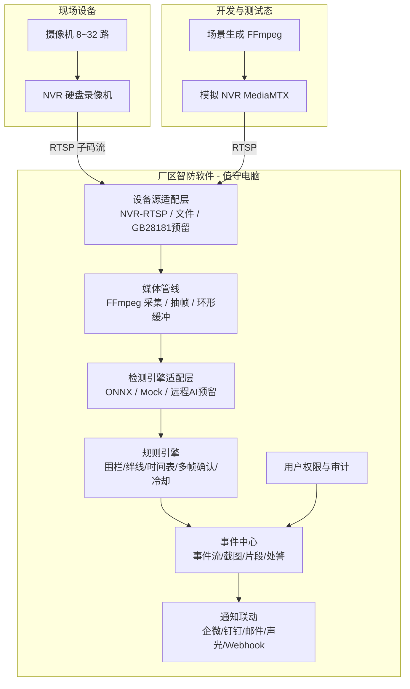
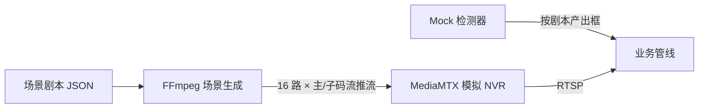

# 新项目立项设计报告：厂区智防平台（FactoryGuard）

> 文档版本：v1.0
> 成文日期：2026-10-07
> 文档状态：立项稿（Kickoff）
> 来源仓库：`intelligent-regional-intrusion-detection-system`（区域入侵检测技术验证，已归档）
> 目标读者：项目发起人、开发、测试、实施、售前

---

## 1. 项目背景

### 1.1 项目来源

本项目直接衍生自“智能区域入侵检测系统”技术验证仓库。该仓库在 2026 年 8～9 月完成了以下技术验证：

- Windows 桌面端 PySide6/QML 多宫格视频预览；
- 内置 FFmpeg 二进制的 RTSP 取流（无 Python FFmpeg 绑定）；
- ONNX Runtime 本地推理（DirectML/CPU）；
- fMP4 分片录像、JSONL 逐秒检测记录、片段回放；
- PyInstaller + NSIS 安装包制作（`IRIDSys-Setup-1.0.0.exe`）。

验证结论：**技术路线可行**，但验证仓库的定位是单机原型，不具备产品形态。现启动全新项目，将验证成果产品化。

### 1.2 市场与问题

目标市场：**中小型生产企业（小工厂、小厂区）**，典型规模 8～32 路摄像机、1～2 台硬盘录像机（NVR）、1 台值守电脑。

这类用户的现状：

- 已经或正在部署“摄像机 + NVR”，NVR 只解决“录得下来、事后能查”；
- 夜间、周末无人值守，入侵、盗窃发生时**没有实时发现能力**；
- 传统移动侦测误报率高（光影、飞虫、动物），基本被弃用；
- 商业级 AI 安防平台价格高、架构重，小厂区用不起也维护不了；
- 老板希望“有人闯入围墙/仓库，电脑立刻报警、手机立刻收到消息”。

### 1.3 机会

以“区域入侵检测”为尖刀能力，做**轻量、便宜、稳定、无真机也能演示交付**的软件产品，与用户已有的 NVR 协同工作而非替代它。

---

## 2. 产品定位

### 2.1 一句话定位

> 厂区智防平台是一套与硬盘录像机协同工作的轻量 AI 视频安防软件：用 NVR 负责连续录像，用本软件负责实时区域入侵检测、告警与处警闭环。

### 2.2 产品目标

1. 让无值守时段的围墙、仓库、车间、财务室等区域“有人闯入即报警”；
2. 误报可接受：通过区域规则、目标过滤、多帧确认、时间表、告警冷却控制误报；
3. 不碰 NVR 的录像主业：连续录像归 NVR，本软件只存事件片段；
4. 零硬件依赖完成开发、演示、测试：内置虚拟厂区与模拟 NVR；
5. 单台普通 Windows 值守电脑即可运行，10 分钟完成安装配置。

### 2.3 非目标（第一版明确不做）

- 不做百万路视频平台、不做云计算底座；
- 不做通用视频管理平台的全部功能（不追求 50+ 场景）；
- 不替代 NVR 做 7×24 连续录像；
- 不自研摄像机固件、不做硬件销售；
- GB/T 28181 仅作为后续“对外对接/平台级联”的预留能力，不进首版。

---

## 3. 用户与场景

### 3.1 用户画像

| 角色 | 关注点 | 使用方式 |
| --- | --- | --- |
| 企业老板 / 厂长 | 财产安全、夜里有没有人进来、报警能不能到手机 | 手机收消息、看事件与统计 |
| 门卫 / 值班员 | 告警弹窗、现场核实、一键处理 | 值守电脑大屏、多宫格、事件确认 |
| 行政 / IT 兼职管理员 | 安装配置简单、别天天出故障 | 初始化向导、通道配置、布防时间表 |
| 实施 / 售后（乙方） | 快速部署、远程排障、可演示 | 模拟环境演示、安装包、日志诊断 |

### 3.2 典型业务流程

**夜间围墙入侵主流程：**

```text
22:00 系统按时间表自动布防
02:13 有人接近东侧围墙
02:13:20 人员越过绊线，连续 3 帧确认
02:13:21 值守电脑弹窗 + 声光警号 + 企业微信群消息（含截图）
02:14 值班员点开事件，看到实时画面与轨迹，远程喊话/现场巡查
02:20 值班员确认事件为“真实入侵”，填写处置结果并关闭
NVR 中该通道 02:13 前后完整录像可作为取证依据
```

---

## 4. 功能需求（MoSCoW）

### 4.1 Must（首版必须有）

| 编号 | 功能 | 说明 |
| --- | --- | --- |
| F1 | NVR/通道管理 | 按 NVR 品牌模板批量生成通道，支持主/子码流设置 |
| F2 | 实时多宫格预览 | 1/4/9/16 宫格，默认子码流，支持轮巡、全屏、抓拍 |
| F3 | 区域入侵规则 | 多边形电子围栏、绊线；目标类型（person/car/truck）；灵敏度 |
| F4 | 布防时间表 | 按通道/区域设置布防时段，一键布撤防，支持节假日 |
| F5 | AI 检测引擎 | 本地 ONNX 推理，支持 GPU/CPU，引擎可替换（含模拟引擎） |
| F6 | 多帧确认与告警冷却 | 连续 N 帧命中才告警，同规则冷却期不重复刷屏 |
| F7 | 事件中心 | 事件列表、状态流（待处理/确认/误报/关闭）、截图、轨迹 |
| F8 | 事件片段录像 | 告警时保存“前 10 秒 + 后 20 秒”MP4，事件内回放 |
| F9 | NVR 联动定位 | 事件记录通道号与精确时间，跳转/指引到 NVR 完整录像 |
| F10 | 消息通知 | 企业微信/钉钉群机器人 Webhook（零成本首选） |
| F11 | 用户与权限 | 登录、角色（管理员/值班员）、基础通道授权 |
| F12 | 操作审计与日志 | 登录、预览、布撤防、事件处置、导出等审计 |
| F13 | 模拟环境 | 虚拟厂区 + 模拟 NVR + 模拟检测器 + 场景剧本（见第 8 章） |
| F14 | 安装包与初始化向导 | NSIS 安装包，首次启动向导式配置 |

### 4.2 Should（第二版）

- ONVIF 云台控制；
- 邮件/短信/声光警号（网络继电器）联动；
- 徘徊、滞留、聚集、逆行检测；
- 事件统计报表（按区域/时段/类型）；
- 多 NVR、多品牌混合接入；
- 配置备份/恢复、自动诊断；
- Webhook/OpenAPI 对接门禁、广播、工单。

### 4.3 Could（后续）

- Web IOC 大屏 / 移动端 App / 小程序；
- GB/T 28181 国标接入网关与上下级平台级联；
- GA/T 1400 视图库、人车布控、轨迹检索；
- 边缘 AI 盒子、多厂区集团版、多租户。

---

## 5. 总体架构

### 5.1 架构图



### 5.2 架构原则

1. **适配层隔离变化**：视频源（NVR-RTSP/文件/GB28181）与检测引擎（ONNX/Mock/远程）通过接口替换，核心业务不动；
2. **信令/业务与设备解耦**：软件只消费“流 + 通道 + 状态”，不依赖 NVR 私有页面；
3. **子码流 + 抽帧**：默认全部使用子码流，AI 按每路 1～5 fps 抽帧；
4. **失败隔离**：AI/通知故障不影响预览，软件故障不影响 NVR 录像；
5. **可演示性内置**：模拟环境是产品的一等公民，而不是临时脚本；
6. **平台中立内核**：领域层/基础设施层不依赖 UI 框架，为未来服务化保留可能。

### 5.3 部署形态

| 形态 | 规模 | 拓扑 |
| --- | --- | --- |
| 标准单机（首版） | 8～32 路 | NVR 双网口（摄像机网段 + 办公网），1 台 Windows 值守电脑运行本软件 |
| 边缘一体机（可选） | 8～16 路 | 软件预装到工控机/迷你主机，随 NVR 柜内交付 |
| 服务化（远期） | 多厂区/百路以上 | 独立 Linux 服务器 + 多客户端，国标级联，超出本报告范围 |

---

## 6. 模块详细设计

### 6.1 设备接入与 NVR 管理

- **品牌模板**：内置海康、大华、宇视 RTSP 地址模板，输入 NVR IP、账号、通道数即可批量生成地址：
  - 海康：`/Streaming/Channels/{n}01`（主）、`{n}02`（子）；
  - 大华：`/cam/realmonitor?channel={n}&subtype=0/1`；
  - 宇视：`/media/video1`、`/media/video2`；
  - 通用：自定义 RTSP 地址模板。
- **通道模型**：NVR → 通道（名称、主/子码流地址、区域、是否启用、是否参与 AI、状态）；
- **连接管理**：断线指数退避重连、状态（在线/连接中/离线/鉴权失败）；
- **能力探测**：启动时探测分辨率/编码，校验子码流是否开启；
- **预留**：`Gb28181Source`（经 WVP+ZLMediaKit 网关取流）。

### 6.2 媒体管线

- 全部经随软件分发的 FFmpeg 二进制：`RTSP → rawvideo/BGR 帧`；
- 每路采集线程 + 每显示界面一个投递线程，UI 不阻塞；
- 环形帧缓冲（按字节预算自适应深度），用于事件片段预录；
- 统一帧对象：streamId、序号、时间戳、BGR 图像；
- 预览经 `QImage → QVideoFrame → QVideoSink → QML VideoOutput`。

### 6.3 AI 检测引擎

- 首版：本地 ONNX Runtime（Windows 优先 DirectML，CPU 兜底）；
- 检测器为通用目标检测（输出 person/car/truck 等），区域语义由规则引擎负责；
- 引擎适配接口：`connect/submit/take_results/close`，可在 ONNX、Mock、远程 HTTP AI 间切换；
- 模型与阈值可配置：置信度阈值、NMS、每路检测间隔；
- 性能策略：子码流、每通道独立检测间隔、静态画面可降帧。

### 6.4 规则引擎

| 规则 | 首版 | 说明 |
| --- | --- | --- |
| 电子围栏（多边形） | 是 | 目标进入/离开多边形判定 |
| 绊线穿越 | 是 | 目标质心穿越线段并判断方向 |
| 布防时间表 | 是 | 星期/时段/节假日，一键布撤防 |
| 多帧确认 | 是 | 连续 N 帧命中才产生事件 |
| 告警冷却 | 是 | 同通道同规则冷却窗口（默认 60s） |
| 徘徊/滞留/聚集/逆行 | 二期 | 基于跟踪与时间累积 |

判定输入：检测框 + 规则几何 + 布防状态；输出：规则命中事件（含目标轨迹快照）。

### 6.5 事件中心与处警闭环

- 事件字段：事件 ID、类型、规则、通道、区域、时间、级别、目标类型、置信度、截图、片段、轨迹、状态、处置人、处置说明；
- 状态流：待处理 → 已确认（真警）/ 误报 → 已关闭；
- 支持事件筛选、搜索、按区域聚合、误报反馈用于规则调优；
- 事件保留策略可配置，与 NVR 录像独立。

### 6.6 录像策略（与 NVR 协同）

- 本软件：事件片段 MP4（默认前 10s + 后 20s），随事件存储；
- NVR：全天连续录像，事件中提供“通道 + 精确时间”，一键打开 NVR Web 地址或生成定位指引；
- 时间一致性：要求 NVR 与值守电脑 NTP 对时；
- 可选离线兜底：无 NVR 的廉价场景，软件可切换为全天分片录像（已有验证能力）。

### 6.7 通知与联动

- 首选：企业微信/钉钉群机器人 Webhook（消息含通道、时间、截图链接/Base64、事件跳转）；
- 二期：邮件、短信网关、声光警号（网络继电器/串口）；
- 事件驱动的 Webhook/OpenAPI：对接门禁、广播、消防、工单；
- 通知策略：级别、静默时段、升级（未确认超时再通知）。

### 6.8 用户、权限、审计与运维

- 登录与角色：管理员（配置/授权）、值班员（预览/处警）；
- 资源授权：按区域/通道；
- 审计：登录、预览、云台、布撤防、事件处置、导出、配置变更；
- 运维：CPU/内存/磁盘/网络与进程指标、设备在线率、播放成功率、日志导出与一键诊断；
- 播放地址短期签名（服务化之后），首版局域网内以 NVR 鉴权 + 防火墙为主。

---

## 7. 数据模型（核心实体）

| 实体 | 关键字段 |
| --- | --- |
| NvrDevice | id、name、brand、ip、port、username、secret_ref、template、status |
| Channel | id、nvr_id、channel_no、name、region_id、main_url、sub_url、ai_enabled、status |
| Region | id、name、parent_id（组织/区域树） |
| DetectionModel | id、name、path/version、labels、device（auto/cpu）、thresholds |
| Rule | id、channel_id/region_id、type、geometry(JSON)、target_labels、schedule、sensitivity、confirm_frames、cooldown_seconds、enabled |
| AiTask | id、channel_id、model_id、sample_fps、substream、schedule、status |
| Event | id、rule_id、channel_id、level、occurred_at、payload(JSON)、snapshot_uri、clip_uri、status、handled_by、handled_at、note |
| Track | event_id、seq、bbox、point、ts（轨迹点） |
| Notification | id、event_id、channel（wecom/dingtalk/email/...）、status、sent_at、response |
| User / Role / Permission | 账号、角色、授权范围 |
| AuditLog | actor、action、resource、result、ip、ts |
| AppSetting | 键值型系统配置 |

设计约定：内部使用 UUID；外部协议 ID（国标编码、NVR 通道号）作为属性保留；密钥不写明文。

---

## 8. 无真机开发：虚拟厂区与模拟 NVR

没有真实摄像机和 NVR 是本项目的常态开发条件，模拟环境为正式交付能力，而非临时脚本。

### 8.1 模拟架构



### 8.2 模拟 NVR

- 工具：**MediaMTX**（轻量 RTSP/RTMP/WebRTC 服务器，免安装单文件）；
- 16 个虚拟通道，每通道主码流（1920×1080, H.265, 25fps）与子码流（640×360, H.264/H.265, 5～15fps）；
- 通道按第 8.4 节厂区点位命名。

### 8.3 画面与检测器

- **合成画面**：厂区背景 + 半透明围栏 + 可移动人形/车辆/动物色块 + 时间戳，支持白天/夜晚；
- **真实片段（可选）**：用公开监控视频验证真实 ONNX；
- **Mock 检测器**：合成色块无法被真实模型识别，Mock 检测器按剧本返回检测框（label、confidence、bbox），事件/告警/录像链路全部走真实代码；
- 三种运行模式：

| 模式 | 视频源 | 检测器 | 用途 |
| --- | --- | --- | --- |
| 演示模式 | 模拟 NVR | Mock | 客户演示、可重复 |
| 开发测试模式 | 模拟 NVR / 片段 | Mock / ONNX | 开发与自动化验收 |
| 生产模式 | 真实 NVR RTSP | ONNX | 现场 |

### 8.4 虚拟厂区点位（16 路）

CH01 大门入口、CH02 大门出口、CH03/04 东围墙、CH05/06 西围墙、CH07 仓库外、CH08 仓库内、CH09 装卸区、CH10 车间入口、CH11 车间内、CH12 停车场、CH13 办公楼大厅、CH14 财务室走廊、CH15 配电房、CH16 后门。

### 8.5 场景剧本库

1. 无入侵（测误报）；2. 夜间围墙翻越；3. 仓库非工时闯入（多通道）；4. 动物经过（不告警）；5. 门口徘徊（二期）；6. 单通道断流重连；7. NVR 重启批量恢复；8. 雨雪/树影干扰。

### 8.6 异常模拟

离线、断流、画面冻结、码率突变、鉴权失败、延迟、丢包（UDP）、时间戳错乱。首版实现：离线/断流/重连/冻结/鉴权失败。

剧本输出“预期事件时间线”，与软件实际事件自动对比，形成验收报告。

---

## 9. 技术选型

| 层 | 选型 | 理由 |
| --- | --- | --- |
| 桌面框架 | PySide6 + Qt 6 QML | 验证通过；声明式 UI、原生性能、跨平台可能 |
| 语言 | Python 3.11+（开发机 3.13 兼容） | AI 生态、迭代快 |
| 视频 | 随包 FFmpeg 二进制 | 稳定、无绑定授权风险 |
| 推理 | ONNX Runtime（DirectML/CPU），预留 OpenVINO/TensorRT | 免厂商锁定、部署简单 |
| 检测模型 | 通用 YOLO 系 ONNX（首版 person/vehicle） | 成熟、可自训练替换 |
| 模拟 NVR | MediaMTX | 轻量、多协议、单文件 |
| 持久化（首版） | SQLite + 本地文件（远期 PostgreSQL） | 零运维 |
| 对象存储（远期） | MinIO/S3 | 截图片段集中化 |
| 打包 | PyInstaller（onedir）+ NSIS | 验证通过，产出安装包 |
| 质量 | pytest + 自检套件 + 剧本化自动化验收 | 架构规则强约束 |

---

## 10. 接口设计概要

### 10.1 内部接口（适配层契约）

- `VideoSource`：`open() / read_frame() / close() / status`
- `InferenceEngine`：`connect() / submit(frame) / take_results() / close()`
- `Notifier`：`send(event) / status`

### 10.2 OpenAPI（二期开放，REST 草案）

| 方法 | 路径 | 说明 |
| --- | --- | --- |
| GET | `/api/v1/devices` | NVR 与通道列表/状态 |
| POST | `/api/v1/rules` | 创建规则 |
| GET | `/api/v1/events` | 事件查询（时间/区域/状态） |
| POST | `/api/v1/events/{id}/handle` | 处警 |
| POST | `/api/v1/arm`、`/disarm` | 布撤防 |
| GET | `/api/v1/channels/{id}/stream` | 获取签名播放地址（服务化后） |

事件外发 Webhook：`POST {客户地址}`，JSON body 含事件与截图 URL，HMAC 签名。

---

## 11. UI 页面规划（桌面端）

| 页面 | 内容 |
| --- | --- |
| 初始化向导 | NVR 选择 → 账号 → 通道批量导入 → 画区域规则 → 通知配置 |
| 实时监控 | 多宫格、通道树/区域筛选、布撤防开关、轮巡、抓拍、全屏 |
| 规则配置 | 通道画面上绘制多边形/绊线、目标类型、时间表、灵敏度、确认帧数、冷却 |
| 事件中心 | 事件列表/详情、截图、轨迹、事件片段回放、NVR 定位、状态流转 |
| 录像与回放 | 事件片段库；NVR 跳转入口 |
| 统计看板（二期） | 事件趋势、区域热力、设备在线率 |
| 设备管理 | NVR/通道、码流、连接状态、诊断 |
| 系统设置 | 模型、阈值、通知渠道、用户权限、存储、日志、模拟模式开关 |

---

## 12. 新项目工程结构（建议）

```text
factoryguard/
├── app/                          # 桌面端
│   ├── qml/                      # QML 页面与组件
│   └── src/factoryguard/
│       ├── domain/               # 领域模型与规则
│       ├── application/          # 用例编排
│       ├── infrastructure/       # 媒体/ONNX/持久化/通知
│       └── presentation/         # QML 控制器
├── simulator/                    # 模拟 NVR 与场景（产品一等公民）
│   ├── mediamtx/
│   ├── scenarios/
│   └── mock_detector/
├── packaging/                    # spec/nsi/assets
├── docs/
└── tests/
```

架构红线（沿用验证仓库）：单源文件行数上限、禁止 OpenCV 采集与 FFmpeg Python 绑定、领域层不依赖 Qt，由静态自检强制执行。

---

## 13. 安全与合规

- 摄像机/NVR 使用独立 VLAN，NVR 双网口隔离，不对公网映射 554/80；
- 全量弱口令整改，NVR/软件密码分级保存（密钥不明文落盘）；
- 播放与通知链接（服务化后）短期签名；
- 审计覆盖关键操作；
- 录像/截图保留期限、访问权限、删除策略；
- 按《网络安全法》《个人信息保护法》及等保基本要求做交付前评审。

---

## 14. 性能与容量估算

- 取流：16 路子码流 ≈ 8～16 Mbps；普通办公网/百兆以上均可；
- AI：子码流每路 1～5 fps；有入门级独显（RTX 3050/3060）可轻松覆盖 16 路；无独显按每路 1fps + CPU/DirectML 降级；
- 事件片段：每次事件约 30s，单条约 5～15MB；
- NVR 容量参考：`容量GB ≈ 码率Mbps ÷ 8 × 86400 ÷ 1000 × 路数 × 天数`；16 路 2Mbps 存 30 天 ≈ 10.4TB。

验收性能基线：布防状态下事件触发 → 弹窗/消息延迟 ≤ 10s；软件连续 72 小时稳定无崩溃。

---

## 15. 测试策略

1. 单元测试：规则几何（多边形/绊线）、时间表、冷却、多帧确认；
2. 集成测试：模拟 NVR → 采集 → Mock 检测 → 事件 → 片段全链路；
3. 剧本验收：预期时间线 vs 实际事件自动对比；
4. 长稳测试：16 路 72 小时、断流/重启恢复；
5. 真机测试（有条件时）：≥3 个品牌 NVR/摄像机兼容性矩阵；
6. 架构自检：静态红线随 CI 执行。

---

## 16. 里程碑与路线图

| 阶段 | 周期 | 目标 | 关键交付 |
| --- | --- | --- | --- |
| M0 立项 | 第 1 周 | 仓库初始化、需求冻结、骨架搭建 | 新项目仓库、CI、架构骨架、本报告评审通过 |
| M1 模拟环境 | 第 2～3 周 | 16 路模拟 NVR + 合成画面 + Mock 检测 | MediaMTX 方案、场景生成、Mock 引擎、剧本 v1 |
| M2 核心闭环 | 第 4～6 周 | NVR 管理、预览、规则、事件中心、片段 | 全链路在模拟环境跑通并自动化验收 |
| M3 通知与权限 | 第 7～8 周 | 企微/钉钉通知、登录权限、审计、向导 | 可演示 Beta，安装包 |
| M4 试点与定型 | 第 9～10 周 | 真机/试点 1～2 家、误报调优、文档 | v1.0.0 正式安装包、交付文档 |
| M5 增强 | 第 11 周起 | 徘徊/滞留、云台、Webhook、GB28181 预研 | v1.1+ |

团队建议：后端/桌面 1～2 人、AI 1 人、测试/实施 0.5～1 人；4～6 人 10 周可交付 v1.0.0。

---

## 17. 风险与应对

| 风险 | 影响 | 应对 |
| --- | --- | --- |
| 夜间误报（飞虫/树影/反光/动物） | 产品可信度 | person 过滤、区域几何、多帧确认、调角度、试点调优 |
| NVR RTSP 并发/子码流限制 | 无法全量分析 | 选型清单前置要求、品牌模板、必要时直连摄像机子网 |
| 真机国标/方言差异 | 交付延期 | 兼容性矩阵、GB28181 放到二期后、实施前 POC |
| 无独显性能不足 | 漏检/卡顿 | 抽帧降帧、CPU 降级、推荐硬件基线 |
| 范围蔓延 | 交付失控 | 严守非目标清单，二期功能后置 |
| 开源许可证 | 商业化风险 | MediaMTX/模型/组件许可证逐项确认 |

---

## 18. 验收标准（v1.0.0）

1. 模拟 NVR 16 通道，≥8 通道同时播放稳定；
2. 夜间围墙翻越剧本：事件生成率 100%，动物经过剧本 0 误报；
3. 事件含时间、通道、规则、目标、置信度、截图、30s 片段、可回放；
4. 告警冷却生效，无重复刷屏；
5. 通知 10s 内送达企业微信/钉钉；
6. 断流自动重连、NVR 重启后批量恢复；
7. 未授权用户无法预览/处置/导出；
8. 安装包在干净 Windows 10/11 上 10 分钟内完成安装与初始化；
9. 16 路连续 72 小时稳定运行。

---

## 19. 从验证仓库继承的资产

| 资产 | 去向 |
| --- | --- |
| QML 多宫格与视频帧投递链路 | 媒体管线/预览 |
| FFmpeg 采集与重连 | 基础设施 |
| ONNX 引擎与前后处理 | AI 检测引擎 |
| fMP4/JSONL 录像与回放 | 事件片段/回放 |
| PyInstaller spec + NSIS 脚本 | 打包 |
| 架构自检套件 | CI/质量红线 |
| 蓝图文档（NVR 厂区方案、GB28181 蓝图） | 设计参考 |

---

## 20. 立项检查清单（Kickoff Checklist）

- [ ] 本报告评审通过并冻结 v1.0 需求范围
- [ ] 创建 `factoryguard` 新仓库与分支策略（trunk 或 git-flow）
- [ ] 搭建 CI：架构自检 + 单元测试 + 剧本验收
- [ ] 确认 MediaMTX、检测模型等组件许可证
- [ ] 准备开发/演示用值守电脑基线配置
- [ ] 建立渠道：企业微信/钉钉机器人联调环境
- [ ] 明确试点客户与真机 NVR 获取计划
- [ ] M0 任务拆解到人，确定每周演示节奏

---

## 附录：术语

- **NVR**：网络硬盘录像机，负责摄像机视频接入与连续录像；
- **RTSP**：实时流传输协议，本项目首版取流协议；
- **ONVIF**：开放网络视频接口标准，用于设备管理与云台；
- **GB/T 28181**：公安视频联网国家标准，用于平台级联（二期后）；
- **GA/T 1400**：公安视频图像信息应用标准（视图库）；
- **主码流/子码流**：高清存储流 / 低码率预览分析流；
- **Mock 检测器**：按剧本返回检测结果的模拟引擎；
- **处警闭环**：事件从产生到确认/误报/关闭的完整流程。
