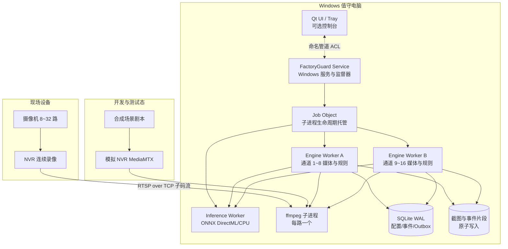

# 新项目立项设计报告：厂区智防平台（FactoryGuard）

> 文档版本：v1.9
> 成文日期：2026-10-07
> 文档状态：立项稿（画面质量、模型生命周期、变更连续性与客户成功增强版）
> 目标读者：项目发起人、产品、开发、测试、实施、售后、售前
> 核心决策：核心检测能力以 Windows 后台服务运行，Qt 界面只做可选控制台；进程级隔离、看门狗、崩溃恢复、可观测性、故障演练和一键诊断为 v1.0 发布红线。

---

## 1. 项目背景

### 1.1 建设动因

中小型生产企业普遍已经建设“摄像机 + NVR”体系，但该体系主要解决连续录像和事后追溯，无法在入侵发生的第一时间主动发现、提醒和推动处置。FactoryGuard 的建设目标，是在不改变现有 NVR 录像主体地位的前提下，补齐实时区域入侵检测、告警通知和处警闭环能力。

行业内视频设备通常区分主码流与子码流：主码流用于高清连续录像，子码流用于低带宽预览；ONVIF Profile S 面向基于 IP 的视频系统，RTSP 是常见实时流传输方式。基于这些行业通行实践，本项目首版采用“NVR 连续录像 + Windows 值守电脑运行 AI 分析 + RTSP over TCP 接入子码流”的路线。

### 1.2 目标客户与核心问题

目标市场为中小型生产企业，包括加工厂、仓储、物流节点、小型园区和配套办公场所，典型规模为 8～32 路摄像机、1～2 台 NVR、1 台 Windows 值守电脑。

| 问题 | 现场表现 | 业务后果 |
| --- | --- | --- |
| 只录像、不主动告警 | NVR 保存视频，但无人实时值守 | 入侵、盗窃发生时不能立即制止 |
| 夜间/周末空窗 | 围墙、仓库、财务室、配电房无人巡查 | 风险最高的时段反而缺少有效看护 |
| 传统移动侦测可信度低 | 光影、树影、飞虫、动物、反光均可能触发 | 用户频繁收到误报后逐渐停用 |
| 商业平台过重 | 成本高、架构复杂、需要专门维护 | 小型工厂难以承担建设和运维成本 |
| 现场环境复杂 | 网络、NVR 固件、码流、驱动、权限、安全软件差异大 | 如果缺少故障隔离和诊断能力，系统容易变成“看似运行、实际失效” |

### 1.3 建设机会

FactoryGuard 以“区域入侵检测”作为首个尖刀场景，产品应同时满足以下要求：

- 与现有 NVR 协同而非替代 NVR，FactoryGuard 只保存事件片段，NVR 负责 7×24 连续录像；
- 默认使用子码流和抽帧推理，以较低网络与算力成本覆盖 8～32 路通道；
- 将模拟厂区、模拟 NVR、场景剧本和故障注入内置为研发与交付基础设施；
- 核心能力以后台 Windows 服务运行，关闭控制台界面不影响布防；
- 对断流、崩溃、GPU 失败、磁盘不足、时钟漂移、通知失败等状态做到可发现、可隔离、可恢复、可审计。

---

## 2. 产品定位

### 2.1 一句话定位

> 厂区智防平台是一套与硬盘录像机协同工作的轻量 AI 视频安防软件：用 NVR 负责连续录像，用本软件负责实时区域入侵检测、告警与处警闭环。

### 2.2 产品目标

1. 让无值守时段的围墙、仓库、车间、财务室等区域“有人闯入即报警”；
2. 误报可接受：通过区域规则、目标过滤、多帧确认、时间表、告警冷却控制误报；
3. 不碰 NVR 的录像主业：连续录像归 NVR，本软件只存事件片段；
4. 零硬件依赖完成开发、演示、测试：内置虚拟厂区与模拟 NVR；
5. 单台普通 Windows 值守电脑即可运行，10 分钟完成安装配置；
6. **服务化运行**：核心检测、通知、事件写入由 Windows 后台服务完成，关闭界面不影响布防；
7. **故障不静默**：断流、推理失败、磁盘不足、时钟漂移、进程崩溃必须可见、可追踪、可自动恢复；
8. **状态可恢复**：配置、事件、通知任务采用事务与 Outbox 模式，崩溃后不产生孤儿进程和重复/丢失告警。

### 2.3 非目标（第一版明确不做）

- 不做百万路视频平台、不做云计算底座；
- 不做通用视频管理平台的全部功能（不追求 50+ 场景）；
- 不替代 NVR 做 7×24 连续录像；
- 不自研摄像机固件、不做硬件销售；
- GB/T 28181 仅作为后续“对外对接/平台级联”的预留能力，不进首版。

---

## 3. 用户与场景

### 3.1 用户画像

| 角色 | 关注点 | 使用方式 |
| --- | --- | --- |
| 企业老板 / 厂长 | 财产安全、夜里有没有人进来、报警能不能到手机 | 手机收消息、看事件与统计 |
| 门卫 / 值班员 | 告警弹窗、现场核实、一键处理 | 值守电脑大屏、多宫格、事件确认 |
| 行政 / IT 兼职管理员 | 安装配置简单、别天天出故障 | 初始化向导、通道配置、布防时间表 |
| 实施 / 售后（乙方） | 快速部署、远程排障、可演示 | 模拟环境演示、安装包、日志诊断 |

### 3.2 典型业务流程

**夜间围墙入侵主流程：**

```text
22:00 系统按时间表自动布防
02:13 有人接近东侧围墙
02:13:20 人员越过绊线，连续 3 帧确认
02:13:21 值守电脑弹窗 + 声光警号 + 企业微信群消息（含截图）
02:14 值班员点开事件，看到实时画面与轨迹，远程喊话/现场巡查
02:20 值班员确认事件为“真实入侵”，填写处置结果并关闭
NVR 中该通道 02:13 前后完整录像可作为取证依据
```

---

## 4. 功能需求（MoSCoW）

### 4.1 Must（首版必须有）

| 编号 | 功能 | 说明 |
| --- | --- | --- |
| F1 | NVR/通道管理 | 按 NVR 品牌模板批量生成通道，支持主/子码流设置 |
| F2 | 实时多宫格预览 | 1/4/9/16 宫格，默认子码流，支持轮巡、全屏、抓拍 |
| F3 | 区域入侵规则 | 多边形电子围栏、绊线；目标类型（person/car/truck）；灵敏度 |
| F4 | 布防时间表 | 按通道/区域设置布防时段，一键布撤防，支持节假日 |
| F5 | AI 检测引擎 | 本地 ONNX 推理，支持 GPU/CPU，引擎可替换（含模拟引擎） |
| F6 | 多帧确认与告警冷却 | 连续 N 帧命中才告警，同规则冷却期不重复刷屏 |
| F7 | 事件中心 | 事件列表、状态流（待处理/确认/误报/关闭）、截图、轨迹 |
| F8 | 事件片段录像 | 告警时保存“前 10 秒 + 后 20 秒”MP4，事件内回放 |
| F9 | NVR 联动定位 | 事件记录通道号与精确时间，跳转/指引到 NVR 完整录像 |
| F10 | 消息通知 | 企业微信/钉钉群机器人 Webhook（零成本首选） |
| F11 | 用户与权限 | 登录、角色（管理员/值班员）、基础通道授权 |
| F12 | 操作审计与日志 | 登录、预览、布撤防、事件处置、导出等审计 |
| F13 | 模拟环境 | 虚拟厂区 + 模拟 NVR + 模拟检测器 + 场景剧本（见第 9 章） |
| F14 | Windows 服务、安装包与初始化向导 | NSIS 安装包；核心能力以后台 Windows 服务运行；首次启动向导；日常使用不要求管理员权限 |
| F15 | 看门狗与故障自愈 | 进程心跳、Job Object、崩溃重启、断流重连、GPU/CPU 降级 |
| F16 | 健康监测与一键诊断 | CPU、内存、磁盘、网络、进程、设备指标；事件日志、应用日志和崩溃转储打包导出 |

### 4.2 Should（第二版）

- ONVIF 云台控制；
- 邮件/短信/声光警号（网络继电器）联动；
- 徘徊、滞留、聚集、逆行检测；
- 事件统计报表（按区域/时段/类型）；
- 多 NVR、多品牌混合接入；
- 配置备份/恢复、自动诊断；
- Webhook/OpenAPI 对接门禁、广播、工单。

### 4.3 Could（后续）

- Web IOC 大屏 / 移动端 App / 小程序；
- GB/T 28181 国标接入网关与上下级平台级联；
- GA/T 1400 视图库、人车布控、轨迹检索；
- 边缘 AI 盒子、多厂区集团版、多租户。

---

## 5. 总体架构

### 5.1 架构图



### 5.2 架构原则

1. **服务优先**：检测、规则、事件、通知运行在 Windows 服务中；UI 只是观察和操作入口，关闭 UI 不影响业务。
2. **适配层隔离变化**：NVR-RTSP、文件、模拟器、未来 GB/T 28181 网关均实现统一视频源契约；ONNX、Mock、远程推理均实现统一推理契约。
3. **子码流 + 抽帧**：默认使用子码流，AI 按每路 1～5 fps 抽帧，分辨率、帧率和码率必须在验收中实测。
4. **失败隔离**：单路 FFmpeg、单个引擎、推理进程、通知渠道、UI 的故障不得拖垮其他通道，更不得影响 NVR 连续录像。
5. **无静默失败**：任何降级都要有健康状态、日志、界面提示和恢复动作；不能把“没有告警”伪装成“系统正常”。
6. **崩溃可恢复**：所有关键状态写入 SQLite 事务，通知进入 Outbox；文件采用临时文件、fsync、原子替换。
7. **最小权限**：服务使用独立服务账户和受限 ACL；日常登录用户不是管理员也能完成值班操作。
8. **可演示性内置**：模拟环境是产品一等公民，用于演示、开发、自动化验收和故障演练。

### 5.3 部署形态

| 形态 | 规模 | 拓扑 |
| --- | --- | --- |
| 标准单机（首版） | 8～32 路 | NVR 双网口或独立 VLAN，1 台 Windows 10/11 x64 值守电脑运行服务和可选 UI |
| 边缘一体机（可选） | 8～16 路 | 软件预装到工控机/迷你主机，安装包、配置、驱动和长稳报告随设备交付 |
| 试点离线兜底 | NVR 异常或无 NVR | 软件使用分片连续录像，但该模式必须明确标识，不改变“NVR 主录像”的产品定位 |
| 服务化（远期） | 多厂区/百路以上 | 独立服务器、多客户端、国标级联，超出 v1.0 范围 |

---

## 6. 模块详细设计

### 6.1 设备接入与 NVR 管理

- **品牌模板**：内置海康、大华、宇视及通用 RTSP 模板，输入 NVR IP、端口、账号、通道数后批量生成主/子码流地址；模板不得硬编码唯一 URL，允许现场覆盖。
- **通道模型**：NVR 与通道为一对多关系；通道包含名称、区域、主/子码流、启用状态、AI 开关、能力信息和最近错误。
- **连接策略**：默认 RTSP over TCP，设置连接、读取和 socket 超时；失败后指数退避并加入随机抖动，避免 NVR 重启后 32 路同时冲击。
- **状态机**：未启用、连接中、在线、降级、离线、鉴权失败、配置错误；所有状态转换记录原因码。
- **能力探测**：校验子码流是否开启、编码是否为 H.264/H.265、分辨率和时间戳是否正常；探测失败时阻止用户误以为该通道已布防。
- **NVR 重启恢复**：监督器按通道组逐步恢复，并记录恢复成功率、平均恢复时间和失败通道。

### 6.2 媒体管线

- 每路视频启动一个随包分发的 FFmpeg 子进程；禁止 shell 拼接命令，参数以数组传递，避免注入和引号问题。
- 推荐输出 rawvideo/BGR24 或经发布门禁确认的轻量编码格式；分辨率、像素格式、色彩范围必须显式指定，不依赖现场环境默认值。
- 每路管线维护有界环形帧缓冲，默认保存至少 10 秒预录帧；缓冲深度按字节预算而不是固定帧数计算。
- 帧对象包含 streamId、单调递增序号、采集时刻、媒体时间戳、宽高、步长和图像字节；UI、规则、录像不得共用可变对象。
- 队列满时允许丢弃旧预览帧，但必须输出 dropped_frames 指标；事件截图、规则判定和 Outbox 写入不能被无界队列拖垮。
- FFmpeg 异常退出后自动重启；连续失败达到阈值后熔断该通道并提示人工检查，不产生僵尸进程。
- 预览通过 Qt 视频投递链路在 UI 进程完成；UI 卡死或重启不影响后台预录和检测。

### 6.3 AI 检测引擎

- 首版使用本地 ONNX Runtime，优先 DirectML，CPU 为兜底；推理在独立 Inference Worker 中运行，与媒体进程隔离。
- 启动时执行模型加载、标签校验、输入尺寸 Warmup 和一次合成帧推理；模型未通过健康检查前不得进入布防就绪状态。
- 推理接口提交带超时的帧任务，返回 label、confidence、bbox、model_version、inference_ts 和耗时；超时按降级处理。
- 支持按通道配置目标类型、置信度、NMS、采样帧率和布防时间表；默认优先 person，车辆类目标按规则启用。
- GPU 连续失败时自动重启推理会话并进入 CPU 降帧模式；降级会影响帧率时必须明确提示，不能静默漏检。
- Mock 引擎必须走与真实引擎相同的接口、队列和结果模型，保证模拟测试覆盖真实业务链路。

### 6.4 规则引擎

- 支持多边形电子围栏、单向/双向绊线、进入/离开/穿越方向、目标类型、灵敏度、确认帧数和冷却时间。
- 使用单调时钟计算冷却和停留，使用事件发生时刻进行取证；系统时间跳变不应导致规则状态永久错乱。
- 多帧确认必须记录命中帧序号和轨迹点；未达到阈值不产生事件，但可在诊断日志中保留调试信息。
- 时间表支持星期、节假日、临时布撤防和通道级覆盖；规则引擎只在 armed 状态下产生正式事件。
- 事件去重键由通道、规则、目标关联 ID/轨迹、时间窗口组成，防止重试或重复帧造成重复告警。

### 6.5 事件中心与处警闭环

- 事件字段包含事件 ID、类型、级别、通道、区域、发生时间、规则版本、目标、置信度、截图、片段、轨迹、状态、处置人和说明。
- 状态流为待处理、已确认、误报、已关闭；每次流转写入审计，不允许物理删除正式事件。
- 事件创建、截图写入、片段任务和通知任务在同一个业务事务/Outbox 边界内协调；无法完成的片段必须标记 degraded，而不是假装完整。
- 事件列表必须展示通道健康和片段完整性，支持按时间、区域、状态、目标类型和处置人筛选。

### 6.6 录像策略（与 NVR 协同）

- NVR 是 7×24 连续录像的权威系统；FactoryGuard 默认只保存告警前 10 秒、告警后 20 秒的事件片段。
- 事件记录通道号、NVR 时间、本机时间、时钟偏差和 NVR 定位地址，确保即使软件片段损坏也能回溯 NVR。
- 片段使用滚动 fMP4/分片写入，事件结束后再封装 MP4；崩溃后可恢复已 fsync 的分片，并标记缺失区间。
- NVR 与值守电脑必须启用 NTP；时钟偏差超过阈值时产生告警，事件中同时保存两侧时间。

### 6.7 通知与联动

- 首版支持企业微信、钉钉群机器人 Webhook；通知任务由 Outbox 异步发送并按渠道限流。
- 通知状态为待发送、已发送、失败待重试、永久失败、已升级；失败原因、响应码和重试次数可审计。
- 事件产生后立即发送基础消息；截图或片段上传失败不应阻塞基础告警。
- 未确认超时可升级通知给备用联系人；二期再扩展邮件、短信、网络继电器、串口和声光设备。
- 外发 Webhook 使用 HTTPS、HMAC 签名、时间戳和 nonce，防止重放和伪造。

### 6.8 用户、权限、审计与运维

- 角色至少包含管理员和值班员；权限可按通道、区域和动作控制。
- 审计覆盖登录、预览、导出、布撤防、规则修改、事件处置、通知配置、服务重启和升级。
- 运维指标包含进程存活、CPU、内存、GPU、磁盘、网络、通道在线率、帧延迟、丢帧率、推理耗时、通知成功率。
- 一键诊断导出系统版本、驱动版本、配置摘要、最近日志、事件日志、健康样本和 minidump；导出前执行密钥、密码、Webhook 地址脱敏。

---

## 7. Windows 平台可靠性工程

### 7.1 “绝对可靠”的工程定义

本项目不把“绝对可靠”理解为永不出错，而是定义为以下不可绕过的交付红线：

1. **故障可以发生，但不能静默**：用户必须能看到当前通道、推理、存储、通知是否处于降级状态。
2. **故障必须被隔离**：单路流、单个进程、单个通知渠道失败不能拖垮其他通道。
3. **故障必须可恢复**：子进程崩溃自动重启，服务随 Windows 启动，不依赖人工登录。
4. **取证不能只依赖本软件**：NVR 始终连续录像；FactoryGuard 片段失败时仍保留 NVR 精确定位信息。
5. **状态不能含糊**：崩溃恢复后，配置、布防状态、事件、通知任务和片段完整性必须明确。

| 可靠性指标 | v1.0 目标 | 验证证据 |
| --- | --- | --- |
| Windows 启动后无用户登录 | 60 秒内服务 Running，120 秒内布防通道开始连接 | 重启测试、服务日志、健康样本 |
| Engine/Inference 崩溃恢复 | RTO ≤ 60 秒；恢复后自动继续布防 | kill 进程注入测试 |
| 单路 FFmpeg 崩溃 | 网络正常时 15 秒内开始重连 | 100 次反复 kill 测试 |
| 进程孤儿 | 0 个；服务退出/重启后子进程由 Job Object 关闭 | 进程树快照对比 |
| 告警链路延迟 | P95 ≤ 10 秒，P99 ≤ 15 秒 | 剧本时间线自动比对 |
| 通知不丢失 | Outbox 持久化后，服务崩溃不丢任务；失败自动重试 | 崩溃前/恢复后数据库比对 |
| 月度可用性 | 排除硬件、OS、现场网络和计划升级后 ≥ 99.9% | 试点健康报表 |
| 试点长稳 | 168 小时自动化无 Sev1/Sev2；30 天现场试点无未恢复故障 | 长稳报告和问题闭环 |
| NVR 影响 | FactoryGuard 任何故障不停止、锁定或改写 NVR 连续录像 | 故障演练后 NVR 录像校验 |

### 7.2 Windows 支持矩阵与硬件基线

**商业交付只支持 x64**，不在首版支持 ARM64、32 位 Windows、Windows 7/8 或非 NTFS 系统盘。

| 环境 | 支持级别 | 说明 |
| --- | --- | --- |
| Windows 10 Pro/Enterprise/IoT Enterprise 22H2 x64 | 正式支持 | 需安装当前安全更新；Home 版只做兼容性自测，不承诺 7×24 策略管控 |
| Windows 11 Pro/Enterprise/IoT Enterprise 22H2 及更新版本 | 正式支持 | 覆盖 100%/125%/150% DPI |
| Windows Server 2022 | 实验支持 | 不作为首版值守桌面推荐环境 |
| 精简 Ghost 系统、关闭服务系统、第三方管家强优化系统 | 不支持直接交付 | 必须先恢复 SCM、网络、时间和 Defender 基础能力 |

| 硬件等级 | 建议配置 | 适用能力 |
| --- | --- | --- |
| 最小配置 | Intel i5-8 代/Ryzen 5 3000 级别、16GB RAM、128GB 可用 SSD、千兆网卡 | 8～16 路、子码流、CPU/DirectML 低帧率；必须实测 |
| 推荐配置 | i5/i7 近期平台、16～32GB RAM、RTX 3050 4GB 或同级、256GB SSD | 16 路实时分析与多宫格预览 |
| 32 路配置 | i7/Ryzen 7、32GB RAM、RTX 3060 8GB 或同级、512GB SSD | 32 路、更低延迟和更高采样帧率 |
| 不建议 | 机械硬盘作为事件库、8GB RAM、双核 CPU、核显且要求 32 路 AI | 漏检、卡顿、磁盘 IO 和长稳风险不可接受 |

### 7.3 进程拓扑与职责边界

| 进程 | 职责 | 故障边界 |
| --- | --- | --- |
| FactoryGuard Service | SCM 注册、配置加载、进程监督、健康汇总、服务停止/升级 | 不含 UI 和复杂业务；自身由 Windows 服务恢复策略兜底 |
| Engine Worker | 按 NVR 或每 8 路通道运行 FFmpeg、规则、截图和片段任务 | 单个 Worker 重启只影响其通道组 |
| Inference Worker | ONNX 模型会话、DirectML/CPU 推理、结果返回 | 崩溃后媒体预览继续，自动重建推理会话 |
| ffmpeg.exe | 单路 RTSP 连接、解复用、解码和帧输出 | 崩溃只影响单路视频 |
| FactoryGuard UI/Tray | 多宫格、配置、处警、状态提示 | 崩溃不影响服务，重新打开后状态同步 |
| Diagnostic Tool | 离线收集日志和诊断包 | 不连接业务流，不保存明文密钥 |

监督器建议使用 Rust 或 C#/.NET 实现为极小原生程序，只处理生命周期和健康状态；M0 可对 pywin32 方案做 Spike，但只有通过同样的服务、Job Object、重启和安装测试，才能作为备选。

### 7.4 服务、Job Object 与看门狗

- 服务注册为 Automatic（Delayed Start 可按现场启动风暴评估），服务恢复策略设置为第一次、第二次、后续失败均重启，并在 Windows 事件日志记录。
- 服务账户优先使用虚拟服务账户 NT Service\FactoryGuard 或专用低权限服务账户，仅授予 ProgramData 数据目录、网络访问和必要 GPU 权限。
- 所有子进程加入 Job Object；设置 KILL_ON_JOB_CLOSE、进程数、CPU、内存和活动进程限制，防止监督器异常退出后留下孤儿。
- Worker 每秒发送心跳、通道统计和队列水位；连续超时后监督器先请求优雅退出，超时再强制终止。
- 重启采用指数退避和熔断：短时间内连续崩溃时降低重启频率，同时持续输出本地故障状态，避免无限刷进程。
- 监督器自身不加载模型、不解析视频、不运行第三方 Web 请求，保持短小、可审计、可独立测试。

### 7.5 故障模式与恢复矩阵

| 故障 | 检测方式 | 自动处理 | 用户影响 |
| --- | --- | --- | --- |
| UI 崩溃 | 进程退出/命名管道断开 | 不重启后台；用户可重新打开 UI | 检测和通知继续 |
| FFmpeg 崩溃 | 管道 EOF/退出码/读超时 | 清理进程、退避重连、恢复预缓冲 | 单路短暂中断 |
| NVR 重启 | 多路连接失败、拒绝连接 | 分组重连、随机退避、状态展示 | 多通道短时离线 |
| Engine 崩溃 | 心跳丢失 | Job Object 清理并重启，重建通道组 | 该组分析最多 60 秒降级 |
| Inference 崩溃 | 推理心跳/队列超时 | 重启模型，必要时 CPU 降帧 | 短时分析延迟 |
| GPU 驱动异常 | 推理错误、显存分配失败 | 重启会话、熔断 GPU、切换 CPU | 帧率下降但状态可见 |
| 网络断开 | socket/RTSP 超时 | 保持状态、重连、输出离线原因 | 实时画面暂停 |
| 磁盘接近满 | 容量水位周期检查 | 触发保留策略、停止非关键写入 | 事件和基础通知优先 |
| SQLite 异常 | 事务错误/完整性检查 | 保留错误日志、只读安全模式、恢复备份 | 阻止继续产生不一致状态 |
| 时钟漂移 | 本机/NVR/媒体时间戳对比 | 产生告警、记录偏差、修正调度基准 | 事件取证时间被明确标记 |
| 睡眠/休眠恢复 | 单调时钟和心跳跳变 | 检测 resume、重连流、重建队列 | 恢复期间短暂重连 |
| 杀毒软件锁文件 | 文件写入/重命名失败 | 临时文件重试、Defender 规则检查 | 片段可能延迟，不阻塞基础告警 |

### 7.6 启动、关机、升级与回滚

- 系统开机后无需用户登录即可启动服务；服务恢复最近一次布防状态，但必须等待通道和模型健康检查通过才显示 Ready。
- Windows 关机时，服务按顺序停止接收新事件、刷新 Outbox、关闭数据库、结束 FFmpeg；超时未退出的子进程由 Job Object 清理。
- 安装目录固定为 Program Files\FactoryGuard；运行数据固定为 ProgramData\FactoryGuard；UI 缓存写入用户 LocalAppData，安装后不向 Program Files 写数据。
- 升级先停止服务，备份数据库和配置，替换二进制，执行数据库迁移，再启动健康检查；迁移失败自动回滚二进制和数据库备份。
- NSIS 安装包必须支持静默安装、修复、卸载和保留数据；正式版本必须数字签名，避免 Defender SmartScreen 和现场安全软件误杀。
- 日常运行和初始化向导不需要管理员权限；只有安装、服务注册、防火墙规则和诊断驱动检查时提权。

### 7.7 资源治理

- 每个 Engine/Inference Worker 设置内存上限和重启阈值；内存持续增长时在非高峰时刻主动回收。
- 所有队列使用字节预算，不用无限 list；预览帧、推理帧、截图上传、通知发送分别限流。
- CPU 紧张时按优先级保留规则检测和基础通知，降低预览帧率、UI 刷新和非关键片段任务。
- GPU 显存不足时减少批大小或通道并发；连续失败后切换 CPU 低帧率模式。
- 进程指标必须包含重启次数、退出码、最后错误、队列最大等待、丢弃帧数和恢复耗时。

### 7.8 本地状态与数据一致性

- SQLite 启用 WAL 和外键约束；配置、事件、审计、Outbox 通过事务提交，禁止把关键状态仅写入 JSON 文件。
- 截图和片段先写入临时文件，完成 fsync 后原子替换；数据库只在文件 Ready 后引用。
- Outbox 保证通知任务在事务内落库；发送进程按 idempotency key 重试，避免重复通知。
- 每天执行一次 SQLite 完整性检查和备份；备份保留版本，恢复前校验 schema_version 和校验和。
- 若数据库损坏，系统进入安全只读模式并引导恢复，不允许覆盖原有损坏文件。

### 7.9 GPU、驱动与 DirectML

- 发布前建立 GPU/驱动兼容性清单，至少覆盖无独显、NVIDIA、常见核显和试点机器。
- 安装器检测 GPU、驱动版本、显存和 ONNX Runtime/DirectML 加载情况，输出可归档报告。
- 推理服务启动必须完成 Warmup；运行中周期性执行轻量健康推理。
- GPU 在 10 分钟内连续失败 3 次即熔断并切换 CPU；经过冷却窗口或驱动/服务重启后才允许再次尝试。
- CPU 模式无法满足全部通道帧率时，系统必须显示“降级运行”和受影响通道，不能静默关闭 AI。

### 7.10 网络与时间

- 摄像机/NVR 建议独立 VLAN，不对公网映射 RTSP、HTTP、ONVIF 端口；值守电脑到 NVR 走固定路由。
- 首版默认 RTSP over TCP，避免 UDP 丢包导致花屏；如需 UDP，必须在通道诊断中显示丢包和乱序。
- Windows 防火墙仅开放服务运行所需入站规则；本地命名管道不使用网络端口。
- NTP 作为验收项：Windows、NVR、试点网关保持同步；偏差超过 2 秒警告，超过 10 秒生成严重事件。
- 管线内部使用单调时钟计算超时，墙钟仅用于取证和展示；手动改时间后规则状态要重新校准。

### 7.11 Windows 系统环境与安全软件

- 电源策略设置为高性能，禁用睡眠、休眠和硬盘休眠；显示器可关闭，但主机不能进入低功耗。
- Windows Update 设置 Active Hours 或现场维护窗口；更新重启后服务必须自动恢复。
- Defender 实时扫描保留开启，对签名后的 Program Files 二进制和 ProgramData 数据目录使用最小必要排除规则；不建议关闭全部安全防护。
- 安装前卸载冲突的“开机加速/驱动管家/远程桌面劫持”类软件；远程维护优先使用系统远程工具或可信方案。
- 现场交付必须检查中文路径、空格路径、非管理员账户、域策略、DPI、多显示器和屏幕保护策略。

### 7.12 可观测性与诊断证据

- 应用日志采用结构化 JSON Lines，按天滚动并限制总大小；关键链路使用同一个 trace_id 串联帧、规则、事件、片段和通知。
- Windows Event Log 记录服务启动、停止、崩溃、恢复、升级失败和资源熔断。
- 为 FactoryGuard 进程配置 WER LocalDumps，默认收集 minidump；包含隐私的完整转储只在客户授权下启用。
- 健康面板展示 Ready/Degraded/Offline/Stopped 四级状态，并显示原因、开始时间、恢复动作和受影响通道。
- 一键诊断包应可在无网络情况下生成，包含 README、系统信息、配置摘要、日志、事件日志摘录、进程/服务状态和数据库完整性结果。

### 7.13 Windows 可靠性测试矩阵

| 类别 | 必测项目 |
| --- | --- |
| 干净系统 | Windows 10 22H2、Windows 11 22H2/23H2/24H2 干净虚拟机 |
| 权限 | 管理员安装、非管理员日常使用、域用户、通道/数据目录 ACL |
| 进程 | kill UI、Engine、Inference、FFmpeg；异常退出码；100 次循环 |
| 启动 | 开机自启、无人登录、服务恢复、手动停止/启动、启动顺序 |
| 系统状态 | 睡眠/恢复、Windows Update 重启、时间调整、DST、NTP 漂移 |
| 图形 | GPU 驱动升级/回滚、DirectML 初始化失败、显存不足、DPI 缩放 |
| 存储 | 磁盘写满、权限拒绝、杀毒锁定、坏盘预警、保留策略 |
| 安装 | 全新安装、覆盖安装、降级阻止、修复、卸载、数据保留 |
| 安全 | Defender、360/火绒等常见安全软件、签名校验、密钥脱敏 |
| 长稳 | 168 小时自动化、30 天试点、故障后自动恢复报告 |

### 7.14 发布红线

存在以下任一问题，不允许从 Release Candidate 升级为 v1.0.0：

- 服务未启动或必须登录 UI 后才开始检测；
- kill 子进程后存在孤儿、重复进程或无法自动恢复；
- GPU/CPU 降级无提示；磁盘满后数据库损坏；通知任务丢失；
- 干净 Windows 虚拟机安装失败，或日常运行持续要求管理员权限；
- 168 小时自动长稳期间出现 Sev1/Sev2 未关闭问题；
- 无法定位 NVR 连续录像，或事件时间来源不明确；
- 安装包、FFmpeg、模型、第三方组件许可证未确认。

### 7.15 关键默认参数

以下默认值是首版建议基线，允许在设备向导中按现场调整，但调整后的最终值必须写入配置、审计和验收报告。

| 参数 | 默认值 | 设计理由 |
| --- | --- | --- |
| RTSP 传输方式 | TCP | 降低弱网 UDP 丢包、乱序造成花屏和漏检的概率 |
| 连接超时 | 5 秒 | 避免单台设备阻塞整批通道启动 |
| 读帧超时 | 8 秒 | 及时发现冻结、假在线和上游异常 |
| 初始重连间隔 | 1 秒 | 短暂网络抖动时快速恢复 |
| 最大重连间隔 | 60 秒 | 长时间故障时避免连接风暴 |
| 重连退避 | 指数退避 + ±20% 抖动 | NVR 重启后 32 路不会同时冲击设备 |
| 单路熔断阈值 | 10 分钟内连续失败 10 次 | 避免无限重启，转入明确离线待处理状态 |
| Worker 心跳 | 每 2 秒一次 | 兼顾检测速度与低开销 |
| 心跳丢失处理 | 连续 3 次丢失后优雅停止，10 秒未退出则强制结束 | RTO 控制在 60 秒内 |
| 预录缓冲 | 至少 10 秒 | 支撑告警前片段取证 |
| 事件后录时长 | 20 秒 | 记录目标离开、处置触发和现场变化 |
| 多帧确认 | 连续 3 帧命中 | 平衡响应速度与瞬时误报 |
| 告警冷却 | 同通道同规则 60 秒 | 防止持续闯入时重复刷屏 |
| NTP 偏差阈值 | 2 秒警告，10 秒严重事件 | 保证事件时间与 NVR 取证可对齐 |
| 磁盘水位 | 80% 提示，90% 预警清理，95% 保护核心数据 | 优先保证数据库、基础事件和通知 |
| 日志保留 | 默认 30 天或最多 500MB，以先到者为准 | 防止日志占满事件盘 |
| 数据库备份 | 每日一次，保留最近 14 份 | 支撑误删、损坏和升级失败恢复 |
| 通知重试 | 1、5、15、60 分钟，之后升级或人工介入 | 兼顾即时性、渠道限流和故障可见性 |

### 7.16 运行状态语义

| 状态 | 含义 | 用户可见动作 |
| --- | --- | --- |
| Ready | 服务、通道、模型、存储和通知均满足当前策略 | 正常布防 |
| Degraded | 系统仍可工作，但部分通道、GPU、片段或通知能力下降 | 显示受影响对象、原因、恢复建议和开始时间 |
| Offline | 关键通道或服务组件不可用，无法保证检测结果 | 明确标识离线，不把“无事件”解释为安全 |
| Stopped | 用户或策略主动停止服务/布防 | 显示停止原因、操作者和恢复入口 |

---

## 8. 数据模型（核心实体）

| 实体 | 关键字段 |
| --- | --- |
| NvrDevice | id、name、brand、ip、port、username、secret_ref、template、firmware、capability(JSON)、status、last_error |
| Channel | id、nvr_id、channel_no、name、region_id、main_url、sub_url、ai_enabled、codec、width、height、fps、status |
| Region | id、name、parent_id、sort_order（组织/区域树） |
| DetectionModel | id、name、path、version、checksum、labels、device_policy、thresholds、warmup_status |
| Rule | id、channel_id/region_id、type、geometry(JSON)、target_labels、schedule、sensitivity、confirm_frames、cooldown、enabled、version |
| AiTask | id、channel_id、model_id、sample_fps、substream、schedule、priority、status、last_result_at |
| Event | id、dedup_key、rule_id、channel_id、level、occurred_at、nvr_time、clock_delta、payload(JSON)、snapshot_uri、clip_uri、clip_status、status |
| Track | event_id、seq、bbox、point、frame_no、ts（轨迹点） |
| NotificationOutbox | id、event_id、channel、payload_hash、status、attempts、next_retry_at、sent_at、last_error |
| ProcessInstance | id、role、pid、started_at、stopped_at、exit_code、restart_count、last_heartbeat_at、status |
| HealthSample | ts、process_role、cpu、memory、gpu_memory、queue_wait、dropped_frames、channel_count、state |
| AuditLog | actor、action、resource、result、ip、user_agent、ts、detail(JSON) |
| SchemaMigration | version、applied_at、checksum、status |
| AppSetting | key、value、updated_by、updated_at |

设计约定：

- 内部使用 UUID；NVR 通道号、国标编码等外部标识作为属性保留。
- 密码、Webhook Secret、NVR 凭据通过 DPAPI 或等价 Windows 凭据保护机制保存，数据库只保存 secret_ref。
- 所有时间字段同时记录时区；规则内部超时使用单调时钟，事件取证使用墙钟和 NVR 时间。
- clip_uri 只有在 clip_status 为 complete 后才能写入；recoverable_missing 状态必须在 UI 中提示。
- NotificationOutbox、Event、AuditLog 的写入必须有事务边界，避免崩溃后出现“事件已产生但通知任务不存在”。

---

## 9. 无真机开发：虚拟厂区与模拟 NVR

### 9.1 模拟环境目标

模拟环境不是演示脚本，而是开发、测试、交付培训和回归验收的基础设施，必须满足：

- 16 路可稳定播放的 RTSP 流，通道命名、编码、分辨率、帧率与生产模型一致；
- Mock 检测器返回带 frame_no 和时间戳的检测结果，事件、通知、录像走真实业务代码；
- 场景剧本可重复、可快进、可自动断言；
- 能主动制造断流、冻结、鉴权失败、进程崩溃和恢复场景。

### 9.2 模拟架构

```text
Scenario Runner
  → Synthetic Frame Generator
  → MediaMTX / RTSP publish
  → FFmpeg source adapter
  → Rule Engine / Event / Clip / Notification
  → Expected Timeline Assertor
```

### 9.3 模拟 NVR 规格

| 项目 | 规格 |
| --- | --- |
| 通道数 | 16 |
| 子码流 | 640×360 或 704×576，5～15fps，H.264 优先，保留 H.265 测试 |
| 主码流 | 1920×1080，25fps，用于能力探测和少量高分辨率验证 |
| 时间戳 | 合成画面叠加场景时间；同时输出 PTS，用于校验时钟和帧序号 |
| 启动方式 | 一键启动/停止，支持端口占用检测和退出码检查 |

### 9.4 画面与检测器

- 合成画面由厂区背景、围墙、道路、半透明区域、人形/车辆/动物图形和时间戳组成，支持白天、夜间、雨雪和树影干扰。
- Mock 检测器按剧本返回 label、confidence、bbox、track_id、frame_no、ts；接口字段与 ONNX 结果一致。
- 真实公开片段只用于模型验证，不替代虚拟厂区的可重复剧本。

| 模式 | 视频源 | 检测器 | 用途 |
| --- | --- | --- | --- |
| 演示模式 | 模拟 NVR | Mock | 客户演示、售前培训 |
| 开发测试模式 | 模拟 NVR/文件 | Mock/ONNX | 日常开发和 CI |
| 故障演练模式 | 模拟 NVR + 故障注入 | Mock | 服务、断流、进程和存储恢复 |
| 生产模式 | 真实 NVR RTSP | ONNX | 现场运行 |

### 9.5 虚拟厂区点位（16 路）

CH01 大门入口、CH02 大门出口、CH03/04 东围墙、CH05/06 西围墙、CH07 仓库外、CH08 仓库内、CH09 装卸区、CH10 车间入口、CH11 车间内、CH12 停车场、CH13 办公楼大厅、CH14 财务室走廊、CH15 配电房、CH16 后门。

### 9.6 场景剧本库

1. 无入侵基线；2. 夜间围墙翻越；3. 仓库非工时闯入；4. 多通道接力移动；5. 动物经过；6. 车辆违停（按规则开关）；7. 雨雪/树影干扰；8. 人员合法进入但不进入围栏；9. 告警确认和误报闭环；10. 通知失败重试和升级。

### 9.7 异常模拟

首版必须实现离线、断流重连、画面冻结、鉴权失败、NVR 重启、码率突变、PTS 跳变、延迟增大；二期扩展丢包、乱序和弱网。

每个异常包含 fault_start、fault_duration、affected_channels、expected_state、expected_events、recovery_condition。Assertor 根据预期时间线比对实际事件、状态、通知和健康样本，生成机器可读验收报告。

---

## 10. 技术选型

| 层 | 选型 | 理由 |
| --- | --- | --- |
| Windows 服务/监督器 | Rust 或 C#/.NET 最小原生实现；pywin32 仅作 M0 备选 | 原生 SCM、Job Object、崩溃恢复更可靠，监督器应保持极小 |
| 核心业务语言 | Python 3.11+ | AI 生态成熟，开发效率高；打包版本锁定在通过 Windows 发布门禁的 3.11 小版本 |
| 桌面框架 | PySide6 + Qt 6 QML | 成熟桌面框架；UI 独立进程，支持多宫格、托盘和高 DPI |
| 本地 IPC | Windows 命名管道 + JSON Lines，ACL 控制 | 不开放额外 TCP 端口，适合服务与用户会话通信 |
| 视频 | 随包 FFmpeg 二进制 | 稳定、无 Python FFmpeg 绑定，每路独立进程 |
| 推理 | ONNX Runtime（DirectML/CPU），预留 OpenVINO/TensorRT | 本地部署、免厂商锁定、GPU/CPU 可切换 |
| 检测模型 | 通用 YOLO 系 ONNX 或许可证明确的替代模型 | 首版识别 person/car/truck，可替换和精调 |
| 模拟 NVR | MediaMTX | 轻量、多协议、适合内置模拟环境；许可证需随版本复核 |
| 持久化 | SQLite + WAL + 本地文件 | 零运维，事务和崩溃恢复能力满足单机交付 |
| 密钥保护 | Windows DPAPI | 凭据与 Webhook Secret 不明文落盘 |
| 日志与诊断 | 结构化 JSON Lines、Windows Event Log、WER LocalDumps | 形成现场问题证据链 |
| 打包 | PyInstaller（onedir）+ NSIS | 适合桌面应用打包；安装、升级、回滚和签名按第 7 章强制执行 |
| 质量 | pytest + 架构自检 + Playwright/QML 测试（按可行性）+ 故障注入 | 将 Windows 可靠性纳入自动化，而非只靠人工点点点 |

技术红线：领域层不依赖 Qt；禁止把 UI 进程作为业务宿主；禁止 OpenCV 直接 RTSP 采集；禁止 FFmpeg Python 绑定；外部命令必须以参数数组启动。

---

## 11. 接口设计概要

### 11.1 内部接口（适配层契约）

- VideoSource：open、read_frame、status、shutdown、restart；错误必须包含 code、retryable、upstream_status。
- InferenceEngine：connect、submit、take_results、health_check、reset、close；submit 必须有超时和取消机制。
- RuleEvaluator：evaluate(frame, detections, arm_context) → hits / debug_trace。
- Notifier：send(event)、health、retry_failed；实现幂等发送和渠道限流。
- ClipRecorder：start_roll_buffer、open_event_window、append_frame、finalize、recover。

### 11.2 UI 与服务的本地 IPC

| 消息 | 方向 | 内容 |
| --- | --- | --- |
| HealthSnapshot | 服务 → UI | 服务版本、总体状态、通道、Worker、GPU、磁盘、通知健康 |
| ArmCommand | UI → 服务 | 通道/区域、布撤防、时间表、操作者和原因 |
| EventAction | UI → 服务 | 确认、误报、关闭、处置说明和附件 |
| ConfigChange | UI → 服务 | 配置变更草案、校验结果、版本号和回滚信息 |
| DiagnosticRequest | UI/诊断工具 → 服务 | 时间范围、是否包含转储、脱敏策略 |

所有 IPC 消息包含 request_id、schema_version、timestamp；命名管道 ACL 仅允许管理员和授权用户组访问。

### 11.3 OpenAPI（二期开放，REST 草案）

| 方法 | 路径 | 说明 |
| --- | --- | --- |
| GET | /api/v1/devices | NVR 与通道列表/状态 |
| POST | /api/v1/rules | 创建规则 |
| GET | /api/v1/events | 事件查询 |
| POST | /api/v1/events/{id}/handle | 处警 |
| POST | /api/v1/arm、/disarm | 布撤防 |
| GET | /api/v1/channels/{id}/stream | 获取短期签名播放地址 |

事件外发 Webhook 使用 HTTPS，Header 包含 timestamp、nonce、signature，接收方应校验 HMAC。

---

## 12. UI 页面规划（桌面端）

| 页面 | 内容 |
| --- | --- |
| 初始化向导 | 环境检查 → NVR 模板 → 账号与通道 → 子码流探测 → 绘制规则 → 通知配置 → 预检报告 |
| 实时监控 | 1/4/9/16 宫格、通道树、轮巡、全屏、抓拍、布撤防、通道状态 |
| 规则配置 | 在通道画面上绘制多边形/绊线、目标、时间表、确认帧、冷却、灵敏度 |
| 事件中心 | 列表、详情、截图、轨迹、片段回放、NVR 定位、状态流转和误报反馈 |
| 设备管理 | NVR/通道、主/子码流、能力、连接错误、重连状态和批量诊断 |
| 健康与诊断 | 服务、Worker、GPU、磁盘、网络、通知渠道状态；导出诊断包 |
| 系统设置 | 用户权限、模型、存储、通知、审计、模拟模式、升级与回滚 |
| Tray | 后台运行指示、当前布防/降级状态、最近告警和快速打开 UI |

UI 必须在所有页面顶部清楚展示 Ready、Degraded、Offline、Stopped；降级时显示具体原因和恢复建议，不允许只弹一次错误后消失。

---

## 13. 新项目工程结构（建议）

```text
factoryguard/
├── supervisor/                    # Rust/C# Windows 服务与监督器
│   ├── src/
│   └── tests/
├── src/factoryguard/
│   ├── domain/                    # 实体、规则几何、时间表、状态流
│   ├── application/               # 用例、事务、Outbox、命令查询
│   ├── infrastructure/
│   │   ├── media/                 # FFmpeg 进程、帧缓冲、片段恢复
│   │   ├── inference/             # ONNX、DirectML、CPU 降级
│   │   ├── persistence/           # SQLite、迁移、仓储
│   │   ├── secrets/               # DPAPI
│   │   └── notifications/
│   ├── runtime/                   # Engine Worker 入口
│   └── presentation/              # PySide6/QML、Tray、IPC 客户端
├── simulator/
│   ├── mediamtx/
│   ├── scenarios/
│   └── expected_reports/
├── packaging/windows/
│   ├── nsis/
│   ├── manifests/
│   ├── signing/
│   └── scripts/
├── diagnostics/
├── docs/
└── tests/
    ├── unit/
    ├── integration/
    ├── scenarios/
    ├── windows_fault_injection/
    └── soak/
```

架构红线由静态检查强制执行：领域层不依赖 Qt；单文件行数和函数复杂度受控；外部进程统一从 infrastructure 封装；测试不得通过跳过 Windows 进程边界来模拟服务。

---

## 14. 安全与合规

### 14.1 网络安全

- 摄像机、NVR、值守电脑使用独立 VLAN 或独立物理网络；NVR 和值守电脑不对公网映射 554、80、8000、37777 等端口。
- 修改 NVR 默认口令，按摄像机区域设置最小权限账号；FactoryGuard 保存的凭据通过 DPAPI 加密。
- 本地 IPC 使用命名管道 ACL；诊断接口不监听公网；未来 HTTP API 默认绑定 localhost 或内网受控地址。
- 防火墙规则由安装器按组件创建，卸载时清理；禁止为了省事直接关闭防火墙。

### 14.2 数据与隐私

- 视频、截图、片段涉及个人信息和企业财产信息，访问、导出、复制和删除必须审计。
- 配置保留期限、事件保留期限、片段保留周期和存储空间策略；到期自动清理并记录。
- 诊断包导出前脱敏 NVR 密码、Webhook Secret、Cookie、Authorization、手机号和群机器人地址。
- 按《网络安全法》《个人信息保护法》及等保基本要求形成交付前安全检查单。

### 14.3 软件供应链

- 安装包和关键 EXE/DLL 必须数字签名；FFmpeg、ONNX Runtime、MediaMTX、模型文件记录来源、版本和校验和。
- 依赖包使用锁文件和漏洞扫描；不从未知镜像下载二进制。
- 模型许可证、商用权限和第三方媒体素材授权必须在发布前确认。
- 升级包签名校验失败时拒绝安装，防止降级攻击和替换攻击。

---

## 15. 性能与容量估算

### 15.1 网络与码率

- 16 路子码流，单路 0.5～1 Mbps，总带宽约 8～16 Mbps；32 路约 16～32 Mbps。
- 突发码率、NVR 重启、关键帧同步都会造成短时峰值，网络验收需按平均码率 2 倍预留。
- 每路记录连接失败、重连耗时、PTS 间隔、帧间隔抖动、字节速率和丢帧。

### 15.2 推理与端到端延迟

| 环节 | 预算 |
| --- | --- |
| 帧采集与传递 | ≤ 500 ms（P95） |
| 排队与推理 | ≤ 3,000 ms（P95，按推荐硬件和采样率） |
| 规则与事件持久化 | ≤ 500 ms |
| 截图/片段任务入队 | ≤ 200 ms |
| 通知渠道到达 | ≤ 5,000 ms（P95，取决于第三方） |
| 端到端弹窗/消息 | ≤ 10,000 ms（P95） |

### 15.3 存储容量

- 事件片段按 30 秒、0.5～1 Mbps 估算，单条约 2～4MB；夜间多事件场景需按每天上限保留空间。
- SQLite、日志和诊断包单独预留，不与片段混用全部空间。
- NVR 容量公式：容量GB ≈ 码率Mbps ÷ 8 × 86400 ÷ 1000 × 路数 × 天数。16 路 2Mbps 存 30 天约 10.4TB。

### 15.4 容量降级策略

- CPU、GPU、磁盘或网络不满足推荐配置时，系统先降低通道采样帧率和预览刷新。
- 降级顺序：UI 动画/统计 → 预览刷新 → 非关键片段码率 → 通道采样帧率；规则事件和基础通知最后保留。
- 任何容量降级必须形成健康事件，并在恢复后自动回到策略值。

---

## 16. 测试策略

### 16.1 测试分层

1. **单元测试**：几何多边形、绊线方向、时间表、节假日、多帧确认、冷却、状态流、去重键、容量计算。
2. **领域集成测试**：检测结果 → 规则 → 事件 → Outbox → 通知状态，使用内存/临时 SQLite。
3. **媒体集成测试**：模拟 NVR → FFmpeg → 帧序号/时间戳 → 环形缓冲 → 截图/片段。
4. **剧本验收测试**：预期时间线与实际事件、状态、通知、健康样本自动对比。
5. **Windows 故障注入**：kill 进程、断网、磁盘满、权限拒绝、睡眠恢复、GPU 失败、杀毒锁文件。
6. **安装升级测试**：干净虚拟机、覆盖安装、修复、卸载、数据保留、迁移回滚、签名校验。
7. **长稳测试**：168 小时自动化作为 RC 门槛，30 天现场试点作为 v1.0 商业交付门槛。

### 16.2 必做故障注入

| 操作 | 通过标准 |
| --- | --- |
| 循环 100 次 kill ffmpeg.exe | 无孤儿、无无限重连、最终恢复在线 |
| kill Engine Worker | 监督器 60 秒内重启；事件和布防状态恢复 |
| kill Inference Worker | 自动重载模型；GPU/CPU 状态准确 |
| 关闭/重开 UI | 后台不中断，重新打开后状态一致 |
| 禁用网卡/恢复 | 通道离线/恢复状态正确，NVR 定位信息保留 |
| 磁盘写到阈值 | 触发保留策略，数据库不损坏 |
| 杀掉进程后立刻断电/关机 | 重启后无孤儿，Outbox 任务继续 |
| 修改系统时间/NVR 偏差 | 生成偏差事件，规则冷却不永久失效 |

### 16.3 测试环境

- CI 必须运行 Windows Runner；非 Windows Runner 只能执行纯领域单元测试，不能代替 Windows 验收。
- 每晚运行 16 路模拟环境回归，每周运行一次 24 小时 soak，发布候选运行 168 小时。
- 真机 NVR 兼容性矩阵至少记录品牌、固件、编码、子码流、鉴权、并发限制和恢复时间。

---

## 17. 里程碑与路线图

| 阶段 | 周期 | 目标 | 关键交付 |
| --- | --- | --- | --- |
| M0 立项与可靠性 Spike | 第 1 周 | 需求冻结、监督器技术选型、Windows 实验室准备 | 报告评审、服务 Spike、硬件基线、CI 任务 |
| M1 模拟环境 | 第 2～3 周 | 16 路模拟 NVR、合成画面、Mock 引擎、剧本 | 可重复场景、期望时间线、自动验收报告 |
| M2 核心闭环 | 第 4～6 周 | 服务宿主、媒体、规则、事件、片段、Outbox | 模拟环境全链路跑通，故障注入开始执行 |
| M3 通知、权限与运维 | 第 7～8 周 | 企微/钉钉、登录权限、审计、健康诊断 | 可演示 Beta、命名管道、诊断包 |
| M4 RC 硬化 | 第 9～10 周 | 安装升级、GPU/CPU、Windows 矩阵、168h soak | 签名 RC、长稳报告、问题清单闭环 |
| M5 试点与 v1.0 | 第 11～14 周 | 1～2 家现场试点和 30 天观察 | v1.0.0、交付手册、NVR 兼容性报告 |
| M6 增强 | 第 15 周起 | 徘徊/滞留、云台、更多通知、GB28181 预研 | v1.1+ |

团队建议：桌面/后端 1～2 人、监督器/Windows 工程 0.5～1 人、AI 0.5～1 人、测试/实施 0.5～1 人。若坚持 10 周内正式交付，则第 10 周只能定义为 RC，不能跳过 30 天试点直接承诺商业 v1.0。

---

## 18. 风险与应对

| 风险 | 影响 | 应对 |
| --- | --- | --- |
| 夜间误报（飞虫、树影、反光、动物） | 产品可信度下降 | person 过滤、区域几何、多帧确认、角度整改、试点样本调优 |
| NVR RTSP 并发或子码流限制 | 无法全量分析 | 选型前置、品牌模板、能力探测、必要时直连摄像机子网 |
| 真机方言差异 | 交付延期 | 兼容性矩阵、实施前 POC、GB28181 后置 |
| Windows 服务/用户会话隔离复杂 | 开机不可靠、UI 连接失败 | M0 Spike、命名管道 ACL、无人登录重启测试 |
| GPU 驱动不稳定 | 推理崩溃或漏检 | Warmup、熔断、CPU 降级、驱动版本清单 |
| 无独显性能不足 | 延迟或漏检 | 降帧、容量测试、明确最低硬件要求 |
| Defender/安全软件误杀 | 安装失败或文件锁 | 数字签名、提交信誉、原子写入、现场检查单 |
| 磁盘满/权限错误 | 片段和数据库损坏 | 水位阈值、保留策略、固定 ACL、事务与备份 |
| 时钟不同步 | 无法定位 NVR 取证 | NTP 验收、偏差事件、事件保存双时间 |
| Python 打包体积和依赖冲突 | 安装包不稳定 | onedir、锁定版本、干净 VM 安装回归 |
| 范围蔓延 | 交付失控 | 严守非目标，Release 冻结后增强进入 v1.1+ |
| 开源许可证/模型商用授权不清 | 商业化风险 | 组件清单、版本校验和、法律/商务确认 |

---

## 19. 验收标准（v1.0.0）

1. Windows 开机后无需用户登录，服务 60 秒内 Running，布防通道 120 秒内开始连接。
2. 在 Windows 10 22H2 和 Windows 11 22H2/23H2/24H2 干净虚拟机完成安装、配置、重启和卸载。
3. 管理员安装后，非管理员值班账户可以完成授权范围内的预览、布撤防和事件处置。
4. 16 路模拟 NVR 全部可管理；推荐硬件下 16 路预览和 AI 任务稳定运行。
5. 夜间围墙翻越剧本事件生成率 100%，动物经过和无入侵剧本在规定断言下 0 误报。
6. 多帧确认、冷却、节假日时间表、临时布撤防均按配置生效。
7. 事件包含通道、规则、目标、置信度、发生时间、NVR 时间、时钟偏差、截图、轨迹和处置状态。
8. 完整事件片段可回放；若存在缺失分片，clip_status 和 UI 必须明确标识，并保留 NVR 精确定位。
9. P95 告警弹窗/消息延迟 ≤ 10 秒；第三方渠道异常时 Outbox 自动重试。
10. 关闭或反复杀死 UI，不影响后台检测；UI 重开后状态一致。
11. 循环 kill FFmpeg 100 次后无孤儿进程，最终通道自动恢复。
12. kill Engine 和 Inference Worker 后 60 秒内恢复；重启次数、退出码和恢复耗时可查询。
13. NVR 重启后按退避策略批量恢复，不产生连接风暴。
14. GPU 故障时自动重启并可切换 CPU 降帧；降级状态、受影响通道和恢复建议清晰可见。
15. 磁盘到达预设水位后执行保留策略；数据库完整性检查通过。
16. 安装、覆盖升级、修复、卸载和迁移回滚均通过；安装包和二进制完成签名。
17. 诊断包可离线生成，且不包含明文密码、Webhook Secret 或完整 Cookie。
18. 168 小时自动长稳无 Sev1/Sev2；30 天试点无未恢复故障、无未授权访问。
19. FactoryGuard 故障演练后，NVR 连续录像、回放和导出不受影响。
20. 所有第三方组件许可证、模型授权和随包二进制来源有可审计记录。

---

## 20. AI 检测质量与误报治理

### 20.1 质量目标分层

AI 能力不能只在演示视频中“能看到人”，必须同时评估模型层、规则层和事件层质量。

| 层级 | 关注问题 | 指标 |
| --- | --- | --- |
| 模型层 | 是否识别出画面中的人/车 | Precision、Recall、F1、mAP、按目标尺寸/遮挡分层结果 |
| 跟踪关联层 | 同一目标是否被稳定关联 | ID Switch、轨迹断裂、重复目标、目标丢失时长 |
| 规则层 | 目标是否真的进入围栏或越过绊线 | 规则命中准确率、区域误判、方向误判 |
| 事件层 | 客户是否收到正确告警 | 真警生成率、误报率、漏报率、重复告警、端到端延迟 |
| 处置层 | 值班员是否能快速判断 | 截图有效性、轨迹完整度、片段可用率、NVR 定位准确率 |

首版不能承诺任意复杂现场的零漏报和零误报；应在固定试点范围、固定通道、固定规则和固定环境下给出可复核指标，并把超出边界的天气、遮挡、角度和硬件限制写入验收。

### 20.2 数据集与样本结构

```yaml
dataset_manifest:
  version: 1
  site_profile: small_factory
  splits:
    train: 0.7
    validation: 0.15
    test: 0.15
  strata:
    time: [day, night, dawn, dusk]
    weather: [clear, rain, snow, fog, glare]
    target: [person, car, truck, animal, false_hard_negative]
    occlusion: [none, partial, heavy]
    target_height_px: [0_32, 32_96, 96_240, over_240]
  hard_negatives:
    - moving_shadows
    - tree_branches
    - insects_close_to_lens
    - cats_and_dogs
    - reflections
    - vehicle_lights
  annotations:
    format: coco_like_detection
    include_track_id: true
    include_occlusion: true
    include_rule_region: true
```

样本要求：

- 测试集必须独立，不允许用训练集截图作为验收依据；
- 夜间关键区域样本量不足时，应明确置信区间不足，不能把少量样本结论扩大成全场景承诺；
- 必须保留硬负例，因为安全场景中树影、飞虫、车灯和动物是误报主要来源；
- 每个关键通道至少覆盖正常通过、合法靠近、越界、离开、干扰目标五类剧本；
- 对低分辨率小目标单独统计，避免平均指标掩盖围墙远距离人员漏检。

### 20.3 检测质量指标

| 指标 | 定义 | 用途 |
| --- | --- | --- |
| Precision | TP/(TP+FP) | 衡量误报 |
| Recall | TP/(TP+FN) | 衡量漏检 |
| F1 | Precision 与 Recall 的调和平均 | 单值比较和回归门禁 |
| mAP@IoU | 多类别、多 IoU 阈值平均精度 | 模型整体能力评估 |
| Event Precision | 正确事件/全部产生事件 | 客户实际告警可信度 |
| Event Recall | 被捕获真实事件/全部真实事件 | 安全能力核心指标 |
| False Alarms / Night | 单夜间关键区域误报次数 | 试点可运营性 |
| Duplicate Event Rate | 同一真实事件重复告警比例 | 冷却和去重效果 |
| Median Track Length | 目标轨迹连续程度 | 判断规则和处警截图质量 |

### 20.4 建议发布门禁

门禁值应按试点基线校准，v1.0 建议先采用“事件层硬门禁 + 模型层证据”的方式：

| 门禁 | 建议要求 | 失败处理 |
| --- | --- | --- |
| 关键入侵剧本 | 规定剧本事件生成率 100% | 阻断发布 |
| 动物/树影/飞虫硬负例剧本 | 在规则规定下不得形成正式入侵事件 | 调整阈值/几何/确认帧 |
| 事件重复 | 冷却期内同一目标同一规则不得重复刷屏 | 修复去重和跟踪 |
| 截图有效性 | 截图中应包含目标或明确标记目标位置 | 修复截图时机 |
| NVR 定位 | 通道、NVR 时间和本机时间可对齐 | 修复 NTP 和定位信息 |
| 低置信降级 | 模型低置信或输入异常时状态可见 | 不得静默忽略 |

对于现场真实数据，不能通过简单下调置信度追求 Recall；必须同步评估 Precision 和值班负荷。任何阈值调整都要保留旧值、新值、调整原因、样本集、评估结果和审批记录。

### 20.5 误报分类与闭环

| 类型 | 典型原因 | 处置 |
| --- | --- | --- |
| 光照类 | 车灯、反光、云层、路灯切换 | 调整区域、目标过滤、确认帧、摄像机角度 |
| 环境类 | 树影、雨雪、飞虫、动物 | 硬负例训练/规则过滤/镜头清洁 |
| 几何类 | 规则覆盖道路或合法通道 | 重绘多边形和绊线 |
| 跟踪类 | ID 切换、目标分裂 | 调整跟踪参数和去重窗口 |
| 配置类 | 布防时间错误、节假日未配置 | 修正时间表并审计 |
| 设备类 | 画面冻结、码流抖动、遮挡 | 检查摄像机、镜头、网络和 NVR |

误报不能只在事件中标记结束；必须周期性汇总 Top N 通道、规则、时间段和原因，形成参数或画面整改。连续多个周期无收敛的误报点应从正式布防范围中移除或降为观察点。

---

## 21. Windows 本地安全策略基线

### 21.1 基线原则

安全加固优先采用 Microsoft Windows 安全基线和客户域策略，不使用来源不明的“一键优化”脚本。v1.0 的目标是减少攻击面、满足最小权限、保证审计可追踪，同时避免过度加固导致服务、GPU、管道或值守应用不可用。

加固前应导出当前策略，安装器或实施脚本只修改 FactoryGuard 所需项；若机器加入域，域策略优先级高于本地策略。

### 21.2 用户和组策略

| 对象 | 基线 |
| --- | --- |
| 日常账户 | 每人一个账户，禁止共享值班账户 |
| 管理员账户 | 仅用于安装、升级、故障恢复 |
| Operators 组 | 仅包含授权值班人员 |
| 远程维护账户 | 单独账户、强密码、限时启用或纳入客户审批流程 |
| Guest/Guest-like accounts | 禁用 |
| 休眠/离开 | UI 自动锁定，会话超时后需要重新认证 |

```powershell
$ErrorActionPreference = 'Stop'

Get-LocalUser | Select-Object Name, Enabled, LastLogon, PasswordRequired, PasswordLastSet | Format-Table
Get-LocalGroupMember -Group 'Administrators' | Select-Object Name, ObjectClass, PrincipalSource | Format-Table
Get-LocalGroupMember -Group 'FactoryGuard Operators' | Select-Object Name, ObjectClass, PrincipalSource | Format-Table
```

验收要求：Administrators 中无客户无法说明的账户；Operators 中没有 Everyone、Users、Domain Users 等宽范围组；Guest 类账户禁用。

### 21.3 密码和锁定策略

建议根据 Microsoft 密码策略、账户锁定策略和客户域策略配置，不把复杂度要求写死为唯一方案。最低要求：禁止空密码、密码可过期或由客户策略管理、多次失败后锁定。

```powershell
$ErrorActionPreference = 'Stop'

$exportPath = 'C:ProgramDataFactoryGuarddiagnosticssecedit-baseline.inf'
$databasePath = 'C:ProgramDataFactoryGuarddiagnosticssecedit-baseline.sdb'
secedit /export /cfg $exportPath /areas SECURITYPOLICY /log null
Get-Content -LiteralPath $exportPath | Where-Object { $_ -match 'Password|Lockout' }
```

若现场有 AD 域，密码和锁定策略应由域策略统一管理；实施记录中应写明生效策略来源。FactoryGuard 应用自身还需实现失败登录限速和审计，不能仅依赖 OS 账户策略。

### 21.4 用户权限分配

| 权限 | 基线 |
| --- | --- |
| Allow log on locally | 管理员和授权值班人员 |
| Allow log on through Remote Desktop Services | 仅授权维护账户，默认不开放 |
| Shut down the system | 管理员；值班员按客户制度 |
| Deny access from network | 禁止 Guest 和匿名账户访问共享 |
| Log on as a service | 服务由 SCM 管理；不随意授予普通账户 |
| Debug programs | 仅管理员或经批准的诊断账户 |

不应将普通值班账户加入 Administrators 来解决截图、日志或管道权限；权限问题应通过命名管道授权、服务账户 ACL 和应用角色解决。

### 21.5 审计策略

| 审计类别 | 建议 |
| --- | --- |
| Logon/Logoff | Success + Failure |
| Account Management | Success + Failure |
| Policy Change | Success + Failure |
| Privilege Use | 按客户策略，至少关键提权 |
| System Events | Success + Failure |
| Object Access | 不审计全部对象；仅对必要注册表/文件/服务做定向审计 |

```powershell
$ErrorActionPreference = 'Stop'

auditpol /get /category:* /r | Select-Object -First 1
# 安装时只检查关键审计类别；具体启用方式应符合客户域策略。
```

### 21.6 BitLocker、LAPS 与 Credential Guard

| 能力 | 是否首版必需 | 建议 |
| --- | --- | --- |
| BitLocker | 非强制；移动值守电脑或办公室环境建议启用 | 启用前保存恢复密钥，避免密钥仅保存在本机 |
| Windows LAPS | 非单机本地管理员场景必需；域/Entra 管理环境建议 | 定期轮换本地管理员密码 |
| Credential Guard | 按设备兼容性启用 | 不强制与旧驱动、旧身份验证组件冲突的现场启用 |
| App Control | 可作为增强策略 | v1.0 先保证 Authenticode 签名和安装目录完整性 |

### 21.7 加固后回归

完成本地策略调整后必须执行：服务无人登录启动、UI 以普通操作员登录、命名管道连接、GPU Warmup、事件处置、诊断导出和系统重启回归。任何加固项若导致核心流程失败，应撤销该项或改用等价低影响策略，不得通过放宽应用权限或长期共享管理员账户绕行。

---

## 22. 硬件采购与现场物料清单

### 22.1 采购原则

FactoryGuard 的采购不只是买一台电脑，应同时确认电脑、显示器、网络、供电、现场访问和备件。任何硬件必须在安装前完成到货验收，不建议部署日才拆箱安装系统。

### 22.2 值守电脑采购单

| 物料 | 推荐规格 | 数量 | 验收点 |
| --- | --- | ---: | --- |
| Windows 值守主机 | i5/i7 近期平台、16～32GB RAM、SSD、千兆网卡；GPU 按通道数配置 | 1 | Windows 支持版本和 x64 |
| 显示器 | 1080p 及以上，建议 24 英寸；多屏按客户值班台 | 1～2 | DPI 和多显示正常 |
| 键鼠 | 有线优先或可靠无线 | 1 套 | 值守员可操作 |
| UPS | 容量覆盖主机、显示器、网关/交换机短时间关机 | 1 | 电池日期和自检通过 |
| 网络接入 | 固定端口、已标注 VLAN | 1 个 | IP、路由和端口安全策略确认 |
| 音频提示设备 | 需要本地声音提示时配置 | 按现场 | 不依赖 UI 常开 |
| 备件 | 网线、转接头、存储、键鼠 | 按现场 | 标签和数量清楚 |

### 22.3 网络与供电物料

| 类别 | 物料 | 要求 |
| --- | --- | --- |
| 网络 | 交换机端口、跳线、配线架端口 | 固定端口、标注端口号、记录 VLAN |
| 网络 | 可选独立网卡 | NVR 双网段场景下提前安装驱动 |
| 供电 | UPS、电源排插、延长线 | 负载留有余量，禁止和大功率设备混用 |
| 物理安全 | 网线标签、扎带、线槽 | 便于排障，不遮挡通道和消防设施 |
| 远程维护 | VPN 或客户批准的远程工具 | 账号、审批和日志由客户管理 |

### 22.4 到货验收表

| 检查项 | 通过标准 | 记录 |
| --- | --- | --- |
| 型号和序列号 | 与采购单一致 | SN、采购日期、保修期限 |
| OS 版本 | 支持 Windows 10/11 x64 | 版本号、Build、许可证状态 |
| 硬件状态 | CPU、内存、磁盘与订单一致 | 检测报告 |
| 磁盘健康 | SSD/NVMe 无 SMART 预警 | 健康截图或报告 |
| 网络 | 链路速率 1Gbps 或满足设计 | 接口名、MAC、IP |
| GPU | 驱动可安装、Warmup 通过 | 型号、驱动版本、显存 |
| 电源 | UPS 自检通过 | 电池日期、容量 |

### 22.5 现场需客户准备的资料和权限

- NVR 品牌、型号、固件、管理地址和通道清单；
- NVR 只读账户及修改子码流的授权；
- 网络拓扑、VLAN、固定 IP、网关和 DNS；
- NTP 时间源或现场对时负责人；
- 企业微信/钉钉群管理员和机器人配置权限；
- 允许重启、断网演练和系统重启的时间窗口；
- 值班员、管理员、客户负责人名单；
- 设备安装位置、钥匙、门禁和现场陪同人员。

### 22.6 不建议采购或交付的设备

- 只有 8GB 内存却要求 16～32 路 AI；
- 二手机械硬盘、健康状态未知 SSD；
- 精简版 Windows、来源不明 Ghost 系统；
- 只有 Wi-Fi 接入的值守主机；
- 无 UPS 的关键值守点；
- GPU 驱动长期无法更新、显存不足但要求全帧率检测；
- 现场无法提供管理员权限或网络策略负责人。

---

## 23. 客户逐步验收脚本

### 23.1 使用方式

每个脚本必须按“前置条件、操作、预期结果、证据、签字”执行。关键区域不得仅用抽检替代；若某项失败，应记录缺陷编号、严重级别和复测日期。

### 23.2 脚本 A：无人登录自启动

| 步骤 | 操作 | 预期结果 | 证据 |
| ---: | --- | --- | --- |
| A1 | 完成安装后重启 Windows | 不登录任何用户 | 重启时间 |
| A2 | 使用管理员登录后检查服务 | FactoryGuard 服务 Running，StartType 为 Automatic | 服务截图/命令输出 |
| A3 | 查看事件日志 | 服务启动、模型 Warmup、通道连接有记录 | Event Log |
| A4 | 检查子进程 | 无孤儿进程；通道组和 FFmpeg 数量符合配置 | 进程清单 |
| A5 | 退出管理员并打开 UI | 普通操作员可连接，后台状态不依赖管理员登录 | 验收记录 |

### 23.3 脚本 B：合法人员不触发

| 步骤 | 操作 | 预期结果 |
| ---: | --- | --- |
| B1 | 在非规则区域或合法通道安排人员经过 | 画面中可见人员 |
| B2 | 人员不进入围栏、不越过绊线 | 不产生正式入侵事件 |
| B3 | 查看诊断日志 | 可存在检测记录，但规则不命中 |
| B4 | 重复 3 次 | 事件数为 0，无重复通知 |

### 23.4 脚本 C：围栏入侵

| 步骤 | 操作 | 预期结果 |
| ---: | --- | --- |
| C1 | 在布防时间内安排人员进入多边形 | 连续帧命中达到确认阈值 |
| C2 | 观察 UI 和通知 | 弹窗/消息在延迟门禁内到达 |
| C3 | 打开事件详情 | 包含截图、轨迹、时间、通道、规则、目标和置信度 |
| C4 | 播放事件片段 | 可见进入前后画面；若分片缺失，状态明确 |
| C5 | 定位 NVR | NVR 通道和时间可对齐 |
| C6 | 标记真警并关闭 | 状态流转和审计正确 |

### 23.5 脚本 D：绊线方向

| 步骤 | 操作 | 预期结果 |
| ---: | --- | --- |
| D1 | 配置单向绊线 | 仅指定方向触发 |
| D2 | 人员从允许方向穿越 | 产生事件 |
| D3 | 冷却后从相反方向穿越 | 不产生正式事件 |
| D4 | 修改为双向后重复 | 两方向均能按规则触发 |

### 23.6 脚本 E：动物和干扰目标

| 步骤 | 操作 | 预期结果 |
| ---: | --- | --- |
| E1 | 播放/模拟猫、狗等动物经过关键区域 | 不产生 person 入侵事件 |
| E2 | 模拟树影、反光、飞虫靠近镜头 | 不产生正式事件 |
| E3 | 检查日志 | 若模型识别异常，规则层可解释过滤原因 |
| E4 | 连续运行 3 个干扰剧本 | 通知群无入侵误报刷屏 |

### 23.7 脚本 F：通知失败和升级

| 步骤 | 操作 | 预期结果 |
| ---: | --- | --- |
| F1 | 临时使用不可达或无效的通知配置 | 事件仍可创建 |
| F2 | 查看 Outbox | 通知任务状态为重试中，错误码明确 |
| F3 | 恢复通知配置 | 自动重试成功或可人工触发重试 |
| F4 | 设置未确认超时 | 备用联系人收到升级通知 |

### 23.8 脚本 G：断流和 NVR 重启

| 步骤 | 操作 | 预期结果 |
| ---: | --- | --- |
| G1 | 结束单路 FFmpeg | 单路自动重连，其他通道不受影响 |
| G2 | 在批准窗口重启 NVR | 多通道分组退避恢复，无连接风暴 |
| G3 | 禁用网卡后恢复 | Offline/Ready 状态准确 |
| G4 | 检查恢复指标 | 恢复耗时、重试次数和失败通道可查询 |

### 23.9 脚本 H：权限和导出

| 步骤 | 操作 | 预期结果 |
| ---: | --- | --- |
| H1 | 普通非授权 Windows 用户打开 UI | 无法连接或无授权数据 |
| H2 | Operator 登录 | 只能看到授权通道和允许动作 |
| H3 | 导出诊断包 | 包内无明文密码、Secret、Cookie |
| H4 | 管理员查看审计 | 登录、拒绝、导出和处置均可追溯 |

### 23.10 验收结论

| 结论 | 条件 |
| --- | --- |
| Pass | 所有关键脚本通过，无 Sev1，Sev2 已关闭或客户明确不纳入本次范围 |
| Conditional Pass | 仅存在 Sev3/Sev4，有负责人和截止日期，且不影响核心检测 |
| Fail | 任一关键场景漏告警、通知丢失、权限失控、服务无人登录失败或数据损坏 |
| Retest | 修复后按失败脚本完整重跑，不接受只提交修复说明 |

---

## 24. FFmpeg 命令基线与媒体故障矩阵

### 24.1 进程创建规则

所有 FFmpeg 调用必须使用参数数组创建进程，禁止通过 cmd.exe、字符串拼接或 shell 执行。实现层需要保留 argv 摘要，但日志中的 URL、用户名、密码必须脱敏。

| 规则 | 要求 |
| --- | --- |
| 标准输入 | 使用 -nostdin，避免后台服务等待交互输入 |
| 传输 | 默认 -rtsp_transport tcp |
| 超时 | 使用 FFmpeg RTSP timeout，单位为微秒，建议 8,000,000 |
| 媒体类型 | 分析链路默认只接收 video；需要音频时单独配置 |
| 输出 | rawvideo/BGR24 或经发布门禁确认的内部帧格式 |
| 退出处理 | 等待管道 EOF 和进程退出；超时强制结束并记录退出码 |
| 版本 | FFmpeg 版本、构建哈希、编解码能力随诊断包导出 |

### 24.2 采集命令基线

```text
ffmpeg
  -nostdin
  -hide_banner
  -loglevel info
  -rtsp_transport tcp
  -timeout 8000000
  -allowed_media_types video
  -i <SECRET_RTSP_URL>
  -map 0:v:0
  -an -sn -dn
  -f rawvideo
  -pix_fmt bgr24
  -fps_mode passthrough
  pipe:1
```

参数说明：

- 命令中的 <SECRET_RTSP_URL> 只作为文档占位，日志必须输出为 redacted；
- 如果设备只能通过 URL 传递凭据，真实 argv 由服务进程持有，实施时需限制可读取进程命令行的用户；优先方案仍是来源 IP 限制、只读账号和设备侧鉴权组合；
- 输出分辨率、步长和像素格式以启动协商结果为准，不能按固定数组长度猜测；
- 若 FFmpeg 版本不支持 -fps_mode，应在发布能力矩阵中锁定可支持的替代参数，不允许现场临时试错。

### 24.3 片段封装命令基线

事件片段可以从环形帧缓冲或滚动分片生成。采用 rawvideo 转 MP4 的参考参数如下，实际码率和分辨率按通道配置：

```text
ffmpeg
  -y
  -nostdin
  -f rawvideo
  -pix_fmt bgr24
  -s 640x360
  -framerate 8
  -i <FRAME_OR_SEGMENT_SOURCE>
  -an
  -c:v libx264
  -preset veryfast
  -crf 23
  -movflags +faststart
  <OUTPUT_TEMP_MP4>
```

更稳妥的生产方案是先滚动保存 fMP4/MPEG-TS 分片，事件结束后按分片封装；这样进程在事件中途崩溃时仍可恢复已保存部分。无论采用哪种方式，数据库必须在文件最终 Ready 后才引用正式路径。

### 24.4 stderr 识别规则

| stderr 模式 | 稳定错误码 | 判定 | 自动动作 |
| --- | --- | --- | --- |
| 401 Unauthorized / Unauthorized | FG-MEDIA-1203 | 鉴权失败 | 不重复高频尝试，提示账号/密码/锁定 |
| Connection refused | FG-MEDIA-1202 | NVR 端口未开放或服务未启动 | 指数退避重连 |
| Connection timed out / timeout | FG-MEDIA-1201/1204 | 网络超时或读帧超时 | 重连并记录 stale_seconds |
| Invalid data found | FG-MEDIA-1205 | 编码或输入数据异常 | 检查编码、重启单路管线 |
| Output file already exists | FG-STORE-180x | 临时文件冲突 | 使用唯一事务 ID，不覆盖 |
| No such file or directory | FG-STORE/INSTALL | 路径、挂载或权限异常 | 校验目录和 ACL |
| Permission denied | FG-STORE/IPC | ACL 或安全软件阻止 | 检查服务账户和文件锁定 |
| Past duration too large / non-monotonous DTS | FG-MEDIA-1206 | 时间戳异常 | 重置时间基准并记录 |
| Could not find tag / codec not found | FG-MEDIA-1205 | 当前 FFmpeg 构建能力不足 | 使用随包版本，阻止现场替换 |
| pipe ended unexpectedly | FG-PROC-1102/FG-MEDIA | 子进程崩溃或上游中断 | 读取退出码后重启 |

### 24.5 媒体健康判定

| 状态 | 判定条件 |
| --- | --- |
| Ready | 连续收到帧；帧间隔和 PTS 在基线内；退出进程不存在 |
| Degraded | 丢帧增加、帧间隔抖动、短时重连但仍可恢复 |
| Offline | 管道 EOF、进程退出、连接拒绝且重连未恢复 |
| Auth Failed | 设备明确返回 401 或账号被锁定 |
| Frozen | 进程仍运行，但超过读帧超时没有新帧 |
| Blocked | 编码、分辨率、像素格式或设备能力无法满足基线 |

### 24.6 FFmpeg 长稳测试

- 16 路每路至少完成 100 次进程 kill 和自动恢复；
- 每次重启必须确认旧进程句柄、管道和临时文件被释放；
- NVR 重启场景按 1、2、4、8 路分组恢复，避免连接风暴；
- 夜间连续运行需统计帧率、字节速率、PTS 间隔、stderr 错误数和最终片段数；
- 不允许通过忽略退出码、忽略 stderr 或延长无界等待让测试“通过”。

---

## 25. 数据目录、文件生命周期与保留策略

### 25.1 标准目录布局

```text
C:\ProgramData\FactoryGuard
├── db\
│   ├── factoryguard.db
│   ├── factoryguard.db-wal
│   └── factoryguard.db-shm
├── models\
├── snapshots\YYYY\MM\DD\
├── clips\YYYY\MM\DD\
├── segments\event-id\
├── tmp\
│   ├── events\event-id\
│   └── install\transaction-id\
├── logs\
│   ├── service\
│   ├── engine\
│   ├── installer\
│   └── diagnostics\
├── backups\
│   ├── db\
│   ├── config\
│   └── rollback\
├── diagnostics\
│   └── bags\YYYY-MM-DD\
├── reports\
│   ├── daily\
│   └── weekly\
└── quarantine\
```

安装目录只放签名二进制和只读资源；所有可变数据必须写入 ProgramData。用户级缓存写入 LocalAppData，不能让不同用户共享缓存中的敏感画面。

### 25.2 文件状态机

| 状态 | 含义 | 可见性 |
| --- | --- | --- |
| writing | 正在写入截图、片段或临时分片 | 数据库不引用正式路径 |
| fsync_pending | 数据已写入但尚未完成持久化 | 仅事务内部可见 |
| ready | 校验和持久化完成 | 可被事件引用和 UI 展示 |
| degraded | 文件可读但存在缺失分片或元数据不完整 | UI 必须提示 |
| quarantined | 安装、恢复或损坏处置中被隔离 | 不自动删除 |
| retained | 处于保留期内 | 正常访问 |
| expired | 已超过保留期，等待清理 | 等待清理任务 |
| deleted | 已按策略删除 | 写入清理审计 |

### 25.3 原子写入流程

1. 在同一卷 tmp 目录创建带事务 ID 的临时文件；
2. 写入数据并计算长度、校验和；
3. 调用持久化机制确保关键数据已写入；
4. 校验图片/片段头、索引和持续时间；
5. 使用 MoveFileEx 同卷原子替换或移动到正式目录；
6. 文件 Ready 后，在数据库事务中写入引用；
7. 清理临时文件；清理失败只记录，不阻塞已完成事件。

跨卷移动无法保证同事务一致性，因此临时目录、正式片段目录和 quarantine 应优先位于同一卷。

### 25.4 截图和片段保留

| 类型 | 默认保留 | 说明 |
| --- | --- | --- |
| 正式事件截图 | 90 天 | 可按客户制度延长 |
| 完整事件片段 | 90 天 | 片段损坏仍保留状态和审计 |
| 滚动分片 | 事件关闭并完成封装后清理 | 异常分片进入 quarantine |
| 每日健康报表 | 至少 1 年 | 用于可靠性回溯 |
| 安装/升级日志 | 至少 1 年 | 关联版本和事务 |
| 诊断包 | 保留最近 20 个或按合同 | 含敏感信息时限制 ACL |
| 数据库备份 | 默认 14 份 | 验收前必须完成恢复演练 |

清理任务必须先查询数据库，不得删除 Ready 事件仍引用的唯一截图或片段。若客户启用法定/取证保全，相关对象应加 legal_hold 标记，到期也不自动删除。

### 25.5 Restart Manager 与文件占用

安装升级时，应通过 Restart Manager 识别占用 Program Files 或组件文件的应用。能重启的 UI 进程应先通知用户保存；不能自动重启的进程应在安装页面显示。

- 不应强制结束客户未确认的应用；
- 不应把文件占用错误留到安装最后才暴露；
- 安装失败时临时目录、回滚备份和事件日志必须保留；
- 重启后继续安装的场景必须校验事务 ID，防止执行另一个安装包的残留动作。

### 25.6 数据清理验收

| 检查项 | 通过标准 |
| --- | --- |
| 过期文件 | 仅删除无 legal_hold、无数据库引用的对象 |
| 清理审计 | 包含清理批次、数量、字节、结果和操作者 |
| 水位恢复 | 清理后磁盘水位下降，保护状态解除 |
| 数据库一致 | 删除文件后无 Ready 事件悬挂引用 |
| 隔离区 | quarantine 不自动清空，容量单独预警 |

---

## 26. 远程支持安全与会话管理

### 26.1 远程支持原则

远程支持必须经过客户批准，使用唯一身份、受限时间和可审计通道。不得在客户机器上保留个人长期管理员凭据，不得通过私人聊天软件直接传输未扫描的可执行文件。

首选方式为客户批准的 VPN/专网 + Windows 远程桌面；如客户使用企业统一远程支持平台，应遵循客户平台策略。

### 26.2 网络和身份要求

| 项目 | 基线 |
| --- | --- |
| 网络入口 | 不把 RDP 端口直接暴露到公网；通过 VPN、专线或客户网关进入 |
| 身份 | 每人一个维护账户，禁止共享 support/admin 账户 |
| 身份验证 | 支持网络级别身份验证；条件允许时使用 MFA |
| 权限 | 默认普通支持权限；安装/回滚等操作临时提权 |
| 时间段 | 按批准窗口启用，结束后关闭或禁用临时账户 |
| 审计 | 登录、断开、提权、文件传输、服务重启和配置变更可追溯 |
| 陪同 | Sev1 或涉及敏感区域时，客户管理员在线确认 |

### 26.3 远程会话 Run Sheet

```text
Before session
  1. 客户确认问题、影响范围和允许操作
  2. 支持人员提供姓名、账户、预计时长和操作计划
  3. 客户开放 VPN/远程入口并确认备份状态

During session
  4. 使用账户登录，记录开始时间和来源
  5. 先读取健康状态和错误码，再执行变更
  6. 每次修改前保留配置/数据库证据
  7. 不浏览与问题无关的画面、目录或通知配置

After session
  8. 完成健康检查和必要的场景复验
  9. 导出日志摘要，关闭临时通道/账户
  10. 输出处理结果、遗留问题和下一步负责人
```

### 26.4 文件传输规则

- 只传输签名安装包、配置脚本、日志或客户要求的补丁；
- 可执行文件必须校验签名、SHA256 和来源；
- 传输前后由安全软件扫描；
- 不通过临时网盘传播含现场截图、日志或数据库的诊断包；
- 客户向支持方发送诊断包前必须执行脱敏；支持方接收后按保密要求保存。

### 26.5 不允许的远程行为

- 使用他人账户或要求客户提供长期管理员密码；
- 在未备份时执行数据库迁移、恢复或强制删除；
- 关闭 Defender、防火墙、审计策略来处理兼容性问题；
- 私下保存远程桌面凭据或自动登录配置；
- 未经批准访问摄像机实时画面、历史片段和导出文件；
- 在会话结束后保留端口、账户、计划任务或后门式工具。

### 26.6 远程支持验收

| 证据 | 要求 |
| --- | --- |
| 审批记录 | 包含批准人、时间、范围和操作内容 |
| 登录记录 | 账户、来源、开始/结束时间可匹配 |
| 变更记录 | 配置、服务、数据库和文件变更可追溯 |
| 健康复验 | 服务、通道、通知和存储状态恢复 |
| 通道关闭 | VPN/RDP/临时账户按约定关闭或禁用 |

---

## 27. 培训课程、实操考核与签字台账

### 27.1 培训目标

培训完成的标准不是“听过介绍”，而是客户人员能够独立完成日常值班、基础排障、证据导出和升级上报。不同角色采用不同课程。

| 角色 | 必修内容 |
| --- | --- |
| 值班员 | 多宫格查看、布撤防、告警弹窗、事件确认、误报标记、NVR 定位、紧急联系人 |
| 客户管理员 | 账户、NVR、通道、规则、时间表、通知、存储水位、诊断包和审计 |
| 客户负责人 | 健康报表、Sev1/Sev2、试点结论、误报趋势和责任协调 |
| 现场网络管理员 | VLAN、防火墙、NTP、远程访问、交换机端口和网络排障 |

### 27.2 值班员实操清单

| 编号 | 实操任务 | 通过标准 |
| --- | --- | --- |
| O1 | 打开并连接 UI | 使用本人账户登录，能看到授权通道 |
| O2 | 执行临时布防/撤防 | 填写原因，状态和审计正确 |
| O3 | 处理一条真实/模拟入侵 | 能查看截图、轨迹、片段和 NVR 时间 |
| O4 | 标记误报 | 选择/填写原因，不删除事件 |
| O5 | 处理通知失败 | 能识别重试状态并上报错误码 |
| O6 | 导出日志或诊断包 | 按流程导出，知道包含哪些信息 |
| O7 | 执行交接班 | 未处理事件、临时撤防和异常通道全部交接 |

### 27.3 管理员实操清单

| 编号 | 实操任务 | 通过标准 |
| --- | --- | --- |
| A1 | 新增/停用操作员 | 权限组和授权范围正确 |
| A2 | 配置 NVR 与通道 | 能完成能力探测和错误识别 |
| A3 | 绘制规则 | 几何、目标、时间表、确认帧和冷却正确 |
| A4 | 配置通知 | 测试消息成功，失败能定位错误 |
| A5 | 检查存储 | 能识别水位、保留策略和清理结果 |
| A6 | 执行升级前检查 | 备份、版本、回滚 Manifest 完整 |
| A7 | 阅读健康周报 | 能说明风险、Top 误报和待办问题 |

### 27.4 考核规则

| 项目 | 建议要求 |
| --- | --- |
| 理论题 | 覆盖报警流程、权限、误报、隐私和应急联系人 |
| 实操题 | 至少 3 个场景：真警、误报、断流或通知失败 |
| 合格线 | 值班员建议 ≥85 分；管理员建议 ≥90 分 |
| 不合格 | 3 个工作日内重训重考，未通过前不得独立值班 |
| 补考记录 | 保留题目类型、分数、教官和日期 |
| 上线后辅导 | 首周每日复盘，首月至少一次现场或远程回访 |

### 27.5 培训签到与考核台账

| 日期 | 姓名 | 角色 | 培训模块 | 理论分 | 实操结果 | 结论 | 教官 | 学员签字 |
| --- | --- | --- | --- | ---: | --- | --- | --- | --- |
|  |  | 值班员/管理员 |  |  | Pass/Fail | 合格/补考 |  |  |

### 27.6 培训交付资料

- 快速操作卡：布撤防、处警、误报、紧急联系；
- 值班员手册：日常流程和异常上报；
- 管理员手册：配置、权限、存储、通知、诊断；
- 应急联系人表：客户负责人、网络管理员、NVR 管理员、售后；
- 实操记录表和培训签字页；
- 培训用模拟场景清单，不使用真实敏感事件作为唯一教学材料。

---

## 28. 摄像机视角、画面质量与现场验收

### 28.1 基本结论

AI 检测可靠性首先由摄像机画面决定。角度错误、逆光、遮挡、失焦、目标过小、红外反光等问题，不能依赖模型或规则完全弥补。FactoryGuard 上线前必须逐通道确认“画面适合检测”，而不是只确认“能出图像”。

| 检查维度 | 关键问题 | 不通过后果 |
| --- | --- | --- |
| 视场角 | 目标是否以可识别姿态经过关键区域 | 漏检或只看到局部身体 |
| 像素密度 | 人员在画面中的像素高度是否足够 | 小目标无法稳定识别 |
| 角度 | 是否俯视、侧视，能否看到轮廓和运动 | 遮挡、重叠和误判 |
| 曝光 | 是否逆光、车灯过曝、夜间欠曝 | 目标和背景无法区分 |
| 聚焦 | 画面边缘和夜间是否清晰 | 检测框不稳定 |
| 遮挡 | 树干、立柱、货物、车辆是否遮挡路径 | 轨迹中断 |
| 畸变 | 广角边缘是否严重拉伸 | 几何规则和目标尺寸失真 |
| 红外 | 红外光是否被墙面/遮挡物反射 | 夜间大面积发白 |

### 28.2 画面类型与点位目标

| 画面类型 | 适用场景 | 设计要求 |
| --- | --- | --- |
| 全景 overview | 厂区外围、停车场、装卸区 | 覆盖区域边界和目标接近路径 |
| 检测 detection | 围墙、仓库门、财务室走廊 | 目标足够大，轨迹连续，背景稳定 |
| 识别 identification | 门禁、大厅、走廊 | 需更高像素密度和正面视角；不作为首版 AI 承诺重点 |
| 取证 evidence | 事件关联通道 | 时间准确，画面可与 NVR 对齐 |

围墙检测不建议只安装“看很远但人物很小”的超广角摄像机。若客户不能改点位，应将该通道定义为观察通道或补充近距离摄像机，而不是承诺同等检测可靠性。

### 28.3 目标像素密度基线

像素高度是目标在画面中的垂直尺寸。实际效果受镜头、压缩、光照和模型影响，以下是工程规划基线：

| 人员像素高度 | 可靠性判断 | 建议 |
| --- | --- | --- |
| <32 px | 风险高，夜间更不稳定 | 不作为关键入侵检测承诺 |
| 32～64 px | 可检测，但需夜间样本验证 | 降低复杂度，增加确认帧和现场测试 |
| 64～120 px | 推荐检测区间 | 适合围墙、仓库、走廊 |
| >120 px | 画面充足 | 注意视场覆盖范围和遮挡 |

现场可用标尺人员或测试人员在关键路径站立、行走、跨越，读取截图中的目标高度。只按摄像机标称毫米数和距离计算不能替代实测。

### 28.4 安装角度规则

- 画面应覆盖目标进入、接近、穿越、离开的连续路径，而不是只覆盖边界一个点；
- 围墙摄像机建议形成侧视或适度俯视，避免目标紧贴墙下时被墙体遮挡；
- 仓库和门口通道应避免多人重叠造成完全遮挡，关键点位可设置双视角；
- 摄像机安装位置应避免被车辆、货物、树枝、招牌临时遮挡；
- 绊线应绘制在目标像素高度和轨迹稳定的位置，不放在画面边缘或强畸变区域；
- 电子围栏边界与画面边缘应保留安全距离，防止目标只出现一半。

### 28.5 曝光、聚焦和夜间检查

| 检查项 | 操作 | 通过标准 |
| --- | --- | --- |
| 白天逆光 | 在早晨/傍晚或强反光位置检查 | 目标轮廓可见，不是黑影轮廓不可辨 |
| 夜间红外 | 关灯后观察墙面、门框、金属表面 | 无大面积反光、过曝和黑白反转 |
| 车灯 | 模拟车辆大灯扫过画面 | 画面短暂变化后恢复，规则不持续误报 |
| 焦点 | 检查画面中心和关键路径边缘 | 边缘文字/轮廓清楚，无明显虚焦 |
| 宽动态 | 检查明暗反差区域 | 目标不是纯黑影或纯白块 |
| 编码压缩 | 观察夜间低码率和复杂背景 | 无严重块效应、拖影和关键帧丢失 |

### 28.6 通道画面评分卡

| 项目 | 权重 | 评分要点 |
| --- | ---: | --- |
| 覆盖完整性 | 25 | 关键路径连续可见 |
| 目标尺寸 | 20 | 像素高度达到通道用途要求 |
| 光照质量 | 20 | 无严重逆光、欠曝、反光 |
| 清晰度 | 15 | 聚焦、边缘、运动拖影 |
| 背景稳定性 | 10 | 树影、水面、反光可控 |
| 几何可配置性 | 10 | 规则区域能准确绘制 |

建议 85 分以上进入正式检测；70～84 分只能进入观察/调试点；低于 70 分需改点位、补摄像机或明确不承诺检测。

### 28.7 画面验收记录

| 通道 | 测试时间 | 测试动作 | 像素高度 | 曝光/聚焦 | 轨迹是否连续 | 分数 | 结论 | 整改人 |
| --- | --- | --- | ---: | --- | --- | ---: | --- | --- |
|  | Day/Night | 站立、行走、跨越、离开 |  | Pass/Fail | Yes/No |  | Ready/Observe/Blocked |  |

---

## 29. 模型生命周期、模型注册表与反馈闭环

### 29.1 生命周期阶段

| 阶段 | 说明 | 进入下一阶段条件 |
| --- | --- | --- |
| Candidate | 新模型或新阈值候选 | 来源、许可证、标签和输入定义完整 |
| Validated | 离线测试集和硬负例评估通过 | 指标达到门禁，偏差有解释 |
| Shadow | 与生产模型并行运行但不产生正式事件 | 现场样本表现稳定 |
| Canary | 少量通道启用 | 延迟、误报、崩溃率可接受 |
| Active | 当前正式模型 | 持续监控和反馈 |
| Deprecated | 不建议新现场使用 | 给出替代版本 |
| Retired | 停止启用，仅归档 | 保留兼容性和回滚记录 |

### 29.2 模型注册表字段

| 字段 | 说明 |
| --- | --- |
| model_id / version | 模型和版本唯一标识 |
| artifact_uri / checksum | 文件位置与 SHA256 |
| labels | person、car、truck 等标签 |
| input_size / color_order / normalization | 预处理契约 |
| output_schema / nms_policy | 后处理契约 |
| training_data_profile | 数据来源、场景和版本摘要；不得包含未授权隐私说明 |
| validation_report | Precision、Recall、F1、硬负例、小目标和夜间结果 |
| runtime_requirements | ONNX Runtime、DirectML、CPU、显存 |
| known_limitations | 雨雪、遮挡、极端角度等限制 |
| rollback_model | 上一 Active 模型 |
| approval | 技术、产品和客户现场批准记录 |

### 29.3 模型晋升门禁

- 文件签名、校验和、标签和输入尺寸一致；
- 独立测试集结果达到当前发布门禁；
- 关键夜间、小目标、动物、反光和树影场景完成评估；
- 模型 Warmup、DirectML/CPU 回退和崩溃恢复通过；
- 推理延迟和显存满足硬件等级；
- 新模型不得在未说明差异时改变既有事件语义；
- 若指标总体改善但某关键通道退化，必须限制启用范围或保持旧模型。

### 29.4 反馈复核流程

1. 值班员标记真警、误报或证据不足；
2. 售后按通道和错误码汇总；
3. 技术团队复核截图、轨迹、片段和模型版本；
4. 将已授权样本加入候选数据集或硬负例集；
5. 离线评估新模型/阈值；
6. 进入 Shadow/Canary；
7. 发布后跟踪同一问题是否收敛。

禁止直接根据单个客户截图修改全局阈值。所有阈值变化必须可回滚，并记录影响范围。

### 29.5 AI 风险治理

参考 NIST AI Risk Management Framework 的治理、映射、测量、管理思路，项目需明确：

- 模型不能保证所有环境下无误，限制必须可见；
- 训练和评估数据需有授权、用途和保留边界；
- 偏差、低置信、输入异常和模型退化要被测量；
- 当模型不可用时，系统应进入明确降级，而非静默无事件；
- 客户和值班员应理解系统是辅助实时发现，不替代现场巡查和管理制度。

---

## 30. 变更管理、缺陷管理与复盘机制

### 30.1 变更分类

| 类型 | 示例 | 审批 | 回滚要求 |
| --- | --- | --- | --- |
| Standard | 已重复执行、风险低的参数调整 | 按预批准模板 | 可快速恢复 |
| Normal | NVR、规则、模型、存储和通知配置调整 | 管理员评估，必要时客户批准 | 备份和回滚步骤完整 |
| Major | 大版本升级、数据库迁移、批量规则变更 | 变更评审和维护窗口 | Rollback Manifest 与恢复演练 |
| Emergency | Sev1/Sev2 紧急修复 | 事后补审批，客户在线确认 | 保留现场证据 |

### 30.2 变更记录字段

- change_id、title、type、reason、requestor、approver；
- affected_sites、channels、rules、models、notifications；
- risk_assessment、maintenance_window、customer_impact；
- backup_paths、rollback_plan、implementation_steps；
- start/finish、result、health_evidence、post_checks；
- incident_links、lessons_learned。

变更实施前如果没有备份、回滚或健康检查方案，不应执行；紧急情况下也应至少保留数据库、配置和诊断包。

### 30.3 缺陷分级和处理

| 等级 | 示例 | 处理目标 |
| --- | --- | --- |
| D1/Sev1 | 核心检测不可用、权限绕过、关键数据损坏 | 立即响应和持续推进 |
| D2/Sev2 | 多通道或关键能力降级、通知升级失败 | 当日给出绕行方案 |
| D3/Sev3 | 单通道故障、少量误报、可恢复异常 | 纳入近期补丁 |
| D4/Sev4 | 文案、样式、低影响优化 | 按 Backlog 排期 |

缺陷必须包含复现步骤、实际结果、预期结果、环境版本、通道、错误码、日志/trace_id 和影响范围。无法复现的问题不能直接关闭，应保留观察条件。

### 30.4 根因分析和复盘

Sev1/Sev2、重复发生的问题和升级失败必须复盘：

1. 时间线；
2. 影响范围；
3. 为什么发生；
4. 为什么没有提前发现；
5. 临时处置；
6. 长期修复；
7. 测试如何防止复发；
8. 文档、培训或监控需要更新的内容。

行动项必须有负责人和截止日期，并在后续健康报告中确认关闭。

### 30.5 已知问题与客户公告

发布说明应列出 Known Issues、受影响版本、绕行方案、修复版本和限制条件。不得把未解决的关键限制隐藏在内部系统中；客户负责人需要知道哪些通道或功能处于降级状态。

---

## 31. 业务连续性与灾难恢复

### 31.1 连续性原则

FactoryGuard 故障不应影响 NVR 连续录像；当值守电脑、网络或软件异常时，客户应能基于 NVR、人工巡查和应急联系人继续执行安全制度。

连续性方案包括：关键资源清单、业务影响分析、恢复优先级、备份、异地/离线联系人、故障切换、恢复演练和复盘。

### 31.2 关键场景

| 场景 | 影响 | 恢复策略 |
| --- | --- | --- |
| 值守电脑断电 | 实时分析停止，NVR 通常继续录像 | UPS  graceful shutdown；恢复后服务自启 |
| 网络中断 | 通道 Offline | 网络恢复后自动重连，必要时人工巡查 |
| 系统盘故障 | 软件和本地数据不可用 | 更换主机/磁盘，恢复备份，NVR 继续取证 |
| OS 更新重启 | 短时不可用 | Active Hours，重启后无人登录恢复 |
| 数据库损坏 | 事件和配置不可读 | 使用已知良好备份，保留损坏文件 |
| 模型/GPU 失败 | 检测降级或停止 | 重启、CPU 模式、模型回滚 |
| NVR 故障 | 连续录像受影响 | 进入客户 NVR 应急预案；FactoryGuard 不能伪装替代 NVR |

### 31.3 恢复优先级

1. 保障现场人员和客户安全制度；
2. 确认 NVR 连续录像和现场人工巡查；
3. 恢复服务主进程和最小通道监控；
4. 恢复事件数据库和 Outbox；
5. 恢复关键区域规则和通知；
6. 恢复普通通道、UI 便利功能和统计报表；
7. 完成数据核对和复盘。

### 31.4 RTO/RPO 建议

| 对象 | RTO 目标 | RPO 目标 | 证据 |
| --- | --- | --- | --- |
| 服务运行 | 60 分钟内恢复到最小运行状态；常规崩溃自动恢复 ≤60 秒 | 已提交事件不丢失 | 演练记录 |
| 配置 | 15 分钟内可回退到上一 active 配置 | 最近一次已审计配置 | 配置备份 |
| 数据库 | 2 小时内从已知良好备份恢复 | 以备份周期和 Outbox 补偿为准 | 恢复演练 |
| 通知任务 | Outbox 恢复后继续重试 | 已持久化任务不丢失 | 数据库比对 |
| 事件媒体 | 能恢复则恢复；不能恢复时使用 NVR 定位 | 明确缺失分片 | 片段状态 |

### 31.5 演练计划

| 演练 | 频次 | 内容 |
| --- | --- | --- |
| 服务崩溃恢复 | 每次 RC | kill 主进程、Worker、Inference、FFmpeg |
| 电源/重启 | 每次上线 | 无人登录启动、关机刷新、UPS |
| 网络中断 | 每季度/试点上线前 | 拔线、禁用网卡、NVR 重启 |
| 数据库恢复 | 每次大版本 | 恢复到临时库并启动验证 |
| 主机替换 | 每年或关键客户 | 在备用主机恢复配置和数据库 |

### 31.6 连续性签收

每次演练必须记录：演练编号、假设故障、开始/结束时间、实际 RTO/RPO、发现问题、行动项、客户确认人。未演练的备份不能作为可靠恢复承诺。

---

## 32. 客户成功、服务响应与 SLA

### 32.1 客户成功目标

客户成功关注系统是否真正被使用、是否持续可靠、客户是否能按流程处理告警。上线后应指定客户负责人、FactoryGuard 联系人和定期评审节奏。

| 阶段 | 成功活动 |
| --- | --- |
| Onboarding | 确认目标区域、账户、通道、规则、通知和值班流程 |
| Go-live | 首周每日复盘错误码、误报、离线和值班操作 |
| Stabilization | 首月每周评审健康周报和 Top 问题 |
| Ongoing | 月度健康评审、版本规划、备件和许可证检查 |

### 32.2 服务响应时间建议

具体 SLA 以商务合同为准；未签 SLA 时可使用以下内部响应目标：

| 严重级别 | 初步响应 | 更新频率 | 目标 |
| --- | --- | --- | --- |
| Sev1 | 30 分钟内 | 每 30～60 分钟 | 恢复核心能力或提供应急方案 |
| Sev2 | 2 小时内 | 每个工作日 | 恢复关键能力或完成绕行 |
| Sev3 | 1 个工作日 | 按排期 | 纳入补丁或配置修复 |
| Sev4 | 3 个工作日 | 按计划 | Backlog 管理 |

响应时间不等于修复时间。合同中必须区分：响应、临时绕行、永久修复、计划升级和第三方网络/NVR/硬件等待时间。

### 32.3 升级路径

| 升级层级 | 触发条件 |
| --- | --- |
| L1 支持 | 错误码识别、日志收集、标准 Runbook |
| L2 工程 | 配置、媒体、数据库、模型、网络深度诊断 |
| L3 研发 | 产品缺陷、崩溃、数据损坏、模型退化 |
| 客户管理层 | Sev1 超时、业务影响扩大、需现场决策 |

### 32.4 计划维护和例外

- 计划升级应提前通知并选择低风险时间；
- 紧急安全修复可缩短通知时间，但需记录原因；
- 客户现场网络、硬件、第三方系统造成的等待应在工单中单独计时；
- 未经客户批准，不远程更改配置；
- 服务时间、节假日和现场驻留安排需在合同或工作说明书中明确。

### 32.5 月度服务评审

| 评审项 | 内容 |
| --- | --- |
| 可用性 | Ready/Degraded/Offline 汇总和趋势 |
| 事件 | 真警、误报、待处理、重复告警 |
| 性能 | P95 延迟、资源峰值、丢帧 |
| 资产 | 设备、通道、模型、驱动、版本 |
| 变更 | 变更次数、失败变更、紧急修复 |
| 风险 | 已知问题、备件、硬件老化、存储增长 |
| 路线图 | 下阶段版本和优化建议 |

### 32.6 SLA 不覆盖事项

需要明确排除或单独约定：客户断电、运营商/专线故障、NVR/摄像机硬件故障、客户未按要求维护账户和网络、未授权人员修改系统、第三方安全软件策略、不可抗力，以及客户要求的非合同范围定制开发。

---

## 33. 统一错误码与故障分类

### 33.1 错误码设计目标

错误码用于跨 UI、Windows 服务、媒体进程、推理进程、安装器、诊断工具和日志检索保持同一语义。错误码必须稳定、可搜索、可统计，不能只把底层 Win32、HTTP、RTSP 或第三方异常原文直接展示给值班员。

错误码格式：FG-<DOMAIN>-<NNNN>。

| 组成 | 说明 |
| --- | --- |
| FG | FactoryGuard 固定前缀 |
| DOMAIN | 错误域，如 SVC、MEDIA、INFER、DB |
| NNNN | 四位稳定编号，不因语言或版本变化而改变 |

异常记录至少包含：stable_code、severity、retryable、component、process_role、trace_id、upstream_code、message_key、recovery_action、first_seen_at、count。日志中可以保留 Win32/HTTP 原始码，但不得替代稳定错误码。

### 33.2 错误域

| 域 | 范围 |
| --- | --- |
| SVC | Windows 服务主进程、SCM、服务状态和生命周期 |
| PROC | Engine、Inference、UI 等进程监督和心跳 |
| MEDIA | RTSP、FFmpeg、帧缓冲、解码、PTS 和通道状态 |
| INFER | ONNX、DirectML、CPU、模型加载、Warmup、推理超时 |
| RULE | 几何、规则、时间表、确认帧、冷却、状态流 |
| EVENT | 事件创建、去重、状态流转、截图和片段任务 |
| DB | SQLite 事务、迁移、锁、完整性、备份和恢复 |
| IPC | 命名管道连接、令牌、消息、Schema 和权限 |
| SEC | 登录、会话、锁定、密钥、ACL 和审计 |
| STORE | 文件系统、磁盘水位、原子替换、quarantine |
| NOTIFY | 企业微信、钉钉、Webhook、重试和升级 |
| INSTALL | NSIS 安装事务、环境预检、组件、卸载 |
| RECOVERY | 一键回滚、恢复点、Manifest、恢复启动验证 |

### 33.3 错误严重等级和可重试语义

| 等级 | 定义 | 默认动作 |
| --- | --- | --- |
| info | 状态变化或可自动恢复的瞬时事件 | 记录，不打扰 |
| warning | 系统仍可运行但存在降级或风险 | UI 显示，进入健康统计 |
| error | 某组件或通道不可用，可能影响局部能力 | 自动重试/熔断/必要时升级 |
| critical | 核心检测能力不可用或存在严重漏检风险 | 立即升级，进入 Sev1/Sev2 流程 |

retryable 只表示“技术上允许自动重试”，不表示“无限重试”。每个可重试错误必须绑定最大次数、退避策略、熔断条件和最终状态。

### 33.4 核心错误码目录

| 错误码 | 等级 | 可重试 | 含义 | 建议动作 |
| --- | --- | --- | --- | --- |
| FG-SVC-1001 | error | 是 | 服务启动超时 | 检查 SCM、路径、依赖和事件日志 |
| FG-SVC-1002 | critical | 是 | 服务主循环退出 | SCM 重启并收集 dump |
| FG-SVC-1003 | warning | 否 | 服务停止耗时接近超时 | 检查队列、子进程和数据库刷新 |
| FG-PROC-1101 | warning | 是 | Worker 心跳延迟 | 查看 CPU、队列和线程阻塞 |
| FG-PROC-1102 | error | 是 | Worker 异常退出 | 监督器重启，记录退出码 |
| FG-PROC-1103 | error | 否 | Worker 连续崩溃触发熔断 | 暂停该组自动重启并升级 |
| FG-MEDIA-1201 | warning | 是 | RTSP 断流 | 指数退避重连 |
| FG-MEDIA-1202 | error | 是 | RTSP 连接被拒绝 | 检查 NVR、端口和服务状态 |
| FG-MEDIA-1203 | error | 否 | NVR 鉴权失败 | 检查账号、密码、锁定状态和权限 |
| FG-MEDIA-1204 | warning | 是 | 读取帧超时 | 判定冻结/假在线，重启单路管线 |
| FG-MEDIA-1205 | error | 否 | 编码或像素格式不支持 | 修改子码流编码或标记 Blocked |
| FG-MEDIA-1206 | warning | 否 | PTS 倒退、重复或异常跳变 | 记录异常，重置时间基准 |
| FG-INFER-1301 | error | 是 | ONNX 会话初始化失败 | 检查模型、Runtime、GPU 驱动 |
| FG-INFER-1302 | warning | 是 | 推理队列积压 | 降低帧率或增加批处理能力 |
| FG-INFER-1303 | error | 是 | GPU 推理失败 | 重启会话，失败后切换 CPU |
| FG-INFER-1304 | critical | 否 | GPU 与 CPU 均不可用 | 停止承诺检测，立即升级 |
| FG-INFER-1305 | error | 否 | 模型校验和或标签不匹配 | 拒绝启用，重新获取签名模型 |
| FG-RULE-1401 | warning | 否 | 规则几何自交或坐标越界 | 阻止保存并提示修正 |
| FG-RULE-1402 | warning | 否 | 分辨率变化导致几何需要确认 | 重新映射并由管理员确认 |
| FG-RULE-1403 | warning | 否 | 时间表跨零点或节假日冲突 | 阻止 active 配置启用 |
| FG-EVENT-1501 | error | 是 | 事件创建事务失败 | 重试有限次数并检查数据库 |
| FG-EVENT-1502 | warning | 否 | 截图写入不完整 | 标记 degraded，保留事件和 NVR 定位 |
| FG-EVENT-1503 | warning | 否 | 事件片段缺失或损坏 | 标记 clip_status，提示 NVR 取证 |
| FG-DB-1601 | error | 是 | SQLite busy lock 超时 | 检查长事务和 Worker 锁等待 |
| FG-DB-1602 | critical | 否 | integrity_check 未通过 | 进入恢复流程，保留损坏文件 |
| FG-DB-1603 | warning | 否 | 迁移版本不连续 | 拒绝迁移，使用相邻版本 |
| FG-DB-1604 | error | 是 | WAL checkpoint 失败 | 停止写入任务，安全检查点 |
| FG-IPC-1701 | error | 否 | 管道客户端令牌不属于授权组 | 拒绝连接并审计 |
| FG-IPC-1702 | warning | 否 | 消息超过大小上限 | 关闭连接，限制客户端 |
| FG-IPC-1703 | warning | 否 | JSON 消息不合法 | 关闭当前连接，不影响其他客户端 |
| FG-STORE-1801 | warning | 是 | 磁盘达到清理水位 | 执行保留策略 |
| FG-STORE-1802 | error | 否 | 磁盘进入核心数据保护模式 | 仅允许事件/Outbox/审计关键写入 |
| FG-NOTIFY-1901 | warning | 是 | 通知渠道网络失败 | Outbox 自动重试 |
| FG-NOTIFY-1902 | error | 是 | 渠道返回认证、签名或限流错误 | 修正配置或按渠道限流 |
| FG-NOTIFY-1903 | error | 否 | 重试耗尽 | 升级备用联系人并人工介入 |
| FG-INSTALL-2101 | error | 否 | OS 版本、架构或 NTFS 不符合要求 | 阻断安装 |
| FG-INSTALL-2102 | error | 是 | 服务注册或启动失败 | 安装器回滚 |
| FG-RECOVERY-2201 | error | 否 | Rollback Manifest 无效 | 拒绝回滚切换 |
| FG-RECOVERY-2202 | critical | 否 | 回滚后健康检查失败 | 保持停止状态并生成 Sev1 诊断包 |

### 33.5 错误码映射规则

- Win32 ERROR_ACCESS_DENIED 映射到具体动作域，例如 FG-STORE、FG-IPC、FG-SVC，不单独作为最终业务错误；
- HTTP 401/403 映射到 FG-NOTIFY 或 FG-INSTALL 的认证/授权错误；
- HTTP 429 映射为渠道限流并启用退避；
- RTSP 401 映射为 FG-MEDIA-1203；连接拒绝映射为 FG-MEDIA-1202；
- 未知错误使用对应域的 unknown/9xx 编号，并强制包含 upstream_code 和原始堆栈位置。

### 33.6 用户展示规则

| 受众 | 展示内容 |
| --- | --- |
| 值班员 | 当前影响、系统动作、是否需要确认、恢复建议 |
| 管理员 | 错误码、组件、通道、开始时间、持续时长、审计入口 |
| 售后 | trace_id、进程、Win32/HTTP 原始码、版本、日志、dump 关联 |
| 客户负责人 | 业务影响、恢复状态、预计完成时间，不暴露堆栈噪声 |

---

## 34. 可观测性指标字典

### 34.1 指标设计原则

指标必须服务于容量规划、故障发现、SLA 计算、试点验收和版本回归。每个指标需明确名称、类型、单位、标签、来源、采样频率、保留时间、告警阈值和对应 Runbook。

指标类型：

| 类型 | 含义 | 示例 |
| --- | --- | --- |
| gauge | 可升可降的瞬时值 | 队列长度、磁盘剩余、显存占用 |
| counter | 单调递增累计值 | 帧数、错误数、通知成功数 |
| histogram | 分布统计 | 告警延迟、推理耗时、帧间隔 |
| state | 有限状态枚举 | Ready、Degraded、Offline、Stopped |

### 34.2 资源指标

| 指标 | 类型 | 单位 | 标签 | 阈值/用途 |
| --- | --- | --- | --- | --- |
| process_cpu_usage | gauge | percent | process_role、pid | 观察 CPU 饱和和异常进程 |
| process_memory_bytes | gauge | bytes | process_role、pid | 发现内存增长和泄漏 |
| process_restart_count | counter | count | process_role、reason | 衡量稳定性 |
| system_memory_available_bytes | gauge | bytes | host | 容量和低内存预警 |
| gpu_memory_used_bytes | gauge | bytes | vendor、device | DirectML 显存治理 |
| gpu_utilization | gauge | percent | vendor、device | 判断 GPU 瓶颈 |
| disk_free_bytes | gauge | bytes | volume、path | 80/90/95 水位 |
| network_rx_bytes | counter | bytes | interface | 码率和异常流量 |
| network_tx_bytes | counter | bytes | interface | 出站通道和异常流量 |

### 34.3 媒体管线指标

| 指标 | 类型 | 单位 | 说明 |
| --- | --- | --- | --- |
| media_connection_state | state | enum | connected、connecting、offline、auth_failed |
| media_connect_attempts | counter | count | 连接和重连次数 |
| media_frames_received | counter | frames | FFmpeg 输出帧总数 |
| media_frame_interval_ms | histogram | ms | 帧间隔分布，识别卡顿 |
| media_pts_gap_ms | histogram | ms | PTS 间隔和异常跳变 |
| media_dropped_frames | counter | frames | 队列满或预算限制导致的丢帧 |
| media_ring_buffer_seconds | gauge | seconds | 当前预录缓冲覆盖时长 |
| media_reconnect_duration_ms | histogram | ms | 断流恢复耗时 |
| media_stale_seconds | gauge | seconds | 距离最后有效帧的时间 |

### 34.4 推理与规则指标

| 指标 | 类型 | 单位 | 说明 |
| --- | --- | --- | --- |
| infer_session_state | state | enum | ready、loading、cpu_fallback、failed |
| infer_warmup_duration_ms | histogram | ms | 模型启动 Warmup 耗时 |
| infer_inference_ms | histogram | ms | 单次/批量推理耗时 |
| infer_queue_wait_ms | histogram | ms | 帧从入队到开始推理等待时间 |
| infer_queue_bytes | gauge | bytes | 当前推理队列字节数 |
| infer_input_frames | counter | frames | 提交推理的帧数 |
| infer_results_total | counter | count | 按 label、channel 统计结果 |
| infer_errors_total | counter | count | 按错误码统计失败 |
| rule_evaluation_ms | histogram | ms | 规则几何与状态判定耗时 |
| rule_hits_total | counter | count | 通道、规则、目标类型维度 |
| rule_confirmations_total | counter | count | 达到多帧确认并形成事件的次数 |
| rule_cooldown_suppressed | counter | count | 冷却期抑制次数 |

### 34.5 事件、片段和通知指标

| 指标 | 类型 | 单位 | 说明 |
| --- | --- | --- | --- |
| event_created_total | counter | count | 按级别、通道、规则统计 |
| event_state | gauge | enum | pending、confirmed、false_positive、closed |
| event_handling_duration_ms | histogram | ms | 从发生到确认/关闭耗时 |
| snapshot_write_ms | histogram | ms | 截图写入耗时 |
| clip_segment_ready_total | counter | count | 完整片段数量 |
| clip_segment_degraded_total | counter | count | 缺失分片或损坏数量 |
| notification_outbox_depth | gauge | count | 待发送任务数 |
| notification_send_ms | histogram | ms | 通知渠道响应耗时 |
| notification_success_total | counter | count | 按渠道统计 |
| notification_retry_total | counter | count | 重试次数 |
| notification_escalated_total | counter | count | 未确认升级次数 |

### 34.6 健康聚合指标

健康分数不能只看进程是否存活，至少由以下权重/门禁组成：

| 维度 | 关键门禁 |
| --- | --- |
| 服务存活 | 服务 Running、心跳未超时 |
| 布防通道 | 应布防通道全部满足在线/明确降级策略 |
| 推理链路 | 模型 Ready；GPU/CPU 状态明确 |
| 事件持久化 | 事务、截图、片段状态可写 |
| 通知链路 | Outbox 可写；渠道成功或重试中 |
| 数据完整性 | integrity_check、备份、ACL 正常 |
| 时间同步 | 时钟偏差在阈值内 |

存在关键通道假在线、推理不可用但仍显示 Ready、Outbox 无法写入、integrity_check 失败等情况时，健康聚合必须直接降级为 Offline 或 Critical。

### 34.7 本地采集示例

```powershell
$ErrorActionPreference = 'Stop'

$counters = @(
  'Processor(_Total)% Processor Time',
  'MemoryAvailable MBytes',
  'PhysicalDisk(_Total)Avg. Disk Queue Length'
)

Get-Counter -Counter $counters -SampleInterval 5 -MaxSamples 3 |
  Select-Object -ExpandProperty CounterSamples |
  Select-Object Path, CookedValue |
  Format-Table
```

应用自身仍应保存结构化指标样本，因为 Windows 性能计数器适合现场复核，不能替代产品内按通道、trace_id 和错误码聚合的健康数据。

---

## 35. 版本、发布与支持生命周期

### 35.1 版本规则

版本采用 Semantic Versioning 2.0.0：MAJOR.MINOR.PATCH。

| 版本位 | 变化条件 | 示例 |
| --- | --- | --- |
| MAJOR | 存在不兼容的配置、API、数据契约或重大产品边界变化 | 1.0.0 → 2.0.0 |
| MINOR | 向后兼容的功能增强 | 1.0.0 → 1.1.0 |
| PATCH | 向后兼容的问题修复和安全修复 | 1.0.0 → 1.0.1 |

预发布标识：1.0.0-alpha.1、1.0.0-beta.2、1.0.0-rc.1。预发布版本优先级低于同版本正式版，不得在客户承诺中表述为正式发布。

### 35.2 分支与发布关系

| 分支 | 用途 | 合入规则 |
| --- | --- | --- |
| master | 稳定入口，只保留 README 和 LICENSE | 仅在正式发布节点更新引用/标签信息时处理 |
| develop | 集成分支 | 功能开发和修复先合入 develop |
| feature/* | 单个功能或技术任务 | 从 develop 创建，完成后回到 develop |
| release/* | 发布准备 | 只接受缺陷修复、版本号和文档修正 |
| hotfix/* | 已发布版本紧急修复 | 修复后同时进入发布线和 develop |

正式版本必须打不可变 Annotated Tag，例如 v1.0.0。标签、安装包和 Manifest 中的版本必须一致。

### 35.3 发布制品

每次正式发布至少包含：

- 签名 NSIS 安装包；
- SHA256 校验文件；
- SBOM/组件清单；
- Release Notes；
- 配置 Schema 版本说明；
- 数据库迁移和回滚说明；
- Windows 支持矩阵；
- NVR 兼容记录；
- 已知限制和升级注意事项；
- MIT License。

制品仓库中的文件不可覆盖发布；发现问题应发布新 PATCH 或新 RC，而不是替换同版本安装包。

### 35.4 发布门禁

| 门禁 | 要求 |
| --- | --- |
| 代码与架构 | 架构红线、静态检查、单元测试通过 |
| Windows 矩阵 | Windows 10/11 x64 干净虚拟机通过 |
| 剧本验收 | 关键场景、异常注入、恢复演练通过 |
| 长稳 | RC 完成 168 小时自动长稳 |
| 数据 | 迁移、备份、恢复、完整性检查通过 |
| 安全 | 签名、漏洞扫描、密钥脱敏、许可证检查通过 |
| 试点 | v1.0 商业发布前完成约定试点观察和问题闭环 |

### 35.5 支持窗口

v1 系列建议采用简单支持策略：

| 版本 | 支持状态 | 策略 |
| --- | --- | --- |
| 当前正式版 | Active | 功能修复和安全修复优先进入当前 MINOR/PATCH |
| 上一 MINOR | Maintenance | 严重错误、安全问题和现场阻断问题 PATCH 修复 |
| alpha/beta/rc | Preview | 不作为正式承诺版本，RC 仅用于验收和试点 |
| 更早版本 | Unsupported | 升级到受支持版本，不承诺直接跨版本迁移 |

不承诺从任意旧 RC 或测试版直接升级到正式版；若需支持，必须在试点数据上完成迁移、回滚和长稳验证。

---

## 36. 部署日 Run Sheet 与试点准入

### 36.1 部署前时间线

| 时间点 | 动作 | Go/No-Go 证据 |
| --- | --- | --- |
| T-7 | 确认网络拓扑、NVR 型号、固件、通道数、值班安排 | 拓扑图和设备清单签字 |
| T-5 | 完成值守电脑硬件、OS、电源、磁盘、GPU、安全软件检查 | 环境预检报告 |
| T-3 | 完成安装包签名、校验和版本确认 | 安装包和 SHA256 |
| T-2 | 确认 NVR 子码流、时间同步和只读账号 | 通道能力记录 |
| T-1 | 备份客户现有配置，准备恢复点和回滚工具 | Rollback Manifest |
| D Day | 安装、启动、健康检查、场景签收 | 安装与验收报告 |
| D+1 | 首日复盘，检查误报、延迟、离线和通知 | 首日健康报表 |
| D+7 | 周度汇总和策略调整 | 试点周报 |
| D+30 | 决定正式发布、延长试点或暂停 | 试点结论 |

### 36.2 安装日步骤

| 顺序 | 步骤 | 负责人 | 完成标准 |
| ---: | --- | --- | --- |
| 1 | 现场签到和影响面确认 | 实施/客户负责人 | 明确是否允许重启 NVR/网络 |
| 2 | 值守电脑基线检查 | 实施 | OS、NTFS、内存、磁盘、电源通过 |
| 3 | NVR/网络复核 | 客户管理员/实施 | IP、端口、时间、子码流通过 |
| 4 | 安装前备份 | 实施 | 配置和数据库备份可校验 |
| 5 | 执行安装 | 实施 | 服务 Running，无入站端口 |
| 6 | 通道和规则验证 | 实施/客户管理员 | 关键通道逐条签收 |
| 7 | 通知演练 | 客户负责人 | 企业微信/钉钉收到测试和演练消息 |
| 8 | 故障注入 | 实施 | UI、FFmpeg、服务重启等恢复符合门禁 |
| 9 | 培训值班员 | 实施 | 值班员能独立完成确认、误报和关闭 |
| 10 | 归档交付证据 | 项目经理 | 安装报告、日志、报表和遗留问题归档 |

### 36.3 部署日 Go/No-Go

任一条件不满足，不进入正式部署；若客户坚持继续，必须记录风险接受人，并将状态限定为试运行：

- 无法确认 NVR 子码流或通道数量；
- 值守电脑不满足最小硬件/磁盘要求；
- 无法创建管理员、操作员和服务账户所需权限；
- 安装包或关键二进制签名无效；
- 无回滚点、无恢复工具或现场无批准人；
- 网络由第三方管理且无法获得 GPO/防火墙负责人；
- 关键区域无法在部署当日进行规则签收。

### 36.4 试点成功判定

试点不是“客户没有投诉”，必须同时满足：

| 维度 | 通过标准 |
| --- | --- |
| 可用性 | 无未恢复 Sev1；Sev2 均有绕行方案和关闭记录 |
| 核心场景 | 关键区域围墙/仓库/财务室等剧本达到验收标准 |
| 误报 | 误报来源可定位，已通过规则、角度或参数调整收敛 |
| 延迟 | P95 告警延迟满足基线；异常峰值有原因和恢复证据 |
| 通知 | Outbox 重试、升级和渠道失败可追溯 |
| 数据 | 片段、截图、NVR 定位、备份恢复演练通过 |
| 运维 | 值班员和管理员能独立操作，负责人明确 |
| 证据 | 每日健康报表、周报、故障记录和验收材料完整 |

### 36.5 试点退出、延期和暂停

| 结论 | 条件 | 后续 |
| --- | --- | --- |
| 通过并进入正式运行 | 所有硬性门禁通过，无 Sev1，Sev2 已关闭或经批准不进入正式运行范围 | 固化配置和版本，进入保修/运维 |
| 延长试点 | 指标总体向好，但误报、长稳或少量兼容问题仍需观察 | 明确延长天数、负责人和退出条件 |
| 暂停项目 | 网络、硬件、NVR、客户配合或产品能力无法支撑继续试点 | 保留现场证据，完成复盘 |
| 回退版本 | 新版本导致核心能力下降 | 使用 Recovery Console 回滚到已知良好版本 |

### 36.6 证据矩阵

| 证据 | 生成时间 | 保存位置 | 用途 |
| --- | --- | --- | --- |
| 网络拓扑图 | T-7 | 交付文档 | 判断 VLAN、路由和端口暴露 |
| 环境预检报告 | T-5 | 交付文档 | 证明硬件和 OS 满足要求 |
| 通道能力记录 | T-2 | 交付文档 | 证明子码流、编码和帧率 |
| 安装事务日志 | D Day | logs | 追踪安装步骤和失败点 |
| 健康日报 | 每日 | reports | 计算试点可用性 |
| 故障注入记录 | D Day/回归 | tests/reports | 证明恢复机制有效 |
| 备份恢复演练记录 | 验收前 | reports | 证明备份可恢复 |
| 培训签到表 | D Day | 交付文档 | 证明客户具备值班能力 |
| 遗留问题清单 | 每日/验收 | project/reports | 防止问题口头关闭 |

---

## 37. Windows 服务安装与生命周期操作手册

### 37.1 安装边界

v1.0 的安装、升级和服务注册允许提权；服务启动后的日常预览、布撤防、处警和诊断导出不得要求管理员权限。安装器应直接调用 Windows SCM API 完成服务创建、恢复策略和权限配置；下列命令用于实施人员复核、实验室演练和故障处置。

| 对象 | 建议值 |
| --- | --- |
| 服务名称 | FactoryGuard |
| 显示名称 | FactoryGuard 厂区智防服务 |
| 进程类型 | SERVICE_WIN32_OWN_PROCESS |
| 启动类型 | Automatic |
| 服务账户 | NT Service\FactoryGuard |
| 安装目录 | C:\Program Files\FactoryGuard |
| 数据目录 | C:\ProgramData\FactoryGuard |
| 本地操作员组 | FactoryGuard Operators |
| 本地管道 | \\\\.\\pipe\\FactoryGuard-v1 |

### 37.2 安装前置检查

```powershell
$ErrorActionPreference = 'Stop'
[Net.ServicePointManager]::SecurityProtocol = [Net.SecurityProtocolType]::Tls12
$os = Get-CimInstance Win32_OperatingSystem
$cs = Get-CimInstance Win32_ComputerSystem
$sysDrive = Get-Volume -DriveLetter $env:SystemDrive.TrimEnd(':')
[pscustomobject]@{
  Caption = $os.Caption
  Version = $os.Version
  OSArchitecture = $os.OSArchitecture
  TotalMemoryGB = [math]::Round($cs.TotalPhysicalMemory / 1GB, 1)
  SystemDriveFreeGB = [math]::Round($sysDrive.SizeRemaining / 1GB, 1)
  IsSystemDriveNTFS = $sysDrive.FileSystemType -eq 'NTFS'
} | Format-List
```

阻断条件：非 x64、非 Windows 10/11 支持版本、系统盘非 NTFS、可用空间不足、当前账户无管理员权限、安装包签名校验失败。

### 37.3 创建本地操作员组与目录 ACL

```powershell
$ErrorActionPreference = 'Stop'
$groupName = 'FactoryGuard Operators'
$dataDir = 'C:ProgramDataFactoryGuard'
$group = Get-LocalGroup -Name $groupName -ErrorAction SilentlyContinue
if ($null -eq $group) {
  $group = New-LocalGroup -Name $groupName -Description 'FactoryGuard 授权值班操作员'
}
# 仅将经过客户确认的值班账户加入该组，不添加 Users 或 Everyone。
# Add-LocalGroupMember -Group $groupName -Member 'DOMAIN或计算机名值班账户'
$subDirs = @('db','snapshots','clips','tmp','logs','backups','diagnostics','models')
foreach ($dir in $subDirs) {
  New-Item -ItemType Directory -Force -Path (Join-Path $dataDir $dir) | Out-Null
}
$aclArgs = @(
  $dataDir,
  '/inheritance:r',
  '/grant:r',
  'NT AUTHORITYSYSTEM:(OI)(CI)F',
  'BUILTINAdministrators:(OI)(CI)F',
  'NT SERVICEFactoryGuard:(OI)(CI)F'
)
& icacls @aclArgs
if ($LASTEXITCODE -ne 0) { throw 'FactoryGuard 数据目录 ACL 配置失败' }
```

设计说明：UI 需要的截图、片段和状态由服务通过命名管道授权传输，因此不向普通用户直接开放 ProgramData 事件文件。操作员不应因为能登录 Windows 就自动获得视频数据访问权。

### 37.4 注册 Windows 服务

```powershell
$ErrorActionPreference = 'Stop'
$serviceName = 'FactoryGuard'
$bin = '"C:Program FilesFactoryGuardactoryguard-supervisor.exe" --service'
$existing = Get-Service -Name $serviceName -ErrorAction SilentlyContinue
if ($null -ne $existing) {
  throw "服务 $serviceName 已存在，请按升级流程处理，不得重复创建"
}
$createArgs = @(
  $serviceName,
  'type=', 'own',
  'start=', 'auto',
  'binPath=', $bin,
  'obj=', 'NT ServiceFactoryGuard',
  'password=', '',
  'DisplayName=', 'FactoryGuard 厂区智防服务'
)
& sc.exe @createArgs
if ($LASTEXITCODE -ne 0) { throw '服务创建失败' }
& sc.exe description $serviceName '提供 FactoryGuard 视频接入、AI 检测、规则判定、事件存储和通知服务'
if ($LASTEXITCODE -ne 0) { throw '服务说明配置失败' }

# 服务创建后虚拟服务账户才可稳定解析，再授予数据目录权限。
$grantArgs = @($dataDir, '/grant:r', 'NT SERVICE\FactoryGuard:(OI)(CI)F')
& icacls @grantArgs
if ($LASTEXITCODE -ne 0) { throw 'FactoryGuard 服务账户数据目录授权失败' }
```

注意：PowerShell 中 "sc" 是 Set-Content 的别名，必须使用完整的 "sc.exe"。生产安装器应以 CreateService/ChangeServiceConfig2 API 作为权威实现，命令仅用于复核。

### 37.5 配置 SCM 失败恢复策略

```powershell
$ErrorActionPreference = 'Stop'
$serviceName = 'FactoryGuard'
$failureArgs = @(
  $serviceName,
  'reset=', '86400',
  'actions=', 'restart/10000/restart/10000/restart/10000'
)
& sc.exe @failureArgs
if ($LASTEXITCODE -ne 0) { throw '服务恢复策略配置失败' }
$configArgs = @($serviceName, 'start=', 'auto')
& sc.exe @configArgs
if ($LASTEXITCODE -ne 0) { throw '服务启动类型配置失败' }
Get-CimInstance Win32_Service -Filter "Name='FactoryGuard'" |
  Select-Object Name, State, StartMode, StartName, PathName |
  Format-List
```

恢复策略要求：服务进程异常退出后 10 秒重启；24 小时无故障后重置失败计数；监督器再通过 Job Object 管理所有 Engine、Inference 和 FFmpeg 子进程。SCM 只负责服务主进程，不能替代应用层看门狗。

### 37.6 首次启动与验收

```powershell
$ErrorActionPreference = 'Stop'
& sc.exe start FactoryGuard
if ($LASTEXITCODE -ne 0) { throw '服务启动失败' }
& sc.exe queryex FactoryGuard
if ($LASTEXITCODE -ne 0) { throw '服务状态查询失败' }
Get-WinEvent -FilterHashtable @{ LogName = 'System'; StartTime = (Get-Date).AddMinutes(-10) } |
  Where-Object { $_.ProviderName -in @('Service Control Manager','FactoryGuard') } |
  Select-Object TimeCreated, ProviderName, Id, LevelDisplayName, Message |
  Format-List
```

首次启动必须满足：服务 Running；无用户登录时重启仍能自动运行；模型 Warmup 完成；通道按配置连接；健康状态为 Ready 或明确 Degraded；Windows 事件日志中无重复启动/停止风暴。

### 37.7 停止、重启、升级流程

| 阶段 | 动作 | 安全要求 |
| --- | --- | --- |
| 升级前 | 导出当前配置摘要，完成数据库 Online Backup | 备份通过 integrity_check |
| 停止服务 | sc.exe stop；等待 STOPPED | Job Object 清理所有子进程 |
| 文件替换 | 仅替换 Program Files 下签名文件 | 不修改 ProgramData，除非迁移要求 |
| 数据迁移 | 执行前向迁移 | 单事务、版本记录、失败自动回滚 |
| 启动验证 | 服务启动、Warmup、通道连接、通知检查 | 健康状态和版本号正确 |
| 交付确认 | 保存升级记录和测试证据 | 客户/实施双方确认 |

### 37.8 回滚流程

1. 停止新版本服务并确认无残留子进程；
2. 将 Program Files 二进制恢复到升级前版本；
3. 恢复升级前数据库备份到临时路径并执行完整性检查；
4. 校验 schema_version、config_version、事件数、Outbox 待办和 ACL；
5. 通过原子替换切换数据库，再启动旧版本服务；
6. 在审计中记录回滚原因、RTO、RPO、缺失事件和后续修复版本。

### 37.9 常见服务异常判定

| 现象 | 可能原因 | 首要证据 |
| --- | --- | --- |
| 服务立即停止 | 命令行错误、配置损坏、权限不足 | System 事件日志、服务退出码 |
| 服务 Running 但通道全 Offline | 网络/NVR/凭据问题 | 健康样本、通道错误码 |
| 服务周期性重启 | 主进程崩溃或依赖加载失败 | WER dump、重启计数、应用日志 |
| 重启后不启动 | 启动类型、组策略或账户权限变化 | Win32_Service、SCM 日志 |
| 停止时间过长 | 子进程未退出、队列阻塞、数据库未刷新 | Job Object 进程树、队列水位 |

---

## 38. 命名管道与本地通信安全

### 38.1 通信边界

服务运行在 Session 0，UI 运行在已登录用户会话，二者通过本地命名管道通信。管道只服务本机，不监听额外 TCP/UDP 端口，不使用远程桌面映射，也不允许匿名访问。

| 项目 | 值 |
| --- | --- |
| 管道名 | \\\\.\\pipe\\FactoryGuard-v1 |
| 服务端 | FactoryGuard Service |
| 客户端 | FactoryGuard UI / 本地诊断工具 |
| 数据格式 | JSON Lines；request_id 关联请求和响应 |
| 单消息上限 | 1 MiB；截图和片段按分块或流式传输 |
| 远程客户端 | 使用 PIPE_REJECT_REMOTE_CLIENTS 拒绝 |

### 38.2 管道 ACL/SDDL

```powershell
$ErrorActionPreference = 'Stop'
$groupName = 'FactoryGuard Operators'
$groupSid = (Get-LocalGroup -Name $groupName).SID.Value
# 仅 SYSTEM、Administrators 和 FactoryGuard Operators 可访问；不向 Users、Everyone、Anonymous Logon 授权。
$pipeSddl = "D:P(A;;GA;;;SY)(A;;GA;;;BA)(A;;GRGW;;;$groupSid)"
$pipeSddl
```

SDDL 语义：

| ACE | 权限 | 含义 |
| --- | --- | --- |
| SY | GA | SYSTEM 完全控制 |
| BA | GA | 本机 Administrators 完全控制 |
| FactoryGuard Operators | GR/GW | 授权操作员读取状态、写入命令 |
| Users/Everyone/Anonymous | 无 ACE | 默认拒绝 |

服务端应使用 ConvertStringSecurityDescriptorToSecurityDescriptor 校验 SDDL；配置失败时不得创建开放 ACL 的管道。

### 38.3 服务端创建要求

CreateNamedPipe 的关键配置：

- PIPE_ACCESS_DUPLEX；
- PIPE_TYPE_BYTE + PIPE_READMODE_BYTE 或统一的消息模式；
- PIPE_WAIT；
- 不使用 PIPE_UNLIMITED_INSTANCES 放任实例增长，建议设置明确最大实例数；
- PIPE_REJECT_REMOTE_CLIENTS；
- 默认超时、缓冲区大小和单消息大小均设置上限；
- 管道安全描述符使用第 38.2 节 SDDL。

服务端必须在接受客户端后调用 GetNamedPipeClientProcessId/GetNamedPipeClientSessionId，打开客户端进程令牌并复核：账户是否启用、是否属于授权组、会话是否为本地交互会话、是否被锁定或禁用。ACL 是第一道门，应用层令牌检查是第二道门。

### 38.4 消息帧与幂等规则

```json
{
  "schema_version": 1,
  "request_id": "b81621e6-7eb9-4579-bc08-c96e75c2b001",
  "type": "ArmCommand",
  "issued_at": "2026-10-07T21:59:30+08:00",
  "payload": {
    "scope": "channel",
    "channel_id": "ch-east-wall-01",
    "armed": true,
    "reason": "夜间布防"
  }
}
```

规则：

- 每个命令必须有 request_id；重试时复用同一 request_id，服务端按幂等键处理；
- UI 发送配置修改、布撤防、事件处置时必须携带操作者和原因；
- 服务端对 JSON Schema、资源版本、权限、ID 引用和状态流进行校验；
- 无效消息、超长消息、无法解析消息应关闭当前连接并审计，不能导致服务线程崩溃；
- HealthSnapshot 可主动推送，其他请求按 request_id 匹配响应。

### 38.5 连接生命周期

1. 服务启动后创建管道实例；
2. UI 发起连接，非 Ready 阶段允许连接但只能读取启动/降级状态；
3. 服务校验客户端令牌和本地会话；
4. 建立连接后 UI 请求 HealthSnapshot；
5. 服务持续推送健康变化；连接断开后 UI 可按短退避重连；
6. 用户注销、锁屏、UI 退出时关闭连接，后台检测不中断。

### 38.6 必测安全矩阵

| 测试 | 通过标准 |
| --- | --- |
| Operator 组成员连接 | 可读取授权通道并执行授权动作 |
| 非 Operator 普通用户连接 | 连接被拒绝或命令被拒绝，并写入审计 |
| 远程 SMB 管道访问 | 被 PIPE_REJECT_REMOTE_CLIENTS/防火墙策略拒绝 |
| 匿名或空身份 | 拒绝 |
| 超大消息 | 连接关闭，服务内存不持续增长 |
| 半条 JSON/非法 JSON | 当前连接关闭，其他客户端不受影响 |
| 禁用操作员组成员 | 既有连接被关闭或后续命令被拒绝 |
| UI 重连风暴 | 客户端退避，服务线程和句柄数恢复 |

---

## 39. SQLite 迁移、备份与恢复手册

### 39.1 数据库连接基线

每个连接必须显式设置以下 PRAGMA，不依赖系统默认值：

```sql
PRAGMA journal_mode=WAL;
PRAGMA foreign_keys=ON;
PRAGMA busy_timeout=5000;
PRAGMA synchronous=FULL;
PRAGMA temp_store=MEMORY;
```

v1.0 对事件、Outbox、审计等关键数据采用 synchronous=FULL，优先保证提交后的持久性；性能优化不得绕过事务边界。SchemaMigration 记录版本、校验和、执行时间、结果和回滚信息。

### 39.2 迁移原则

| 原则 | 要求 |
| --- | --- |
| 前向迁移 | 每次只升级到相邻版本，不跳版本 |
| 先备份 | 迁移前自动创建 Online Backup |
| 版本明确 | user_version 或独立 SchemaMigration 表记录版本 |
| 事务提交 | 单版本迁移失败即回滚，不允许半升级状态 |
| 应用兼容 | 新版本启动前验证最低 schema_version；旧版本拒绝打开过新数据库 |
| 证据完整 | 迁移日志包含旧版本、新版本、耗时、校验和、操作者 |

迁移清单应避免不可逆删除；确需删除字段或数据时，先保留过渡表或备份，并在发布说明中明确 RPO。

### 39.3 迁移命令契约

```powershell
$ErrorActionPreference = 'Stop'
$serviceExe = 'C:Program FilesFactoryGuardactoryguard-supervisor.exe'
$dbPath = 'C:ProgramDataFactoryGuarddbactoryguard.db'
& $serviceExe db migrate --database $dbPath --target 3
if ($LASTEXITCODE -ne 0) { throw '数据库迁移失败，应按输出提示执行回滚' }
```

### 39.4 在线备份

生产环境只允许使用 SQLite Online Backup API 或产品封装命令；不要在 WAL 存在时直接复制主数据库文件作为唯一备份。

```powershell
$ErrorActionPreference = 'Stop'
$serviceExe = 'C:Program FilesFactoryGuardactoryguard-supervisor.exe'
$dbPath = 'C:ProgramDataFactoryGuarddbactoryguard.db'
$backupPath = 'C:ProgramDataFactoryGuardackupsactoryguard-before-upgrade.db'
& $serviceExe db backup --database $dbPath --target $backupPath --verify
if ($LASTEXITCODE -ne 0) { throw '数据库备份或校验失败' }
```

备份验证至少包含：文件可读、journal mode 正确、integrity_check 返回 ok、foreign_key_check 无结果、应用版本和 schema 版本匹配、备份 ACL 与数据目录一致。

### 39.5 恢复流程

```powershell
$ErrorActionPreference = 'Stop'
$serviceName = 'FactoryGuard'
$serviceExe = 'C:Program FilesFactoryGuardactoryguard-supervisor.exe'
$restoreSource = 'C:ProgramDataFactoryGuardackupsactoryguard-known-good.db'
$restoreTarget = 'C:ProgramDataFactoryGuarddbactoryguard.restored.db'
& sc.exe stop $serviceName
if ($LASTEXITCODE -ne 0) { throw '服务停止失败' }
& $serviceExe db restore --from $restoreSource --to $restoreTarget --verify
if ($LASTEXITCODE -ne 0) { throw '数据库恢复或校验失败' }
# 校验通过后，仅允许在同一卷进行原子替换；原数据库移动到 quarantine，不直接覆盖删除。
& sc.exe start $serviceName
if ($LASTEXITCODE -ne 0) { throw '恢复后服务启动失败' }
```

恢复完成后必须核对：服务版本、schema_version、最近事件、Outbox 待发通知、审计连续号、片段引用状态、文件 ACL 和系统时间。恢复造成的 RPO 必须写入验收/故障报告。

### 39.6 损坏诊断矩阵

| 现象 | 判定 | 处理 |
| --- | --- | --- |
| integrity_check 返回 ok | 未发现结构损坏 | 可继续排查应用错误 |
| quick_check 报错 | 可能存在页或索引损坏 | 立即备份现状并准备恢复 |
| database disk image is malformed | 数据库结构损坏 | 进入恢复流程，保留损坏文件 |
| WAL 文件异常增长 | 检查点失败、长事务或备份未结束 | 停止写入任务，安全 checkpoint，不能删除 WAL |
| database is locked 持续出现 | 长事务或 busy_timeout 配置问题 | 查看锁等待和事务耗时，必要时重启 Worker |
| 恢复后片段引用缺失 | 数据库与文件目录不一致 | 标记 clip_status，按保留目录修复或提示 NVR 取证 |

### 39.7 停止服务后的只读检查

```sql
PRAGMA user_version;
PRAGMA integrity_check;
PRAGMA foreign_key_check;
PRAGMA wal_checkpoint(TRUNCATE);
```

这些操作仅限排障窗口。生产运行中需要检查时，应使用产品封装的只读诊断命令，避免人工执行语句改变业务状态。

### 39.8 备份恢复演练要求

- 每次验收前执行一次恢复到临时库的演练；
- 每季度或每个大版本升级前执行一次完整恢复启动演练；
- 记录备份耗时、恢复耗时、RPO、完整性结果、失败项和处理人；
- 备份文件不得比正式数据目录拥有更宽 ACL；
- “每日备份成功”不能替代“从备份成功启动服务”的验证。

---

## 40. Windows Defender 与防火墙加固

### 40.1 Defender 基线

生产交付不关闭 Microsoft Defender，不通过“关闭实时防护”换取性能。默认策略如下：

| 项目 | 默认策略 |
| --- | --- |
| 实时保护 | 开启 |
| 云提供保护 | 按客户策略；建议开启 |
| 篡改防护 | 不主动修改，交由客户安全策略管理 |
| 安装目录 | 签名文件允许正常扫描 |
| ProgramData | 不做整目录排除 |
| 可疑文件 | 按 Defender 策略隔离，安装器和恢复工具不得删除安全事件证据 |

只有在长稳或试点中证明扫描造成明确 CPU/IO 瓶颈时，才允许使用精确路径排除；排除项必须在配置基线、验收报告和客户安全负责人确认中留痕。

```powershell
$ErrorActionPreference = 'Stop'

Get-MpComputerStatus | Select-Object AMServiceEnabled, AntivirusEnabled, RealTimeProtectionEnabled, AntispywareSignatureLastUpdated, AntivirusSignatureLastUpdated | Format-List

Get-MpPreference | Select-Object ExclusionPath, ExclusionProcess, ExclusionExtension, DisableRealtimeMonitoring | Format-List
```

### 40.2 可选性能排除项

以下不是默认值，仅在客户书面确认后启用。禁止排除整个 C 盘、Users、ProgramData、Windows、Temp 或通用下载目录。

```powershell
$ErrorActionPreference = 'Stop'

$approvedExclusions = @(
  'C:Program FilesFactoryGuard',
  'C:ProgramDataFactoryGuarddb'
)

foreach ($path in $approvedExclusions) {
  if (-not (Test-Path -LiteralPath $path)) {
    throw "排除路径不存在：$path"
  }
}

Add-MpPreference -ExclusionPath $approvedExclusions
Get-MpPreference | Select-Object -ExpandProperty ExclusionPath
```

安全控制：

- 安装目录中的所有 EXE/DLL 必须 Authenticode 签名；
- 每次升级重新校验签名和 SHA256；
- 不建议按进程名排除 ffmpeg.exe，因为同名恶意程序也可能受益；
- 第三方安全软件应按同样原则处理，不要求客户全面关闭。

### 40.3 防火墙总策略

FactoryGuard 不需要任何入站端口。服务与 UI 使用本机命名管道，因此 Windows 防火墙应保持“入站默认阻止、出站按规则允许”。

```powershell
$ErrorActionPreference = 'Stop'

Set-NetFirewallProfile -Profile Domain,Public,Private -Enabled True -DefaultInboundAction Block -DefaultOutboundAction Allow -NotifyOnListen True -AllowUnicastResponseToMulticast True

Get-NetFirewallProfile -Profile Domain,Public,Private | Select-Object Name, Enabled, DefaultInboundAction, DefaultOutboundAction | Format-Table
```

若现场由域策略或 GPO 管理防火墙，安装器不得强行覆盖；应读取策略结果并在验收报告中标注“由 GPO 管理”。

### 40.4 出站白名单规则（出站受限时）

默认出站允许时无需创建这些规则；若客户启用出站白名单，至少需要：RTSP/TCP 到 NVR、HTTPS 到企业微信/钉钉和可选更新服务、NTP/UDP 到时间源。

```powershell
$ErrorActionPreference = 'Stop'

$nvrAddresses = @('10.10.20.10')
$ntpServers = @('time.windows.com','ntp.aliyun.com')
$notificationAddresses = @('qyapi.weixin.qq.com','oapi.dingtalk.com')

$ffmpeg = 'C:Program FilesFactoryGuardfmpeg.exe'
$supervisor = 'C:Program FilesFactoryGuardactoryguard-supervisor.exe'

$rtspRule = @{
  DisplayName = 'FactoryGuard FFmpeg RTSP to approved NVR'
  Group = 'FactoryGuard'
  Direction = 'Outbound'
  Program = $ffmpeg
  Protocol = 'TCP'
  RemotePort = 554
  RemoteAddress = $nvrAddresses
  Action = 'Allow'
}
New-NetFirewallRule @rtspRule | Out-Null

$httpsRule = @{
  DisplayName = 'FactoryGuard HTTPS notifications and updates'
  Group = 'FactoryGuard'
  Direction = 'Outbound'
  Program = $supervisor
  Protocol = 'TCP'
  RemotePort = 443
  RemoteAddress = $notificationAddresses
  Action = 'Allow'
}
New-NetFirewallRule @httpsRule | Out-Null

$ntpRule = @{
  DisplayName = 'FactoryGuard NTP time synchronization'
  Group = 'FactoryGuard'
  Direction = 'Outbound'
  Program = $supervisor
  Protocol = 'UDP'
  RemotePort = 123
  RemoteAddress = $ntpServers
  Action = 'Allow'
}
New-NetFirewallRule @ntpRule | Out-Null
```

### 40.5 防火墙验收

| 检查项 | 通过标准 |
| --- | --- |
| 入站端口 | FactoryGuard 未新增任何入站 Allow 规则 |
| 远程管道 | 远程客户端无法访问命名管道 |
| NVR 连通 | RTSP over TCP 可连接，断网后状态准确 |
| 通知连通 | HTTPS 请求可到达客户批准的通知地址 |
| 卸载清理 | FactoryGuard 防火墙规则随卸载移除或保留规则在卸载页面明确说明 |
| GPO 冲突 | 若规则由 GPO 管理，实施记录中包含策略名称和负责人 |

---

## 41. Windows 事件日志与事件 ID 规范

### 41.1 日志设计

系统同时使用 Windows 内置日志和 FactoryGuard 自定义日志：

| 日志 | 来源 | 用途 |
| --- | --- | --- |
| System | Service Control Manager | 服务启动、停止、异常退出、SCM 恢复 |
| Application | Windows Error Reporting / 安装器 | 应用崩溃、安装错误、系统级兼容性信息 |
| FactoryGuard（自定义） | Service / Engine / Installer | 业务生命周期、故障恢复、升级回滚和健康状态 |

### 41.2 创建自定义事件日志

```powershell
$ErrorActionPreference = 'Stop'
$logName = 'FactoryGuard'
$sources = @(
  'FactoryGuard Service',
  'FactoryGuard Engine',
  'FactoryGuard Installer'
)

foreach ($source in $sources) {
  if ([System.Diagnostics.EventLog]::SourceExists($source)) {
    $existingLog = [System.Diagnostics.EventLog]::LogNameFromSourceName($source, '.')
    if ($existingLog -ne $logName) {
      throw "事件源 $source 已注册到日志 $existingLog"
    }
  }
}

New-EventLog -LogName $logName -Source $sources
Limit-EventLog -LogName $logName -MaximumSize 100MB -RetentionDays 30 -OverflowAction OverwriteAsNeeded

Write-EventLog -LogName $logName -Source 'FactoryGuard Service' -EntryType Information -EventId 1000 -Message 'FactoryGuard event log initialized.'

Show-EventLog -LogName $logName
```

### 41.3 事件 ID 矩阵

| Event ID | 等级 | 类别 | 含义 |
| ---: | --- | --- | --- |
| 1000 | Information | 日志 | 自定义日志初始化 |
| 1100 | Information | 服务 | 服务启动完成 |
| 1101 | Information | 服务 | 服务开始停止 |
| 1102 | Warning | 服务 | 停止耗时接近超时 |
| 1103 | Error | 服务 | 服务主循环异常 |
| 1200 | Information | 进程 | Worker 启动 |
| 1201 | Warning | 进程 | 心跳延迟 |
| 1202 | Error | 进程 | Worker 异常退出 |
| 1203 | Information | 进程 | Worker 恢复完成 |
| 1300 | Information | 媒体 | 通道连接成功 |
| 1301 | Warning | 媒体 | 断流重连 |
| 1302 | Error | 媒体 | 鉴权失败 |
| 1303 | Error | 媒体 | 码流能力不符合基线 |
| 1400 | Information | 推理 | 模型加载和 Warmup 完成 |
| 1401 | Warning | 推理 | 推理队列积压 |
| 1402 | Error | 推理 | GPU 推理失败 |
| 1403 | Warning | 推理 | 已切换 CPU 降级模式 |
| 1500 | Warning | 规则 | 规则几何需要重新映射 |
| 1501 | Warning | 规则 | 时间偏差影响布防判断 |
| 1600 | Information | 通知 | Outbox 消息发送成功 |
| 1601 | Warning | 通知 | 通知失败，等待重试 |
| 1602 | Error | 通知 | 重试耗尽或升级失败 |
| 1700 | Warning | 存储 | 磁盘达到清理水位 |
| 1701 | Error | 存储 | 核心数据保护模式启动 |
| 1800 | Information | 升级 | 升级开始 |
| 1801 | Information | 升级 | 迁移完成 |
| 1802 | Error | 升级 | 升级失败，进入回滚 |
| 1803 | Information | 升级 | 回滚完成 |

### 41.4 事件消息字段

事件消息应同时满足人类可读和机器检索：

- 短文本：一句话说明结果；
- trace_id：串联帧、规则、事件、片段、通知；
- channel_id / process_role / component；
- state_before / state_after；
- error_code / retryable；
- duration_ms / restart_count；
- affected_resources；
- operator（人为操作时）。

禁止写入：NVR 密码、Webhook Secret、Cookie、Authorization、完整 URL 中的凭据、完整内存转储路径中的隐私文件名。敏感值统一脱敏。

### 41.5 事件日志查询模板

```powershell
$start = (Get-Date).AddHours(-24)

Get-WinEvent -FilterHashtable @{ LogName = 'FactoryGuard'; StartTime = $start } |
  Where-Object { $_.LevelDisplayName -in @('Error','Warning') } |
  Select-Object TimeCreated, Id, ProviderName, LevelDisplayName, Message |
  Sort-Object TimeCreated |
  Format-List

Get-WinEvent -FilterHashtable @{ LogName = 'System'; ProviderName = 'Service Control Manager'; StartTime = $start } |
  Select-Object TimeCreated, Id, LevelDisplayName, Message |
  Format-List
```

### 41.6 验收要求

- 服务安装后自定义日志存在，三个事件源注册到正确日志；
- 一次安装、启动、故障注入、恢复、升级演练均能通过 Event ID 追溯；
- 错误日志中无明文密钥；
- WER dump 与 FactoryGuard 事件日志可通过时间和进程 PID 关联；
- 诊断包可导出最近 30 天 Warning/Error，但不导出全部无关系统事件。

---

## 42. NSIS 安装、升级与卸载流程

### 42.1 安装器基本要求

| 项目 | 要求 |
| --- | --- |
| 提权级别 | RequestExecutionLevel admin |
| 安装模式 | onedir，不使用单文件散落到系统目录 |
| 架构 | 仅支持 x64 |
| 签名 | 安装包、EXE、DLL、关键脚本载荷 Authenticode 签名 |
| 静默安装 | 支持 /S；参数和结果写入安装日志 |
| 数据保留 | 卸载默认保留 ProgramData，除非用户明确选择删除 |
| 版本控制 | 阻止未经参数确认的降级安装 |
| 回滚 | 任一步失败恢复到安装/升级前状态 |

### 42.2 交互式安装页面

| 顺序 | 页面 | 内容和门禁 |
| ---: | --- | --- |
| 1 | 欢迎页 | 显示版本、客户须知和安装日志位置 |
| 2 | 许可证页 | MIT License，可保存 LICENSE |
| 3 | 环境检查页 | Windows 版本、x64、NTFS、内存、磁盘、GPU、电源策略 |
| 4 | 组件选择页 | 核心服务、UI、FFmpeg、ONNX Runtime、模拟环境、文档 |
| 5 | 安装路径页 | 默认 Program Files；禁止安装到可移动盘或 Temp |
| 6 | 数据策略页 | 数据目录、保留天数、是否创建桌面/开始菜单快捷方式 |
| 7 | 升级确认页 | 仅升级时显示，列出版本、备份路径和迁移版本 |
| 8 | 安装进度页 | 展示文件复制、服务注册、ACL、事件源、防火墙、健康检查 |
| 9 | 结果页 | Ready/Degraded 状态、失败项、打开配置向导或导出日志 |
| 10 | Finish | 可选启动 UI；后台服务不因是否启动 UI 而改变 |

### 42.3 安装事务步骤

```text
Phase 0 Preflight
  0.1 校验安装包签名和发布哈希
  0.2 校验 OS/CPU/内存/磁盘/NTFS/电源策略
  0.3 检查同名服务、管道、目录和占用进程
  0.4 生成安装事务 ID 和安装日志

Phase 1 Prepare
  1.1 关闭已授权 UI；停止现有服务（升级）
  1.2 等待 Job Object 清理子进程
  1.3 创建数据库和配置备份（升级）
  1.4 将备份写入 backups 并执行完整性检查

Phase 2 Install
  2.1 写入临时安装目录
  2.2 校验所有文件哈希和签名
  2.3 原子切换 Program Files 版本目录
  2.4 注册或更新服务、恢复策略、事件日志源
  2.5 应用目录 ACL、管道 SDDL、WER LocalDumps
  2.6 配置防火墙（默认无入站规则）

Phase 3 Start and Verify
  3.1 启动服务，等待 Running
  3.2 模型 Warmup，通道按策略连接
  3.3 验证 HealthSnapshot、事件日志和 Outbox
  3.4 写入卸载信息和安装报告
```

### 42.4 静默安装参数契约

| 参数 | 示例 | 说明 |
| --- | --- | --- |
| /S | Setup.exe /S | 静默安装 |
| /InstallDir | /InstallDir="C:Program FilesFactoryGuard" | 安装目录；最终仍受路径安全检查 |
| /DataDir | /DataDir="C:ProgramDataFactoryGuard" | 数据目录 |
| /Mode | /Mode=install/upgrade/repair | 指定模式；默认自动检测 |
| /Components | /Components="core,ui,ffmpeg,onnx" | 选择组件 |
| /NoStartUI | /NoStartUI=1 | 安装后不启动 UI，服务仍启动 |
| /AcceptDowngrade | /AcceptDowngrade=1 | 仅维护场景使用，必须记录审计 |
| /LogDir | /LogDir="C:ProgramDataFactoryGuardlogs" | 安装日志目录 |

静默安装的返回码必须机器可读：0 成功；3010 成功但建议重启（应尽量避免）；4xxx 为预检查失败；5xxx 为服务/迁移失败；6xxx 为回滚失败。

### 42.5 NSIS 脚本结构建议

```text
ManifestDPIAware true
RequestExecutionLevel admin

Page custom PreflightPage
Page license
Page components
Page directory
Page custom DataPolicyPage
Page instfiles
UninstPage confirm
UninstPage instfiles

Section "Core Service" SecCore
  SectionIn RO
  Call StopExistingService
  Call BackupForUpgrade
  Call InstallSignedFiles
  Call ConfigureService
  Call ConfigureAcl
  Call ConfigureEventLog
  Call ConfigureFirewallPolicy
  Call StartServiceAndVerify
SectionEnd

Function .onInstFailed
  Call ExecuteRollback
FunctionEnd
```

NSIS 只作为安装事务编排器，不应在脚本中嵌入明文密码；服务和 ACL 操作优先调用产品自带的小型配置工具或 Windows API，并对配置工具输出签名和错误码。

### 42.6 修复与卸载

| 模式 | 行为 |
| --- | --- |
| Repair | 重新校验签名和 ACL；替换损坏二进制；不删除数据；执行健康检查 |
| Upgrade | 自动备份、迁移、验证、失败回滚 |
| Uninstall | 停止服务和 Job Object；删除 Program Files；默认保留数据、日志和许可证记录 |
| Remove Data | 二次确认后删除 ProgramData；生成删除审计；不得删除已被客户保全的取证包 |
| Remove Rules | 卸载本地事件源和防火墙规则；GPO 管理项不删除 |

### 42.7 安装器发布门禁

- 干净 Windows 10/11 虚拟机安装、修复、升级、卸载全部通过；
- 无入站端口；服务无人登录自启；
- 安装日志没有“继续/忽略”后仍遗留的错误；
- 安装包和载荷签名有效；
- 失败注入（磁盘满、权限拒绝、服务启动失败、迁移失败）能触发回滚；
- 所有返回码、日志路径和下一步诊断入口可在实施手册中找到。

---

## 43. 一键回滚工具规格

### 43.1 工具定位

FactoryGuard Recovery Console 是独立签名工具，用于升级失败、服务无法启动、数据库迁移失败或健康检查未通过时的离线恢复。它不承担日常配置功能，也不自动删除客户数据。

| 项目 | 要求 |
| --- | --- |
| 程序 | factoryguard-recovery.exe |
| 提权 | 管理员或等效权限 |
| 运行条件 | 服务停止；所有 Job Object 子进程已清理 |
| 数据来源 | 升级前生成的 rollback manifest 和备份文件 |
| 操作模式 | list、verify、rollback、snapshot、report |
| 默认动作 | 不删除原文件；损坏/旧版本移动到 quarantine |
| 输出 | 恢复报告、错误码、RTO/RPO、校验结果 |

### 43.2 Rollback Manifest

```yaml
manifest_version: 1
transaction_id: upgrade-20261007-213000
created_at: 2026-10-07T21:30:00+08:00
product:
  previous_version: 1.0.0
  target_version: 1.1.0
database:
  path: C:\ProgramData\FactoryGuard\db\factoryguard.db
  backup: C:\ProgramData\FactoryGuard\backups\factoryguard-20261007.db
  schema_version_before: 2
  schema_version_target: 3
  integrity_before: ok
files:
  install_dir: C:\Program Files\FactoryGuard
  hash_algorithm: sha256
service:
  name: FactoryGuard
  start_type: automatic
  account: NT Service\FactoryGuard
security:
  operator_group: FactoryGuard Operators
  pipe_sddl_version: 1
  firewall_profile: default-deny-inbound
```

### 43.3 回滚步骤和门禁

| 阶段 | 动作 | 门禁 |
| --- | --- | --- |
| 1. Freeze | 停止服务，确认无 FFmpeg/Engine/Inference 残留 | 进程树为空；管道无活动连接 |
| 2. Discover | 列出可恢复版本和备份 | Manifest 签名/校验有效 |
| 3. Verify | 校验旧二进制哈希、数据库备份完整性 | integrity_check/foreign_key_check 通过 |
| 4. Stage | 恢复旧文件和数据库到临时目录 | 所有文件 Ready，ACL 正确 |
| 5. Switch | 原子切换版本目录和数据库 | 原对象进入 quarantine |
| 6. Start | 启动旧版本服务，执行 Warmup | 服务 Running，健康状态符合预期 |
| 7. Report | 生成恢复报告 | 包含 RTO/RPO、缺失项和负责人 |

任一门禁失败，工具停在安全状态并输出下一步；不能为了“回滚完成”而跳过校验。

### 43.4 CLI 契约

```powershell
$ErrorActionPreference = 'Stop'
$recovery = 'C:Program FilesFactoryGuardactoryguard-recovery.exe'

& $recovery list
if ($LASTEXITCODE -ne 0) { throw '无法列出恢复点' }

$manifest = 'C:ProgramDataFactoryGuardackups
ollback-manifest.yaml'
& $recovery verify --manifest $manifest
if ($LASTEXITCODE -ne 0) { throw '恢复点校验失败' }

& $recovery rollback --manifest $manifest --quarantine --require-verify
if ($LASTEXITCODE -ne 0) { throw '回滚失败，请保留诊断包并升级处理' }
```

### 43.5 回滚健康检查

回滚完成后必须验证：

- 服务版本与 Manifest 中 previous_version 一致；
- StartType 为 Automatic；SCM recovery actions 存在；
- Job Object 无孤儿进程；
- 模型文件、标签和输入版本兼容；
- 最近事件、Outbox、审计、片段引用状态可读；
- 管道 SDDL 仅授权 SYSTEM、Administrators、Operators；
- 防火墙没有新增入站规则；
- 时钟偏差在阈值内；
- 恢复后 P95 告警延迟重新达到验收基线。

### 43.6 回滚报告 Schema

| 字段 | 说明 |
| --- | --- |
| transaction_id | 原升级事务 ID |
| started_at / finished_at | 回滚起止时间 |
| result | success / partial / failed_safe / failed_unsafe（后两者需立即升级） |
| rto_seconds | 从决定回滚到服务恢复 Running 的时间 |
| rpo_seconds | 数据回退造成的业务时间损失 |
| verified_checks | 已通过检查清单 |
| failed_checks | 未通过检查和阻断点 |
| quarantined_paths | 被隔离的原文件/数据库 |
| missing_events_or_notifications | 缺失或需人工补处理对象 |
| operator / approver | 执行人和批准人 |

### 43.7 失败安全原则

- 不覆盖未备份数据库；
- 不在备份校验失败时切换；
- 不删除 quarantine；
- 不在远程会话中断时继续无人监管的强制操作；
- 不通过放宽 ACL、关闭防火墙或关闭 Defender 让回滚“看起来成功”；
- 无法自动恢复时，工具保留现场并生成 Sev1/Sev2 诊断包。

---

## 44. 配置 Schema 与校验规则

### 44.1 配置管理原则

生产环境的权威配置保存在 SQLite 中，导出文件仅用于备份、评审和实施交接。任何配置变更必须经过“草案生成 → Schema 校验 → 业务预检 → 事务提交 → 审计记录”五个步骤，禁止直接手工修改运行中数据库。

| 原则 | 要求 |
| --- | --- |
| 显式版本 | 每份配置包含 config_version 和 application_version |
| 最小可用 | 未通过网络、码流、模型、存储预检的配置不能标记为 active |
| 密钥分离 | JSON/YAML 导出文件中只保留 secret_ref，不导出明文密码 |
| 可回滚 | 每次启用新配置前保存上一 active 版本，回滚也需要审计 |
| 环境一致 | 通道、规则、通知中的 ID 必须能互相引用，不允许悬空 ID |
| 可观测 | 配置变更后立即执行健康检查，并在 UI 展示预检结果 |

### 44.2 顶层配置对象

| 字段 | 类型 | 必填 | 校验规则 | 说明 |
| --- | --- | --- | --- | --- |
| config_version | integer | 是 | 当前为 1；只允许递增 | 配置 Schema 版本 |
| application_version | string | 是 | SemVer，如 1.0.0 | 生成配置的软件版本 |
| exported_at | string(date-time) | 是 | ISO 8601，带时区 | 导出时间 |
| site | object | 是 | 站点名称不能为空 | 厂区基础信息 |
| service | object | 是 | 服务账户、启动类型合法 | Windows 服务策略 |
| ntp | object | 是 | 至少一个时间源或明确为手动对时 | 时间同步策略 |
| storage | object | 是 | 路径存在、NTFS、配额合法 | 数据库、事件片段和日志目录 |
| logging | object | 是 | 日志级别和保留大小合法 | 结构化日志与诊断 |
| security | object | 是 | 密码策略、会话策略合法 | 本地安全策略 |
| nvrs | array<NvrDevice> | 是 | 0～4 台；ID 唯一 | NVR 设备 |
| channels | array<Channel> | 是 | 1～32 路；ID/通道号唯一 | 视频通道 |
| models | array<DetectionModel> | 是 | 至少一个 mock 或 ONNX 模型 | 检测模型 |
| rules | array<Rule> | 是 | 几何、时间表、目标类型合法 | 区域入侵规则 |
| schedules | array<Schedule> | 是 | 时间段不得重叠冲突 | 布防时间表 |
| notifications | array<NotificationChannel> | 否 | Webhook URL、密钥引用合法 | 企微/钉钉等渠道 |
| health_policy | object | 是 | 心跳、阈值、降级策略合法 | 健康监测策略 |

### 44.3 Site / Service / NTP 对象

```yaml
site:
  id: 8f2c1d6e-2a84-4a31-9d5a-3d4a1a2b3c01
  name: 华东一号厂区
  address: 客户现场地址
  timezone: Asia/Shanghai
  contact_name: 客户安全管理员
  contact_phone_ref: secret://contacts/site-admin

service:
  name: FactoryGuard
  display_name: FactoryGuard 厂区智防服务
  start_type: automatic
  account: "NT Service\\FactoryGuard"
  enable_desktop_interaction: false
  recovery:
    first_failure: restart
    second_failure: restart
    subsequent_failure: restart
    reset_period_seconds: 86400
    restart_delay_seconds: 10

ntp:
  mode: domain_or_manual
  servers:
    - time.windows.com
    - ntp.aliyun.com
  warning_offset_ms: 2000
  critical_offset_ms: 10000
  resync_interval_hours: 1
```

校验重点：

- 服务不能启用交互式桌面；核心业务不能运行在用户登录会话；
- start_type 仅允许 manual、automatic、disabled，生产 active 配置必须是 automatic；
- critical_offset_ms 必须大于 warning_offset_ms，且均为正数；
- 站点时区必须是 IANA 时区标识，中国现场默认 Asia/Shanghai。

### 44.4 Storage / Logging / Security 对象

```yaml
storage:
  install_dir: C:\Program Files\FactoryGuard
  data_dir: C:\ProgramData\FactoryGuard
  user_cache_dir: ${LOCALAPPDATA}\FactoryGuard
  database_path: C:\ProgramData\FactoryGuard\db\factoryguard.db
  snapshot_dir: C:\ProgramData\FactoryGuard\snapshots
  clip_dir: C:\ProgramData\FactoryGuard\clips
  temp_dir: C:\ProgramData\FactoryGuard\tmp
  require_ntfs: true
  min_free_gb: 20
  watermarks:
    notice_percent: 80
    cleanup_percent: 90
    protect_core_percent: 95
  retention:
    events_days: 180
    snapshots_days: 90
    clips_days: 90
    diagnostic_bags_count: 20

logging:
  level: info
  format: jsonl
  dir: C:\ProgramData\FactoryGuard\logs
  max_file_mb: 50
  max_total_mb: 500
  retain_days: 30
  enable_windows_event_log: true
  enable_wer_local_dumps: true

security:
  lockout_threshold: 5
  lockout_minutes: 15
  session_idle_minutes: 10
  require_local_admin_for_setup: true
  allow_diagnostic_export_without_admin: false
  password_min_length: 10
```

文件系统预检必须验证：路径所在卷为 NTFS、服务账户具备读写权限、路径不是可移动磁盘、剩余空间不低于 min_free_gb、临时目录与片段目录在同一卷或具备足够复制空间。

### 44.5 NVR 与通道配置

```yaml
nvrs:
  - id: nvr-001
    name: 主控 NVR
    brand: hikvision
    host: 10.10.20.10
    rtsp_port: 554
    username: factoryguard_ro
    secret_ref: secret://nvr/nvr-001
    channel_count: 16
    firmware_version: "V4.74"
    connect_timeout_ms: 5000
    read_timeout_ms: 8000
    transport: tcp

channels:
  - id: ch-east-wall-01
    nvr_id: nvr-001
    channel_no: 3
    name: 东围墙北段
    region_id: region-east-wall
    stream_profile: sub
    path_template: /Streaming/Channels/{channel:02d}02
    enabled: true
    ai_enabled: true
    expected:
      codec: h264
      width: 640
      height: 360
      fps_min: 5
      fps_max: 15
```

通道校验规则：

- nvr_id 必须存在；同一 NVR 下 channel_no 不得重复；
- path_template 必须只包含允许变量：channel、width、height、stream；
- 禁止在路径或日志中拼接密码；凭据由凭据存储统一处理；
- expected.fps_min 不得大于 expected.fps_max；首版分析通道建议宽度 352～1280；
- 通道能力探测结果与 expected 不一致时，可保存为 blocked 或 degraded，但不能显示 Ready。

### 44.6 模型配置

```yaml
models:
  - id: model-people-v1
    name: Person Detection ONNX
    runtime: onnxruntime
    execution_policy:
      preferred: directml
      fallback: cpu
    path: C:\ProgramData\FactoryGuard\models\person_detect_v1.onnx
    checksum_sha256: 由发布系统生成
    labels:
      - person
    input_size: [640, 640]
    confidence_threshold: 0.45
    nms_iou_threshold: 0.5
    warmup_required: true
    max_batch_size: 4
```

模型文件发布前必须记录来源、版本、许可证、校验和、输入尺寸、标签、预处理参数和后处理参数。模型 Warmup 失败、标签缺失、校验和不一致时不得进入生产 Ready。

### 44.7 规则几何 Schema

```yaml
rules:
  - id: rule-east-wall-intrusion
    name: 东围墙夜间入侵
    channel_id: ch-east-wall-01
    type: polygon
    enabled: true
    target_labels: [person]
    schedule_id: schedule-night-weekend
    sensitivity: medium
    confirm_frames: 3
    cooldown_seconds: 60
    geometry:
      coordinate_space:
        width: 640
        height: 360
      points:
        - [82, 40]
        - [300, 36]
        - [318, 286]
        - [66, 302]
      direction: enter
```

| 规则类型 | 必填几何字段 | 校验规则 |
| --- | --- | --- |
| polygon | points，至少 3 点 | 多边形不得自交；点必须落在画面坐标内 |
| tripwire | start、end、allowed_directions | 线段长度大于 0；方向仅允许 left_to_right、right_to_left、both |
| schedule-only | 无几何 | 仅用于临时布撤防，不产生检测事件 |

几何坐标使用归一化或像素坐标均可，但必须显式声明 coordinate_space。通道实际分辨率变化时，规则需要重新映射并经过人工确认，不能静默按比例拉伸。

### 44.8 布防时间表

```yaml
schedules:
  - id: schedule-night-weekend
    name: 夜间与周末
    time_zone: Asia/Shanghai
    entries:
      - days: [mon, tue, wed, thu, fri]
        start: "22:00"
        end: "06:00"
      - days: [sat, sun]
        start: "00:00"
        end: "23:59"
    holidays:
      - 2026-10-01
      - 2026-10-02
    exceptions:
      - date: 2026-10-07
        mode: disarm
        reason: 临时加班
```

时间表达式必须处理跨零点、节假日、夏令时数据异常和重复星期。中国现场不实行夏令时，但若系统导入异常日历，仍以本地时区和明确日期优先。

### 44.9 通知渠道配置

```yaml
notifications:
  - id: notify-wecom-security
    type: wecom_webhook
    name: 企业微信安全群
    enabled: true
    base_url_ref: secret://notify/wecom-security-url
    signing_secret_ref: secret://notify/wecom-security-secret
    timeout_ms: 5000
    retry_policy:
      intervals_seconds: [60, 300, 900, 3600]
    escalation:
      after_unacknowledged_minutes: 10
      target_id: notify-backup-manager
```

通知预检应发送测试消息，但测试消息必须标识“测试”且不进入正式事件统计。URL 和签名密钥必须作为敏感数据处理。

### 44.10 配置启用前预检清单

| 预检项 | 通过标准 | 失败处理 |
| --- | --- | --- |
| Schema 校验 | 无类型、必填、枚举、范围错误 | 阻止保存 active |
| ID 引用完整性 | NVR、通道、规则、时间表、通知引用均存在 | 列出悬空 ID |
| 网络连通 | 每个 NVR IP 可达，RTSP 端口可连接 | 标记 blocked |
| 凭据检查 | 认证成功且权限满足只读取流 | 标记 auth_failed |
| 码流探测 | 编码、分辨率、帧率、PTS 符合预期 | 标记 degraded/blocked |
| 模型检查 | 文件校验和、Warmup、GPU/CPU 均通过 | 禁止布防或进入 mock 模式 |
| 存储检查 | NTFS、ACL、容量、保留策略有效 | 阻止启用 |
| 通知检查 | 测试消息返回成功 | 允许布防但通知状态为 degraded |
| 服务检查 | SCM、恢复策略、Job Object 可用 | 阻止发布 |

---

## 45. NVR 品牌兼容矩阵

### 45.1 兼容策略

品牌模板只能提高配置效率，不能替代现场探测。任何模板在未通过“端口连接、认证、子码流、编码、分辨率、帧率、PTS、断流恢复”八项检查前，兼容状态只能标记为 unknown，不得标记为 certified。

| 状态 | 定义 |
| --- | --- |
| Certified | 至少一个明确型号和固件版本通过完整发布矩阵，并形成测试记录 |
| Compatible | 现场流可接入，但未完成全部长稳或故障注入项目 |
| Degraded | 可接入但需要降帧、改编码、关闭部分能力 |
| Blocked | 认证、取流或并发能力不满足首版要求 |
| Unknown | 仅有模板，未完成现场或实验室测试 |

### 45.2 RTSP 地址模板

| 品牌 | 主码流模板 | 子码流模板 | 备注 |
| --- | --- | --- | --- |
| Hikvision/海康体系 | /Streaming/Channels/{channel:02d}01 | /Streaming/Channels/{channel:02d}02 | 海康支持资料给出 101 为主码流、102 为子码流；大小写和端口以现场设备为准 |
| Dahua/大华体系 | /cam/realmonitor?channel={channel}&subtype=0 | /cam/realmonitor?channel={channel}&subtype=1 | 部分设备 subtype=2 表示第三码流；需按固件确认 |
| Uniview/宇视体系 | /media/video1 | /media/video2 | 部分设备存在 video3；NVR 与直连摄像机路径可能不同 |
| ONVIF 通用设备 | 由 GetStreamUri 返回 | 由 GetStreamUri 指定子码流配置返回 | 不应猜测固定路径，适合作为二期增强 |
| 自定义 RTSP | 用户填写 | 用户填写 | 必须完成路径变量和安全字符校验 |

URL 在内部保存为“主机 + 端口 + 路径模板 + secret_ref”，不把用户名和密码拼接到日志、诊断包或错误消息中。

### 45.3 品牌兼容记录表

| 字段 | 示例 | 记录要求 |
| --- | --- | --- |
| vendor | Hikvision | 品牌名称 |
| product_type | NVR / IPC | 明确设备类型 |
| model | DS-79xxN-R4 | 完整型号 |
| firmware | V4.74.x | 固件完整版本 |
| channels_supported | 16 | 实测可接入通道数 |
| max_analyzed_channels | 16 | 满足 AI 延迟要求的通道数 |
| substream_codec | H.264 | H.264/H.265/AAC 等实测结果 |
| substream_resolution | 640×360 | 子码流分辨率 |
| substream_fps | 5～15 | 实测帧率 |
| rtsp_transport | TCP | 首版默认 TCP |
| auth_mechanism | digest/basic | 记录设备实际协商方式 |
| restart_recovery_seconds | 35 | NVR 重启后批量恢复完成时间 |
| limitations | 子码流需手动开启 | 所有限制必须说明 |
| test_evidence | report-2026-xx | 关联测试记录、截图或自动化报告 |

### 45.4 品牌准入测试

| 测试项 | 通过标准 |
| --- | --- |
| 端口与认证 | 错误密码能明确返回认证失败；正确密码 5 秒内建立连接 |
| 主/子码流 | 主、子码流均可探测；分析默认使用子码流 |
| 编码兼容 | H.264 必须支持；H.265 按实际软件解码能力确认 |
| PTS 连续性 | 5 分钟内无异常倒退、重复、大幅跳变；若设备本身跳变，系统能识别 |
| 并发连接 | 在设备允许范围内同时取流不锁定账号 |
| NVR 重启 | 重启后按退避策略恢复，不形成连接风暴 |
| 单路中断 | 单路 kill 后自动重连，不影响其他通道 |
| 长稳 | 至少 24 小时无未恢复错误；认证等级需覆盖 168 小时 |
| 时间同步 | NVR 时间与 Windows 偏差可读取或可人工记录，超过阈值有处置流程 |

### 45.5 常见现场限制与规避

| 限制 | 风险 | 规避方案 |
| --- | --- | --- |
| 子码流未启用 | AI 只能取高清主码流，网络和算力压力升高 | 实施前启用子码流；无法启用时重新评估硬件和路数 |
| NVR 匿名/访客账号权限过宽 | 安全风险 | 使用最小权限只读账号，关闭不必要公网访问 |
| 多客户端取流许可有限 | FactoryGuard 接入后影响其他客户端 | 记录并发限制，必要时分批分析或直连摄像机子网 |
| 固件版本过旧 | URL、认证、编码兼容性不确定 | 升级经客户确认的稳定固件；升级前后均做检查 |
| H.265 子码流兼容差异 | 解码或渲染异常 | 优先配置 H.264 子码流；H.265 需单独测试 |
| 设备时间错误 | 事件无法对齐 NVR 取证 | 校正 NTP，事件记录双时间和偏差 |
| OEM 品牌路径相似但行为不同 | 误套用模板导致失败 | 以设备实际品牌、型号、固件和探测结果为准 |

---

## 46. 现场部署验收表

### 46.1 项目基础信息

| 项目 | 记录值 | 验收要求 |
| --- | --- | --- |
| 客户名称 |  | 必填 |
| 厂区名称 |  | 必填 |
| 部署地址 |  | 必填 |
| 客户负责人 |  | 必填 |
| 实施人员 |  | 必填 |
| 部署日期 |  | 与系统日期一致 |
| 软件版本 |  | 与安装包版本一致 |
| License 类型 | MIT | 确认 LICENSE 已随软件提供 |
| 计划接入通道数 |  | 1～32 |
| 实际接入通道数 |  | 与配置和设备一致 |

### 46.2 值守电脑硬件检查

| 检查项 | 记录值 | 通过标准 |
| --- | --- | --- |
| CPU 型号 |  | 不低于最小配置 |
| 内存 |  | 最小 16GB，32 路建议 32GB |
| 系统盘类型 |  | SSD/NVMe，不使用机械盘承载数据库 |
| 可用磁盘 |  | ≥20GB，建议按事件保留量重新测算 |
| 网卡 |  | 千兆及以上，链路速率正确 |
| GPU |  | 无独显时需完成 CPU 降帧测试 |
| 显存 |  | GPU 模式满足模型加载 |
| 电源与散热 |  | 无高温、无异常断电记录 |

### 46.3 Windows 系统检查

| 检查项 | 记录值/结果 | 通过标准 |
| --- | --- | --- |
| 操作系统版本 |  | Windows 10/11 x64 支持版本 |
| 系统架构 |  | 64 位 |
| 文件系统 |  | 数据盘 NTFS |
| Windows Update |  | 安装当前必要更新 |
| 电源策略 |  | 高性能，禁用睡眠和硬盘休眠 |
| 显示器关闭策略 |  | 可关闭显示，主机不能睡眠 |
| 时区 |  | Asia/Shanghai 或客户明确时区 |
| NTP 状态 |  | 偏差小于 2 秒；超过则记录处置 |
| 用户账户 |  | 安装管理员、日常值班用户分离 |
| 服务账户 ACL |  | 服务账户仅获得必要目录权限 |
| 安全软件 |  | 数字签名后可运行，文件锁定有记录 |

### 46.4 网络与 NVR 检查

| 检查项 | 结果 | 通过标准 |
| --- | --- | --- |
| 网络拓扑图 |  | 已归档，标明 VLAN/网段 |
| NVR IP |  | 固定 IP 或保留地址 |
| RTSP 端口 |  | 默认 554 或自定义端口 |
| NVR 网关/路由 |  | 值守电脑可稳定访问 |
| 丢包/延迟 |  | 5 分钟采样无持续高丢包 |
| NVR 固件 |  | 记录完整版本 |
| NVR 时间 |  | 与 Windows 偏差小于阈值 |
| 只读账号 |  | 权限最小化，密码已安全保存 |
| 子码流 |  | 所有分析通道具备可用子码流 |
| 公网端口 |  | 不映射 RTSP/管理端口到公网 |

### 46.5 通道与规则验收

| 通道编号 | 通道名称 | 区域 | 子码流 | 规则类型 | 目标 | 时间表 | 确认帧 | 结果 |
| --- | --- | --- | --- | --- | --- | --- | --- | --- |
| 1 |  |  | 通过/失败 |  | person |  | 3 | Pass/Fail |
| 2 |  |  | 通过/失败 |  |  |  | 3 | Pass/Fail |

规则验收必须至少完成：无入侵基线、人员进入、人员未进入仅靠近、目标进入后离开、冷却期重复触发、临时布撤防。关键区域应逐条验收，不允许用“全部正常”代替。

### 46.6 通知与处警验收

| 检查项 | 通过标准 | 结果 |
| --- | --- | --- |
| 企业微信/钉钉测试消息 | 5 秒内返回成功或明确渠道状态 | Pass/Fail |
| 正式事件通知 | 包含通道、时间、规则、截图或截图失败说明 | Pass/Fail |
| 通知失败重试 | Outbox 状态按策略更新 | Pass/Fail |
| 未确认升级 | 超时后通知备用联系人或明确未配置 | Pass/Fail |
| 事件确认 | 值班员可确认真警并记录说明 | Pass/Fail |
| 误报标记 | 可标记误报并保留审计 | Pass/Fail |
| 事件关闭 | 关闭后仍可查询，不被物理删除 | Pass/Fail |

### 46.7 故障注入签收项

| 故障注入 | 操作方式 | 通过标准 | 结果 |
| --- | --- | --- | --- |
| UI 关闭/崩溃 | 关闭 UI 或结束 UI 进程 | 后台继续检测，重开后状态一致 | Pass/Fail |
| FFmpeg 崩溃 | 结束单路 ffmpeg 进程 | 自动重连，无孤儿 | Pass/Fail |
| Engine 崩溃 | 结束 Engine Worker | 60 秒内恢复 | Pass/Fail |
| Inference 崩溃 | 结束推理进程 | 模型重载，降级可见 | Pass/Fail |
| 网络断开 | 禁用网卡或拔线 | 离线状态准确，恢复后自动重连 | Pass/Fail |
| NVR 重启 | 经客户允许重启 NVR | 分组退避恢复，无连接风暴 | Pass/Fail |
| 磁盘水位 | 模拟或使用预留卷测试 | 清理策略生效，数据库不损坏 | Pass/Fail |
| 系统重启 | 重启 Windows，不登录用户 | 服务自动启动并恢复布防 | Pass/Fail |

### 46.8 培训与遗留问题

| 项目 | 记录 |
| --- | --- |
| 已培训值班员 | 姓名、日期、培训内容 |
| 已培训管理员 | 账号、规则、通知、诊断操作 |
| 交付资料 | 安装手册、操作手册、应急手册、拓扑图、验收报告 |
| 遗留问题编号 |  |
| 严重级别 | Sev2/Sev3/Sev4；不得遗留 Sev1 |
| 计划修复日期 |  |
| 客户签字 |  |
| 实施签字 |  |

---

## 47. 每日健康报表格式

### 47.1 报表用途

试点期间每日生成健康报表，用于判断系统是否真正持续可用。报表不能只给“正常/异常”结论，必须包含可复核的原始指标、降级时段、事件数量、通知状态和处置人。

### 47.2 JSON 报表 Schema

| 字段 | 类型 | 说明 |
| --- | --- | --- |
| report_id | string(uuid) | 报表 ID |
| site_id / site_name | string | 厂区标识与名称 |
| report_date | string(date) | 报表日期，使用现场时区 |
| generated_at | string(date-time) | 生成时间 |
| software_version | string | 软件版本 |
| config_version | integer | 当前配置版本 |
| overall_state | string | Ready/Degraded/Offline/Stopped |
| availability | object | 当天可用秒数、不可用秒数、可用率 |
| channels | object | 总数、Ready、Degraded、Offline、Disabled |
| processes | array | 各进程重启次数、心跳、退出码 |
| resources | object | CPU、内存、GPU、磁盘、网络峰值和均值 |
| events | object | 真警、误报、待处理、关闭事件数量 |
| latency | object | 告警延迟 P50/P95/P99 |
| notifications | object | 成功、失败、重试、升级数量 |
| degraded_periods | array | 降级开始/结束、原因、影响范围、恢复动作 |
| ntp | object | 最大偏差、平均偏差、时间同步状态 |
| storage | object | 片段数量、存储增长、剩余空间、清理结果 |
| action_items | array | 待处理问题、负责人、截止时间 |
| report_hash | string | 报表内容哈希，用于归档校验 |

### 47.3 每日报表示例

```json
{
  "report_id": "31d8a946-9c98-4d10-a78f-39ad01e3f701",
  "site_name": "华东一号厂区",
  "report_date": "2026-10-07",
  "generated_at": "2026-10-08T00:05:00+08:00",
  "software_version": "1.0.0-rc.1",
  "config_version": 3,
  "overall_state": "Degraded",
  "availability": {
    "planned_service_seconds": 86400,
    "unavailable_seconds": 420,
    "degraded_seconds": 1800,
    "availability_rate": 0.99514
  },
  "channels": {
    "total": 16,
    "ready": 15,
    "degraded": 0,
    "offline": 1,
    "disabled": 0
  },
  "events": {
    "confirmed": 0,
    "false_positive": 1,
    "pending": 0,
    "closed": 1
  },
  "latency_ms": {
    "p50": 3200,
    "p95": 7600,
    "p99": 11200
  },
  "notifications": {
    "success": 1,
    "failed": 0,
    "retrying": 0,
    "escalated": 0
  },
  "ntp": {
    "max_offset_ms": 820,
    "state": "ready"
  },
  "storage": {
    "free_gb": 173.4,
    "clips_added": 1,
    "bytes_added_mb": 3.2,
    "cleanup_executed": false
  },
  "degraded_periods": [
    {
      "started_at": "2026-10-07T02:10:00+08:00",
      "ended_at": "2026-10-07T02:17:00+08:00",
      "reason": "NVR restart",
      "affected_channels": [1, 2, 3],
      "recovery_action": "staggered reconnect"
    }
  ],
  "action_items": [
    {
      "severity": "Sev3",
      "description": "CH16 夜间 02:40 离线超过 7 分钟，需检查网线和交换机端口",
      "owner": "现场管理员",
      "due_date": "2026-10-08"
    }
  ]
}
```

### 47.4 巡检结论规则

- 任一关键通道 Offline 且没有恢复记录，overall_state 不得为 Ready；
- P95 延迟超过 10 秒，必须给出队列、GPU、CPU、网络或通知渠道原因；
- 存在待处理 Sev1/Sev2，报表必须置顶显示，不允许被普通统计淹没；
- 通知失败但 Outbox 仍重试时，应显示 Degraded；重试耗尽应显示 Offline 或严重告警；
- 可用率不能只按服务进程存活计算，应按布防策略、通道在线、检测链路和通知链路综合计算；
- 报表归档后不得修改；如更正，应生成带 correction_of 字段的新版本。

### 47.5 试点周报汇总

周报应汇总每日报表并回答：

1. 是否出现未恢复故障；
2. 是否有漏报告警或证据不足；
3. 误报主要集中在哪些通道、规则和时间段；
4. 资源峰值是否接近硬件上限；
5. 通知延迟是否持续升高；
6. 是否需要调整摄像机角度、规则几何、确认帧数、采样率或通知策略；
7. 是否满足进入正式发布或继续延长试点的条件。

---

## 48. 交付物、运维手册与责任边界

### 48.1 交付文档包

| 文档 | 内容 | 责任方 |
| --- | --- | --- |
| 项目立项报告 | 背景、范围、架构、可靠性目标和验收标准 | 产品/架构 |
| 安装部署手册 | Windows 版本、硬件、网络、NVR、权限、安装步骤和回滚步骤 | 实施 |
| 配置基线表 | NVR、通道、码流、规则、时间表、通知、存储和日志参数 | 实施/客户管理员 |
| 网络拓扑图 | 摄像机网段、NVR、值守电脑、路由、防火墙和 VLAN | 客户网络管理员/实施 |
| NVR 兼容性记录 | 品牌、型号、固件、编码、子码流、并发限制和异常说明 | 实施/测试 |
| 操作手册 | 值班员日常布撤防、预览、处警、误报标记和导出 | 实施/售后 |
| 应急处置手册 | 离线、误报激增、磁盘满、GPU 失败、通知失败、服务无法启动 | 售后 |
| 验收报告 | 安装、剧本、故障注入、长稳、安全检查、遗留问题和签字项 | 项目经理/客户 |

### 48.2 日常运行 Runbook

| 场景 | 一线动作 | 升级条件 |
| --- | --- | --- |
| 单通道离线 | 查看最近错误码、网络连通性、NVR 通道状态，等待自动重连 | 超过 3 次重连周期仍离线 |
| 多路同时离线 | 检查 NVR 电源、网络、交换机、防火墙和 NVR 服务状态 | 涉及关键区域或超过 10 分钟 |
| 告警延迟升高 | 检查推理队列、GPU、CPU、帧时间戳和通知渠道 | P95 连续 30 分钟超过 10 秒 |
| 误报增多 | 核查画面变化、目标类型、规则几何、确认帧数和冷却 | 同一规则 1 小时内误报超过 3 次 |
| 通知失败 | 查看 Outbox、Webhook 地址、签名、网络和第三方响应码 | 重试耗尽或关键事件未送达 |
| 磁盘空间不足 | 检查保留策略、异常日志、片段数量和诊断包 | 达到 90% 水位或清理失败 |
| 服务无法启动 | 检查 SCM、账户权限、ProgramData ACL、端口和事件日志 | 自动恢复策略失败 |

### 48.3 事件严重级别

| 级别 | 定义 | 响应要求 |
| --- | --- | --- |
| Sev1 | 核心检测完全不可用，或关键区域存在漏告警风险 | 立即响应，优先恢复服务并通知客户负责人 |
| Sev2 | 多通道、通知、片段或 GPU 能力降级，但系统仍部分可用 | 当日给出原因、绕行方案和恢复计划 |
| Sev3 | 单通道非关键故障、少量误报、可自动恢复问题 | 纳入日常巡检和版本修复 |
| Sev4 | 咨询、样式、非关键文档或低影响优化 | 按Backlog处理 |

### 48.4 责任矩阵（RACI）

| 工作 | 客户负责人 | 客户管理员 | 实施/售后 | FactoryGuard 团队 |
| --- | --- | --- | --- | --- |
| 现场网络与电源 | A | R | C | I |
| NVR 账号、通道和时间同步 | A | R | R | C |
| 软件安装和升级 | I | C | R/A | C |
| 规则和布防策略确认 | A | R | C | C |
| 告警值班和处警 | A | R | I | I |
| 故障诊断与补丁 | I | C | R/A | R |
| 验收签字 | A | C | R | I |

### 48.5 备份与恢复演练

- 每次正式验收前至少完成一次数据库恢复演练，验证 schema_version、事件数量、配置和 Outbox 状态。
- 每次大版本升级前生成升级前快照，至少包含配置、SQLite、许可证信息和当前版本号。
- 恢复演练必须记录 RTO、RPO、缺失内容和人工处理步骤；只“备份成功”不视为备份可靠。
- 试点期间每月进行一次诊断包离线导出和一次断流/重启演练。

---

## 49. 立项检查清单（Kickoff Checklist）

- [ ] 本报告 v1.9 评审通过并冻结 v1.0 需求范围
- [x] 建立 master/develop 分支策略：master 只保留 README、LICENSE，开发在 develop 完成
- [x] 采用 MIT License，并在 master/develop 均保留 LICENSE
- [x] 完成配置 Schema、密钥分离和启用前预检规则设计
- [x] 完成 NVR 品牌兼容状态、RTSP 模板和准入测试矩阵设计
- [x] 完成现场部署验收表、故障注入签收项和培训交接项设计
- [x] 完成试点期间每日健康报表、周报汇总和降级判定规则设计
- [x] 完成 Windows 服务安装、SCM 恢复、目录 ACL 和升级回滚操作设计
- [x] 完成命名管道 SDDL、令牌复核、本地连接和拒绝远程访问设计
- [x] 完成 SQLite 在线备份、迁移、损坏诊断和恢复演练流程设计
- [x] 完成 Defender 精确排除、防火墙无入站和出站白名单设计
- [x] 完成 Windows 事件日志、事件 ID、日志查询和脱敏规则设计
- [x] 完成 NSIS 安装、升级、修复、静默安装和卸载流程设计
- [x] 完成一键回滚工具、恢复门禁、隔离目录和恢复报告设计
- [x] 完成统一错误码、故障等级、重试和错误码映射设计
- [x] 完成可观测性指标字典、健康聚合和性能计数器复核设计
- [x] 完成 SemVer、发布制品、发布门禁和版本支持生命周期设计
- [x] 完成部署日 Run Sheet、试点准入、延期退出和证据矩阵设计
- [x] 完成 AI 检测质量指标、数据集分层、误报治理和阈值回归设计
- [x] 完成 Windows 本地安全策略、用户权限、审计策略和加固后回归设计
- [x] 完成硬件采购、到货验收、客户物料和不建议设备清单设计
- [x] 完成客户逐步验收脚本、通过条件和复测规则设计
- [x] 完成 FFmpeg 命令基线、stderr 错误识别和媒体故障矩阵设计
- [x] 完成数据目录、文件状态、保留清理、隔离和原子替换设计
- [x] 完成远程支持准入、VPN/RDP、会话审计和文件传输安全设计
- [x] 完成培训课程、实操考核、签字台账和上线后辅导设计
- [x] 完成摄像机视角、像素密度、曝光聚焦和夜间画面质量验收设计
- [x] 完成模型生命周期、模型注册表、反馈复核和模型回滚设计
- [x] 完成变更、缺陷、紧急修复、问题复盘和已知限制管理设计
- [x] 完成业务连续性、灾难恢复、演练频次和恢复优先级设计
- [x] 完成客户成功、服务响应、升级路径和服务评审机制设计
- [ ] 完成 Windows 服务监督器 Rust/C# 与 pywin32 方案的技术决策
- [ ] 搭建 Windows Runner：单元测试、架构自检、模拟剧本和故障注入
- [ ] 准备 Windows 10/11 干净虚拟机和 16 路演示值守电脑基线
- [ ] 确认 FFmpeg、MediaMTX、ONNX Runtime、模型和安装依赖许可证
- [ ] 建立企业微信/钉钉机器人联调环境和失败重试测试
- [ ] 明确试点客户、真机 NVR、固件版本和网络拓扑获取计划
- [ ] 确定代码签名证书、安装包版本规则和升级回滚方案
- [ ] 将 168 小时 RC 长稳和 30 天试点纳入发布计划
- [ ] M0 任务拆解到人，确定每周可演示结果和可靠性指标

---

## 50. 行业资料与标准依据

以下资料用于支撑本报告中的协议、进程、可靠性、数据一致性和设备接入设计。实施时应以资料的最新版本为准，并在交付文档中记录实际采用版本。

### 50.1 平台与可靠性资料

| 资料 | 用途 |
| --- | --- |
| Microsoft Learn：Service Programs | Windows 服务程序、SCM 生命周期和服务职责边界 |
| Microsoft Learn：ChangeServiceConfig2W / SERVICE_FAILURE_ACTIONSW | 服务失败恢复动作配置 |
| Microsoft Learn：Job Objects / SetInformationJobObject | 子进程托管、资源限制和孤儿进程治理 |
| Microsoft Learn：Collecting User-Mode Dumps | 崩溃转储采集和故障取证 |
| Microsoft Learn：CryptProtectData | DPAPI 本地敏感数据保护 |
| ONNX Runtime：DirectML Execution Provider | DirectML 推理提供程序和 Windows GPU 加速 |
| SQLite：Write-Ahead Logging | SQLite WAL、事务与读写并发设计 |
| SQLite：How To Corrupt An SQLite Database File | 数据库损坏原因和文件写入风险规避 |
| Microsoft Learn：Service Accounts in Windows Server | Windows 服务账户类型、虚拟账户和最小权限设计参考 |
| Microsoft Defender：Add-MpPreference / Configure custom exclusions | Defender 状态检查和精确排除策略 |
| NetSecurity：New-NetFirewallRule / Set-NetFirewallProfile | 防火墙 Profile、入站阻止和出站白名单 |
| Microsoft Learn：Event Logging / New-EventLog / wevtutil | 自定义事件日志、事件源、日志查询和保留策略 |
| NSIS Users Manual / Scripting Reference | 安装页面、Section、静默安装和提权级别 |
| Microsoft Learn：SignTool / Get-AuthenticodeSignature | 安装包和二进制签名校验 |
| Microsoft Learn：System Error Codes | 平台错误码和上游错误映射参考 |
| Microsoft Learn：Performance Counters Portal | Windows 性能计数器和容量复核 |
| Microsoft Learn：Windows Error Reporting | 崩溃报告、转储和错误生命周期 |
| Semantic Versioning 2.0.0 | 版本号、预发布版本和版本优先级规则 |
| Microsoft Learn：Security baselines guide | Windows 安全基线和策略加固参考 |
| Microsoft Learn：Password Policy / Account Lockout / User Rights | 本地账户、密码、锁定和权限策略 |
| Microsoft Learn：Windows LAPS | 本地管理员密码轮换参考 |
| Microsoft Learn：Credential Guard | 凭据保护和兼容性边界 |
| COCO Detection Evaluation / scikit-learn metrics | 检测质量、精确率、召回率和模型评估指标 |
| ONNX Runtime：Model optimizations | 模型优化和性能改进参考 |
| FFmpeg Documentation / Codecs / Formats | FFmpeg 命令、编码、封装和格式转换参考 |
| Microsoft Learn：Restart Manager | 安装升级时检测和释放文件占用 |
| Microsoft Learn：MoveFileEx | 同卷原子替换和写入穿透参考 |
| Microsoft Learn：KNOWNFOLDERID | Program Files、ProgramData、LocalAppData 等标准目录 |
| Microsoft Learn：Windows Time Service | 时间同步、w32tm 和时钟治理 |
| Microsoft Learn：Enable Remote Desktop | 远程桌面、网络级别身份验证和访问入口 |
| Axis Communications：system design and installation guidance | 摄像机点位、视场角、安装和画面质量参考 |
| NIST AI Risk Management Framework | AI 风险治理、映射、测量和管理参考 |
| Ready.gov Business Continuity Planning / ISO 22301 concepts | 业务连续性、影响分析、恢复演练参考 |
| Atlassian IT Change Management | ITIL 变更分类、风险评估和变更回滚参考 |
| Microsoft Learn：sc.exe config | 服务启动类型、二进制路径和账户配置复核 |
| Microsoft Learn：icacls | 目录 ACL 配置和权限继承管理 |
| Microsoft Learn：Named Pipes / CreateNamedPipe | 本地命名管道、通信模式和实例创建 |
| Microsoft Learn：Named Pipe Security and Access Rights | 管道访问权限和安全边界 |
| Microsoft Learn：SDDL / ConvertStringSecurityDescriptor | 管道安全描述符字符串和校验 |
| SQLite：Backup API / integrity_check / user_version | 在线备份、完整性检查和 Schema 版本管理 |
| Hikvision Support：How do I get my RTSP stream? | 海康 RTSP 地址、101/102 主/子码流模板 |
| Dahua Wiki：Remote Access/RTSP via VLC | 大华 RTSP realmonitor 地址模板参考 |
| CCTV Database：Uniview RTSP URL | 宇视 media/video1、media/video2 路径汇总；实施时仍以厂商手册和实测为准 |
| Microsoft Learn：Powercfg command-line options | 电源策略、睡眠状态与现场电源诊断参考 |

### 50.2 视频与设备协议资料

| 资料 | 用途 |
| --- | --- |
| RFC 7826 Real-Time Streaming Protocol Version 2.0 | RTSP 协议和实时流控制参考 |
| FFmpeg Protocols Documentation：RTSP | FFmpeg RTSP 接入参数、传输方式和排障参考 |
| ONVIF Profile S/T/M Specifications | 视频流、高级视频流、元数据等设备能力边界参考 |
| GB/T 28181 相关公共安全视频监控联网标准 | 二期平台级联和协议扩展预研 |
| GA/T 1400 相关公共安全视频图像信息系统标准 | 二期视图库、事件对象和平台对接预研 |

### 50.3 主要链接

- https://learn.microsoft.com/en-us/windows/win32/services/service-programs
- https://learn.microsoft.com/en-us/windows/win32/api/winsvc/nf-winsvc-changeserviceconfig2w
- https://learn.microsoft.com/en-us/windows/win32/api/winsvc/ns-winsvc-service_failure_actionsw
- https://learn.microsoft.com/en-us/windows/win32/procthread/job-objects
- https://learn.microsoft.com/en-us/windows/win32/api/jobapi2/nf-jobapi2-setinformationjobobject
- https://learn.microsoft.com/en-us/windows/win32/wer/collecting-user-mode-dumps
- https://learn.microsoft.com/en-us/windows/win32/api/dpapi/nf-dpapi-cryptprotectdata
- https://onnxruntime.ai/docs/execution-providers/DirectML-ExecutionProvider.html
- https://www.sqlite.org/wal.html
- https://www.sqlite.org/howtocorrupt.html
- https://www.rfc-editor.org/rfc/rfc7826
- https://ffmpeg.org/ffmpeg-protocols.html#rtsp
- https://www.onvif.org/profiles/specifications/
- https://supportusa.hikvision.com/support/solutions/articles/17000129064-how-do-i-get-my-rtsp-stream-
- https://dahuawiki.com/Remote_Access/RTSP_via_VLC
- https://www.cctv-database.com/rtsp/uniview/
- https://learn.microsoft.com/en-us/windows-hardware/design/device-experiences/powercfg-command-line-options
- https://learn.microsoft.com/en-us/windows/security/identity-protection/access-control/service-accounts
- https://learn.microsoft.com/en-us/powershell/module/defender/add-mppreference
- https://learn.microsoft.com/en-us/microsoft-365/security/defender-endpoint/configure-exclusions-microsoft-defender-antivirus
- https://learn.microsoft.com/en-us/powershell/module/netsecurity/new-netfirewallrule
- https://learn.microsoft.com/en-us/powershell/module/netsecurity/set-netfirewallprofile
- https://learn.microsoft.com/en-us/windows/win32/eventlog/event-logging
- https://learn.microsoft.com/en-us/powershell/module/microsoft.powershell.management/new-eventlog
- https://learn.microsoft.com/en-us/windows-server/administration/windows-commands/wevtutil
- https://nsis.sourceforge.io/Docs/
- https://nsis.sourceforge.io/Docs/Chapter4.html
- https://learn.microsoft.com/en-us/windows/win32/seccrypto/signtool
- https://learn.microsoft.com/en-us/powershell/module/microsoft.powershell.security/get-authenticodesignature
- https://learn.microsoft.com/en-us/windows/win32/debug/system-error-codes
- https://learn.microsoft.com/en-us/windows/win32/debug/system-error-codes--0-499-
- https://learn.microsoft.com/en-us/windows/win32/perfctrs/performance-counters-portal
- https://learn.microsoft.com/en-us/windows/win32/wer/windows-error-reporting
- https://semver.org/
- https://learn.microsoft.com/en-us/windows/security/operating-system-security/device-management/windows-security-configuration-framework/windows-security-baselines
- https://learn.microsoft.com/en-us/windows-server/identity/laps/laps-overview
- https://learn.microsoft.com/en-us/windows/security/threat-protection/security-policy-settings/password-policy
- https://learn.microsoft.com/en-us/windows/security/threat-protection/security-policy-settings/account-lockout-policy
- https://learn.microsoft.com/en-us/windows/security/threat-protection/security-policy-settings/user-rights-assignment
- https://learn.microsoft.com/en-us/windows/security/identity-protection/credential-guard/
- https://cocodataset.org/#detection-eval
- https://scikit-learn.org/stable/modules/generated/sklearn.metrics.precision_recall_fscore_support.html
- https://onnxruntime.ai/docs/performance/model-optimizations/
- https://ffmpeg.org/ffmpeg.html
- https://ffmpeg.org/ffmpeg-codecs.html
- https://ffmpeg.org/ffmpeg-formats.html
- https://learn.microsoft.com/en-us/windows/win32/rstmgr/restart-manager-portal
- https://learn.microsoft.com/en-us/windows/win32/api/winbase/nf-winbase-movefileexa
- https://learn.microsoft.com/en-us/windows/win32/shell/knownfolderid
- https://learn.microsoft.com/en-us/windows-server/networking/windows-time-service/windows-time-service-top
- https://learn.microsoft.com/en-us/windows-server/remote/remote-desktop-services/clients/remote-desktop-allow-access
- https://www.axis.com/support
- https://www.nist.gov/itl/ai-risk-management-framework
- https://www.ready.gov/business-continuity-planning
- https://www.iso.org/standard/50038.html
- https://www.atlassian.com/itsm/change-management
- https://learn.microsoft.com/en-us/windows-server/administration/windows-commands/sc-config
- https://learn.microsoft.com/en-us/windows-server/administration/windows-commands/icacls
- https://learn.microsoft.com/en-us/windows/win32/ipc/named-pipes
- https://learn.microsoft.com/en-us/windows/win32/api/winbase/nf-winbase-createnamedpipea
- https://learn.microsoft.com/en-us/windows/win32/ipc/named-pipe-security-and-access-rights
- https://learn.microsoft.com/en-us/windows/win32/secauthz/security-descriptor-definition-language
- https://learn.microsoft.com/en-us/windows/win32/api/sddl/nf-sddl-convertstringsecuritydescriptortosecuritydescriptora
- https://www.sqlite.org/backup.html
- https://www.sqlite.org/pragma.html#pragma_integrity_check
- https://www.sqlite.org/pragma.html#pragma_user_version

---

## 附录：术语

- **NVR**：网络硬盘录像机，负责摄像机视频接入与连续录像；
- **RTSP**：实时流传输协议，本项目首版取流协议；
- **ONVIF**：开放网络视频接口标准，用于设备管理与云台；
- **GB/T 28181**：公安视频联网国家标准，用于平台级联（二期后）；
- **GA/T 1400**：公安视频图像信息应用标准（视图库）；
- **主码流/子码流**：高清存储流 / 低码率预览分析流；
- **SCM**：Windows Service Control Manager，服务注册、启动、恢复和停止管理组件；
- **Job Object**：Windows 进程生命周期和资源限制对象，用于防止孤儿进程；
- **DPAPI**：Windows 数据保护 API，用于本地凭据加密；
- **DirectML**：Windows 上的底层 GPU 推理加速 API；
- **WER**：Windows Error Reporting，用于崩溃转储和错误报告；
- **Outbox**：将业务事件和待发送通知放在同一事务中持久化的可靠性模式；
- **RTO/RPO**：恢复时间目标 / 恢复点目标；
- **Mock 检测器**：按剧本返回检测结果的模拟引擎；
- **处警闭环**：事件从产生到确认、误报或关闭的完整流程。
